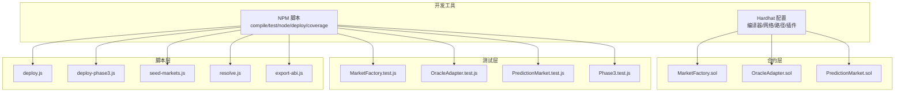
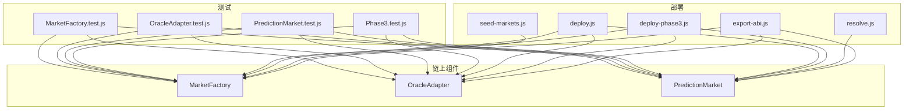
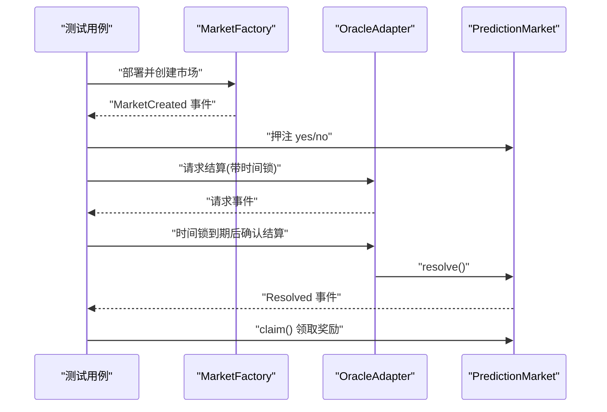
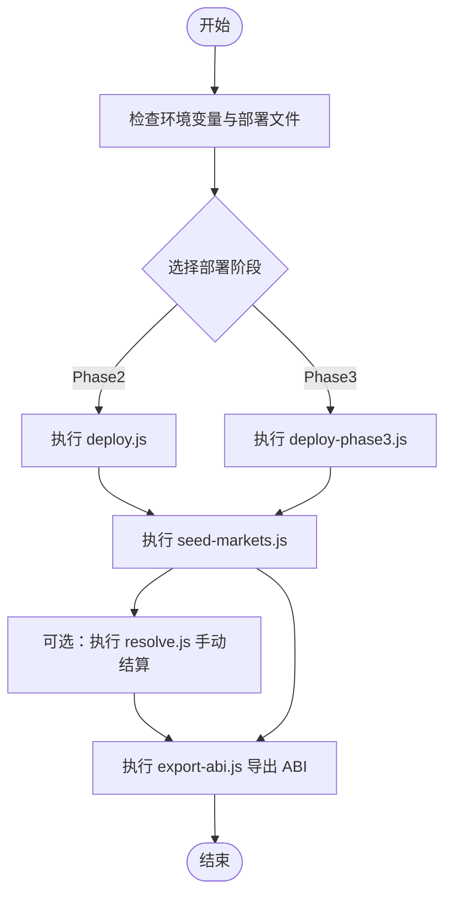
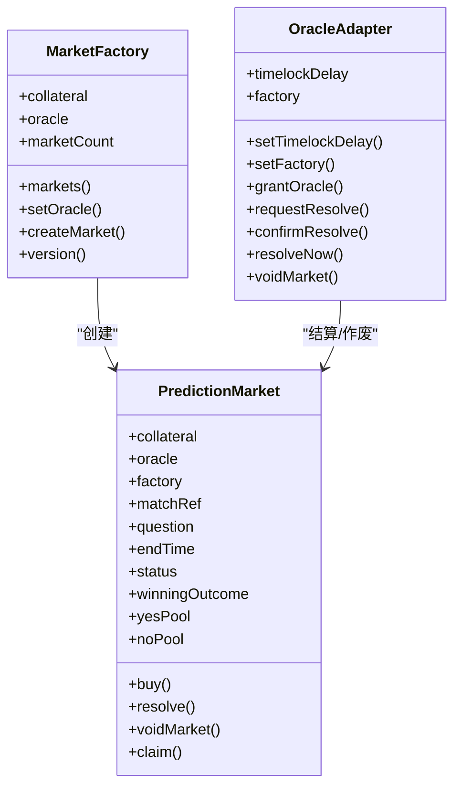
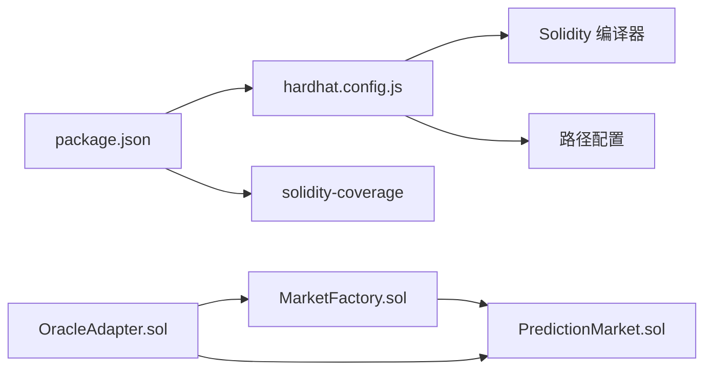

# 测试与部署

<cite>
**本文档引用的文件**
- [package.json](file://package.json)
- [hardhat.config.js](file://hardhat.config.js)
- [MarketFactory.test.js](file://test/MarketFactory.test.js)
- [OracleAdapter.test.js](file://test/OracleAdapter.test.js)
- [PredictionMarket.test.js](file://test/PredictionMarket.test.js)
- [Phase3.test.js](file://test/Phase3.test.js)
- [deploy.js](file://scripts/deploy.js)
- [deploy-phase3.js](file://scripts/deploy-phase3.js)
- [seed-markets.js](file://scripts/seed-markets.js)
- [resolve.js](file://scripts/resolve.js)
- [export-abi.js](file://scripts/export-abi.js)
- [MarketFactory.sol](file://contracts/MarketFactory.sol)
- [OracleAdapter.sol](file://contracts/OracleAdapter.sol)
- [PredictionMarket.sol](file://contracts/PredictionMarket.sol)
- [coverage.json](file://coverage.json)
</cite>

## 目录
1. [引言](#引言)
2. [项目结构](#项目结构)
3. [核心组件](#核心组件)
4. [架构总览](#架构总览)
5. [详细组件分析](#详细组件分析)
6. [依赖关系分析](#依赖关系分析)
7. [性能考虑](#性能考虑)
8. [故障排查指南](#故障排查指南)
9. [结论](#结论)
10. [附录](#附录)

## 引言
本文件面向开发者与运维人员，提供该预测市场智能合约项目的完整测试与部署指南。内容覆盖：
- 单元测试框架与测试用例设计思路、断言策略与覆盖率分析现状
- 部署脚本实现、环境变量与配置管理、本地开发与种子市场生成流程
- 生产部署建议、调试技巧与性能优化要点
- 常见问题与解决方案，帮助团队建立稳定的质量保证与交付流程

## 项目结构
该项目采用 Hardhat 工作区组织，核心目录与职责如下：
- contracts：Solidity 合约源码与接口定义
- test：Mocha + Chai 的单元测试套件
- scripts：部署、种子市场、结算与 ABI 导出等脚本
- artifacts/cache/coverage：编译产物、缓存与覆盖率报告
- hardhat.config.js：编译器、网络、路径与插件配置
- package.json：NPM 脚本与依赖声明

图表来源
- [hardhat.config.js:1-33](file://hardhat.config.js#L1-L33)
- [package.json:1-22](file://package.json#L1-L22)
- [MarketFactory.sol:1-68](file://contracts/MarketFactory.sol#L1-L68)
- [OracleAdapter.sol:1-96](file://contracts/OracleAdapter.sol#L1-L96)
- [PredictionMarket.sol:1-145](file://contracts/PredictionMarket.sol#L1-L145)
- [MarketFactory.test.js:1-31](file://test/MarketFactory.test.js#L1-L31)
- [OracleAdapter.test.js:1-53](file://test/OracleAdapter.test.js#L1-L53)
- [PredictionMarket.test.js:1-77](file://test/PredictionMarket.test.js#L1-L77)
- [Phase3.test.js:1-78](file://test/Phase3.test.js#L1-L78)
- [deploy.js:1-60](file://scripts/deploy.js#L1-L60)
- [deploy-phase3.js:1-46](file://scripts/deploy-phase3.js#L1-L46)
- [seed-markets.js:1-37](file://scripts/seed-markets.js#L1-L37)
- [resolve.js:1-22](file://scripts/resolve.js#L1-L22)
- [export-abi.js:1-77](file://scripts/export-abi.js#L1-L77)

章节来源
- [hardhat.config.js:1-33](file://hardhat.config.js#L1-L33)
- [package.json:1-22](file://package.json#L1-L22)

## 核心组件
- MarketFactory：负责创建二元预测市场，维护市场计数与映射，并发出创建事件；支持设置预言机地址。
- OracleAdapter：基于 AccessControl 的预言机适配器，提供带时间锁的结算请求/确认、即时结算与市场作废能力。
- PredictionMarket：二元预测市场，支持押注、结算、作废与奖励领取，内部使用 SafeERC20 进行代币安全转账。

章节来源
- [MarketFactory.sol:10-67](file://contracts/MarketFactory.sol#L10-L67)
- [OracleAdapter.sol:9-96](file://contracts/OracleAdapter.sol#L9-L96)
- [PredictionMarket.sol:9-145](file://contracts/PredictionMarket.sol#L9-L145)

## 架构总览
下图展示测试与部署的关键交互路径：测试通过 Hardhat 网络驱动，部署脚本连接本地节点，种子脚本批量创建市场，结算脚本用于手动结算，ABI 导出脚本分发至前后端。

图表来源
- [MarketFactory.test.js:1-31](file://test/MarketFactory.test.js#L1-L31)
- [OracleAdapter.test.js:1-53](file://test/OracleAdapter.test.js#L1-L53)
- [PredictionMarket.test.js:1-77](file://test/PredictionMarket.test.js#L1-L77)
- [Phase3.test.js:1-78](file://test/Phase3.test.js#L1-L78)
- [deploy.js:1-60](file://scripts/deploy.js#L1-L60)
- [deploy-phase3.js:1-46](file://scripts/deploy-phase3.js#L1-L46)
- [seed-markets.js:1-37](file://scripts/seed-markets.js#L1-L37)
- [resolve.js:1-22](file://scripts/resolve.js#L1-L22)
- [export-abi.js:1-77](file://scripts/export-abi.js#L1-L77)
- [MarketFactory.sol:10-67](file://contracts/MarketFactory.sol#L10-L67)
- [OracleAdapter.sol:9-96](file://contracts/OracleAdapter.sol#L9-L96)
- [PredictionMarket.sol:9-145](file://contracts/PredictionMarket.sol#L9-L145)

## 详细组件分析

### 测试框架与用例设计
- 测试运行：通过 NPM 脚本调用 Hardhat 测试引擎，使用 Mocha + Chai 断言与 @nomicfoundation/hardhat-network-helpers 提供的时间推进能力。
- 覆盖率：已集成 solidity-coverage 插件，可通过脚本生成 HTML 与 LCOV 报告，当前仓库包含基础覆盖率 JSON 与 HTML 输出目录。
- 测试范围：
  - MarketFactory：验证创建市场事件、市场计数与地址有效性
  - OracleAdapter：验证时间锁结算流程、作废市场退款机制
  - PredictionMarket：验证押注、结算与领取流程、失败者不可领取、重复领取拒绝、非预言机不可结算
  - Phase3：验证 CPMM 价格移动、多结果市场结算、多签阈值生效

图表来源
- [MarketFactory.test.js:8-29](file://test/MarketFactory.test.js#L8-L29)
- [OracleAdapter.test.js:8-27](file://test/OracleAdapter.test.js#L8-L27)
- [PredictionMarket.test.js:37-54](file://test/PredictionMarket.test.js#L37-L54)

章节来源
- [MarketFactory.test.js:1-31](file://test/MarketFactory.test.js#L1-L31)
- [OracleAdapter.test.js:1-53](file://test/OracleAdapter.test.js#L1-L53)
- [PredictionMarket.test.js:1-77](file://test/PredictionMarket.test.js#L1-L77)
- [Phase3.test.js:1-78](file://test/Phase3.test.js#L1-L78)
- [coverage.json:1-1](file://coverage.json#L1-L1)

### 部署脚本与环境配置
- 本地部署（Phase2）：部署 MockUSDC、OracleAdapter、DIDRegistry、MarketFactory，设置适配器工厂与预言机权限，铸造测试代币，输出部署信息 JSON。
- 本地部署（Phase3）：部署 MockUSDC、OracleAdapterV2、MarketFactoryV3，设置多签阈值与默认手续费，授予预言机权限，铸造更多测试代币，输出 Phase3 部署信息。
- 种子市场：读取本地部署信息，批量创建多个预测市场。
- 手动结算：通过环境变量传入市场地址与获胜结果，直接调用市场合约结算。
- ABI 导出：从 artifacts 读取各合约 ABI 与字节码，分别写入后端与前端目录，便于集成。

图表来源
- [deploy.js:6-53](file://scripts/deploy.js#L6-L53)
- [deploy-phase3.js:6-39](file://scripts/deploy-phase3.js#L6-L39)
- [seed-markets.js:6-30](file://scripts/seed-markets.js#L6-L30)
- [resolve.js:4-15](file://scripts/resolve.js#L4-L15)
- [export-abi.js:39-67](file://scripts/export-abi.js#L39-L67)

章节来源
- [deploy.js:1-60](file://scripts/deploy.js#L1-L60)
- [deploy-phase3.js:1-46](file://scripts/deploy-phase3.js#L1-L46)
- [seed-markets.js:1-37](file://scripts/seed-markets.js#L1-L37)
- [resolve.js:1-22](file://scripts/resolve.js#L1-L22)
- [export-abi.js:1-77](file://scripts/export-abi.js#L1-L77)

### 关键流程与类关系（代码级）

图表来源
- [MarketFactory.sol:12-67](file://contracts/MarketFactory.sol#L12-L67)
- [OracleAdapter.sol:11-96](file://contracts/OracleAdapter.sol#L11-L96)
- [PredictionMarket.sol:11-145](file://contracts/PredictionMarket.sol#L11-L145)

## 依赖关系分析
- 工具链依赖：@nomicfoundation/hardhat-toolbox、solidity-coverage、OpenZeppelin Contracts
- 网络与路径：Hardhat 内置网络与 localhost，路径指向 contracts/test/artifacts/cache
- 合约间耦合：MarketFactory 与 PredictionMarket 为一对多创建关系；OracleAdapter 作为预言机角色控制市场结算/作废；PredictionMarket 依赖 ERC20 安全转账

图表来源
- [hardhat.config.js:9-32](file://hardhat.config.js#L9-L32)
- [package.json:15-20](file://package.json#L15-L20)
- [MarketFactory.sol:6-8](file://contracts/MarketFactory.sol#L6-L8)
- [OracleAdapter.sol:6-7](file://contracts/OracleAdapter.sol#L6-L7)
- [PredictionMarket.sol:6-7](file://contracts/PredictionMarket.sol#L6-L7)

章节来源
- [hardhat.config.js:1-33](file://hardhat.config.js#L1-L33)
- [package.json:1-22](file://package.json#L1-L22)

## 性能考虑
- 编译优化：启用编译器优化器并设置合理 runs 次数，兼顾 gas 成本与可读性
- 测试效率：使用 Hardhat 时间推进工具减少等待；在测试中复用已部署的 MockUSDC 与适配器，避免重复部署开销
- 覆盖率：定期运行覆盖率以识别未覆盖分支，优先补齐关键路径测试
- 部署成本：批量种子市场与一次性铸造测试代币，降低多次部署带来的 gas 成本

## 故障排查指南
- 部署失败（找不到部署文件）
  - 症状：种子脚本报错提示先执行部署
  - 处理：先运行部署脚本，再执行种子脚本
  - 参考
    - [seed-markets.js:8-10](file://scripts/seed-markets.js#L8-L10)
- 非预言机结算失败
  - 症状：调用 resolve 报错“not oracle”
  - 处理：确保调用者拥有预言机角色或使用适配器进行请求/确认
  - 参考
    - [PredictionMarket.test.js:73-75](file://test/PredictionMarket.test.js#L73-L75)
- 时间锁未过期确认失败
  - 症状：confirmResolve 报错“timelock”
  - 处理：使用时间推进工具快进时间或调整部署时的时间锁
  - 参考
    - [OracleAdapter.test.js:22-25](file://test/OracleAdapter.test.js#L22-L25)
- 重复领取失败
  - 症状：claim 报错“already claimed”
  - 处理：确保用户仅领取一次，或在测试中重置状态
  - 参考
    - [PredictionMarket.test.js:65-70](file://test/PredictionMarket.test.js#L65-L70)
- ABI 导出失败
  - 症状：提示需先编译
  - 处理：先执行编译，再运行导出脚本
  - 参考
    - [export-abi.js:23-27](file://scripts/export-abi.js#L23-L27)

章节来源
- [seed-markets.js:8-10](file://scripts/seed-markets.js#L8-L10)
- [OracleAdapter.test.js:22-25](file://test/OracleAdapter.test.js#L22-L25)
- [PredictionMarket.test.js:65-70](file://test/PredictionMarket.test.js#L65-L70)
- [export-abi.js:23-27](file://scripts/export-abi.js#L23-L27)

## 结论
本项目提供了完善的测试与部署基础设施：清晰的测试用例覆盖核心业务流程，可靠的部署脚本支持本地开发与种子市场生成，以及便捷的 ABI 导出流程对接前后端。建议持续完善覆盖率、引入更丰富的边界与异常场景测试，并在 CI 中自动化执行测试与覆盖率检查，以保障质量与可维护性。

## 附录

### 测试最佳实践
- 使用 beforeEach 初始化常用合约与账户，减少重复代码
- 对关键流程（创建市场、押注、结算、领取）编写正反用例
- 使用时间推进工具模拟未来时间点，验证时间锁与截止时间逻辑
- 对多签与角色控制进行独立测试，确保权限最小化

### 调试技巧
- 在测试中打印中间状态（如余额、池大小、市场状态）
- 使用 Hardhat 控制台日志辅助定位问题
- 分离部署与测试步骤，逐步缩小问题范围

### 性能优化建议
- 合约层面：合并相近存储槽、避免重复读取全局状态
- 测试层面：批量部署与复用资源，减少网络往返
- 部署层面：合理设置时间锁与阈值，平衡安全性与效率

### 常用命令与配置
- 编译：npm run compile
- 运行测试：npm run test
- 启动本地节点：npm run node
- 本地部署 Phase2：npm run deploy:local
- 本地部署 Phase3：npm run deploy:local（切换脚本）
- 种子市场：npm run seed:local
- 手动结算：npm run resolve:local（需设置环境变量）
- 生成覆盖率：npm run coverage
- 导出 ABI：npm run export-abi

章节来源
- [package.json:5-14](file://package.json#L5-L14)