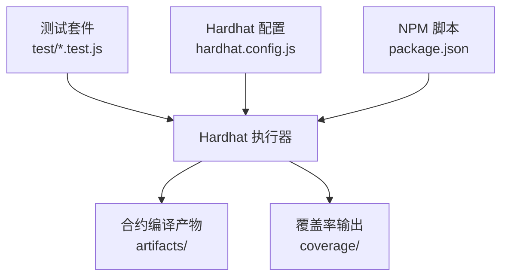
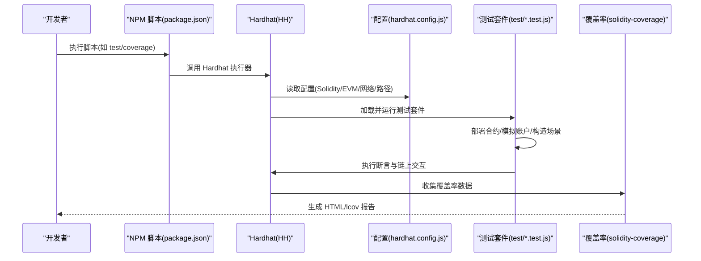
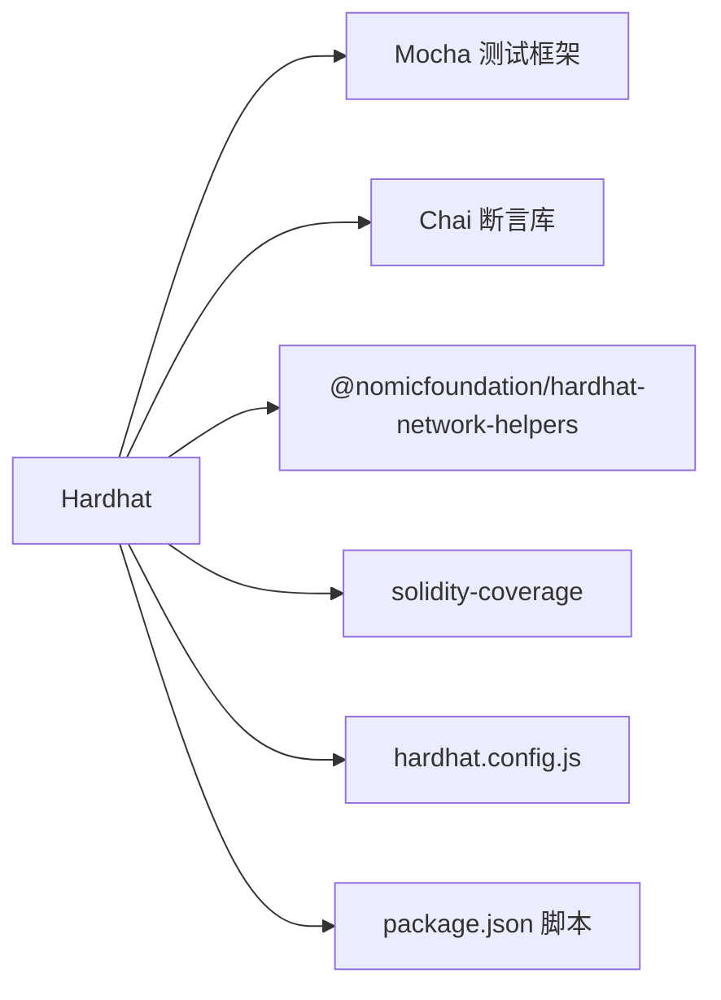

# 测试策略

<cite>
**本文档引用的文件**
- [MarketFactory.test.js](file://test/MarketFactory.test.js)
- [PredictionMarket.test.js](file://test/PredictionMarket.test.js)
- [OracleAdapter.test.js](file://test/OracleAdapter.test.js)
- [Phase3.test.js](file://test/Phase3.test.js)
- [package.json](file://package.json)
- [hardhat.config.js](file://hardhat.config.js)
- [coverage.json](file://coverage.json)
</cite>

## 目录
1. [引言](#引言)
2. [项目结构](#项目结构)
3. [核心组件](#核心组件)
4. [架构概览](#架构概览)
5. [详细组件分析](#详细组件分析)
6. [依赖分析](#依赖分析)
7. [性能考虑](#性能考虑)
8. [故障排查指南](#故障排查指南)
9. [结论](#结论)
10. [附录](#附录)

## 引言
本文件系统化梳理本项目的测试策略与实现，覆盖单元测试框架使用、测试用例设计原则、覆盖率分析工具、各合约测试覆盖范围（MarketFactory、PredictionMarket、Phase3、OracleAdapter）、测试最佳实践、断言方法与模拟技术、测试示例与调试技巧、测试环境配置与持续集成流程，以及性能测试与安全测试方法论。目标是帮助开发者在不直接阅读源码的情况下，快速理解并扩展测试体系。

## 项目结构
测试相关的关键文件与位置如下：
- 测试套件：位于 test/ 目录，包含 MarketFactory、PredictionMarket、OracleAdapter、Phase3 的测试文件
- 构建与测试脚本：通过 Hardhat 提供的脚本命令执行编译、测试、覆盖率统计与本地节点
- 配置：hardhat.config.js 定义 Solidity 版本、EVM 版本、优化参数、网络与路径等；package.json 提供 npm 脚本与依赖
- 覆盖率报告：coverage/ 目录生成 HTML 报告与 lcov 数据；coverage.json 提供基础覆盖率映射

图表来源
- [hardhat.config.js:1-33](file://hardhat.config.js#L1-L33)
- [package.json:1-22](file://package.json#L1-L22)

章节来源
- [hardhat.config.js:1-33](file://hardhat.config.js#L1-L33)
- [package.json:1-22](file://package.json#L1-L22)

## 核心组件
- 单元测试框架：基于 Mocha（由 Hardhat 集成）与 Chai 断言库，结合 Hardhat Network Helpers 进行时间推进与链上状态验证
- 测试账户管理：通过 Hardhat 提供的 signers 获取多账户，模拟管理员、预言机、参与者等角色
- 合约部署与交互：在测试中动态部署 MockUSDC、OracleAdapter、MarketFactory 及其变体，并进行跨合约交互
- 覆盖率工具：solidity-coverage 插件与 Hardhat 集成，生成 HTML 报告与 lcov 数据
- 持续集成：通过 npm 脚本统一入口，便于 CI 环境执行编译、测试与覆盖率统计

章节来源
- [MarketFactory.test.js:1-31](file://test/MarketFactory.test.js#L1-L31)
- [PredictionMarket.test.js:1-77](file://test/PredictionMarket.test.js#L1-L77)
- [OracleAdapter.test.js:1-53](file://test/OracleAdapter.test.js#L1-L53)
- [Phase3.test.js:1-78](file://test/Phase3.test.js#L1-L78)
- [package.json:1-22](file://package.json#L1-L22)
- [hardhat.config.js:1-33](file://hardhat.config.js#L1-L33)

## 架构概览
下图展示测试执行的总体流程：测试脚本通过 Hardhat 加载配置，动态部署合约，构造场景并断言结果；覆盖率工具在测试过程中收集语句、分支、函数级覆盖率数据。

图表来源
- [package.json:1-22](file://package.json#L1-L22)
- [hardhat.config.js:1-33](file://hardhat.config.js#L1-L33)
- [MarketFactory.test.js:1-31](file://test/MarketFactory.test.js#L1-L31)
- [PredictionMarket.test.js:1-77](file://test/PredictionMarket.test.js#L1-L77)
- [OracleAdapter.test.js:1-53](file://test/OracleAdapter.test.js#L1-L53)
- [Phase3.test.js:1-78](file://test/Phase3.test.js#L1-L78)

## 详细组件分析

### MarketFactory 测试策略
- 目标：验证市场工厂的部署、市场创建、事件触发与市场计数逻辑
- 关键断言：
  - 事件触发：创建市场应发出 MarketCreated 事件
  - 市场计数：创建后 marketCount 应递增
  - 市场地址：markets(index) 返回有效地址
  - 市场初始化：通过地址获取市场合约并验证初始状态（如问题）
- 最佳实践：
  - 使用 beforeEach 或在用例内按需部署 MockUSDC 与 OracleAdapter，确保最小依赖
  - 对时间参数（如截止时间）采用 time.latest() 并显式推进以控制场景
  - 使用 properAddress 断言验证返回地址有效性
- 示例参考
  - [MarketFactory 测试用例:8-29](file://test/MarketFactory.test.js#L8-L29)

章节来源
- [MarketFactory.test.js:1-31](file://test/MarketFactory.test.js#L1-L31)

### PredictionMarket 测试策略
- 目标：验证二元市场购入、结算、奖励领取、重复领取防护与非预言机权限控制
- 关键断言：
  - 购买行为：buy 成功更新 yes/no 池大小
  - 结算流程：预言机调用 resolve 后，市场状态变为已结算
  - 领取奖励：获胜者可领取全部池资金，失败者不可领取
  - 重复领取：已领取后再次 claim 应被拒绝
  - 权限控制：非预言机调用 resolve 应被拒绝
- 最佳实践：
  - 在 beforeEach 中完成部署、授权与初始资金注入，保证用例间隔离
  - 使用 approve(MaxUint256) 统一授权，避免单测中分散处理
  - 对金额使用 parseUnits 规范化，避免精度误差
- 示例参考
  - [二元市场购买与结算:37-54](file://test/PredictionMarket.test.js#L37-L54)
  - [失败者与重复领取断言:57-70](file://test/PredictionMarket.test.js#L57-L70)
  - [非预言机权限控制:73-75](file://test/PredictionMarket.test.js#L73-L75)

章节来源
- [PredictionMarket.test.js:1-77](file://test/PredictionMarket.test.js#L1-L77)

### OracleAdapter 测试策略
- 目标：验证预言机适配器的时间锁结算流程与作废市场的退款机制
- 关键断言：
  - 时间锁流程：requestResolve 后立即 confirmResolve 应被拒绝；时间推进后可成功结算
  - 多签阈值：根据阈值要求，仅部分批准不足以执行提案
  - 作废退款：voidMarket 后，参与者可领取押注金额
- 最佳实践：
  - 将时间锁参数与阈值参数作为测试变量，覆盖边界条件（0、1、阈值-1、阈值、阈值+1）
  - 在多签场景中，分步批准并检查提案状态变化
- 示例参考
  - [时间锁结算流程:8-27](file://test/OracleAdapter.test.js#L8-L27)
  - [作废市场退款:29-51](file://test/OracleAdapter.test.js#L29-L51)

章节来源
- [OracleAdapter.test.js:1-53](file://test/OracleAdapter.test.js#L1-L53)

### Phase3 测试策略
- 目标：验证第三阶段 CPMM（常数函数市场_maker）的价格移动、多结果市场结算与多签阈值
- 关键断言：
  - CPMM 购买推动价格：buy 后通过 getPoolState 获取价格，验证“是”方价格高于基准
  - 多结果市场结算：proposeResolve 后，参与者可领取奖励且余额增加
  - 多签阈值：仅部分批准不足以执行，达到阈值后提案才可执行
- 最佳实践：
  - 在 V3 工厂中注入初始流动性，确保价格曲线存在
  - 对多结果市场，分别对不同结果进行购入，验证结算逻辑
- 示例参考
  - [CPMM 价格移动:8-29](file://test/Phase3.test.js#L8-L29)
  - [多结果市场结算:32-53](file://test/Phase3.test.js#L32-L53)
  - [多签阈值:55-76](file://test/Phase3.test.js#L55-L76)

章节来源
- [Phase3.test.js:1-78](file://test/Phase3.test.js#L1-L78)

### 测试断言与模拟技术
- 断言库：Chai 提供 expect 断言风格，支持事件、错误、地址、数值比较
- 时间推进：@nomicfoundation/hardhat-network-helpers 提供 time.latest() 与 time.increase()，用于控制区块时间
- 合约交互：通过 ethers.getContractAt 获取已部署合约实例，模拟多账户进行授权与调用
- 场景构建：在 beforeEach 中集中部署 MockUSDC、OracleAdapter、MarketFactory/V3，并完成初始授权与资金注入

章节来源
- [MarketFactory.test.js:1-31](file://test/MarketFactory.test.js#L1-L31)
- [PredictionMarket.test.js:1-77](file://test/PredictionMarket.test.js#L1-L77)
- [OracleAdapter.test.js:1-53](file://test/OracleAdapter.test.js#L1-L53)
- [Phase3.test.js:1-78](file://test/Phase3.test.js#L1-L78)

### 测试示例与调试技巧
- 事件断言：使用 .to.emit(...) 验证事件是否触发
- 错误断言：使用 .to.be.revertedWith("...") 验证特定错误消息
- 地址断言：使用 .to.properAddress 验证返回地址合法性
- 数值断言：使用 .to.equal、.to.be.gt 等比较数值或比例
- 调试建议：
  - 在复杂场景中拆分用例，逐步推进状态
  - 使用 console.log 输出中间状态（如余额、池大小），但注意在 CI 中清理
  - 对时间锁与阈值场景，明确推进时间与批准步骤，确保断言顺序正确

章节来源
- [MarketFactory.test.js:1-31](file://test/MarketFactory.test.js#L1-L31)
- [PredictionMarket.test.js:1-77](file://test/PredictionMarket.test.js#L1-L77)
- [OracleAdapter.test.js:1-53](file://test/OracleAdapter.test.js#L1-L53)
- [Phase3.test.js:1-78](file://test/Phase3.test.js#L1-L78)

## 依赖分析
- 测试框架：Mocha（由 Hardhat 集成）+ Chai（断言）
- 网络辅助：@nomicfoundation/hardhat-network-helpers（时间推进）
- 覆盖率：solidity-coverage（与 Hardhat 集成）
- 配置与脚本：Hardhat 配置文件定义 Solidity 版本、EVM 版本、优化参数与网络路径；package.json 提供统一脚本入口

图表来源
- [hardhat.config.js:1-33](file://hardhat.config.js#L1-L33)
- [package.json:1-22](file://package.json#L1-L22)

章节来源
- [hardhat.config.js:1-33](file://hardhat.config.js#L1-L33)
- [package.json:1-22](file://package.json#L1-L22)

## 性能考虑
- 测试执行性能：
  - 合理复用部署：在单个 describe 中共享已部署合约实例，减少重复部署开销
  - 控制时间推进：仅在必要时使用 time.increase，避免过度推进导致测试缓慢
  - 并行用例：确保用例之间无共享状态，避免并发带来的不确定性
- 覆盖率成本：
  - 优化器 runs 参数已在配置中设定，平衡编译速度与运行效率
  - 覆盖率工具会增加执行时间，建议在 CI 中按需开启

## 故障排查指南
- 常见问题与定位：
  - 事件未触发：检查调用参数与合约内部事件发出逻辑，使用 .to.emit(...) 明确断言
  - 权限错误：确认调用者是否具备相应角色（如预言机），检查授权流程
  - 时间锁未生效：确保在请求后推进足够时间，再进行确认
  - 多签未满足阈值：逐个批准并检查提案状态，确认阈值计算逻辑
- 调试建议：
  - 在关键步骤打印中间状态（如余额、池大小、市场状态）
  - 将复杂场景拆分为多个小用例，逐步缩小问题范围
  - 使用 Hardhat Node 在本地快速迭代与调试

章节来源
- [PredictionMarket.test.js:1-77](file://test/PredictionMarket.test.js#L1-L77)
- [OracleAdapter.test.js:1-53](file://test/OracleAdapter.test.js#L1-L53)
- [Phase3.test.js:1-78](file://test/Phase3.test.js#L1-L78)

## 结论
本项目的测试策略以 Hardhat 为核心，结合 Chai 断言与网络时间辅助，覆盖了市场工厂、二元市场、预言机适配器及第三阶段功能的主要业务流程。通过清晰的断言方法、合理的场景拆分与多签/时间锁边界测试，能够有效保障合约逻辑正确性与安全性。建议在后续迭代中进一步完善覆盖率报告解读与 CI 集成，持续提升测试质量与效率。

## 附录

### 测试环境配置与持续集成流程
- 本地开发：
  - 使用 Hardhat Node 启动本地网络，配合脚本进行部署与播种
  - 执行测试与覆盖率统计，查看 coverage/ 与 lcov 报告
- CI 集成：
  - 通过 npm 脚本统一入口，先编译，再执行测试，最后生成覆盖率报告
  - 建议在 CI 中缓存依赖与编译产物，缩短流水线时间

章节来源
- [package.json:1-22](file://package.json#L1-L22)
- [hardhat.config.js:1-33](file://hardhat.config.js#L1-L33)

### 覆盖率分析工具使用
- 生成覆盖率：
  - 使用 npm 脚本执行覆盖率统计，生成 HTML 报告与 lcov 数据
- 解读覆盖率：
  - 关注语句、分支与函数覆盖率，优先补齐低覆盖率区域
  - 结合 coverage.json 与 HTML 报告定位具体行号与函数

章节来源
- [package.json:1-22](file://package.json#L1-L22)
- [coverage.json:1-1](file://coverage.json#L1-L1)