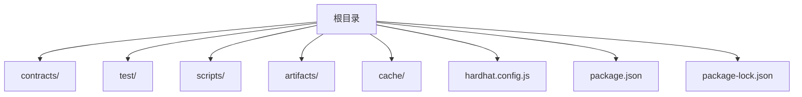
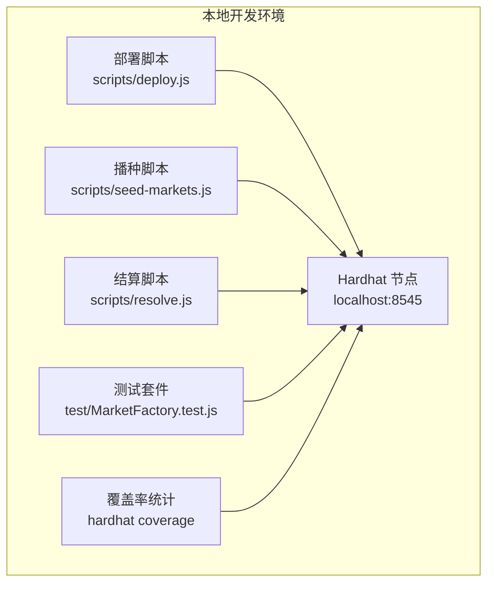
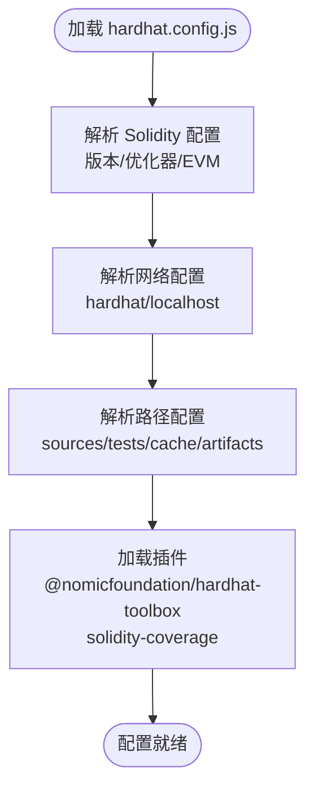
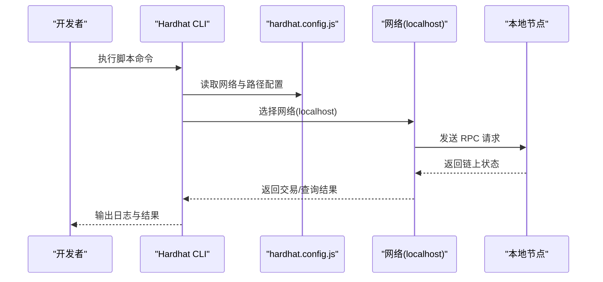
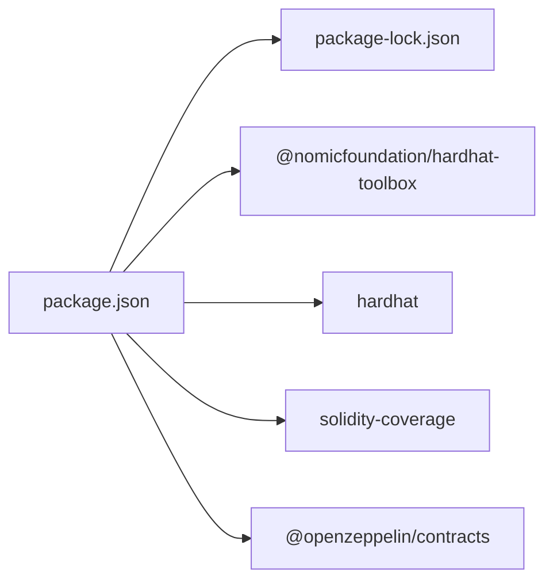
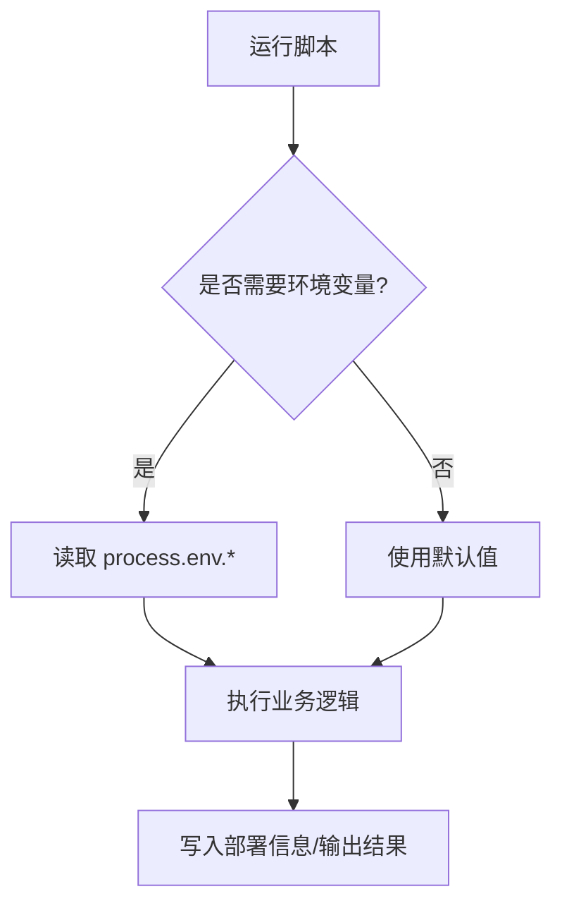
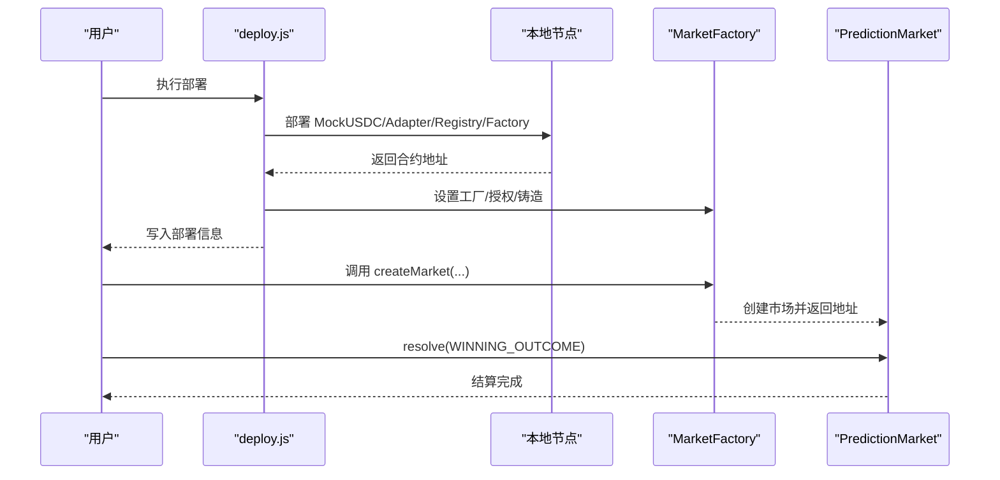
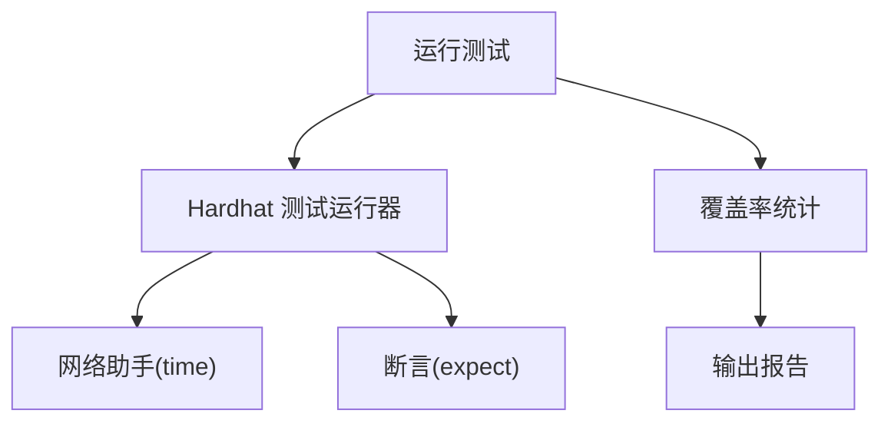
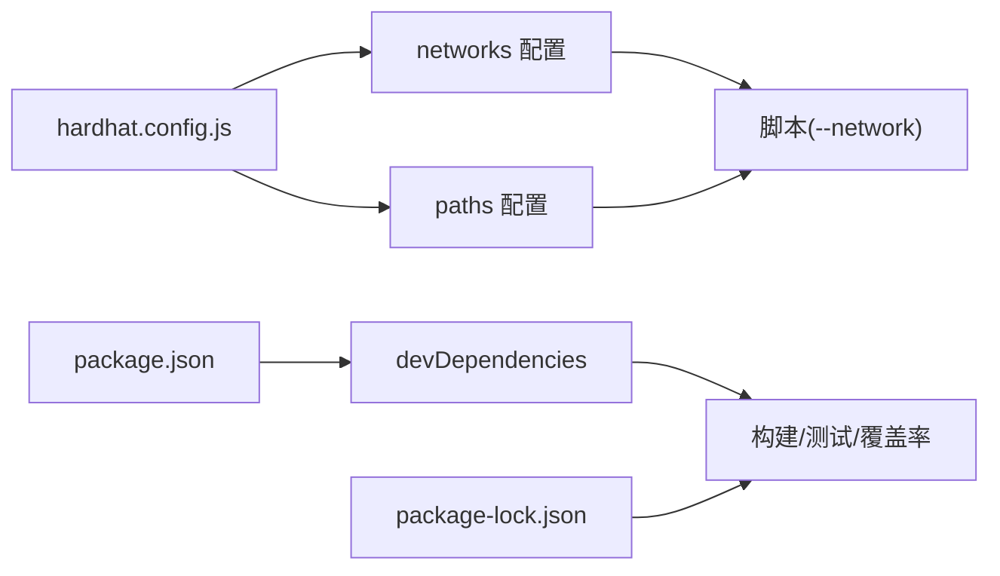

# 环境配置

<cite>
**本文档引用的文件**
- [hardhat.config.js](file://hardhat.config.js)
- [package.json](file://package.json)
- [package-lock.json](file://package-lock.json)
- [deploy.js](file://scripts/deploy.js)
- [deploy-phase3.js](file://scripts/deploy-phase3.js)
- [seed-markets.js](file://scripts/seed-markets.js)
- [resolve.js](file://scripts/resolve.js)
- [MarketFactory.test.js](file://test/MarketFactory.test.js)
</cite>

## 目录
1. [简介](#简介)
2. [项目结构](#项目结构)
3. [核心组件](#核心组件)
4. [架构总览](#架构总览)
5. [详细组件分析](#详细组件分析)
6. [依赖关系分析](#依赖关系分析)
7. [性能考虑](#性能考虑)
8. [故障排除指南](#故障排除指南)
9. [结论](#结论)
10. [附录](#附录)

## 简介
本文件面向 PredictionDIDSimple 项目的环境配置与链上环境搭建，围绕 Hardhat 配置文件、网络参数、链上环境差异、依赖包管理与版本控制、环境变量设置、部署与验证流程、以及多网络与自定义网络扩展进行系统化说明。目标是帮助开发者在开发、测试与生产环境中快速、稳定地完成本地链上环境的搭建与验证。

## 项目结构
该项目采用基于 Hardhat 的以太坊智能合约开发工作流，主要目录与文件如下：
- 根配置：hardhat.config.js（Hardhat 配置）
- 包管理：package.json（脚本与依赖）、package-lock.json（锁定依赖）
- 合约与接口：contracts/
- 测试：test/
- 编译产物：artifacts/
- 缓存：cache/
- 脚本：scripts/（部署、播种、结算等）

**图表来源**
- [hardhat.config.js:1-33](file://hardhat.config.js#L1-L33)
- [package.json:1-22](file://package.json#L1-L22)

**章节来源**
- [hardhat.config.js:1-33](file://hardhat.config.js#L1-L33)
- [package.json:1-22](file://package.json#L1-L22)

## 核心组件
本节聚焦于环境配置的关键要素：Solidity 编译器、网络配置、路径映射、脚本命令与环境变量。

- Solidity 编译器配置
  - 版本：0.8.24
  - 优化器：启用，运行次数 200 次
  - EVM 版本：Cancun
- 网络配置
  - Hardhat 内置网络：链 ID 31337
  - 本地网络（localhost）：RPC 地址 http://127.0.0.1:8545，链 ID 31337
- 路径配置
  - 源码目录：./contracts
  - 测试目录：./test
  - 缓存目录：./cache
  - 编译产物目录：./artifacts
- 脚本命令
  - 编译：hardhat compile
  - 运行测试：hardhat test
  - 启动本地节点：hardhat node
  - 部署到本地：hardhat run scripts/deploy.js --network localhost
  - 种植市场：hardhat run scripts/seed-markets.js --network localhost
  - 结算市场：hardhat run scripts/resolve.js --network localhost
  - 代码覆盖率：hardhat coverage
  - 导出 ABI：node scripts/export-abi.js

**章节来源**
- [hardhat.config.js:9-32](file://hardhat.config.js#L9-L32)
- [package.json:5-14](file://package.json#L5-L14)

## 架构总览
下图展示了本地开发与测试的典型流程：通过 Hardhat 启动本地节点，使用脚本进行部署与播种，随后运行测试与覆盖率统计。

**图表来源**
- [hardhat.config.js:17-25](file://hardhat.config.js#L17-L25)
- [package.json:5-14](file://package.json#L5-L14)
- [deploy.js:1-60](file://scripts/deploy.js#L1-L60)
- [seed-markets.js:1-37](file://scripts/seed-markets.js#L1-L37)
- [resolve.js:1-22](file://scripts/resolve.js#L1-L22)
- [MarketFactory.test.js:1-31](file://test/MarketFactory.test.js#L1-L31)

## 详细组件分析

### Hardhat 配置文件分析
- 配置对象结构
  - solidity：指定编译器版本、优化器与 EVM 版本
  - networks：定义内置网络与本地网络，含链 ID 与 RPC 地址
  - paths：定义源码、测试、缓存与产物目录
- 插件集成
  - @nomicfoundation/hardhat-toolbox：提供 Hardhat 生态常用工具
  - solidity-coverage：用于生成 Solidity 代码覆盖率报告

**图表来源**
- [hardhat.config.js:9-32](file://hardhat.config.js#L9-L32)

**章节来源**
- [hardhat.config.js:1-33](file://hardhat.config.js#L1-L33)

### 网络参数与链上环境配置
- Hardhat 内置网络
  - 用途：本地快速启动与测试
  - 链 ID：31337
- 本地网络（localhost）
  - 用途：连接外部本地节点（如 Hardhat Node 或其他本地 RPC）
  - RPC 地址：http://127.0.0.1:8545
  - 链 ID：31337
- 开发、测试与生产环境差异
  - 开发环境：使用 localhost 网络，配合脚本进行快速迭代
  - 测试环境：使用 Hardhat 内置网络，确保确定性与可重复性
  - 生产环境：需替换为实际 RPC 提供商（如 Infura、Alchemy），并配置私钥或硬件钱包

**图表来源**
- [hardhat.config.js:17-25](file://hardhat.config.js#L17-L25)
- [package.json:5-14](file://package.json#L5-L14)

**章节来源**
- [hardhat.config.js:17-25](file://hardhat.config.js#L17-L25)

### 依赖包管理与版本控制
- 依赖项
  - @nomicfoundation/hardhat-toolbox：包含 Hardhat 生态常用工具
  - hardhat：核心框架
  - solidity-coverage：覆盖率统计
  - @openzeppelin/contracts：OpenZeppelin 合约库
- 锁定文件
  - package-lock.json 确保安装一致的依赖树，避免版本漂移

**图表来源**
- [package.json:15-20](file://package.json#L15-L20)
- [package-lock.json:1-16](file://package-lock.json#L1-L16)

**章节来源**
- [package.json:1-22](file://package.json#L1-L22)
- [package-lock.json:1-16](file://package-lock.json#L1-L16)

### 环境变量设置与脚本交互
- 部署脚本（第二阶段）
  - ORACLE_TIMELOCK_SECONDS：预言机时间锁延迟（默认 120 秒）
- 部署脚本（第三阶段）
  - ORACLE_MULTISIG_THRESHOLD：多签阈值（默认 2）
  - DEFAULT_FEE_BPS：默认手续费（默认 30 基点）
- 结算脚本
  - MARKET_ADDRESS：市场合约地址
  - WINNING_OUTCOME：获胜结果（0/1）

**图表来源**
- [deploy.js:7-8](file://scripts/deploy.js#L7-L8)
- [deploy-phase3.js:8-9](file://scripts/deploy-phase3.js#L8-L9)
- [resolve.js:5-6](file://scripts/resolve.js#L5-L6)

**章节来源**
- [deploy.js:7-8](file://scripts/deploy.js#L7-L8)
- [deploy-phase3.js:8-9](file://scripts/deploy-phase3.js#L8-L9)
- [resolve.js:5-6](file://scripts/resolve.js#L5-L6)

### 部署与验证流程
- 部署流程（第二阶段）
  - 部署 MockUSDC、OracleAdapter、DIDRegistry、MarketFactory
  - 设置工厂地址、授予预言机权限、铸造测试代币
  - 输出部署信息至 deployments.local.json
- 种植市场流程
  - 读取部署信息，调用工厂创建多个市场
- 结算流程
  - 通过环境变量传入市场地址与获胜结果，调用市场合约结算

**图表来源**
- [deploy.js:11-32](file://scripts/deploy.js#L11-L32)
- [seed-markets.js:12-28](file://scripts/seed-markets.js#L12-L28)
- [resolve.js:10-14](file://scripts/resolve.js#L10-L14)

**章节来源**
- [deploy.js:1-60](file://scripts/deploy.js#L1-L60)
- [seed-markets.js:1-37](file://scripts/seed-markets.js#L1-L37)
- [resolve.js:1-22](file://scripts/resolve.js#L1-L22)

### 测试与覆盖率
- 测试框架
  - 使用 Hardhat 集成的测试运行器与 @nomicfoundation/hardhat-network-helpers 提供的时间辅助工具
- 覆盖率
  - 通过 hardhat coverage 生成 Solidity 代码覆盖率报告

**图表来源**
- [MarketFactory.test.js:1-31](file://test/MarketFactory.test.js#L1-L31)
- [package.json:12](file://package.json#L12)

**章节来源**
- [MarketFactory.test.js:1-31](file://test/MarketFactory.test.js#L1-L31)
- [package.json:12](file://package.json#L12)

## 依赖关系分析
- 配置对脚本的影响
  - hardhat.config.js 中的 networks 与 paths 影响脚本执行的网络选择与资源定位
- 依赖对构建的影响
  - package.json 与 package-lock.json 共同保证构建一致性与可复现性

**图表来源**
- [hardhat.config.js:17-31](file://hardhat.config.js#L17-L31)
- [package.json:15-20](file://package.json#L15-L20)
- [package-lock.json:1-16](file://package-lock.json#L1-L16)

**章节来源**
- [hardhat.config.js:17-31](file://hardhat.config.js#L17-L31)
- [package.json:15-20](file://package.json#L15-L20)
- [package-lock.json:1-16](file://package-lock.json#L1-L16)

## 性能考虑
- 编译器优化
  - 启用优化器并设置合理的 runs 次数，可在编译时减少字节码大小，降低部署成本
- EVM 版本
  - 使用较新的 EVM 版本（如 Cancun）可获得更好的 gas 优化与新特性支持
- 路径与缓存
  - 合理设置 paths 可减少不必要的文件扫描与 IO；利用 cache 目录提升二次编译速度
- 测试与覆盖率
  - 在 CI 中分阶段运行测试与覆盖率，避免长时间阻塞

## 故障排除指南
- 无法连接本地节点
  - 确认 hardhat.config.js 中 localhost.url 是否正确指向本地 RPC
  - 确认本地节点已启动且端口未被占用
- 部署脚本报错
  - 检查环境变量是否正确设置（如 ORACLE_TIMELOCK_SECONDS、ORACLE_MULTISIG_THRESHOLD、DEFAULT_FEE_BPS、MARKET_ADDRESS、WINNING_OUTCOME）
- 测试失败
  - 使用 Hardhat 内置网络确保确定性；检查时间戳与区块信息是否按预期推进
- 依赖安装异常
  - 清理 node_modules 并重新安装，确保 package-lock.json 与 package.json 一致

**章节来源**
- [hardhat.config.js:21-24](file://hardhat.config.js#L21-L24)
- [deploy.js:7-8](file://scripts/deploy.js#L7-L8)
- [deploy-phase3.js:8-9](file://scripts/deploy-phase3.js#L8-L9)
- [resolve.js:7-9](file://scripts/resolve.js#L7-L9)
- [MarketFactory.test.js:1-31](file://test/MarketFactory.test.js#L1-L31)

## 结论
本项目通过清晰的 Hardhat 配置、明确的网络参数与路径映射、规范的脚本命令与环境变量约定，实现了从开发到测试再到生产的可重复、可验证的链上环境。建议在生产环境中替换为真实 RPC 提供商，并完善密钥与安全策略；同时保持配置文件与依赖锁文件的一致性，确保团队协作与持续集成的稳定性。

## 附录
- 多网络支持与自定义网络配置
  - 在 networks 中新增网络条目，设置 url 与 chainId 即可扩展到更多本地或公共网络
  - 对于不同网络，可通过脚本中的 --network 参数切换
- 环境变量清单
  - ORACLE_TIMELOCK_SECONDS：第二阶段部署的预言机时间锁延迟
  - ORACLE_MULTISIG_THRESHOLD：第三阶段部署的多签阈值
  - DEFAULT_FEE_BPS：第三阶段部署的默认手续费（基点）
  - MARKET_ADDRESS：结算脚本的目标市场地址
  - WINNING_OUTCOME：结算脚本的获胜结果（0/1）

**章节来源**
- [hardhat.config.js:17-25](file://hardhat.config.js#L17-L25)
- [deploy.js:7-8](file://scripts/deploy.js#L7-L8)
- [deploy-phase3.js:8-9](file://scripts/deploy-phase3.js#L8-L9)
- [resolve.js:5-6](file://scripts/resolve.js#L5-L6)