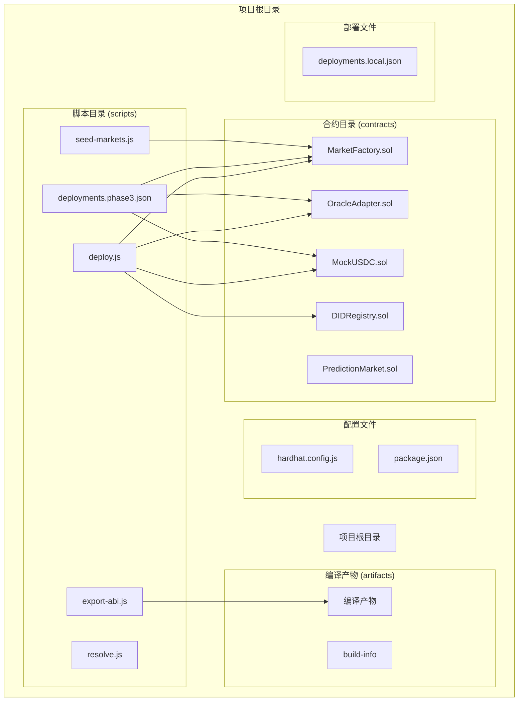
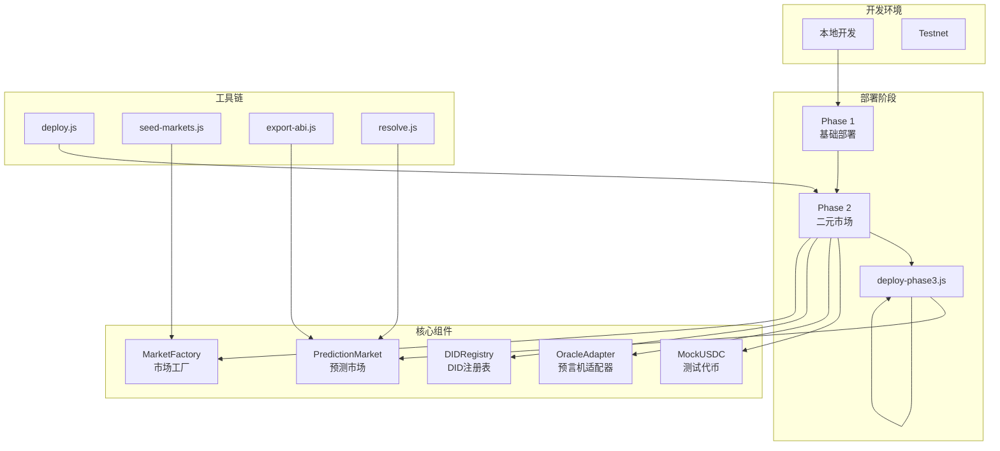
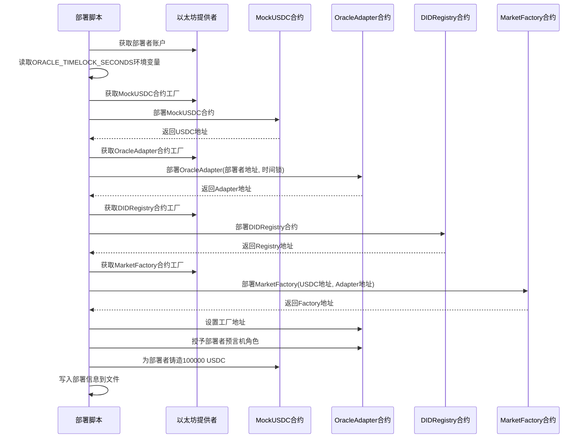
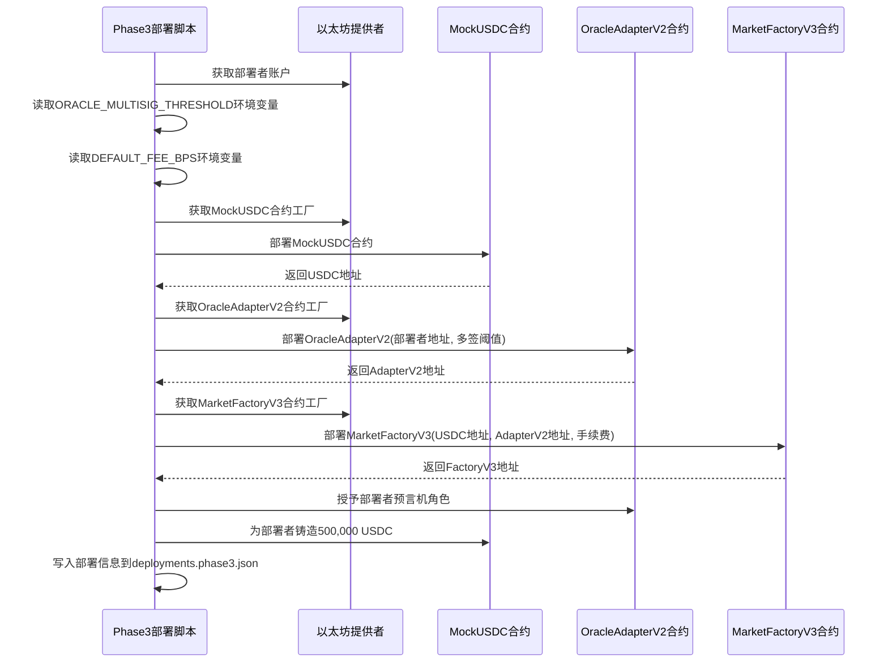
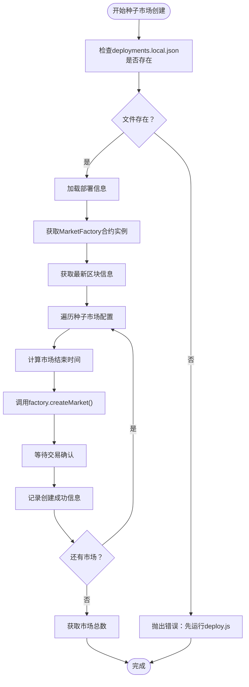
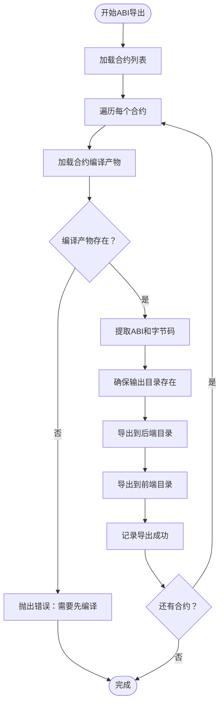
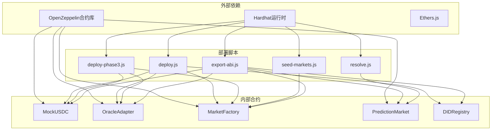
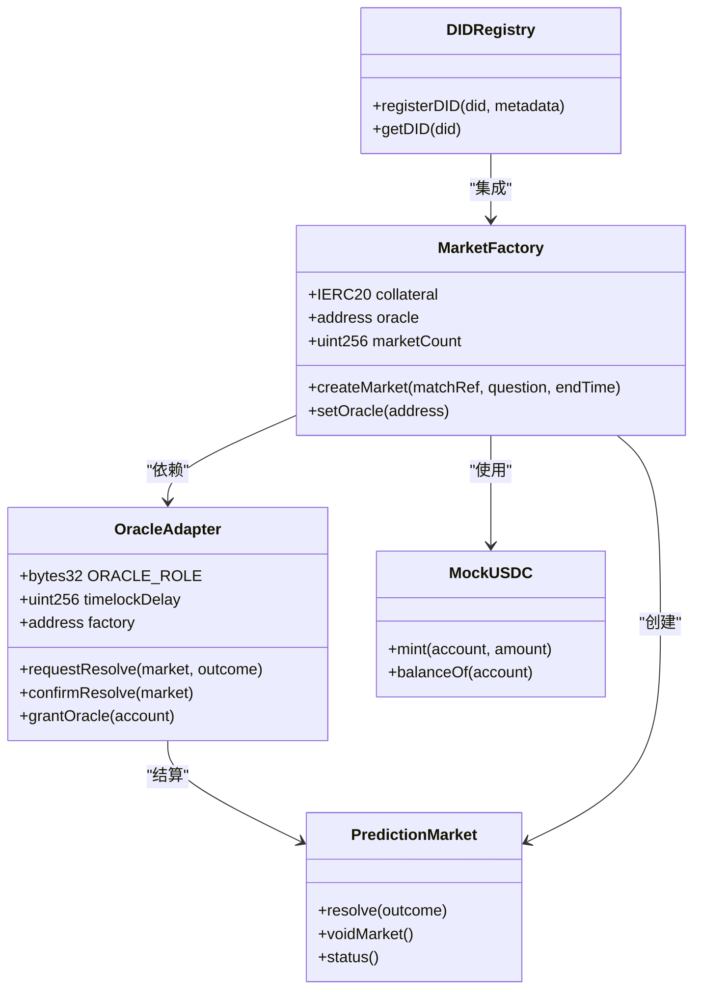
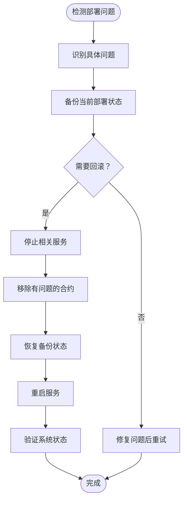

# 部署脚本

<cite>
**本文档引用的文件**
- [deploy.js](file://scripts/deploy.js)
- [deploy-phase3.js](file://scripts/deploy-phase3.js)
- [seed-markets.js](file://scripts/seed-markets.js)
- [export-abi.js](file://scripts/export-abi.js)
- [resolve.js](file://scripts/resolve.js)
- [hardhat.config.js](file://hardhat.config.js)
- [package.json](file://package.json)
- [MarketFactory.sol](file://contracts/MarketFactory.sol)
- [OracleAdapter.sol](file://contracts/OracleAdapter.sol)
</cite>

## 目录
1. [简介](#简介)
2. [项目结构](#项目结构)
3. [核心组件](#核心组件)
4. [架构概览](#架构概览)
5. [详细组件分析](#详细组件分析)
6. [依赖关系分析](#依赖关系分析)
7. [性能考虑](#性能考虑)
8. [故障排除指南](#故障排除指南)
9. [结论](#结论)
10. [附录](#附录)

## 简介

本文档为PredictionDIDSimple项目的部署脚本提供了全面的技术文档。该系统包含四个主要的部署脚本：`deploy.js`、`deploy-phase3.js`、`seed-markets.js`和`export-abi.js`，以及一个辅助的结算脚本`resolve.js`。这些脚本构成了从开发环境到生产环境的完整部署流程，支持二元预测市场的部署、种子市场的创建、ABI导出以及合约地址管理。

项目基于Hardhat框架构建，使用Solidity 0.8.24编写，采用OpenZeppelin合约库实现标准的访问控制和安全功能。部署脚本支持多种部署阶段，从基础的二元预测市场部署到高级的多结果市场部署，并提供了完整的开发工具链支持。

## 项目结构

PredictionDIDSimple项目采用模块化结构，主要包含以下关键目录和文件：



**图表来源**
- [deploy.js:1-60](file://scripts/deploy.js#L1-L60)
- [deploy-phase3.js:1-46](file://scripts/deploy-phase3.js#L1-L46)
- [export-abi.js:1-77](file://scripts/export-abi.js#L1-L77)

**章节来源**
- [hardhat.config.js:1-33](file://hardhat.config.js#L1-L33)
- [package.json:1-22](file://package.json#L1-L22)

## 核心组件

### 部署脚本概述

项目包含四个核心部署脚本，每个脚本都有特定的功能和用途：

1. **deploy.js** - 第二阶段部署脚本，负责部署基础的二元预测市场基础设施
2. **deploy-phase3.js** - 第三阶段部署脚本，部署高级的多结果市场功能
3. **seed-markets.js** - 种子市场创建脚本，用于批量创建初始市场
4. **export-abi.js** - ABI导出脚本，负责将合约ABI导出到前后端应用

### 环境配置

项目使用环境变量进行配置管理，支持灵活的部署参数调整：

| 环境变量 | 默认值 | 用途 | 适用脚本 |
|---------|--------|------|----------|
| ORACLE_TIMELOCK_SECONDS | 120 | 预言机时间锁延迟（秒） | deploy.js |
| ORACLE_MULTISIG_THRESHOLD | 2 | 多签阈值 | deploy-phase3.js |
| DEFAULT_FEE_BPS | 30 | 默认手续费（基点） | deploy-phase3.js |
| MARKET_ADDRESS | - | 市场合约地址 | resolve.js |
| WINNING_OUTCOME | - | 获胜结果（0/1） | resolve.js |

**章节来源**
- [deploy.js:8-8](file://scripts/deploy.js#L8-L8)
- [deploy-phase3.js:8-9](file://scripts/deploy-phase3.js#L8-L9)
- [resolve.js:5-6](file://scripts/resolve.js#L5-L6)

## 架构概览

PredictionDIDSimple的部署架构采用分层设计，支持从开发到生产的完整部署流程：



**图表来源**
- [deploy.js:11-29](file://scripts/deploy.js#L11-L29)
- [deploy-phase3.js:11-21](file://scripts/deploy-phase3.js#L11-L21)

## 详细组件分析

### deploy.js - 第二阶段部署脚本

deploy.js是项目的核心部署脚本，负责部署基础的二元预测市场基础设施。该脚本按照严格的顺序部署合约，并进行必要的初始化配置。

#### 部署流程



**图表来源**
- [deploy.js:6-53](file://scripts/deploy.js#L6-L53)

#### 关键特性

1. **时间锁机制**：通过`ORACLE_TIMELOCK_SECONDS`环境变量控制预言机结算的时间延迟
2. **权限管理**：自动授予部署者预言机角色和工厂合约的所有权
3. **测试代币**：为部署者铸造100,000个MockUSDC代币用于测试
4. **部署信息持久化**：将所有合约地址和配置信息写入`deployments.local.json`文件

#### 参数配置

| 参数 | 类型 | 默认值 | 描述 |
|------|------|--------|------|
| deployer.address | 地址 | 自动获取 | 部署者的以太坊地址 |
| timelock | 整数 | 120秒 | 预言机结算时间锁延迟 |
| usdcAddr | 地址 | 自动生成 | MockUSDC合约地址 |
| adapterAddr | 地址 | 自动生成 | OracleAdapter合约地址 |
| registryAddr | 地址 | 自动生成 | DIDRegistry合约地址 |
| factoryAddr | 地址 | 自动生成 | MarketFactory合约地址 |

**章节来源**
- [deploy.js:6-53](file://scripts/deploy.js#L6-L53)

### deploy-phase3.js - 第三阶段部署脚本

deploy-phase3.js专注于部署高级的多结果市场功能，支持更复杂的预测场景。

#### 部署流程



**图表来源**
- [deploy-phase3.js:6-39](file://scripts/deploy-phase3.js#L6-L39)

#### 新增功能

1. **多签支持**：通过`ORACLE_MULTISIG_THRESHOLD`实现多签预言机机制
2. **费用系统**：支持`DEFAULT_FEE_BPS`配置，默认30基点手续费
3. **升级兼容性**：部署MarketFactoryV3和OracleAdapterV2合约
4. **增强的测试能力**：为部署者提供500,000个测试代币

**章节来源**
- [deploy-phase3.js:6-39](file://scripts/deploy-phase3.js#L6-L39)

### seed-markets.js - 种子市场创建脚本

seed-markets.js用于批量创建初始的预测市场，为系统提供测试数据和演示内容。

#### 市场配置

脚本预定义了三个种子市场，涵盖2026年世界杯半决赛和决赛场景：

| 市场ID | 问题描述 | 预测期限 | 参考标识 |
|--------|----------|----------|----------|
| wc-2026-semi-001 | 阿根廷在90分钟内获胜？ | 14天 | Argentina wins in 90 min? |
| wc-2026-semi-002 | 法国在90分钟内获胜？ | 14天 | France wins in 90 min? |
| wc-2026-final-001 | 决赛进球超过2.5个？ | 21天 | Over 2.5 goals in final? |

#### 部署流程



**图表来源**
- [seed-markets.js:6-30](file://scripts/seed-markets.js#L6-L30)

**章节来源**
- [seed-markets.js:6-30](file://scripts/seed-markets.js#L6-L30)

### export-abi.js - ABI导出脚本

export-abi.js负责将合约的ABI（应用程序二进制接口）导出到前后端应用，确保各层能够正确交互。

#### 支持的合约列表

脚本支持导出以下合约的ABI：

1. **MarketFactory** - 基础市场工厂
2. **PredictionMarket** - 二元预测市场
3. **MockUSDC** - 测试USDC代币
4. **OracleAdapter** - 预言机适配器
5. **DIDRegistry** - DID注册表
6. **MarketFactoryV3** - 高级市场工厂V3
7. **PredictionMarketV3** - 高级预测市场V3
8. **MultiOutcomeMarket** - 多结果市场
9. **OracleAdapterV2** - 预言机适配器V2

#### 导出流程



**图表来源**
- [export-abi.js:21-74](file://scripts/export-abi.js#L21-L74)

#### 输出格式

脚本生成两种格式的输出：

1. **后端格式**（包含字节码）：
   ```json
   {
     "contractName": "MarketFactory",
     "abi": [...],
     "bytecode": "0x..."
   }
   ```

2. **前端格式**（仅包含ABI）：
   ```json
   {
     "contractName": "MarketFactory",
     "abi": [...]
   }
   ```

**章节来源**
- [export-abi.js:21-74](file://scripts/export-abi.js#L21-L74)

### resolve.js - 市场结算脚本

resolve.js提供手动结算预测市场的功能，允许指定市场合约和获胜结果进行结算。

#### 使用场景

该脚本主要用于：
1. 开发和测试环境中的手动结算
2. 生产环境中的紧急结算操作
3. 市场作废操作

#### 参数要求

| 环境变量 | 必需性 | 描述 |
|----------|--------|------|
| MARKET_ADDRESS | 必需 | 要结算的市场合约地址 |
| WINNING_OUTCOME | 必需 | 获胜结果（0=是，1=否） |

**章节来源**
- [resolve.js:4-15](file://scripts/resolve.js#L4-L15)

## 依赖关系分析

### 系统依赖图



**图表来源**
- [hardhat.config.js:2-2](file://hardhat.config.js#L2-L2)
- [package.json:15-19](file://package.json#L15-L19)

### 合约交互关系



**图表来源**
- [MarketFactory.sol:12-67](file://contracts/MarketFactory.sol#L12-L67)
- [OracleAdapter.sol:11-95](file://contracts/OracleAdapter.sol#L11-L95)

**章节来源**
- [MarketFactory.sol:12-67](file://contracts/MarketFactory.sol#L12-L67)
- [OracleAdapter.sol:11-95](file://contracts/OracleAdapter.sol#L11-L95)

## 性能考虑

### 部署性能优化

1. **批处理部署**：脚本按顺序部署合约，避免重复的网络交互
2. **缓存利用**：利用Hardhat的编译缓存减少重复编译时间
3. **异步操作**：合理使用Promise和async/await避免阻塞

### 运行时性能

1. **Gas优化**：合约使用OpenZeppelin的标准实现，经过充分的gas优化
2. **存储布局**：合理的状态变量布局减少存储槽冲突
3. **循环优化**：脚本中的循环操作最小化网络往返次数

### 内存管理

1. **临时对象**：及时释放不再使用的合约实例
2. **文件操作**：合理管理部署文件的读写操作
3. **错误处理**：完善的错误处理机制避免内存泄漏

## 故障排除指南

### 常见部署错误及解决方案

#### 编译错误

**问题**：`Error: Contract compilation failed`
**原因**：Solidity版本不兼容或语法错误
**解决方案**：
1. 确保使用Solidity 0.8.24版本
2. 运行`npm run compile`重新编译
3. 检查合约语法和导入路径

#### 网络连接错误

**问题**：`Error: could not detect network`
**原因**：RPC节点不可用或配置错误
**解决方案**：
1. 确保本地节点正在运行
2. 检查`hardhat.config.js`中的网络配置
3. 验证RPC URL和端口设置

#### 权限错误

**问题**：`Error: VM Exception while processing transaction: revert`
**原因**：合约调用权限不足
**解决方案**：
1. 确保部署者具有相应的角色权限
2. 检查合约的onlyOwner和onlyRole修饰符
3. 验证角色授予操作是否成功执行

#### 文件操作错误

**问题**：`Error: ENOENT: no such file or directory`
**原因**：部署文件或编译产物不存在
**解决方案**：
1. 先运行基础部署脚本
2. 确保编译产物目录存在
3. 检查文件路径和权限

### 回滚策略

#### 部署回滚步骤



#### 最佳实践

1. **状态备份**：每次部署前备份当前状态
2. **渐进式部署**：小规模测试后再大规模部署
3. **监控告警**：建立部署过程的监控和告警机制
4. **文档记录**：详细记录每次部署的操作和结果

**章节来源**
- [deploy.js:56-59](file://scripts/deploy.js#L56-L59)
- [deploy-phase3.js:42-45](file://scripts/deploy-phase3.js#L42-L45)

## 结论

PredictionDIDSimple项目的部署脚本系统提供了完整的从开发到生产的部署解决方案。通过四个核心脚本的协同工作，系统支持：

1. **模块化部署**：每个脚本专注于特定的部署任务
2. **灵活配置**：通过环境变量支持不同的部署场景
3. **自动化流程**：从合约部署到ABI导出的完整自动化
4. **开发友好**：提供丰富的开发工具和测试支持

该部署系统的设计充分考虑了可维护性和扩展性，为未来的功能扩展和生产部署奠定了坚实的基础。建议在实际部署中遵循最佳实践，建立完善的监控和回滚机制，确保系统的稳定运行。

## 附录

### 部署命令参考

#### 基础部署命令

```bash
# 编译合约
npm run compile

# 启动本地节点
npm run node

# 部署第二阶段（二元市场）
npm run deploy:local

# 创建种子市场
npm run seed:local

# 导出ABI到前后端
npm run export-abi

# 手动结算市场
MARKET_ADDRESS=0x... WINNING_OUTCOME=0 npm run resolve:local
```

#### 环境变量配置示例

```bash
# 第二阶段部署配置
export ORACLE_TIMELOCK_SECONDS=120

# 第三阶段部署配置
export ORACLE_MULTISIG_THRESHOLD=2
export DEFAULT_FEE_BPS=30

# 市场结算配置
export MARKET_ADDRESS="0x..."
export WINNING_OUTCOME=0
```

#### 部署文件格式

部署完成后，系统会在相应目录生成部署信息文件：

**deployments.local.json**（第二阶段）
```json
{
  "chainId": "31337",
  "mockUSDC": "0x...",
  "oracleAdapter": "0x...",
  "didRegistry": "0x...",
  "marketFactory": "0x...",
  "oracle": "0x...",
  "timelockSeconds": 120,
  "deployedAt": "2024-01-01T00:00:00Z"
}
```

**deployments.phase3.json**（第三阶段）
```json
{
  "chainId": "31337",
  "mockUSDC": "0x...",
  "oracleAdapterV2": "0x...",
  "marketFactoryV3": "0x...",
  "multisigThreshold": 2,
  "defaultFeeBps": 30,
  "deployedAt": "2024-01-01T00:00:00Z"
}
```