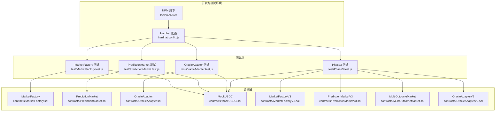
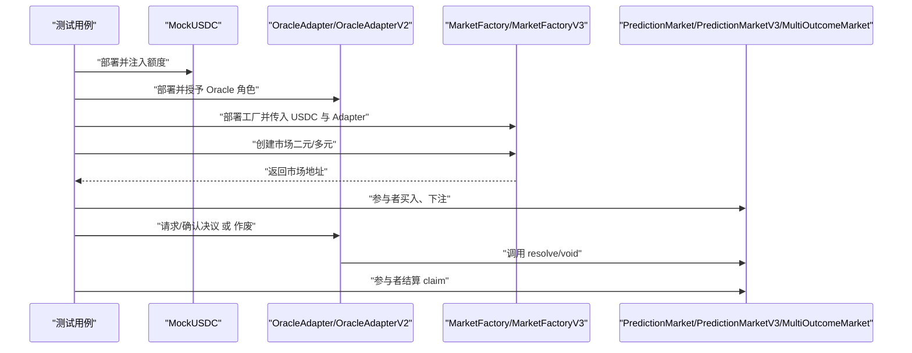
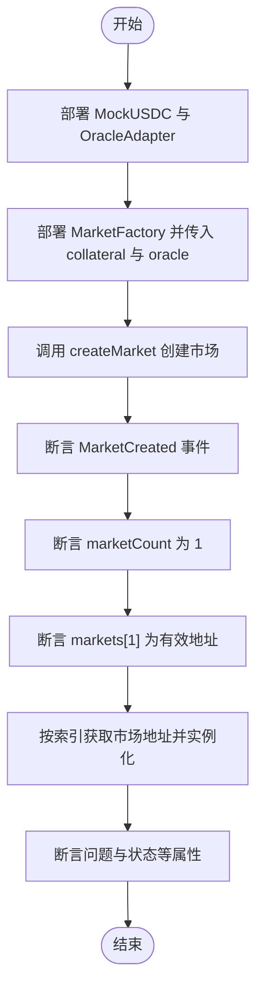
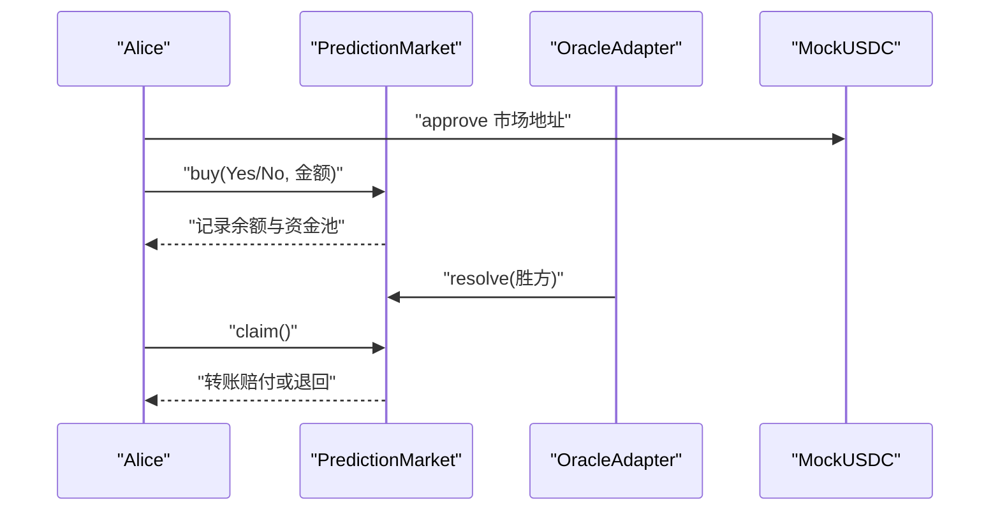
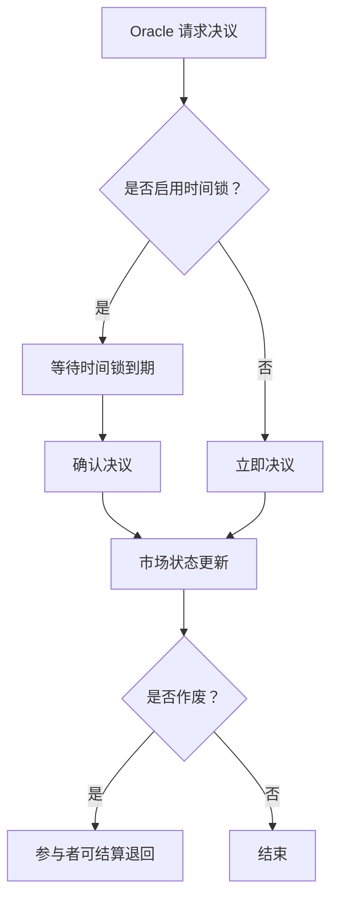
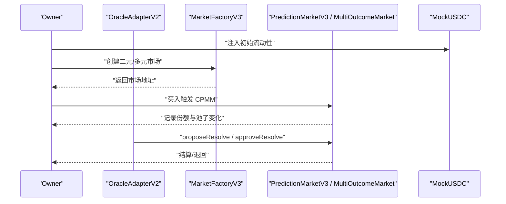
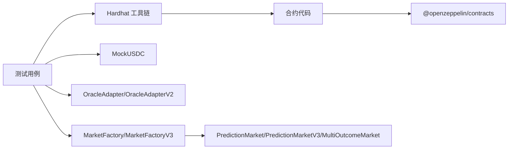
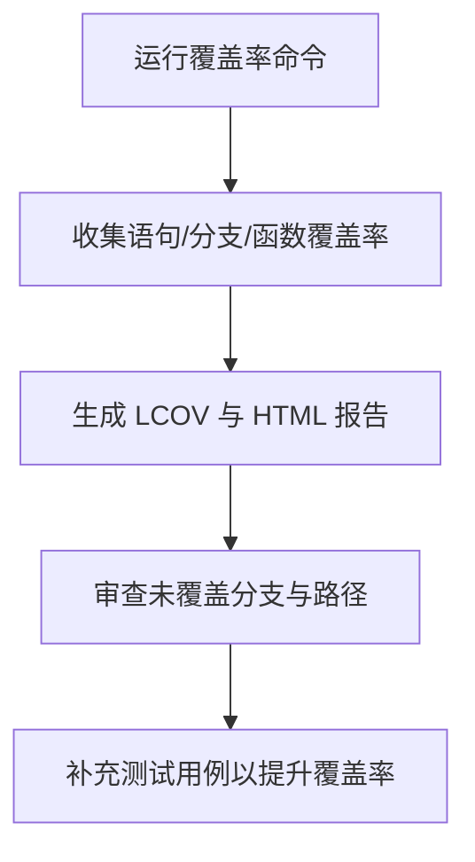

# 测试策略

<cite>
**本文引用的文件**
- [package.json](file://package.json)
- [hardhat.config.js](file://hardhat.config.js)
- [coverage.json](file://coverage.json)
- [test/MarketFactory.test.js](file://test/MarketFactory.test.js)
- [test/PredictionMarket.test.js](file://test/PredictionMarket.test.js)
- [test/OracleAdapter.test.js](file://test/OracleAdapter.test.js)
- [test/Phase3.test.js](file://test/Phase3.test.js)
- [contracts/MarketFactory.sol](file://contracts/MarketFactory.sol)
- [contracts/PredictionMarket.sol](file://contracts/PredictionMarket.sol)
- [contracts/OracleAdapter.sol](file://contracts/OracleAdapter.sol)
- [contracts/MockUSDC.sol](file://contracts/MockUSDC.sol)
- [contracts/MarketFactoryV3.sol](file://contracts/MarketFactoryV3.sol)
- [contracts/PredictionMarketV3.sol](file://contracts/PredictionMarketV3.sol)
- [contracts/MultiOutcomeMarket.sol](file://contracts/MultiOutcomeMarket.sol)
- [contracts/OracleAdapterV2.sol](file://contracts/OracleAdapterV2.sol)
</cite>

## 目录
1. [引言](#引言)
2. [项目结构](#项目结构)
3. [核心组件](#核心组件)
4. [架构总览](#架构总览)
5. [详细组件分析](#详细组件分析)
6. [依赖关系分析](#依赖关系分析)
7. [性能与压力测试](#性能与压力测试)
8. [测试金字塔与实施策略](#测试金字塔与实施策略)
9. [测试覆盖率与分析方法](#测试覆盖率与分析方法)
10. [测试用例示例与数据准备](#测试用例示例与数据准备)
11. [新增测试用例与维护指南](#新增测试用例与维护指南)
12. [测试自动化与持续集成](#测试自动化与持续集成)
13. [故障排查指南](#故障排查指南)
14. [结论](#结论)

## 引言
本测试策略文档面向预测市场智能合约项目，系统化阐述测试架构与测试金字塔设计，明确单元测试、集成测试与端到端测试的实施路径；结合现有测试用例覆盖范围与重点，给出最佳实践、覆盖率要求与分析方法，并提供可操作的测试用例示例、测试数据准备方案、新增测试流程与维护建议，以及测试自动化与持续集成配置思路。目标是帮助开发者在保证质量的同时提升测试效率与稳定性。

## 项目结构
项目采用 Hardhat 开发框架，测试位于 test 目录，合约位于 contracts 目录，构建产物与缓存分别在 artifacts 与 cache，覆盖率报告在 coverage 目录。测试脚本通过 npm scripts 调用 Hardhat 执行，支持覆盖率收集与本地节点运行。

图表来源
- [hardhat.config.js](file://hardhat.config.js#L1-L30)
- [package.json](file://package.json#L1-L22)
- [test/MarketFactory.test.js](file://test/MarketFactory.test.js#L1-L28)
- [test/PredictionMarket.test.js](file://test/PredictionMarket.test.js#L1-L70)
- [test/OracleAdapter.test.js](file://test/OracleAdapter.test.js#L1-L50)
- [test/Phase3.test.js](file://test/Phase3.test.js#L1-L74)
- [contracts/MarketFactory.sol](file://contracts/MarketFactory.sol#L1-L60)
- [contracts/PredictionMarket.sol](file://contracts/PredictionMarket.sol#L1-L134)
- [contracts/OracleAdapter.sol](file://contracts/OracleAdapter.sol#L1-L83)
- [contracts/MockUSDC.sol](file://contracts/MockUSDC.sol#L1-L18)
- [contracts/MarketFactoryV3.sol](file://contracts/MarketFactoryV3.sol#L1-L94)
- [contracts/PredictionMarketV3.sol](file://contracts/PredictionMarketV3.sol#L1-L200)
- [contracts/MultiOutcomeMarket.sol](file://contracts/MultiOutcomeMarket.sol#L1-L113)
- [contracts/OracleAdapterV2.sol](file://contracts/OracleAdapterV2.sol#L1-L83)

章节来源
- [hardhat.config.js](file://hardhat.config.js#L1-L30)
- [package.json](file://package.json#L1-L22)

## 核心组件
- 市场工厂（MarketFactory/MarketFactoryV3）：负责部署二元预测市场或多元市场，管理市场计数与映射，设置 Oracle 地址等。
- 预测市场（PredictionMarket/PredictionMarketV3/MultiOutcomeMarket）：实现资金池、买卖逻辑、结算与退款、状态机与权限控制。
- Oracle 适配器（OracleAdapter/OracleAdapterV2）：提供时间锁/多签决议机制，支持快速决议与市场作废退款。
- 模拟代币（MockUSDC）：用于测试场景的资金注入与授权。

章节来源
- [contracts/MarketFactory.sol](file://contracts/MarketFactory.sol#L1-L60)
- [contracts/MarketFactoryV3.sol](file://contracts/MarketFactoryV3.sol#L1-L94)
- [contracts/PredictionMarket.sol](file://contracts/PredictionMarket.sol#L1-L134)
- [contracts/PredictionMarketV3.sol](file://contracts/PredictionMarketV3.sol#L1-L200)
- [contracts/MultiOutcomeMarket.sol](file://contracts/MultiOutcomeMarket.sol#L1-L113)
- [contracts/OracleAdapter.sol](file://contracts/OracleAdapter.sol#L1-L83)
- [contracts/OracleAdapterV2.sol](file://contracts/OracleAdapterV2.sol#L1-L83)
- [contracts/MockUSDC.sol](file://contracts/MockUSDC.sol#L1-L18)

## 架构总览
测试围绕“合约-适配器-工厂-模拟代币”的交互进行，通过 Hardhat 网络与 Chai 断言库验证业务流程与边界条件。测试金字塔自底向上为单元测试（合约内部逻辑）、集成测试（合约间交互）、端到端测试（完整业务链路）。

图表来源
- [test/MarketFactory.test.js](file://test/MarketFactory.test.js#L1-L28)
- [test/PredictionMarket.test.js](file://test/PredictionMarket.test.js#L1-L70)
- [test/OracleAdapter.test.js](file://test/OracleAdapter.test.js#L1-L50)
- [test/Phase3.test.js](file://test/Phase3.test.js#L1-L74)
- [contracts/MockUSDC.sol](file://contracts/MockUSDC.sol#L1-L18)
- [contracts/OracleAdapter.sol](file://contracts/OracleAdapter.sol#L1-L83)
- [contracts/OracleAdapterV2.sol](file://contracts/OracleAdapterV2.sol#L1-L83)
- [contracts/MarketFactory.sol](file://contracts/MarketFactory.sol#L1-L60)
- [contracts/MarketFactoryV3.sol](file://contracts/MarketFactoryV3.sol#L1-L94)
- [contracts/PredictionMarket.sol](file://contracts/PredictionMarket.sol#L1-L134)
- [contracts/PredictionMarketV3.sol](file://contracts/PredictionMarketV3.sol#L1-L200)
- [contracts/MultiOutcomeMarket.sol](file://contracts/MultiOutcomeMarket.sol#L1-L113)

## 详细组件分析

### MarketFactory 测试要点
- 部署工厂时校验不可为零地址
- 仅所有者可创建市场
- 创建市场后事件触发、市场计数与映射正确
- 可查询版本号

图表来源
- [test/MarketFactory.test.js](file://test/MarketFactory.test.js#L1-L28)
- [contracts/MarketFactory.sol](file://contracts/MarketFactory.sol#L1-L60)

章节来源
- [test/MarketFactory.test.js](file://test/MarketFactory.test.js#L1-L28)
- [contracts/MarketFactory.sol](file://contracts/MarketFactory.sol#L1-L60)

### PredictionMarket 测试要点
- 买入：校验状态、时间、结果枚举、金额非零；资金从用户转移到市场；记录余额与资金池；发出事件
- 决议：仅 Oracle 可调用；校验状态与结果枚举；更新状态与胜方
- 作废：仅 Oracle 可调用；更新状态为 Voided
- 结算：仅一次有效；根据胜方计算赔付；支持 Voided 退回全部

图表来源
- [test/PredictionMarket.test.js](file://test/PredictionMarket.test.js#L1-L70)
- [contracts/PredictionMarket.sol](file://contracts/PredictionMarket.sol#L1-L134)
- [contracts/OracleAdapter.sol](file://contracts/OracleAdapter.sol#L1-L83)
- [contracts/MockUSDC.sol](file://contracts/MockUSDC.sol#L1-L18)

章节来源
- [test/PredictionMarket.test.js](file://test/PredictionMarket.test.js#L1-L70)
- [contracts/PredictionMarket.sol](file://contracts/PredictionMarket.sol#L1-L134)

### OracleAdapter 测试要点
- 时间锁决议：请求后需等待时间锁；时间到后确认执行；否则 revert
- 快速决议：当时间锁为 0 时直接 resolve
- 作废退款：调用后市场作废，参与者可结算退回

图表来源
- [test/OracleAdapter.test.js](file://test/OracleAdapter.test.js#L1-L50)
- [contracts/OracleAdapter.sol](file://contracts/OracleAdapter.sol#L1-L83)

章节来源
- [test/OracleAdapter.test.js](file://test/OracleAdapter.test.js#L1-L50)
- [contracts/OracleAdapter.sol](file://contracts/OracleAdapter.sol#L1-L83)

### Phase3（V3）测试要点
- CPMM 买入影响价格：初始流动性种子后，买入应推动价格向合理方向移动
- 多元市场结算：支持 2–8 结果，胜方结算大于基础投入
- 多签阈值：提案需要达到阈值才可执行

图表来源
- [test/Phase3.test.js](file://test/Phase3.test.js#L1-L74)
- [contracts/MarketFactoryV3.sol](file://contracts/MarketFactoryV3.sol#L1-L94)
- [contracts/PredictionMarketV3.sol](file://contracts/PredictionMarketV3.sol#L1-L200)
- [contracts/MultiOutcomeMarket.sol](file://contracts/MultiOutcomeMarket.sol#L1-L113)
- [contracts/OracleAdapterV2.sol](file://contracts/OracleAdapterV2.sol#L1-L83)
- [contracts/MockUSDC.sol](file://contracts/MockUSDC.sol#L1-L18)

章节来源
- [test/Phase3.test.js](file://test/Phase3.test.js#L1-L74)
- [contracts/MarketFactoryV3.sol](file://contracts/MarketFactoryV3.sol#L1-L94)
- [contracts/PredictionMarketV3.sol](file://contracts/PredictionMarketV3.sol#L1-L200)
- [contracts/MultiOutcomeMarket.sol](file://contracts/MultiOutcomeMarket.sol#L1-L113)
- [contracts/OracleAdapterV2.sol](file://contracts/OracleAdapterV2.sol#L1-L83)

## 依赖关系分析
- 测试对 Hardhat 网络与工具链的依赖：Chai 断言、time 辅助、@nomicfoundation/hardhat-network-helpers
- 合约间依赖：工厂部署市场；适配器驱动市场状态变更；MockUSDC 提供资金
- 权限模型：Ownable/AccessControl 控制工厂与适配器的关键操作

图表来源
- [hardhat.config.js](file://hardhat.config.js#L1-L30)
- [package.json](file://package.json#L15-L20)
- [contracts/MarketFactory.sol](file://contracts/MarketFactory.sol#L1-L60)
- [contracts/MarketFactoryV3.sol](file://contracts/MarketFactoryV3.sol#L1-L94)
- [contracts/PredictionMarket.sol](file://contracts/PredictionMarket.sol#L1-L134)
- [contracts/PredictionMarketV3.sol](file://contracts/PredictionMarketV3.sol#L1-L200)
- [contracts/MultiOutcomeMarket.sol](file://contracts/MultiOutcomeMarket.sol#L1-L113)
- [contracts/OracleAdapter.sol](file://contracts/OracleAdapter.sol#L1-L83)
- [contracts/OracleAdapterV2.sol](file://contracts/OracleAdapterV2.sol#L1-L83)
- [contracts/MockUSDC.sol](file://contracts/MockUSDC.sol#L1-L18)

章节来源
- [hardhat.config.js](file://hardhat.config.js#L1-L30)
- [package.json](file://package.json#L15-L20)

## 性能与压力测试
- 单轮次压力：构造大量参与者同时买入/卖出，观察 gas 使用与区块上限影响
- 连续决议：在短周期内多次发起 resolve/void，评估链上状态切换成本
- 大额交易：使用高精度小数与大额数量，验证溢出与精度处理
- 并发场景：多签适配器中多个 Oracle 同步 approve，验证状态一致性

[本节为通用指导，不直接分析具体文件]

## 测试金字塔与实施策略
- 单元测试（优先）：针对单个合约函数的边界条件与错误分支，如 buy/resolve/claim 的前置条件、状态机转换、权限校验
- 集成测试：跨合约交互，如工厂创建市场、适配器决议、市场结算；验证事件、映射与状态一致性
- 端到端测试：完整业务链路，从部署到交易再到结算，覆盖真实用户路径

[本节为通用指导，不直接分析具体文件]

## 测试覆盖率与分析方法
- 覆盖率工具：solidity-coverage 与 Hardhat 集成，生成 JSON/LCOV 报告与 HTML 页面
- 当前覆盖率：仓库包含 coverage.json 与 coverage 目录，可作为基线参考
- 分析维度：语句覆盖率、分支覆盖率、函数覆盖率；重点关注未覆盖的分支（如 revert 路径、时间锁、多签阈值）

图表来源
- [package.json](file://package.json#L12-L12)
- [coverage.json](file://coverage.json#L1-L1)
- [hardhat.config.js](file://hardhat.config.js#L3-L3)

章节来源
- [package.json](file://package.json#L12-L12)
- [coverage.json](file://coverage.json#L1-L1)
- [hardhat.config.js](file://hardhat.config.js#L3-L3)

## 测试用例示例与数据准备
- 示例一：MarketFactory 创建市场
  - 步骤：部署 MockUSDC 与 OracleAdapter → 部署 MarketFactory → 调用 createMarket → 断言事件与状态
  - 关键断言：事件触发、市场计数、映射、问题字段
  - 参考路径：[test/MarketFactory.test.js](file://test/MarketFactory.test.js#L1-L28)

- 示例二：PredictionMarket 买入与结算
  - 步骤：部署工厂与市场 → 注入 USDC → 授权市场 → 买入 → 决议 → 结算
  - 关键断言：资金池、余额、事件、赔付金额
  - 参考路径：[test/PredictionMarket.test.js](file://test/PredictionMarket.test.js#L1-L70)

- 示例三：OracleAdapter 时间锁与作废
  - 步骤：部署适配器与工厂 → 请求决议 → 时间推进 → 确认决议 → 作废并结算
  - 关键断言：时间锁限制、状态变更、退款
  - 参考路径：[test/OracleAdapter.test.js](file://test/OracleAdapter.test.js#L1-L50)

- 示例四：Phase3 CPMM 与多签
  - 步骤：部署 V3 工厂与适配器 → 种子流动性 → 买入 → 多签提案与批准 → 结算
  - 关键断言：价格变动、阈值生效、结算收益
  - 参考路径：[test/Phase3.test.js](file://test/Phase3.test.js#L1-L74)

章节来源
- [test/MarketFactory.test.js](file://test/MarketFactory.test.js#L1-L28)
- [test/PredictionMarket.test.js](file://test/PredictionMarket.test.js#L1-L70)
- [test/OracleAdapter.test.js](file://test/OracleAdapter.test.js#L1-L50)
- [test/Phase3.test.js](file://test/Phase3.test.js#L1-L74)

## 新增测试用例与维护指南
- 新增步骤
  - 在 test 目录添加新测试文件，命名与被测合约对应
  - 使用 describe/it 组织用例，复用已有的工厂、适配器、MockUSDC 部署模式
  - 对关键路径补充边界与异常场景（如时间戳、权限、数值溢出）
- 维护建议
  - 保持测试命名清晰、断言明确
  - 将重复的部署与初始化逻辑抽取为辅助函数
  - 定期回归：随着合约演进同步更新测试用例

[本节为通用指导，不直接分析具体文件]

## 测试自动化与持续集成
- 本地执行
  - 编译：npm run compile
  - 运行测试：npm run test
  - 生成覆盖率：npm run coverage
  - 本地节点：npm run node
- CI 集成建议
  - 使用 GitHub Actions/Azure Pipelines 等平台，步骤包括安装依赖、编译、运行测试与覆盖率、上传报告
  - 设置覆盖率阈值门禁，确保新增改动不低于最低覆盖率

章节来源
- [package.json](file://package.json#L5-L14)
- [hardhat.config.js](file://hardhat.config.js#L1-L30)

## 故障排查指南
- 常见错误与定位
  - 权限错误（如 not oracle）：检查角色授予与调用者地址
  - 时间相关错误（如 ended/timelock）：使用 time.increase 控制区块时间
  - 数值错误（如 zero amount/invalid outcome）：核对输入参数与状态
- 排查流程
  - 逐步缩小范围：先单元再集成
  - 添加日志与事件断言，定位失败点
  - 使用 Hardhat 调试工具与快照回放

章节来源
- [test/PredictionMarket.test.js](file://test/PredictionMarket.test.js#L66-L68)
- [test/OracleAdapter.test.js](file://test/OracleAdapter.test.js#L21-L23)

## 结论
本项目已具备完善的测试基础设施与代表性测试用例，覆盖工厂、市场、适配器与 V3 版本的核心流程。建议在现有基础上进一步完善单元测试的边界与异常分支，扩展集成测试对多签与 CPMM 的验证，并建立 CI 覆盖率门禁，持续提升测试质量与交付稳定性。