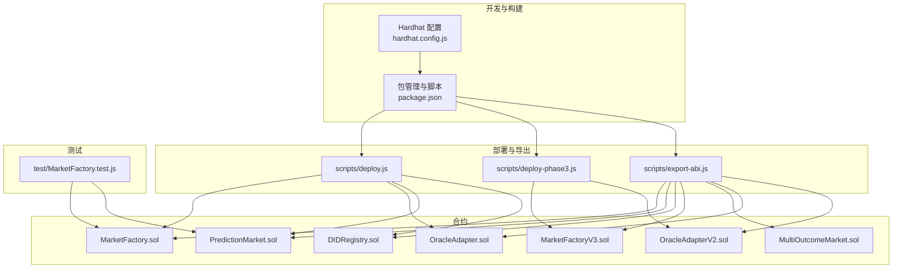
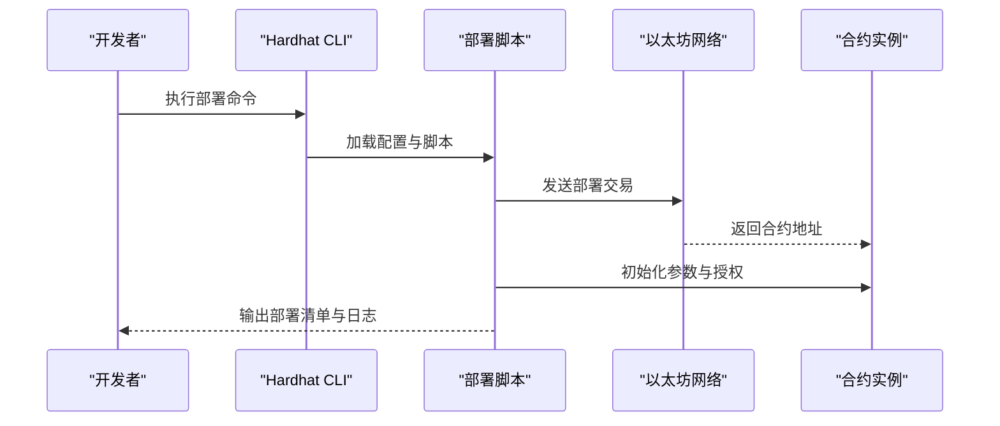
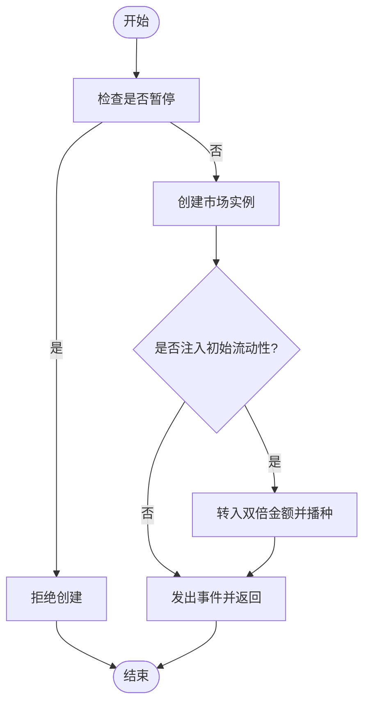
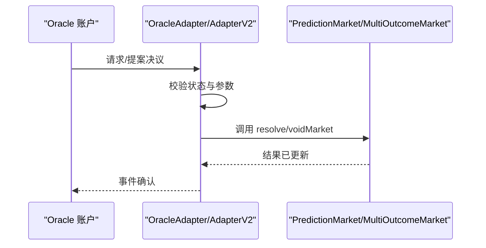
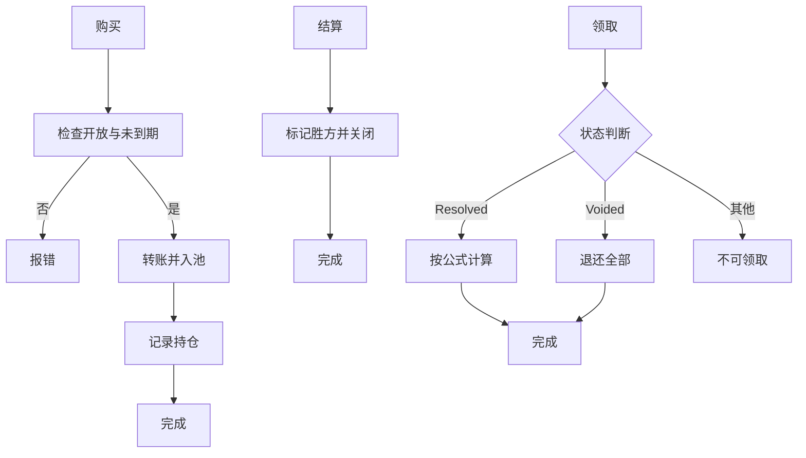
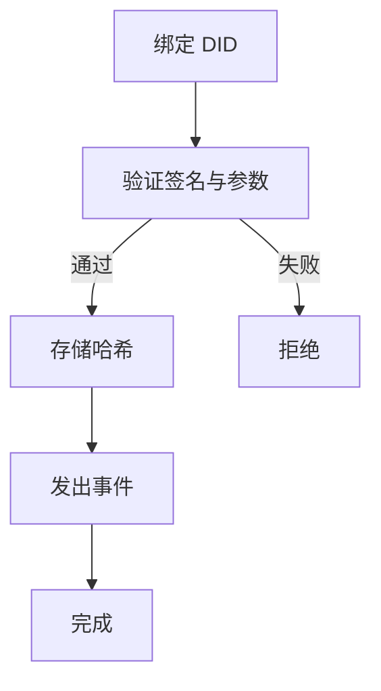
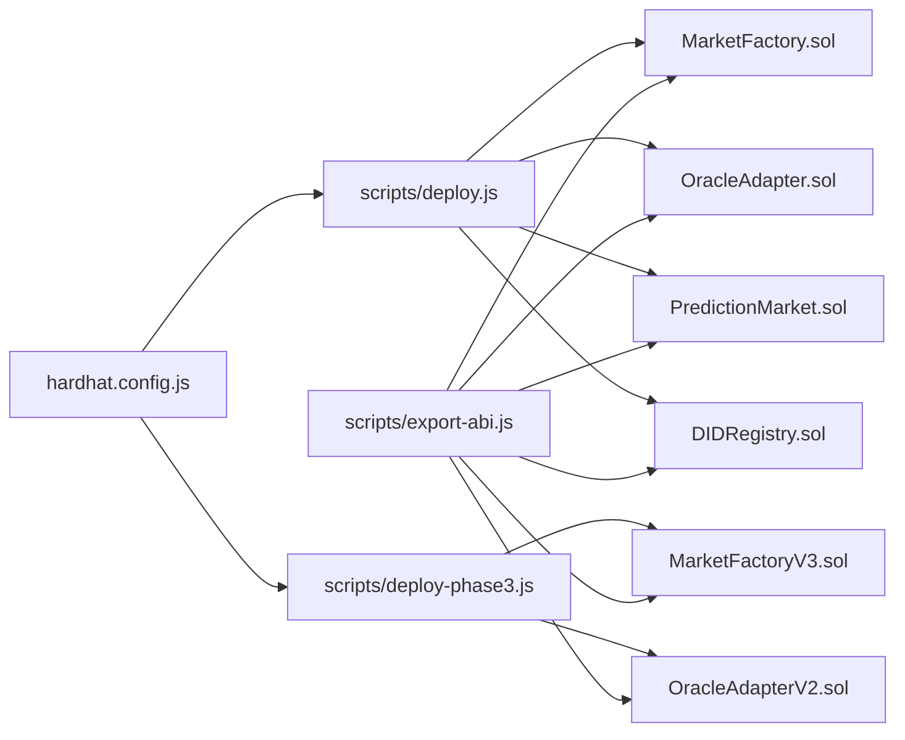

# 生产部署

<cite>
**本文引用的文件**
- [hardhat.config.js](file://hardhat.config.js)
- [package.json](file://package.json)
- [deploy.js](file://scripts/deploy.js)
- [deploy-phase3.js](file://scripts/deploy-phase3.js)
- [export-abi.js](file://scripts/export-abi.js)
- [MarketFactory.sol](file://contracts/MarketFactory.sol)
- [OracleAdapter.sol](file://contracts/OracleAdapter.sol)
- [PredictionMarket.sol](file://contracts/PredictionMarket.sol)
- [DIDRegistry.sol](file://contracts/DIDRegistry.sol)
- [MarketFactoryV3.sol](file://contracts/MarketFactoryV3.sol)
- [OracleAdapterV2.sol](file://contracts/OracleAdapterV2.sol)
- [MultiOutcomeMarket.sol](file://contracts/MultiOutcomeMarket.sol)
- [MarketFactory.test.js](file://test/MarketFactory.test.js)
</cite>

## 目录
1. [引言](#引言)
2. [项目结构](#项目结构)
3. [核心组件](#核心组件)
4. [架构总览](#架构总览)
5. [详细组件分析](#详细组件分析)
6. [依赖关系分析](#依赖关系分析)
7. [性能考量](#性能考量)
8. [故障排查指南](#故障排查指南)
9. [结论](#结论)
10. [附录](#附录)

## 引言
本指南面向生产部署场景，围绕 PredictionDIDSimple_cursor 合约体系，系统阐述部署策略、安全审计流程、部署前准备与验证、监控与维护、升级与兼容性、问题应急响应、运维工具与指标、备份与灾备以及合规与审计要求。文档以仓库中现有 Solidity 合约与脚本为依据，结合 Hardhat 配置与测试用例，给出可落地的生产实践建议。

## 项目结构
该仓库采用按功能分层的组织方式：合约位于 contracts 目录，构建与测试通过 Hardhat 管理；部署脚本位于 scripts 目录；测试位于 test 目录；编译产物与缓存分别在 artifacts 与 cache 目录。核心模块包括市场工厂（MarketFactory/MarketFactoryV3）、预言机适配器（OracleAdapter/OracleAdapterV2）、二元与多结局市场（PredictionMarket/MultiOutcomeMarket）、DID 注册表（DIDRegistry）等。

图表来源
- [hardhat.config.js](file://hardhat.config.js#L1-L30)
- [package.json](file://package.json#L1-L22)
- [deploy.js](file://scripts/deploy.js#L1-L57)
- [deploy-phase3.js](file://scripts/deploy-phase3.js#L1-L43)
- [export-abi.js](file://scripts/export-abi.js#L1-L68)
- [MarketFactory.sol](file://contracts/MarketFactory.sol#L1-L60)
- [MarketFactoryV3.sol](file://contracts/MarketFactoryV3.sol#L1-L94)
- [OracleAdapter.sol](file://contracts/OracleAdapter.sol#L1-L83)
- [OracleAdapterV2.sol](file://contracts/OracleAdapterV2.sol#L1-L83)
- [PredictionMarket.sol](file://contracts/PredictionMarket.sol#L1-L134)
- [MultiOutcomeMarket.sol](file://contracts/MultiOutcomeMarket.sol#L1-L113)
- [DIDRegistry.sol](file://contracts/DIDRegistry.sol#L1-L34)
- [MarketFactory.test.js](file://test/MarketFactory.test.js#L1-L28)

章节来源
- [hardhat.config.js](file://hardhat.config.js#L1-L30)
- [package.json](file://package.json#L1-L22)

## 核心组件
- 市场工厂（MarketFactory/MarketFactoryV3）
  - 负责创建二元或多元预测市场，内置所有权控制与暂停机制（V3），支持费用参数与最大下注额配置。
- 预言机适配器（OracleAdapter/OracleAdapterV2）
  - 提供时间锁（Adapter）或多签阈值（AdapterV2）的决议流程，确保结果发布的安全性与去中心化。
- 预测市场（PredictionMarket/MultiOutcomeMarket）
  - 实现二元/多元的帕西米特尔池（parimutuel）结算模型，支持买涨跌、结算与退款。
- DID 注册表（DIDRegistry）
  - 提供链上 DID 绑定与解析能力，使用签名验证保证绑定有效性。

章节来源
- [MarketFactory.sol](file://contracts/MarketFactory.sol#L1-L60)
- [MarketFactoryV3.sol](file://contracts/MarketFactoryV3.sol#L1-L94)
- [OracleAdapter.sol](file://contracts/OracleAdapter.sol#L1-L83)
- [OracleAdapterV2.sol](file://contracts/OracleAdapterV2.sol#L1-L83)
- [PredictionMarket.sol](file://contracts/PredictionMarket.sol#L1-L134)
- [MultiOutcomeMarket.sol](file://contracts/MultiOutcomeMarket.sol#L1-L113)
- [DIDRegistry.sol](file://contracts/DIDRegistry.sol#L1-L34)

## 架构总览
生产部署涉及“合约部署—ABI 导出—前端/后端集成—链上治理—监控告警—升级与回滚”的闭环。下图展示从部署脚本到合约交互的关键路径：

图表来源
- [package.json](file://package.json#L5-L14)
- [deploy.js](file://scripts/deploy.js#L1-L57)
- [deploy-phase3.js](file://scripts/deploy-phase3.js#L1-L43)

## 详细组件分析

### 市场工厂（MarketFactory/MarketFactoryV3）
- 角色与职责
  - Ownable 所有权模型，仅所有者可创建市场与变更参数。
  - V3 引入暂停机制（Pausable），支持默认费用与最大下注额配置。
- 关键流程
  - 创建二元市场时注入初始流动性并播种资金池。
  - 创建多元市场时按预设结果数初始化池。
- 安全要点
  - 仅所有者调用创建函数；暂停状态限制创建。
  - 参数校验（时间、结果数、费用上限）防止异常输入。

图表来源
- [MarketFactoryV3.sol](file://contracts/MarketFactoryV3.sol#L37-L66)

章节来源
- [MarketFactory.sol](file://contracts/MarketFactory.sol#L1-L60)
- [MarketFactoryV3.sol](file://contracts/MarketFactoryV3.sol#L1-L94)

### 预言机适配器（OracleAdapter/OracleAdapterV2）
- 角色与职责
  - AccessControl 多角色模型，ORACLE_ROLE 拥有决议权限。
  - Adapter：时间锁请求与确认；快速路径（零时间锁）直接决议。
  - AdapterV2：提案与多签批准，达到阈值后执行。
- 关键流程
  - 请求/确认（Adapter）或提案/批准（AdapterV2）。
  - 执行后委托给具体市场进行结算或作废。
- 安全要点
  - 仅开放状态且未过期的市场可被决议/作废。
  - 时间锁与阈值参数需审慎设置，避免滥用。

图表来源
- [OracleAdapter.sol](file://contracts/OracleAdapter.sol#L48-L81)
- [OracleAdapterV2.sol](file://contracts/OracleAdapterV2.sol#L44-L81)
- [PredictionMarket.sol](file://contracts/PredictionMarket.sol#L83-L95)
- [MultiOutcomeMarket.sol](file://contracts/MultiOutcomeMarket.sol#L76-L87)

章节来源
- [OracleAdapter.sol](file://contracts/OracleAdapter.sol#L1-L83)
- [OracleAdapterV2.sol](file://contracts/OracleAdapterV2.sol#L1-L83)

### 预测市场（PredictionMarket/MultiOutcomeMarket）
- 角色与职责
  - 管理各结果池与用户持仓，支持购买、结算与领取。
  - MultiOutcomeMarket 支持 2–8 结果，内置费用计算。
- 关键流程
  - 购买：转账代币至市场池，记录用户持仓。
  - 结算：仅由预言机调用，标记胜方。
  - 领取：根据帕西米特尔公式或原仓退还计算收益。
- 安全要点
  - ReentrancyGuard 防止多重调用攻击。
  - 仅开放且未过期的市场允许购买与领取。

图表来源
- [PredictionMarket.sol](file://contracts/PredictionMarket.sol#L64-L113)
- [MultiOutcomeMarket.sol](file://contracts/MultiOutcomeMarket.sol#L65-L111)

章节来源
- [PredictionMarket.sol](file://contracts/PredictionMarket.sol#L1-L134)
- [MultiOutcomeMarket.sol](file://contracts/MultiOutcomeMarket.sol#L1-L113)

### DID 注册表（DIDRegistry）
- 角色与职责
  - 绑定账户与 DID，并提供解析接口。
- 关键流程
  - 绑定时使用签名恢复验证，防止伪造。
- 安全要点
  - 输入校验（非空 DID）与签名有效性校验。

图表来源
- [DIDRegistry.sol](file://contracts/DIDRegistry.sol#L19-L28)

章节来源
- [DIDRegistry.sol](file://contracts/DIDRegistry.sol#L1-L34)

## 依赖关系分析
- 构建与运行
  - 使用 Hardhat 与 @nomicfoundation/hardhat-toolbox，Solidity 版本 0.8.24，启用优化器与 Cancun EVM。
- 合约依赖
  - OpenZeppelin 访问控制与安全工具（AccessControl、Ownable、Pausable、ReentrancyGuard、SafeERC20 等）。
- 部署脚本
  - 本地部署脚本负责初始化 MockUSDC、OracleAdapter、DIDRegistry、MarketFactory，并授予授权与注入资金。
  - Phase3 部署脚本引入 OracleAdapterV2 与 MarketFactoryV3，支持多签与多元市场。
- ABI 导出
  - 自动导出多合约 ABI 至后端与前端目录，便于集成。

图表来源
- [hardhat.config.js](file://hardhat.config.js#L1-L30)
- [deploy.js](file://scripts/deploy.js#L1-L57)
- [deploy-phase3.js](file://scripts/deploy-phase3.js#L1-L43)
- [export-abi.js](file://scripts/export-abi.js#L1-L68)
- [MarketFactory.sol](file://contracts/MarketFactory.sol#L1-L60)
- [MarketFactoryV3.sol](file://contracts/MarketFactoryV3.sol#L1-L94)
- [OracleAdapter.sol](file://contracts/OracleAdapter.sol#L1-L83)
- [OracleAdapterV2.sol](file://contracts/OracleAdapterV2.sol#L1-L83)
- [PredictionMarket.sol](file://contracts/PredictionMarket.sol#L1-L134)
- [MultiOutcomeMarket.sol](file://contracts/MultiOutcomeMarket.sol#L1-L113)
- [DIDRegistry.sol](file://contracts/DIDRegistry.sol#L1-L34)

章节来源
- [hardhat.config.js](file://hardhat.config.js#L1-L30)
- [package.json](file://package.json#L1-L22)
- [export-abi.js](file://scripts/export-abi.js#L1-L68)

## 性能考量
- 编译与优化
  - 启用编译器优化器（enabled=true, runs=200），降低 gas 成本与字节码体积。
  - 使用较新的 EVM 版本（Cancun）以获得更好的执行效率。
- 合约设计
  - 使用 SafeERC20 与 ReentrancyGuard 防范常见漏洞，减少重入与代币转移风险。
  - 通过映射与数组的合理设计，平衡读写复杂度与 gas 开销。
- 部署与迁移
  - 分阶段部署（Phase3）逐步引入新版本，降低单次升级风险。
  - 在本地网络充分测试后再上主网，确保 gas 估算与执行路径稳定。

章节来源
- [hardhat.config.js](file://hardhat.config.js#L7-L13)
- [MarketFactoryV3.sol](file://contracts/MarketFactoryV3.sol#L1-L94)
- [MultiOutcomeMarket.sol](file://contracts/MultiOutcomeMarket.sol#L1-L113)

## 故障排查指南
- 部署失败
  - 检查网络连接与账户余额；核对私钥与 RPC 地址；确认链 ID 与配置一致。
  - 若出现“时间锁未到期”或“阈值未满足”，检查时间锁与多签阈值参数。
- 合约行为异常
  - 核对市场状态（Open/Resolved/Voided）与时间戳；确认购买/结算/领取流程顺序正确。
  - 对于 MultiOutcomeMarket，检查结果数范围与费用比例。
- 测试验证
  - 运行测试用例验证工厂创建市场、事件触发与基本流程。

章节来源
- [MarketFactory.test.js](file://test/MarketFactory.test.js#L1-L28)
- [OracleAdapter.sol](file://contracts/OracleAdapter.sol#L48-L81)
- [OracleAdapterV2.sol](file://contracts/OracleAdapterV2.sol#L44-L81)
- [MultiOutcomeMarket.sol](file://contracts/MultiOutcomeMarket.sol#L65-L111)

## 结论
本指南基于仓库现有合约与脚本，给出了生产部署的完整实践路线：从配置与优化、安全审计、部署前验证，到监控维护、升级与兼容、应急响应、运维工具与指标、备份与灾备以及合规与审计要求。建议在生产前完成全面的外部审计与渗透测试，并建立完善的治理与多签流程，确保系统安全、稳定与可追溯。

## 附录

### A. 生产部署策略与最佳实践
- 环境隔离
  - 区分开发、测试、预生产和生产网络，严格控制部署权限与参数。
- 权限最小化
  - 使用 AccessControl 的角色模型，避免单一账户拥有过多权限。
- 参数治理
  - 将关键参数（如时间锁、阈值、费用、最大下注额）纳入治理流程，通过多签提案与确认。
- 透明度与可审计性
  - 全量事件记录与链上状态查询，便于审计与复盘。

章节来源
- [OracleAdapter.sol](file://contracts/OracleAdapter.sol#L1-L83)
- [OracleAdapterV2.sol](file://contracts/OracleAdapterV2.sol#L1-L83)
- [MarketFactoryV3.sol](file://contracts/MarketFactoryV3.sol#L1-L94)

### B. 合约审计标准流程与安全检查清单
- 审计流程
  - 需求与设计评审 → 合约静态分析（形式化验证/符号执行）→ 代码走查与模糊测试 → 渗透测试 → 治理与多签审批 → 上线与监控。
- 安全检查清单
  - 权限模型：角色分离、权限回收、最小权限原则。
  - 数学与边界：溢出/下溢、除零、数组越界、gas 限制。
  - 外部调用：reentrancy、revert 不安全、delegatecall 风险。
  - 时间相关：时间戳操纵、时间锁绕过、竞态条件。
  - 数据一致性：状态同步、事件完整性、链上链下一致性。

章节来源
- [PredictionMarket.sol](file://contracts/PredictionMarket.sol#L1-L134)
- [MultiOutcomeMarket.sol](file://contracts/MultiOutcomeMarket.sol#L1-L113)
- [OracleAdapter.sol](file://contracts/OracleAdapter.sol#L1-L83)
- [OracleAdapterV2.sol](file://contracts/OracleAdapterV2.sol#L1-L83)

### C. 部署前准备与验证步骤
- 本地验证
  - 使用 Hardhat node 启动本地链，执行部署脚本与核心流程测试。
  - 运行测试用例覆盖关键路径与边界条件。
- ABI 与集成
  - 使用导出脚本生成前后端所需 ABI 文件，确保版本一致。
- 配置校验
  - 校验 Hardhat 配置中的 EVM 版本、优化器参数与网络设置。

章节来源
- [package.json](file://package.json#L5-L14)
- [deploy.js](file://scripts/deploy.js#L1-L57)
- [deploy-phase3.js](file://scripts/deploy-phase3.js#L1-L43)
- [export-abi.js](file://scripts/export-abi.js#L1-L68)
- [MarketFactory.test.js](file://test/MarketFactory.test.js#L1-L28)

### D. 监控与维护实施方案
- 监控指标
  - 交易吞吐量与延迟、Gas 使用分布、事件频率、错误率、链上状态变化。
- 告警策略
  - 高错误率、长时间无事件、Gas 价格异常、多签提案积压。
- 日常维护
  - 定期审查权限与参数，更新依赖与 EVM 版本，修复已知漏洞。

章节来源
- [hardhat.config.js](file://hardhat.config.js#L7-L13)

### E. 升级策略与向后兼容性
- 升级路径
  - 采用代理模式或工厂模式，保持地址不变，仅升级逻辑层。
  - 分阶段迁移（Phase3）先部署新版本，再切换工厂与适配器。
- 兼容性
  - 保持 ABI 兼容，新增字段使用可选参数；旧版本市场继续支持直至迁移完成。

章节来源
- [MarketFactoryV3.sol](file://contracts/MarketFactoryV3.sol#L1-L94)
- [OracleAdapterV2.sol](file://contracts/OracleAdapterV2.sol#L1-L83)

### F. 生产问题与紧急情况处理
- 应急预案
  - 多签冻结、暂停工厂、撤销错误决议、回滚交易（在可行范围内）。
- 快速响应
  - 建立值班与沟通机制，快速定位问题并发布修复补丁。

章节来源
- [MarketFactoryV3.sol](file://contracts/MarketFactoryV3.sol#L31-L32)
- [OracleAdapterV2.sol](file://contracts/OracleAdapterV2.sol#L35-L38)

### G. 运维工具与监控指标配置指南
- 工具
  - 链上数据抓取（如 The Graph 或自建索引服务）、链上告警（如 Tenderly/Defender）、钱包与多签管理（如 Gnosis Safe）。
- 指标
  - 交易确认时间、区块大小、未确认交易队列长度、合约调用成功率、事件覆盖率。

章节来源
- [package.json](file://package.json#L1-L22)

### H. 备份与灾难恢复计划
- 数据备份
  - 合约状态快照、事件索引、部署清单与密钥备份。
- 灾难恢复
  - 多签授权恢复、备用节点、跨链桥接与资产迁移方案。

章节来源
- [deploy.js](file://scripts/deploy.js#L36-L49)
- [deploy-phase3.js](file://scripts/deploy-phase3.js#L25-L36)

### I. 合规性与审计要求
- 合规性
  - 记录所有治理决策与参数变更，确保可追溯与可审计。
- 审计要求
  - 提供完整源码、测试报告、部署清单与事件日志，配合第三方审计机构。

章节来源
- [export-abi.js](file://scripts/export-abi.js#L1-L68)
- [MarketFactory.test.js](file://test/MarketFactory.test.js#L1-L28)