# 部署和配置

<cite>
**本文引用的文件**
- [hardhat.config.js](file://hardhat.config.js)
- [package.json](file://package.json)
- [deploy.js](file://scripts/deploy.js)
- [deploy-phase3.js](file://scripts/deploy-phase3.js)
- [seed-markets.js](file://scripts/seed-markets.js)
- [resolve.js](file://scripts/resolve.js)
- [export-abi.js](file://scripts/export-abi.js)
- [MarketFactory.sol](file://contracts/MarketFactory.sol)
- [MarketFactoryV3.sol](file://contracts/MarketFactoryV3.sol)
- [MockUSDC.sol](file://contracts/MockUSDC.sol)
- [OracleAdapter.sol](file://contracts/OracleAdapter.sol)
- [PredictionMarket.sol](file://contracts/PredictionMarket.sol)
- [PredictionMarketV3.sol](file://contracts/PredictionMarketV3.sol)
- [MarketFactory.test.js](file://test/MarketFactory.test.js)
</cite>

## 目录
1. [简介](#简介)
2. [项目结构](#项目结构)
3. [核心组件](#核心组件)
4. [架构总览](#架构总览)
5. [详细组件分析](#详细组件分析)
6. [依赖关系分析](#依赖关系分析)
7. [性能与Gas优化](#性能与gas优化)
8. [环境变量与账户管理](#环境变量与账户管理)
9. [部署流程](#部署流程)
10. [种子数据与市场初始化](#种子数据与市场初始化)
11. [监控与日志最佳实践](#监控与日志最佳实践)
12. [故障排除与回滚策略](#故障排除与回滚策略)
13. [结论](#结论)

## 简介
本指南面向开发者与运维人员，提供PredictionDIDSimple项目的完整部署与配置说明。内容涵盖开发环境搭建、Hardhat配置详解、本地/测试网/主网部署流程、网络与Gas设置、账户管理、部署脚本用法与自定义、种子数据与市场初始化、环境变量管理、监控与日志最佳实践，以及常见问题排查与回滚策略。

## 项目结构
该项目采用以合约为中心的分层组织方式：contracts目录存放Solidity源码；scripts目录存放部署与辅助脚本；test目录存放单元测试；artifacts/cache等为编译产物与缓存。

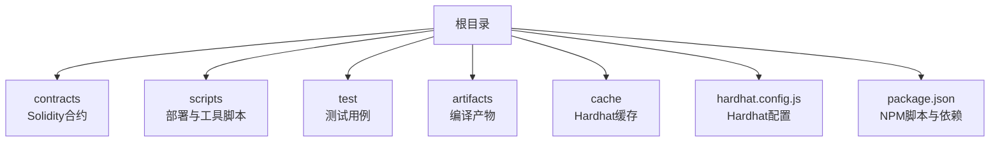

图表来源
- [hardhat.config.js](file://hardhat.config.js#L1-L30)
- [package.json](file://package.json#L1-L22)

章节来源
- [hardhat.config.js](file://hardhat.config.js#L1-L30)
- [package.json](file://package.json#L1-L22)

## 核心组件
- 市场工厂（MarketFactory/MarketFactoryV3）：负责创建二元预测市场或多元市场，支持暂停、费用参数、最大投注等控制。
- 预测市场（PredictionMarket/PredictionMarketV3）：实现二元市场交易、流动性池、费用抽取与结算。
- Oracle适配器（OracleAdapter/OracleAdapterV2）：提供“请求-确认”式的时间锁决议机制，保障结果发布安全。
- 模拟代币（MockUSDC）：用于测试的6位小数稳定币，便于模拟真实场景下的资金流转。
- 部署脚本：自动化完成合约部署、权限授予、初始资金注入与部署清单输出。

章节来源
- [MarketFactory.sol](file://contracts/MarketFactory.sol#L1-L60)
- [MarketFactoryV3.sol](file://contracts/MarketFactoryV3.sol#L1-L94)
- [PredictionMarket.sol](file://contracts/PredictionMarket.sol#L1-L134)
- [PredictionMarketV3.sol](file://contracts/PredictionMarketV3.sol#L1-L200)
- [OracleAdapter.sol](file://contracts/OracleAdapter.sol#L1-L83)
- [MockUSDC.sol](file://contracts/MockUSDC.sol#L1-L18)
- [deploy.js](file://scripts/deploy.js#L1-L57)
- [deploy-phase3.js](file://scripts/deploy-phase3.js#L1-L43)

## 架构总览
系统由“部署脚本驱动—工厂合约—市场合约—Oracle适配器—模拟代币”构成，形成从部署到运营的闭环。

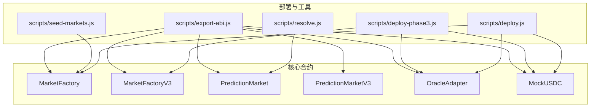

图表来源
- [deploy.js](file://scripts/deploy.js#L1-L57)
- [deploy-phase3.js](file://scripts/deploy-phase3.js#L1-L43)
- [seed-markets.js](file://scripts/seed-markets.js#L1-L34)
- [resolve.js](file://scripts/resolve.js#L1-L20)
- [export-abi.js](file://scripts/export-abi.js#L1-L68)
- [MarketFactory.sol](file://contracts/MarketFactory.sol#L1-L60)
- [MarketFactoryV3.sol](file://contracts/MarketFactoryV3.sol#L1-L94)
- [PredictionMarket.sol](file://contracts/PredictionMarket.sol#L1-L134)
- [PredictionMarketV3.sol](file://contracts/PredictionMarketV3.sol#L1-L200)
- [OracleAdapter.sol](file://contracts/OracleAdapter.sol#L1-L83)
- [MockUSDC.sol](file://contracts/MockUSDC.sol#L1-L18)

## 详细组件分析

### 市场工厂（MarketFactory）
- 职责：创建二元预测市场，维护市场计数与映射，支持所有者权限与Oracle地址设置。
- 关键点：构造函数校验地址非零；仅所有者可调用创建；事件记录市场ID、引用、问题与结束时间。

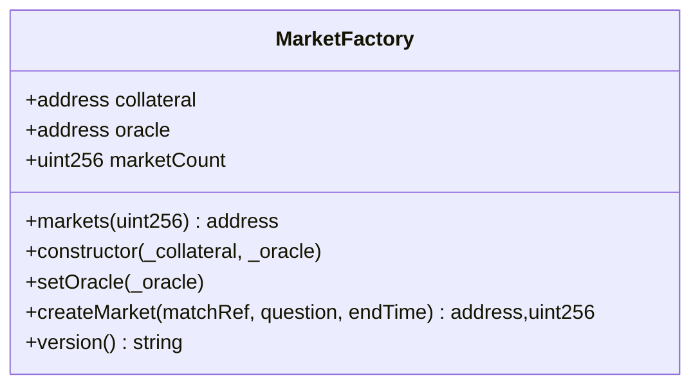

图表来源
- [MarketFactory.sol](file://contracts/MarketFactory.sol#L1-L60)

章节来源
- [MarketFactory.sol](file://contracts/MarketFactory.sol#L1-L60)

### 市场工厂V3（MarketFactoryV3）
- 职责：支持二元CPMM市场与多元市场，内置暂停、默认费用、默认最大投注等参数。
- 关键点：二元市场支持初始流动性注入与LP份额发放；多元市场支持多结果；仅所有者可操作。

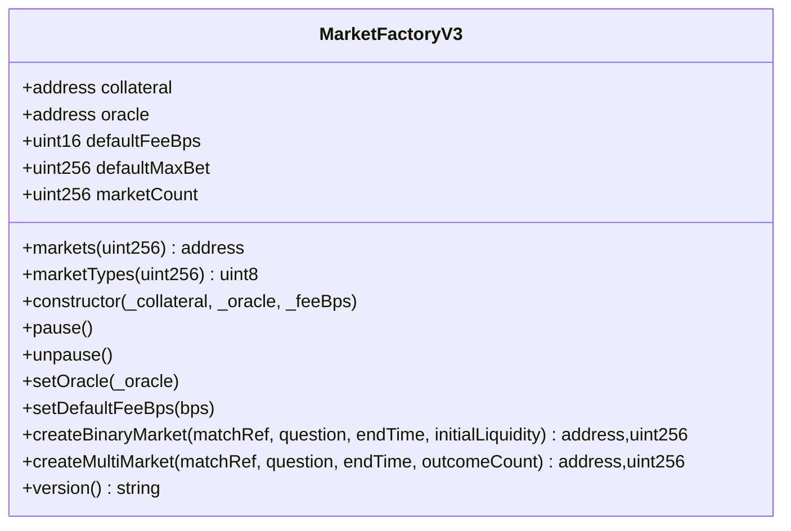

图表来源
- [MarketFactoryV3.sol](file://contracts/MarketFactoryV3.sol#L1-L94)

章节来源
- [MarketFactoryV3.sol](file://contracts/MarketFactoryV3.sol#L1-L94)

### 预测市场（PredictionMarket）
- 职责：二元Yes/No市场，支持购买份额、Oracle决议、作废与结算。
- 关键点：状态机（Open/Resolved/Voided）；仅Oracle可决议；按池子比例计算赔付。

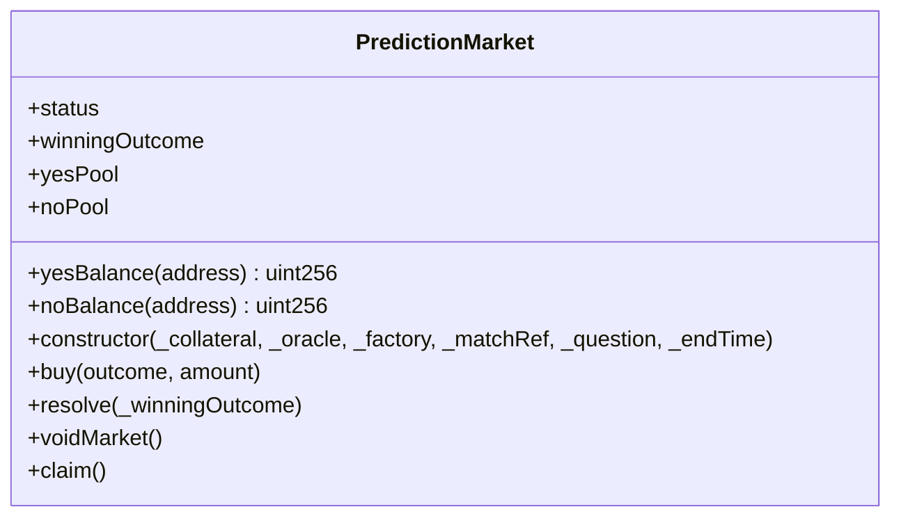

图表来源
- [PredictionMarket.sol](file://contracts/PredictionMarket.sol#L1-L134)

章节来源
- [PredictionMarket.sol](file://contracts/PredictionMarket.sol#L1-L134)

### 预测市场V3（PredictionMarketV3）
- 职责：基于CPMM的二元市场，支持流动性提供/移除、费用抽取、用户最大投注限制。
- 关键点：非再入保护；价格计算采用恒定乘积公式；结算时按赢家侧池子比例返还。

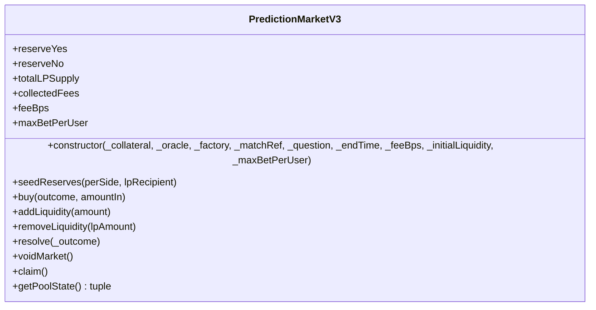

图表来源
- [PredictionMarketV3.sol](file://contracts/PredictionMarketV3.sol#L1-L200)

章节来源
- [PredictionMarketV3.sol](file://contracts/PredictionMarketV3.sol#L1-L200)

### Oracle适配器（OracleAdapter）
- 职责：为市场提供“请求-确认”式的时间锁决议与作废能力，支持角色授权。
- 关键点：请求决议后进入等待期，到期后方可确认；支持快速路径（当时间锁为0时）。

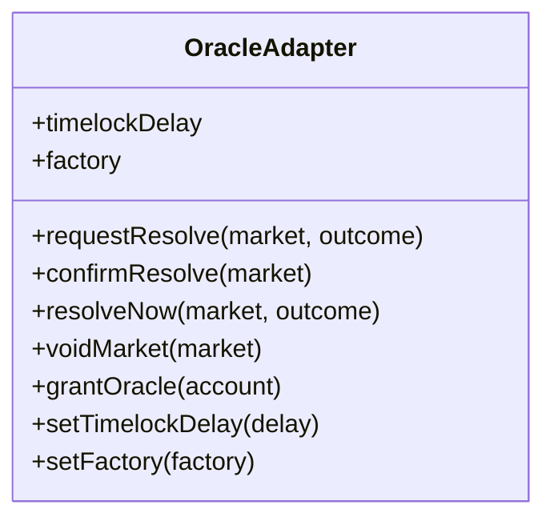

图表来源
- [OracleAdapter.sol](file://contracts/OracleAdapter.sol#L1-L83)

章节来源
- [OracleAdapter.sol](file://contracts/OracleAdapter.sol#L1-L83)

### 模拟USDC（MockUSDC）
- 职责：测试用稳定币，6位小数，支持铸造，便于部署阶段向账户注资。
- 关键点：decimals覆盖返回6；mint对外暴露，供部署脚本批量注资。

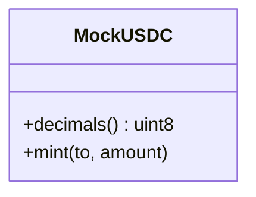

图表来源
- [MockUSDC.sol](file://contracts/MockUSDC.sol#L1-L18)

章节来源
- [MockUSDC.sol](file://contracts/MockUSDC.sol#L1-L18)

### 部署脚本（deploy.js）
- 功能：部署MockUSDC、OracleAdapter、DIDRegistry、MarketFactory；授予Oracle权限；向部署者铸造初始资金；输出部署清单。
- 关键点：读取ORACLE_TIMELOCK_SECONDS环境变量；写入deployments.local.json。

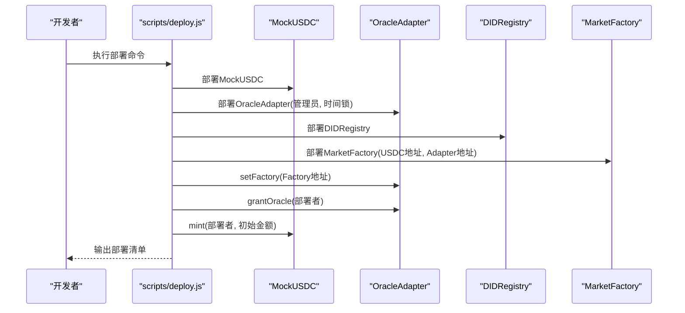

图表来源
- [deploy.js](file://scripts/deploy.js#L1-L57)

章节来源
- [deploy.js](file://scripts/deploy.js#L1-L57)

### 部署脚本（deploy-phase3.js）
- 功能：部署MockUSDC、OracleAdapterV2、MarketFactoryV3；设置多重签名阈值与默认费用；向部署者铸造初始资金；输出phase3部署清单。
- 关键点：读取ORACLE_MULTISIG_THRESHOLD与DEFAULT_FEE_BPS环境变量。

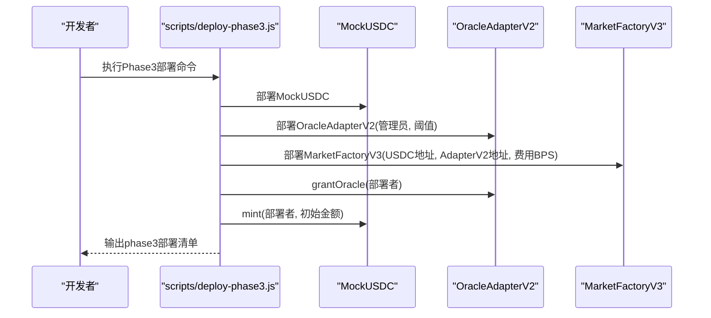

图表来源
- [deploy-phase3.js](file://scripts/deploy-phase3.js#L1-L43)

章节来源
- [deploy-phase3.js](file://scripts/deploy-phase3.js#L1-L43)

### 种子脚本（seed-markets.js）
- 功能：读取本地部署清单，批量创建若干种子市场，便于快速初始化。
- 关键点：校验部署清单存在；使用工厂合约创建多个市场；打印当前市场总数。

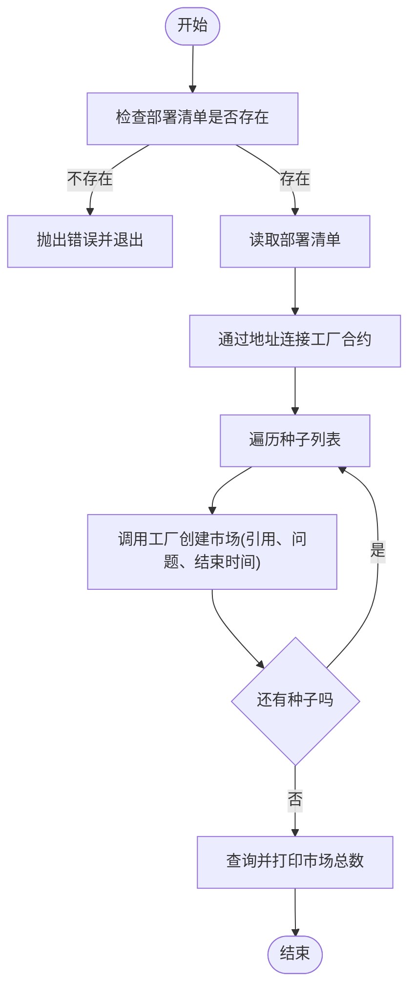

图表来源
- [seed-markets.js](file://scripts/seed-markets.js#L1-L34)

章节来源
- [seed-markets.js](file://scripts/seed-markets.js#L1-L34)

### 解决脚本（resolve.js）
- 功能：通过环境变量MARKET_ADDRESS与WINNING_OUTCOME对指定市场进行决议。
- 关键点：校验必要环境变量；以Oracle身份调用市场合约resolve。

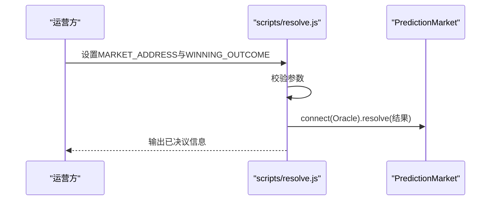

图表来源
- [resolve.js](file://scripts/resolve.js#L1-L20)

章节来源
- [resolve.js](file://scripts/resolve.js#L1-L20)

### ABI导出脚本（export-abi.js）
- 功能：从artifacts读取合约ABI与字节码，分别写入后端与前端目录，便于集成。
- 关键点：遍历预设合约列表；校验artifact存在；确保目标目录存在。

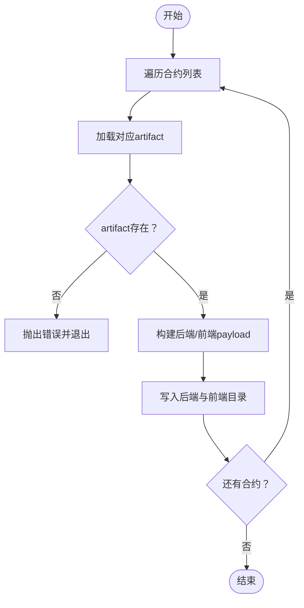

图表来源
- [export-abi.js](file://scripts/export-abi.js#L1-L68)

章节来源
- [export-abi.js](file://scripts/export-abi.js#L1-L68)

## 依赖关系分析
- 合约间依赖：MarketFactory/MarketFactoryV3依赖MockUSDC与OracleAdapter；PredictionMarket/PredictionMarketV3依赖IERC20与安全转账；OracleAdapter依赖AccessControl。
- 脚本依赖：部署脚本依赖Hardhat运行时；种子/解决脚本依赖已存在的部署清单与网络连接。

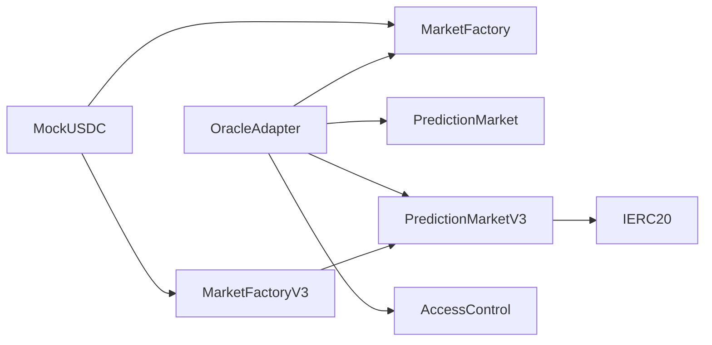

图表来源
- [MarketFactory.sol](file://contracts/MarketFactory.sol#L1-L60)
- [MarketFactoryV3.sol](file://contracts/MarketFactoryV3.sol#L1-L94)
- [PredictionMarket.sol](file://contracts/PredictionMarket.sol#L1-L134)
- [PredictionMarketV3.sol](file://contracts/PredictionMarketV3.sol#L1-L200)
- [OracleAdapter.sol](file://contracts/OracleAdapter.sol#L1-L83)
- [MockUSDC.sol](file://contracts/MockUSDC.sol#L1-L18)

章节来源
- [MarketFactory.sol](file://contracts/MarketFactory.sol#L1-L60)
- [MarketFactoryV3.sol](file://contracts/MarketFactoryV3.sol#L1-L94)
- [PredictionMarket.sol](file://contracts/PredictionMarket.sol#L1-L134)
- [PredictionMarketV3.sol](file://contracts/PredictionMarketV3.sol#L1-L200)
- [OracleAdapter.sol](file://contracts/OracleAdapter.sol#L1-L83)
- [MockUSDC.sol](file://contracts/MockUSDC.sol#L1-L18)

## 性能与Gas优化
- 编译器优化：启用优化器并设置合理runs次数，平衡部署成本与运行成本。
- EVM版本：选择较新的EVM版本以获得更好的指令支持与安全性。
- 合约设计：使用非再入保护、最小化存储访问、合并相近逻辑以降低Gas消耗。
- 测试与覆盖率：通过测试与覆盖率报告识别热点路径，针对性优化。

章节来源
- [hardhat.config.js](file://hardhat.config.js#L7-L13)
- [PredictionMarketV3.sol](file://contracts/PredictionMarketV3.sol#L92-L135)

## 环境变量与账户管理
- 部署阶段
  - ORACLE_TIMELOCK_SECONDS：Oracle时间锁延迟（秒），用于OracleAdapter。
  - ORACLE_MULTISIG_THRESHOLD：多重签名阈值（Phase3），用于OracleAdapterV2。
  - DEFAULT_FEE_BPS：默认费用千分比（Phase3），用于MarketFactoryV3。
- 运营阶段
  - MARKET_ADDRESS：待决议市场的合约地址。
  - WINNING_OUTCOME：获胜结果（0/1）。
- 账户管理
  - 使用Hardhat提供的本地账户进行开发与测试。
  - 在生产网络中，建议使用硬件钱包或托管服务管理私钥，避免在脚本中硬编码密钥。

章节来源
- [deploy.js](file://scripts/deploy.js#L7-L8)
- [deploy-phase3.js](file://scripts/deploy-phase3.js#L7-L8)
- [resolve.js](file://scripts/resolve.js#L4-L5)

## 部署流程
- 开发环境准备
  - 安装Node.js与npm。
  - 在项目根目录执行安装依赖与编译。
- 本地部署
  - 启动本地节点（Hardhat Node）。
  - 执行部署脚本，生成本地部署清单。
  - 可选：执行种子脚本初始化市场。
- 测试网部署
  - 在hardhat.config.js中添加目标网络配置（RPC URL、链ID、账户）。
  - 使用相应网络参数运行部署脚本。
- 主网部署
  - 准备好账户与Gas设置，谨慎执行部署。
  - 建议先在测试网验证流程与参数。

章节来源
- [package.json](file://package.json#L5-L14)
- [hardhat.config.js](file://hardhat.config.js#L14-L22)
- [deploy.js](file://scripts/deploy.js#L9-L9)
- [seed-markets.js](file://scripts/seed-markets.js#L6-L6)

## 种子数据与市场初始化
- 步骤
  - 确保已完成本地部署并生成部署清单。
  - 运行种子脚本，自动创建多个示例市场。
  - 校验市场总数与各市场属性是否符合预期。
- 注意
  - 种子脚本会读取本地部署清单中的工厂地址。
  - 结束时间基于最新区块时间推算。

章节来源
- [seed-markets.js](file://scripts/seed-markets.js#L1-L34)
- [MarketFactory.test.js](file://test/MarketFactory.test.js#L1-L28)

## 监控与日志最佳实践
- 日志输出
  - 部署脚本与工具脚本均输出关键信息，便于追踪。
- 错误处理
  - 脚本捕获异常并设置退出码，便于CI/CD集成。
- 监控指标
  - 记录部署时间、交易哈希、合约地址与版本号。
  - 对关键事件（市场创建、决议、作废、结算）建立观测点。

章节来源
- [deploy.js](file://scripts/deploy.js#L53-L56)
- [deploy-phase3.js](file://scripts/deploy-phase3.js#L39-L42)
- [seed-markets.js](file://scripts/seed-markets.js#L30-L33)
- [resolve.js](file://scripts/resolve.js#L16-L19)

## 故障排除与回滚策略
- 常见问题
  - 部署失败：检查网络连接、账户余额与Gas设置；查看脚本错误输出。
  - 种子脚本报错：确认已先执行部署脚本并生成部署清单。
  - 决议失败：确认MARKET_ADDRESS与WINNING_OUTCOME正确，且调用账户具备Oracle权限。
- 回滚策略
  - 本地开发：直接重启节点与重新部署。
  - 测试网/主网：通过工厂合约的暂停功能限制新增市场；对已创建市场采用“作废”流程处理未决风险；必要时通过治理流程升级合约或迁移至新版本。

章节来源
- [seed-markets.js](file://scripts/seed-markets.js#L7-L9)
- [resolve.js](file://scripts/resolve.js#L6-L8)
- [MarketFactoryV3.sol](file://contracts/MarketFactoryV3.sol#L31-L32)

## 结论
本指南提供了从开发环境到生产部署的全链路指引。通过合理配置Hardhat、规范使用部署脚本与环境变量、建立种子数据与监控体系，可高效、安全地完成PredictionDIDSimple的部署与运维工作。建议在测试网充分验证后再上主网，并持续关注Gas优化与安全审计。