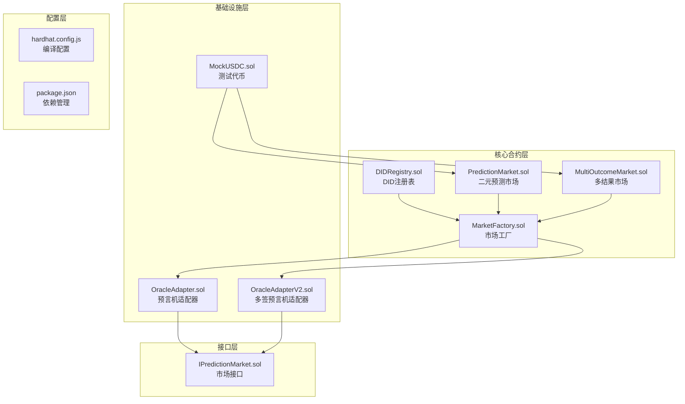
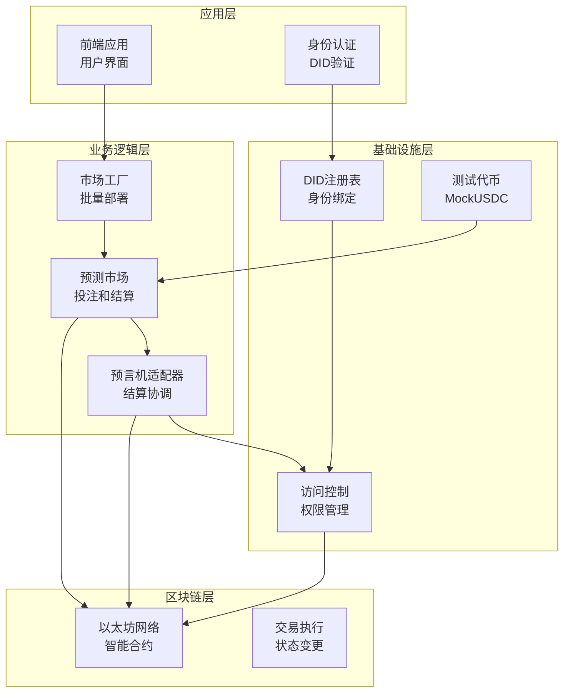
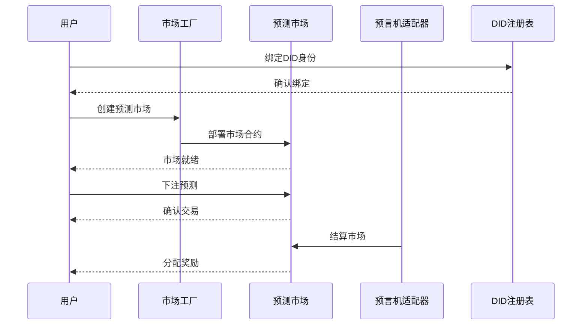
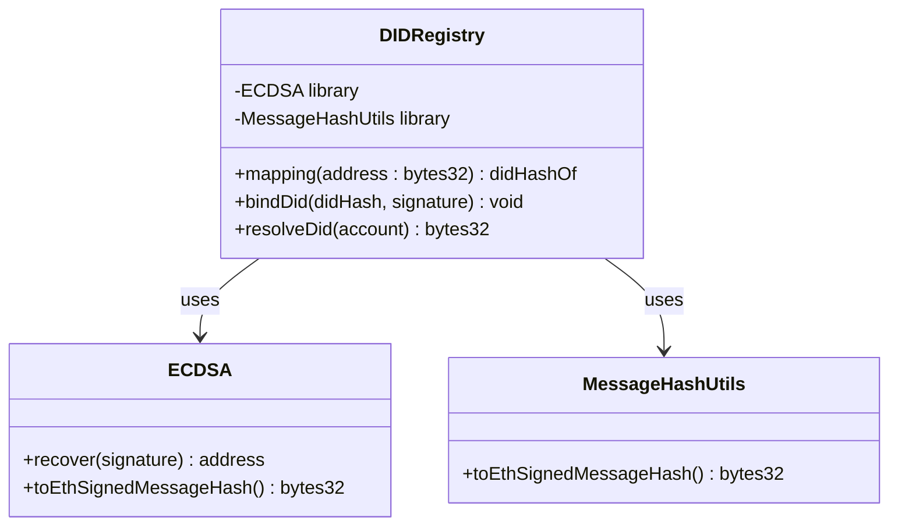
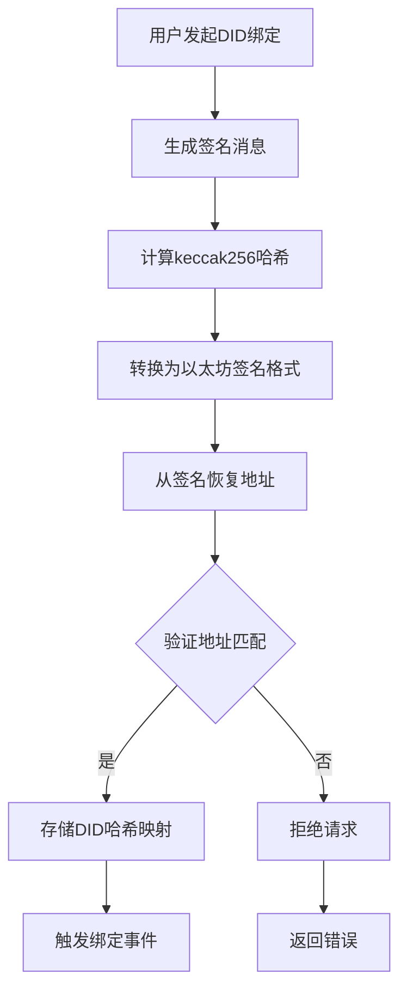
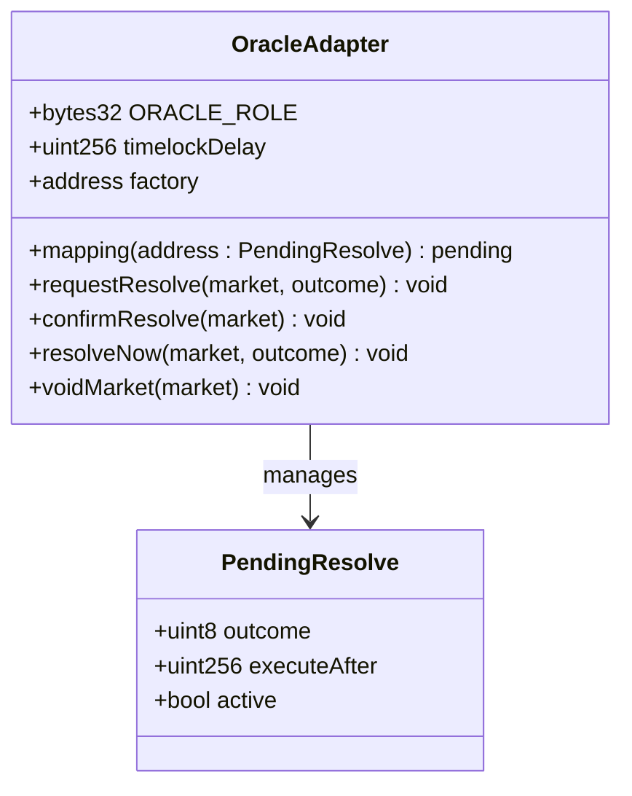
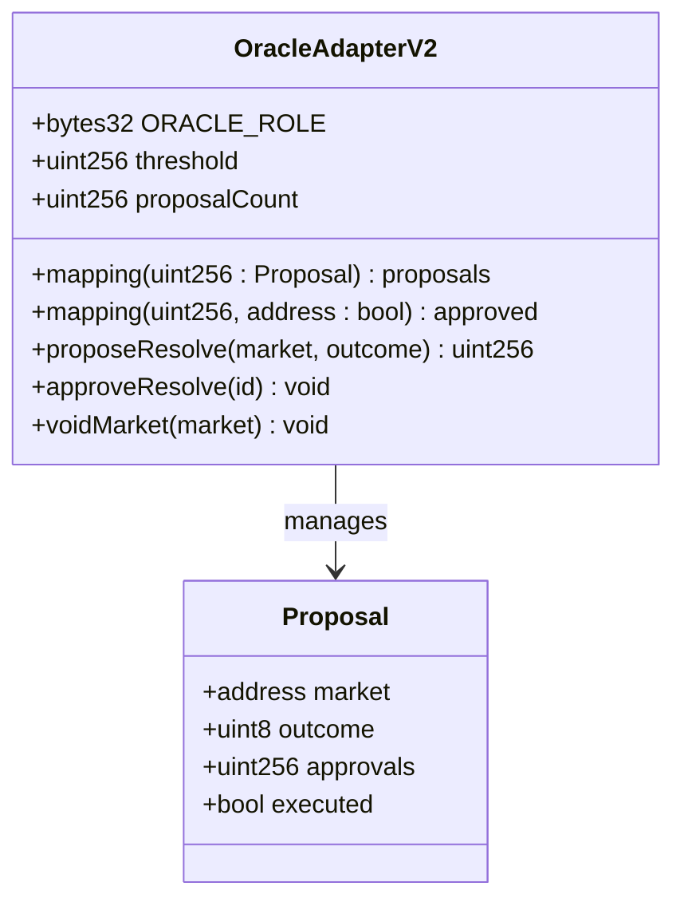
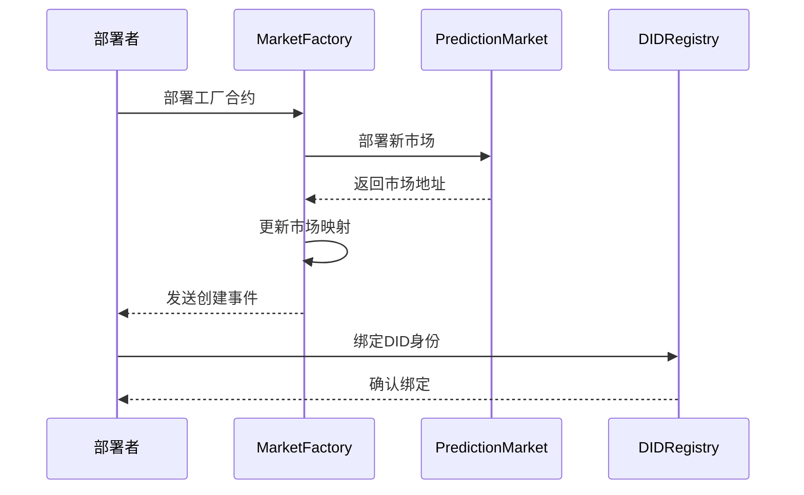
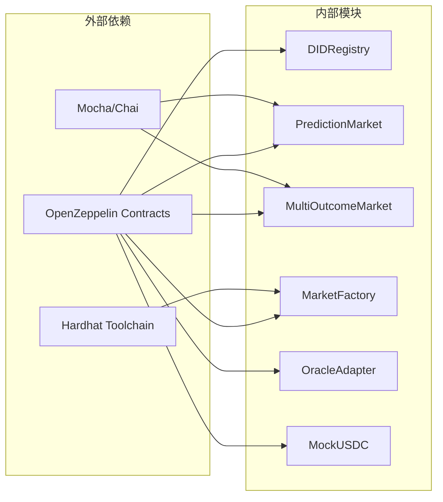

# 项目概述

<cite>
**本文档引用的文件**
- [DIDRegistry.sol](file://contracts/contracts/DIDRegistry.sol)
- [PredictionMarket.sol](file://contracts/contracts/PredictionMarket.sol)
- [MarketFactory.sol](file://contracts/contracts/MarketFactory.sol)
- [MultiOutcomeMarket.sol](file://contracts/contracts/MultiOutcomeMarket.sol)
- [OracleAdapter.sol](file://contracts/contracts/OracleAdapter.sol)
- [OracleAdapterV2.sol](file://contracts/contracts/OracleAdapterV2.sol)
- [MockUSDC.sol](file://contracts/contracts/MockUSDC.sol)
- [IPredictionMarket.sol](file://contracts/contracts/interfaces/IPredictionMarket.sol)
- [hardhat.config.js](file://contracts/hardhat.config.js)
- [package.json](file://contracts/package.json)
- [deploy.js](file://contracts/scripts/deploy.js)
- [seed-markets.js](file://contracts/scripts/seed-markets.js)
- [PredictionMarket.test.js](file://contracts/test/PredictionMarket.test.js)
</cite>

## 目录
1. [引言](#引言)
2. [项目结构](#项目结构)
3. [核心组件](#核心组件)
4. [架构概览](#架构概览)
5. [详细组件分析](#详细组件分析)
6. [依赖关系分析](#依赖关系分析)
7. [性能考虑](#性能考虑)
8. [故障排除指南](#故障排除指南)
9. [结论](#结论)

## 引言

预测市场DID认证系统是一个基于区块链的去中心化预测市场平台，旨在为用户提供透明、可信的预测和投注服务。该项目的核心创新在于将去中心化身份（DID）认证系统与预测市场相结合，通过智能合约确保市场的公正性和透明度。

### 项目目标

- **去中心化预测市场**：提供无需中介的预测和投注平台
- **DID认证集成**：将去中心化身份验证融入预测市场流程
- **互池式投注机制**：采用parimutuel模型，所有参与者共同承担风险
- **多重安全机制**：通过时间锁、多签和访问控制确保系统安全
- **可扩展架构**：支持二元和多结果预测市场

### 去中心化预测市场概念

去中心化预测市场是一种基于区块链的金融衍生品市场，允许用户对未来的事件进行预测和投注。与传统市场不同，预测市场具有以下特点：

- **无需信任第三方**：所有交易和结算由智能合约自动执行
- **完全透明**：所有交易记录都存储在公共区块链上
- **全球可访问**：任何有互联网连接的人都可以参与
- **抗审查性**：一旦部署，合约条款无法被单方面修改

## 项目结构

该项目采用模块化的合约架构设计，每个合约负责特定的功能领域：

**图表来源**
- [DIDRegistry.sol:1-39](file://contracts/contracts/DIDRegistry.sol#L1-L39)
- [PredictionMarket.sol:1-145](file://contracts/contracts/PredictionMarket.sol#L1-L145)
- [MarketFactory.sol:1-68](file://contracts/contracts/MarketFactory.sol#L1-L68)
- [OracleAdapter.sol:1-96](file://contracts/contracts/OracleAdapter.sol#L1-L96)

**章节来源**
- [hardhat.config.js:1-33](file://contracts/hardhat.config.js#L1-L33)
- [package.json:1-22](file://contracts/package.json#L1-L22)

## 核心组件

### DID注册表系统

DID注册表是整个系统身份认证的核心组件，负责将用户的钱包地址与去中心化身份（DID）进行绑定。

#### 核心功能
- **DID哈希绑定**：将用户地址与DID哈希建立永久关联
- **签名验证**：使用ECDSA验证DID绑定请求的真实性
- **地址解析**：提供从地址查询DID哈希的能力

#### 安全特性
- 使用以太坊标准签名格式（EIP-191）
- 防止重放攻击的签名验证机制
- 所有权控制的DID绑定操作

**章节来源**
- [DIDRegistry.sol:22-37](file://contracts/contracts/DIDRegistry.sol#L22-L37)

### 预测市场引擎

预测市场引擎提供核心的投注和结算功能，支持二元和多结果预测市场。

#### 二元预测市场（PredictionMarket）

二元预测市场是最基础的预测形式，只支持"是/否"两种结果：

- **资金池管理**：维护"是"方和"否"方两个独立资金池
- **互池式结算**：根据用户押注占总资金池的比例分配奖励
- **状态管理**：跟踪市场开放、结算和作废状态

#### 多结果预测市场（MultiOutcomeMarket）

多结果市场支持2-8种不同的预测结果：

- **扩展资金池**：为每种结果维护独立的资金池
- **手续费机制**：支持可配置的交易手续费
- **增强安全性**：集成重入攻击防护

**章节来源**
- [PredictionMarket.sol:70-143](file://contracts/contracts/PredictionMarket.sol#L70-L143)
- [MultiOutcomeMarket.sol:72-122](file://contracts/contracts/MultiOutcomeMarket.sol#L72-L122)

### 市场工厂系统

市场工厂负责批量创建和管理预测市场，提供标准化的市场部署流程。

#### 主要功能
- **批量部署**：一次部署多个预测市场合约
- **市场索引**：维护市场ID到合约地址的映射
- **权限控制**：只有工厂所有者可以创建新市场

#### 版本演进
- **MarketFactory**：基础版本，支持二元市场
- **MarketFactoryV3**：增强版本，支持多结果市场

**章节来源**
- [MarketFactory.sol:43-61](file://contracts/contracts/MarketFactory.sol#L43-L61)

### 预言机适配器系统

预言机适配器是预测市场系统的关键基础设施，负责处理市场结算和作废操作。

#### 单签适配器（OracleAdapter）

- **时间锁机制**：防止即时结算，提供争议解决时间窗口
- **角色管理**：基于AccessControl的角色控制系统
- **快速路径**：时间锁为0时的直接结算功能

#### 多签适配器（OracleAdapterV2）

- **m-of-n多签**：支持多个预言机的共识机制
- **提案系统**：完整的提案、批准和执行流程
- **阈值控制**：可配置的批准阈值

**章节来源**
- [OracleAdapter.sol:57-94](file://contracts/contracts/OracleAdapter.sol#L57-L94)
- [OracleAdapterV2.sol:51-93](file://contracts/contracts/OracleAdapterV2.sol#L51-L93)

## 架构概览

系统采用分层架构设计，每一层都有明确的职责分工：

**图表来源**
- [DIDRegistry.sol:12-38](file://contracts/contracts/DIDRegistry.sol#L12-L38)
- [MarketFactory.sol:12-35](file://contracts/contracts/MarketFactory.sol#L12-L35)
- [OracleAdapter.sol:11-40](file://contracts/contracts/OracleAdapter.sol#L11-L40)

### 数据流架构

**图表来源**
- [deploy.js:21-32](file://contracts/scripts/deploy.js#L21-L32)
- [PredictionMarket.test.js:36-54](file://contracts/test/PredictionMarket.test.js#L36-L54)

## 详细组件分析

### DID注册表详细分析

DID注册表实现了去中心化身份验证的核心功能，通过密码学手段确保身份的真实性和不可篡改性。

#### 核心数据结构

**图表来源**
- [DIDRegistry.sol:12-38](file://contracts/contracts/DIDRegistry.sol#L12-L38)

#### 绑定流程详解

**图表来源**
- [DIDRegistry.sol:23-32](file://contracts/contracts/DIDRegistry.sol#L23-L32)

**章节来源**
- [DIDRegistry.sol:22-37](file://contracts/contracts/DIDRegistry.sol#L22-L37)

### 预言机适配器详细分析

预言机适配器系统提供了灵活的市场结算机制，支持从简单的时间锁到复杂的多签共识。

#### 单签适配器架构

**图表来源**
- [OracleAdapter.sol:11-40](file://contracts/contracts/OracleAdapter.sol#L11-L40)

#### 多签适配器架构

**图表来源**
- [OracleAdapterV2.sol:11-38](file://contracts/contracts/OracleAdapterV2.sol#L11-L38)

**章节来源**
- [OracleAdapter.sol:57-94](file://contracts/contracts/OracleAdapter.sol#L57-L94)
- [OracleAdapterV2.sol:51-93](file://contracts/contracts/OracleAdapterV2.sol#L51-L93)

### 市场工厂详细分析

市场工厂提供了标准化的预测市场部署流程，确保所有市场遵循统一的参数和规则。

#### 工厂部署流程

**图表来源**
- [deploy.js:26-32](file://contracts/scripts/deploy.js#L26-L32)
- [MarketFactory.sol:48-61](file://contracts/contracts/MarketFactory.sol#L48-L61)

**章节来源**
- [MarketFactory.sol:43-61](file://contracts/contracts/MarketFactory.sol#L43-L61)

## 依赖关系分析

系统采用模块化设计，各组件之间的依赖关系清晰明确：

**图表来源**
- [package.json:15-20](file://contracts/package.json#L15-L20)
- [hardhat.config.js:10-16](file://contracts/hardhat.config.js#L10-L16)

### 关键依赖说明

- **OpenZeppelin Contracts**：提供安全的智能合约基础组件
- **Hardhat Toolchain**：开发和测试环境支持
- **Mocha/Chai**：测试框架和断言库

**章节来源**
- [package.json:15-20](file://contracts/package.json#L15-L20)

## 性能考虑

### Gas优化策略

系统在多个层面实施了Gas优化：

- **存储布局优化**：合理安排状态变量存储位置
- **循环优化**：避免不必要的循环操作
- **条件检查前置**：提前验证输入参数减少后续开销

### 安全性优化

- **重入攻击防护**：MultiOutcomeMarket使用ReentrancyGuard
- **访问控制**：基于Role的权限管理系统
- **输入验证**：严格的参数验证和边界检查

## 故障排除指南

### 常见部署问题

1. **编译错误**
   - 确保Solidity版本兼容（^0.8.24）
   - 检查OpenZeppelin依赖版本
   - 清理缓存后重新编译

2. **网络连接问题**
   - 验证RPC端点可达性
   - 检查网络ID配置
   - 确认账户有足够的ETH支付Gas费

### 运行时错误

1. **权限相关错误**
   - 确认调用者具有正确的角色权限
   - 检查角色授予流程
   - 验证时间锁是否过期

2. **状态相关错误**
   - 检查市场状态是否正确
   - 验证时间限制是否满足
   - 确认资金池状态

**章节来源**
- [PredictionMarket.test.js:72-76](file://contracts/test/PredictionMarket.test.js#L72-L76)

## 结论

预测市场DID认证系统代表了去中心化金融领域的创新实践，通过将身份认证与预测市场相结合，为用户提供了更加安全和可信的预测平台。

### 技术优势

- **去中心化架构**：消除单点故障风险
- **透明度高**：所有交易记录公开可查
- **安全性强**：多层安全机制保障
- **可扩展性好**：模块化设计便于扩展

### 应用场景

- **体育赛事预测**：足球、篮球等比赛结果预测
- **政治事件预测**：选举结果、政策变化预测
- **商业事件预测**：股价波动、产品发布预测
- **天气事件预测**：极端天气、自然灾害预测

### 未来发展

系统具备良好的扩展基础，未来可以支持：
- 更复杂的预测市场类型
- 更丰富的身份认证方式
- 更完善的治理机制
- 更广泛的生态系统集成