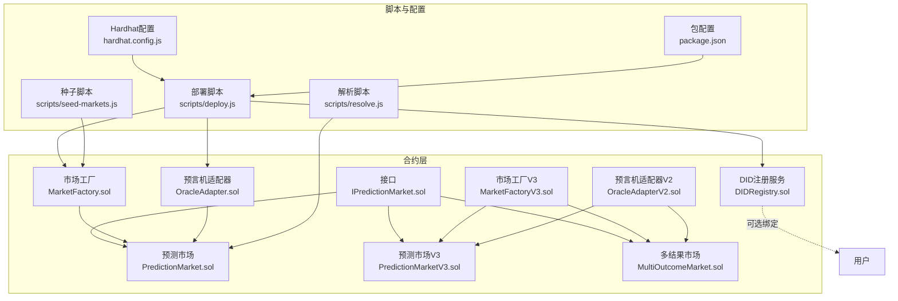
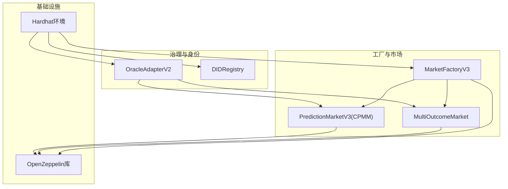
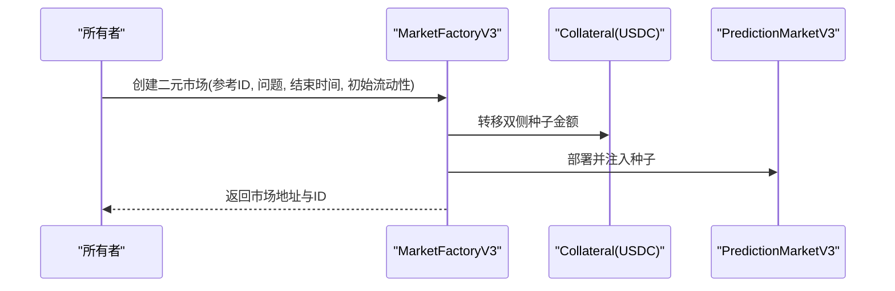
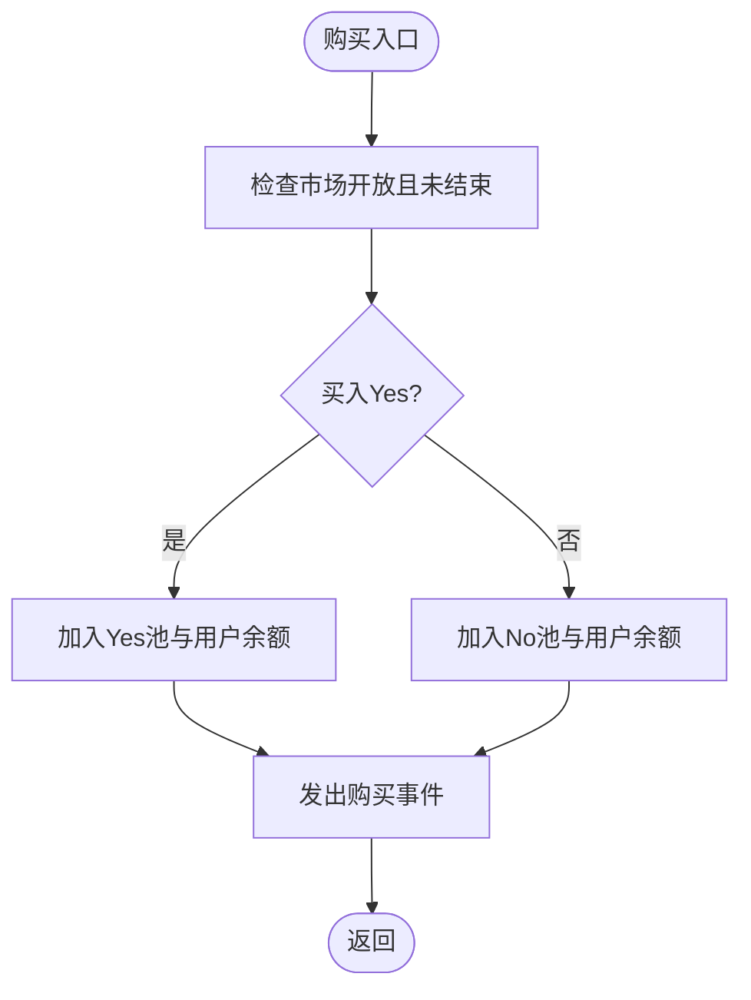
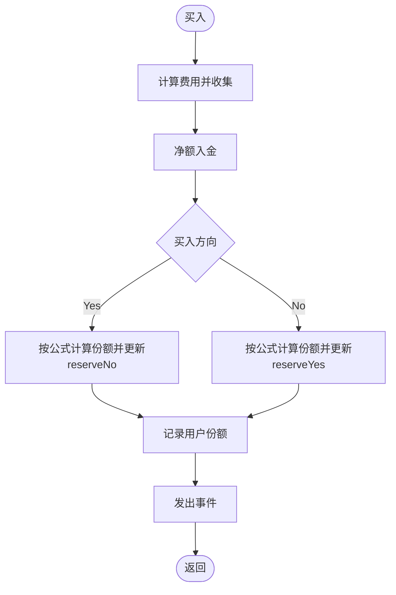
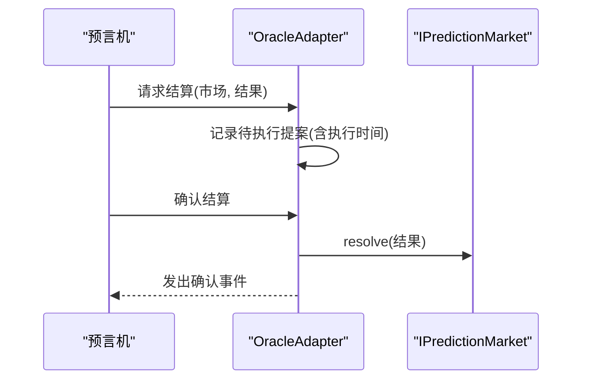
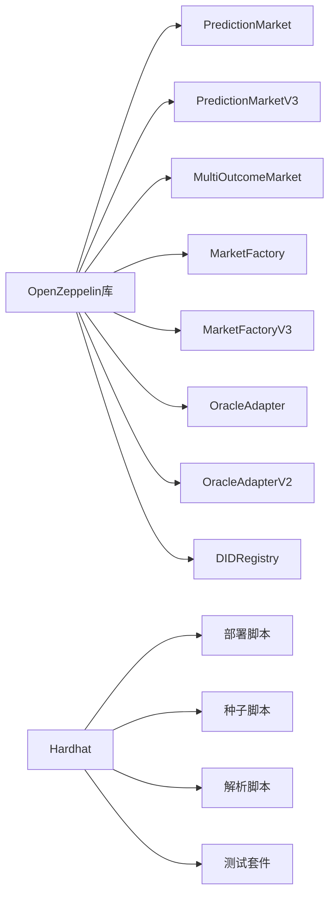

# 项目概述

<cite>
**本文档引用的文件**
- [contracts/PredictionMarket.sol](file://contracts/PredictionMarket.sol)
- [contracts/MarketFactory.sol](file://contracts/MarketFactory.sol)
- [contracts/DIDRegistry.sol](file://contracts/DIDRegistry.sol)
- [contracts/OracleAdapter.sol](file://contracts/OracleAdapter.sol)
- [contracts/PredictionMarketV3.sol](file://contracts/PredictionMarketV3.sol)
- [contracts/MarketFactoryV3.sol](file://contracts/MarketFactoryV3.sol)
- [contracts/MultiOutcomeMarket.sol](file://contracts/MultiOutcomeMarket.sol)
- [contracts/OracleAdapterV2.sol](file://contracts/OracleAdapterV2.sol)
- [contracts/interfaces/IPredictionMarket.sol](file://contracts/interfaces/IPredictionMarket.sol)
- [hardhat.config.js](file://hardhat.config.js)
- [package.json](file://package.json)
- [scripts/deploy.js](file://scripts/deploy.js)
- [scripts/seed-markets.js](file://scripts/seed-markets.js)
- [scripts/resolve.js](file://scripts/resolve.js)
- [test/MarketFactory.test.js](file://test/MarketFactory.test.js)
- [test/PredictionMarket.test.js](file://test/PredictionMarket.test.js)
- [test/Phase3.test.js](file://test/Phase3.test.js)
</cite>

## 目录
1. [简介](#简介)
2. [项目结构](#项目结构)
3. [核心组件](#核心组件)
4. [架构总览](#架构总览)
5. [详细组件分析](#详细组件分析)
6. [依赖分析](#依赖分析)
7. [性能考虑](#性能考虑)
8. [故障排除指南](#故障排除指南)
9. [结论](#结论)
10. [附录](#附录)

## 简介
本项目是一个面向去中心化预测市场的智能合约系统，旨在通过可验证的规则与透明机制，支持用户围绕未来事件进行投注与交易。项目采用Parimutuel（共注制）与CPMM（常数乘积做市商）两种机制，覆盖二元与多结果市场，并提供预言机适配器与DID注册服务以增强治理与身份绑定能力。

- 去中心化预测市场：用户围绕未来事件（如体育比赛结果）进行投注，最终由预言机确定结果，按规则分配奖池。
- Parimutuel机制：所有投注资金进入公共池，根据结果与投注比例进行分配；赢家获得总池按比例计算的回报。
- CPMM做市商模型：在二元市场中引入流动性池，支持做市与交易，费用用于奖励流动性提供者与系统收益。

版本演进：
- 基础版（Phase 2）：二元Parimutuel市场与工厂模式，使用时间锁预言机适配器。
- V3版本（Phase 3）：引入CPMM二元市场、多结果市场、多签预言机适配器、暂停机制与默认参数管理。

技术栈概览：
- Solidity 0.8.24
- OpenZeppelin 合约库（访问控制、可拥有者、安全转账、重入保护等）
- Hardhat 开发与测试框架
- 测试工具链与覆盖率工具

## 项目结构
项目采用“按功能模块划分”的组织方式，核心目录与文件如下：
- contracts：存放所有智能合约，含接口、市场合约、工厂、预言机适配器与DID注册服务
- scripts：部署与种子数据脚本
- test：基于Hardhat的单元测试
- artifacts/cache：编译产物与缓存
- 配置文件：hardhat.config.js、package.json

图表来源
- [contracts/MarketFactory.sol](file://contracts/MarketFactory.sol#L1-L60)
- [contracts/MarketFactoryV3.sol](file://contracts/MarketFactoryV3.sol#L1-L94)
- [contracts/PredictionMarket.sol](file://contracts/PredictionMarket.sol#L1-L134)
- [contracts/PredictionMarketV3.sol](file://contracts/PredictionMarketV3.sol#L1-L200)
- [contracts/MultiOutcomeMarket.sol](file://contracts/MultiOutcomeMarket.sol#L1-L113)
- [contracts/OracleAdapter.sol](file://contracts/OracleAdapter.sol#L1-L83)
- [contracts/OracleAdapterV2.sol](file://contracts/OracleAdapterV2.sol#L1-L83)
- [contracts/DIDRegistry.sol](file://contracts/DIDRegistry.sol#L1-L34)
- [contracts/interfaces/IPredictionMarket.sol](file://contracts/interfaces/IPredictionMarket.sol#L1-L9)
- [scripts/deploy.js](file://scripts/deploy.js#L1-L57)
- [scripts/seed-markets.js](file://scripts/seed-markets.js#L1-L34)
- [scripts/resolve.js](file://scripts/resolve.js#L1-L20)
- [hardhat.config.js](file://hardhat.config.js#L1-L30)
- [package.json](file://package.json#L1-L22)

章节来源
- [hardhat.config.js](file://hardhat.config.js#L1-L30)
- [package.json](file://package.json#L1-L22)

## 核心组件
- 市场工厂（MarketFactory/MarketFactoryV3）：负责创建二元Parimutuel市场或二元CPMM市场与多结果市场，管理默认参数与暂停状态。
- 预测市场合约（PredictionMarket/PredictionMarketV3）：实现Parimutuel与CPMM两种机制，支持购买份额、流动性添加/移除、结算与兑付。
- 多结果市场（MultiOutcomeMarket）：支持2-8个结果的Parimutuel市场。
- 预言机适配器（OracleAdapter/OracleAdapterV2）：提供时间锁或多签流程完成市场结算与作废。
- DID注册服务（DIDRegistry）：为账户绑定DID哈希，便于链上身份绑定与验证。
- 接口（IPredictionMarket）：统一预言机调用入口，确保适配器与不同市场版本的兼容性。

章节来源
- [contracts/MarketFactory.sol](file://contracts/MarketFactory.sol#L1-L60)
- [contracts/MarketFactoryV3.sol](file://contracts/MarketFactoryV3.sol#L1-L94)
- [contracts/PredictionMarket.sol](file://contracts/PredictionMarket.sol#L1-L134)
- [contracts/PredictionMarketV3.sol](file://contracts/PredictionMarketV3.sol#L1-L200)
- [contracts/MultiOutcomeMarket.sol](file://contracts/MultiOutcomeMarket.sol#L1-L113)
- [contracts/OracleAdapter.sol](file://contracts/OracleAdapter.sol#L1-L83)
- [contracts/OracleAdapterV2.sol](file://contracts/OracleAdapterV2.sol#L1-L83)
- [contracts/DIDRegistry.sol](file://contracts/DIDRegistry.sol#L1-L34)
- [contracts/interfaces/IPredictionMarket.sol](file://contracts/interfaces/IPredictionMarket.sol#L1-L9)

## 架构总览
系统采用分层设计：工厂层负责创建与配置市场；市场层承载业务逻辑；适配器层提供治理与预言机交互；DID层提供可选的身份绑定。测试与脚本贯穿部署、种子与解析流程。

图表来源
- [contracts/MarketFactoryV3.sol](file://contracts/MarketFactoryV3.sol#L1-L94)
- [contracts/PredictionMarketV3.sol](file://contracts/PredictionMarketV3.sol#L1-L200)
- [contracts/MultiOutcomeMarket.sol](file://contracts/MultiOutcomeMarket.sol#L1-L113)
- [contracts/OracleAdapterV2.sol](file://contracts/OracleAdapterV2.sol#L1-L83)
- [contracts/DIDRegistry.sol](file://contracts/DIDRegistry.sol#L1-L34)
- [hardhat.config.js](file://hardhat.config.js#L1-L30)

## 详细组件分析

### 市场工厂（MarketFactory/MarketFactoryV3）
- 职责：创建二元Parimutuel市场（Phase 2）或二元CPMM与多结果市场（Phase 3），设置默认费用、最大投注额、暂停状态与市场类型映射。
- 关键点：仅所有者可创建；V3支持暂停与默认参数；二元市场可注入初始流动性并播种池子。

图表来源
- [contracts/MarketFactoryV3.sol](file://contracts/MarketFactoryV3.sol#L37-L66)
- [contracts/PredictionMarketV3.sol](file://contracts/PredictionMarketV3.sol#L76-L90)

章节来源
- [contracts/MarketFactory.sol](file://contracts/MarketFactory.sol#L1-L60)
- [contracts/MarketFactoryV3.sol](file://contracts/MarketFactoryV3.sol#L1-L94)

### 预测市场合约（PredictionMarket/PredictionMarketV3）

#### Parimutuel二元市场（PredictionMarket）
- 机制：Yes/No两个池，按总池与胜方池比例分配。
- 功能：购买、结算（预言机）、作废、兑付。
- 安全：使用安全转账与状态约束。

图表来源
- [contracts/PredictionMarket.sol](file://contracts/PredictionMarket.sol#L64-L81)

章节来源
- [contracts/PredictionMarket.sol](file://contracts/PredictionMarket.sol#L1-L134)

#### CPMM二元市场（PredictionMarketV3）
- 机制：常数乘积做市商，买卖按公式动态定价；支持流动性提供与费用收集。
- 功能：购买、添加/移除流动性、查询池状态、结算与兑付。
- 安全：重入保护、用户最大投注限制、仅预言机可结算。

图表来源
- [contracts/PredictionMarketV3.sol](file://contracts/PredictionMarketV3.sol#L92-L111)
- [contracts/PredictionMarketV3.sol](file://contracts/PredictionMarketV3.sol#L178-L188)

章节来源
- [contracts/PredictionMarketV3.sol](file://contracts/PredictionMarketV3.sol#L1-L200)

#### 多结果市场（MultiOutcomeMarket）
- 机制：N结果（2-8）Parimutuel，按胜方池与用户投注比例兑付。
- 功能：购买、结算、作废、兑付。

章节来源
- [contracts/MultiOutcomeMarket.sol](file://contracts/MultiOutcomeMarket.sol#L1-L113)

### 预言机适配器（OracleAdapter/OracleAdapterV2）

#### 时间锁适配器（OracleAdapter）
- 机制：请求结算后进入时间锁窗口，到期后执行；支持立即结算（时间锁为0）与作废。
- 角色：默认管理员同时具备预言机角色。

图表来源
- [contracts/OracleAdapter.sol](file://contracts/OracleAdapter.sol#L48-L67)
- [contracts/interfaces/IPredictionMarket.sol](file://contracts/interfaces/IPredictionMarket.sol#L1-L9)

章节来源
- [contracts/OracleAdapter.sol](file://contracts/OracleAdapter.sol#L1-L83)

#### 多签适配器（OracleAdapterV2）
- 机制：提案-批准-执行流程，达到阈值后自动执行；支持作废。
- 角色：多签管理，提升治理安全性。

章节来源
- [contracts/OracleAdapterV2.sol](file://contracts/OracleAdapterV2.sol#L1-L83)

### DID注册服务（DIDRegistry）
- 机制：账户绑定DID哈希，使用签名恢复验证；提供解析接口。
- 应用：链上身份绑定与跨系统验证。

章节来源
- [contracts/DIDRegistry.sol](file://contracts/DIDRegistry.sol#L1-L34)

## 依赖分析
- 组件耦合：工厂与市场强耦合（工厂部署并持有市场地址），适配器与市场弱耦合（通过接口调用）。
- 外部依赖：OpenZeppelin库提供访问控制、可拥有者、安全转账与重入保护；Hardhat提供编译、测试与部署工具链。
- 版本演进：V3引入CPMM、多结果市场、多签适配器与暂停机制，提升灵活性与安全性。

图表来源
- [contracts/PredictionMarket.sol](file://contracts/PredictionMarket.sol#L4-L5)
- [contracts/PredictionMarketV3.sol](file://contracts/PredictionMarketV3.sol#L4-L6)
- [contracts/MultiOutcomeMarket.sol](file://contracts/MultiOutcomeMarket.sol#L4-L6)
- [contracts/MarketFactory.sol](file://contracts/MarketFactory.sol#L4-L5)
- [contracts/MarketFactoryV3.sol](file://contracts/MarketFactoryV3.sol#L4-L8)
- [contracts/OracleAdapter.sol](file://contracts/OracleAdapter.sol#L4)
- [contracts/OracleAdapterV2.sol](file://contracts/OracleAdapterV2.sol#L4)
- [contracts/DIDRegistry.sol](file://contracts/DIDRegistry.sol#L4-L6)
- [hardhat.config.js](file://hardhat.config.js#L1-L30)

章节来源
- [hardhat.config.js](file://hardhat.config.js#L1-L30)
- [package.json](file://package.json#L15-L20)

## 性能考虑
- 优化器：启用优化器并设置运行次数，降低Gas消耗。
- 重入保护：V3与多结果市场使用重入保护修饰符，避免攻击面。
- 事件与存储：合理使用事件日志与映射，平衡查询效率与写入成本。
- 批处理与批量操作：在脚本层面合并交易，减少链上往返。

章节来源
- [hardhat.config.js](file://hardhat.config.js#L7-L13)
- [contracts/PredictionMarketV3.sol](file://contracts/PredictionMarketV3.sol#L6)
- [contracts/MultiOutcomeMarket.sol](file://contracts/MultiOutcomeMarket.sol#L6)

## 故障排除指南
- 部署失败：检查本地网络配置与链ID；确认已安装依赖与编译产物存在。
- 市场无法创建：确认工厂所有者权限与暂停状态；检查代币授权与转移。
- 无法结算：确认适配器角色授予与时间锁/阈值条件满足；检查市场状态为开放。
- 兑付异常：确认市场已结算或作废；检查用户是否已兑付过；核对胜方池与用户余额。

章节来源
- [scripts/deploy.js](file://scripts/deploy.js#L1-L57)
- [scripts/seed-markets.js](file://scripts/seed-markets.js#L1-L34)
- [scripts/resolve.js](file://scripts/resolve.js#L1-L20)
- [test/MarketFactory.test.js](file://test/MarketFactory.test.js#L1-L28)
- [test/PredictionMarket.test.js](file://test/PredictionMarket.test.js#L29-L58)
- [test/Phase3.test.js](file://test/Phase3.test.js#L1-L24)

## 结论
本项目通过清晰的模块化设计与版本演进，实现了从基础Parimutuel到CPMM的升级路径，兼顾易用性与安全性。工厂与适配器解耦市场逻辑，DID服务提供可选的身份绑定能力。建议在生产环境中结合多签治理与充分测试，持续迭代以适配更复杂的业务场景。

## 附录

### 技术栈概览
- Solidity 版本：0.8.24
- OpenZeppelin 合约库：访问控制、可拥有者、安全转账、重入保护、暂停机制
- Hardhat：编译、测试、部署与本地节点
- 测试与覆盖率：Chai断言、Hardhat Network Helpers、solidity-coverage

章节来源
- [hardhat.config.js](file://hardhat.config.js#L7-L13)
- [package.json](file://package.json#L15-L20)

### 版本演进与里程碑
- Phase 2（基础版）：二元Parimutuel市场与工厂，时间锁预言机适配器。
- Phase 3（V3）：引入CPMM二元市场、多结果市场、多签适配器、暂停机制与默认参数管理。

章节来源
- [contracts/MarketFactory.sol](file://contracts/MarketFactory.sol#L56-L58)
- [contracts/MarketFactoryV3.sol](file://contracts/MarketFactoryV3.sol#L90-L92)
- [contracts/PredictionMarketV3.sol](file://contracts/PredictionMarketV3.sol#L1-L200)
- [contracts/MultiOutcomeMarket.sol](file://contracts/MultiOutcomeMarket.sol#L1-L113)
- [contracts/OracleAdapterV2.sol](file://contracts/OracleAdapterV2.sol#L1-L83)