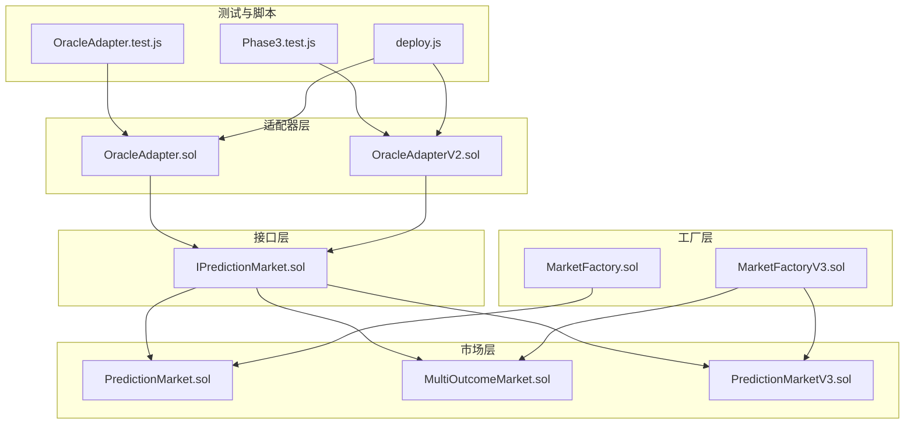
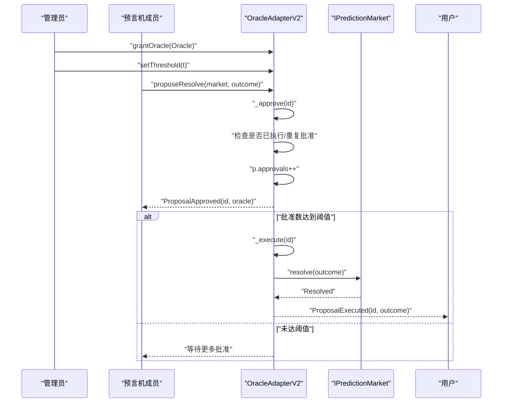
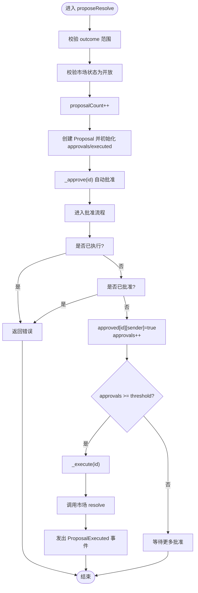
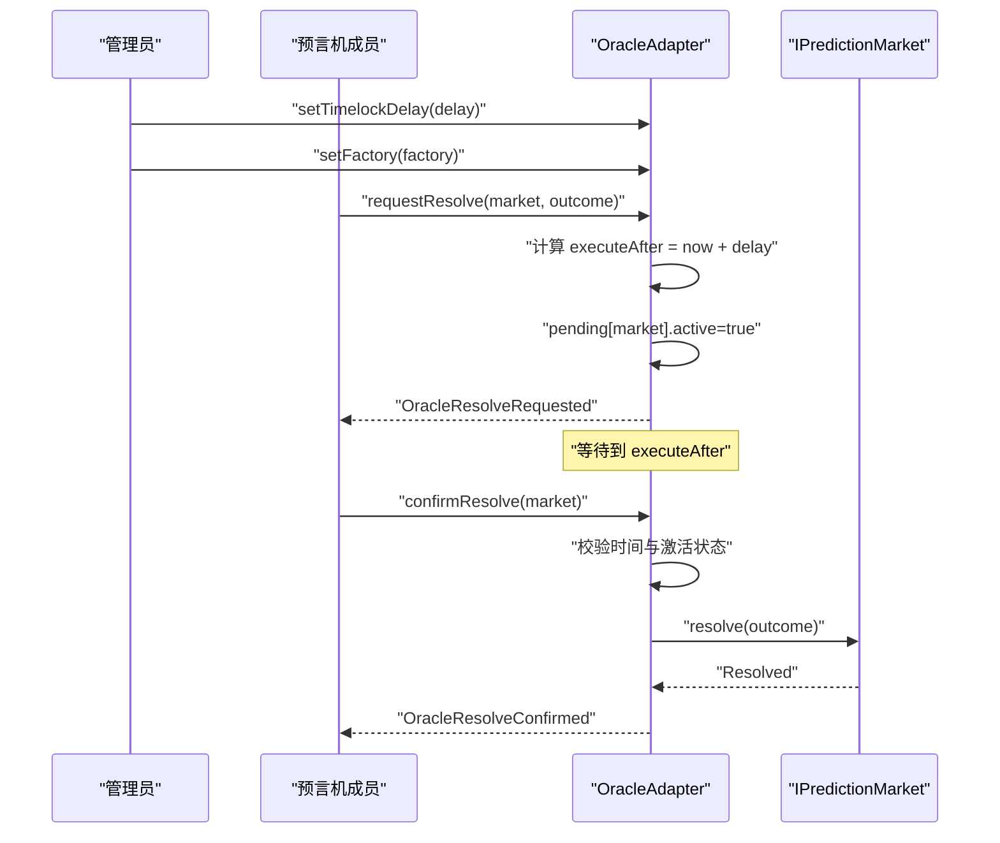
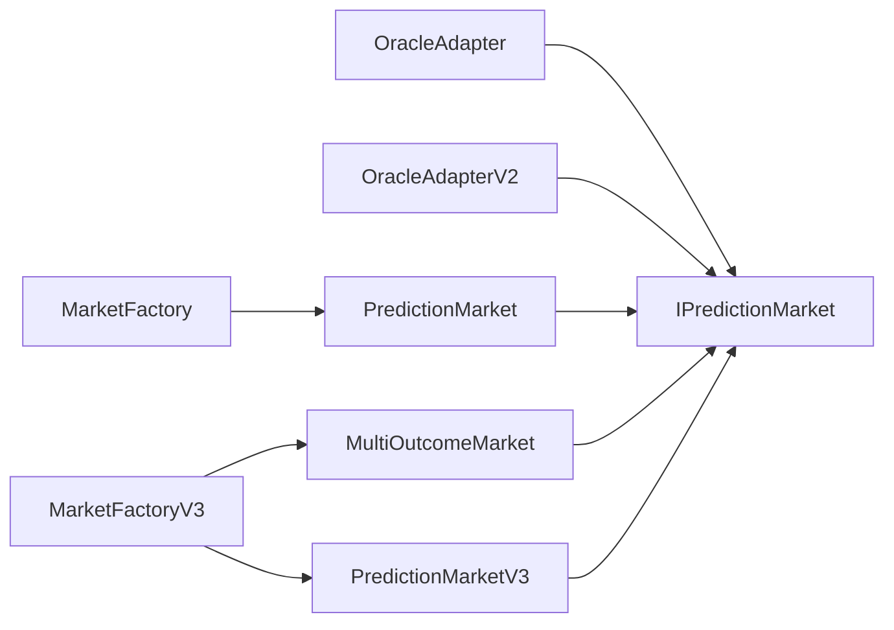
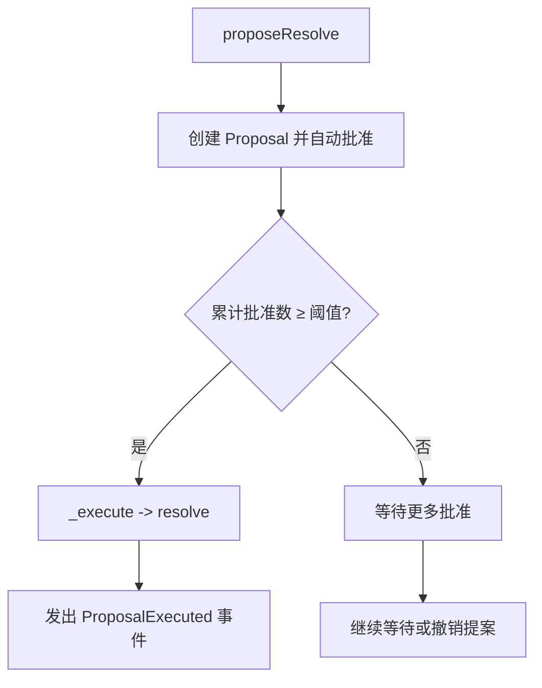

# 多签名共识机制

<cite>
**本文引用的文件**
- [OracleAdapterV2.sol](file://contracts/OracleAdapterV2.sol)
- [OracleAdapter.sol](file://contracts/OracleAdapter.sol)
- [IPredictionMarket.sol](file://contracts/interfaces/IPredictionMarket.sol)
- [PredictionMarket.sol](file://contracts/PredictionMarket.sol)
- [MultiOutcomeMarket.sol](file://contracts/MultiOutcomeMarket.sol)
- [PredictionMarketV3.sol](file://contracts/PredictionMarketV3.sol)
- [MarketFactory.sol](file://contracts/MarketFactory.sol)
- [MarketFactoryV3.sol](file://contracts/MarketFactoryV3.sol)
- [OracleAdapter.test.js](file://test/OracleAdapter.test.js)
- [Phase3.test.js](file://test/Phase3.test.js)
- [deploy.js](file://scripts/deploy.js)
- [hardhat.config.js](file://hardhat.config.js)
</cite>

## 目录
1. [简介](#简介)
2. [项目结构](#项目结构)
3. [核心组件](#核心组件)
4. [架构总览](#架构总览)
5. [详细组件分析](#详细组件分析)
6. [依赖关系分析](#依赖关系分析)
7. [性能考量](#性能考量)
8. [故障排查指南](#故障排查指南)
9. [结论](#结论)
10. [附录](#附录)

## 简介
本文件系统性阐述多签名共识机制在预测市场中的应用，重点对比 OracleAdapterV2 与基础版本 OracleAdapter 的差异，详解多签名提案的创建、投票与执行流程，解释共识阈值与签名验证机制，说明角色管理与权限分配，并提供部署配置、实际操作示例与最佳实践，最后总结多签名机制在风险控制方面的优势。

## 项目结构
该仓库围绕“预测市场 + 适配器 + 工厂”的分层组织：
- 接口层：定义市场统一接口，确保适配器可对不同市场类型进行解析与作废。
- 市场层：包含二元市场、多结果市场、CPMM 二元市场等，负责状态管理与结算。
- 适配器层：OracleAdapter（时间锁）与 OracleAdapterV2（多签名），负责提案、审批与执行。
- 工厂层：负责创建具体市场实例，绑定适配器与资产。
- 测试与脚本：验证流程与自动化部署。

图表来源
- [OracleAdapterV2.sol](file://contracts/OracleAdapterV2.sol#L1-L83)
- [OracleAdapter.sol](file://contracts/OracleAdapter.sol#L1-L83)
- [IPredictionMarket.sol](file://contracts/interfaces/IPredictionMarket.sol#L1-L9)
- [PredictionMarket.sol](file://contracts/PredictionMarket.sol#L1-L134)
- [MultiOutcomeMarket.sol](file://contracts/MultiOutcomeMarket.sol#L1-L113)
- [PredictionMarketV3.sol](file://contracts/PredictionMarketV3.sol#L1-L200)
- [MarketFactory.sol](file://contracts/MarketFactory.sol#L1-L60)
- [MarketFactoryV3.sol](file://contracts/MarketFactoryV3.sol#L1-L94)
- [OracleAdapter.test.js](file://test/OracleAdapter.test.js#L1-L50)
- [Phase3.test.js](file://test/Phase3.test.js#L1-L74)
- [deploy.js](file://scripts/deploy.js#L1-L57)

章节来源
- [OracleAdapterV2.sol](file://contracts/OracleAdapterV2.sol#L1-L83)
- [OracleAdapter.sol](file://contracts/OracleAdapter.sol#L1-L83)
- [IPredictionMarket.sol](file://contracts/interfaces/IPredictionMarket.sol#L1-L9)
- [PredictionMarket.sol](file://contracts/PredictionMarket.sol#L1-L134)
- [MultiOutcomeMarket.sol](file://contracts/MultiOutcomeMarket.sol#L1-L113)
- [PredictionMarketV3.sol](file://contracts/PredictionMarketV3.sol#L1-L200)
- [MarketFactory.sol](file://contracts/MarketFactory.sol#L1-L60)
- [MarketFactoryV3.sol](file://contracts/MarketFactoryV3.sol#L1-L94)
- [OracleAdapter.test.js](file://test/OracleAdapter.test.js#L1-L50)
- [Phase3.test.js](file://test/Phase3.test.js#L1-L74)
- [deploy.js](file://scripts/deploy.js#L1-L57)

## 核心组件
- OracleAdapterV2（多签名适配器）
  - 角色：ORACLE_ROLE，通过访问控制授权。
  - 阈值：threshold，达到阈值后自动执行提案。
  - 提案：Proposal 结构体，记录市场地址、结果、批准数与执行状态。
  - 关键函数：proposeResolve、approveResolve、voidMarket、setThreshold、grantOracle。
- OracleAdapter（时间锁适配器）
  - 角色：ORACLE_ROLE，支持请求与确认两阶段解析。
  - 时间锁：timelockDelay，请求后等待一段时间再确认执行。
  - 关键函数：requestResolve、confirmResolve、resolveNow（零时间锁）、voidMarket、setTimelockDelay、setFactory。
- 市场接口与实现
  - IPredictionMarket：统一的市场接口，包含 status、resolve、voidMarket。
  - PredictionMarket：二元市场（Yes/No），支持购买、解析与作废。
  - MultiOutcomeMarket：多结果市场（2-8 结果），支持购买、解析与作废。
  - PredictionMarketV3：CPMM 二元市场，支持流动性、费用与价格计算。
- 工厂
  - MarketFactory：创建二元市场。
  - MarketFactoryV3：创建二元 CPMM 市场与多结果市场。

章节来源
- [OracleAdapterV2.sol](file://contracts/OracleAdapterV2.sol#L1-L83)
- [OracleAdapter.sol](file://contracts/OracleAdapter.sol#L1-L83)
- [IPredictionMarket.sol](file://contracts/interfaces/IPredictionMarket.sol#L1-L9)
- [PredictionMarket.sol](file://contracts/PredictionMarket.sol#L1-L134)
- [MultiOutcomeMarket.sol](file://contracts/MultiOutcomeMarket.sol#L1-L113)
- [PredictionMarketV3.sol](file://contracts/PredictionMarketV3.sol#L1-L200)
- [MarketFactory.sol](file://contracts/MarketFactory.sol#L1-L60)
- [MarketFactoryV3.sol](file://contracts/MarketFactoryV3.sol#L1-L94)

## 架构总览
多签名共识通过 OracleAdapterV2 实现，其核心是“提案 + 多签审批 + 自动执行”。与时间锁适配器相比，V2 不依赖时间延迟，而是以“批准数 ≥ 阈值”作为触发条件，显著提升响应效率并降低外部不确定性。

图表来源
- [OracleAdapterV2.sol](file://contracts/OracleAdapterV2.sol#L44-L75)
- [IPredictionMarket.sol](file://contracts/interfaces/IPredictionMarket.sol#L4-L8)

章节来源
- [OracleAdapterV2.sol](file://contracts/OracleAdapterV2.sol#L1-L83)
- [IPredictionMarket.sol](file://contracts/interfaces/IPredictionMarket.sol#L1-L9)

## 详细组件分析

### OracleAdapterV2（多签名适配器）
- 角色与权限
  - DEFAULT_ADMIN_ROLE：可设置阈值、授予预言机角色。
  - ORACLE_ROLE：可发起提案、批准提案、作市。
- 数据结构
  - threshold：共识阈值。
  - proposalCount：提案计数器。
  - Proposal：包含市场地址、结果、批准数、执行标记。
  - approved：二维映射，记录每个提案被哪些预言机批准。
- 关键流程
  - 提案创建：校验市场开放状态与结果范围，自增提案号并自动批准。
  - 批准：校验未执行、未重复批准，更新批准数；若达到阈值则自动执行。
  - 执行：标记为已执行，调用市场 resolve。
  - 作废：仅在市场开放时允许作废，调用市场 voidMarket。
- 安全机制
  - 访问控制：onlyRole 限制调用者角色。
  - 防重入：通过状态检查避免重复执行。
  - 阈值保护：阈值必须大于 0，防止无约束执行。

图表来源
- [OracleAdapterV2.sol](file://contracts/OracleAdapterV2.sol#L44-L75)

章节来源
- [OracleAdapterV2.sol](file://contracts/OracleAdapterV2.sol#L1-L83)

### OracleAdapter（时间锁适配器）
- 角色与权限
  - DEFAULT_ADMIN_ROLE：可设置时间锁与工厂地址、授予预言机角色。
  - ORACLE_ROLE：可请求解析、确认解析、立即解析（当时间锁为 0）、作废。
- 数据结构
  - timelockDelay：时间锁秒数。
  - factory：工厂地址。
  - PendingResolve：记录待处理解析的结果、执行时间与激活状态。
- 关键流程
  - 请求解析：校验市场开放与结果范围，设置执行时间戳，写入 PendingResolve。
  - 确认解析：校验存在且未过期，置为非激活并调用市场 resolve。
  - 立即解析：当时间锁为 0 时，直接调用市场 resolve。
  - 作废：仅在市场开放时允许作废，调用市场 voidMarket。

图表来源
- [OracleAdapter.sol](file://contracts/OracleAdapter.sol#L48-L67)

章节来源
- [OracleAdapter.sol](file://contracts/OracleAdapter.sol#L1-L83)

### 市场接口与实现
- IPredictionMarket
  - status()：返回市场状态（Open/Resolved/Voided）。
  - resolve(winningOutcome)：由预言机调用解析市场。
  - voidMarket()：由预言机调用作废市场。
- PredictionMarket（二元 Yes/No）
  - 支持购买、解析、作废与结算。
- MultiOutcomeMarket（多结果 2-8）
  - 支持购买、解析、作废与结算。
- PredictionMarketV3（CPMM 二元）
  - 支持流动性、费用、价格计算与结算。

章节来源
- [IPredictionMarket.sol](file://contracts/interfaces/IPredictionMarket.sol#L1-L9)
- [PredictionMarket.sol](file://contracts/PredictionMarket.sol#L1-L134)
- [MultiOutcomeMarket.sol](file://contracts/MultiOutcomeMarket.sol#L1-L113)
- [PredictionMarketV3.sol](file://contracts/PredictionMarketV3.sol#L1-L200)

### 工厂与部署
- MarketFactory：创建二元市场，绑定适配器与资产。
- MarketFactoryV3：创建二元 CPMM 市场与多结果市场，支持暂停与默认参数。
- 部署脚本：部署 USDC、适配器、注册表、工厂，设置工厂与适配器关系并授权。

章节来源
- [MarketFactory.sol](file://contracts/MarketFactory.sol#L1-L60)
- [MarketFactoryV3.sol](file://contracts/MarketFactoryV3.sol#L1-L94)
- [deploy.js](file://scripts/deploy.js#L1-L57)

## 依赖关系分析
- 组件耦合
  - OracleAdapterV2/OracleAdapter 依赖 IPredictionMarket 接口，不关心具体市场实现。
  - 工厂负责创建市场并注入适配器地址，形成“工厂-市场-适配器”的链式依赖。
- 外部依赖
  - OpenZeppelin AccessControl：角色与权限管理。
  - OpenZeppelin ReentrancyGuard：防重入保护（部分市场）。
  - Hardhat 工具链：编译、测试与部署。

图表来源
- [OracleAdapter.sol](file://contracts/OracleAdapter.sol#L1-L83)
- [OracleAdapterV2.sol](file://contracts/OracleAdapterV2.sol#L1-L83)
- [IPredictionMarket.sol](file://contracts/interfaces/IPredictionMarket.sol#L1-L9)
- [PredictionMarket.sol](file://contracts/PredictionMarket.sol#L1-L134)
- [MultiOutcomeMarket.sol](file://contracts/MultiOutcomeMarket.sol#L1-L113)
- [PredictionMarketV3.sol](file://contracts/PredictionMarketV3.sol#L1-L200)
- [MarketFactory.sol](file://contracts/MarketFactory.sol#L1-L60)
- [MarketFactoryV3.sol](file://contracts/MarketFactoryV3.sol#L1-L94)

章节来源
- [OracleAdapter.sol](file://contracts/OracleAdapter.sol#L1-L83)
- [OracleAdapterV2.sol](file://contracts/OracleAdapterV2.sol#L1-L83)
- [IPredictionMarket.sol](file://contracts/interfaces/IPredictionMarket.sol#L1-L9)
- [PredictionMarket.sol](file://contracts/PredictionMarket.sol#L1-L134)
- [MultiOutcomeMarket.sol](file://contracts/MultiOutcomeMarket.sol#L1-L113)
- [PredictionMarketV3.sol](file://contracts/PredictionMarketV3.sol#L1-L200)
- [MarketFactory.sol](file://contracts/MarketFactory.sol#L1-L60)
- [MarketFactoryV3.sol](file://contracts/MarketFactoryV3.sol#L1-L94)

## 性能考量
- 多签名 V2 的优势
  - 无需等待时间锁，提高决策效率，适合高吞吐场景。
  - 阈值控制可平衡安全性与速度。
- 成本与复杂度
  - 批准存储为二维映射，提案数量增长会增加存储开销。
  - 批准数与阈值比较为常量时间，整体复杂度低。
- 最佳实践
  - 合理设置阈值，兼顾安全与效率。
  - 控制预言机成员规模，避免过度分散导致难以达成阈值。
  - 使用工厂模式统一部署与治理，减少重复配置。

## 故障排查指南
- 常见问题
  - “未开放状态无法解析/作废”：确保市场状态为 Open。
  - “阈值无效”：阈值必须大于 0。
  - “重复批准”：同一预言机不可重复批准同一提案。
  - “已执行提案再次执行”：执行后标记为已执行，不可重复执行。
- 测试参考
  - OracleAdapter 时间锁流程与作废退款测试。
  - OracleAdapterV2 多签名阈值测试与多结果市场解析测试。

章节来源
- [OracleAdapter.test.js](file://test/OracleAdapter.test.js#L1-L50)
- [Phase3.test.js](file://test/Phase3.test.js#L1-L74)
- [OracleAdapterV2.sol](file://contracts/OracleAdapterV2.sol#L57-L75)
- [OracleAdapter.sol](file://contracts/OracleAdapter.sol#L48-L67)

## 结论
OracleAdapterV2 将多签名共识引入预测市场解析流程，通过阈值驱动的即时执行替代时间锁，显著提升响应速度与确定性。结合工厂与市场的清晰分层，系统具备良好的可扩展性与可维护性。在风险控制方面，多签名机制通过角色分离与阈值门槛，有效降低单点攻击与误判风险，适合对安全性要求较高的应用场景。

## 附录

### 多签名共识流程（V2）
- 创建提案：proposeResolve
- 多签批准：approveResolve（每个预言机独立批准）
- 达阈执行：自动调用市场 resolve
- 作废流程：voidMarket（仅在开放状态下）

图表来源
- [OracleAdapterV2.sol](file://contracts/OracleAdapterV2.sol#L44-L75)

### 部署与配置指南
- 部署步骤
  - 部署 MockUSDC、OracleAdapterV2、DIDRegistry、MarketFactoryV3。
  - 设置工厂与适配器关系，授权管理员为 ORACLE_ROLE。
  - 可选：设置阈值与工厂参数。
- 环境变量
  - ORACLE_TIMELOCK_SECONDS：用于旧版适配器的时间锁（如需兼容）。
- 编译与网络
  - Solidity 版本与优化器配置见 hardhat 配置。

章节来源
- [deploy.js](file://scripts/deploy.js#L1-L57)
- [hardhat.config.js](file://hardhat.config.js#L1-L30)

### 实际示例与最佳实践
- 示例场景
  - 多结果市场解析：使用 OracleAdapterV2 提案并达到阈值后自动执行。
  - 二元 CPMM 市场解析：结合工厂与适配器，验证价格与收益。
- 最佳实践
  - 预言机成员轮换与备份，避免单一节点失效。
  - 阈值动态调整策略，根据市场波动与风险等级调整。
  - 事件监控与审计日志，确保可追溯性。

章节来源
- [Phase3.test.js](file://test/Phase3.test.js#L29-L72)
- [MarketFactoryV3.sol](file://contracts/MarketFactoryV3.sol#L37-L88)