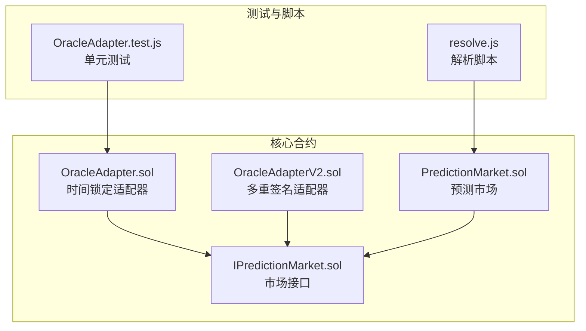
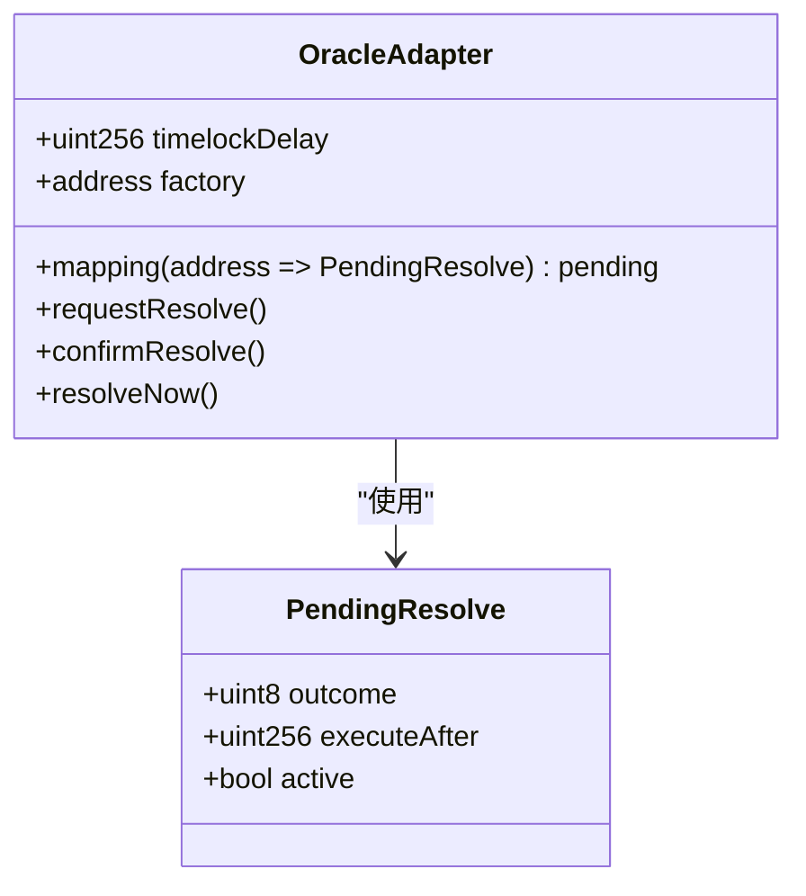
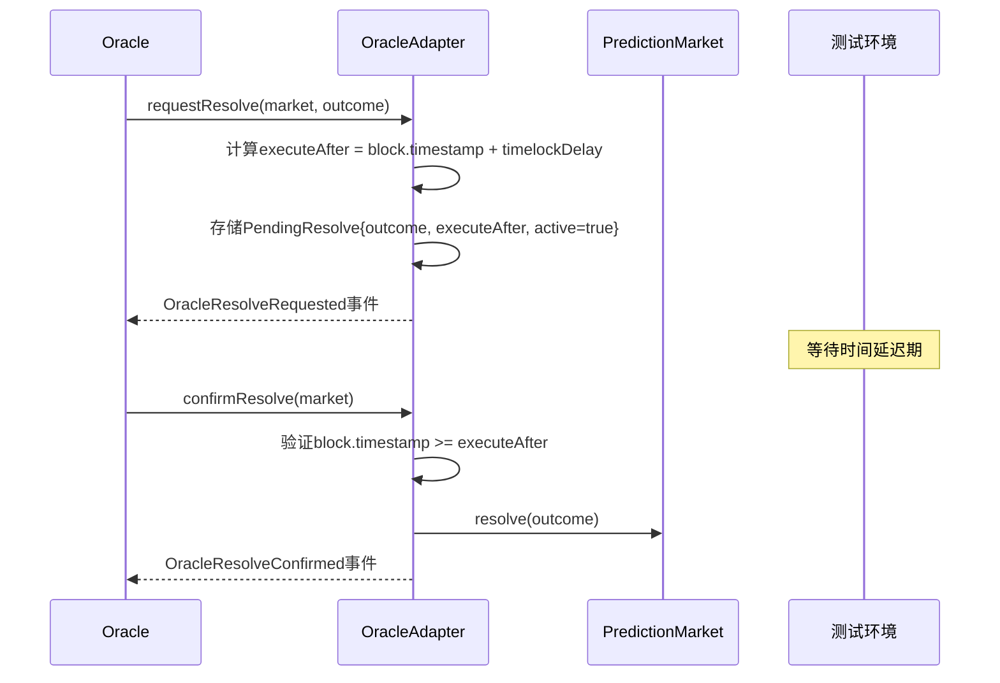
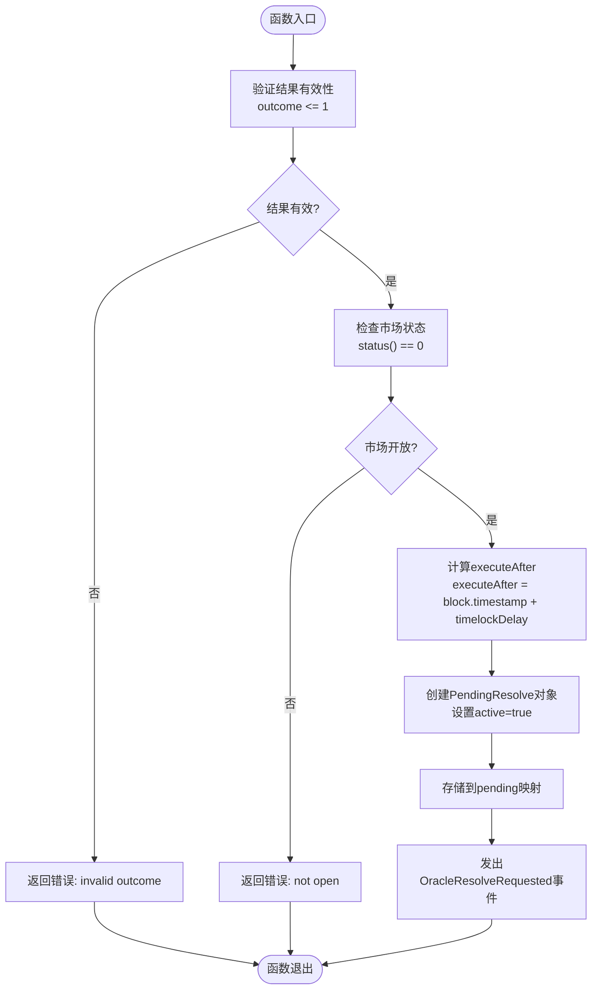
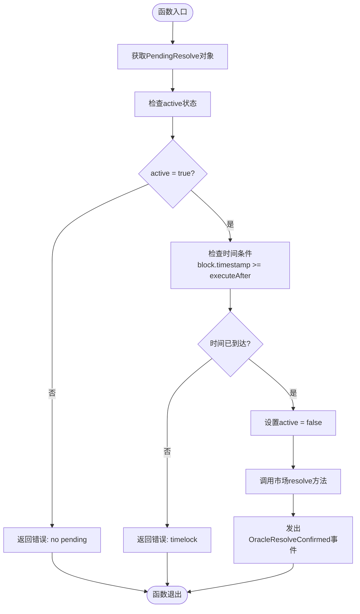
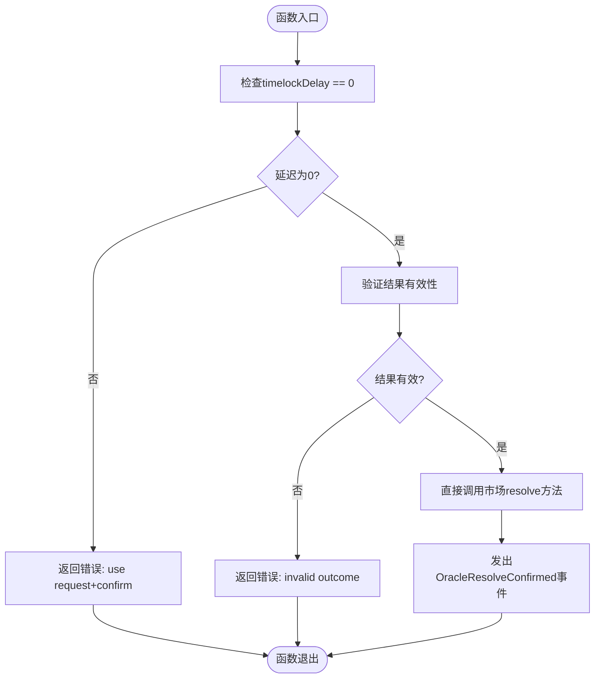
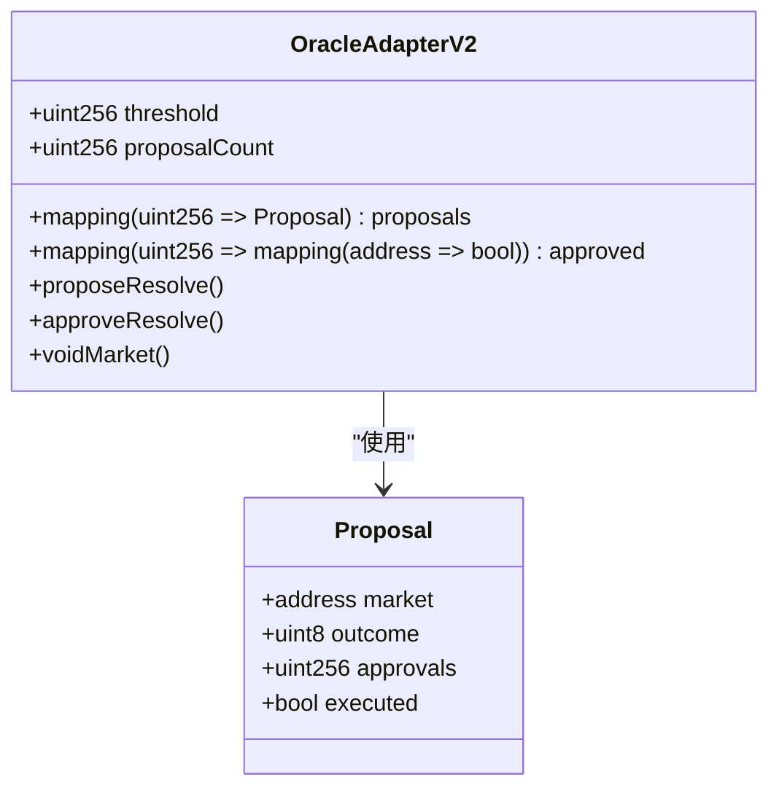
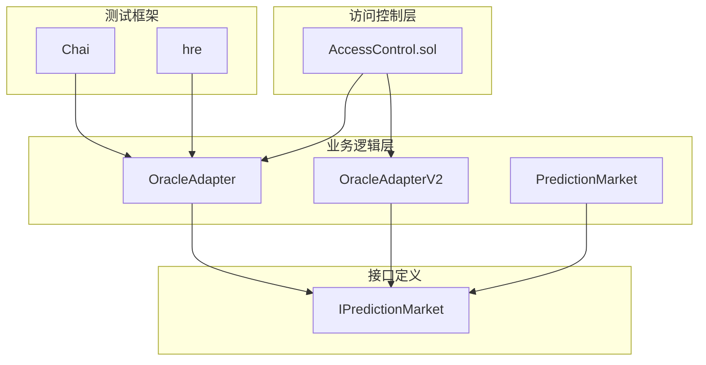
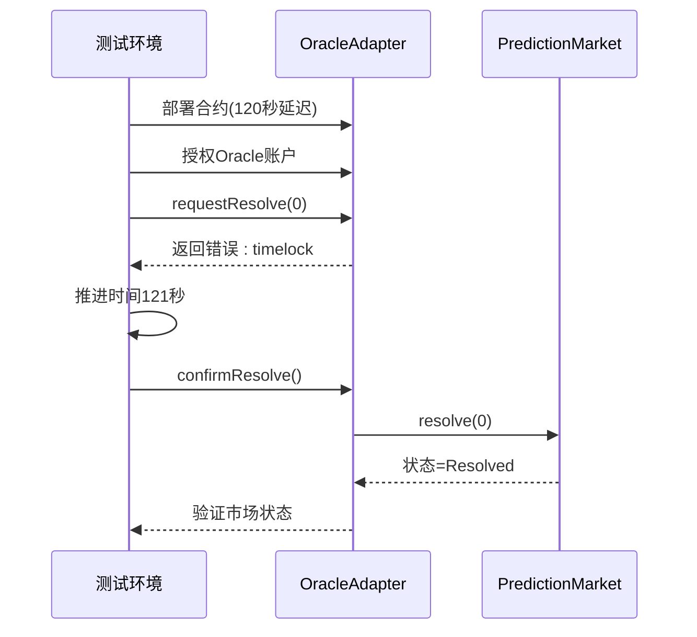

# 时间锁定机制

<cite>
**本文引用的文件**
- [OracleAdapter.sol](file://contracts/OracleAdapter.sol)
- [OracleAdapterV2.sol](file://contracts/OracleAdapterV2.sol)
- [IPredictionMarket.sol](file://contracts/interfaces/IPredictionMarket.sol)
- [PredictionMarket.sol](file://contracts/PredictionMarket.sol)
- [OracleAdapter.test.js](file://test/OracleAdapter.test.js)
- [resolve.js](file://scripts/resolve.js)
</cite>

## 目录
1. [简介](#简介)
2. [项目结构](#项目结构)
3. [核心组件](#核心组件)
4. [架构概览](#架构概览)
5. [详细组件分析](#详细组件分析)
6. [依赖关系分析](#依赖关系分析)
7. [性能考量](#性能考量)
8. [故障排除指南](#故障排除指南)
9. [结论](#结论)
10. [附录](#附录)

## 简介
本文档深入解析Prediction Markets系统中的时间锁定机制，重点阐述OracleAdapter合约如何通过时间延迟确保预测市场的公正性和安全性。该机制通过PendingResolve结构体存储待确认的解析请求，并在指定时间戳后才执行最终解析，有效防止了抢先交易和市场操纵行为。

## 项目结构
Prediction Markets系统采用模块化设计，核心围绕OracleAdapter合约构建时间锁定功能：



**图表来源**
- [OracleAdapter.sol](file://contracts/OracleAdapter.sol#L1-L83)
- [OracleAdapterV2.sol](file://contracts/OracleAdapterV2.sol#L1-L83)
- [IPredictionMarket.sol](file://contracts/interfaces/IPredictionMarket.sol#L1-L9)

**章节来源**
- [OracleAdapter.sol](file://contracts/OracleAdapter.sol#L1-L83)
- [OracleAdapterV2.sol](file://contracts/OracleAdapterV2.sol#L1-L83)
- [IPredictionMarket.sol](file://contracts/interfaces/IPredictionMarket.sol#L1-L9)

## 核心组件
时间锁定机制由三个关键组件构成：

### 1. PendingResolve结构体
这是时间锁定的核心数据结构，负责存储待确认的解析信息：



**图表来源**
- [OracleAdapter.sol](file://contracts/OracleAdapter.sol#L14-L20)

### 2. 时间锁定参数
- `timelockDelay`: 锁定延迟时间（秒）
- `executeAfter`: 执行时间戳（当前时间 + 延迟）
- `active`: 激活状态标志

### 3. 访问控制机制
- `ORACLE_ROLE`: Oracle角色权限
- `DEFAULT_ADMIN_ROLE`: 管理员角色权限
- 仅授权账户可执行解析操作

**章节来源**
- [OracleAdapter.sol](file://contracts/OracleAdapter.sol#L9-L20)
- [OracleAdapter.sol](file://contracts/OracleAdapter.sol#L44-L46)

## 架构概览
时间锁定机制采用两阶段确认流程，确保操作的透明性和不可逆性：



**图表来源**
- [OracleAdapter.sol](file://contracts/OracleAdapter.sol#L48-L67)
- [OracleAdapter.test.js](file://test/OracleAdapter.test.js#L6-L25)

## 详细组件分析

### PendingResolve结构体设计
PendingResolve结构体是时间锁定机制的数据载体，包含以下字段：

| 字段名 | 类型 | 描述 | 安全作用 |
|--------|------|------|----------|
| outcome | uint8 | 获胜结果（0或1） | 防止无效结果输入 |
| executeAfter | uint256 | 执行时间戳 | 实现时间锁定控制 |
| active | bool | 激活状态 | 防止重复执行 |

#### 存储机制
- 使用映射表 `mapping(address => PendingResolve)` 存储每个市场的待解析状态
- 键为市场合约地址，值为PendingResolve对象
- 支持O(1)的查找、插入和更新操作

**章节来源**
- [OracleAdapter.sol](file://contracts/OracleAdapter.sol#L14-L20)

### requestResolve函数实现
requestResolve函数负责启动时间锁定流程：



**图表来源**
- [OracleAdapter.sol](file://contracts/OracleAdapter.sol#L48-L58)

#### 关键实现要点
1. **输入验证**: 确保结果值在有效范围内（0或1）
2. **状态检查**: 验证市场处于开放状态
3. **时间计算**: 基于当前区块时间戳计算执行时间
4. **状态存储**: 将PendingResolve对象存储到映射表中
5. **事件通知**: 发出解析请求事件供外部监听

**章节来源**
- [OracleAdapter.sol](file://contracts/OracleAdapter.sol#L48-L58)

### confirmResolve函数机制
confirmResolve函数负责完成时间锁定流程的第二阶段：



**图表来源**
- [OracleAdapter.sol](file://contracts/OracleAdapter.sol#L60-L67)

#### 时间条件验证
- **时间戳比较**: `block.timestamp >= p.executeAfter`
- **防抢先交易**: 确保在指定时间后才能执行
- **不可逆性**: 一旦确认，状态被标记为非激活

**章节来源**
- [OracleAdapter.sol](file://contracts/OracleAdapter.sol#L60-L67)

### resolveNow快速路径
当`timelockDelay`设置为0时，系统提供resolveNow函数作为快速路径：



**图表来源**
- [OracleAdapter.sol](file://contracts/OracleAdapter.sol#L69-L75)

#### 快速路径特性
- **即时执行**: 无需等待时间延迟
- **简化流程**: 直接调用市场解析方法
- **安全限制**: 仅在延迟时间为0时可用

**章节来源**
- [OracleAdapter.sol](file://contracts/OracleAdapter.sol#L69-L75)

### OracleAdapterV2对比分析
OracleAdapterV2采用不同的多签名机制替代时间锁定：



**图表来源**
- [OracleAdapterV2.sol](file://contracts/OracleAdapterV2.sol#L14-L22)

#### 多重签名优势
- **去中心化**: 多个Oracle共同决策
- **阈值控制**: 可配置的批准阈值
- **透明度**: 所有提案和批准过程公开可见

**章节来源**
- [OracleAdapterV2.sol](file://contracts/OracleAdapterV2.sol#L1-L83)

## 依赖关系分析
时间锁定机制涉及多个合约间的复杂交互关系：



**图表来源**
- [OracleAdapter.sol](file://contracts/OracleAdapter.sol#L4-L5)
- [OracleAdapterV2.sol](file://contracts/OracleAdapterV2.sol#L4-L5)

### 关键依赖关系
1. **AccessControl集成**: 提供基于角色的权限管理
2. **IPredictionMarket接口**: 定义市场操作规范
3. **时间戳依赖**: 基于区块链时间戳的确定性
4. **事件驱动**: 通过事件实现状态变更通知

**章节来源**
- [OracleAdapter.sol](file://contracts/OracleAdapter.sol#L4-L5)
- [OracleAdapterV2.sol](file://contracts/OracleAdapterV2.sol#L4-L5)

## 性能考量
时间锁定机制在安全性与性能之间寻求平衡：

### 时间复杂度分析
- **PendingResolve存储**: O(1) - 映射表查找
- **时间检查**: O(1) - 单次时间戳比较
- **内存占用**: O(n) - n为活跃市场数量

### 安全性优化
- **重入保护**: 通过状态标志防止重复执行
- **输入验证**: 多层次输入验证确保数据完整性
- **权限控制**: 基于角色的严格访问控制

### 最佳实践建议
1. **合理设置延迟时间**: 平衡用户体验与安全需求
2. **监控执行状态**: 定期检查PendingResolve队列
3. **备份恢复机制**: 确保系统故障时的状态一致性

## 故障排除指南

### 常见错误及解决方案

#### 1. "timelock"错误
**症状**: 调用confirmResolve时返回时间锁定错误
**原因**: 当前区块时间早于executeAfter时间戳
**解决方案**: 
- 等待指定延迟时间后重试
- 使用测试工具增加时间推进

#### 2. "no pending"错误  
**症状**: 调用confirmResolve时返回无待处理请求
**原因**: 对应市场没有有效的PendingResolve记录
**解决方案**:
- 确认是否已调用requestResolve
- 检查市场地址是否正确

#### 3. "use request+confirm"错误
**症状**: 调用resolveNow时返回需要先请求确认
**原因**: timelockDelay不为0时不能使用快速路径
**解决方案**:
- 设置timelockDelay为0启用快速路径
- 或者使用标准的request+confirm流程

#### 4. "invalid outcome"错误
**症状**: 解析结果超出有效范围
**解决方案**:
- 确保结果值为0或1
- 检查输入参数类型

**章节来源**
- [OracleAdapter.test.js](file://test/OracleAdapter.test.js#L6-L25)

### 测试验证
系统提供了完整的测试套件验证时间锁定机制：



**图表来源**
- [OracleAdapter.test.js](file://test/OracleAdapter.test.js#L6-L25)

**章节来源**
- [OracleAdapter.test.js](file://test/OracleAdapter.test.js#L1-L50)

## 结论
时间锁定机制通过PendingResolve结构体和双阶段确认流程，为Prediction Markets系统提供了强大的安全保障。该机制有效防止了抢先交易、市场操纵等恶意行为，同时保持了系统的透明性和可审计性。通过合理的延迟时间和严格的权限控制，确保了预测市场的公平性和可信度。

对于生产环境部署，建议：
1. 根据市场类型和风险等级设置合适的延迟时间
2. 建立完善的监控和告警机制
3. 定期进行安全审计和压力测试
4. 制定应急响应预案

## 附录

### 时间锁定配置最佳实践

#### 1. 延迟时间设置指南
- **高价值市场**: 24-72小时延迟
- **普通市场**: 1-4小时延迟  
- **低价值市场**: 15-60分钟延迟

#### 2. 安全配置建议
- 启用多重签名机制
- 设置访问控制白名单
- 建立紧急暂停功能
- 定期更新Oracle成员

#### 3. 监控指标
- PendingResolve队列长度
- 平均确认时间
- 失败请求比例
- Oracle活跃度

### 实际操作示例

#### 示例1: 标准时间锁定流程
```javascript
// 1. 请求解析
await adapter.requestResolve(marketAddress, 0);

// 2. 等待延迟期结束
await time.increase(121); // 推进121秒

// 3. 确认解析
await adapter.confirmResolve(marketAddress);
```

#### 示例2: 快速路径解析
```javascript
// 1. 设置零延迟
await adapter.setTimelockDelay(0);

// 2. 直接解析
await adapter.resolveNow(marketAddress, 1);
```

**章节来源**
- [OracleAdapter.test.js](file://test/OracleAdapter.test.js#L6-L25)
- [resolve.js](file://scripts/resolve.js#L1-L20)