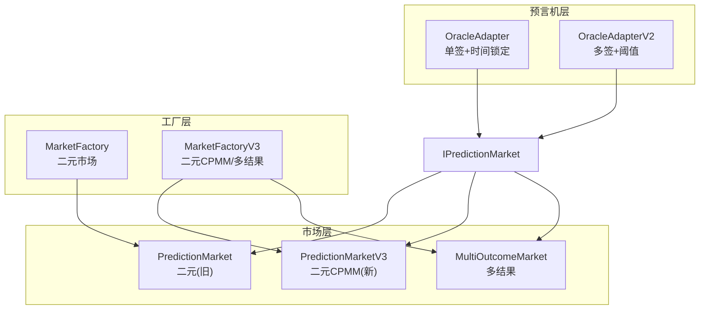
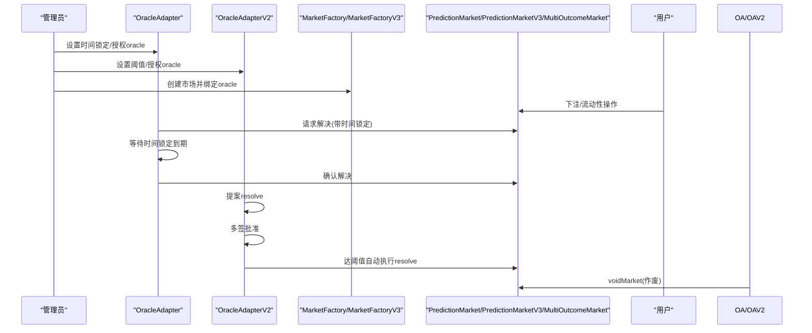
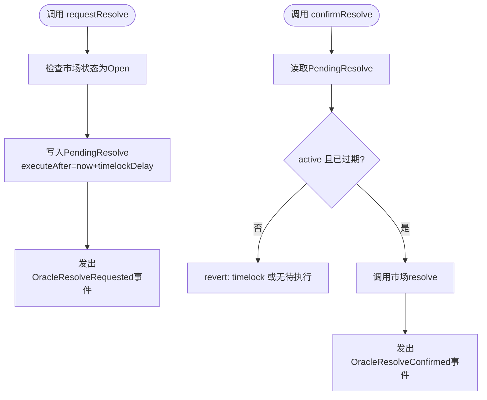
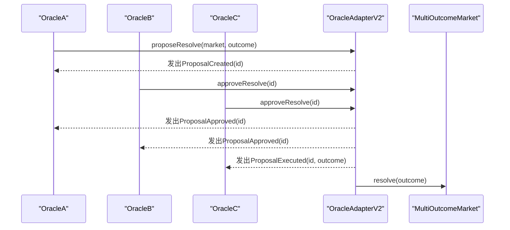
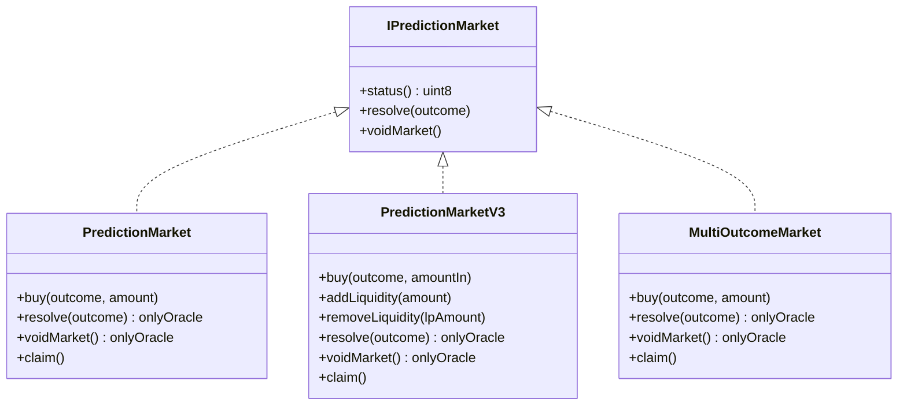
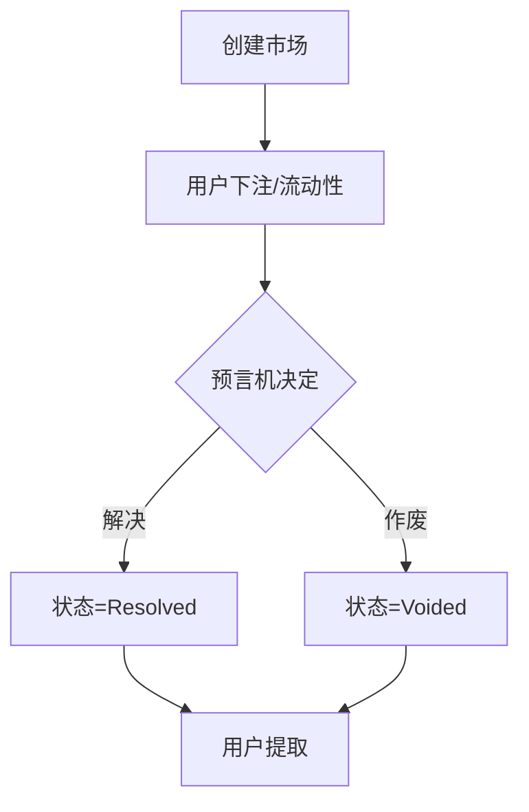
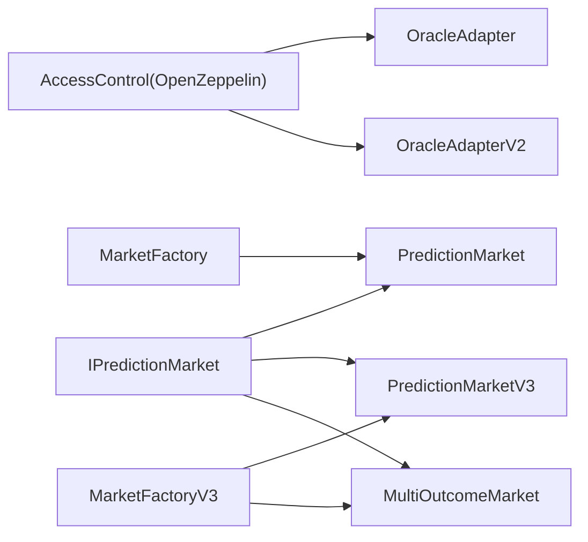

# 预言机机制

<cite>
**本文引用的文件**
- [OracleAdapter.sol](file://contracts/OracleAdapter.sol)
- [OracleAdapterV2.sol](file://contracts/OracleAdapterV2.sol)
- [PredictionMarket.sol](file://contracts/PredictionMarket.sol)
- [PredictionMarketV3.sol](file://contracts/PredictionMarketV3.sol)
- [MultiOutcomeMarket.sol](file://contracts/MultiOutcomeMarket.sol)
- [IPredictionMarket.sol](file://contracts/interfaces/IPredictionMarket.sol)
- [MarketFactory.sol](file://contracts/MarketFactory.sol)
- [MarketFactoryV3.sol](file://contracts/MarketFactoryV3.sol)
- [DIDRegistry.sol](file://contracts/DIDRegistry.sol)
- [MockUSDC.sol](file://contracts/MockUSDC.sol)
- [OracleAdapter.test.js](file://test/OracleAdapter.test.js)
- [deploy.js](file://scripts/deploy.js)
- [resolve.js](file://scripts/resolve.js)
- [hardhat.config.js](file://hardhat.config.js)
</cite>

## 目录
1. [简介](#简介)
2. [项目结构](#项目结构)
3. [核心组件](#核心组件)
4. [架构总览](#架构总览)
5. [详细组件分析](#详细组件分析)
6. [依赖关系分析](#依赖关系分析)
7. [性能与安全考量](#性能与安全考量)
8. [故障排查指南](#故障排查指南)
9. [结论](#结论)
10. [附录：部署与配置指南](#附录：部署与配置指南)

## 简介
本文件系统性阐述预测市场中的预言机机制，重点覆盖：
- 时间锁定解决流程与多签名共识机制的工作原理
- OracleAdapter 与 OracleAdapterV2 的实现差异及升级动机
- 预言机生命周期管理（从提案到解决）
- 风险控制（时间锁定保护、多签名验证）
- 部署与配置指南、实际操作示例与最佳实践
- 市场作废与争议解决流程
- 安全考虑与攻击防护

## 项目结构
该仓库围绕“预言机适配器”和“市场工厂/市场合约”构建，形成“工厂—市场—预言机”的协作链路。核心模块如下：
- 预言机适配器：OracleAdapter（单签+时间锁定）、OracleAdapterV2（多签+阈值）
- 市场合约：PredictionMarket（二元市场）、PredictionMarketV3（CPMM二元市场）、MultiOutcomeMarket（多结果市场）
- 工厂：MarketFactory（v2）、MarketFactoryV3（v3，支持CPMM与多结果）
- 接口：IPredictionMarket（统一市场接口）
- 辅助：DIDRegistry（可选DID绑定）、MockUSDC（测试代币）

图表来源
- [MarketFactory.sol](file://contracts/MarketFactory.sol#L1-L60)
- [MarketFactoryV3.sol](file://contracts/MarketFactoryV3.sol#L1-L94)
- [PredictionMarket.sol](file://contracts/PredictionMarket.sol#L1-L134)
- [PredictionMarketV3.sol](file://contracts/PredictionMarketV3.sol#L1-L200)
- [MultiOutcomeMarket.sol](file://contracts/MultiOutcomeMarket.sol#L1-L113)
- [OracleAdapter.sol](file://contracts/OracleAdapter.sol#L1-L83)
- [OracleAdapterV2.sol](file://contracts/OracleAdapterV2.sol#L1-L83)
- [IPredictionMarket.sol](file://contracts/interfaces/IPredictionMarket.sol#L1-L9)

章节来源
- [MarketFactory.sol](file://contracts/MarketFactory.sol#L1-L60)
- [MarketFactoryV3.sol](file://contracts/MarketFactoryV3.sol#L1-L94)
- [PredictionMarket.sol](file://contracts/PredictionMarket.sol#L1-L134)
- [PredictionMarketV3.sol](file://contracts/PredictionMarketV3.sol#L1-L200)
- [MultiOutcomeMarket.sol](file://contracts/MultiOutcomeMarket.sol#L1-L113)
- [OracleAdapter.sol](file://contracts/OracleAdapter.sol#L1-L83)
- [OracleAdapterV2.sol](file://contracts/OracleAdapterV2.sol#L1-L83)
- [IPredictionMarket.sol](file://contracts/interfaces/IPredictionMarket.sol#L1-L9)

## 核心组件
- 预言机适配器（OracleAdapter）：单签授权，请求后进入时间锁定窗口，到期后确认执行；支持即时解析（当时间锁定为0时）。
- 预言机适配器V2（OracleAdapterV2）：多签阈值机制，提案→多签批准→达到阈值自动执行；支持多结果（最多7）。
- 市场合约：通过 onlyOracle 修饰符限制 resolve/voidMarket 调用者为预言机；提供状态枚举（Open/Resolved/Voided）与结算逻辑。
- 工厂：负责创建市场并绑定 oracle 与 collateral；V3 支持 CPMM 与多结果市场。

章节来源
- [OracleAdapter.sol](file://contracts/OracleAdapter.sol#L1-L83)
- [OracleAdapterV2.sol](file://contracts/OracleAdapterV2.sol#L1-L83)
- [PredictionMarket.sol](file://contracts/PredictionMarket.sol#L1-L134)
- [PredictionMarketV3.sol](file://contracts/PredictionMarketV3.sol#L1-L200)
- [MultiOutcomeMarket.sol](file://contracts/MultiOutcomeMarket.sol#L1-L113)
- [MarketFactory.sol](file://contracts/MarketFactory.sol#L1-L60)
- [MarketFactoryV3.sol](file://contracts/MarketFactoryV3.sol#L1-L94)

## 架构总览
预言机在系统中的职责是作为权威来源，对市场进行“解决（resolve）”或“作废（void）”。工厂创建市场时注入 oracle 地址，市场合约仅允许该地址调用 resolve/voidMarket。适配器负责将外部决策转化为可审计、可延时或可共识的执行动作。

图表来源
- [OracleAdapter.sol](file://contracts/OracleAdapter.sol#L48-L81)
- [OracleAdapterV2.sol](file://contracts/OracleAdapterV2.sol#L44-L81)
- [MarketFactory.sol](file://contracts/MarketFactory.sol#L37-L54)
- [MarketFactoryV3.sol](file://contracts/MarketFactoryV3.sol#L37-L88)
- [PredictionMarket.sol](file://contracts/PredictionMarket.sol#L83-L95)
- [PredictionMarketV3.sol](file://contracts/PredictionMarketV3.sol#L137-L149)
- [MultiOutcomeMarket.sol](file://contracts/MultiOutcomeMarket.sol#L76-L87)

## 详细组件分析

### OracleAdapter（单签+时间锁定）
- 角色与权限：DEFAULT_ADMIN_ROLE 拥有设置时间锁定、工厂地址、授权 oracle；ORACLE_ROLE 执行请求/确认/作废。
- 关键数据结构：
  - PendingResolve：记录待执行的解决提案（结果、执行时间戳、是否激活）
- 核心流程：
  - requestResolve：校验市场开放且结果合法，写入 PendingResolve.executeAfter = now + timelockDelay
  - confirmResolve：校验存在待执行项且已过时间锁，调用市场 resolve 并发出事件
  - resolveNow：当 timelockDelay==0 时，直接 resolve（快速通道）
  - voidMarket：直接作废市场
- 风险控制：
  - 时间锁定防止“抢先交易”和短期价格操纵
  - 仅 ORACLE_ROLE 可操作，结合 AccessControl 实现最小权限

图表来源
- [OracleAdapter.sol](file://contracts/OracleAdapter.sol#L48-L67)

章节来源
- [OracleAdapter.sol](file://contracts/OracleAdapter.sol#L1-L83)

### OracleAdapterV2（多签+阈值）
- 角色与权限：DEFAULT_ADMIN_ROLE 设置阈值/授权 oracle；ORACLE_ROLE 提案/批准/作废。
- 关键数据结构：
  - Proposal：记录提案（市场地址、结果、批准数、是否已执行）
  - approved：按提案维度记录每个 oracle 是否已批准
- 核心流程：
  - proposeResolve：生成新提案，自动批准发起者，发出 ProposalCreated
  - approveResolve：任一 oracle 可批准同一提案，累计达到阈值后自动执行
  - _execute：标记已执行并调用市场 resolve
  - voidMarket：直接作废市场
- 结果范围：支持最多7个结果（outcome<=7），适用于多结果市场
- 风险控制：
  - 多签阈值降低单点失效风险
  - 每提案独立批准矩阵，避免串扰

图表来源
- [OracleAdapterV2.sol](file://contracts/OracleAdapterV2.sol#L44-L75)

章节来源
- [OracleAdapterV2.sol](file://contracts/OracleAdapterV2.sol#L1-L83)

### 市场合约（PredictionMarket/PredictionMarketV3/MultiOutcomeMarket）
- 共同点：
  - onlyOracle 修饰符确保只有预言机能调用 resolve/voidMarket
  - 状态枚举：Open/Resolved/Voided
  - 结算与提取：Resolved 按池子比例结算；Voided 返还全部投注
- PredictionMarket（二元旧版）：
  - parimutuel 计算，yes/no 两个池
  - 仅支持二元结果（0/1）
- PredictionMarketV3（二元CPMM新版）：
  - 使用恒定乘积做市商模型（CPMM），支持流动性提供与费用
  - 引入 feeBps、maxBetPerUser、LP 池等
- MultiOutcomeMarket（多结果）：
  - 支持 2-8 结果
  - 每结果独立池，结算按获胜池与个人投注比例计算

图表来源
- [IPredictionMarket.sol](file://contracts/interfaces/IPredictionMarket.sol#L1-L9)
- [PredictionMarket.sol](file://contracts/PredictionMarket.sol#L1-L134)
- [PredictionMarketV3.sol](file://contracts/PredictionMarketV3.sol#L1-L200)
- [MultiOutcomeMarket.sol](file://contracts/MultiOutcomeMarket.sol#L1-L113)

章节来源
- [IPredictionMarket.sol](file://contracts/interfaces/IPredictionMarket.sol#L1-L9)
- [PredictionMarket.sol](file://contracts/PredictionMarket.sol#L1-L134)
- [PredictionMarketV3.sol](file://contracts/PredictionMarketV3.sol#L1-L200)
- [MultiOutcomeMarket.sol](file://contracts/MultiOutcomeMarket.sol#L1-L113)

### 工厂与市场生命周期
- MarketFactory：创建二元市场，绑定 oracle 与 collateral
- MarketFactoryV3：创建二元 CPMM 市场与多结果市场，支持暂停、默认费率与最大下注额
- 生命周期阶段：Open → Resolved/Voided → Claim（用户提取）

图表来源
- [MarketFactory.sol](file://contracts/MarketFactory.sol#L37-L54)
- [MarketFactoryV3.sol](file://contracts/MarketFactoryV3.sol#L37-L88)
- [PredictionMarket.sol](file://contracts/PredictionMarket.sol#L83-L113)
- [PredictionMarketV3.sol](file://contracts/PredictionMarketV3.sol#L137-L165)
- [MultiOutcomeMarket.sol](file://contracts/MultiOutcomeMarket.sol#L76-L111)

章节来源
- [MarketFactory.sol](file://contracts/MarketFactory.sol#L1-L60)
- [MarketFactoryV3.sol](file://contracts/MarketFactoryV3.sol#L1-L94)
- [PredictionMarket.sol](file://contracts/PredictionMarket.sol#L1-L134)
- [PredictionMarketV3.sol](file://contracts/PredictionMarketV3.sol#L1-L200)
- [MultiOutcomeMarket.sol](file://contracts/MultiOutcomeMarket.sol#L1-L113)

## 依赖关系分析
- 权限与访问控制：OracleAdapter/OA V2 继承 AccessControl，使用 DEFAULT_ADMIN_ROLE 与 ORACLE_ROLE 控制能力
- 市场接口：IPredictionMarket 为统一契约，三类市场均实现该接口
- 工厂与市场：工厂创建市场并注入 oracle；市场仅允许 oracle 调用 resolve/voidMarket
- 外部依赖：OpenZeppelin 合约库（AccessControl、ReentrancyGuard、SafeERC20 等）

图表来源
- [OracleAdapter.sol](file://contracts/OracleAdapter.sol#L4-L5)
- [OracleAdapterV2.sol](file://contracts/OracleAdapterV2.sol#L4-L5)
- [IPredictionMarket.sol](file://contracts/interfaces/IPredictionMarket.sol#L1-L9)
- [PredictionMarket.sol](file://contracts/PredictionMarket.sol#L1-L134)
- [PredictionMarketV3.sol](file://contracts/PredictionMarketV3.sol#L1-L200)
- [MultiOutcomeMarket.sol](file://contracts/MultiOutcomeMarket.sol#L1-L113)
- [MarketFactory.sol](file://contracts/MarketFactory.sol#L1-L60)
- [MarketFactoryV3.sol](file://contracts/MarketFactoryV3.sol#L1-L94)

章节来源
- [OracleAdapter.sol](file://contracts/OracleAdapter.sol#L1-L83)
- [OracleAdapterV2.sol](file://contracts/OracleAdapterV2.sol#L1-L83)
- [IPredictionMarket.sol](file://contracts/interfaces/IPredictionMarket.sol#L1-L9)
- [PredictionMarket.sol](file://contracts/PredictionMarket.sol#L1-L134)
- [PredictionMarketV3.sol](file://contracts/PredictionMarketV3.sol#L1-L200)
- [MultiOutcomeMarket.sol](file://contracts/MultiOutcomeMarket.sol#L1-L113)
- [MarketFactory.sol](file://contracts/MarketFactory.sol#L1-L60)
- [MarketFactoryV3.sol](file://contracts/MarketFactoryV3.sol#L1-L94)

## 性能与安全考量
- 性能
  - OracleAdapterV2 的多签路径引入映射存储（approved[id][oracle]），提案数量增长会增加 gas 开销；建议合理设置阈值与提案上限
  - PredictionMarketV3 的 CPMM 计算在 swap/claim 中执行，需关注大额交易的 gas 使用
- 安全
  - ReentrancyGuard 在 V3 与多结果市场中启用，防范重入攻击
  - AccessControl 严格限制 oracle 权限，避免越权调用
  - 时间锁定与阈值共同提升抗操纵能力
- 最佳实践
  - 对于高价值市场，优先采用 OracleAdapterV2（多签阈值）
  - 合理设置时间锁定窗口，平衡用户体验与安全性
  - 对多结果市场使用 OracleAdapterV2 并设定合理的阈值

章节来源
- [OracleAdapterV2.sol](file://contracts/OracleAdapterV2.sol#L1-L83)
- [PredictionMarketV3.sol](file://contracts/PredictionMarketV3.sol#L1-L200)
- [MultiOutcomeMarket.sol](file://contracts/MultiOutcomeMarket.sol#L1-L113)
- [OracleAdapter.sol](file://contracts/OracleAdapter.sol#L1-L83)

## 故障排查指南
- 常见错误与定位
  - “timelock”：在 OracleAdapter 中 confirmResolve 未到时间锁结束
  - “not open”：resolve/voidMarket 仅在 Open 状态可用
  - “invalid outcome/outcome”：结果超出范围（二元 vs 多结果）
  - “no pending”：未找到待执行的请求
  - “executed”：提案已被执行
- 测试参考
  - 单测覆盖了时间锁定流程与作废退款场景，可作为行为基线

章节来源
- [OracleAdapter.test.js](file://test/OracleAdapter.test.js#L1-L50)
- [OracleAdapter.sol](file://contracts/OracleAdapter.sol#L48-L81)
- [OracleAdapterV2.sol](file://contracts/OracleAdapterV2.sol#L44-L81)

## 结论
- OracleAdapter 适合简单、低复杂度的二元市场，强调“快速通道”与“时间锁定保护”
- OracleAdapterV2 适合高价值、需要去中心化共识的多结果市场，强调“多签阈值”与“可审计执行”
- 市场合约通过统一接口与严格的 onlyOracle 限制，确保解决/作废流程的确定性
- 工厂层提供灵活的市场类型选择（二元/CPMM/多结果），满足不同业务需求

## 附录：部署与配置指南

### 部署步骤（本地/测试网络）
- 部署 MockUSDC、OracleAdapter、DIDRegistry、MarketFactory
- 将 OracleAdapter 的工厂地址设置为 MarketFactory 地址
- 授权部署者为 oracle，以便后续进行 resolve/voidMarket
- 创建市场并进行下注与结算

章节来源
- [deploy.js](file://scripts/deploy.js#L1-L57)

### 配置参数
- OracleAdapter
  - timelockDelay：秒级时间锁定窗口
  - factory：工厂地址（用于白名单/治理用途）
- OracleAdapterV2
  - threshold：多签阈值（必须大于0）
- MarketFactoryV3
  - defaultFeeBps：默认手续费（bps）
  - defaultMaxBet：默认单用户最大下注额
- PredictionMarketV3
  - feeBps：市场手续费（bps）
  - maxBetPerUser：单用户最大下注额
  - initialLiquidity：初始流动性（种子池）

章节来源
- [OracleAdapter.sol](file://contracts/OracleAdapter.sol#L30-L42)
- [OracleAdapterV2.sol](file://contracts/OracleAdapterV2.sol#L29-L38)
- [MarketFactoryV3.sol](file://contracts/MarketFactoryV3.sol#L24-L29)
- [PredictionMarketV3.sol](file://contracts/PredictionMarketV3.sol#L49-L69)

### 实际操作示例
- 部署与授权
  - 使用脚本部署并导出配置
  - 授权 oracle 地址
- 时间锁定解决流程（OracleAdapter）
  - 请求解决：requestResolve(market, outcome)
  - 等待时间锁定到期
  - 确认解决：confirmResolve(market)
- 多签解决流程（OracleAdapterV2）
  - 提案：proposeResolve(market, outcome)
  - 批准：多个 oracle 调用 approveResolve(id)，达到阈值自动执行
- 市场作废
  - oracle 调用 voidMarket(market)，用户随后可提取原投注

章节来源
- [deploy.js](file://scripts/deploy.js#L1-L57)
- [OracleAdapter.test.js](file://test/OracleAdapter.test.js#L1-L50)
- [OracleAdapter.sol](file://contracts/OracleAdapter.sol#L48-L81)
- [OracleAdapterV2.sol](file://contracts/OracleAdapterV2.sol#L44-L81)

### 最佳实践
- 高风险市场采用 OracleAdapterV2（多签阈值）
- 合理设置时间锁定窗口，兼顾安全与效率
- 对多结果市场使用 OracleAdapterV2 并明确结果编码规则
- 在工厂层统一管理默认费率与最大下注额
- 使用测试用例验证时间锁定与作废退款流程

### 安全考虑与攻击防护
- 重入攻击：V3 与多结果市场启用 ReentrancyGuard
- 权限滥用：AccessControl 严格限制 oracle 角色
- 前面提交：时间锁定与多签阈值有效缓解
- 网络拥堵：合理设置时间锁定，避免极端延迟导致的市场状态异常

章节来源
- [PredictionMarketV3.sol](file://contracts/PredictionMarketV3.sol#L1-L200)
- [MultiOutcomeMarket.sol](file://contracts/MultiOutcomeMarket.sol#L1-L113)
- [OracleAdapter.sol](file://contracts/OracleAdapter.sol#L1-L83)
- [OracleAdapterV2.sol](file://contracts/OracleAdapterV2.sol#L1-L83)