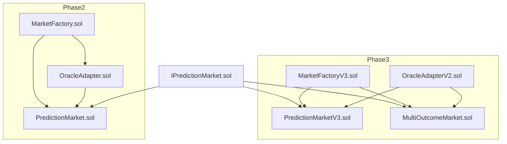
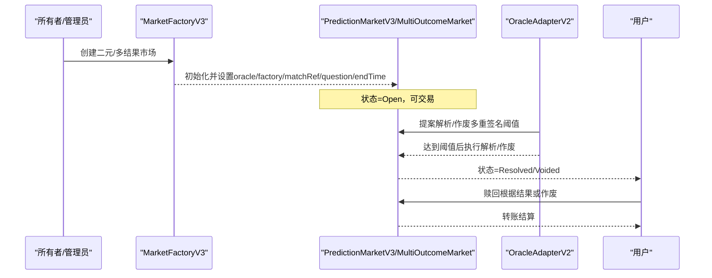
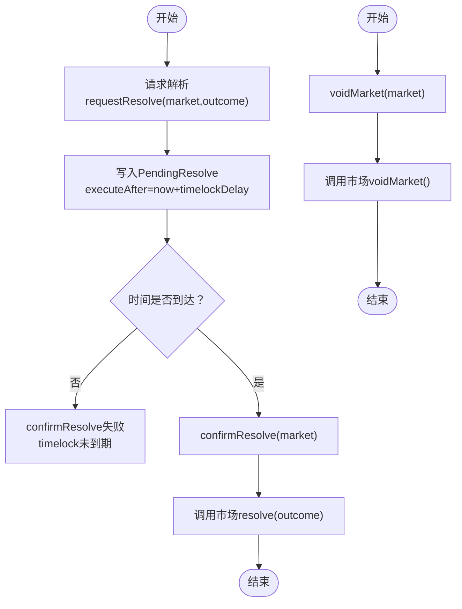
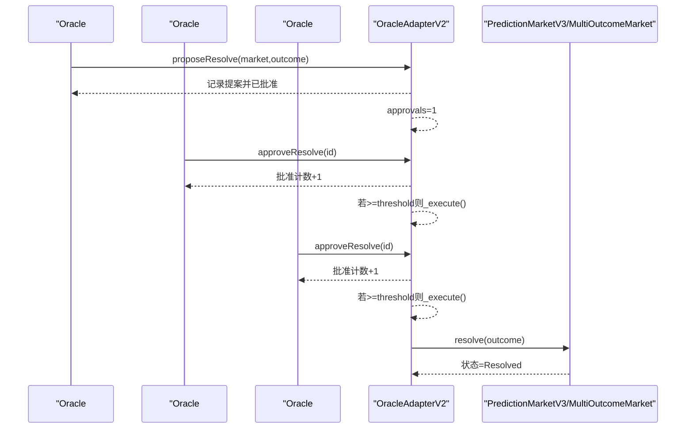
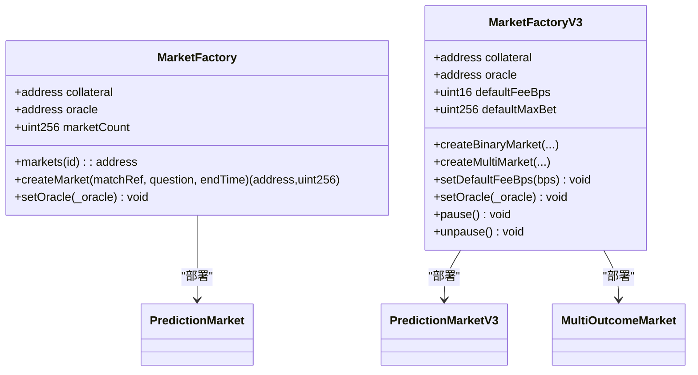
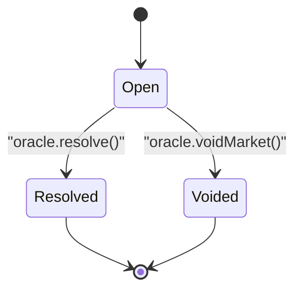
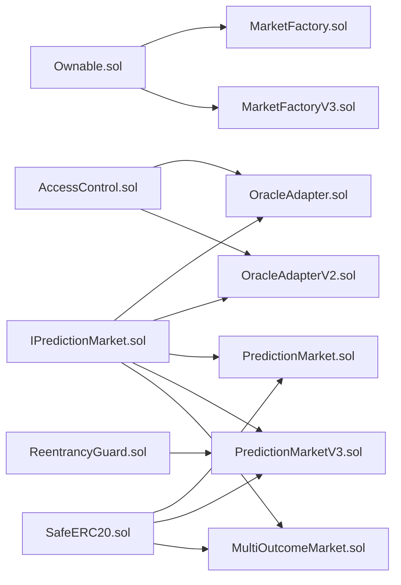

# 预言机生命周期管理

<cite>
**本文引用的文件**
- [PredictionMarket.sol](file://contracts/contracts/PredictionMarket.sol)
- [OracleAdapter.sol](file://contracts/contracts/OracleAdapter.sol)
- [MarketFactory.sol](file://contracts/contracts/MarketFactory.sol)
- [IPredictionMarket.sol](file://contracts/contracts/interfaces/IPredictionMarket.sol)
- [deploy.js](file://scripts/deploy.js)
- [resolve.js](file://scripts/resolve.js)
- [seed-markets.js](file://scripts/seed-markets.js)
- [OracleAdapter.test.js](file://test/OracleAdapter.test.js)
- [PredictionMarketV3.sol](file://contracts/contracts/PredictionMarketV3.sol)
- [MultiOutcomeMarket.sol](file://contracts/contracts/MultiOutcomeMarket.sol)
- [MarketFactoryV3.sol](file://contracts/contracts/MarketFactoryV3.sol)
- [OracleAdapterV2.sol](file://contracts/contracts/OracleAdapterV2.sol)
- [deploy-phase3.js](file://scripts/deploy-phase3.js)
- [hardhat.config.js](file://hardhat.config.js)
- [package.json](file://package.json)
</cite>

## 目录
1. [引言](#引言)
2. [项目结构](#项目结构)
3. [核心组件](#核心组件)
4. [架构总览](#架构总览)
5. [详细组件分析](#详细组件分析)
6. [依赖关系分析](#依赖关系分析)
7. [性能考量](#性能考量)
8. [故障排查指南](#故障排查指南)
9. [结论](#结论)
10. [附录](#附录)

## 引言
本文件面向预言机生命周期管理，覆盖从预言机部署、市场创建与交易、提案与授权、时间锁定与确认、到最终结算与争议处理的全流程。文档同时阐述多版本预言机适配器（单签与多重签名）的差异、状态转换与事件触发机制，并提供可复用的脚本使用指南与最佳实践建议。

## 项目结构
该仓库采用按合约类型分层组织的方式：核心市场合约、工厂合约、预言机适配器、接口定义、测试与脚本等模块清晰分离。Phase2（二元市场）与Phase3（CPMM二元+多结果市场）分别由不同工厂与市场实现支撑。

图表来源
- [MarketFactory.sol](file://contracts/contracts/MarketFactory.sol#L37-L54)
- [PredictionMarket.sol](file://contracts/contracts/PredictionMarket.sol#L44-L62)
- [OracleAdapter.sol](file://contracts/contracts/OracleAdapter.sol#L48-L81)
- [IPredictionMarket.sol](file://contracts/contracts/interfaces/IPredictionMarket.sol#L4-L8)
- [MarketFactoryV3.sol](file://contracts/contracts/MarketFactoryV3.sol#L46-L87)
- [PredictionMarketV3.sol](file://contracts/contracts/PredictionMarketV3.sol#L49-L73)
- [MultiOutcomeMarket.sol](file://contracts/contracts/MultiOutcomeMarket.sol#L39-L59)
- [OracleAdapterV2.sol](file://contracts/contracts/OracleAdapterV2.sol#L44-L81)

章节来源
- [hardhat.config.js](file://hardhat.config.js#L23-L28)
- [package.json](file://package.json#L5-L14)

## 核心组件
- 市场合约（二元/多结果）
  - PredictionMarket（二元，Parimutuel）
  - PredictionMarketV3（二元，CPMM，带手续费与流动性池）
  - MultiOutcomeMarket（多结果，Parimutuel）
- 工厂合约
  - MarketFactory（Phase2 二元市场）
  - MarketFactoryV3（Phase3 二元CPMM+多结果市场）
- 预言机适配器
  - OracleAdapter（单签+时间锁）
  - OracleAdapterV2（多重签名阈值）
- 接口
  - IPredictionMarket（统一解析/作废接口）

章节来源
- [PredictionMarket.sol](file://contracts/contracts/PredictionMarket.sol#L7-L25)
- [PredictionMarketV3.sol](file://contracts/contracts/PredictionMarketV3.sol#L8-L24)
- [MultiOutcomeMarket.sol](file://contracts/contracts/MultiOutcomeMarket.sol#L8-L23)
- [MarketFactory.sol](file://contracts/contracts/MarketFactory.sol#L8-L16)
- [MarketFactoryV3.sol](file://contracts/contracts/MarketFactoryV3.sol#L10-L20)
- [OracleAdapter.sol](file://contracts/contracts/OracleAdapter.sol#L7-L14)
- [OracleAdapterV2.sol](file://contracts/contracts/OracleAdapterV2.sol#L7-L23)
- [IPredictionMarket.sol](file://contracts/contracts/interfaces/IPredictionMarket.sol#L4-L8)

## 架构总览
预言机生命周期由“工厂创建市场 -> 市场开放交易 -> 预言机提案/授权 -> 时间锁定/多重签名确认 -> 解析/作废 -> 用户结算”构成。不同阶段通过访问控制与状态枚举保障安全与一致性。

图表来源
- [MarketFactoryV3.sol](file://contracts/contracts/MarketFactoryV3.sol#L46-L87)
- [OracleAdapterV2.sol](file://contracts/contracts/OracleAdapterV2.sol#L44-L81)
- [PredictionMarketV3.sol](file://contracts/contracts/PredictionMarketV3.sol#L137-L149)
- [MultiOutcomeMarket.sol](file://contracts/contracts/MultiOutcomeMarket.sol#L76-L87)

## 详细组件分析

### 组件A：OracleAdapter（单签+时间锁）
- 角色与权限
  - DEFAULT_ADMIN_ROLE：设置时间锁、工厂地址、授予ORACLE_ROLE
  - ORACLE_ROLE：请求解析、确认解析、立即解析（时间锁为0）、作废市场
- 时间锁定机制
  - requestResolve：记录待执行解析，设置executeAfter = now + timelockDelay
  - confirmResolve：仅在时间锁到期后执行resolve
  - resolveNow：当timelockDelay为0时，直接调用市场resolve
- 作废与事件
  - voidMarket：调用市场voidMarket并发出事件
  - 事件：OracleResolveRequested、OracleResolveConfirmed、MarketVoided

图表来源
- [OracleAdapter.sol](file://contracts/contracts/OracleAdapter.sol#L48-L81)

章节来源
- [OracleAdapter.sol](file://contracts/contracts/OracleAdapter.sol#L30-L82)

### 组件B：OracleAdapterV2（多重签名阈值）
- 角色与权限
  - DEFAULT_ADMIN_ROLE：设置阈值、授予ORACLE_ROLE
  - ORACLE_ROLE：提案、批准、执行解析、作废市场
- 多重签名流程
  - proposeResolve：创建提案并自动批准（自身），等待其他oracle批准
  - approveResolve：其他oracle批准同一提案
  - 达到阈值后自动执行resolve
- 作废与事件
  - voidMarket：调用市场voidMarket并发出事件
  - 事件：ProposalCreated、ProposalApproved、ProposalExecuted、MarketVoided

图表来源
- [OracleAdapterV2.sol](file://contracts/contracts/OracleAdapterV2.sol#L44-L81)

章节来源
- [OracleAdapterV2.sol](file://contracts/contracts/OracleAdapterV2.sol#L29-L82)

### 组件C：MarketFactory 与 MarketFactoryV3
- MarketFactory（Phase2）
  - Ownable：onlyOwner限制
  - createMarket：构造PredictionMarket，登记市场ID
  - setOracle：更新默认oracle
- MarketFactoryV3（Phase3）
  - Ownable + Pausable：onlyOwner限制，支持暂停/恢复
  - createBinaryMarket：支持初始流动性注入与种子资金
  - createMultiMarket：创建多结果市场
  - setDefaultFeeBps/setOracle：配置默认费用与oracle

图表来源
- [MarketFactory.sol](file://contracts/contracts/MarketFactory.sol#L37-L54)
- [MarketFactoryV3.sol](file://contracts/contracts/MarketFactoryV3.sol#L46-L87)

章节来源
- [MarketFactory.sol](file://contracts/contracts/MarketFactory.sol#L25-L54)
- [MarketFactoryV3.sol](file://contracts/contracts/MarketFactoryV3.sol#L24-L88)

### 组件D：市场合约（二元与多结果）
- PredictionMarket（二元Parimutuel）
  - 状态：Open/Resolved/Voided
  - buy：购买Yes/No份额，转账代币入池
  - resolve/voidMarket：仅oracle可调用
  - claim：根据结果或作废结算
- PredictionMarketV3（二元CPMM）
  - 增加手续费、流动性池、最大投注限制
  - seedReserves/addLiquidity/removeLiquidity：LP机制
  - _swap：计算交易份额
- MultiOutcomeMarket（多结果Parimutuel）
  - 支持2-8个结果
  - buy：向指定结果池注资
  - claim：按胜方池与个人下注比例结算

图表来源
- [PredictionMarket.sol](file://contracts/contracts/PredictionMarket.sol#L11-L25)
- [PredictionMarketV3.sol](file://contracts/contracts/PredictionMarketV3.sol#L12-L24)
- [MultiOutcomeMarket.sol](file://contracts/contracts/MultiOutcomeMarket.sol#L12-L23)

章节来源
- [PredictionMarket.sol](file://contracts/contracts/PredictionMarket.sol#L64-L132)
- [PredictionMarketV3.sol](file://contracts/contracts/PredictionMarketV3.sol#L92-L198)
- [MultiOutcomeMarket.sol](file://contracts/contracts/MultiOutcomeMarket.sol#L65-L111)

### 组件E：接口与脚本
- IPredictionMarket：统一resolve/voidMarket/status接口
- 部署脚本
  - deploy.js：部署MockUSDC、OracleAdapter、DIDRegistry、MarketFactory；设置工厂与oracle角色
  - deploy-phase3.js：部署OracleAdapterV2、MarketFactoryV3，设置阈值与默认费用
- 操作脚本
  - seed-markets.js：批量创建市场
  - resolve.js：本地解析市场（二元市场）
- 测试
  - OracleAdapter.test.js：验证时间锁解析流程与作废退款

章节来源
- [IPredictionMarket.sol](file://contracts/contracts/interfaces/IPredictionMarket.sol#L4-L8)
- [deploy.js](file://scripts/deploy.js#L5-L51)
- [deploy-phase3.js](file://scripts/deploy-phase3.js#L5-L37)
- [seed-markets.js](file://scripts/seed-markets.js#L5-L28)
- [resolve.js](file://scripts/resolve.js#L3-L14)
- [OracleAdapter.test.js](file://test/OracleAdapter.test.js#L5-L49)

## 依赖关系分析
- 权限模型
  - AccessControl：DEFAULT_ADMIN_ROLE与ORACLE_ROLE
  - Ownable：MarketFactory/MarketFactoryV3的onlyOwner
  - onlyOracle修饰符：限制市场解析/作废调用者
- 合约耦合
  - OracleAdapter/OracleAdapterV2依赖IPredictionMarket接口
  - MarketFactory/MarketFactoryV3创建具体市场实例
- 外部依赖
  - @openzeppelin/contracts：AccessControl、Ownable、Pausable、SafeERC20、ReentrancyGuard

图表来源
- [OracleAdapter.sol](file://contracts/contracts/OracleAdapter.sol#L4-L5)
- [OracleAdapterV2.sol](file://contracts/contracts/OracleAdapterV2.sol#L4-L5)
- [MarketFactory.sol](file://contracts/contracts/MarketFactory.sol#L4-L6)
- [MarketFactoryV3.sol](file://contracts/contracts/MarketFactoryV3.sol#L4-L8)
- [PredictionMarket.sol](file://contracts/contracts/PredictionMarket.sol#L4-L5)
- [PredictionMarketV3.sol](file://contracts/contracts/PredictionMarketV3.sol#L4-L6)
- [MultiOutcomeMarket.sol](file://contracts/contracts/MultiOutcomeMarket.sol#L4-L6)
- [IPredictionMarket.sol](file://contracts/contracts/interfaces/IPredictionMarket.sol#L4-L8)

## 性能考量
- 优化器与EVM版本
  - 启用optimizer.runs=200，EVM=Cancun，平衡gas与可读性
- 交易路径
  - Phase3 CPMM通过_swap与池子余额计算，避免复杂循环
  - 多结果市场pool数组按需扩展，注意存储开销
- 重入保护
  - ReentrancyGuard用于buy/addLiquidity/removeLiquidity等关键函数

章节来源
- [hardhat.config.js](file://hardhat.config.js#L7-L13)
- [PredictionMarketV3.sol](file://contracts/contracts/PredictionMarketV3.sol#L92-L135)
- [MultiOutcomeMarket.sol](file://contracts/contracts/MultiOutcomeMarket.sol#L65-L87)

## 故障排查指南
- 常见错误与定位
  - “not open”：仅Open状态下允许解析/作废
  - “timelock”：时间锁未到期不可confirmResolve
  - “invalid outcome”：结果超出范围（二元0/1或多结果索引）
  - “not claimable”：非Resolved/Voided状态不可赎回
  - “no pending”：无待确认解析
- 单元测试参考
  - 时间锁解析流程与作废退款逻辑验证
- 调试建议
  - 使用hardhat node与本地脚本快速复现问题
  - 检查状态枚举与事件日志，确认流程节点

章节来源
- [OracleAdapter.test.js](file://test/OracleAdapter.test.js#L6-L48)
- [OracleAdapter.sol](file://contracts/contracts/OracleAdapter.sol#L60-L66)
- [PredictionMarket.sol](file://contracts/contracts/PredictionMarket.sol#L97-L113)
- [PredictionMarketV3.sol](file://contracts/contracts/PredictionMarketV3.sol#L151-L165)

## 结论
该系统以清晰的角色与状态模型实现了预言机生命周期闭环：从工厂创建、市场交易、到预言机提案与授权、时间锁/多重签名确认、最终解析或作废、再到用户结算。Phase3引入CPMM与多结果市场，提升资金效率与灵活性。通过AccessControl与onlyOracle等机制确保权限边界，配合测试与脚本工具，便于运维与升级。

## 附录

### A. 预言机角色创建、授权与权限管理
- Phase2
  - 部署后由管理员授予ORACLE_ROLE给实际oracle账户
  - 可动态设置工厂地址与时间锁
- Phase3
  - 部署后授予ORACLE_ROLE给多个oracle，设置阈值
  - 通过多重签名达成阈值后自动执行

章节来源
- [deploy.js](file://scripts/deploy.js#L30-L31)
- [OracleAdapter.sol](file://contracts/contracts/OracleAdapter.sol#L30-L46)
- [deploy-phase3.js](file://scripts/deploy-phase3.js#L14-L22)
- [OracleAdapterV2.sol](file://contracts/contracts/OracleAdapterV2.sol#L29-L42)

### B. 市场提案阶段操作流程与要求
- Phase2
  - requestResolve：记录待执行解析，设置executeAfter
  - confirmResolve：时间锁到期后执行
- Phase3
  - proposeResolve：创建提案并自动批准
  - approveResolve：其他oracle批准
  - 达到阈值后_execute

章节来源
- [OracleAdapter.sol](file://contracts/contracts/OracleAdapter.sol#L48-L67)
- [OracleAdapterV2.sol](file://contracts/contracts/OracleAdapterV2.sol#L44-L75)

### C. 解决阶段的时间锁定与确认机制
- 时间锁
  - requestResolve设置executeAfter=now+timelockDelay
  - confirmResolve仅在时间到达后生效
- 快速路径
  - timelockDelay=0时使用resolveNow

章节来源
- [OracleAdapter.sol](file://contracts/contracts/OracleAdapter.sol#L51-L74)

### D. 市场作废与争议处理
- 作废条件
  - 仅Open状态下可voidMarket
- 作废结算
  - 用户可按已下注总额赎回
- 测试验证
  - 作废后用户claim应全额退款

章节来源
- [OracleAdapter.test.js](file://test/OracleAdapter.test.js#L27-L48)
- [PredictionMarket.sol](file://contracts/contracts/PredictionMarket.sol#L91-L105)
- [PredictionMarketV3.sol](file://contracts/contracts/PredictionMarketV3.sol#L145-L158)
- [MultiOutcomeMarket.sol](file://contracts/contracts/MultiOutcomeMarket.sol#L83-L111)

### E. 预言机状态转换与事件触发
- 状态转换
  - Open -> Resolved 或 Voided
- 事件
  - Resolved、MarketVoided、Claimed等

章节来源
- [PredictionMarket.sol](file://contracts/contracts/PredictionMarket.sol#L34-L37)
- [PredictionMarketV3.sol](file://contracts/contracts/PredictionMarketV3.sol#L37-L42)
- [MultiOutcomeMarket.sol](file://contracts/contracts/MultiOutcomeMarket.sol#L29-L32)

### F. 预言机操作示例与脚本使用指南
- 部署Phase2
  - 设置ORACLE_TIMELOCK_SECONDS（秒）
  - 运行本地部署脚本，生成部署清单
- 部署Phase3
  - 设置ORACLE_MULTISIG_THRESHOLD与DEFAULT_FEE_BPS
  - 运行phase3部署脚本
- 种子市场
  - 运行seed-markets脚本批量创建
- 解析市场
  - 设置MARKET_ADDRESS与WINNING_OUTCOME运行resolve脚本

章节来源
- [package.json](file://package.json#L9-L13)
- [deploy.js](file://scripts/deploy.js#L7-L31)
- [deploy-phase3.js](file://scripts/deploy-phase3.js#L7-L22)
- [seed-markets.js](file://scripts/seed-markets.js#L13-L26)
- [resolve.js](file://scripts/resolve.js#L4-L13)

### G. 预言机维护与监控最佳实践
- 安全
  - 严格管理DEFAULT_ADMIN_ROLE与ORACLE_ROLE
  - 审核时间锁与阈值设置
- 可观测性
  - 订阅Resolved/MarketVoided/Claimed事件
  - 监控Open状态下的交易量与池子规模
- 运维
  - 使用pause/unpause控制暂停/恢复
  - 定期检查maxBetPerUser与feeBps

章节来源
- [MarketFactoryV3.sol](file://contracts/contracts/MarketFactoryV3.sol#L31-L32)
- [PredictionMarketV3.sol](file://contracts/contracts/PredictionMarketV3.sol#L19-L21)

### H. 升级与迁移策略及兼容性考虑
- 兼容性
  - OracleAdapterV2通过IPredictionMarket接口与市场解耦
  - MarketFactoryV3同时支持二元CPMM与多结果市场
- 升级路径
  - 从Phase2迁移到Phase3：保留oracle角色，切换工厂与适配器
  - 从单签迁移到多重签名：保持接口一致，调整授权策略
- 注意事项
  - 迁移前确保已有市场处于Open状态且无未完成提案
  - 对历史市场的作废与结算流程进行审计

章节来源
- [IPredictionMarket.sol](file://contracts/contracts/interfaces/IPredictionMarket.sol#L4-L8)
- [OracleAdapterV2.sol](file://contracts/contracts/OracleAdapterV2.sol#L44-L81)
- [MarketFactoryV3.sol](file://contracts/contracts/MarketFactoryV3.sol#L46-L87)