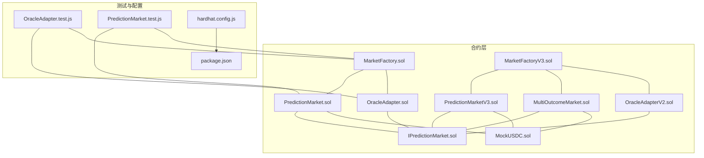
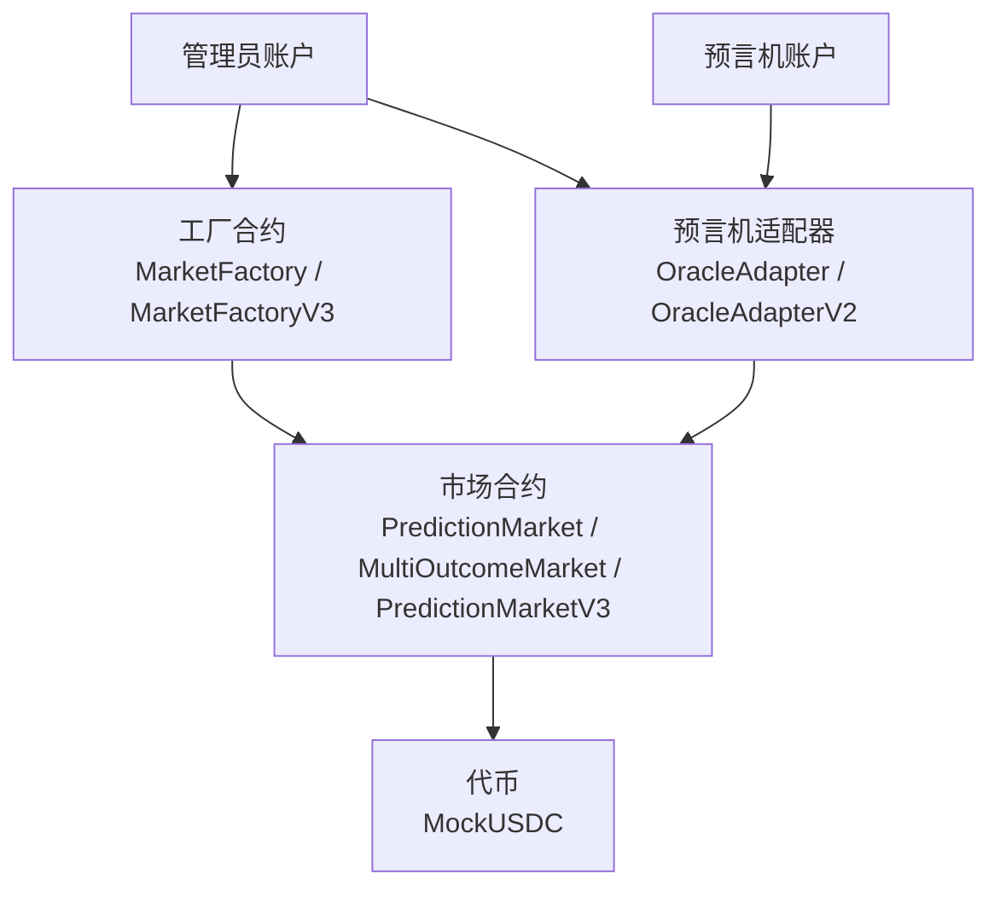
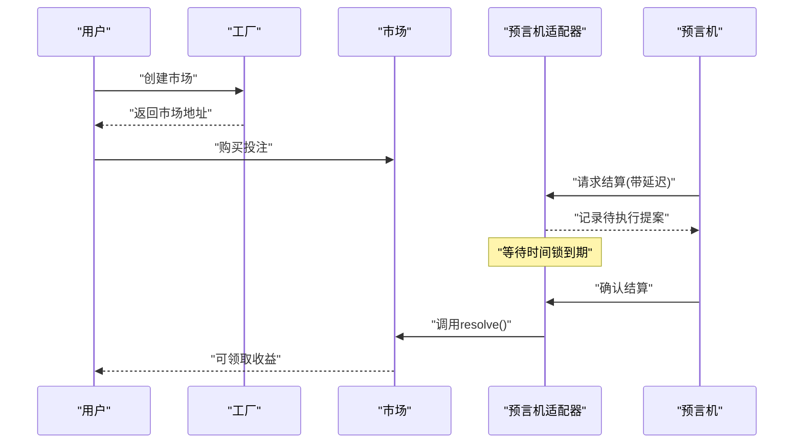
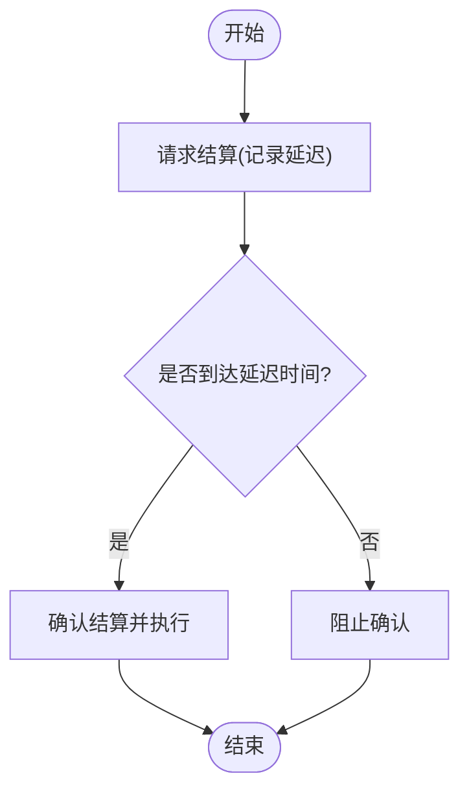
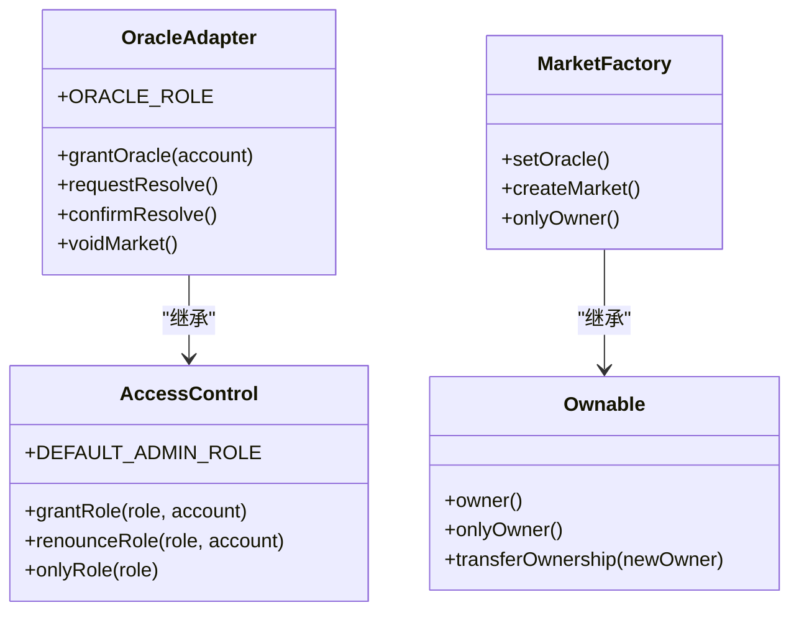
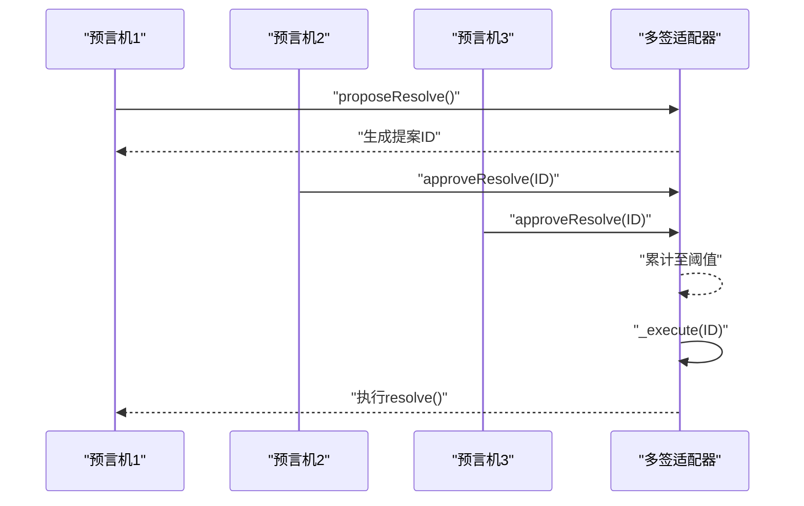
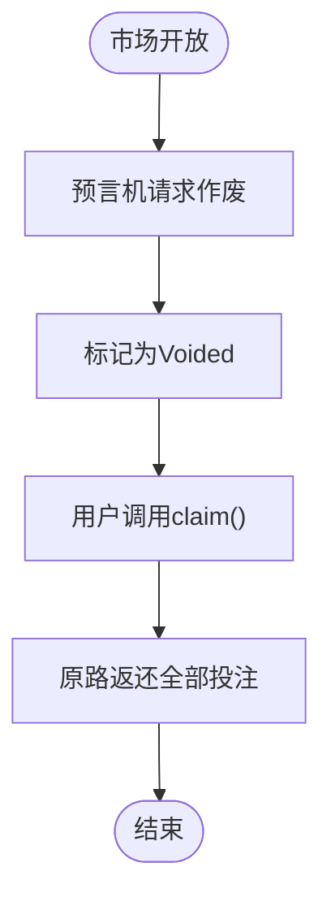
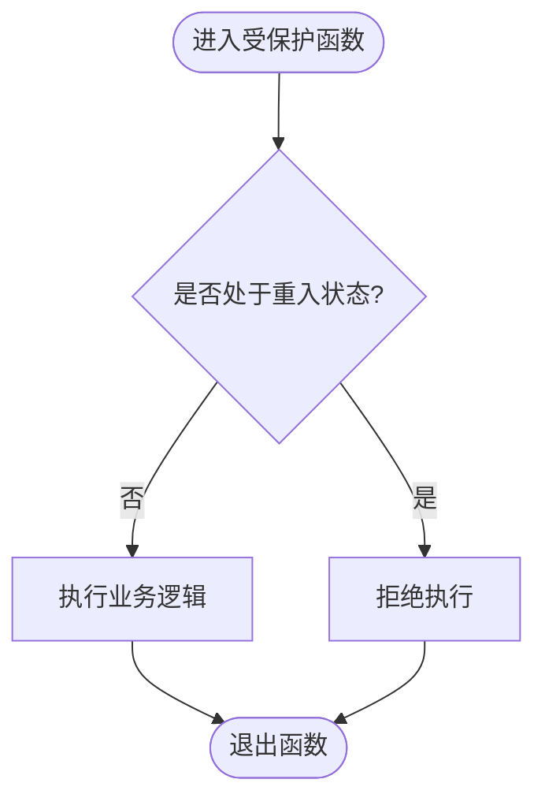
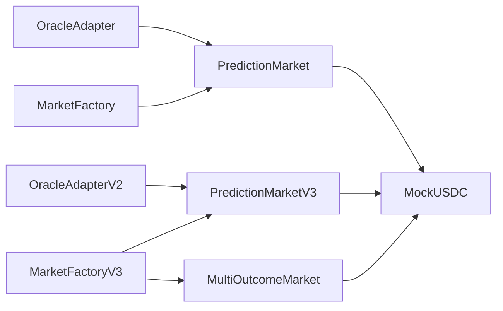

# 风险控制措施

<cite>
**本文引用的文件**
- [PredictionMarket.sol](file://contracts/contracts/PredictionMarket.sol)
- [OracleAdapter.sol](file://contracts/contracts/OracleAdapter.sol)
- [MarketFactory.sol](file://contracts/contracts/MarketFactory.sol)
- [MultiOutcomeMarket.sol](file://contracts/contracts/MultiOutcomeMarket.sol)
- [OracleAdapterV2.sol](file://contracts/contracts/OracleAdapterV2.sol)
- [MarketFactoryV3.sol](file://contracts/contracts/MarketFactoryV3.sol)
- [PredictionMarketV3.sol](file://contracts/contracts/PredictionMarketV3.sol)
- [IPredictionMarket.sol](file://contracts/contracts/interfaces/IPredictionMarket.sol)
- [MockUSDC.sol](file://contracts/contracts/MockUSDC.sol)
- [hardhat.config.js](file://contracts/hardhat.config.js)
- [OracleAdapter.test.js](file://contracts/test/OracleAdapter.test.js)
- [PredictionMarket.test.js](file://contracts/test/PredictionMarket.test.js)
- [package.json](file://contracts/package.json)
</cite>

## 目录
1. [引言](#引言)
2. [项目结构](#项目结构)
3. [核心组件](#核心组件)
4. [架构总览](#架构总览)
5. [详细组件分析](#详细组件分析)
6. [依赖关系分析](#依赖关系分析)
7. [性能考量](#性能考量)
8. [故障排查指南](#故障排查指南)
9. [结论](#结论)
10. [附录](#附录)

## 引言
本文件面向预测市场系统的技术与非技术读者，系统性梳理并解释代码库中已实现的风险控制与安全机制，包括预言机机制的安全防护、时间锁定对防作弊攻击的作用、访问控制与权限管理策略、多签名共识对恶意行为的制约、市场作废与争议处理流程、重入攻击防护及其他安全考虑，并给出风险评估与安全审计的指导原则、常见威胁识别与应对策略、安全配置最佳实践与监控要点。

## 项目结构
该仓库采用按功能模块划分的组织方式：核心合约位于 contracts/contracts 下，接口定义在 interfaces 子目录，工厂合约负责部署与生命周期管理，测试用例位于 test 目录，构建与网络配置在根目录下。OpenZeppelin 合约库通过 npm 管理，Solidity 版本固定为 0.8.24，启用编译器优化与特定 EVM 版本。

图表来源
- [PredictionMarket.sol](file://contracts/contracts/PredictionMarket.sol#L1-L134)
- [PredictionMarketV3.sol](file://contracts/contracts/PredictionMarketV3.sol#L1-L200)
- [MultiOutcomeMarket.sol](file://contracts/contracts/MultiOutcomeMarket.sol#L1-L113)
- [OracleAdapter.sol](file://contracts/contracts/OracleAdapter.sol#L1-L83)
- [OracleAdapterV2.sol](file://contracts/contracts/OracleAdapterV2.sol#L1-L83)
- [MarketFactory.sol](file://contracts/contracts/MarketFactory.sol#L1-L60)
- [MarketFactoryV3.sol](file://contracts/contracts/MarketFactoryV3.sol#L1-L94)
- [IPredictionMarket.sol](file://contracts/contracts/interfaces/IPredictionMarket.sol#L1-L9)
- [MockUSDC.sol](file://contracts/contracts/MockUSDC.sol#L1-L18)
- [OracleAdapter.test.js](file://contracts/test/OracleAdapter.test.js#L1-L50)
- [PredictionMarket.test.js](file://contracts/test/PredictionMarket.test.js#L1-L70)
- [hardhat.config.js](file://contracts/hardhat.config.js#L1-L30)
- [package.json](file://contracts/package.json#L1-L22)

章节来源
- [hardhat.config.js](file://contracts/hardhat.config.js#L1-L30)
- [package.json](file://contracts/package.json#L1-L22)

## 核心组件
- 预测市场合约（二元与多结果）
  - PredictionMarket：二元 Yes/No 市场，支持购买、结算、作废与领取。
  - MultiOutcomeMarket：N 结果（2-8）parimutuel 市场，内置费用与重入保护。
  - PredictionMarketV3：二元 CPMM 市场，支持流动性提供、交易费用、用户最大投注限制与重入保护。
- 预言机适配器
  - OracleAdapter：基于时间锁的“请求-确认”结算与作废流程。
  - OracleAdapterV2：m-of-n 多签名提案与审批流程。
- 工厂合约
  - MarketFactory：二元市场部署与所有者权限控制。
  - MarketFactoryV3：暂停机制、二元 CPMM 与多结果市场统一部署入口。
- 接口与测试
  - IPredictionMarket：市场状态查询与结算/作废调用接口。
  - 测试用例覆盖时间锁、作废退款、重入保护等关键路径。

章节来源
- [PredictionMarket.sol](file://contracts/contracts/PredictionMarket.sol#L1-L134)
- [MultiOutcomeMarket.sol](file://contracts/contracts/MultiOutcomeMarket.sol#L1-L113)
- [PredictionMarketV3.sol](file://contracts/contracts/PredictionMarketV3.sol#L1-L200)
- [OracleAdapter.sol](file://contracts/contracts/OracleAdapter.sol#L1-L83)
- [OracleAdapterV2.sol](file://contracts/contracts/OracleAdapterV2.sol#L1-L83)
- [MarketFactory.sol](file://contracts/contracts/MarketFactory.sol#L1-L60)
- [MarketFactoryV3.sol](file://contracts/contracts/MarketFactoryV3.sol#L1-L94)
- [IPredictionMarket.sol](file://contracts/contracts/interfaces/IPredictionMarket.sol#L1-L9)

## 架构总览
系统采用“工厂-市场-预言机适配器”的分层架构。工厂负责创建市场并注入 oracle 地址；市场合约记录状态与资金，仅允许 oracle 在满足条件时进行结算或作废；预言机适配器作为权限与流程控制中心，通过角色授权与时间锁/多签机制约束 oracle 的操作。

图表来源
- [MarketFactory.sol](file://contracts/contracts/MarketFactory.sol#L1-L60)
- [MarketFactoryV3.sol](file://contracts/contracts/MarketFactoryV3.sol#L1-L94)
- [OracleAdapter.sol](file://contracts/contracts/OracleAdapter.sol#L1-L83)
- [OracleAdapterV2.sol](file://contracts/contracts/OracleAdapterV2.sol#L1-L83)
- [PredictionMarket.sol](file://contracts/contracts/PredictionMarket.sol#L1-L134)
- [MultiOutcomeMarket.sol](file://contracts/contracts/MultiOutcomeMarket.sol#L1-L113)
- [PredictionMarketV3.sol](file://contracts/contracts/PredictionMarketV3.sol#L1-L200)
- [MockUSDC.sol](file://contracts/contracts/MockUSDC.sol#L1-L18)

## 详细组件分析

### 预言机机制与安全防护
- 角色与权限
  - AccessControl/Ownable 提供默认管理员与所有者权限，仅授予的“预言机角色”可执行结算与作废。
  - OracleAdapter 与 OracleAdapterV2 使用角色常量与 onlyRole 修饰符，确保非授权方无法调用。
- 时间锁定（OracleAdapter）
  - 请求阶段设置执行延迟，确认阶段强制等待到期后方可执行，有效阻断即时攻击与抢先交易。
  - 当延迟为 0 时提供“立即执行”路径，便于紧急场景但需谨慎配置。
- 多签名共识（OracleAdapterV2）
  - 提案-审批-执行三段式，阈值决定生效所需的最小批准数，降低单点失效与恶意操控风险。
  - 审批幂等与已执行状态检查避免重复执行与竞态。
- 争议处理
  - 作废流程由预言机触发，市场进入 Voided 状态，用户可按原路取回全部投注。

图表来源
- [OracleAdapter.sol](file://contracts/contracts/OracleAdapter.sol#L48-L67)
- [PredictionMarket.sol](file://contracts/contracts/PredictionMarket.sol#L83-L89)
- [MarketFactory.sol](file://contracts/contracts/MarketFactory.sol#L37-L54)

章节来源
- [OracleAdapter.sol](file://contracts/contracts/OracleAdapter.sol#L1-L83)
- [OracleAdapterV2.sol](file://contracts/contracts/OracleAdapterV2.sol#L1-L83)
- [PredictionMarket.sol](file://contracts/contracts/PredictionMarket.sol#L39-L42)
- [OracleAdapter.test.js](file://contracts/test/OracleAdapter.test.js#L6-L25)

### 时间锁定对防作弊攻击的防护
- 抗抢先交易：请求与确认分离，确认前对手无法观测到最终状态变更。
- 抗高频刷单：较长的时间窗口使自动化脚本难以在确认前完成二次操作。
- 抗短期价格操纵：延迟期内市场状态不可见，避免利用信息差进行套利。
- 可配置性：时间锁时长由管理员设置，平衡安全与效率。

图表来源
- [OracleAdapter.sol](file://contracts/contracts/OracleAdapter.sol#L48-L67)

章节来源
- [OracleAdapter.sol](file://contracts/contracts/OracleAdapter.sol#L36-L38)
- [OracleAdapter.test.js](file://contracts/test/OracleAdapter.test.js#L20-L23)

### 访问控制机制与权限管理策略
- 默认管理员与角色授予
  - 通过构造函数授予管理员与预言机角色，后续使用 onlyRole 限制调用。
- 所有权与升级路径
  - MarketFactory 使用 Ownable 限制工厂级操作（如设置 oracle），便于集中治理。
- 最小权限原则
  - 仅预言机角色可结算/作废；仅工厂所有者可部署/暂停；普通用户仅能参与市场活动。

图表来源
- [OracleAdapter.sol](file://contracts/contracts/OracleAdapter.sol#L30-L46)
- [MarketFactory.sol](file://contracts/contracts/MarketFactory.sol#L32-L35)

章节来源
- [OracleAdapter.sol](file://contracts/contracts/OracleAdapter.sol#L30-L46)
- [MarketFactory.sol](file://contracts/contracts/MarketFactory.sol#L32-L35)

### 多签名共识对恶意行为的制约
- 提案与审批
  - 单个预言机可发起提案，其他预言机逐个批准，达到阈值后自动执行。
- 幂等与防重放
  - 已批准与已执行状态检查，防止重复审批与重复执行。
- 分散化治理
  - 阈值参数由管理员设置，兼顾安全性与响应速度。

图表来源
- [OracleAdapterV2.sol](file://contracts/contracts/OracleAdapterV2.sol#L44-L75)

章节来源
- [OracleAdapterV2.sol](file://contracts/contracts/OracleAdapterV2.sol#L1-L83)

### 市场作废机制与争议处理流程
- 作废触发
  - 仅在市场开放状态下由预言机触发 voidMarket，将状态置为 Voided。
- 资金返还
  - 用户可在 Voided 状态下按原路取回全部投注，保障公平性。
- 测试验证
  - 测试覆盖了作废后退款与用户领取逻辑。

图表来源
- [PredictionMarket.sol](file://contracts/contracts/PredictionMarket.sol#L91-L113)
- [OracleAdapter.test.js](file://contracts/test/OracleAdapter.test.js#L27-L48)

章节来源
- [PredictionMarket.sol](file://contracts/contracts/PredictionMarket.sol#L91-L113)
- [OracleAdapter.test.js](file://contracts/test/OracleAdapter.test.js#L27-L48)

### 重入攻击防护与其他安全考虑
- 重入保护
  - MultiOutcomeMarket 与 PredictionMarketV3 继承 ReentrancyGuard，在关键函数上使用 nonReentrant 修饰符，有效防止外部合约在状态更新前再次调用。
- 费用与上限
  - MultiOutcomeMarket 与 PredictionMarketV3 支持交易费用与用户最大投注限制，降低极端波动与刷单风险。
- 安全转账
  - 使用 SafeERC20 进行代币转账，降低失败回滚与重入风险。
- 暂停机制
  - MarketFactoryV3 集成 Pausable，所有者可在紧急情况下暂停部署与交易，为审计与修复争取时间。

图表来源
- [MultiOutcomeMarket.sol](file://contracts/contracts/MultiOutcomeMarket.sol#L9)
- [PredictionMarketV3.sol](file://contracts/contracts/PredictionMarketV3.sol#L9)
- [MarketFactoryV3.sol](file://contracts/contracts/MarketFactoryV3.sol#L6)

章节来源
- [MultiOutcomeMarket.sol](file://contracts/contracts/MultiOutcomeMarket.sol#L6)
- [PredictionMarketV3.sol](file://contracts/contracts/PredictionMarketV3.sol#L9)
- [MarketFactoryV3.sol](file://contracts/contracts/MarketFactoryV3.sol#L31-L32)

## 依赖关系分析
- 合约间耦合
  - 市场合约依赖预言机适配器进行结算/作废；工厂负责部署与注入 oracle；测试用例直接驱动工厂与适配器。
- 外部依赖
  - OpenZeppelin AccessControl、Ownable、Pausable、ReentrancyGuard、SafeERC20 等提供通用安全基元。
- 配置与工具链
  - Hardhat 配置启用编译器优化与特定 EVM 版本；测试使用 Hardhat Network Helpers 控制时间。

图表来源
- [OracleAdapter.sol](file://contracts/contracts/OracleAdapter.sol#L1-L83)
- [OracleAdapterV2.sol](file://contracts/contracts/OracleAdapterV2.sol#L1-L83)
- [MarketFactory.sol](file://contracts/contracts/MarketFactory.sol#L1-L60)
- [MarketFactoryV3.sol](file://contracts/contracts/MarketFactoryV3.sol#L1-L94)
- [PredictionMarket.sol](file://contracts/contracts/PredictionMarket.sol#L1-L134)
- [PredictionMarketV3.sol](file://contracts/contracts/PredictionMarketV3.sol#L1-L200)
- [MultiOutcomeMarket.sol](file://contracts/contracts/MultiOutcomeMarket.sol#L1-L113)
- [MockUSDC.sol](file://contracts/contracts/MockUSDC.sol#L1-L18)

章节来源
- [hardhat.config.js](file://contracts/hardhat.config.js#L7-L13)
- [package.json](file://contracts/package.json#L15-L20)

## 性能考量
- 编译器优化
  - 启用 optimizer 并设置合理 runs 数，平衡 gas 成本与部署成本。
- EVM 版本
  - 指定 Cancun 版本以获得更优的指令集与安全性。
- 函数设计
  - 使用 nonReentrant 与 require 校验前置条件，减少无效分支与回滚开销。
- 事件日志
  - 合理使用事件记录关键状态变化，便于链上监控与审计。

章节来源
- [hardhat.config.js](file://contracts/hardhat.config.js#L7-L13)

## 故障排查指南
- 预言机时间锁未到期
  - 现象：confirmResolve 报错“timelock”。
  - 处理：等待延迟期结束后再次确认。
- 非预言机调用
  - 现象：resolve/voidMarket 报错“not oracle”。
  - 处理：确认调用方是否被授予 ORACLE_ROLE。
- 重复领取
  - 现象：claim 报错“already claimed”或“nothing to claim”。
  - 处理：检查市场状态与用户是否已领取。
- 市场已关闭
  - 现象：buy/claim 报错“closed/ended/not claimable”。
  - 处理：确认市场状态与结束时间。

章节来源
- [OracleAdapter.test.js](file://contracts/test/OracleAdapter.test.js#L20-L23)
- [PredictionMarket.test.js](file://contracts/test/PredictionMarket.test.js#L52-L64)
- [PredictionMarket.sol](file://contracts/contracts/PredictionMarket.sol#L64-L81)
- [MultiOutcomeMarket.sol](file://contracts/contracts/MultiOutcomeMarket.sol#L89-L111)
- [PredictionMarketV3.sol](file://contracts/contracts/PredictionMarketV3.sol#L151-L165)

## 结论
该系统通过“角色授权 + 时间锁/多签 + 重入保护 + 暂停机制 + 费用与限额”等组合拳，形成了从权限、流程到执行层面的多层次安全防护。时间锁定显著降低了抢先交易与短期操纵风险；多签名共识提升了治理分散度与抗攻击能力；重入保护与 SafeERC20 确保了资金安全；工厂的暂停能力提供了应急处置通道。建议在生产环境严格配置阈值与时延，定期审计角色分配与参数设置，并结合链上监控与日志进行持续安全运营。

## 附录

### 风险评估与安全审计指导原则
- 权限最小化：仅授予必要角色，定期复核。
- 参数审查：时间锁、阈值、费用率、最大投注等参数应有明确依据与审批流程。
- 合约升级：若引入代理模式，需配套透明的升级治理与审计流程。
- 第三方集成：对外部预言机与数据源进行白名单与 SLA 约束。

### 常见安全威胁与应对策略
- 预言机单点攻击：通过多签与角色分离降低风险。
- 重入攻击：使用 ReentrancyGuard 与 SafeERC20。
- 抢先交易：时间锁与链上事件披露。
- 操作失误：暂停机制与权限回收。

### 安全配置最佳实践与监控要点
- 配置
  - 合理设置时间锁与阈值，避免过短导致安全失效。
  - 交易费用与用户上限应与市场类型匹配。
- 监控
  - 关注 resolve/voidMarket 事件与市场状态变化。
  - 监控异常交易量与大额资金流动。
  - 对管理员与预言机账户活动建立告警。