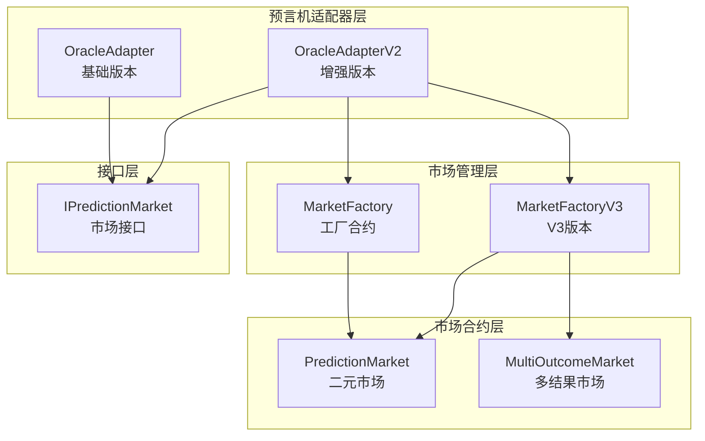
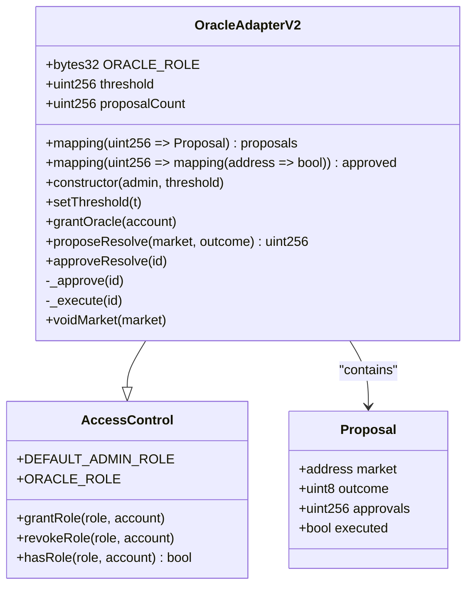
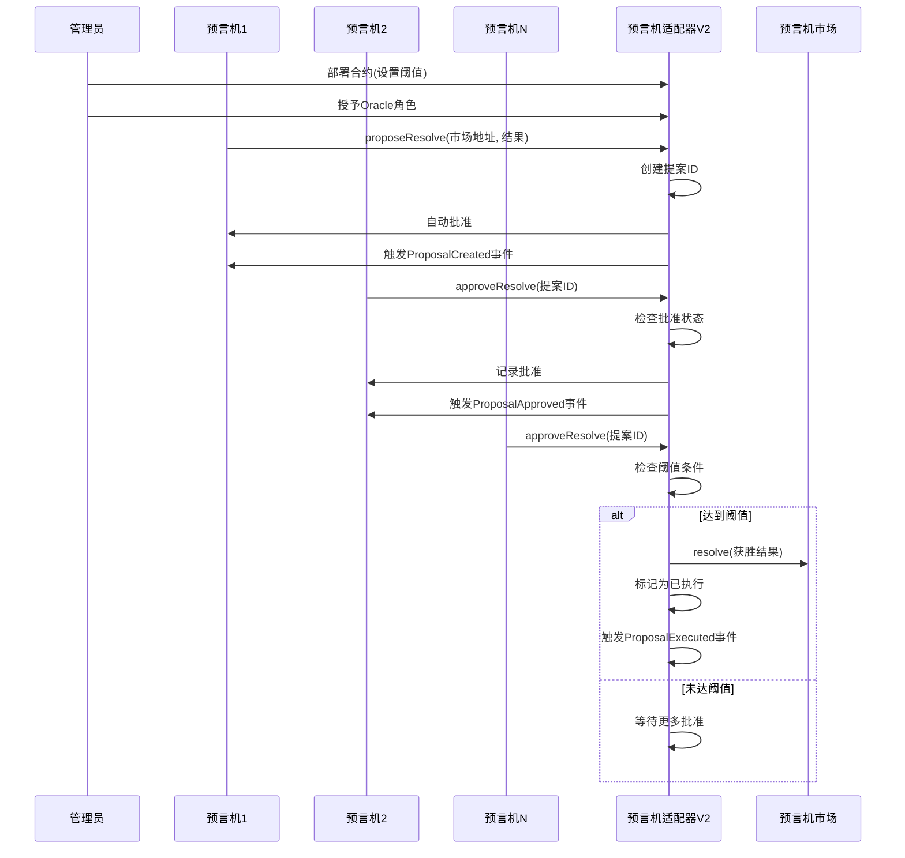
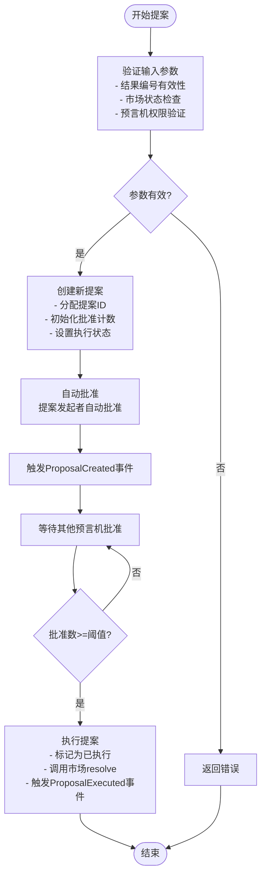
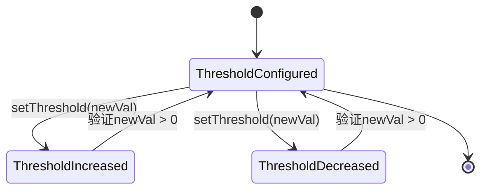
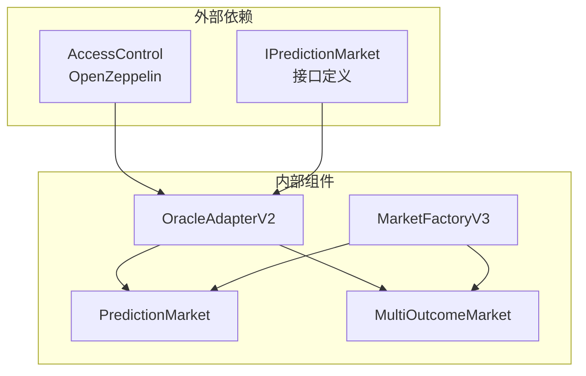

# OracleAdapterV2增强功能

<cite>
**本文档引用的文件**
- [OracleAdapter.sol](file://contracts/OracleAdapter.sol)
- [OracleAdapterV2.sol](file://contracts/OracleAdapterV2.sol)
- [IPredictionMarket.sol](file://contracts/interfaces/IPredictionMarket.sol)
- [PredictionMarket.sol](file://contracts/PredictionMarket.sol)
- [MultiOutcomeMarket.sol](file://contracts/MultiOutcomeMarket.sol)
- [MarketFactoryV3.sol](file://contracts/MarketFactoryV3.sol)
- [OracleAdapter.test.js](file://test/OracleAdapter.test.js)
- [Phase3.test.js](file://test/Phase3.test.js)
- [deploy-phase3.js](file://scripts/deploy-phase3.js)
</cite>

## 目录
1. [简介](#简介)
2. [项目结构](#项目结构)
3. [核心组件](#核心组件)
4. [架构概览](#架构概览)
5. [详细组件分析](#详细组件分析)
6. [依赖关系分析](#依赖关系分析)
7. [性能考量](#性能考量)
8. [故障排除指南](#故障排除指南)
9. [结论](#结论)
10. [迁移指南](#迁移指南)

## 简介

OracleAdapterV2是PredictionDIDSimple项目中的一个关键组件，它作为预言机适配器，负责处理预测市场的结算和作废操作。相比基础版本OracleAdapter，V2引入了重要的多签验证机制，显著增强了系统的安全性和灵活性。

OracleAdapterV2的核心创新在于实现了m-of-n多签验证系统，其中：
- **多签验证机制**：需要多个预言机共同批准才能执行市场结算
- **增强的安全性**：通过分散化决策降低单点故障风险
- **灵活的配置选项**：支持动态调整多签阈值和预言机权限
- **扩展的市场支持**：兼容多结果市场和二元市场

## 项目结构

PredictionDIDSimple项目采用模块化架构设计，主要包含以下核心模块：



**图表来源**
- [OracleAdapter.sol:1-96](file://contracts/OracleAdapter.sol#L1-L96)
- [OracleAdapterV2.sol:1-95](file://contracts/OracleAdapterV2.sol#L1-L95)
- [MarketFactoryV3.sol:1-104](file://contracts/MarketFactoryV3.sol#L1-L104)

**章节来源**
- [OracleAdapter.sol:1-96](file://contracts/OracleAdapter.sol#L1-L96)
- [OracleAdapterV2.sol:1-95](file://contracts/OracleAdapterV2.sol#L1-L95)
- [MarketFactoryV3.sol:1-104](file://contracts/MarketFactoryV3.sol#L1-L104)

## 核心组件

### OracleAdapterV2架构设计

OracleAdapterV2继承自AccessControl合约，实现了基于角色的访问控制和多签验证机制：



**图表来源**
- [OracleAdapterV2.sol:11-95](file://contracts/OracleAdapterV2.sol#L11-L95)

### 关键数据结构

OracleAdapterV2引入了提案系统来管理多签验证过程：

| 数据结构 | 字段 | 类型 | 描述 |
|---------|------|------|------|
| Proposal | market | address | 目标市场合约地址 |
| Proposal | outcome | uint8 | 提议的获胜结果编号 |
| Proposal | approvals | uint256 | 已获得的批准数量 |
| Proposal | executed | bool | 是否已执行 |
| Mapping | proposals | uint256 => Proposal | 提案ID到提案的映射 |
| Mapping | approved | uint256 => mapping(address => bool) | 提案批准状态映射 |

**章节来源**
- [OracleAdapterV2.sol:17-26](file://contracts/OracleAdapterV2.sol#L17-L26)
- [OracleAdapterV2.sol:25-26](file://contracts/OracleAdapterV2.sol#L25-L26)

## 架构概览

OracleAdapterV2的架构设计体现了分层安全原则，通过多签机制确保决策的可靠性和安全性：



**图表来源**
- [OracleAdapterV2.sol:51-86](file://contracts/OracleAdapterV2.sol#L51-L86)

## 详细组件分析

### 多签验证机制

OracleAdapterV2的核心创新是实现了m-of-n多签验证系统，该系统具有以下特点：

#### 提案生命周期管理



**图表来源**
- [OracleAdapterV2.sol:51-86](file://contracts/OracleAdapterV2.sol#L51-L86)

#### 权限控制系统

OracleAdapterV2采用基于角色的访问控制模型：

| 角色 | 权限 | 方法 |
|------|------|------|
| DEFAULT_ADMIN_ROLE | 管理员权限 | setThreshold(), grantOracle(), setFactory() |
| ORACLE_ROLE | 预言机权限 | proposeResolve(), approveResolve(), voidMarket() |
| 任何地址 | 只读访问 | 查看提案状态、阈值等 |

**章节来源**
- [OracleAdapterV2.sol:33-49](file://contracts/OracleAdapterV2.sol#L33-L49)
- [OracleAdapterV2.sol:51-86](file://contracts/OracleAdapterV2.sol#L51-L86)

### 增强的安全性考虑

#### 防重入攻击保护

OracleAdapterV2在内部执行逻辑中采用了重入攻击防护机制：


**图表来源**
- [OracleAdapterV2.sol:80-86](file://contracts/OracleAdapterV2.sol#L80-L86)

#### 输入验证和边界检查

OracleAdapterV2实施了严格的数据验证机制：

| 验证类型 | 检查内容 | 错误处理 |
|----------|----------|----------|
| 结果编号验证 | 0-7范围检查 | "outcome"错误 |
| 市场状态验证 | 必须为Open状态 | "not open"错误 |
| 批准状态验证 | 不能重复批准 | "approved"错误 |
| 执行状态验证 | 不能重复执行 | "executed"错误 |
| 阈值有效性验证 | 必须大于0 | "threshold"错误 |

**章节来源**
- [OracleAdapterV2.sol:53-59](file://contracts/OracleAdapterV2.sol#L53-L59)
- [OracleAdapterV2.sol:67-77](file://contracts/OracleAdapterV2.sol#L67-L77)

### 更灵活的配置选项

#### 动态阈值调整

OracleAdapterV2支持运行时调整多签阈值：



**图表来源**
- [OracleAdapterV2.sol:40-44](file://contracts/OracleAdapterV2.sol#L40-L44)

#### 多结果市场支持

OracleAdapterV2能够处理多种类型的预测市场：

| 市场类型 | 结果数量 | 支持情况 | 用途 |
|----------|----------|----------|------|
| 二元市场 | 2个结果 | ✅ 支持 | 是/否预测 |
| 多结果市场 | 3-8个结果 | ✅ 支持 | 胜者预测 |
| V3市场 | 2个结果 | ✅ 支持 | 高级二元市场 |

**章节来源**
- [OracleAdapterV2.sol:53-54](file://contracts/OracleAdapterV2.sol#L53-L54)
- [MultiOutcomeMarket.sol:54-64](file://contracts/MultiOutcomeMarket.sol#L54-L64)

## 依赖关系分析

OracleAdapterV2的依赖关系体现了清晰的分层架构：



**图表来源**
- [OracleAdapterV2.sol:6-7](file://contracts/OracleAdapterV2.sol#L6-L7)
- [IPredictionMarket.sol:7-14](file://contracts/interfaces/IPredictionMarket.sol#L7-L14)

### 组件耦合度分析

OracleAdapterV2与各组件的耦合关系如下：

| 组件 | 耦合类型 | 说明 |
|------|----------|------|
| AccessControl | 强耦合 | 继承关系，直接使用其权限管理功能 |
| IPredictionMarket | 弱耦合 | 通过接口调用，降低耦合度 |
| PredictionMarket | 中等耦合 | 直接调用resolve和voidMarket方法 |
| MultiOutcomeMarket | 中等耦合 | 支持多结果市场，但不直接修改其状态 |
| MarketFactoryV3 | 间接耦合 | 通过市场合约间接交互 |

**章节来源**
- [OracleAdapterV2.sol:6-7](file://contracts/OracleAdapterV2.sol#L6-L7)
- [IPredictionMarket.sol:7-14](file://contracts/interfaces/IPredictionMarket.sol#L7-L14)

## 性能考量

### Gas优化策略

OracleAdapterV2在设计时充分考虑了Gas效率：

#### 存储优化

- 使用紧凑的数据结构减少存储空间占用
- 合理使用映射而非数组，提高查询效率
- 避免不必要的状态变量更新

#### 计算复杂度

- 提案创建：O(1)时间复杂度
- 批准验证：O(1)时间复杂度
- 执行检查：O(1)时间复杂度
- 存储访问：O(1)时间复杂度

### 并发安全性

OracleAdapterV2通过以下机制确保并发安全：

- 使用require语句进行前置条件检查
- 实施状态变更的原子性保证
- 防止重入攻击的保护措施
- 严格的权限控制机制

## 故障排除指南

### 常见错误及解决方案

#### 多签阈值相关错误

| 错误信息 | 可能原因 | 解决方案 |
|----------|----------|----------|
| "threshold" | 阈值设置为0或无效 | 确保阈值大于0且小于等于预言机数量 |
| "approved" | 重复批准同一提案 | 检查批准状态映射，避免重复调用 |
| "executed" | 重复执行已执行提案 | 验证提案执行状态，避免重复执行 |

#### 市场状态相关错误

| 错误信息 | 可能原因 | 解决方案 |
|----------|----------|----------|
| "not open" | 市场状态不是Open | 确认市场处于开放状态且未过期 |
| "invalid outcome" | 结果编号超出范围 | 验证结果编号在有效范围内 |
| "timelock" | 时间锁未过期 | 等待时间锁到期后再执行确认 |

#### 权限相关错误

| 错误信息 | 可能原因 | 解决方案 |
|----------|----------|----------|
| "not oracle" | 调用者无预言机权限 | 确保调用者已被授予ORACLE_ROLE |
| "DEFAULT_ADMIN_ROLE" | 调用者无管理员权限 | 验证调用者的管理员身份 |

**章节来源**
- [OracleAdapterV2.sol:42-43](file://contracts/OracleAdapterV2.sol#L42-L43)
- [OracleAdapterV2.sol:69-70](file://contracts/OracleAdapterV2.sol#L69-L70)

### 调试建议

1. **状态监控**：定期检查提案状态和批准进度
2. **权限验证**：确认所有参与方都已正确授予权限
3. **时间同步**：确保链上时间与预期一致
4. **Gas费用**：监控交易Gas消耗，优化批量操作

## 结论

OracleAdapterV2相比基础版本OracleAdapter实现了重大升级，主要体现在：

### 主要改进

1. **多签验证机制**：从单一预言机决策升级为m-of-n多签验证
2. **增强的安全性**：通过分散化决策降低单点故障风险
3. **灵活的配置**：支持动态调整多签阈值和预言机权限
4. **扩展的市场支持**：兼容多结果市场和二元市场

### 技术优势

- **去中心化程度提升**：多签机制减少了单点控制风险
- **安全性增强**：通过多重验证确保决策的可靠性
- **可扩展性**：支持不同规模的预言机网络
- **向后兼容**：保持与现有市场的兼容性

### 应用场景

OracleAdapterV2特别适用于需要高安全性和可靠性的预测市场场景，如：
- 重要体育赛事结果预测
- 政治事件结果预测
- 金融产品价格预测
- 科技产品发布结果预测

## 迁移指南

### 从OracleAdapter到OracleAdapterV2的迁移步骤

#### 第一步：部署新合约

```javascript
// 部署OracleAdapterV2
const OracleAdapterV2 = await ethers.getContractFactory("OracleAdapterV2");
const adapterV2 = await OracleAdapterV2.deploy(adminAddress, threshold);
await adapterV2.deployed();
```

#### 第二步：配置权限

```javascript
// 授予预言机角色
await adapterV2.grantOracle(oracle1Address);
await adapterV2.grantOracle(oracle2Address);
await adapterV2.grantOracle(oracle3Address);
```

#### 第三步：更新市场配置

```javascript
// 更新市场工厂的Oracle地址
await marketFactory.setOracle(adapterV2Address);
```

#### 第四步：测试验证

```javascript
// 测试多签功能
await adapterV2.proposeResolve(marketAddress, 0);
await adapterV2.approveResolve(proposalId);
```

### 配置选项对比

| 配置项 | OracleAdapter | OracleAdapterV2 | 说明 |
|--------|---------------|-----------------|------|
| 时间锁 | 支持 | 不支持 | V2采用多签替代时间锁 |
| 预言机数量 | 单一 | 多个 | V2支持m-of-n多签 |
| 阈值设置 | 不支持 | 支持 | V2可动态调整阈值 |
| 结果范围 | 0-1 | 0-7 | V2支持更多结果 |
| 手续费 | 不适用 | 不适用 | 与适配器无关 |

### 最佳实践建议

1. **阈值设置**：根据预言机网络规模设置合适的阈值
2. **权限管理**：定期审查和更新预言机权限
3. **监控机制**：建立提案状态监控和告警机制
4. **备份方案**：准备备用预言机以应对节点故障

### 迁移注意事项

- **测试环境验证**：在测试网充分验证后再迁移到主网
- **用户通知**：提前通知用户系统升级计划
- **回滚机制**：准备回滚到旧版本的应急方案
- **数据备份**：备份所有相关状态和配置信息

通过以上迁移指南，开发者可以平滑地从OracleAdapter升级到OracleAdapterV2，充分利用多签验证机制带来的安全性和灵活性优势。