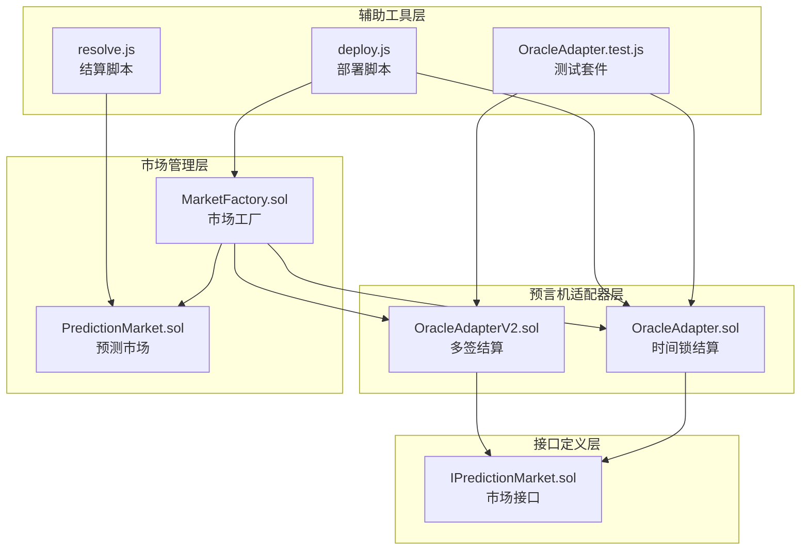
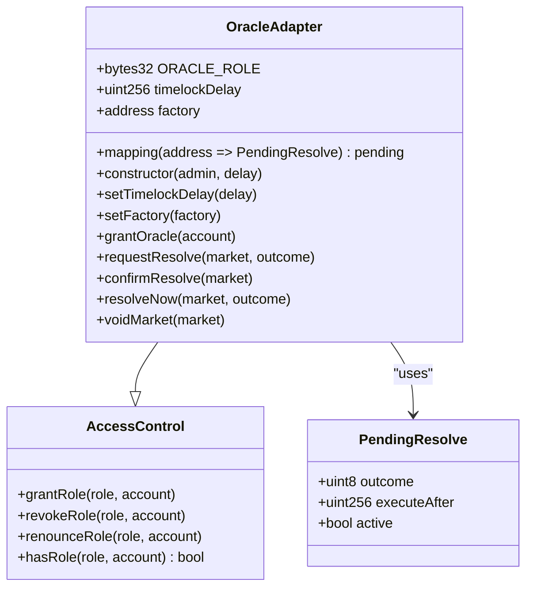
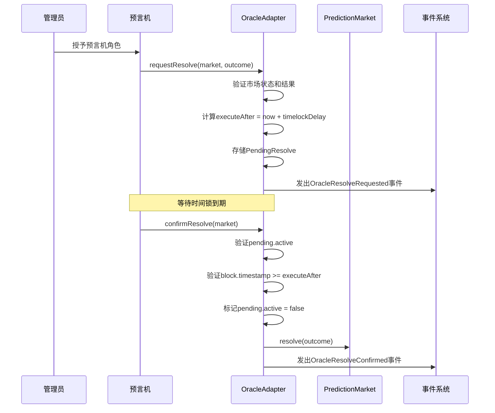
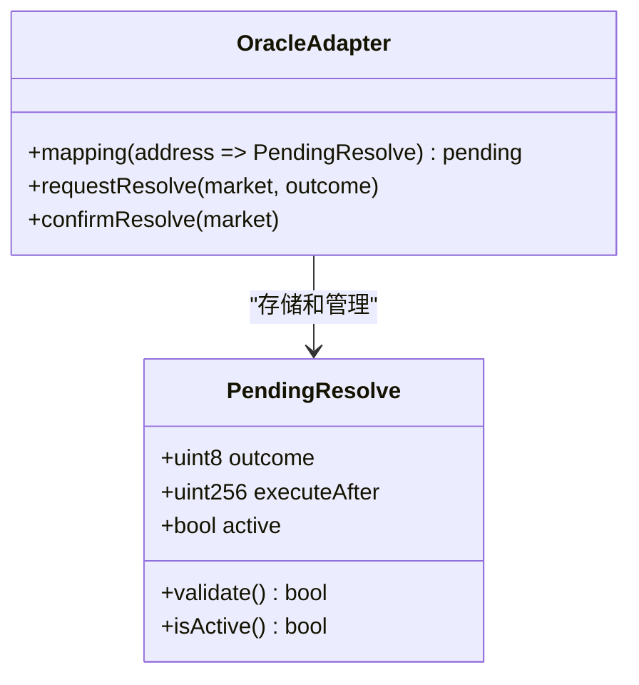
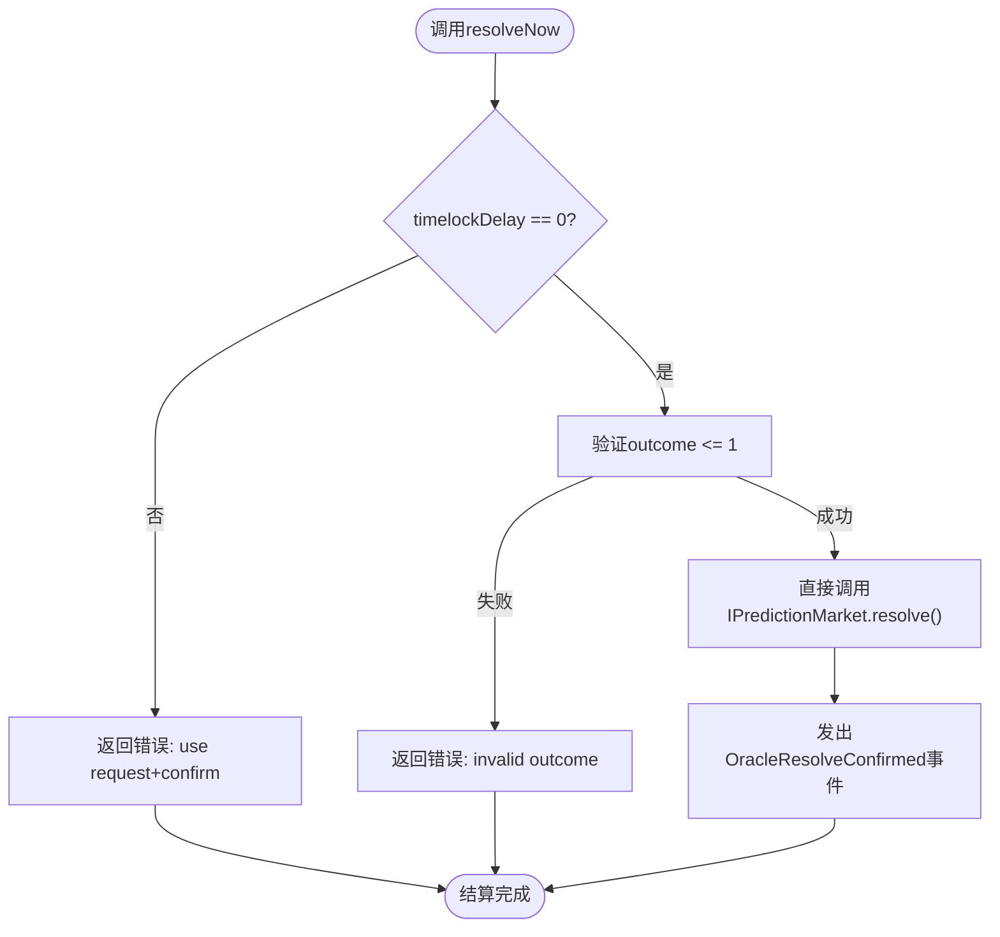
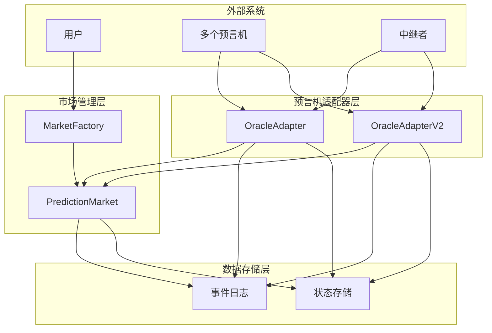
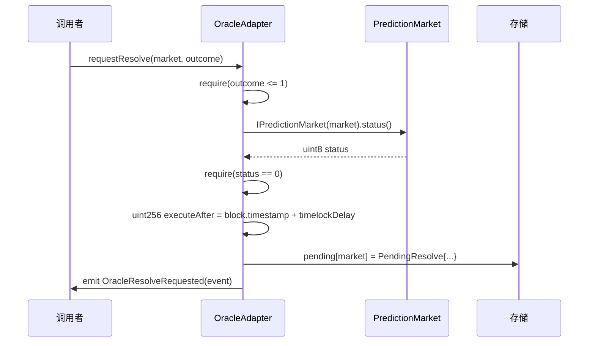
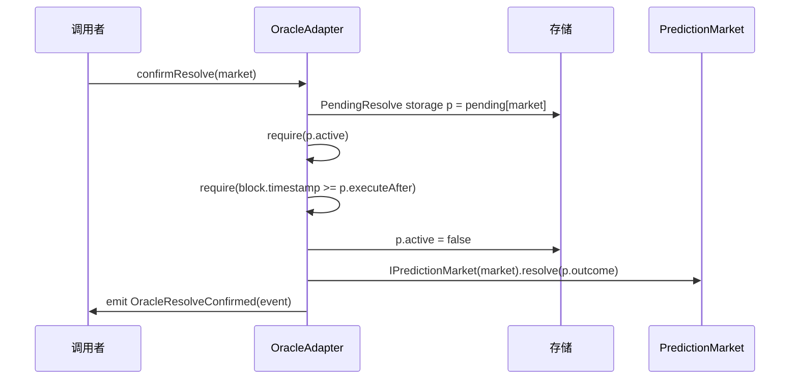
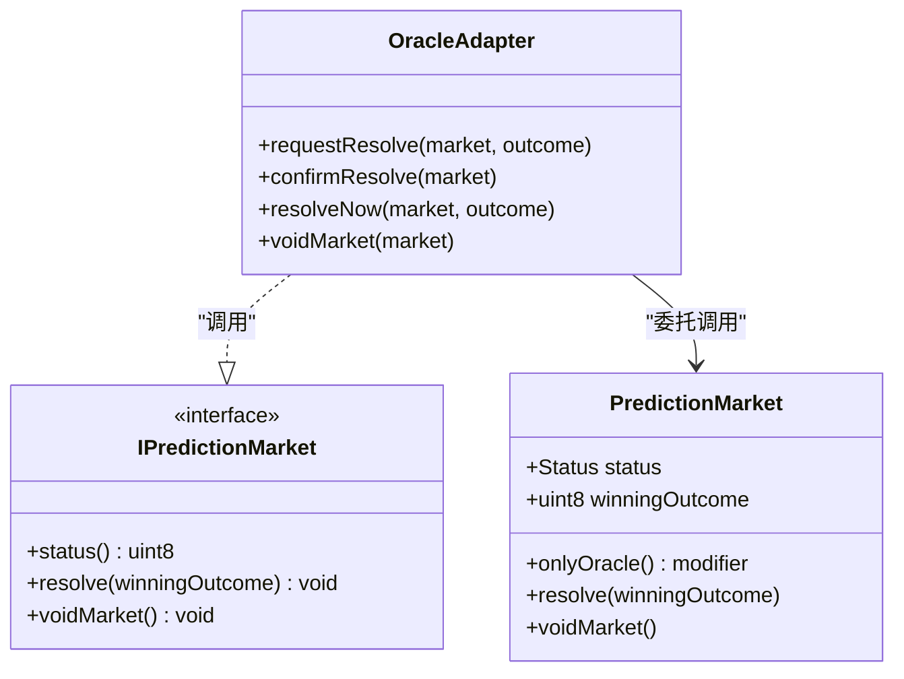
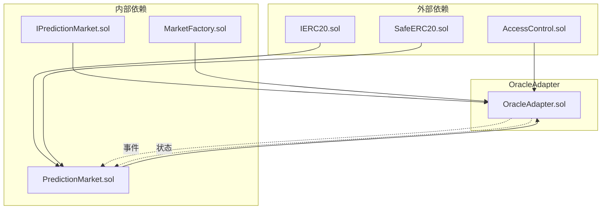

# OracleAdapter核心功能

<cite>
**本文档引用的文件**
- [OracleAdapter.sol](file://contracts/OracleAdapter.sol)
- [OracleAdapterV2.sol](file://contracts/OracleAdapterV2.sol)
- [IPredictionMarket.sol](file://contracts/interfaces/IPredictionMarket.sol)
- [PredictionMarket.sol](file://contracts/PredictionMarket.sol)
- [MarketFactory.sol](file://contracts/MarketFactory.sol)
- [OracleAdapter.test.js](file://test/OracleAdapter.test.js)
- [resolve.js](file://scripts/resolve.js)
- [deploy.js](file://scripts/deploy.js)
</cite>

## 目录
1. [简介](#简介)
2. [项目结构](#项目结构)
3. [核心组件](#核心组件)
4. [架构概览](#架构概览)
5. [详细组件分析](#详细组件分析)
6. [依赖关系分析](#依赖关系分析)
7. [性能考虑](#性能考虑)
8. [故障排除指南](#故障排除指南)
9. [结论](#结论)
10. [附录](#附录)

## 简介

OracleAdapter是PredictionDIDSimple项目中的核心预言机适配器合约，负责管理预测市场的结算流程。该合约实现了时间锁结算机制，确保市场结算具有透明度和安全性，防止恶意操作和价格操纵。

OracleAdapter提供了两种主要的结算模式：
- **时间锁结算模式**：通过requestResolve和confirmResolve函数实现，支持可配置的时间锁延迟
- **快速结算模式**：通过resolveNow函数实现，适用于时间锁为0的场景

该合约与IPredictionMarket接口紧密集成，通过访问控制机制确保只有授权的预言机可以执行结算操作。

## 项目结构

PredictionDIDSimple项目采用模块化架构设计，各个组件职责明确：



**图表来源**
- [OracleAdapter.sol:1-96](file://contracts/OracleAdapter.sol#L1-L96)
- [OracleAdapterV2.sol:1-95](file://contracts/OracleAdapterV2.sol#L1-L95)
- [MarketFactory.sol:1-68](file://contracts/MarketFactory.sol#L1-L68)
- [IPredictionMarket.sol:1-15](file://contracts/interfaces/IPredictionMarket.sol#L1-L15)

**章节来源**
- [OracleAdapter.sol:1-96](file://contracts/OracleAdapter.sol#L1-L96)
- [OracleAdapterV2.sol:1-95](file://contracts/OracleAdapterV2.sol#L1-L95)
- [MarketFactory.sol:1-68](file://contracts/MarketFactory.sol#L1-L68)

## 核心组件

### 访问控制与权限管理

OracleAdapter基于OpenZeppelin的AccessControl实现，提供两级权限控制：

- **DEFAULT_ADMIN_ROLE**：管理员角色，拥有最高权限
- **ORACLE_ROLE**：预言机角色，负责市场结算操作



**图表来源**
- [OracleAdapter.sol:11-25](file://contracts/OracleAdapter.sol#L11-L25)

**章节来源**
- [OracleAdapter.sol:11-55](file://contracts/OracleAdapter.sol#L11-L55)

### 时间锁结算机制

时间锁机制是OracleAdapter的核心特性，通过两个独立步骤实现：

1. **请求阶段**：启动时间锁，记录结算信息
2. **确认阶段**：等待时间锁到期后执行结算



**图表来源**
- [OracleAdapter.sol:57-78](file://contracts/OracleAdapter.sol#L57-L78)
- [IPredictionMarket.sol:8-13](file://contracts/interfaces/IPredictionMarket.sol#L8-L13)

**章节来源**
- [OracleAdapter.sol:57-78](file://contracts/OracleAdapter.sol#L57-L78)

### PendingResolve结构体设计

PendingResolve结构体是时间锁机制的数据载体，包含以下关键字段：

| 字段名 | 类型 | 描述 | 约束条件 |
|--------|------|------|----------|
| outcome | uint8 | 获胜结果编号 | 0或1 |
| executeAfter | uint256 | 可执行时间戳 | > 当前区块时间 |
| active | bool | 是否活跃状态 | true/false |



**图表来源**
- [OracleAdapter.sol:17-24](file://contracts/OracleAdapter.sol#L17-L24)

**章节来源**
- [OracleAdapter.sol:17-24](file://contracts/OracleAdapter.sol#L17-L24)

### 快速结算路径（resolveNow）

当时间锁延迟设置为0时，OracleAdapter提供resolveNow函数作为快速结算路径：



**图表来源**
- [OracleAdapter.sol:80-87](file://contracts/OracleAdapter.sol#L80-L87)

**章节来源**
- [OracleAdapter.sol:80-87](file://contracts/OracleAdapter.sol#L80-L87)

## 架构概览

OracleAdapter在整个PredictionDIDSimple生态系统中扮演着关键的协调角色：



**图表来源**
- [OracleAdapter.sol:1-96](file://contracts/OracleAdapter.sol#L1-L96)
- [OracleAdapterV2.sol:1-95](file://contracts/OracleAdapterV2.sol#L1-L95)
- [MarketFactory.sol:1-68](file://contracts/MarketFactory.sol#L1-L68)

## 详细组件分析

### requestResolve函数完整流程

requestResolve函数实现了时间锁结算的第一阶段：



**图表来源**
- [OracleAdapter.sol:57-68](file://contracts/OracleAdapter.sol#L57-L68)

**章节来源**
- [OracleAdapter.sol:57-68](file://contracts/OracleAdapter.sol#L57-L68)

### confirmResolve函数完整流程

confirmResolve函数实现了时间锁结算的第二阶段：



**图表来源**
- [OracleAdapter.sol:70-78](file://contracts/OracleAdapter.sol#L70-L78)

**章节来源**
- [OracleAdapter.sol:70-78](file://contracts/OracleAdapter.sol#L70-L78)

### 错误处理机制

OracleAdapter实现了多层次的错误处理机制：

| 错误类型 | 触发条件 | 错误消息 | 防护措施 |
|----------|----------|----------|----------|
| invalid outcome | outcome > 1 | "invalid outcome" | 输入验证 |
| not open | 市场状态 != Open | "not open" | 状态检查 |
| no pending | pending[market].active = false | "no pending" | 时间锁状态验证 |
| timelock | block.timestamp < executeAfter | "timelock" | 时间锁验证 |
| use request+confirm | timelockDelay != 0 | "use request+confirm" | 快速路径验证 |

**章节来源**
- [OracleAdapter.sol:57-87](file://contracts/OracleAdapter.sol#L57-L87)

### 与IPredictionMarket接口的交互

OracleAdapter通过IPredictionMarket接口与预测市场合约进行交互：



**图表来源**
- [IPredictionMarket.sol:7-14](file://contracts/interfaces/IPredictionMarket.sol#L7-L14)
- [PredictionMarket.sol:90-104](file://contracts/PredictionMarket.sol#L90-L104)

**章节来源**
- [IPredictionMarket.sol:7-14](file://contracts/interfaces/IPredictionMarket.sol#L7-L14)
- [PredictionMarket.sol:90-104](file://contracts/PredictionMarket.sol#L90-L104)

## 依赖关系分析

OracleAdapter的依赖关系体现了清晰的分层架构：



**图表来源**
- [OracleAdapter.sol:6-7](file://contracts/OracleAdapter.sol#L6-L7)
- [PredictionMarket.sol:6-7](file://contracts/PredictionMarket.sol#L6-L7)

**章节来源**
- [OracleAdapter.sol:6-7](file://contracts/OracleAdapter.sol#L6-L7)
- [PredictionMarket.sol:6-7](file://contracts/PredictionMarket.sol#L6-L7)

## 性能考虑

### Gas优化策略

OracleAdapter在设计时考虑了Gas效率：

1. **状态存储优化**：使用紧凑的结构体存储PendingResolve
2. **条件检查优化**：在函数开始处进行快速失败检查
3. **事件日志优化**：只在必要时发出事件

### 最佳实践建议

1. **时间锁配置**：根据市场类型和风险评估合理设置时间锁延迟
2. **权限管理**：最小权限原则，只授予必要的预言机角色
3. **监控告警**：建立时间锁到期提醒机制
4. **备份方案**：准备紧急结算预案

## 故障排除指南

### 常见问题及解决方案

| 问题描述 | 可能原因 | 解决方案 |
|----------|----------|----------|
| confirmResolve失败 | 时间锁未到期 | 等待时间锁到期后重试 |
| requestResolve失败 | 市场状态非开放 | 确认市场处于开放状态 |
| resolveNow失败 | 时间锁延迟不为0 | 使用requestResolve+confirmResolve流程 |
| 权限错误 | 非预言机账户调用 | 授予ORACLE_ROLE权限 |

**章节来源**
- [OracleAdapter.test.js:7-27](file://test/OracleAdapter.test.js#L7-L27)

### 调试技巧

1. **事件监听**：监听OracleResolveRequested和OracleResolveConfirmed事件
2. **状态查询**：检查pending映射和市场状态
3. **时间验证**：确认block.timestamp和executeAfter的关系

**章节来源**
- [OracleAdapter.test.js:29-51](file://test/OracleAdapter.test.js#L29-L51)

## 结论

OracleAdapter作为PredictionDIDSimple的核心组件，通过精心设计的时间锁机制和严格的权限控制，为预测市场提供了安全可靠的结算服务。其模块化的架构设计和清晰的接口定义，使得系统具有良好的可扩展性和维护性。

关键优势包括：
- **安全性**：时间锁机制防止恶意结算
- **透明性**：完整的事件日志记录
- **灵活性**：支持单签和多签两种模式
- **可审计性**：清晰的状态管理和权限控制

## 附录

### 开发者集成指南

#### 基本部署步骤

1. **部署OracleAdapter**
   ```javascript
   // 设置时间锁延迟（秒）
   const timelockDelay = 120;
   const adapter = await Adapter.deploy(admin.address, timelockDelay);
   ```

2. **授予预言机权限**
   ```javascript
   await adapter.grantOracle(oracle.address);
   ```

3. **配置工厂合约**
   ```javascript
   await adapter.setFactory(factory.address);
   ```

#### 正确使用示例

**时间锁结算流程**：
```javascript
// 1. 请求结算（启动时间锁）
await adapter.requestResolve(marketAddress, 0);

// 2. 等待时间锁到期
await time.increase(121);

// 3. 确认结算
await adapter.confirmResolve(marketAddress);
```

**快速结算流程**：
```javascript
// 直接结算（时间锁必须为0）
await adapter.resolveNow(marketAddress, 0);
```

#### 错误处理最佳实践

```javascript
try {
    await adapter.requestResolve(marketAddress, outcome);
} catch (error) {
    if (error.message.includes("not open")) {
        // 市场已关闭，检查市场状态
    } else if (error.message.includes("invalid outcome")) {
        // 验证结果编号范围
    }
}
```

**章节来源**
- [deploy.js:8-32](file://scripts/deploy.js#L8-L32)
- [OracleAdapter.test.js:8-27](file://test/OracleAdapter.test.js#L8-L27)