# 结算流程机制

<cite>
**本文档引用的文件**
- [PredictionMarket.sol](file://contracts/PredictionMarket.sol)
- [PredictionMarketV3.sol](file://contracts/PredictionMarketV3.sol)
- [OracleAdapter.sol](file://contracts/OracleAdapter.sol)
- [OracleAdapterV2.sol](file://contracts/OracleAdapterV2.sol)
- [IPredictionMarket.sol](file://contracts/interfaces/IPredictionMarket.sol)
- [MarketFactory.sol](file://contracts/MarketFactory.sol)
- [MarketFactoryV3.sol](file://contracts/MarketFactoryV3.sol)
- [MultiOutcomeMarket.sol](file://contracts/MultiOutcomeMarket.sol)
- [resolve.js](file://scripts/resolve.js)
- [PredictionMarket.test.js](file://test/PredictionMarket.test.js)
- [OracleAdapter.test.js](file://test/OracleAdapter.test.js)
</cite>

## 目录
1. [简介](#简介)
2. [项目结构](#项目结构)
3. [核心组件](#核心组件)
4. [架构概览](#架构概览)
5. [详细组件分析](#详细组件分析)
6. [依赖关系分析](#依赖关系分析)
7. [性能考虑](#性能考虑)
8. [故障排除指南](#故障排除指南)
9. [结论](#结论)

## 简介

PredictionDIDSimple 是一个基于以太坊的预测市场平台，实现了完整的结算流程机制。该系统支持两种主要的预测市场类型：二元预测市场（Yes/No）和多结果预测市场，并提供了灵活的结算方式，包括时间锁结算、多签结算和快速结算。

系统的核心特点是通过预言机适配器实现的两步验证机制，确保结算操作的安全性和可靠性。本文档将深入分析从预言机请求结算到最终市场结算的完整流程，详细解释时间锁机制的工作原理、pending状态管理和executeAfter时间戳计算。

## 项目结构

该项目采用模块化设计，主要包含以下核心组件：

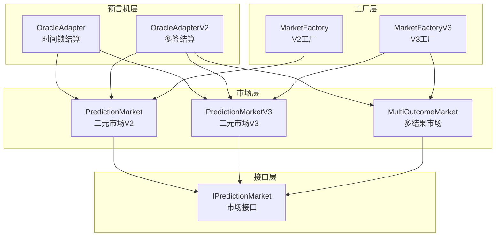

**图表来源**
- [OracleAdapter.sol:1-96](file://contracts/OracleAdapter.sol#L1-L96)
- [OracleAdapterV2.sol:1-95](file://contracts/OracleAdapterV2.sol#L1-L95)
- [PredictionMarket.sol:1-145](file://contracts/PredictionMarket.sol#L1-L145)
- [PredictionMarketV3.sol:1-218](file://contracts/PredictionMarketV3.sol#L1-L218)
- [MultiOutcomeMarket.sol:1-124](file://contracts/MultiOutcomeMarket.sol#L1-L124)
- [MarketFactory.sol:1-68](file://contracts/MarketFactory.sol#L1-L68)
- [MarketFactoryV3.sol:1-104](file://contracts/MarketFactoryV3.sol#L1-L104)

**章节来源**
- [MarketFactory.sol:1-68](file://contracts/MarketFactory.sol#L1-L68)
- [MarketFactoryV3.sol:1-104](file://contracts/MarketFactoryV3.sol#L1-L104)

## 核心组件

### 预言机适配器（OracleAdapter）

OracleAdapter 实现了基础的时间锁结算机制，提供两步验证流程：

1. **requestResolve**: 启动时间锁，设置执行时间戳
2. **confirmResolve**: 在时间锁到期后执行实际结算
3. **resolveNow**: 时间锁为0时的快速结算路径

### 预言机适配器V2（OracleAdapterV2）

OracleAdapterV2 实现了更高级的多签结算机制，支持m-of-n多签名：

1. **proposeResolve**: 创建结算提案
2. **approveResolve**: 多个预言机批准提案
3. **自动执行**: 当批准数达到阈值时自动执行

### 预测市场合约

系统支持三种类型的预测市场：

1. **PredictionMarket (V2)**: 基础二元市场，使用互池式结算
2. **PredictionMarketV3 (V3)**: 高级二元市场，使用CPMM机制
3. **MultiOutcomeMarket**: 多结果市场，支持2-8个结果

**章节来源**
- [OracleAdapter.sol:1-96](file://contracts/OracleAdapter.sol#L1-L96)
- [OracleAdapterV2.sol:1-95](file://contracts/OracleAdapterV2.sol#L1-L95)
- [PredictionMarket.sol:1-145](file://contracts/PredictionMarket.sol#L1-L145)
- [PredictionMarketV3.sol:1-218](file://contracts/PredictionMarketV3.sol#L1-L218)
- [MultiOutcomeMarket.sol:1-124](file://contracts/MultiOutcomeMarket.sol#L1-L124)

## 架构概览

系统采用分层架构设计，通过预言机适配器统一管理所有市场的结算操作：

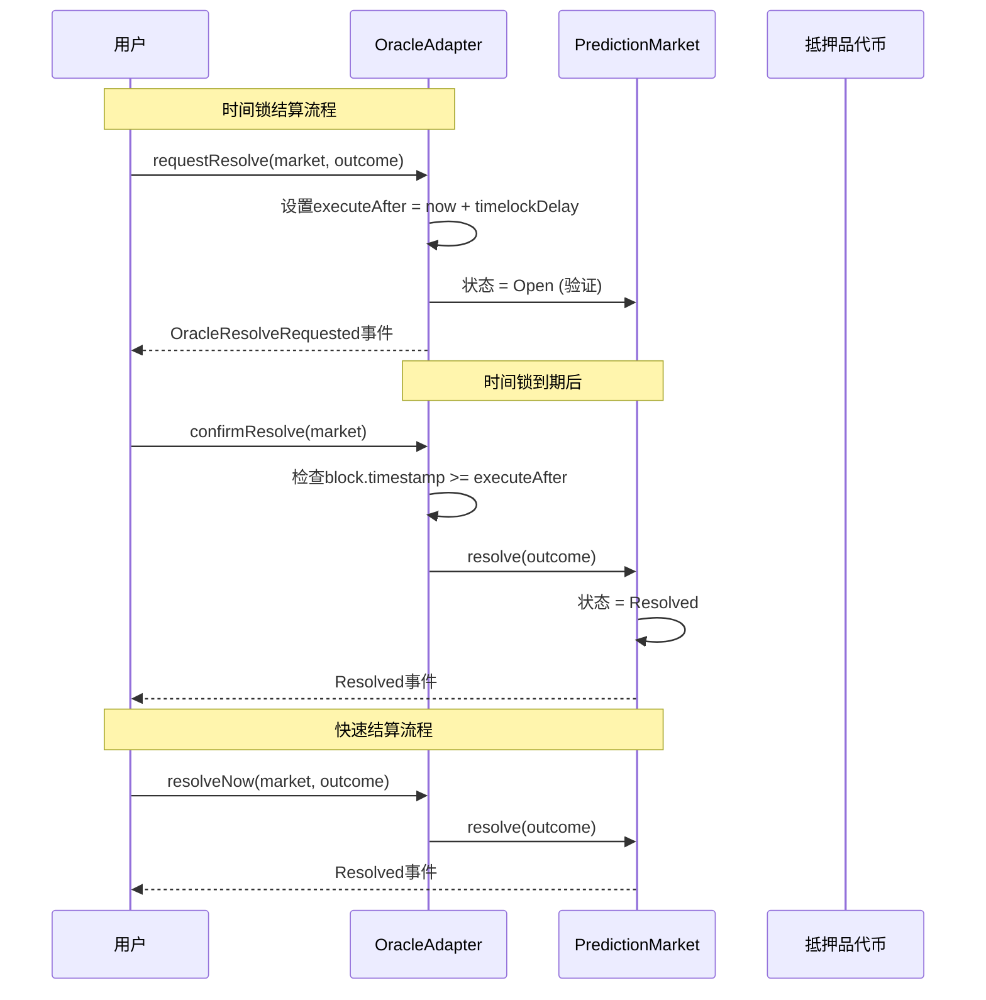

**图表来源**
- [OracleAdapter.sol:57-87](file://contracts/OracleAdapter.sol#L57-L87)
- [PredictionMarket.sol:90-97](file://contracts/PredictionMarket.sol#L90-L97)

### 多签结算流程

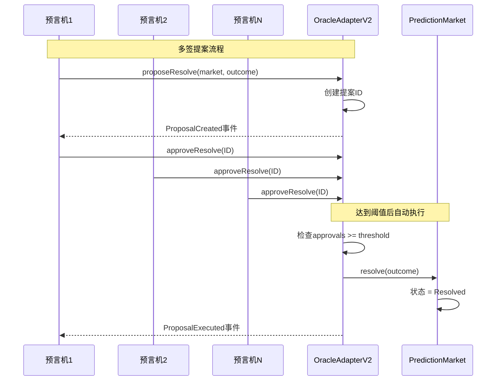

**图表来源**
- [OracleAdapterV2.sol:51-86](file://contracts/OracleAdapterV2.sol#L51-L86)
- [PredictionMarket.sol:90-97](file://contracts/PredictionMarket.sol#L90-L97)

## 详细组件分析

### 时间锁机制详解

时间锁机制是系统安全性的核心保障，通过两步验证防止恶意结算操作：

#### Pending状态管理

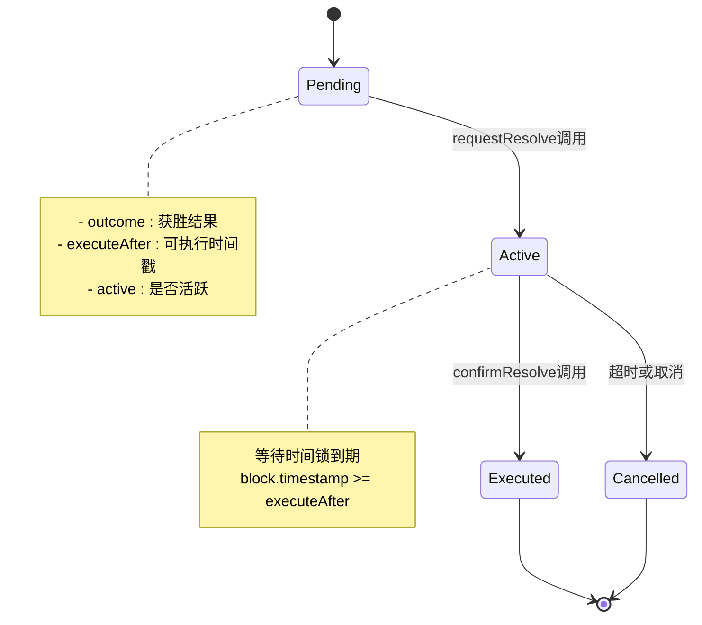

**图表来源**
- [OracleAdapter.sol:17-24](file://contracts/OracleAdapter.sol#L17-L24)
- [OracleAdapter.sol:57-78](file://contracts/OracleAdapter.sol#L57-L78)

#### executeAfter时间戳计算

executeAfter = block.timestamp + timelockDelay

时间戳计算遵循以下规则：
- 使用区块时间戳而非链上时间
- 支持任意长度的时间锁延迟
- 防止时间回溯攻击

**章节来源**
- [OracleAdapter.sol:57-68](file://contracts/OracleAdapter.sol#L57-L68)

### requestResolve和confirmResolve协作机制

两步验证机制的设计目的是平衡安全性和效率：

#### 协作流程

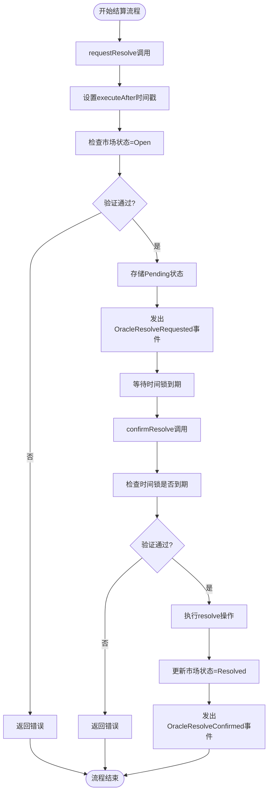

**图表来源**
- [OracleAdapter.sol:57-78](file://contracts/OracleAdapter.sol#L57-L78)
- [PredictionMarket.sol:90-97](file://contracts/PredictionMarket.sol#L90-L97)

#### 为什么需要两步验证机制

1. **安全隔离**: 预言机可以发起结算请求但不能立即执行
2. **透明度**: 所有参与者都可以观察到Pending状态
3. **可撤销性**: 在时间锁期间可以取消或修改请求
4. **防攻击**: 防止恶意预言机滥用权限

### 不同市场状态下的结算行为

#### 正常结算流程

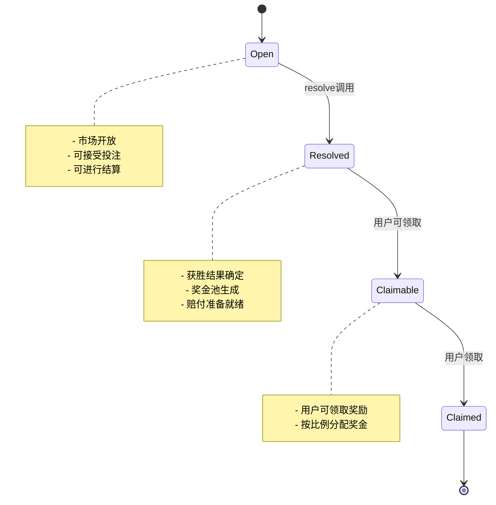

**图表来源**
- [PredictionMarket.sol:15-29](file://contracts/PredictionMarket.sol#L15-L29)
- [PredictionMarketV3.sol:15-28](file://contracts/PredictionMarketV3.sol#L15-L28)

#### 快速结算机制

当时间锁延迟设置为0时，系统支持直接结算：

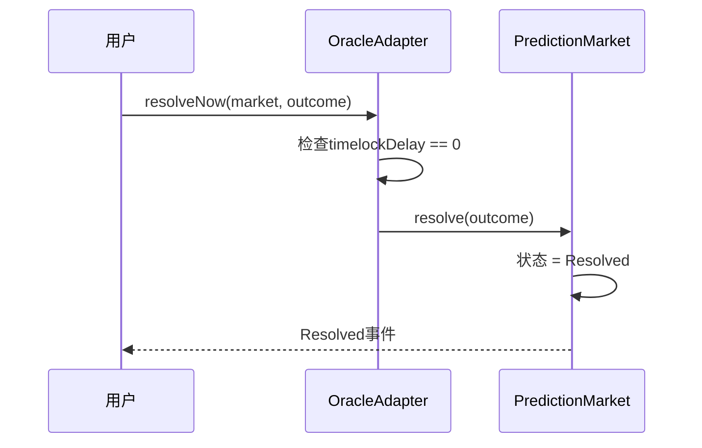

**图表来源**
- [OracleAdapter.sol:80-87](file://contracts/OracleAdapter.sol#L80-L87)
- [PredictionMarket.sol:90-97](file://contracts/PredictionMarket.sol#L90-L97)

#### 市场作废处理

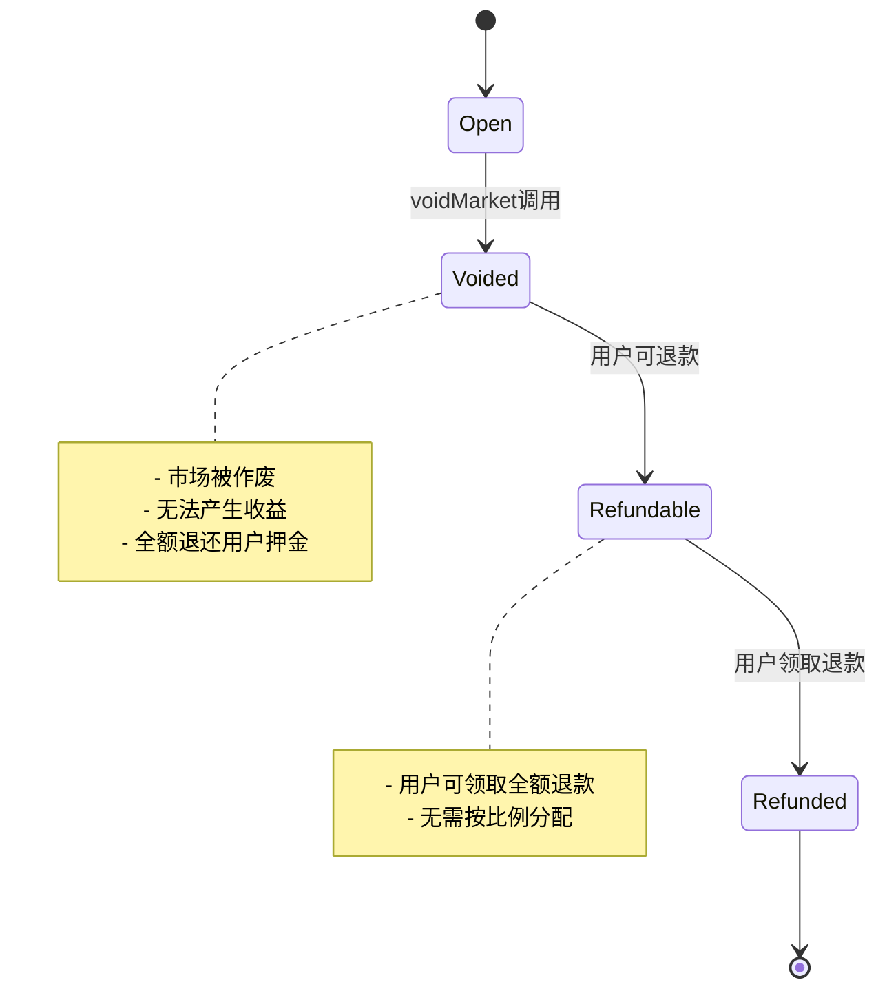

**图表来源**
- [PredictionMarket.sol:99-104](file://contracts/PredictionMarket.sol#L99-L104)
- [PredictionMarketV3.sol:157-162](file://contracts/PredictionMarketV3.sol#L157-L162)

### 奖金计算算法

#### 二元市场（V2）奖金计算

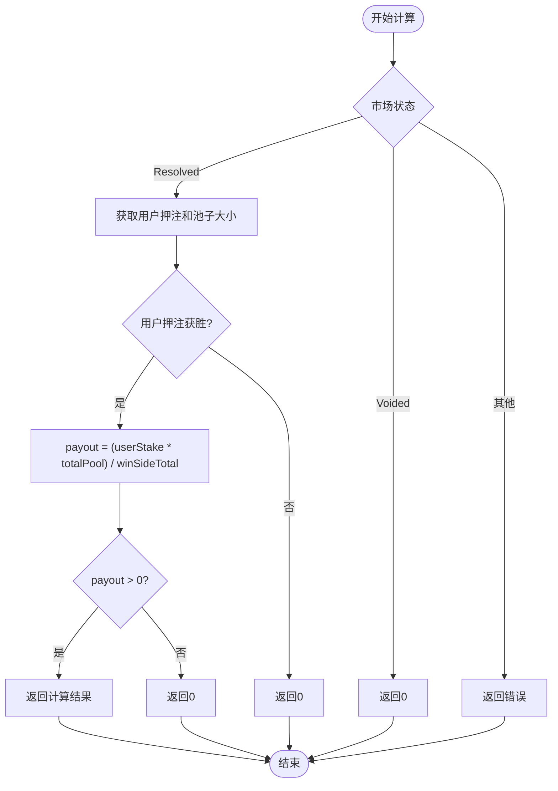

**图表来源**
- [PredictionMarket.sol:125-143](file://contracts/PredictionMarket.sol#L125-L143)

#### V3市场CPMM奖金计算

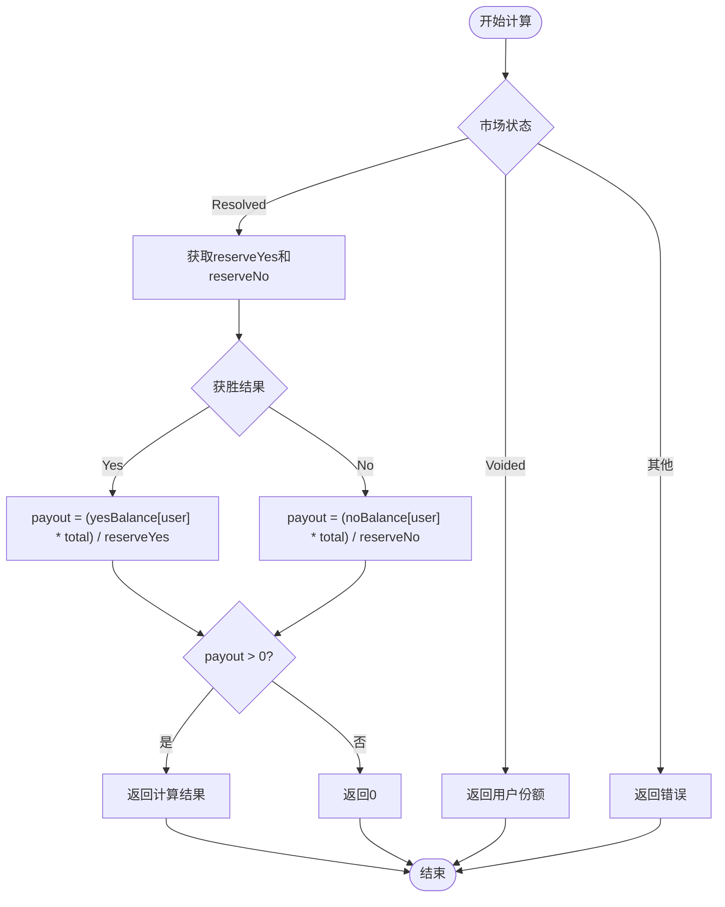

**图表来源**
- [PredictionMarketV3.sol:207-216](file://contracts/PredictionMarketV3.sol#L207-L216)

**章节来源**
- [PredictionMarket.sol:125-143](file://contracts/PredictionMarket.sol#L125-L143)
- [PredictionMarketV3.sol:207-216](file://contracts/PredictionMarketV3.sol#L207-L216)

## 依赖关系分析

系统采用清晰的依赖层次结构：

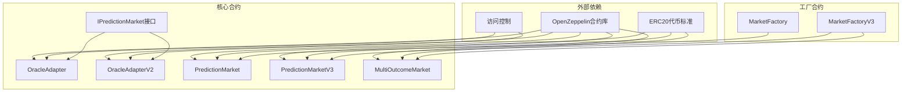

**图表来源**
- [IPredictionMarket.sol:6-14](file://contracts/interfaces/IPredictionMarket.sol#L6-L14)
- [OracleAdapter.sol:6-7](file://contracts/OracleAdapter.sol#L6-L7)
- [OracleAdapterV2.sol:6-7](file://contracts/OracleAdapterV2.sol#L6-L7)
- [PredictionMarket.sol:6-7](file://contracts/PredictionMarket.sol#L6-L7)
- [PredictionMarketV3.sol:6-8](file://contracts/PredictionMarketV3.sol#L6-L8)
- [MultiOutcomeMarket.sol:6-8](file://contracts/MultiOutcomeMarket.sol#L6-L8)

### 组件耦合度分析

- **低耦合**: 预言机适配器与具体市场实现解耦
- **高内聚**: 每个合约专注于特定功能领域
- **接口抽象**: 通过IPredictionMarket统一市场接口

**章节来源**
- [IPredictionMarket.sol:6-14](file://contracts/interfaces/IPredictionMarket.sol#L6-L14)
- [MarketFactory.sol:44-61](file://contracts/MarketFactory.sol#L44-L61)
- [MarketFactoryV3.sol:44-97](file://contracts/MarketFactoryV3.sol#L44-L97)

## 性能考虑

### Gas优化策略

1. **状态变更最小化**: 预言机适配器只存储必要的Pending状态
2. **批量操作支持**: 多签适配器支持多个预言机同时批准
3. **内存效率**: 使用mapping而非数组存储用户状态

### 可扩展性设计

1. **工厂模式**: 通过工厂合约统一部署和管理市场
2. **接口抽象**: 支持多种市场类型和结算机制
3. **模块化架构**: 各组件职责明确，易于维护和升级

## 故障排除指南

### 常见错误及解决方案

#### 时间锁相关错误

| 错误类型 | 触发条件 | 解决方案 |
|---------|---------|---------|
| timelock | block.timestamp < executeAfter | 等待时间锁到期或调整timelockDelay |
| no pending | 不存在Pending请求 | 检查requestResolve是否正确调用 |
| invalid outcome | 结果编号无效 | 确保outcome在0-1范围内 |

#### 市场状态错误

| 错误类型 | 触发条件 | 解决方案 |
|---------|---------|---------|
| not open | 市场已关闭或已结算 | 等待市场重新开放或检查状态 |
| already claimed | 用户已领取奖励 | 避免重复领取操作 |
| not claimable | 市场状态不允许领取 | 检查市场当前状态 |

#### 权限相关错误

| 错误类型 | 触发条件 | 解决方案 |
|---------|---------|---------|
| not oracle | 非授权地址调用 | 确保调用者具有ORACLE_ROLE权限 |
| not factory | 非工厂合约调用 | 检查调用者的合约地址 |

### 调试最佳实践

1. **事件监控**: 监听所有关键事件以跟踪状态变化
2. **状态查询**: 定期查询市场状态和Pending状态
3. **日志记录**: 在生产环境中记录重要操作的日志
4. **测试覆盖**: 确保所有结算路径都有充分的测试覆盖

**章节来源**
- [OracleAdapter.test.js:8-27](file://test/OracleAdapter.test.js#L8-L27)
- [PredictionMarket.test.js:44-76](file://test/PredictionMarket.test.js#L44-L76)

## 结论

PredictionDIDSimple 的结算流程机制通过精心设计的两步验证和多签机制，实现了高度安全和灵活的预测市场结算系统。系统的主要优势包括：

1. **安全性**: 通过时间锁和多签机制防止恶意结算
2. **灵活性**: 支持多种结算方式和市场类型
3. **可扩展性**: 模块化设计便于功能扩展和维护
4. **透明度**: 完整的事件记录和状态查询接口

该系统为预测市场提供了可靠的基础设施，支持从简单二元市场到复杂多结果市场的各种应用场景。通过合理的错误处理和监控机制，确保了系统的稳定性和可靠性。