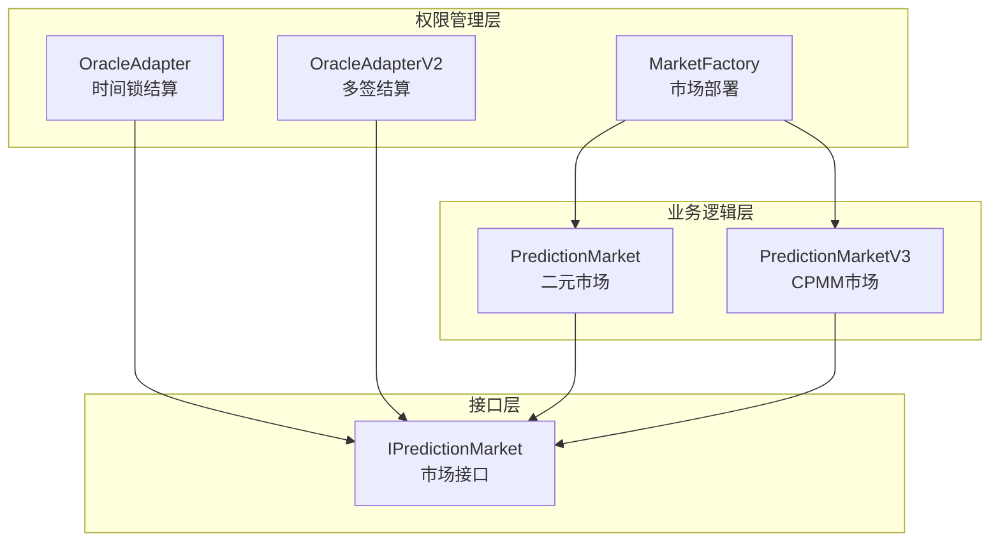
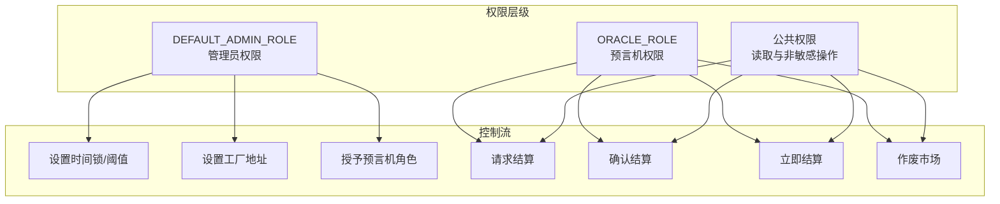
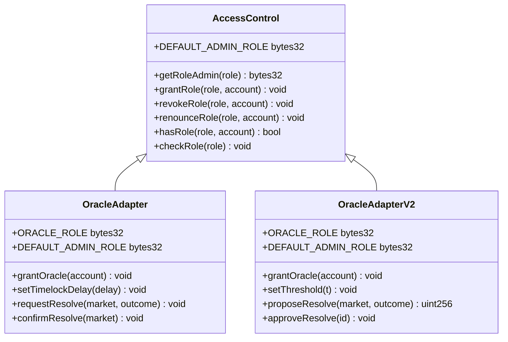
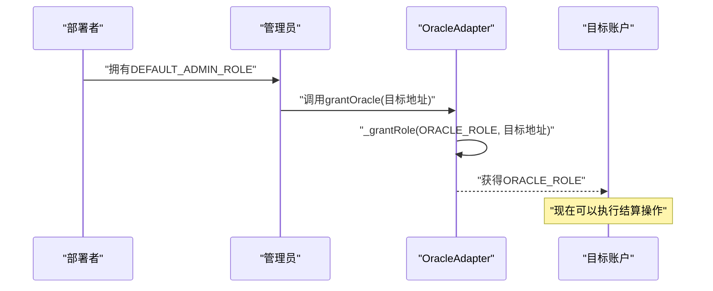
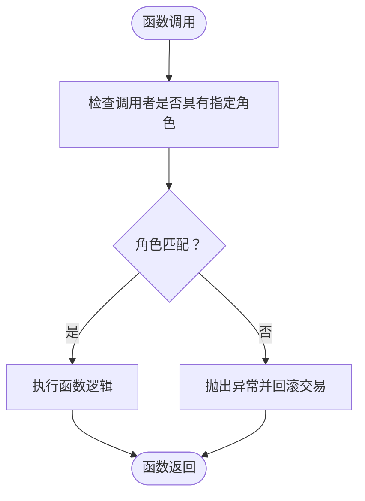
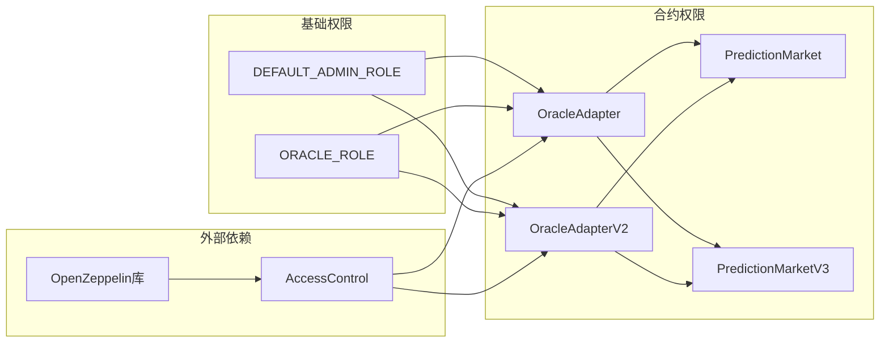
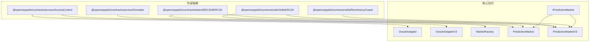

# 访问控制与角色管理

<cite>
**本文档引用的文件**
- [OracleAdapter.sol](file://contracts/OracleAdapter.sol)
- [OracleAdapterV2.sol](file://contracts/OracleAdapterV2.sol)
- [PredictionMarket.sol](file://contracts/PredictionMarket.sol)
- [PredictionMarketV3.sol](file://contracts/PredictionMarketV3.sol)
- [MarketFactory.sol](file://contracts/MarketFactory.sol)
- [IPredictionMarket.sol](file://contracts/interfaces/IPredictionMarket.sol)
- [OracleAdapter.test.js](file://test/OracleAdapter.test.js)
- [deploy.js](file://scripts/deploy.js)
- [AccessControl.json](file://artifacts/@openzeppelin/contracts/access/AccessControl.json)
</cite>

## 目录
1. [简介](#简介)
2. [项目结构](#项目结构)
3. [核心组件](#核心组件)
4. [架构概览](#架构概览)
5. [详细组件分析](#详细组件分析)
6. [依赖关系分析](#依赖关系分析)
7. [性能考量](#性能考量)
8. [故障排除指南](#故障排除指南)
9. [结论](#结论)

## 简介
本文件深入解析预测市场系统中的访问控制与角色管理体系，重点涵盖以下内容：
- ORACLE_ROLE与DEFAULT_ADMIN_ROLE的设计理念与权限分离原则
- grantOracle函数的使用方法与安全注意事项
- onlyRole修饰符的应用与OpenZeppelin AccessControl的安全特性
- 角色继承与权限链工作机制
- 多重签名钱包的使用建议与权限审计方法
- 部署与运行时的角色权限管理最佳实践

## 项目结构
该系统采用分层架构，围绕预言机适配器、市场工厂与预测市场合约构建权限体系：
- OracleAdapter/OracleAdapterV2：负责预言机权限管理与结算流程控制
- MarketFactory：负责市场部署与全局参数配置
- PredictionMarket/PredictionMarketV3：负责具体市场业务逻辑与状态管理
- IPredictionMarket：定义市场合约必须实现的核心接口

**图表来源**
- [OracleAdapter.sol:11-96](file://contracts/OracleAdapter.sol#L11-L96)
- [OracleAdapterV2.sol:11-95](file://contracts/OracleAdapterV2.sol#L11-L95)
- [MarketFactory.sol:12-68](file://contracts/MarketFactory.sol#L12-L68)
- [PredictionMarket.sol:11-145](file://contracts/PredictionMarket.sol#L11-L145)
- [PredictionMarketV3.sol:12-218](file://contracts/PredictionMarketV3.sol#L12-L218)
- [IPredictionMarket.sol:7-15](file://contracts/interfaces/IPredictionMarket.sol#L7-L15)

**章节来源**
- [OracleAdapter.sol:11-96](file://contracts/OracleAdapter.sol#L11-L96)
- [OracleAdapterV2.sol:11-95](file://contracts/OracleAdapterV2.sol#L11-L95)
- [MarketFactory.sol:12-68](file://contracts/MarketFactory.sol#L12-L68)
- [PredictionMarket.sol:11-145](file://contracts/PredictionMarket.sol#L11-L145)
- [PredictionMarketV3.sol:12-218](file://contracts/PredictionMarketV3.sol#L12-L218)
- [IPredictionMarket.sol:7-15](file://contracts/interfaces/IPredictionMarket.sol#L7-L15)

## 核心组件
本节详细分析访问控制的核心组件及其职责分工。

### OracleAdapter（时间锁结算）
OracleAdapter实现了基于时间锁的预言机结算流程，通过ORACLE_ROLE控制结算操作，通过DEFAULT_ADMIN_ROLE控制管理操作。

关键设计要点：
- 使用keccak256("ORACLE_ROLE")生成稳定的角色标识符
- 构造函数同时授予DEFAULT_ADMIN_ROLE和ORACLE_ROLE给管理员
- 支持时间锁延迟配置与工厂合约地址设置
- 提供requestResolve、confirmResolve、resolveNow等结算流程

**章节来源**
- [OracleAdapter.sol:11-40](file://contracts/OracleAdapter.sol#L11-L40)
- [OracleAdapter.sol:42-55](file://contracts/OracleAdapter.sol#L42-L55)
- [OracleAdapter.sol:57-87](file://contracts/OracleAdapter.sol#L57-L87)

### OracleAdapterV2（多签结算）
OracleAdapterV2引入了m-of-n多签机制，增强了决策的去中心化程度。

关键设计要点：
- 引入threshold阈值概念，要求至少m个预言机批准
- 实现提案创建、批准与执行的完整生命周期
- 支持提案ID追踪与批准状态管理
- 保持与OracleAdapter相同的ORACLE_ROLE权限模型

**章节来源**
- [OracleAdapterV2.sol:11-38](file://contracts/OracleAdapterV2.sol#L11-L38)
- [OracleAdapterV2.sol:40-49](file://contracts/OracleAdapterV2.sol#L40-L49)
- [OracleAdapterV2.sol:51-86](file://contracts/OracleAdapterV2.sol#L51-L86)

### MarketFactory（市场部署）
MarketFactory作为所有权管理组件，负责市场合约的创建与全局参数配置。

关键设计要点：
- 继承Ownable，使用onlyOwner修饰符控制访问
- 提供setOracle方法更新预言机地址
- createMarket方法部署新的预测市场合约
- 维护市场ID到地址的映射关系

**章节来源**
- [MarketFactory.sol:12-68](file://contracts/MarketFactory.sol#L12-L68)

### PredictionMarket与PredictionMarketV3（市场业务）
两个市场合约均实现onlyOracle修饰符，确保只有授权的预言机可以执行结算和作废操作。

关键设计要点：
- onlyOracle修饰符验证调用者必须等于oracle字段
- 支持resolve和voidMarket两种核心操作
- PredictionMarketV3额外集成ReentrancyGuard防护
- 统一的状态枚举与事件机制

**章节来源**
- [PredictionMarket.sol:43-47](file://contracts/PredictionMarket.sol#L43-L47)
- [PredictionMarket.sol:90-104](file://contracts/PredictionMarket.sol#L90-L104)
- [PredictionMarketV3.sol:48-52](file://contracts/PredictionMarketV3.sol#L48-L52)
- [PredictionMarketV3.sol:148-162](file://contracts/PredictionMarketV3.sol#L148-L162)

## 架构概览
系统采用分层权限架构，明确区分管理权限与操作权限：

**图表来源**
- [OracleAdapter.sol:42-55](file://contracts/OracleAdapter.sol#L42-L55)
- [OracleAdapterV2.sol:40-49](file://contracts/OracleAdapterV2.sol#L40-L49)
- [OracleAdapter.sol:57-94](file://contracts/OracleAdapter.sol#L57-L94)
- [OracleAdapterV2.sol:51-93](file://contracts/OracleAdapterV2.sol#L51-L93)

## 详细组件分析

### 角色权限模型
系统采用OpenZeppelin AccessControl的标准角色模型，结合自定义角色标识符实现精细化权限控制。

**图表来源**
- [OracleAdapter.sol:11-55](file://contracts/OracleAdapter.sol#L11-L55)
- [OracleAdapterV2.sol:11-49](file://contracts/OracleAdapterV2.sol#L11-L49)
- [AccessControl.json:233-298](file://artifacts/@openzeppelin/contracts/access/AccessControl.json#L233-L298)

### 权限分离原则
系统严格遵循最小权限原则和职责分离原则：

1. **管理权限与操作权限分离**
   - DEFAULT_ADMIN_ROLE仅用于管理操作（设置阈值、授予角色等）
   - ORACLE_ROLE仅用于业务操作（结算、作废等）

2. **时间锁机制**
   - OracleAdapter通过时间锁延迟防止即时结算
   - OracleAdapterV2通过多签机制实现去中心化决策

3. **单一职责**
   - MarketFactory专注部署与配置
   - OracleAdapter专注权限管理
   - PredictionMarket专注业务逻辑

**章节来源**
- [OracleAdapter.sol:42-55](file://contracts/OracleAdapter.sol#L42-L55)
- [OracleAdapterV2.sol:40-49](file://contracts/OracleAdapterV2.sol#L40-L49)
- [OracleAdapter.sol:57-94](file://contracts/OracleAdapter.sol#L57-L94)

### grantOracle函数详解
grantOracle函数是角色管理的核心接口，具有以下特点：

**图表来源**
- [OracleAdapter.sol:52-55](file://contracts/OracleAdapter.sol#L52-L55)
- [OracleAdapterV2.sol:46-49](file://contracts/OracleAdapterV2.sol#L46-L49)

使用注意事项：
- 仅DEFAULT_ADMIN_ROLE持有者可调用
- 建议使用多重签名钱包执行此操作
- 应记录每次授予权限的详细信息
- 考虑设置权限有效期和撤销机制

**章节来源**
- [OracleAdapter.sol:52-55](file://contracts/OracleAdapter.sol#L52-L55)
- [OracleAdapterV2.sol:46-49](file://contracts/OracleAdapterV2.sol#L46-L49)

### onlyRole修饰符应用
onlyRole修饰符提供了简洁而强大的权限控制机制：

**图表来源**
- [OracleAdapter.sol:42-55](file://contracts/OracleAdapter.sol#L42-L55)
- [OracleAdapterV2.sol:51-64](file://contracts/OracleAdapterV2.sol#L51-L64)
- [PredictionMarket.sol:90-104](file://contracts/PredictionMarket.sol#L90-L104)

应用场景：
- 管理员操作：设置时间锁、阈值、工厂地址
- 预言机操作：请求结算、确认结算、立即结算、作废市场
- 市场操作：onlyOracle修饰符限制结算和作废权限

**章节来源**
- [OracleAdapter.sol:42-94](file://contracts/OracleAdapter.sol#L42-L94)
- [OracleAdapterV2.sol:40-93](file://contracts/OracleAdapterV2.sol#L40-L93)
- [PredictionMarket.sol:90-104](file://contracts/PredictionMarket.sol#L90-L104)

### 角色继承与权限链
系统实现了清晰的角色继承与权限链机制：

**图表来源**
- [OracleAdapter.sol:11-12](file://contracts/OracleAdapter.sol#L11-L12)
- [OracleAdapterV2.sol:11-12](file://contracts/OracleAdapterV2.sol#L11-L12)
- [AccessControl.json:195-205](file://artifacts/@openzeppelin/contracts/access/AccessControl.json#L195-L205)

权限传递机制：
- DEFAULT_ADMIN_ROLE具有最高权限，可管理其他角色
- ORACLE_ROLE专门用于业务操作，权限范围明确
- 通过AccessControl的基础权限管理功能实现权限继承

**章节来源**
- [OracleAdapter.sol:11-12](file://contracts/OracleAdapter.sol#L11-L12)
- [OracleAdapterV2.sol:11-12](file://contracts/OracleAdapterV2.sol#L11-L12)
- [AccessControl.json:195-205](file://artifacts/@openzeppelin/contracts/access/AccessControl.json#L195-L205)

## 依赖关系分析
系统各组件间的依赖关系体现了清晰的分层架构：

**图表来源**
- [OracleAdapter.sol:6-7](file://contracts/OracleAdapter.sol#L6-L7)
- [OracleAdapterV2.sol:6-7](file://contracts/OracleAdapterV2.sol#L6-L7)
- [MarketFactory.sol:6-8](file://contracts/MarketFactory.sol#L6-L8)
- [PredictionMarket.sol:6-7](file://contracts/PredictionMarket.sol#L6-L7)
- [PredictionMarketV3.sol:8](file://contracts/PredictionMarketV3.sol#L8)
- [IPredictionMarket.sol:7-15](file://contracts/interfaces/IPredictionMarket.sol#L7-L15)

**章节来源**
- [OracleAdapter.sol:6-7](file://contracts/OracleAdapter.sol#L6-L7)
- [OracleAdapterV2.sol:6-7](file://contracts/OracleAdapterV2.sol#L6-L7)
- [MarketFactory.sol:6-8](file://contracts/MarketFactory.sol#L6-L8)
- [PredictionMarket.sol:6-7](file://contracts/PredictionMarket.sol#L6-L7)
- [PredictionMarketV3.sol:8](file://contracts/PredictionMarketV3.sol#L8)
- [IPredictionMarket.sol:7-15](file://contracts/interfaces/IPredictionMarket.sol#L7-L15)

## 性能考量
访问控制系统在性能方面的考虑：

1. **角色查询开销**
   - hasRole函数的时间复杂度为O(1)，空间复杂度为O(n)
   - 角色管理员查询为O(1)常数时间

2. **权限检查成本**
   - onlyRole修饰符的检查成本极低
   - 对于高频操作影响可忽略不计

3. **存储优化**
   - 使用bytes32存储角色标识符，节省gas费用
   - mapping结构提供高效的权限查询

4. **批量操作**
   - 多签模式可能增加交易确认时间
   - 但提高了安全性，适合高价值操作

## 故障排除指南
常见权限相关问题及解决方案：

### 权限不足错误
**症状**：调用被拒绝，提示"not oracle"或角色检查失败
**原因**：调用者未持有相应角色
**解决**：
- 确认账户已被授予ORACLE_ROLE
- 验证DEFAULT_ADMIN_ROLE持有者的身份
- 检查多签阈值是否满足

### 时间锁相关问题
**症状**：confirmResolve调用失败，提示"timelock"
**原因**：时间锁延迟未过期
**解决**：
- 等待足够时间后重试
- 检查timelockDelay配置
- 考虑使用resolveNow进行紧急处理

### 多签执行失败
**症状**：提案无法执行，批准数不足
**原因**：未达到threshold阈值
**解决**：
- 确认所有预言机均已批准
- 检查threshold配置
- 验证预言机地址有效性

**章节来源**
- [OracleAdapter.test.js:22-27](file://test/OracleAdapter.test.js#L22-L27)
- [OracleAdapter.test.js:30-51](file://test/OracleAdapter.test.js#L30-L51)

## 结论
该预测市场的访问控制与角色管理系统展现了优秀的安全设计原则：

1. **清晰的权限分离**：管理权限与操作权限严格分离，降低安全风险
2. **灵活的权限模型**：支持单签和多签两种模式，适应不同场景需求
3. **完善的审计机制**：通过事件日志记录所有权限变更和操作行为
4. **可扩展的架构**：基于OpenZeppelin标准实现，便于维护和升级

建议在生产环境中：
- 使用多重签名钱包管理DEFAULT_ADMIN_ROLE
- 建立完整的权限审计制度
- 定期审查和清理不再使用的权限
- 实施权限轮换和定期复核机制
- 建立应急响应预案处理权限丢失情况