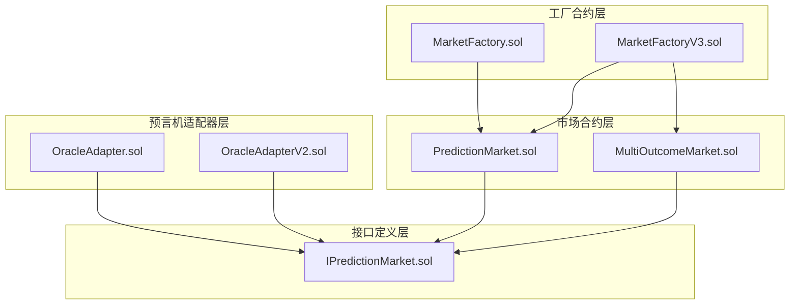
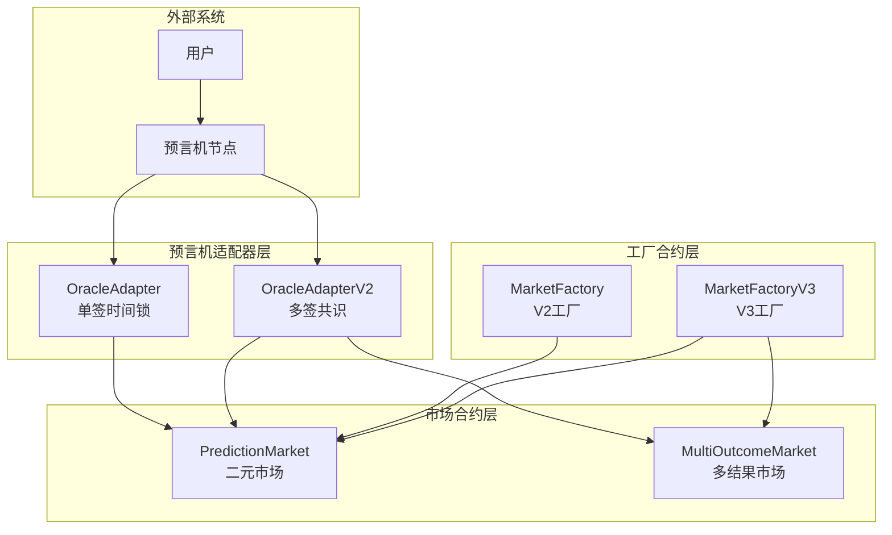
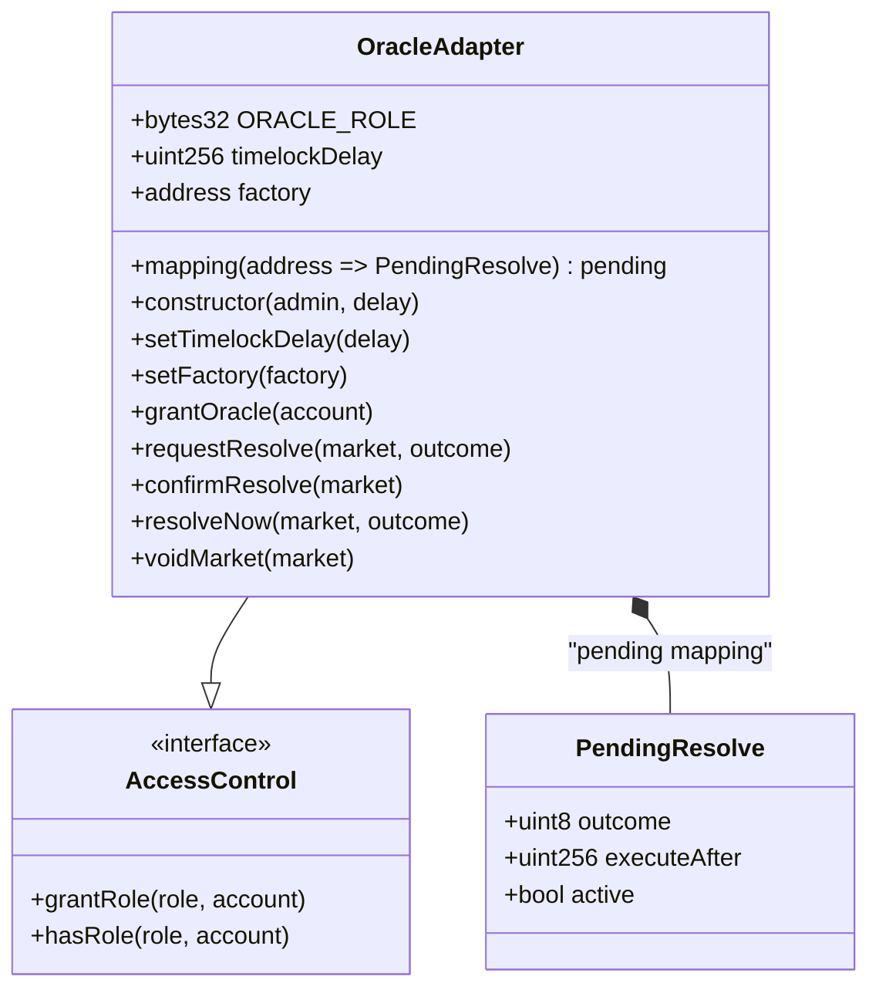
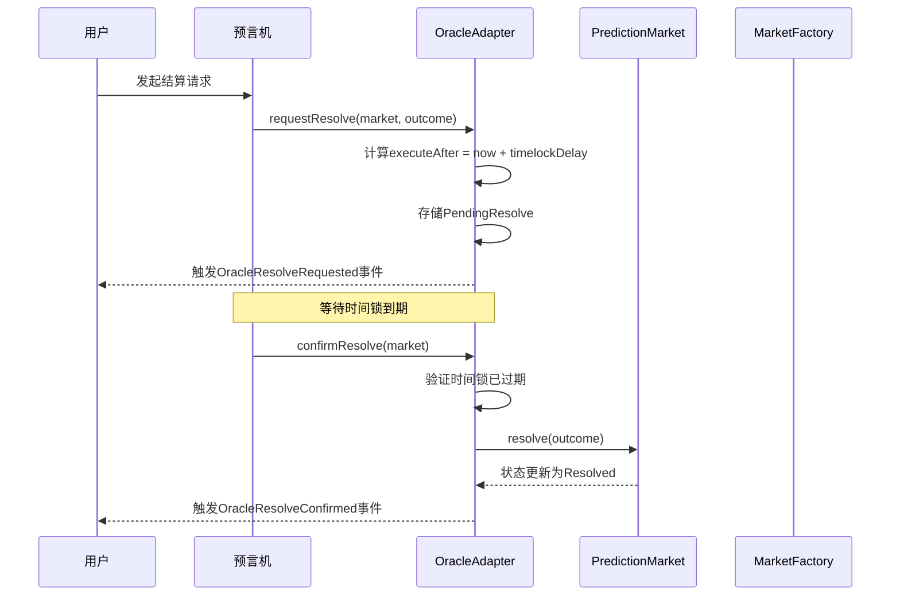
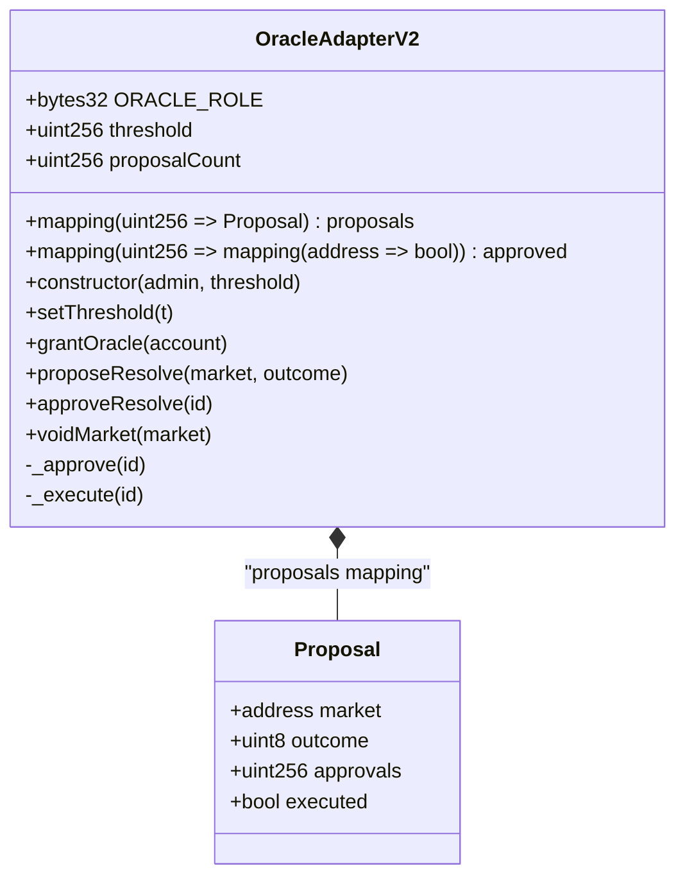
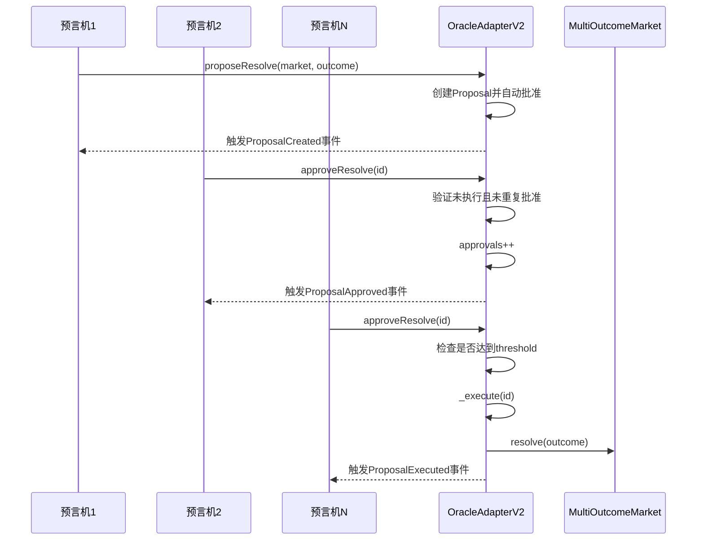
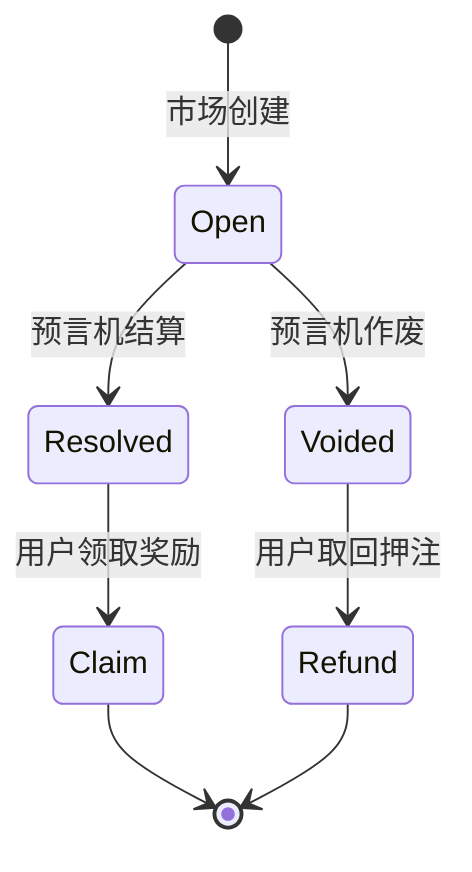
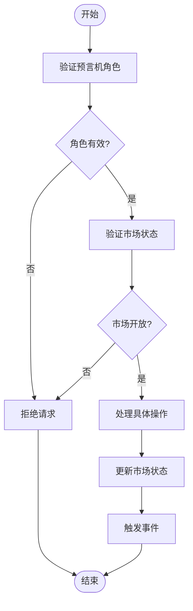

# 预言机集成

<cite>
**本文档引用的文件**
- [OracleAdapter.sol](file://contracts/OracleAdapter.sol)
- [OracleAdapterV2.sol](file://contracts/OracleAdapterV2.sol)
- [MarketFactory.sol](file://contracts/MarketFactory.sol)
- [MarketFactoryV3.sol](file://contracts/MarketFactoryV3.sol)
- [PredictionMarket.sol](file://contracts/PredictionMarket.sol)
- [MultiOutcomeMarket.sol](file://contracts/MultiOutcomeMarket.sol)
- [IPredictionMarket.sol](file://contracts/interfaces/IPredictionMarket.sol)
- [OracleAdapter.test.js](file://test/OracleAdapter.test.js)
- [deploy.js](file://scripts/deploy.js)
- [deploy-phase3.js](file://scripts/deploy-phase3.js)
- [MarketFactory.test.js](file://test/MarketFactory.test.js)
- [Phase3.test.js](file://test/Phase3.test.js)
</cite>

## 目录
1. [简介](#简介)
2. [项目结构](#项目结构)
3. [核心组件](#核心组件)
4. [架构概览](#架构概览)
5. [详细组件分析](#详细组件分析)
6. [依赖关系分析](#依赖关系分析)
7. [性能考虑](#性能考虑)
8. [故障排除指南](#故障排除指南)
9. [结论](#结论)
10. [附录](#附录)

## 简介
本文档深入解析PredictionDIDSimple项目中的预言机集成模块，重点涵盖OracleAdapter和OracleAdapterV2两个核心组件。这两个适配器分别实现了单签时间锁结算机制和多签共识结算机制，为预测市场提供可靠的状态变更能力。

预言机集成模块采用分层架构设计：
- **OracleAdapter**: 实现单签时间锁结算，适用于简单场景
- **OracleAdapterV2**: 实现m-of-n多签共识，提供更高的安全性
- **市场合约**: PredictionMarket和MultiOutcomeMarket处理实际的市场业务逻辑
- **工厂合约**: MarketFactory和MarketFactoryV3负责市场部署和管理

## 项目结构
项目采用按功能模块组织的结构，预言机集成相关的文件分布如下：



**图表来源**
- [OracleAdapter.sol:1-96](file://contracts/OracleAdapter.sol#L1-L96)
- [OracleAdapterV2.sol:1-95](file://contracts/OracleAdapterV2.sol#L1-L95)
- [MarketFactory.sol:1-68](file://contracts/MarketFactory.sol#L1-L68)
- [MarketFactoryV3.sol:1-104](file://contracts/MarketFactoryV3.sol#L1-L104)

**章节来源**
- [OracleAdapter.sol:1-96](file://contracts/OracleAdapter.sol#L1-L96)
- [OracleAdapterV2.sol:1-95](file://contracts/OracleAdapterV2.sol#L1-L95)
- [MarketFactory.sol:1-68](file://contracts/MarketFactory.sol#L1-L68)
- [MarketFactoryV3.sol:1-104](file://contracts/MarketFactoryV3.sol#L1-L104)

## 核心组件
预言机集成模块包含以下关键组件：

### OracleAdapter - 单签时间锁适配器
实现单个预言机的决策机制，通过时间锁确保操作的透明性和可审计性。

### OracleAdapterV2 - 多签共识适配器
实现m-of-n多签共识机制，提高系统的安全性和抗攻击能力。

### 市场合约接口
定义预言机适配器与市场合约之间的交互契约，确保类型安全和功能完整性。

**章节来源**
- [OracleAdapter.sol:9-40](file://contracts/OracleAdapter.sol#L9-L40)
- [OracleAdapterV2.sol:9-38](file://contracts/OracleAdapterV2.sol#L9-L38)
- [IPredictionMarket.sol:7-14](file://contracts/interfaces/IPredictionMarket.sol#L7-L14)

## 架构概览
预言机集成模块采用分层架构，实现了清晰的职责分离和松耦合设计：



**图表来源**
- [OracleAdapter.sol:11](file://contracts/OracleAdapter.sol#L11)
- [OracleAdapterV2.sol:11](file://contracts/OracleAdapterV2.sol#L11)
- [PredictionMarket.sol:11](file://contracts/PredictionMarket.sol#L11)
- [MultiOutcomeMarket.sol:12](file://contracts/MultiOutcomeMarket.sol#L12)
- [MarketFactory.sol:12](file://contracts/MarketFactory.sol#L12)
- [MarketFactoryV3.sol:14](file://contracts/MarketFactoryV3.sol#L14)

## 详细组件分析

### OracleAdapter 组件分析

#### 类结构图


**图表来源**
- [OracleAdapter.sol:11-25](file://contracts/OracleAdapter.sol#L11-L25)

#### 时间锁结算流程序列图


**图表来源**
- [OracleAdapter.sol:57-78](file://contracts/OracleAdapter.sol#L57-L78)
- [PredictionMarket.sol:90-97](file://contracts/PredictionMarket.sol#L90-L97)

#### 关键特性
- **时间锁机制**: 通过`timelockDelay`参数控制操作延迟执行
- **单签权限**: 使用`ORACLE_ROLE`限制只有授权的预言机可以操作
- **状态同步**: 通过事件机制实现状态变更的透明化
- **快速路径**: `resolveNow`函数支持时间锁为0时的即时结算

**章节来源**
- [OracleAdapter.sol:14-15](file://contracts/OracleAdapter.sol#L14-L15)
- [OracleAdapter.sol:57-87](file://contracts/OracleAdapter.sol#L57-L87)

### OracleAdapterV2 组件分析

#### 类结构图


**图表来源**
- [OracleAdapterV2.sol:11-27](file://contracts/OracleAdapterV2.sol#L11-L27)

#### 多签提案流程序列图


**图表来源**
- [OracleAdapterV2.sol:51-86](file://contracts/OracleAdapterV2.sol#L51-L86)
- [MultiOutcomeMarket.sol:84-90](file://contracts/MultiOutcomeMarket.sol#L84-L90)

#### 关键特性
- **多签共识**: 通过`threshold`参数控制需要的批准数量
- **提案管理**: 支持提案的创建、批准和执行生命周期管理
- **状态跟踪**: 完整跟踪每个提案的批准状态和执行状态
- **扩展性**: 支持多结果市场（2-8个结果）

**章节来源**
- [OracleAdapterV2.sol:14-15](file://contracts/OracleAdapterV2.sol#L14-L15)
- [OracleAdapterV2.sol:51-86](file://contracts/OracleAdapterV2.sol#L51-L86)

### 市场合约集成分析

#### 市场状态流转图


**图表来源**
- [PredictionMarket.sol:14-19](file://contracts/PredictionMarket.sol#L14-L19)
- [MultiOutcomeMarket.sol:15-16](file://contracts/MultiOutcomeMarket.sol#L15-L16)

#### 结算流程对比
| 功能 | OracleAdapter | OracleAdapterV2 |
|------|---------------|-----------------|
| 时间锁 | 支持 | 不支持 |
| 多签 | 不支持 | 支持 |
| 结果类型 | 二元(0/1) | 多结果(0-7) |
| 手续费 | 无 | 支持 |
| 最大押注 | 无 | 支持 |
| 初始流动性 | 无 | 支持 |

**章节来源**
- [PredictionMarket.sol:90-104](file://contracts/PredictionMarket.sol#L90-L104)
- [MultiOutcomeMarket.sol:84-97](file://contracts/MultiOutcomeMarket.sol#L84-L97)

## 依赖关系分析

### 组件依赖图
```mermaid
graph LR
subgraph "核心依赖"
AC[AccessControl<br/>@openzeppelin]
IERC20[IERC20<br/>@openzeppelin]
SafeERC20[SafeERC20<br/>@openzeppelin]
end
subgraph "预言机适配器"
OA[OracleAdapter]
OAV2[OracleAdapterV2]
end
subgraph "市场合约"
PM[PredictionMarket]
MOM[MultiOutcomeMarket]
end
subgraph "工厂合约"
MF[MarketFactory]
MFV3[MarketFactoryV3]
end
subgraph "接口"
IPM[IPredictionMarket]
end
AC --> OA
AC --> OAV2
IERC20 --> PM
IERC20 --> MOM
SafeERC20 --> PM
SafeERC20 --> MOM
IPM --> OA
IPM --> OAV2
OA --> PM
OAV2 --> PM
OAV2 --> MOM
MF --> PM
MFV3 --> PM
MFV3 --> MOM
```

**图表来源**
- [OracleAdapter.sol:6](file://contracts/OracleAdapter.sol#L6)
- [OracleAdapterV2.sol:6](file://contracts/OracleAdapterV2.sol#L6)
- [PredictionMarket.sol:6-7](file://contracts/PredictionMarket.sol#L6-L7)
- [MultiOutcomeMarket.sol:6-8](file://contracts/MultiOutcomeMarket.sol#L6-L8)

### 数据流分析
预言机数据流遵循严格的权限控制和状态验证机制：



**图表来源**
- [OracleAdapter.sol:57-78](file://contracts/OracleAdapter.sol#L57-L78)
- [OracleAdapterV2.sol:51-86](file://contracts/OracleAdapterV2.sol#L51-L86)

**章节来源**
- [IPredictionMarket.sol:7-14](file://contracts/interfaces/IPredictionMarket.sol#L7-L14)
- [OracleAdapter.sol:42-50](file://contracts/OracleAdapter.sol#L42-L50)
- [OracleAdapterV2.sol:40-49](file://contracts/OracleAdapterV2.sol#L40-L49)

## 性能考虑
预言机集成模块在设计时充分考虑了性能和安全性平衡：

### 时间复杂度分析
- **OracleAdapter**: 操作复杂度为O(1)，主要涉及状态查询和存储更新
- **OracleAdapterV2**: 提案创建为O(1)，批准检查为O(1)，执行时可能涉及多结果池计算

### 存储优化
- 使用紧凑的数据结构减少存储开销
- 采用映射而非数组存储，避免线性搜索
- 合理的事件设计便于链上查询和索引

### 安全性优化
- 重入攻击防护：MultiOutcomeMarket使用`ReentrancyGuard`
- 权限控制：基于AccessControl的角色管理系统
- 输入验证：严格的参数验证和边界检查

## 故障排除指南

### 常见问题及解决方案

#### 时间锁相关问题
**问题**: `timelock`错误
**原因**: 尝试在时间锁未过期时确认结算
**解决方案**: 等待`timelockDelay`秒后再调用`confirmResolve`

#### 权限相关问题
**问题**: `not oracle`错误  
**原因**: 调用者没有预言机角色权限
**解决方案**: 使用`grantOracle`函数为账户授予预言机角色

#### 市场状态问题
**问题**: `not open`错误
**原因**: 市场已关闭或已结算
**解决方案**: 确保在市场开放状态下进行操作

#### 多签阈值问题
**问题**: 提案无法执行
**原因**: 批准数量未达到阈值
**解决方案**: 确保至少`threshold`个预言机批准

**章节来源**
- [OracleAdapter.test.js:22-27](file://test/OracleAdapter.test.js#L22-L27)
- [OracleAdapter.test.js:29-51](file://test/OracleAdapter.test.js#L29-L51)

### 调试建议
1. **事件监控**: 通过监听相关事件追踪状态变化
2. **状态查询**: 使用`status()`函数检查市场当前状态
3. **权限检查**: 验证账户是否具有相应角色权限
4. **时间验证**: 确认时间锁延迟设置合理

## 结论
预言机集成模块通过OracleAdapter和OracleAdapterV2实现了灵活而安全的预言机服务。单签适配器适合简单场景，多签适配器提供更高的安全性。模块设计遵循最佳实践，包括清晰的权限控制、完整的状态管理和完善的事件机制。

未来改进方向：
- 增加更多的配置参数和治理功能
- 支持更复杂的多签策略
- 优化Gas消耗和用户体验
- 增强监控和审计功能

## 附录

### 配置选项和参数

#### OracleAdapter配置
| 参数 | 类型 | 描述 | 默认值 |
|------|------|------|--------|
| `timelockDelay` | uint256 | 时间锁延迟（秒） | 可配置 |
| `factory` | address | 工厂合约地址 | 可配置 |
| `ORACLE_ROLE` | bytes32 | 预言机角色标识符 | 固定值 |

#### OracleAdapterV2配置
| 参数 | 类型 | 描述 | 默认值 |
|------|------|------|--------|
| `threshold` | uint256 | 多签阈值 | 可配置 |
| `proposalCount` | uint256 | 提案计数器 | 自动递增 |
| `ORACLE_ROLE` | bytes32 | 预言机角色标识符 | 固定值 |

#### 市场合约参数
| 参数 | 类型 | 描述 | 默认值 |
|------|------|------|--------|
| `collateral` | IERC20 | 抵押品代币 | 必需 |
| `oracle` | address | 预言机地址 | 必需 |
| `factory` | address | 工厂合约地址 | 必需 |
| `matchRef` | bytes32 | 比赛引用哈希 | 必需 |
| `question` | string | 预测问题 | 必需 |
| `endTime` | uint256 | 截止时间 | 必需 |

### 使用模式示例

#### 单签时间锁结算流程
```javascript
// 1. 请求结算（启动时间锁）
await adapter.requestResolve(marketAddress, outcome);

// 2. 等待时间锁到期
await time.increase(timelockDelay + 1);

// 3. 确认结算
await adapter.confirmResolve(marketAddress);
```

#### 多签共识结算流程
```javascript
// 1. 创建提案
const proposalId = await adapter.proposeResolve(marketAddress, outcome);

// 2. 多个预言机批准
await adapter.approveResolve(proposalId);
await adapter2.approveResolve(proposalId);
await adapterN.approveResolve(proposalId);

// 3. 自动执行（达到阈值后）
```

### 部署脚本参考
- **阶段2部署**: `scripts/deploy.js` - 部署OracleAdapter和MarketFactory
- **阶段3部署**: `scripts/deploy-phase3.js` - 部署OracleAdapterV2和MarketFactoryV3

**章节来源**
- [deploy.js:8](file://scripts/deploy.js#L8)
- [deploy-phase3.js:8](file://scripts/deploy-phase3.js#L8)
- [MarketFactory.test.js:13-22](file://test/MarketFactory.test.js#L13-L22)