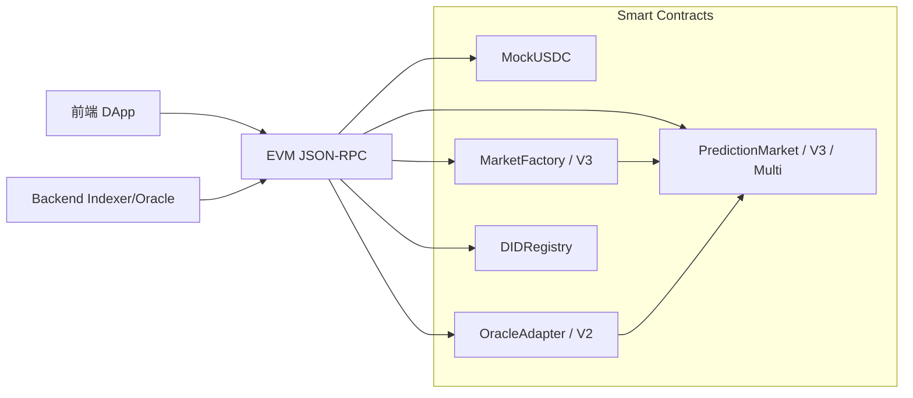

# Contracts 需求规格说明书

| 文档属性 | 内容 |
|---------|------|
| 项目名称 | Prediction DID — 世界杯 Web3 预测市场（Smart Contracts） |
| 文档版本 | 1.0 |
| 适用代码 | `contracts/` 目录（Solidity ^0.8.24，Hardhat） |
| 编写依据 | 源码、`test/`、`scripts/`、`contracts_func.md`、`docs/ARCHITECTURE.md` |

---

## 1. 引言

### 1.1 编写目的

本文档从**已实现合约代码**反推并整理 Smart Contracts 子系统的软件需求规格，供产品、智能合约开发、前端/Backend 联调、审计与测试统一理解链上系统边界、功能范围、状态模型与接口约定。读者无需阅读源码即可把握合约层应「做什么」以及「做到什么程度」。

### 1.2 项目背景

Prediction DID 是一套面向世界杯赛事的去中心化预测市场应用。链上合约负责：

- **资金托管**：用户以 ERC20 抵押代币（MockUSDC / 真实 USDC）参与预测；
- **市场生命周期**：创建、开放下注、结算、作废、领取奖金；
- **预言机接入**：通过 OracleAdapter / OracleAdapterV2 统一结算入口，支持时间锁与多签；
- **身份扩展（可选）**：DIDRegistry 支持钱包与 DID 哈希的链上绑定。

Backend 与前端通过 JSON-RPC 与合约交互；合约**不实现** SIWE、VC 校验、地理合规等业务逻辑，这些由链下服务完成。合约仅保证链上资金与规则不可篡改。

### 1.3 术语与缩略语

| 术语 | 说明 |
|------|------|
| parimutuel | 彩池式预测，按获胜侧池子比例分配总奖池 |
| CPMM | Constant Product Market Maker，恒定乘积做市（Phase 3 二元市场） |
| collateral | 抵押代币，本项目测试环境为 MockUSDC（6 位小数） |
| outcome | 预测结果索引；二元市场 0=Yes、1=No；多结果市场 0..N-1 |
| Oracle | 有权调用 resolve / voidMarket 的链上地址或 Adapter 角色 |
| timelock | 结算提议与确认之间的最小等待时间 |
| m-of-n | 多签阈值，至少 m 个 Oracle 批准才执行结算 |
| LP | Liquidity Provider，流动性提供者（PredictionMarketV3） |
| feeBps | 手续费，以基点表示（1 bps = 0.01%） |

### 1.4 参考文献

- `docs/ARCHITECTURE.md` — 系统整体架构
- `contracts/contracts_func.md` — 合约函数与结构体说明
- `backend/01.需求规格说明书.md` — Backend 需求（链下互补）
- `backend/pkg/contracts/*.json` — 导出 ABI（供 Backend Indexer 使用）

---

## 2. 项目概述

### 2.1 产品定位

Contracts 是 Prediction DID 的**链上核心层**，采用「工厂 + 市场实例 + 预言机适配器」模式，分阶段演进：

| 阶段 | 核心合约 | 市场机制 |
|------|----------|----------|
| Phase 1/2 | MockUSDC、MarketFactory、PredictionMarket、OracleAdapter、DIDRegistry | 二元 parimutuel + 时间锁 Oracle |
| Phase 3 | MarketFactoryV3、PredictionMarketV3、MultiOutcomeMarket、OracleAdapterV2 | CPMM 二元 + 多结果 parimutuel + 多签 Oracle |

核心用户价值路径（链上部分）：

```
运营部署工厂与 Oracle → 创建市场 → 用户 approve + buy
→ Oracle 结算（或 void）→ 用户 claim 奖金/退款
→（可选）用户 bindDid 绑定 DID 哈希
```

### 2.2 目标用户与链上角色

| 角色 | 描述 | 链上权限 |
|------|------|----------|
| 终端用户 | 持有钱包的预测参与者 | buy、claim、add/removeLiquidity（V3）、bindDid |
| 工厂 Owner | 部署方/运营方 | createMarket、setOracle、pause/unpause（V3） |
| Oracle 操作员 | 持有 ORACLE_ROLE 或市场 oracle 地址 | resolve、voidMarket、requestResolve 等 |
| Admin | Adapter DEFAULT_ADMIN_ROLE | 授予 Oracle、调整 timelock/threshold |
| LP（V3） | 流动性提供者 | addLiquidity、removeLiquidity、获得初始 seed LP |

### 2.3 运行环境

| 类别 | 要求 |
|------|------|
| 语言与编译器 | Solidity ^0.8.24；EVM cancun |
| 开发框架 | Hardhat ^2.22；@nomicfoundation/hardhat-toolbox |
| 依赖库 | OpenZeppelin Contracts ^5.0.2（ERC20、AccessControl、Ownable、Pausable、ReentrancyGuard） |
| 目标链 | 任意 EVM 兼容链；本地开发 chainId 31337（Hardhat） |
| Node.js | 运行 compile、test、deploy 脚本 |

---

## 3. 系统边界与总体架构

### 3.1 系统上下文



### 3.2 合约模块职责

| 模块 | 文件 | 职责 |
|------|------|------|
| 抵押代币 | `MockUSDC.sol` | 测试用 6 位小数 ERC20 |
| 市场接口 | `interfaces/IPredictionMarket.sol` | status/resolve/voidMarket 统一接口 |
| 二元彩池市场 | `PredictionMarket.sol` | Phase 2 parimutuel Yes/No |
| 二元 CPMM 市场 | `PredictionMarketV3.sol` | Phase 3 恒定乘积 + LP + 手续费 |
| 多结果市场 | `MultiOutcomeMarket.sol` | 2–8 结果 parimutuel + 手续费 |
| 工厂 Phase 2 | `MarketFactory.sol` | 部署 PredictionMarket |
| 工厂 Phase 3 | `MarketFactoryV3.sol` | 部署 V3 二元 / 多结果市场；可暂停 |
| 预言机 Phase 2 | `OracleAdapter.sol` | 时间锁 request/confirm + resolveNow |
| 预言机 Phase 3 | `OracleAdapterV2.sol` | m-of-n 多签 propose/approve |
| DID 注册 | `DIDRegistry.sol` | 钱包 ↔ DID 哈希链上绑定 |

### 3.3 系统外依赖

| 依赖 | 用途 | 合约层假设 |
|------|------|------------|
| ERC20 抵押代币 | 下注与赔付 | 用户事先 approve；MockUSDC 仅测试 |
| EVM 节点 | 部署与调用 | 提供 block.timestamp、区块日志 |
| Backend Indexer | 索引 Bought/Resolved/Claimed 等事件 | 非合约职责；事件须稳定可索引 |
| Backend Oracle Worker | 自动调用 Adapter 结算 | 需持有 ORACLE_ROLE 私钥 |

### 3.4 阶段共存说明

Phase 2 与 Phase 3 合约**并存**，非升级替换关系：

- `deploy.js` 部署 Phase 2 栈（MockUSDC + OracleAdapter + MarketFactory + DIDRegistry）；
- `deploy-phase3.js` 部署 Phase 3 栈（MockUSDC + OracleAdapterV2 + MarketFactoryV3）；
- Backend Indexer 当前主要索引 `MarketFactory` / `PredictionMarket` 事件；V3 市场需扩展索引逻辑（链下需求，非本合约 SRS 范围）。

---

## 4. 功能需求

以下需求编号格式：**FR-{模块}-{序号}**。

### 4.1 抵押代币（MockUSDC）

| 编号 | 需求描述 | 验收标准 |
|------|----------|----------|
| FR-USDC-01 | 提供标准 ERC20 代币 | 名称 "Mock USDC"、符号 "mUSDC" |
| FR-USDC-02 | 小数位与 USDC 一致 | `decimals()` 返回 6 |
| FR-USDC-03 | 支持测试铸造 | 任意地址可调用 `mint(to, amount)` 增发（**仅测试环境**） |

### 4.2 二元彩池市场（PredictionMarket）

| 编号 | 需求描述 | 验收标准 |
|------|----------|----------|
| FR-PM-01 | 市场创建时绑定不可变参数 | collateral、oracle、factory、matchRef、question、endTime 在 constructor 设定 |
| FR-PM-02 | 创建时 endTime 必须在未来 | `endTime > block.timestamp`，否则 revert |
| FR-PM-03 | 初始状态为 Open | `status == Open` |
| FR-PM-04 | 用户下注 buy | outcome ∈ {0,1}；amount > 0；Open 且未过 endTime；safeTransferFrom 抵押 |
| FR-PM-05 | 下注更新池子与余额 | outcome=0 累加 yesPool/yesBalance；否则 noPool/noBalance |
| FR-PM-06 | 下注发出 Bought 事件 | `(user, outcome, amount)` indexed user |
| FR-PM-07 | 仅 Oracle 可结算 | `resolve(winningOutcome)` 需 msg.sender == oracle |
| FR-PM-08 | 结算后状态为 Resolved | winningOutcome ∈ {0,1}；发出 Resolved 事件 |
| FR-PM-09 | 仅 Oracle 可作废 | `voidMarket()` → status Voided；发出 MarketVoided |
| FR-PM-10 | 用户领取 claim | Resolved：按 parimutuel 公式分配；Voided：退还 yes+no 本金 |
| FR-PM-11 | parimutuel 赔付公式 | `payout = userStake * totalPool / winSideTotal`；无持仓返回 0 |
| FR-PM-12 | 防重复领取 | 同一地址 claimed 后再次 claim revert "already claimed" |
| FR-PM-13 | 输家无法 claim | payout=0 时 revert "nothing to claim" |
| FR-PM-14 | 非 Oracle 不可 resolve | revert "not oracle" |

### 4.3 市场工厂 Phase 2（MarketFactory）

| 编号 | 需求描述 | 验收标准 |
|------|----------|----------|
| FR-FAC-01 | 部署时绑定 collateral 与 oracle | 两者非零地址 |
| FR-FAC-02 | 仅 Owner 可创建市场 | `createMarket(matchRef, question, endTime)` onlyOwner |
| FR-FAC-03 | 创建市场递增 marketCount | 新 marketId = ++marketCount；markets[id] = 地址 |
| FR-FAC-04 | 创建时部署新 PredictionMarket 实例 | 传入 factory 自身地址作为 factory 字段 |
| FR-FAC-05 | 发出 MarketCreated 事件 | 含 marketId、market 地址、matchRef、question、endTime |
| FR-FAC-06 | Owner 可更换 oracle | `setOracle` 更新工厂级 oracle（**不影响已部署市场**的 immutable oracle） |
| FR-FAC-07 | 版本标识 | `version()` 返回 `"2.0.0-phase2"` |

### 4.4 预言机适配器 Phase 2（OracleAdapter）

| 编号 | 需求描述 | 验收标准 |
|------|----------|----------|
| FR-ORA-01 | 基于 AccessControl 角色 | DEFAULT_ADMIN_ROLE、ORACLE_ROLE |
| FR-ORA-02 | 可配置 timelockDelay | Admin 可 setTimelockDelay |
| FR-ORA-03 | 时间锁结算流程 | requestResolve → 等待 executeAfter → confirmResolve → 调用 market.resolve |
| FR-ORA-04 | timelock 未到时不可 confirm | revert "timelock" |
| FR-ORA-05 | timelock=0 快速路径 | resolveNow 直接 resolve；timelock>0 时须用 request+confirm |
| FR-ORA-06 | 仅对 Open 市场操作 | status()==0 校验 |
| FR-ORA-07 | voidMarket | ORACLE_ROLE 调用目标市场 voidMarket；发出 MarketVoided |
| FR-ORA-08 | Admin 授予 Oracle | grantOracle(account) |
| FR-ORA-09 | 发出 OracleResolveRequested / OracleResolveConfirmed | 含 market、outcome、executeAfter |

### 4.5 预言机适配器 Phase 3（OracleAdapterV2）

| 编号 | 需求描述 | 验收标准 |
|------|----------|----------|
| FR-ORA2-01 | m-of-n 多签阈值 | threshold > 0；setThreshold 仅 Admin |
| FR-ORA2-02 | 提议结算 proposeResolve | 创建 Proposal；提议者自动计入一票 approve |
| FR-ORA2-03 | 其他 Oracle 批准 | approveResolve；同一 Oracle 不可重复 approve |
| FR-ORA2-04 | 达阈值自动执行 | approvals >= threshold 时调用 market.resolve |
| FR-ORA2-05 | 支持多结果 outcome | outcome <= 7（兼容 MultiOutcomeMarket） |
| FR-ORA2-06 | voidMarket | 与 OracleAdapter 相同语义 |
| FR-ORA2-07 | 发出 ProposalCreated/Approved/Executed | 可链下审计多签过程 |

### 4.6 二元 CPMM 市场（PredictionMarketV3）

| 编号 | 需求描述 | 验收标准 |
|------|----------|----------|
| FR-V3-01 | 支持 feeBps 与 maxBetPerUser | 构造函数设定；maxBetPerUser=0 表示不限制 |
| FR-V3-02 | 工厂可 seed 初始流动性 | seedReserves 仅 factory 可调用；首次 perSide 两侧储备 |
| FR-V3-03 | CPMM 买入 buy | 扣 fee 后 net 进入 _swap；更新 reserveYes/No；记录 yesBalance/noBalance（份额） |
| FR-V3-04 | 买入改变隐含价格 | 买 Yes 后 priceYesBps > 5000（测试验收） |
| FR-V3-05 | 添加/移除流动性 | addLiquidity 按 50/50 增储备；removeLiquidity 按比例返还 collateral |
| FR-V3-06 | 重入防护 | buy/add/remove/claim 使用 nonReentrant |
| FR-V3-07 | 结算 claim（Resolved） | 按 winning 侧份额占比分配 reserveYes+reserveNo |
| FR-V3-08 | 作废 claim（Voided） | 退还 yesBalance + noBalance（份额面值，非原始投入） |
| FR-V3-09 | 实现 IPredictionMarket.status | 返回 uint8(Open=0, Resolved=1, Voided=2) |
| FR-V3-10 | 池状态查询 getPoolState | 返回 reserveYes、reserveNo、priceYesBps（无储备时 5000） |
| FR-V3-11 | CPMM 交换公式 | 买 Yes：`sharesOut = net * reserveYes / (reserveNo + net)`；买 No 对称 |

### 4.7 多结果市场（MultiOutcomeMarket）

| 编号 | 需求描述 | 验收标准 |
|------|----------|----------|
| FR-MO-01 | 支持 2–8 个结果 | outcomeCount ∈ [2,8]；pool 数组长度一致 |
| FR-MO-02 | 下注扣 fee | net = amount - fee；pool[outcome] 与 stake 累加 net |
| FR-MO-03 | 结算与作废 | 仅 oracle；winningOutcome < outcomeCount |
| FR-MO-04 | Resolved claim | `payout = stake[user][win] * totalPool / pool[win]` |
| FR-MO-05 | Voided claim | 各 outcome stake 之和退还 |
| FR-MO-06 | 重入防护 | buy、claim 使用 nonReentrant |

### 4.8 市场工厂 Phase 3（MarketFactoryV3）

| 编号 | 需求描述 | 验收标准 |
|------|----------|----------|
| FR-FAC3-01 | 继承 Pausable | Owner pause/unpause；创建市场需 whenNotPaused |
| FR-FAC3-02 | 默认 maxBet | defaultMaxBet = 10_000 * 1e6（10000 USDC 单位） |
| FR-FAC3-03 | 创建二元 CPMM 市场 | createBinaryMarket；可选 initialLiquidity 由 Owner 转入并 seed |
| FR-FAC3-04 | 创建多结果市场 | createMultiMarket(matchRef, question, endTime, outcomeCount) |
| FR-FAC3-05 | 记录市场类型 | marketTypes[id]：0=binary v3，1=multi |
| FR-FAC3-06 | 发出 BinaryMarketCreated / MultiMarketCreated | 含 id、market 地址 |
| FR-FAC3-07 | Owner 可配置 defaultFeeBps、oracle | setDefaultFeeBps、setOracle |
| FR-FAC3-08 | 版本标识 | version() 返回 `"3.0.0-phase3"` |

### 4.9 DID 注册（DIDRegistry）

| 编号 | 需求描述 | 验收标准 |
|------|----------|----------|
| FR-DID-01 | 用户绑定 DID 哈希 | bindDid(didHash, signature) |
| FR-DID-02 | 签名验证 | digest = eth_sign(keccak256("BindDID:" + msg.sender + didHash))；signer 须为 msg.sender |
| FR-DID-03 | 空哈希拒绝 | didHash == 0 revert |
| FR-DID-04 | 查询绑定 | resolveDid(account) 返回 didHashOf |
| FR-DID-05 | 发出 DidBound 事件 | (account, didHash) indexed |

### 4.10 部署与运维脚本

| 编号 | 需求描述 | 验收标准 |
|------|----------|----------|
| FR-DEP-01 | Phase 2 本地部署 deploy.js | 部署 MockUSDC、OracleAdapter、DIDRegistry、MarketFactory；写 deployments.local.json |
| FR-DEP-02 | Phase 3 本地部署 deploy-phase3.js | 部署 MockUSDC、OracleAdapterV2、MarketFactoryV3；写 deployments.phase3.json |
| FR-DEP-03 | 种子市场 seed-markets.js | 依赖 deployments.local.json；创建 3 个世界杯示例市场 |
| FR-DEP-04 | 手动结算 resolve.js | 环境变量 MARKET_ADDRESS、WINNING_OUTCOME；Oracle 直接 resolve（绕过 Adapter） |
| FR-DEP-05 | ABI 导出 export-abi.js | 生成 backend/pkg/contracts/*.json |
| FR-DEP-06 | 部署后授予 Oracle 角色 | deploy 脚本 grantOracle(deployer) |
| FR-DEP-07 | Phase 2 关联 factory | adapter.setFactory(factoryAddr) |

---

## 5. 非功能需求

### 5.1 安全

| 编号 | 需求描述 | 指标/说明 |
|------|----------|-----------|
| NFR-SEC-01 | 代币转账安全 | PredictionMarket/V3/Multi 使用 SafeERC20 |
| NFR-SEC-02 | 重入防护 | V3 与 MultiOutcome 关键外部函数 nonReentrant |
| NFR-SEC-03 | 访问控制 | Factory/Adapter 使用 Ownable 或 AccessControl |
| NFR-SEC-04 | Oracle 权限隔离 | 市场 resolve/void 仅 oracle 地址；Adapter 仅 ORACLE_ROLE |
| NFR-SEC-05 | 时间锁防抢跑 | OracleAdapter request/confirm 分离，可观察 pending |
| NFR-SEC-06 | 多签防单点 | OracleAdapterV2 需 threshold 票才 execute |
| NFR-SEC-07 | MockUSDC 无 mint 权限 | **生产不得使用**；真实 USDC 无 mint |
| NFR-SEC-08 | DID 绑定防冒充 | 必须本人签名 digest |

### 5.2 正确性与可验证性

| 编号 | 需求描述 | 指标/说明 |
|------|----------|-----------|
| NFR-COR-01 | 单元测试覆盖核心路径 | `hardhat test` 通过：buy、resolve、claim、void、timelock、multisig、CPMM |
| NFR-COR-02 | 编译优化 | optimizer enabled, runs 200 |
| NFR-COR-03 | 事件可索引 | 关键状态变更均 emit 事件（Bought、Resolved、Claimed、MarketCreated 等） |
| NFR-COR-04 | 接口一致性 | 实现 IPredictionMarket 的合约 status 语义一致：0/1/2 |

### 5.3 可维护性与可升级性

| 编号 | 需求描述 | 指标/说明 |
|------|----------|-----------|
| NFR-MAINT-01 | 市场不可升级 | 每个市场独立合约实例；参数 immutable |
| NFR-MAINT-02 | 工厂 oracle 变更不影响已部署市场 | PredictionMarket oracle 为 immutable |
| NFR-MAINT-03 | 版本字符串 | Factory version() 标识 phase |
| NFR-MAINT-04 | MIT 许可证 | 所有合约 SPDX-License-Identifier: MIT |

### 5.4 性能与 Gas

| 编号 | 需求描述 | 指标/说明 |
|------|----------|-----------|
| NFR-GAS-01 | 编译器优化 | solidity 0.8.24 + optimizer |
| NFR-GAS-02 | MultiOutcome claim 循环 | outcomeCount ≤ 8，循环有界 |

### 5.5 兼容性

| 编号 | 需求描述 | 指标/说明 |
|------|----------|-----------|
| NFR-COMPAT-01 | EVM 版本 | cancun |
| NFR-COMPAT-02 | OpenZeppelin 5.x | AccessControl、Pausable、ReentrancyGuard |
| NFR-COMPAT-03 | Backend ABI 同步 | export-abi 输出与 contracts 编译 artifact 一致 |

---

## 6. 链上数据需求

### 6.1 市场状态机（通用）

```
Open (0) ──resolve──► Resolved (1)
   │
   └──voidMarket──► Voided (2)
```

| 状态 | 含义 | 允许操作 |
|------|------|----------|
| Open | 开放 | buy（及 V3 流动性操作）；Oracle resolve/void |
| Resolved | 已结算 | claim（赢家） |
| Voided | 已作废 | claim（全额退本） |

### 6.2 PredictionMarket 链上状态

| 状态变量 | 类型 | 说明 |
|----------|------|------|
| yesPool / noPool | uint256 | 各侧总押注 |
| yesBalance / noBalance | mapping | 用户各侧押注 |
| claimed | mapping | 是否已领取 |
| winningOutcome | uint8 | 结算结果 |
| matchRef | bytes32 | 关联比赛外部 ID 哈希 |
| endTime | uint256 | 下注截止时间戳 |

### 6.3 PredictionMarketV3 链上状态

| 状态变量 | 类型 | 说明 |
|----------|------|------|
| reserveYes / reserveNo | uint256 | CPMM 储备 |
| yesBalance / noBalance | mapping | 用户持有份额（非原始 token 量） |
| lpBalance / totalLPSupply | uint256 | LP 代币记账 |
| collectedFees | uint256 | 累计手续费（留在合约内） |
| userBetTotal | mapping | 用户累计下注（maxBet 限制） |
| feeBps | uint16 | 手续费基点 |
| maxBetPerUser | uint256 | 单用户上限；0=不限 |

### 6.4 MultiOutcomeMarket 链上状态

| 状态变量 | 类型 | 说明 |
|----------|------|------|
| pool[] | uint256[] | 各 outcome 池子（扣费后） |
| stake[user][outcome] | mapping | 用户各 outcome 押注 |
| outcomeCount | uint8 | 2–8 |
| feeBps | uint16 | 手续费 |

### 6.5 OracleAdapter 待结算状态

| 字段 | 说明 |
|------|------|
| pending[market].outcome | 提议结果 |
| pending[market].executeAfter | 可 confirm 的时间戳 |
| pending[market].active | 是否有待处理提议 |

### 6.6 OracleAdapterV2 提案状态

| 字段 | 说明 |
|------|------|
| proposals[id].market / outcome | 目标与结果 |
| proposals[id].approvals | 当前批准数 |
| proposals[id].executed | 是否已执行 |
| approved[id][oracle] | 防重复投票 |

### 6.7 DIDRegistry 状态

| 字段 | 说明 |
|------|------|
| didHashOf[address] | 钱包 → DID 内容哈希（非完整 DID 文档） |

---

## 7. 接口需求

### 7.1 对外函数一览（按合约）

#### 7.1.1 MockUSDC

| 函数 | 调用方 | 说明 |
|------|--------|------|
| mint(to, amount) | 任意 | 测试增发 |
| transfer / transferFrom / approve | 用户/市场 | 标准 ERC20 |

#### 7.1.2 PredictionMarket

| 函数 | 调用方 | 说明 |
|------|--------|------|
| buy(outcome, amount) | 用户 | 下注 |
| resolve(winningOutcome) | oracle | 结算 |
| voidMarket() | oracle | 作废 |
| claim() | 用户 | 领取 |

#### 7.1.3 MarketFactory

| 函数 | 调用方 | 说明 |
|------|--------|------|
| createMarket(matchRef, question, endTime) | Owner | 创建市场 |
| setOracle(address) | Owner | 更新工厂 oracle |
| markets(id) / marketCount() | 只读 | 查询 |

#### 7.1.4 OracleAdapter

| 函数 | 调用方 | 说明 |
|------|--------|------|
| requestResolve(market, outcome) | ORACLE_ROLE | 提议结算 |
| confirmResolve(market) | ORACLE_ROLE | 确认结算 |
| resolveNow(market, outcome) | ORACLE_ROLE | timelock=0 时直接结算 |
| voidMarket(market) | ORACLE_ROLE | 作废 |
| grantOracle / setTimelockDelay | ADMIN | 管理 |

#### 7.1.5 OracleAdapterV2

| 函数 | 调用方 | 说明 |
|------|--------|------|
| proposeResolve(market, outcome) | ORACLE_ROLE | 创建并自批一票 |
| approveResolve(id) | ORACLE_ROLE | 追加批准 |
| voidMarket(market) | ORACLE_ROLE | 作废 |
| setThreshold / grantOracle | ADMIN | 管理 |

#### 7.1.6 PredictionMarketV3

| 函数 | 调用方 | 说明 |
|------|--------|------|
| buy(outcome, amountIn) | 用户 | CPMM 买入 |
| addLiquidity(amount) | LP | 添加流动性 |
| removeLiquidity(lpAmount) | LP | 移除流动性 |
| seedReserves(perSide, lpRecipient) | factory | 初始 seed |
| resolve / voidMarket | oracle | 结算/作废 |
| claim() | 用户 | 领取 |
| getPoolState() | 只读 | 池快照 |

#### 7.1.7 MultiOutcomeMarket

| 函数 | 调用方 | 说明 |
|------|--------|------|
| buy(outcome, amount) | 用户 | 下注 |
| resolve / voidMarket | oracle | 结算/作废 |
| claim() | 用户 | 领取 |
| status() | 只读 | 状态 |

#### 7.1.8 MarketFactoryV3

| 函数 | 调用方 | 说明 |
|------|--------|------|
| createBinaryMarket(...) | Owner | 创建 CPMM 二元市场 |
| createMultiMarket(...) | Owner | 创建多结果市场 |
| pause / unpause | Owner | 暂停/恢复创建 |
| setOracle / setDefaultFeeBps | Owner | 配置 |

#### 7.1.9 DIDRegistry

| 函数 | 调用方 | 说明 |
|------|--------|------|
| bindDid(didHash, signature) | 用户 | 绑定 |
| resolveDid(account) | 只读 | 查询 |

### 7.2 事件需求（Indexer 依赖）

| 合约 | 事件 | 索引字段 | Backend 用途 |
|------|------|----------|--------------|
| MarketFactory | MarketCreated | marketId, market, matchRef | 创建 markets 记录 |
| PredictionMarket | Bought | user, outcome, amount | trades + positions |
| PredictionMarket | Resolved | winningOutcome | 更新 market 状态 |
| PredictionMarket | Claimed | user, amount | positions.claimed |
| PredictionMarket | MarketVoided | — | market VOID |
| MarketFactoryV3 | BinaryMarketCreated / MultiMarketCreated | id, market | V3 索引（待扩展） |
| OracleAdapter | OracleResolveRequested/Confirmed | market, outcome | 审计 |
| DIDRegistry | DidBound | account, didHash | 可选索引 |

### 7.3 IPredictionMarket 接口契约

| 方法 | 返回值/效果 |
|------|-------------|
| status() | uint8：0 Open，1 Resolved，2 Voided |
| resolve(uint8) | 状态 → Resolved |
| voidMarket() | 状态 → Voided |

**实现合约**：PredictionMarket（隐式，无 status 函数但 enum 可 cast）、PredictionMarketV3、MultiOutcomeMarket。

---

## 8. 部署与配置需求

### 8.1 Hardhat 配置

| 配置项 | 值 |
|--------|-----|
| solidity | 0.8.24, optimizer runs 200, evmVersion cancun |
| networks.hardhat.chainId | 31337 |
| networks.localhost | http://127.0.0.1:8545 |

### 8.2 npm 脚本

| 脚本 | 命令 | 说明 |
|------|------|------|
| compile | hardhat compile | 编译合约 |
| test | hardhat test | 运行测试 |
| deploy:local | deploy.js --network localhost | Phase 2 部署 |
| seed:local | seed-markets.js | 示例市场 |
| resolve:local | resolve.js | 手动结算 |
| coverage | hardhat coverage | 覆盖率 |
| export-abi | export-abi.js | 导出 ABI |

### 8.3 部署环境变量

| 变量 | 脚本 | 默认 | 说明 |
|------|------|------|------|
| ORACLE_TIMELOCK_SECONDS | deploy.js | 120 | OracleAdapter timelock |
| ORACLE_MULTISIG_THRESHOLD | deploy-phase3.js | 2 | OracleAdapterV2 threshold |
| DEFAULT_FEE_BPS | deploy-phase3.js | 30 | MarketFactoryV3 默认费率 |
| MARKET_ADDRESS | resolve.js | — | 手动结算目标 |
| WINNING_OUTCOME | resolve.js | — | 0 或 1 |

### 8.4 部署产物

| 文件 | 内容 |
|------|------|
| deployments.local.json | mockUSDC、oracleAdapter、didRegistry、marketFactory、chainId、timelock |
| deployments.phase3.json | mockUSDC、oracleAdapterV2、marketFactoryV3、multisigThreshold、defaultFeeBps |
| backend/pkg/contracts/*.json | ABI + bytecode 片段供 Go 绑定 |

---

## 9. 约束与假设

### 9.1 业务约束

| 编号 | 约束 |
|------|------|
| C-01 | 二元市场 outcome 仅为 0（Yes）或 1（No） |
| C-02 | 多结果市场 outcomeCount 上限 8 |
| C-03 | 用户须在 buy 前对 market 合约 approve 足够 collateral |
| C-04 | Oracle 地址在 Market 创建时固定，Factory 后续 setOracle 不改变已有市场 |
| C-05 | Phase 3 MultiOutcome 的 fee 留在合约内，无单独 withdraw 接口 |
| C-06 | PredictionMarketV3 Voided claim 按份额和退还，非原始投入 token 量 |
| C-07 | DIDRegistry 仅存哈希，不验证 DID 文档内容或 VC |

### 9.2 技术假设

| 编号 | 假设 |
|------|------|
| A-01 | block.timestamp 由矿工/验证者提供，存在轻微操纵可能（标准 EVM 假设） |
| A-02 | 测试环境使用 MockUSDC 无权限 mint |
| A-03 | Backend Oracle Worker 持有 ORACLE_ROLE 私钥并负责自动结算 |
| A-04 | matchRef 通常为 `keccak256(external_id)`，由运营/脚本约定 |
| A-05 | 生产环境应使用真实 USDC 与审计过的 Oracle 多签流程 |

### 9.3 已知限制（实现现状）

| 编号 | 限制 | 影响 |
|------|------|------|
| L-01 | MarketFactory 新市场的 oracle 取自创建时工厂 oracle，非实时读取 | 部署顺序：先 setOracle 再 createMarket |
| L-02 | PredictionMarket 无 status() 公开函数 | Adapter 通过 IPredictionMarket.status；PM 需 Backend 直接读 enum |
| L-03 | Backend Indexer 未完整覆盖 V3/Multi 事件 | V3 市场链下镜像需扩展 |
| L-04 | collectedFees / parimutuel fee 无 Owner 提取函数 | 费用永久留存在市场合约 |
| L-05 | resolve.js 绕过 Adapter 直接调 market.resolve | 仅 dev 调试；生产应走 Adapter |

---

## 10. 验收标准

### 10.1 自动化测试验收

执行 `npm test`（`hardhat test`）应全部通过，覆盖：

| 测试文件 | 覆盖需求 |
|----------|----------|
| PredictionMarket.test.js | FR-PM-04~14：buy、resolve、claim、double claim、权限 |
| MarketFactory.test.js | FR-FAC-02~05：创建市场与事件 |
| OracleAdapter.test.js | FR-ORA-03~07：timelock、void 退款 |
| Phase3.test.js | FR-V3-04、FR-MO-04、FR-ORA2-04：CPMM 价格、多结果 claim、multisig threshold |

### 10.2 编译验收

- `npm run compile` 无错误；
- 生成 `artifacts/contracts/**/*.json`。

### 10.3 部署验收

- `deploy:local` 生成有效 `deployments.local.json`，各地址非零；
- `seed:local` 后 `marketCount >= 3`；
- Adapter 已对 deployer grantOracle。

### 10.4 安全验收（建议）

| 项 | 说明 |
|----|------|
| 重入 | V3/Multi claim/buy 路径有 nonReentrant |
| 权限 | 非 oracle/非 owner 调用受限函数 revert |
| 整数 | Solidity 0.8 内置溢出检查 |
| 外部调用 | SafeERC20 处理非标准 ERC20 |

---

## 11. 需求追溯矩阵

| 需求类别 | 主要实现文件 |
|----------|--------------|
| FR-USDC-* | MockUSDC.sol |
| FR-PM-* | PredictionMarket.sol |
| FR-FAC-* | MarketFactory.sol |
| FR-ORA-* | OracleAdapter.sol |
| FR-ORA2-* | OracleAdapterV2.sol |
| FR-V3-* | PredictionMarketV3.sol |
| FR-MO-* | MultiOutcomeMarket.sol |
| FR-FAC3-* | MarketFactoryV3.sol |
| FR-DID-* | DIDRegistry.sol |
| FR-DEP-* | scripts/*.js |
| NFR-SEC/COR | OpenZeppelin 库 + test/ |

---

## 12. 附录

### 12.1 合约文件清单

| 文件 | 行数级 | 说明 |
|------|--------|------|
| contracts/MockUSDC.sol | ~17 | 测试代币 |
| contracts/interfaces/IPredictionMarket.sol | ~8 | 接口 |
| contracts/PredictionMarket.sol | ~133 | Phase 2 二元彩池 |
| contracts/MarketFactory.sol | ~59 | Phase 2 工厂 |
| contracts/OracleAdapter.sol | ~82 | 时间锁 Oracle |
| contracts/OracleAdapterV2.sol | ~82 | 多签 Oracle |
| contracts/PredictionMarketV3.sol | ~199 | CPMM 二元 |
| contracts/MultiOutcomeMarket.sol | ~112 | 多结果彩池 |
| contracts/MarketFactoryV3.sol | ~93 | Phase 3 工厂 |
| contracts/DIDRegistry.sol | ~32 | DID 绑定 |

### 12.2 与 Backend 的接口对齐

| 链上能力 | Backend 配置/模块 |
|----------|-------------------|
| MarketFactory 地址 | MARKET_FACTORY_ADDRESS |
| OracleAdapter | ORACLE_ADAPTER_ADDRESS + ORACLE_PRIVATE_KEY |
| MockUSDC | MOCK_USDC_ADDRESS |
| MarketCreated / Bought 等 | internal/indexer |
| requestResolve / confirmResolve | internal/blockchain OracleClient |
| ABI JSON | backend/pkg/contracts/ |

### 12.3 文档修订记录

| 版本 | 日期 | 说明 |
|------|------|------|
| 1.0 | 2026-07-17 | 初版，基于当前 contracts 源码 |

### 12.4 相关文档

| 文档 | 路径 |
|------|------|
| Backend 需求规格 | backend/01.需求规格说明书.md |
| Backend 概要设计 | backend/02.概要设计.md |
| 合约函数说明 | contracts/contracts_func.md |
| 系统架构 | docs/ARCHITECTURE.md |

---

**文档结束**
