# Contracts 概要设计说明书

| 文档属性 | 内容 |
|---------|------|
| 项目名称 | Prediction DID — 世界杯 Web3 预测市场（Smart Contracts） |
| 文档版本 | 1.0 |
| 前置文档 | `contracts/01.需求规格说明书.md` |
| 适用代码 | `contracts/` 目录（Solidity ^0.8.24，Hardhat） |
| 详细实现参考 | `contracts/contracts_func.md`、`docs/ARCHITECTURE.md` |

---

## 1. 引言

### 1.1 编写目的

本文档描述 Smart Contracts 子系统的**概要设计**：在需求规格说明书（01 文档）所定义的功能与非功能需求基础上，给出合约架构、模块划分、链上数据模型、接口与跨合约交互、关键流程、安全与部署方案，作为详细设计与审计的统一蓝图。

### 1.2 设计目标

| 目标 | 设计对策 |
|------|----------|
| 资金与规则链上可验证 | 抵押代币托管在市场合约；结算/作废仅 Oracle 可触发 |
| 机制可演进 | Phase 2 parimutuel 与 Phase 3 CPMM/多结果**并存**，非代理升级 |
| 预言机可治理 | OracleAdapter 时间锁 + OracleAdapterV2 m-of-n 多签 |
| 工厂标准化创建 | MarketFactory / MarketFactoryV3 统一部署与事件索引入口 |
| 链下可集成 | 稳定事件（Bought/Resolved/Claimed/MarketCreated）；ABI 导出至 Backend/Frontend |
| 开发/生产路径清晰 | Hardhat 本地链 + deploy 脚本；测试网/主网替换 MockUSDC |

### 1.3 设计原则

1. **最小化链上逻辑**：合规、VC、赛程数据在链下；链上只做资金与预测规则。
2. **实例隔离**：每个市场独立合约；immutable 参数防篡改；无透明代理升级。
3. **接口统一**：Oracle 通过 `IPredictionMarket` 调用 resolve/void；status 语义一致（0/1/2）。
4. **安全基线**：OpenZeppelin SafeERC20、ReentrancyGuard、AccessControl/Ownable。
5. **事件优先**：状态变更必 emit，供 Indexer 与审计；view 函数辅助前端读池状态。
6. **测试驱动验收**：核心路径均有 Hardhat 单测；部署脚本与 seed 可复现演示环境。

---

## 2. 系统总体设计

### 2.1 逻辑架构

Contracts 在 Prediction DID 整体架构中处于**链上协议层**，向上被前端 DApp 与 Backend 通过 JSON-RPC 调用，向下依赖 EVM 与 ERC20 抵押代币。

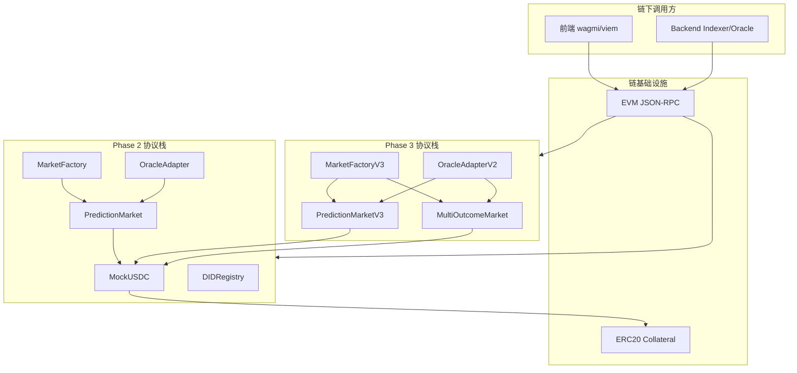

### 2.2 部署架构（双栈并存）

Phase 2 与 Phase 3 **独立部署**，无链上升级迁移；运营可按环境选择主栈。

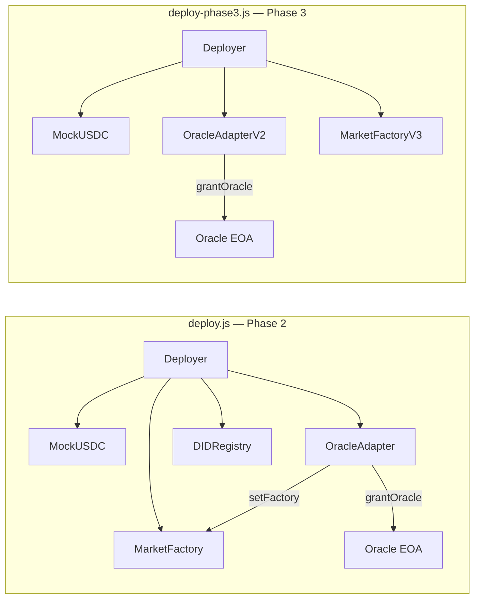

| 部署单元 | 脚本 | 产出 | 典型用途 |
|----------|------|------|----------|
| Phase 2 栈 | `scripts/deploy.js` | `deployments.local.json` | 当前 Backend Indexer 主索引目标 |
| Phase 3 栈 | `scripts/deploy-phase3.js` | `deployments.phase3.json` | CPMM / 多结果 / 多签 Oracle |
| 示例市场 | `scripts/seed-markets.js` | 链上 3 个 PredictionMarket | 本地演示 |
| ABI 同步 | `scripts/export-abi.js` | `backend/pkg/contracts/`、`frontend/src/abis/` | 链下绑定 |

**开发环境常见组合**：Hardhat node（31337）→ deploy:local → seed:local → Backend 指向 factory/adapter 地址。

### 2.3 技术选型

| 类别 | 选型 | 用途 |
|------|------|------|
| 语言 | Solidity ^0.8.24 | 智能合约 |
| EVM | cancun | hardhat.config.js |
| 框架 | Hardhat ^2.22 | 编译、测试、部署 |
| 工具箱 | @nomicfoundation/hardhat-toolbox | ethers、chai、network helpers |
| 标准库 | OpenZeppelin Contracts ^5.0.2 | ERC20、Ownable、AccessControl、Pausable、ReentrancyGuard、ECDSA |
| 测试 | hardhat test + solidity-coverage | 单元测试与覆盖率 |
| 优化 | optimizer enabled, runs 200 | 部署 Gas |

### 2.4 与 Backend / Frontend 边界

| 职责 | Contracts | Backend | Frontend |
|------|-----------|---------|----------|
| 下注资金 | buy + ERC20 transferFrom | Indexer 镜像 trades/positions | 发起 approve + buy 交易 |
| 结算 | resolve / voidMarket | Oracle Worker 调 Adapter | 只读展示 |
| 领取 | claim | Indexer 更新 claimed | 发起 claim 交易 |
| 合规/VC | 无 | API 门禁 | 展示 access |
| DID 完整文档 | 仅 didHash 绑定 | users.did 字段 | bindDid 可选 |

---

## 3. 模块设计

### 3.1 目录结构

```
contracts/
├── contracts/                    # Solidity 源码
│   ├── interfaces/
│   │   └── IPredictionMarket.sol # Oracle 统一接口
│   ├── MockUSDC.sol
│   ├── PredictionMarket.sol      # Phase 2 二元 parimutuel
│   ├── MarketFactory.sol
│   ├── OracleAdapter.sol
│   ├── DIDRegistry.sol
│   ├── PredictionMarketV3.sol    # Phase 3 CPMM 二元
│   ├── MultiOutcomeMarket.sol    # Phase 3 多结果 parimutuel
│   ├── MarketFactoryV3.sol
│   └── OracleAdapterV2.sol
├── scripts/
│   ├── deploy.js                 # Phase 2 部署
│   ├── deploy-phase3.js          # Phase 3 部署
│   ├── seed-markets.js           # 种子市场
│   ├── resolve.js                # 手动结算（dev）
│   └── export-abi.js             # ABI 导出
├── test/                         # Hardhat 测试
├── hardhat.config.js
├── artifacts/                    # 编译产物
└── deployments.*.json            # 部署地址记录
```

### 3.2 模块总览与依赖

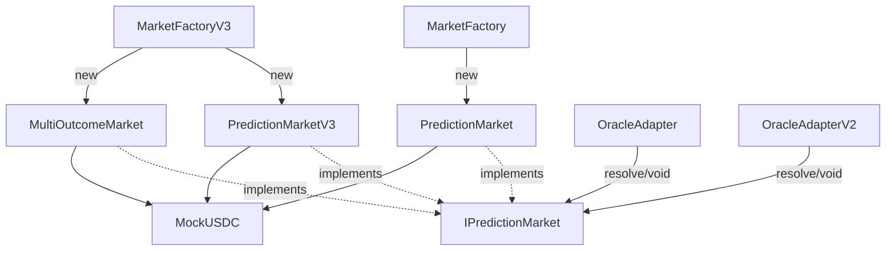

| 模块 | 继承/依赖 | 实例化方式 |
|------|-----------|------------|
| MockUSDC | OZ ERC20 | 部署一次，全局抵押 |
| MarketFactory | Ownable | 单例；createMarket → new PredictionMarket |
| MarketFactoryV3 | Ownable, Pausable | 单例；createBinaryMarket / createMultiMarket |
| PredictionMarket | SafeERC20 | 每市场一实例；constructor 注入 oracle |
| PredictionMarketV3 | SafeERC20, ReentrancyGuard | 每市场一实例；factory seed 流动性 |
| MultiOutcomeMarket | SafeERC20, ReentrancyGuard | 每市场一实例 |
| OracleAdapter | AccessControl | 单例；多市场共享 |
| OracleAdapterV2 | AccessControl | 单例；多市场共享 |
| DIDRegistry | Ownable, ECDSA | 单例；与用户市场无关 |

### 3.3 抵押代币（MockUSDC）

- **职责**：测试环境 ERC20 抵押；6 位小数对齐 USDC。
- **设计要点**：
  - `mint` 无权限 → **仅限本地/测试**；
  - 生产应替换为真实 USDC（无 mint）或规范化的 Testnet Faucet 流程。
- **交互方**：用户 approve → 市场 `safeTransferFrom`；claim 时 `safeTransfer` 返还。

### 3.4 二元彩池市场（PredictionMarket）— Phase 2

- **职责**：Yes(0)/No(1) parimutuel；托管 collateral；Oracle 结算；用户 claim。
- **核心状态**：

| 变量 | 可变性 | 说明 |
|------|--------|------|
| collateral, oracle, factory, matchRef | immutable | 部署后不可改 |
| question, endTime | 部署时设定 | 公开元数据 |
| yesPool, noPool | 随 buy 变 | 彩池总量 |
| yesBalance, noBalance | mapping | 用户各侧押注 |
| status, winningOutcome | Oracle 写 | Open/Resolved/Voided |

- **关键设计**：
  - `buy`：Open 且 `block.timestamp < endTime`；outcome 0/1 分流累池；
  - `_payoutResolved`：`(userStake * totalPool) / winSideTotal`；
  - Voided claim：退还 yes+no 本金；
  - **无** `status()` 公开函数（enum 可读）；Adapter 通过接口调用时需实现合约暴露 status（PredictionMarket 未实现 IPredictionMarket.status，Adapter 依赖接口 — 实际上 OracleAdapter calls IPredictionMarket(market).status() - PredictionMarket doesn't implement status()! Let me check...

Looking at PredictionMarket.sol - it does NOT have a status() function. But OracleAdapter calls:
```
require(IPredictionMarket(market).status() == 0, "not open");
```

This would fail for PredictionMarket unless there's something... PredictionMarket has `Status public status` which generates a getter `status()` but returns enum not uint8. In Solidity, public enum generates getter returning uint8 equivalent. So it works!

- **权限**：`onlyOracle` modifier 限制 resolve/voidMarket。

### 3.5 市场工厂 Phase 2（MarketFactory）

- **职责**：Owner 创建 PredictionMarket；维护 `markets[marketId]` 索引。
- **设计要点**：
  - `createMarket` 使用**当前** `oracle` 地址传入新市场（immutable）；
  - `setOracle` 仅影响**之后**创建的市场；
  - `MarketCreated` 事件为 Indexer 主入口（含 matchRef indexed）。
- **版本**：`version()` → `"2.0.0-phase2"`。

### 3.6 预言机适配器 Phase 2（OracleAdapter）

- **职责**：在 Oracle 与市场之间增加**时间锁**与**角色门控**。
- **核心结构**：

```
PendingResolve pending[market] = { outcome, executeAfter, active }
```

- **结算路径**：

| timelockDelay | 路径 |
|---------------|------|
| > 0 | requestResolve → 等待 → confirmResolve → market.resolve |
| == 0 | resolveNow → market.resolve（禁止 request+confirm 混用） |

- **角色**：`DEFAULT_ADMIN_ROLE` 管理 timelock/factory/grantOracle；`ORACLE_ROLE` 结算与 void。
- **与 Backend 对齐**：OracleClient 封装 requestResolve / confirmResolve / resolveNow / voidMarket。

### 3.7 二元 CPMM 市场（PredictionMarketV3）— Phase 3

- **职责**：恒定乘积做市；手续费；LP；单用户 maxBet 限制。
- **储备模型**：

```
买 Yes: sharesOut = net * reserveYes / (reserveNo + net)
      reserveNo += net; reserveYes -= sharesOut

买 No:  对称
```

- **价格**：`priceYesBps = reserveNo * 10000 / (reserveYes + reserveNo)`（无储备时 5000）。
- **claim（Resolved）**：赢家按份额占比分 `reserveYes + reserveNo`；
- **claim（Voided）**：退还 `yesBalance + noBalance`（份额面值，非原始投入）。
- **seedReserves**：仅 factory 在 `totalLPSupply == 0` 时可调用；MarketFactoryV3 负责 transfer collateral 后 seed。
- **安全**：buy / liquidity / claim 均 `nonReentrant`。

### 3.8 多结果市场（MultiOutcomeMarket）— Phase 3

- **职责**：2–8  outcome parimutuel；fee 扣在 buy 时留在合约。
- **状态**：`pool[]` + `stake[user][outcome]`；
- **claim（Resolved）**：`(stake[user][win] * totalPool) / pool[win]`；
- **无 factory 字段**：比 V3 二元市场少 factory immutable（MultiOutcome 无 seed/LP）。

### 3.9 市场工厂 Phase 3（MarketFactoryV3）

- **职责**：创建 CPMM 二元或多结果市场；全局 pause；默认 fee/maxBet。
- **createBinaryMarket 流程**：

```
Owner 可选 transferFrom(initialLiquidity * 2)
  → new PredictionMarketV3
  → transfer collateral 到 market
  → market.seedReserves(initialLiquidity, Owner)
  → marketTypes[id] = 0
```

- **createMultiMarket**：直接 new MultiOutcomeMarket；`marketTypes[id] = 1`。
- **默认**：`defaultMaxBet = 10_000 * 1e6`；`defaultFeeBps` 构造时设定。

### 3.10 预言机适配器 Phase 3（OracleAdapterV2）

- **职责**：m-of-n 多签结算；无时间锁（与时间锁 Adapter 互补）。
- **提案状态机**：

```
proposeResolve → ProposalCreated（提议者自批 1 票）
  → approveResolve × (threshold - 1)
  → _execute → market.resolve
```

- **outcome 上限**：≤ 7（兼容 8 outcome 市场 index 0–7）。
- **voidMarket**：单 Oracle 可直接 void（无多签）。

### 3.11 DID 注册（DIDRegistry）

- **职责**：可选链上绑定 `address → didHash`。
- **签名消息**：`keccak256("BindDID:" + msg.sender + didHash)` → eth_sign → recover。
- **与 Backend 关系**：Backend bind-did 走链下 DID 字符串；Registry 为链上增强，MVP 非强依赖。

### 3.12 接口层（IPredictionMarket）

- **职责**：Oracle Adapter 面向市场的**唯一写入接口**（resolve/void/status）。
- **实现者**：PredictionMarketV3、MultiOutcomeMarket；PredictionMarket 通过 public enum getter 兼容 status 调用，但未 explicit implement interface。

| 方法 | 语义 |
|------|------|
| status() | 0 Open, 1 Resolved, 2 Voided |
| resolve(uint8) | → Resolved |
| voidMarket() | → Voided |

---

## 4. 数据设计

### 4.1 合约间关系（概念）

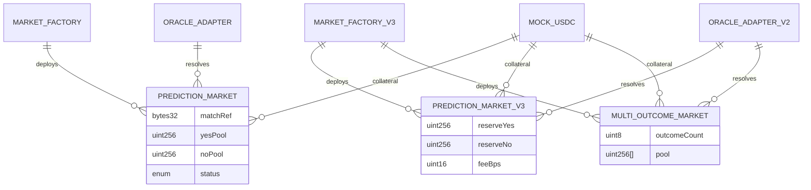

### 4.2 市场生命周期状态机（通用）

```
                    resolve(outcome)
         ┌──────────────────────────────┐
         ▼                              │
      ┌──────┐   voidMarket()      ┌─────────┐
      │ Open │ ──────────────────► │ Voided  │
      └──┬───┘                     └────┬────┘
         │                              │
         │ resolve                      │ claim: 退本
         ▼                              │
    ┌──────────┐                         │
    │ Resolved │                         │
    └────┬─────┘                         │
         │ claim: 按规则分配              │
         └────────────────────────────────┘
```

| 状态 | 值 | buy | resolve/void | claim |
|------|-----|-----|--------------|-------|
| Open | 0 | ✓ | Oracle | ✗ |
| Resolved | 1 | ✗ | ✗ | ✓ 赢家 |
| Voided | 2 | ✗ | ✗ | ✓ 退本 |

### 4.3 OracleAdapter 待结算状态

```
idle ──requestResolve──► pending(active=true)
                              │
                    confirmResolve (timestamp >= executeAfter)
                              │
                              ▼
                         market Resolved
```

| 字段 | 说明 |
|------|------|
| outcome | 提议获胜 outcome |
| executeAfter | block.timestamp + timelockDelay |
| active | 是否有未确认提议 |

**设计决策**：每 market 仅一个 pending slot；新 request 覆盖旧 pending（未在代码中禁止覆盖，运营应避免重复 request）。

### 4.4 OracleAdapterV2 提案状态

```
Created (approvals=1) ──approve──► ... ──approvals>=threshold──► Executed
```

| 字段 | 说明 |
|------|------|
| proposals[id].executed | 防重复执行 |
| approved[id][oracle] | 防重复投票 |

### 4.5 matchRef 编码约定

| 场景 | matchRef 值 | 消费者 |
|------|-------------|--------|
| 世界杯 external_id | `keccak256("wc-2026-semi-001")` 等 | seed-markets.js、Backend Indexer 硬编码映射 |
| 未知赛事 | `bytes32` hex 原样 | Indexer 以 hex 作 external_id |

### 4.6 金额与精度

| 项 | 设计 |
|----|------|
| 代币精度 | 6 decimals（MockUSDC） |
| 链上金额类型 | uint256 最小单位 |
| feeBps | 万分比；`fee = amount * feeBps / 10000` |
| 整数除法 | parimutuel/CPMM claim 截断余数留合约（dust） |

---

## 5. 接口设计

### 5.1 对外调用架构

```
用户 / Backend Oracle
        │
        ▼
   [ERC20 approve]
        │
        ▼
┌───────────────────┐     ┌─────────────────┐
│ MarketFactory(V3) │────►│ Market 实例      │
└───────────────────┘     │  buy / claim    │
        │                 └────────┬────────┘
        │                          │
        ▼                          ▼
┌───────────────────┐     ┌─────────────────┐
│ OracleAdapter(V2) │────►│ resolve / void  │
└───────────────────┘     └─────────────────┘
        │
        ▼
   emit Events → Indexer / 前端 logs
```

### 5.2 用户接口（Phase 2 PredictionMarket）

| 函数 | 前置条件 | 效果 |
|------|----------|------|
| buy(outcome, amount) | Open, 未过期, approve | 累池 + Bought |
| claim() | Resolved/Voided, 未 claimed | 转账 + Claimed |

### 5.3 用户接口（Phase 3）

| 合约 | 额外用户函数 |
|------|--------------|
| PredictionMarketV3 | addLiquidity, removeLiquidity, getPoolState |
| MultiOutcomeMarket | buy(outcome, amount) — outcome ∈ [0, N) |

### 5.4 Oracle 接口

| Adapter | 函数 | 调用市场 |
|---------|------|----------|
| OracleAdapter | requestResolve / confirmResolve / resolveNow | IPredictionMarket |
| OracleAdapter | voidMarket | IPredictionMarket |
| OracleAdapterV2 | proposeResolve / approveResolve | IPredictionMarket |
| OracleAdapterV2 | voidMarket | IPredictionMarket |

**Backend OracleClient** 当前绑定 OracleAdapter（Phase 2）ABI；Phase 3 需扩展 V2 调用或统一网关。

### 5.5 工厂 Owner 接口

| 工厂 | 管理函数 |
|------|----------|
| MarketFactory | createMarket, setOracle |
| MarketFactoryV3 | createBinaryMarket, createMultiMarket, pause/unpause, setOracle, setDefaultFeeBps |

### 5.6 事件接口（链下订阅）

| 优先级 | 合约 | 事件 | 订阅方 |
|--------|------|------|--------|
| P0 | MarketFactory | MarketCreated | Backend Indexer |
| P0 | PredictionMarket | Bought, Resolved, Claimed | Backend Indexer |
| P1 | PredictionMarket | MarketVoided | Backend Indexer |
| P1 | MarketFactoryV3 | BinaryMarketCreated, MultiMarketCreated | Indexer 扩展 |
| P2 | OracleAdapter | OracleResolveRequested/Confirmed | 审计 |
| P2 | DIDRegistry | DidBound | 可选 |

**Indexer 设计约束**：事件 topic 与 indexed 字段稳定；新增市场类型需同步 ABI 与 handler。

### 5.7 ABI 导出契约

`export-abi.js` 导出 9 个合约至：

| 目标 | 内容 |
|------|------|
| `backend/pkg/contracts/{Name}.json` | contractName, abi, bytecode |
| `frontend/src/abis/{Name}.json` | contractName, abi |

**设计决策**：Backend 与 Frontend **同源 ABI**，避免手工拷贝漂移。

---

## 6. 关键流程设计

### 6.1 Phase 2 市场创建

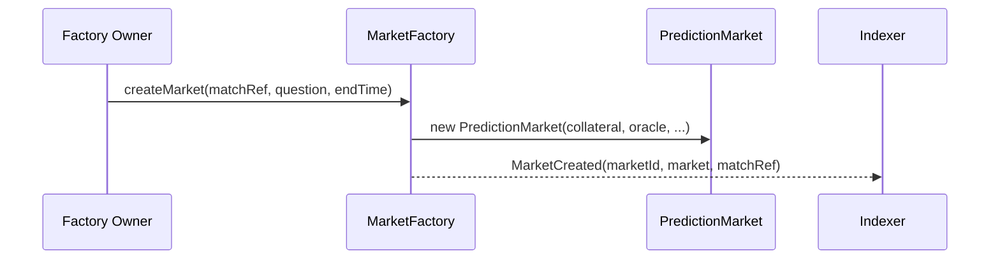

### 6.2 用户下注与 claim（parimutuel）

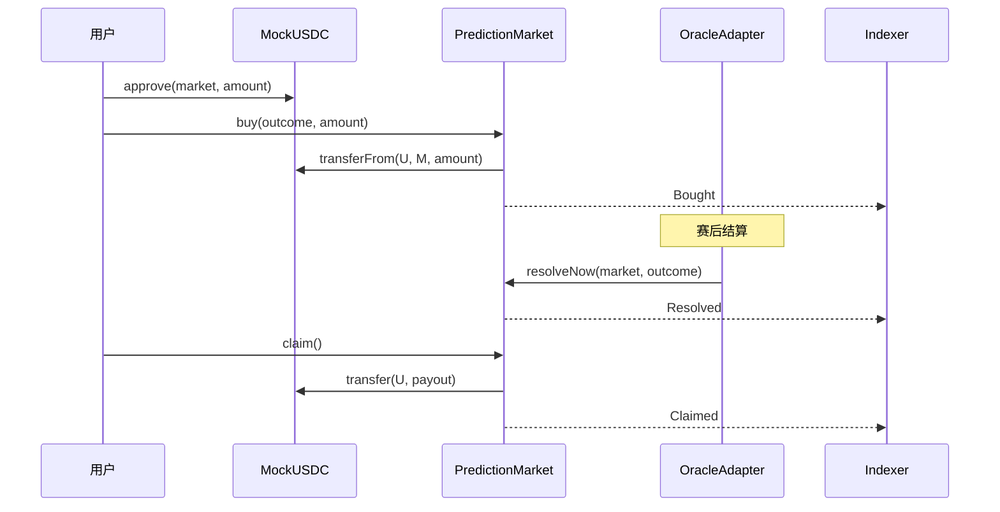

### 6.3 时间锁 Oracle 结算

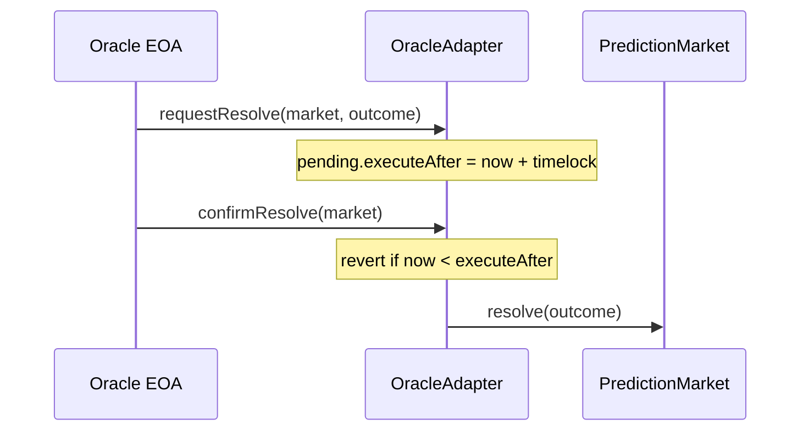

### 6.4 Phase 3 CPMM 买入（价格发现）

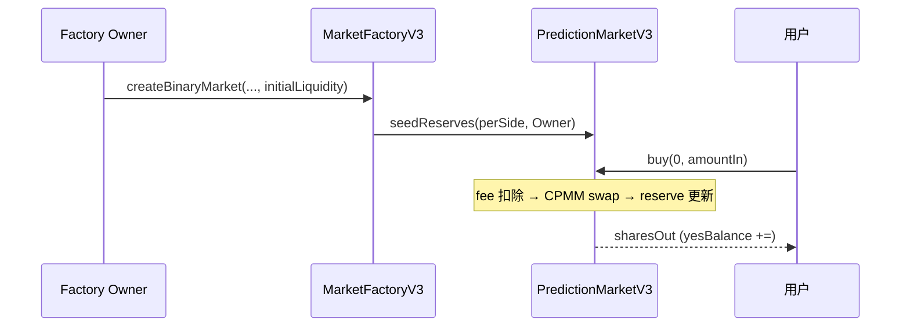

### 6.5 多签 Oracle（Phase 3）

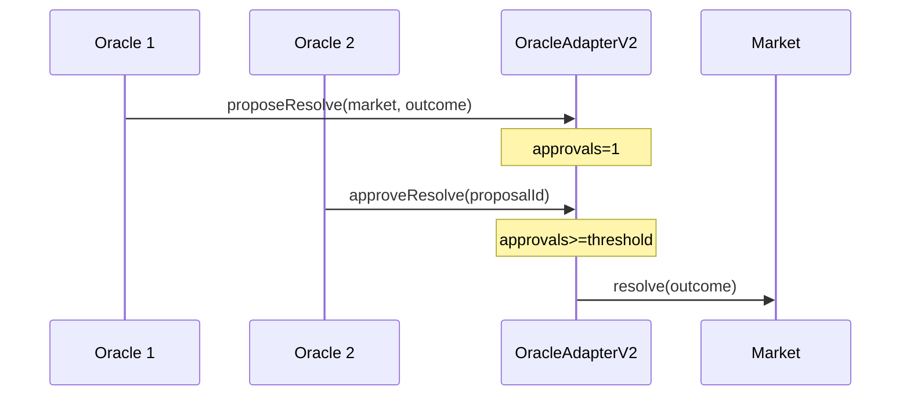

### 6.6 DID 链上绑定

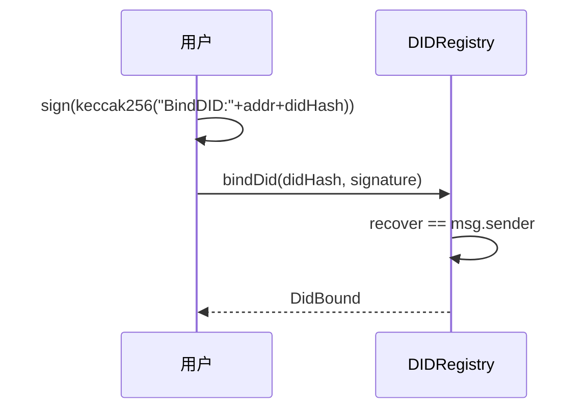

### 6.7 端到端（含 Backend）闭环

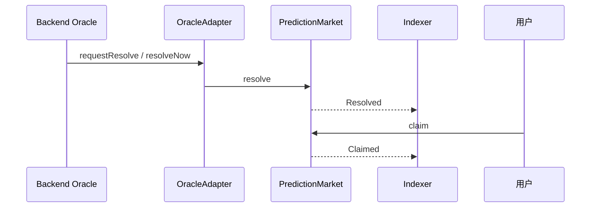

---

## 7. 安全设计

### 7.1 威胁与对策

| 威胁 | 对策 |
|------|------|
| 重入（claim/buy/LP） | ReentrancyGuard（V3/Multi）；SafeERC20 |
| 非 Oracle 结算 | onlyOracle / ORACLE_ROLE |
| 非 Owner 创市场 | onlyOwner（Factory） |
| 过期仍下注 | `block.timestamp < endTime` |
| 重复 claim | claimed mapping |
| 非标准 ERC20 | SafeERC20 |
| Oracle 单点作恶 | timelock 观察窗 + AdapterV2 多签 |
| 伪造 DID 绑定 | ECDSA recover == msg.sender |
| 工厂被滥用创市场 | onlyOwner + V3 pause |
| MockUSDC 无限 mint | 生产禁用；审计标注测试专用 |

### 7.2 访问控制矩阵

| 操作 | PredictionMarket | Factory | OracleAdapter | OracleAdapterV2 | DIDRegistry |
|------|------------------|---------|---------------|---------------|-------------|
| buy | 任意 EOA | — | — | — | — |
| resolve/void | oracle 地址 | — | ORACLE_ROLE → 市场 | ORACLE_ROLE → 市场 | — |
| createMarket | — | Owner | — | — | — |
| grantOracle | — | — | ADMIN | ADMIN | — |
| bindDid | — | — | — | — | 任意 EOA（自签） |
| pause | — | — | — | — | — |
| pause factory | — | — | — | — | — |
| | | | | | V3 Owner pause |

### 7.3 已接受风险 / 已知限制

| 项 | 说明 | 缓解 |
|----|------|------|
| block.timestamp 操纵 | 矿工小幅偏移 endTime | 不用于高精度时间金融 |
| 整数截断 dust | 除法余数留合约 | 可接受微量残留 |
| fee 无提取 | collectedFees 永久留存 | 运营知晓；未来版本可加 withdraw |
| PM 无 explicit interface | 依赖 public enum getter | Adapter 调用 status 仍有效 |
| resolve.js 绕过 Adapter | dev 脚本直调 market | 禁止生产使用 |

---

## 8. 错误处理设计

合约采用 **require revert + 短字符串 reason**（无 custom error，Solidity 0.8 revert 自动 bubbled）。

### 8.1 常见 revert 语义

| reason | 场景 | 合约 |
|--------|------|------|
| not open | 非 Open 状态操作 | PM, V3, Multi |
| ended / closed | 过 endTime | PM, V3, Multi |
| invalid outcome | outcome 越界 | 全部市场 |
| not oracle | 非 oracle 调 resolve | PM, V3, Multi |
| already claimed / claimed | 重复 claim | PM, V3 |
| nothing to claim / nothing | 无 payout | PM, V3, Multi |
| timelock | confirm 过早 | OracleAdapter |
| use request+confirm | timelock>0 时调 resolveNow | OracleAdapter |
| not pending | 无 active pending | OracleAdapter |
| threshold / approved / executed | 多签状态错误 | OracleAdapterV2 |
| not factory | 非 factory seed | PredictionMarketV3 |
| max bet | 超单用户限额 | PredictionMarketV3 |
| invalid sig | DID 签名错误 | DIDRegistry |

### 8.2 链下错误映射建议

| 链上 revert | 前端展示 |
|-------------|----------|
| ended | 市场已截止 |
| not open | 市场已结算或关闭 |
| ERC20 insufficient allowance | 请先 approve USDC |

---

## 9. 配置与部署设计

### 9.1 Hardhat 配置要点

| 项 | 值 |
|----|-----|
| solidity | 0.8.24, optimizer runs 200 |
| evmVersion | cancun |
| hardhat.chainId | 31337 |
| paths.sources | ./contracts |

### 9.2 部署参数

| 参数 | 来源 | Phase 2 默认 | Phase 3 默认 |
|------|------|----------------|--------------|
| timelockDelay | ORACLE_TIMELOCK_SECONDS | 120 | — |
| multisig threshold | ORACLE_MULTISIG_THRESHOLD | — | 2 |
| defaultFeeBps | DEFAULT_FEE_BPS | — | 30 |
| defaultMaxBet | 硬编码 | — | 10_000 USDC |

### 9.3 部署顺序（Phase 2）

```
1. MockUSDC
2. OracleAdapter(admin, timelock)
3. DIDRegistry
4. MarketFactory(usdc, adapter)
5. adapter.setFactory(factory)
6. adapter.grantOracle(deployer)
7. usdc.mint(deployer, ...)
8. 写 deployments.local.json
```

### 9.4 npm 脚本与 CI 建议

| 脚本 | 用途 |
|------|------|
| npm run compile | 编译 + 生成 artifacts |
| npm test | PR 门禁 |
| npm run coverage | 覆盖率报告 |
| npm run export-abi | 编译后同步 Backend/Frontend |
| npm run deploy:local | 本地集成 |

**设计决策**：部署地址写 JSON 文件，由 Backend `.env` 手工或脚本注入；链上无 registry 合约。

---

## 10. 市场机制对比设计

| 维度 | PredictionMarket (P2) | PredictionMarketV3 (P3) | MultiOutcomeMarket (P3) |
|------|----------------------|-------------------------|-------------------------|
| 机制 | parimutuel | CPMM | parimutuel |
| outcome | 2 | 2 | 2–8 |
| 价格发现 | 仅池比例 | reserve 实时价格 | 池比例 |
| 手续费 | 无 | feeBps on buy | feeBps on buy |
| LP | 无 | 有 | 无 |
| maxBet | 无 | 有 | 无 |
| Oracle | Adapter timelock | AdapterV2 multisig | AdapterV2 multisig |
| 工厂 | MarketFactory | MarketFactoryV3 | MarketFactoryV3 |

**选型建议**：

- 简单世界杯 Yes/No、Backend 已索引 → Phase 2；
- 需要即时价格、LP、费率 → Phase 3 CPMM；
- 小组出线等多选项 → Phase 3 Multi。

---

## 11. 可扩展性与演进

| 扩展点 | 当前实现 | 演进方向 |
|--------|----------|----------|
| 抵押代币 | MockUSDC | 主网 USDC；多 collateral 需新 Factory |
| Oracle | Adapter + AdapterV2 分离 | 统一网关合约或 Chainlink Functions |
| 市场类型 | 3 种实例合约 | 新模板 + FactoryV3 marketTypes 枚举扩展 |
| Indexer | Phase 2 事件 | 增加 V3/Multi 事件与 CPMM 池字段 |
| 费用提取 | 无 withdraw | 增加 feeRecipient + pull 模式 |
| 升级 | 无 | 新 Factory 部署新市场；旧市场自然到期 |
| VC 门禁 | 链下 | 可选：链上 Merkle allowlist |
| pause | 仅 FactoryV3 创建 pause | 市场级 pause（未实现） |

---

## 12. 测试设计概要

| 测试文件 | 覆盖设计点 |
|----------|------------|
| PredictionMarket.test.js | buy、parimutuel claim、权限、double claim |
| MarketFactory.test.js | 创建、事件、marketCount |
| OracleAdapter.test.js | timelock 流程、void 退款 |
| Phase3.test.js | CPMM 价格变化、multi claim、multisig threshold |

**测试环境**：Hardhat 内置网络；`@nomicfoundation/hardhat-network-helpers` 操纵 time。

---

## 13. 与需求文档的追溯

| 需求章节（01 文档） | 概要设计章节 |
|-------------------|--------------|
| 4 功能需求 FR-* | 3 模块设计、6 关键流程 |
| 5 非功能需求 NFR-* | 2 总体设计、7 安全、12 测试 |
| 6 链上数据需求 | 4 数据设计 |
| 7 接口需求 | 5 接口设计 |
| 8 部署与配置 | 9 配置与部署设计 |
| 9 约束与假设 | 7.3 已知限制、11 演进 |

---

## 14. 附录

### 14.1 合约清单与代码规模

| 文件 | 约行数 | Phase |
|------|--------|-------|
| MockUSDC.sol | 17 | 共用 |
| IPredictionMarket.sol | 8 | 共用 |
| PredictionMarket.sol | 133 | 2 |
| MarketFactory.sol | 59 | 2 |
| OracleAdapter.sol | 82 | 2 |
| DIDRegistry.sol | 32 | 2 |
| PredictionMarketV3.sol | 199 | 3 |
| MultiOutcomeMarket.sol | 112 | 3 |
| MarketFactoryV3.sol | 93 | 3 |
| OracleAdapterV2.sol | 82 | 3 |

### 14.2 与 Backend 配置对齐

| 链上合约 | Backend 环境变量 |
|----------|------------------|
| MarketFactory | MARKET_FACTORY_ADDRESS |
| OracleAdapter | ORACLE_ADAPTER_ADDRESS |
| MockUSDC | MOCK_USDC_ADDRESS |
| Oracle EOA | ORACLE_PRIVATE_KEY（须具 ORACLE_ROLE） |

### 14.3 文档修订记录

| 版本 | 日期 | 说明 |
|------|------|------|
| 1.0 | 2026-07-17 | 初版，基于当前 contracts 源码与 01 需求规格说明书 |

### 14.4 相关文档

| 文档 | 路径 |
|------|------|
| 需求规格说明书 | `contracts/01.需求规格说明书.md` |
| 函数/结构体详细说明 | `contracts/contracts_func.md` |
| Backend 概要设计 | `backend/02.概要设计.md` |
| 系统架构 | `docs/ARCHITECTURE.md` |

---

**文档结束**
