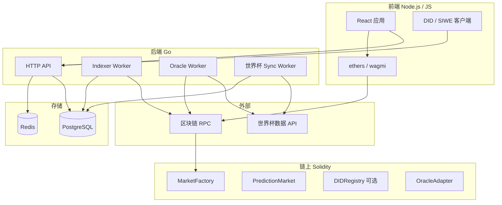

# 系统架构（跨 Phase 参考）

本文描述各 Phase 共享的架构边界；具体实现范围以各 Phase 文档为准。

## 1. 产品定位

用户通过**钱包 + DID 身份**参与**世界杯赛事**相关的链上预测市场：下注 → 赛事结束 → 预言机结算 → 领取收益。

## 2. 逻辑分层



## 3. 仓库结构（目标 Monorepo）

```
PredictionDIDSimple/
  contracts/     # Hardhat
  backend/       # Go
  frontend/      # Node.js 前端
  docs/          # Phase 与架构文档
  docker-compose.yml
```

## 4. 核心数据流

### 4.1 创建市场

管理员或工厂合约创建 `market` ↔ 后端 `matches` 表通过 `externalMatchId` 关联。

### 4.2 下注

用户前端 → 授权 ERC20（若需要）→ 调用 `PredictionMarket` → 链上事件 → Indexer 写入 `trades` / `positions`。

### 4.3 结算

Sync 更新比分 → Oracle Worker 双源确认 → `OracleAdapter.resolve` → 用户前端 `claim`。

## 5. 模块职责矩阵

| 模块 | 职责 | 主要实现方 |
|------|------|------------|
| MarketFactory | 批量/单次创建市场 | 合约 |
| PredictionMarket | 抵押、份额、结算、claim | 合约 |
| OracleAdapter | 仅授权地址可 resolve | 合约 |
| DIDRegistry | 地址与 DID 绑定（可选上链） | 合约 + 后端校验 |
| HTTP API | 赛程、市场聚合、用户历史 | Go |
| Indexer | 链上事件 → DB | Go |
| WC Sync | 外部 API → matches | Go |
| Oracle Worker | 赛后 resolve 上链 | Go |
| Web UI | 钱包、下注、DID 展示 | 前端 |

## 6. 赛事状态机（后端）

```
SCHEDULED → LIVE → FINISHED → ORACLE_PENDING → RESOLVED
                      ↓
                   CANCELLED / VOID（退款或无效）
```

## 7. 安全基线（全 Phase 适用）

- 合约：测试覆盖、静态分析（Slither）、主网前第三方审计
- Oracle 密钥：KMS / 多签，禁止明文热钱包进仓库
- API：限流、SIWE/签名鉴权、输入校验
- 合规：预测市场在多地受监管；需司法辖区与 KYC 策略（Phase 3 强化）

## 8. 技术选型摘要

| 类别 | 选型 |
|------|------|
| 链（开发） | Sepolia / Base Sepolia 等测试网 |
| 链（生产） | L2（Base、Arbitrum 等，按合规选定） |
| Go | gin 或 chi、go-ethereum、PostgreSQL、Redis |
| 前端 | React、Vite 或 Next.js、ethers v6 或 viem + wagmi |
| DID（演进） | Phase 1: SIWE + did:pkh → Phase 2: VC |
| 足球数据 | API-Football、SportMonks 等（需 API Key） |
