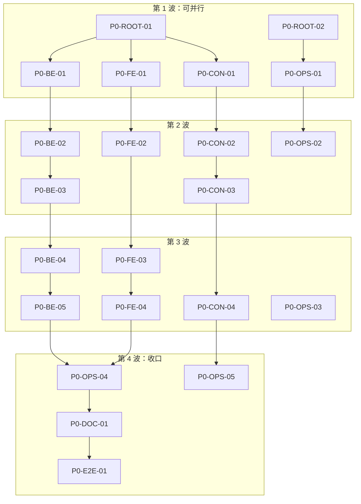

# Phase 0 — 任务分解

> 父文档：[PHASE-0-基础设施.md](./PHASE-0-基础设施.md)  
> 建议总工时：**约 3–5 人日**（单人约 1 周）  
> **实现状态**：代码骨架已于 2026-06-03 落地（见仓库根目录 `contracts/`、`backend/`、`frontend/`）

## 任务编号规则

`P0-{域}-{序号}`

| 域代码 | 含义 |
|--------|------|
| `ROOT` | 仓库根目录、Monorepo 约定 |
| `CON` | 智能合约 / Hardhat |
| `BE` | Go 后端 |
| `FE` | 前端 |
| `OPS` | Docker / CI / 脚本 |
| `DOC` | 文档与验收 |
| `E2E` | 端到端联调验收 |

**状态**：`[ ]` 未开始 · `[~]` 进行中 · `[x]` 完成

---

## 执行顺序（依赖图）



---

## 第 1 波 — 仓库初始化（可并行）

### P0-ROOT-01 创建 Monorepo 目录结构

| 项 | 内容 |
|----|------|
| **依赖** | 无 |
| **工时** | 0.5h |
| **状态** | [ ] |

**要做的事**

- 创建目录：`contracts/`、`backend/`、`frontend/`、`docs/`、`scripts/`
- 根目录 `.gitignore`（见 P0-OPS-04，可先写一版）
- 空占位文件：`contracts/.gitkeep` 等（若需要）

**验收标准**

- [ ] 三端目录存在且命名与 [ARCHITECTURE.md](./ARCHITECTURE.md) 一致
- [ ] 仓库根仅一份 `README.md`（内容可在 P0-DOC-01 补全）

---

### P0-ROOT-02 环境变量约定与模板

| 项 | 内容 |
|----|------|
| **依赖** | P0-ROOT-01 |
| **工时** | 0.5h |
| **状态** | [ ] |

**要做的事**

- 根目录 `.env.example`，分区注释：
  - `DATABASE_URL`、`REDIS_URL`
  - `ETH_RPC_URL`、`CHAIN_ID`
  - `VITE_API_URL`、`VITE_CHAIN_ID`
  - Hardhat 部署私钥占位（注明勿提交真实密钥）
- 各子项目引用方式说明（backend 读 env、frontend 用 `VITE_` 前缀）

**验收标准**

- [ ] `.env.example` 已提交，`.env` 在 `.gitignore` 中
- [ ] 文档中写明复制为 `.env` 的步骤

---

## 第 2 波 — 智能合约（Hardhat）

### P0-CON-01 初始化 Hardhat 工程

| 项 | 内容 |
|----|------|
| **依赖** | P0-ROOT-01 |
| **工时** | 1h |
| **状态** | [ ] |

**要做的事**

- `cd contracts && npm init`，安装：`hardhat`、`@nomicfoundation/hardhat-toolbox`、`@openzeppelin/contracts`
- `hardhat.config.js`：Solidity `0.8.24`（或 0.8.x）、networks（`hardhat`、`localhost`）
- `package.json` scripts：`compile`、`test`、`node`

**验收标准**

- [ ] `npx hardhat compile` 成功
- [ ] `npx hardhat test` 可运行（允许 0 测试暂绿）

**产出路径**

```
contracts/
  hardhat.config.js
  package.json
  contracts/
  test/
  scripts/
```

---

### P0-CON-02 占位合约与部署脚本

| 项 | 内容 |
|----|------|
| **依赖** | P0-CON-01 |
| **工时** | 1h |
| **状态** | [ ] |

**要做的事**

- 添加 `contracts/MarketFactory.sol` 占位（空壳或最小 `version()`）
- `scripts/deploy.js`：部署到 localhost，console 输出地址
- 可选：`ignition` 或保持 scripts 风格统一

**验收标准**

- [ ] `npx hardhat node` 另开终端执行 `npx hardhat run scripts/deploy.js --network localhost` 成功
- [ ] 部署地址可记入 `.env.example` 注释示例

---

### P0-CON-03 合约测试与 coverage 命令

| 项 | 内容 |
|----|------|
| **依赖** | P0-CON-02 |
| **工时** | 0.5h |
| **状态** | [ ] |

**要做的事**

- `test/MarketFactory.test.js`：至少 1 个用例（部署成功或 `version` 断言）
- 安装 `solidity-coverage`，script：`npm run coverage`

**验收标准**

- [ ] `npm test` 通过
- [ ] `npm run coverage` 可执行且不报错

---

### P0-CON-04 ABI 导出脚本

| 项 | 内容 |
|----|------|
| **依赖** | P0-CON-02 |
| **工时** | 1h |
| **状态** | [ ] |

**要做的事**

- `scripts/export-abi.js`：读取 `artifacts/contracts/**/*.json`，写出：
  - `backend/pkg/contracts/MarketFactory.json`（ABI + bytecode 可选）
  - `frontend/src/abis/MarketFactory.json`（仅 ABI 即可）
- 根目录或 `contracts` 增加 `npm run export-abi`（compile 后执行）

**验收标准**

- [ ] 执行 `compile` + `export-abi` 后，Go 与前端目录出现同步 ABI
- [ ] 修改合约名后重新导出，两端文件同时更新

---

## 第 2 波 — 后端（Go）

### P0-BE-01 初始化 Go module 与目录

| 项 | 内容 |
|----|------|
| **依赖** | P0-ROOT-01 |
| **工时** | 0.5h |
| **状态** | [ ] |

**要做的事**

- `backend/go.mod`，module 名如 `github.com/yourorg/prediction-did`
- 目录：
  ```
  cmd/api/main.go
  internal/config/
  internal/handler/
  internal/server/
  pkg/contracts/   # ABI JSON 占位
  migrations/
  ```

**验收标准**

- [ ] `go build ./...` 通过
- [ ] `cmd/api` 可启动（允许仅打印 listening）

---

### P0-BE-02 配置加载模块

| 项 | 内容 |
|----|------|
| **依赖** | P0-BE-01、P0-ROOT-02 |
| **工时** | 1h |
| **状态** | [ ] |

**要做的事**

- `internal/config/config.go`：从环境变量读取
  - `HTTP_PORT`（默认 8080）
  - `DATABASE_URL`、`REDIS_URL`
  - `ETH_RPC_URL`
- 启动时校验必填项，缺失则友好报错

**验收标准**

- [ ] 无 `DATABASE_URL` 时进程退出并提示
- [ ] 配置单元测试或 table-driven 测试 ≥ 1

---

### P0-BE-03 HTTP 服务与健康检查

| 项 | 内容 |
|----|------|
| **依赖** | P0-BE-02 |
| **工时** | 1.5h |
| **状态** | [ ] |

**要做的事**

- 使用 `chi` 或 `gin` 注册路由：
  - `GET /health` → `{"status":"ok"}`
  - `GET /ready` → 检查 DB ping（Redis 可选未连时 degraded）
- 优雅关闭（SIGINT/SIGTERM）

**验收标准**

- [ ] `curl localhost:8080/health` 返回 200
- [ ] Postgres 未启动时 `/ready` 返回 503 或 `not ready`
- [ ] `go test ./internal/handler/...` 通过

---

### P0-BE-04 数据库迁移（空 schema）

| 项 | 内容 |
|----|------|
| **依赖** | P0-BE-02、P0-OPS-01 |
| **工时** | 1h |
| **状态** | [ ] |

**要做的事**

- 引入 `golang-migrate` 或 `goose`
- `migrations/000001_init.up.sql`：占位，如 `CREATE TABLE IF NOT EXISTS schema_version ...` 或空扩展启用
- `Makefile` / README：`make migrate-up`

**验收标准**

- [ ] Docker Postgres 启动后，迁移命令成功
- [ ] `/ready` 在迁移后能 ping 通 DB

---

### P0-BE-05 RPC 连通性检查（warn only）

| 项 | 内容 |
|----|------|
| **依赖** | P0-BE-03、P0-CON-01 |
| **工时** | 0.5h |
| **状态** | [ ] |

**要做的事**

- `internal/blockchain/client.go`：`ethclient.Dial` + `ChainID`
- API 启动时异步 ping，失败仅 `log.Warn`，不阻塞启动
- 可选：`GET /ready` 增加 `rpc_ok` 字段

**验收标准**

- [ ] 无节点时 API 仍能启动，`/health` 正常
- [ ] 有 `hardhat node` 时日志显示 chainId 或 `rpc_ok: true`

---

## 第 2 波 — 前端（Node.js / JS）

### P0-FE-01 初始化 Vite + React（JavaScript）

| 项 | 内容 |
|----|------|
| **依赖** | P0-ROOT-01 |
| **工时** | 0.5h |
| **状态** | [ ] |

**要做的事**

- `npm create vite@latest frontend -- --template react`
- 确认使用 **JavaScript**（非 TypeScript 模板）
- `package.json`：`dev`、`build`、`preview`

**验收标准**

- [ ] `npm run dev` 可打开默认页
- [ ] `npm run build` 无错误

---

### P0-FE-02 路由与页面骨架

| 项 | 内容 |
|----|------|
| **依赖** | P0-FE-01 |
| **工时** | 1h |
| **状态** | [ ] |

**要做的事**

- 安装 `react-router-dom`
- 页面：`/` 首页、`/markets` 占位、`/me` 占位
- 统一 `Layout`（顶栏：项目名 + 导航）

**验收标准**

- [ ] 三个路由可切换且无控制台报错
- [ ] 首页展示 Phase 0 脚手架说明（一行即可）

---

### P0-FE-03 API 客户端占位

| 项 | 内容 |
|----|------|
| **依赖** | P0-FE-02、P0-BE-03 |
| **工时** | 0.5h |
| **状态** | [ ] |

**要做的事**

- `src/services/api.js`：`getHealth()` → `fetch(${VITE_API_URL}/health)`
- 首页挂载时调用并显示 API 状态（在线 / 离线）

**验收标准**

- [ ] 后端启动时首页显示 API 在线
- [ ] 后端关闭时显示离线或错误提示

---

### P0-FE-04 环境与链配置占位

| 项 | 内容 |
|----|------|
| **依赖** | P0-FE-01、P0-ROOT-02 |
| **工时** | 0.5h |
| **状态** | [ ] |

**要做的事**

- `frontend/.env.example`：`VITE_API_URL`、`VITE_CHAIN_ID`
- `src/config.js` 集中导出
- 页脚或调试区展示当前 `CHAIN_ID`（便于联调）

**验收标准**

- [ ] 修改 `.env` 后重启 dev server，配置生效
- [ ] 未配置时有合理默认值或明确错误提示

---

## 第 2–3 波 — DevOps

### P0-OPS-01 Docker Compose（Postgres + Redis）

| 项 | 内容 |
|----|------|
| **依赖** | P0-ROOT-02 |
| **工时** | 1h |
| **状态** | [ ] |

**要做的事**

- 根目录 `docker-compose.yml`：
  - `postgres:16`，端口 `5432`，volume、默认库/用户/密码与 `.env.example` 一致
  - `redis:7`，端口 `6379`
- 可选：`healthcheck` 定义

**验收标准**

- [ ] `docker compose up -d` 后 `psql` 或 migrate 可连接
- [ ] Redis `redis-cli ping` 返回 PONG

---

### P0-OPS-02 本地开发脚本（统一启动）

| 项 | 内容 |
|----|------|
| **依赖** | P0-OPS-01、P0-CON-01、P0-BE-03、P0-FE-01 |
| **工时** | 1h |
| **状态** | [ ] |

**要做的事**

- 根目录 `Makefile` 或 `package.json` scripts，例如：
  - `make up` → docker compose up -d
  - `make migrate` → 后端迁移
  - `make dev-contracts` → hardhat node 说明
  - `make dev-api` / `make dev-web`
- Windows 兼容：提供 `scripts/dev.ps1` 或文档说明 PowerShell 等价命令

**验收标准**

- [ ] README 中「从零启动」步骤 ≤ 6 条命令
- [ ] Windows 用户能按文档启动（见 P0-DOC-01）

---

### P0-OPS-03 GitHub Actions CI

| 项 | 内容 |
|----|------|
| **依赖** | P0-CON-03、P0-BE-03、P0-FE-01 |
| **工时** | 1.5h |
| **状态** | [ ] |

**要做的事**

- `.github/workflows/ci.yml`：
  - job `contracts`：setup-node → `npm ci` → compile → test
  - job `backend`：setup-go → `go test ./...`
  - job `frontend`：setup-node → `npm ci` → `npm run build`
- 触发：`push` / `pull_request` 到 main（或 master）

**验收标准**

- [ ] 本地三端命令与 CI 一致
- [ ] 空提交 push 后 CI 全绿

---

### P0-OPS-04 完善 .gitignore 与依赖锁定

| 项 | 内容 |
|----|------|
| **依赖** | P0-ROOT-01、三端初始化完成 |
| **工时** | 0.5h |
| **状态** | [ ] |

**要做的事**

- 忽略：`node_modules/`、`contracts/artifacts/`、`contracts/cache/`、`backend/bin/`、`frontend/dist/`、`.env`
- 提交：`package-lock.json`（contracts、frontend）

**验收标准**

- [ ] `git status` 无意外跟踪 `artifacts` 或 `.env`
- [ ] 克隆后 `npm ci` 可复现依赖

---

### P0-OPS-05 一键 ABI 同步纳入工作流

| 项 | 内容 |
|----|------|
| **依赖** | P0-CON-04 |
| **工时** | 0.5h |
| **状态** | [ ] |

**要做的事**

- 根脚本 `scripts/sync-abi.sh` / `sync-abi.ps1`：调用 contracts 的 compile + export-abi
- CI 可选：检查 ABI 是否过期（`git diff --exit-code` on abis）

**验收标准**

- [ ] 单命令完成编译并同步到 backend + frontend
- [ ] README 「改合约后」流程已写明

---

## 第 4 波 — 文档与验收

### P0-DOC-01 根目录 README 与 Windows 说明

| 项 | 内容 |
|----|------|
| **依赖** | P0-OPS-02、P0-OPS-03 |
| **工时** | 1h |
| **状态** | [ ] |

**要做的事**

- 前置：Node 20 LTS、Go 1.22+、Docker Desktop
- 快速开始：clone → copy env → docker up → migrate → hardhat node → deploy → api → web
- Windows：路径、`scripts/dev.ps1`、行尾与 Docker 卷注意事项

**验收标准**

- [ ] 新同事按 README 30 分钟内看到前端首页 + API health 绿
- [ ] 常见问题 FAQ ≥ 3 条（端口占用、RPC 连不上等）

---

### P0-E2E-01 Phase 0 端到端验收清单

| 项 | 内容 |
|----|------|
| **依赖** | 以上全部任务 |
| **工时** | 1h |
| **状态** | [ ] |

**检查项（逐项勾选）**

- [ ] `docker compose up -d` → Postgres + Redis 正常
- [ ] `migrate-up` 成功，`GET /ready` 200
- [ ] `npx hardhat node` + deploy 成功，后端日志 RPC warn 消失或 `rpc_ok`
- [ ] 前端首页显示 API 在线、`CHAIN_ID` 正确
- [ ] 修改占位合约 → `sync-abi` → Go/frontend ABI 文件已更新
- [ ] `git push` 触发 CI 全绿
- [ ] 仓库中无 `.env`、无 `artifacts` 误提交

**验收标准**

- [ ] 在本文件顶部或项目 Issue 中记录验收日期与执行人
- [ ] [PHASE-0-基础设施.md](./PHASE-0-基础设施.md) 第 4 节交付物全部勾选

---

## 任务总表（速查）

| ID | 标题 | 依赖 | 工时 |
|----|------|------|------|
| P0-ROOT-01 | Monorepo 目录结构 | — | 0.5h |
| P0-ROOT-02 | `.env.example` 约定 | ROOT-01 | 0.5h |
| P0-CON-01 | 初始化 Hardhat | ROOT-01 | 1h |
| P0-CON-02 | 占位合约与部署脚本 | CON-01 | 1h |
| P0-CON-03 | 测试与 coverage | CON-02 | 0.5h |
| P0-CON-04 | ABI 导出脚本 | CON-02 | 1h |
| P0-BE-01 | Go module 与目录 | ROOT-01 | 0.5h |
| P0-BE-02 | 配置加载 | BE-01, ROOT-02 | 1h |
| P0-BE-03 | 健康检查 API | BE-02 | 1.5h |
| P0-BE-04 | 数据库迁移 | BE-02, OPS-01 | 1h |
| P0-BE-05 | RPC 连通检查 | BE-03, CON-01 | 0.5h |
| P0-FE-01 | Vite + React 初始化 | ROOT-01 | 0.5h |
| P0-FE-02 | 路由与页面骨架 | FE-01 | 1h |
| P0-FE-03 | API 客户端占位 | FE-02, BE-03 | 0.5h |
| P0-FE-04 | 环境与链配置 | FE-01, ROOT-02 | 0.5h |
| P0-OPS-01 | Docker Compose | ROOT-02 | 1h |
| P0-OPS-02 | 本地开发脚本 | OPS-01, CON-01, BE-03, FE-01 | 1h |
| P0-OPS-03 | GitHub Actions CI | CON-03, BE-03, FE-01 | 1.5h |
| P0-OPS-04 | .gitignore 与 lock 文件 | 三端初始化 | 0.5h |
| P0-OPS-05 | ABI 同步工作流 | CON-04 | 0.5h |
| P0-DOC-01 | README 与 Windows 说明 | OPS-02, OPS-03 | 1h |
| P0-E2E-01 | 端到端验收 | 全部 | 1h |

**合计**：约 **18–20h**

---

## 建议排期（单人 5 天）

| 天 | 任务 |
|----|------|
| Day 1 | ROOT-01/02、OPS-01、CON-01、BE-01、FE-01 |
| Day 2 | CON-02/03、BE-02/03、FE-02 |
| Day 3 | CON-04、BE-04/05、FE-03/04、OPS-04 |
| Day 4 | OPS-02/03/05、DOC-01 |
| Day 5 | E2E-01、修 CI/文档、缓冲 |

---

## 与 Phase 1 的衔接

Phase 0 完成后，以下文件/能力应**可直接扩展**而无需重构：

- `contracts/contracts/MarketFactory.sol` → Phase 1 实装市场逻辑
- `backend/migrations/` → 增加 `matches`、`markets` 表
- `frontend/src/services/api.js` → 增加 markets 接口
- `scripts/sync-abi` → Phase 1 新合约继续沿用
