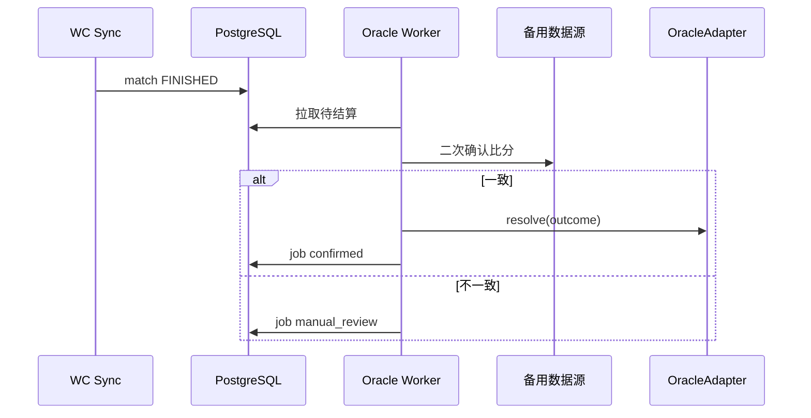

# Phase 2 — DID 深化与自动预言机

**周期建议**：约 4–5 周  
**前置依赖**：[Phase 1 MVP](./PHASE-1-MVP.md)  
**后续 Phase**：[Phase 3](./PHASE-3-产品与主网.md)

---

## 1. 目标

实现**可信自动结算**：赛后由 Oracle 服务根据多数据源确认比分并上链 `resolve`；完善 **DID + 可验证凭证（VC）** 能力；提供**管理后台**处理异常赛事。

## 2. 范围

### 2.1 包含

- `OracleAdapter` 合约 + Go Oracle Worker（冷却时间、重试、幂等）
- 双数据源比分校验（主 API + 备用 API 或官方 RSS）
- DID：VC 签发与校验（如「已验证球迷」、地区声明）
- 可选链上 `DIDRegistry`（`bindDid` / `resolveDid`）
- 赛事异常：取消、延期、VOID 退款路径
- 管理后台（内部）：市场创建、Oracle 队列、手动推迟 resolve

### 2.2 不包含

- AMM / 订单簿流动性
- 主网部署与第三方审计
- 完整 KYC 服务商对接（可用 stub VC）

---

## 3. 智能合约任务

| # | 任务 | 说明 |
|---|------|------|
| C2-1 | `OracleAdapter` | 仅 `ORACLE_ROLE` 可 `resolve(marketId, outcome)` |
| C2-2 | 时间锁（可选） | resolve 提议 → delay → 确认，防单点作恶 |
| C2-3 | `DIDRegistry`（可选） | `bind(bytes32 didHash, bytes signature)` |
| C2-4 | `VOID` / `cancelMarket` | 赛事取消时等额退款或按规则退 |
| C2-5 | 事件扩展 | `OracleResolveRequested`、`MarketVoided` |
| C2-6 | 升级策略文档 | UUPS 代理或不可升级 + 新版本迁移说明 |

---

## 4. 后端任务（Go）

| # | 任务 | 说明 |
|---|------|------|
| B2-1 | Oracle Worker | 监听 `FINISHED` match → 冷却 N 分钟 → 双源比对 → 发 tx |
| B2-2 | `oracle_jobs` 表 | 状态：pending / submitted / confirmed / failed |
| B2-3 | 幂等与重试 | 同场不重复 resolve；失败告警 |
| B2-4 | VC 服务 | 签发 JWT-VC 或 W3C VC JSON；私钥 KMS |
| B2-5 | VC 校验中间件 | 特定市场要求 `credentialSubject.region` 等 |
| B2-6 | DID Resolver | `did:pkh`、`did:web` 文档拉取与缓存 |
| B2-7 | 管理 API | RBAC：创建市场、void、重试 oracle |
| B2-8 | 告警 | Prometheus metrics + 关键失败 Webhook |

### 4.1 新增 / 扩展 API

| 方法 | 路径 | 说明 |
|------|------|------|
| GET | `/admin/oracle-jobs` | Oracle 队列 |
| POST | `/admin/markets` | 创建市场（调工厂或仅登记） |
| POST | `/admin/markets/:id/void` | 作废 |
| POST | `/credentials/issue` | 签发 VC（管理员或规则引擎） |
| GET | `/users/me/credentials` | 用户 VC 列表 |
| POST | `/auth/verify-vc` | 校验 VC 用于门禁 |

### 4.2 赛事状态机（完整）

```
SCHEDULED → LIVE → FINISHED → ORACLE_PENDING → RESOLVED
              ↓         ↓
          POSTPONED  CANCELLED → VOID
```

---

## 5. 前端任务

| # | 任务 | 说明 |
|---|------|------|
| F2-1 | DID 资料页 | 展示 did、已绑定 VC |
| F2-2 | VC 展示组件 | 可验证凭证解析（发行方、声明字段） |
| F2-3 | 门禁提示 | 无 VC 时说明不可参与受限市场 |
| F2-4 | 结算状态 UX | `ORACLE_PENDING`、`RESOLVED`、`VOID` 明确文案 |
| F2-5 | 管理后台 | 独立路由 `/admin`：登录、市场、Oracle 队列 |
| F2-6 | SSE / WS | 可选：比分实时推送 |

---

## 6. DID 方案（Phase 2 标准）

| 步骤 | 实现 |
|------|------|
| 身份标识 | `did:pkh:eip155:{chainId}:{address}` |
| 绑定 | 钱包签名 + 后端存证；可选上链 `DIDRegistry` |
| 凭证 | 后端作为 Issuer 签发 VC（球迷验证、地区等） |
| 校验 | Go 校验 VC 签名与 `expirationDate`；前端仅展示 |

**不在本 Phase 强制的**：Ceramic、ION 全链上 DID 文档（可列 Phase 3 调研项）。

---

## 7. Oracle 流程



---

## 8. 交付物

- [x] [ORACLE-RUNBOOK.md](./ORACLE-RUNBOOK.md)
- [x] [VC-MODEL.md](./VC-MODEL.md)
- [x] [ADMIN-GUIDE.md](./ADMIN-GUIDE.md)
- [x] [SOP-MANUAL-REVIEW.md](./SOP-MANUAL-REVIEW.md)

---

## 9. 验收标准

1. 模拟一场 `FINISHED` 比赛，无需人工脚本，Oracle 在冷却期满后自动 `resolve`。
2. 故意制造双源比分不一致 → 不自动上链，进入 `manual_review` 并告警。
3. 携带有效 VC 的用户可进入受限市场；过期或伪造 VC 被拒绝。
4. 赛事 `CANCELLED` 后用户可完成退款或 VOID claim（按合约规则）。

---

## 10. 风险

- API 延迟或改判（VAR）：冷却时间可配置，建议 ≥ 15–30 分钟。
- Oracle 私钥泄露：必须使用 KMS / 多签（与 Phase 3 衔接）。

---

## 11. 里程碑建议

| 周 | 里程碑 |
|----|--------|
| 1 | OracleAdapter + Worker 骨架 + 单源 resolve |
| 2 | 双源校验 + oracle_jobs + 重试 |
| 3 | VC 签发/校验 + DID 页面 |
| 4 | VOID + 管理后台 |
| 5 | 联调、告警、文档 |
