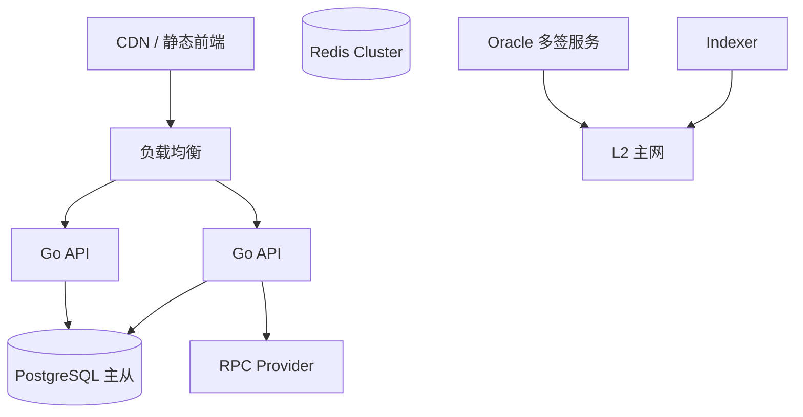

# Phase 3 — 产品化、流动性与主网

**周期建议**：约 6–10 周（含审计等待）  
**前置依赖**：[Phase 2](./PHASE-2-身份与预言机.md)

---

## 1. 目标

将 MVP 升级为可面向真实用户的产品：更好的交易体验、多类型市场、合规与风控、**第三方审计**后**主网 / L2** 部署，以及运维与监控体系。

## 2. 范围

### 2.1 包含

- 流动性：CPMM 池或集成现有预测市场协议（调研后二选一）
- 多市场类型：小组出线、总进球区间、冠军等（合约抽象扩展）
- 合规：地理围栏、免责声明、可选 KYC 服务商对接
- Oracle 多签 / 阈值签名
- 主网部署 runbook、监控、灾备
- 安全审计与漏洞赏金（可选）
- 国际化、移动端适配（响应式或 PWA）

### 2.2 不包含（除非单独立项）

- 法币入金通道（Stripe 等）
- 跨链同一市场（可作 Phase 4 规划）

---

## 3. 智能合约任务

| # | 任务 | 说明 |
|---|------|------|
| C3-1 | 条件代币 / 池化（可选） | Gnosis CTF 风格或自建 `Pool` |
| C3-2 | `MarketFactory` v2 | 支持多 outcome、手续费 `feeBps` |
| C3-3 | 流动性 | `addLiquidity` / `removeLiquidity`；LP 份额 |
| C3-4 | Oracle 多签 | Gnosis Safe 或链下阈值 + `OracleAdapter` |
| C3-5 | 限额与暂停 | 单用户上限、全局 pause |
| C3-6 | 审计修复 | 按审计报告迭代版本 |
| C3-7 | 代理升级（若采用） | UUPS + timelock admin |

---

## 4. 后端任务（Go）

| # | 任务 | 说明 |
|---|------|------|
| B3-1 | 地理围栏 | GeoIP / CDN header → 限制 API 与静态说明 |
| B3-2 | KYC  webhook（可选） | Sumsub / 等：通过后签发 KYC VC |
| B3-3 | 手续费与统计 | 平台收入、成交量、用户 PnL 报表 |
| B3-4 | 高可用 | API 多副本、Indexer 单 leader 选举 |
| B3-5 | 归档与对账 | 链上余额 vs DB 定期对账任务 |
| B3-6 | Rate limit / WAF 规则 | 防刷、防机器人下注 |
| B3-7 | 生产配置 | 分环境 secret、主网 RPC  failover |

### 4.1 扩展 API（示例）

| 方法 | 路径 | 说明 |
|------|------|------|
| GET | `/markets/:id/orderbook` | 若采用订单簿 |
| GET | `/markets/:id/pool` | AMM 储备与价格 |
| GET | `/stats/platform` | 成交量、TVL |
| POST | `/kyc/webhook` | 第三方 KYC 回调 |
| GET | `/compliance/restricted` | 当前 IP 是否受限 |

---

## 5. 前端任务

| # | 任务 | 说明 |
|---|------|------|
| F3-1 | 价格曲线 / 赔率展示 | 基于池储备计算 |
| F3-2 | 多 outcome UI | 出线、比分等多选项 |
| F3-3 | 流动性提供页 | LP 存入/撤出 |
| F3-4 | 合规 Gate | 首次访问司法辖区确认、受限地区拦截页 |
| F3-5 | i18n | 中/英等 |
| F3-6 | 交易模拟 | 提交前 tenderly 或 eth_call 预览 |
| F3-7 | 性能 | 列表虚拟滚动、静态资源 CDN |

---

## 6. 合规与安全清单

| 类别 | 动作 |
|------|------|
| 法律 | 目标国家律师意见；用户协议与风险披露 |
| 地理 | 禁止服务国家列表 + IP 拦截 |
| 身份 | 高风险地区 KYC + VC |
| 合约 | 外部审计 + 修复复审计 |
| 运维 | 私钥 HSM、多签、incident 响应流程 |
| 前端 | 官方域名、交易哈希外链浏览器 |

---

## 7. 部署架构（生产）

---

## 8. 交付物

- [ ] 审计报告与修复记录（见 [AUDIT-CHECKLIST.md](./AUDIT-CHECKLIST.md) 模板）
- [ ] 主网合约地址与验证链接（Etherscan）（见 [DEPLOYMENT-MAINNET.md](./DEPLOYMENT-MAINNET.md)）
- [x] 生产 runbook：部署、回滚、暂停市场 → [PRODUCTION-RUNBOOK.md](./PRODUCTION-RUNBOOK.md)
- [x] 对账脚本与周报模板 → `backend/cmd/reconcile`、[RECONCILIATION-TEMPLATE.md](./RECONCILIATION-TEMPLATE.md)
- [x] 用户帮助中心 → [FAQ.md](./FAQ.md)

---

## 9. 验收标准

1. 主网（或选定 L2）完成至少一种非 Yes/No 市场类型的创建与结算。
2. 审计 Critical/High 问题全部修复或接受风险书面签字。
3. 地理围栏对受限地区返回 403 且前端展示合规页。
4. 7×24 监控：Oracle 失败、Indexer 滞后 > N 区块时告警。
5. 压测：API P99 在目标 QPS 下满足 SLA（团队自定，如 < 500ms）。

---

## 10. Phase 4（展望，非本交付）

以下可作为路线图附录，不纳入 Phase 3 必交付：

- 跨链消息（LayerZero / CCIP）统一流动性
- 法币 on-ramp
- DAO 治理调整手续费与 Oracle 成员
- 完全去中心化 DID（Ceramic / ION）

---

## 11. 里程碑建议

| 阶段 | 内容 |
|------|------|
| M1 | 池化合约设计与测试网 |
| M2 | 多 outcome 市场 + 前端 |
| M3 | 合规 Gate + KYC stub |
| M4 | 审计提交与修复 |
| M5 | 主网发布 + 监控 2 周观察期 |
