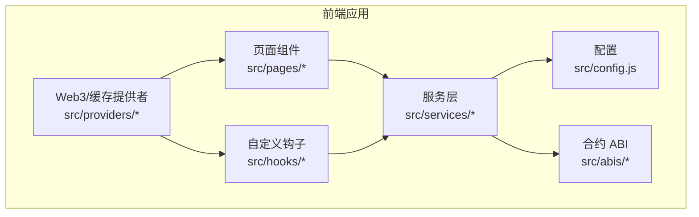
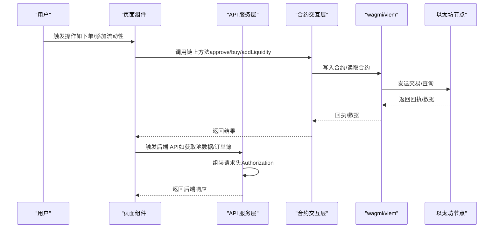
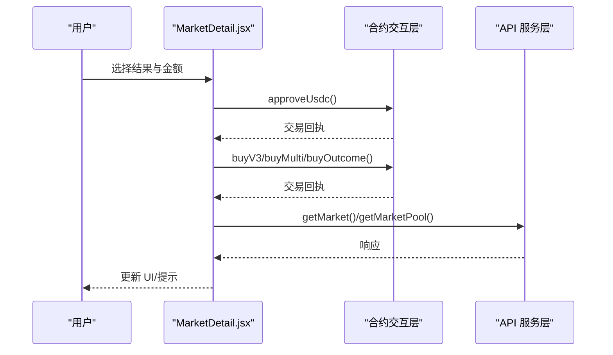
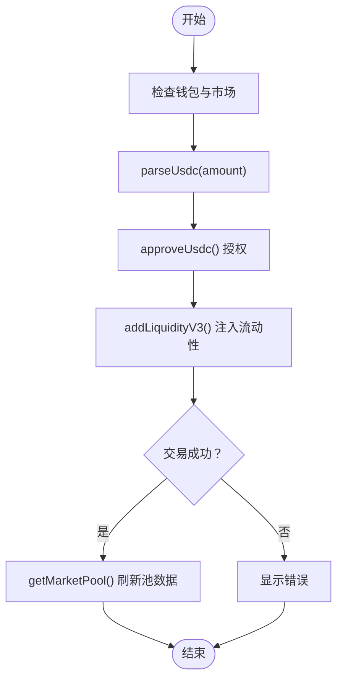
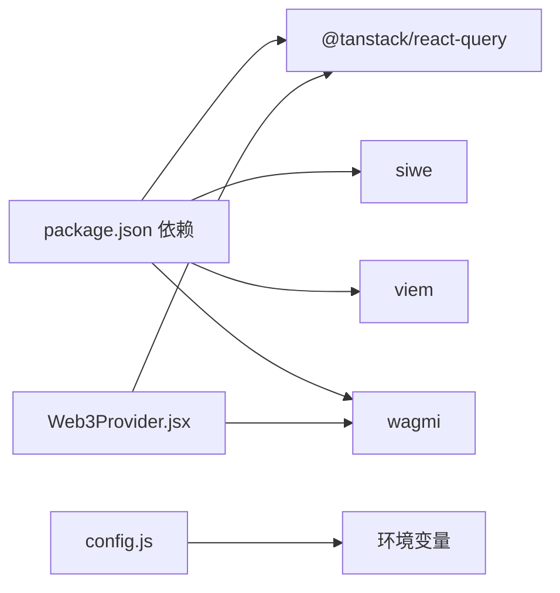

# API参考

<cite>
**本文引用的文件**
- [src/services/api.js](file://src/services/api.js)
- [src/services/contracts.js](file://src/services/contracts.js)
- [src/hooks/useAuth.js](file://src/hooks/useAuth.js)
- [src/config.js](file://src/config.js)
- [src/pages/admin/AdminLayout.jsx](file://src/pages/admin/AdminLayout.jsx)
- [src/pages/admin/AdminMarkets.jsx](file://src/pages/admin/AdminMarkets.jsx)
- [src/pages/admin/OracleJobs.jsx](file://src/pages/admin/OracleJobs.jsx)
- [src/pages/Liquidity.jsx](file://src/pages/Liquidity.jsx)
- [src/pages/Markets.jsx](file://src/pages/Markets.jsx)
- [src/pages/MarketDetail.jsx](file://src/pages/MarketDetail.jsx)
- [src/pages/DIDProfile.jsx](file://src/pages/DIDProfile.jsx)
- [src/pages/Me.jsx](file://src/pages/Me.jsx)
- [src/providers/Web3Provider.jsx](file://src/providers/Web3Provider.jsx)
- [src/abis/PredictionMarketV3.json](file://src/abis/PredictionMarketV3.json)
- [src/abis/MultiOutcomeMarket.json](file://src/abis/MultiOutcomeMarket.json)
- [src/abis/MarketFactoryV3.json](file://src/abis/MarketFactoryV3.json)
- [package.json](file://package.json)
</cite>

## 目录
1. [简介](#简介)
2. [项目结构](#项目结构)
3. [核心组件](#核心组件)
4. [架构总览](#架构总览)
5. [详细组件分析](#详细组件分析)
6. [依赖关系分析](#依赖关系分析)
7. [性能考量](#性能考量)
8. [故障排查指南](#故障排查指南)
9. [结论](#结论)
10. [附录](#附录)

## 简介
本文件为 PredictionDIDSimple 前端项目的完整 API 参考文档，覆盖以下方面：
- RESTful API 端点：HTTP 方法、URL 模式、请求参数、响应格式、错误码与示例
- 用户认证流程：SIWE 登录、DID 绑定、凭证校验
- 市场管理 API：市场列表、详情、订单簿、流动性池、结算与作废
- 管理员 API：Oracle 任务队列、市场元数据注册与作废
- 智能合约交互：函数签名、参数说明、返回值、事件监听
- 常见错误处理与排障建议

## 项目结构
前端采用 React + Vite 构建，核心目录与职责如下：
- src/services：后端 API 与链上合约交互封装
- src/pages：页面级组件，串联 API 与合约交互
- src/hooks：自定义 React 钩子（如认证）
- src/abis：智能合约 ABI 文件
- src/providers：Web3 与数据缓存提供者
- src/config.js：应用配置（API 地址、链 ID、合约地址等）

**图表来源**
- [src/services/api.js](file://src/services/api.js#L1-L187)
- [src/services/contracts.js](file://src/services/contracts.js#L1-L214)
- [src/pages/Markets.jsx](file://src/pages/Markets.jsx#L1-L56)
- [src/pages/MarketDetail.jsx](file://src/pages/MarketDetail.jsx#L1-L185)
- [src/providers/Web3Provider.jsx](file://src/providers/Web3Provider.jsx#L1-L25)

**章节来源**
- [src/services/api.js](file://src/services/api.js#L1-L187)
- [src/services/contracts.js](file://src/services/contracts.js#L1-L214)
- [src/config.js](file://src/config.js#L1-L23)
- [src/providers/Web3Provider.jsx](file://src/providers/Web3Provider.jsx#L1-L25)

## 核心组件
- API 服务层：统一请求封装、鉴权头、错误处理
- 合约交互层：金额解析/格式化、读写合约、交易回执等待
- 页面组件：业务编排（市场列表、详情、流动性、个人中心、DID、管理员后台）
- 自定义钩子：认证（SIWE 登录、登出、令牌管理）
- 配置：API 基础地址、链 ID、合约地址、SIWE 参数

**章节来源**
- [src/services/api.js](file://src/services/api.js#L29-L55)
- [src/services/contracts.js](file://src/services/contracts.js#L24-L35)
- [src/hooks/useAuth.js](file://src/hooks/useAuth.js#L28-L80)
- [src/config.js](file://src/config.js#L7-L22)

## 架构总览
前端通过 API 服务层与后端交互，同时通过 wagmi/viem 与以太坊网络交互。页面组件负责编排业务逻辑，合约交互层封装链上操作。

**图表来源**
- [src/pages/MarketDetail.jsx](file://src/pages/MarketDetail.jsx#L77-L110)
- [src/pages/Liquidity.jsx](file://src/pages/Liquidity.jsx#L51-L77)
- [src/services/contracts.js](file://src/services/contracts.js#L59-L69)
- [src/services/api.js](file://src/services/api.js#L29-L55)

## 详细组件分析

### 用户认证 API
- 令牌存储键名：prediction_jwt
- 请求头：Authorization: Bearer <token>
- 本地存储：localStorage（令牌）、sessionStorage（管理员 Key）

端点定义
- POST /auth/siwe
  - 描述：以太坊签名登录（SIWE），返回 JWT 令牌
  - 请求体字段：message（字符串）、signature（字符串）
  - 响应字段：token（字符串）
  - 示例请求：参见 [src/hooks/useAuth.js](file://src/hooks/useAuth.js#L58-L61)
  - 示例响应：参见 [src/hooks/useAuth.js](file://src/hooks/useAuth.js#L60-L61)

- POST /users/bind-did
  - 描述：将 DID 绑定到用户账户
  - 请求体字段：did（字符串）、signature（字符串）
  - 响应：无（204/200 空体）
  - 示例请求：参见 [src/hooks/useAuth.js](file://src/hooks/useAuth.js#L65-L70)

- POST /auth/verify-vc
  - 描述：验证可验证凭证（VC）
  - 请求体字段：vc_json（JSON 字符串）、credential_type（字符串）、region（字符串）
  - 响应字段：access（对象，包含 requires_vc、allowed、credential_type、region）
  - 示例请求：参见 [src/services/api.js](file://src/services/api.js#L120-L129)

- GET /users/me/credentials
  - 描述：获取当前用户 VC 列表
  - 响应字段：items（VC 数组）
  - 示例响应：参见 [src/pages/DIDProfile.jsx](file://src/pages/DIDProfile.jsx#L28-L30)

- GET /compliance/restricted
  - 描述：检查用户所在地区是否受限
  - 响应字段：restricted（布尔值）

- GET /stats/platform
  - 描述：获取平台统计数据
  - 响应字段：聚合指标（如交易量、用户数等）

- GET /health
  - 描述：健康检查
  - 响应：服务可用性

- GET /ready
  - 描述：就绪检查（含后端与依赖状态）
  - 响应字段：ok（布尔）、data（对象）

- GET /me/positions
  - 描述：获取当前用户持仓列表
  - 响应字段：items（持仓数组）

- POST /admin/oracle-jobs/{id}/retry
  - 描述：管理员重试失败的预言机任务
  - 请求体：无
  - 响应：任务状态更新

- GET /admin/oracle-jobs?status=
  - 描述：按状态过滤获取预言机任务列表
  - 查询参数：status（字符串）

- POST /admin/markets
  - 描述：注册/更新市场元数据
  - 请求体字段：match_id（数字）、requires_vc（布尔）、restricted_region（字符串）、resolution_rule（字符串）
  - 响应：市场元数据

- POST /admin/markets/{id}/void
  - 描述：作废市场（用户可退款）
  - 请求体：无
  - 响应：市场状态变更

- GET /markets/{id}/orderbook
  - 描述：获取市场订单簿数据
  - 响应：订单簿结构（买卖盘）

- GET /markets/{id}/pool
  - 描述：获取市场流动性池状态
  - 响应字段：market_type、reserve_yes、reserve_no、price_yes_bps 等

- GET /markets?limit=&status=&match_id=
  - 描述：分页与过滤获取市场列表
  - 查询参数：limit（数字）、status（字符串）、match_id（数字）

- GET /matches?limit=&status=&date_from=&date_to=
  - 描述：分页与过滤获取赛事列表
  - 查询参数：limit、status、date_from、date_to

- GET /matches/{id}
  - 描述：获取单个赛事详情

- GET /markets/{id}
  - 描述：获取单个市场详情

- GET /users/me/credentials
  - 描述：获取当前用户 VC 列表
  - 响应字段：items（VC 数组）

错误码与处理
- 401 未认证：缺少或无效的 Authorization 头
- 403 禁止：VC 限制或管理员 Key 缺失
- 404 未找到：资源不存在
- 5xx 服务器错误：后端异常，建议重试或联系管理员

**章节来源**
- [src/services/api.js](file://src/services/api.js#L94-L129)
- [src/services/api.js](file://src/services/api.js#L138-L166)
- [src/services/api.js](file://src/services/api.js#L168-L186)
- [src/hooks/useAuth.js](file://src/hooks/useAuth.js#L28-L80)
- [src/pages/DIDProfile.jsx](file://src/pages/DIDProfile.jsx#L24-L30)
- [src/pages/admin/AdminLayout.jsx](file://src/pages/admin/AdminLayout.jsx#L9-L20)

### 市场管理 API
- GET /markets?limit=&status=&match_id=
  - 响应：items（市场数组），每项包含 question、status、yes_pool、no_pool、market_type、collateral_address、market_address 等
  - 示例：参见 [src/pages/Markets.jsx](file://src/pages/Markets.jsx#L21-L25)

- GET /markets/{id}
  - 响应：market（市场详情）、access（访问控制）、collateral_address、orderbook、pool 等
  - 示例：参见 [src/pages/MarketDetail.jsx](file://src/pages/MarketDetail.jsx#L56-L70)

- GET /markets/{id}/orderbook
  - 响应：订单簿数据（买卖盘）

- GET /markets/{id}/pool
  - 响应：池状态（reserve_yes/no、price_yes_bps 等）

- GET /matches?limit=&status=&date_from=&date_to=
  - 响应：items（赛事数组）

- GET /matches/{id}
  - 响应：赛事详情

**章节来源**
- [src/services/api.js](file://src/services/api.js#L70-L91)
- [src/services/api.js](file://src/services/api.js#L183-L186)
- [src/pages/Markets.jsx](file://src/pages/Markets.jsx#L21-L25)
- [src/pages/MarketDetail.jsx](file://src/pages/MarketDetail.jsx#L56-L70)

### 流动性池 API
- GET /markets/{id}/pool
  - 响应：pool 状态（reserve_yes、reserve_no、price_yes_bps）
  - 示例：参见 [src/pages/Liquidity.jsx](file://src/pages/Liquidity.jsx#L47-L49)

- POST /admin/markets
  - 请求体：match_id、requires_vc、restricted_region、resolution_rule
  - 响应：市场元数据

- POST /admin/markets/{id}/void
  - 请求体：无
  - 响应：市场作废

**章节来源**
- [src/services/api.js](file://src/services/api.js#L151-L166)
- [src/services/api.js](file://src/services/api.js#L178-L181)
- [src/pages/Liquidity.jsx](file://src/pages/Liquidity.jsx#L47-L49)

### 管理员 API
- X-Admin-Key 请求头：从 sessionStorage 读取
- GET /admin/oracle-jobs?status=
  - 响应：items（任务数组），包含 id、status、question、market_address、primary_*、secondary_*、error_message

- POST /admin/oracle-jobs/{id}/retry
  - 响应：任务状态更新

- POST /admin/markets
  - 请求体：match_id、requires_vc、restricted_region、resolution_rule
  - 响应：市场元数据

- POST /admin/markets/{id}/void
  - 响应：市场作废

**章节来源**
- [src/services/api.js](file://src/services/api.js#L131-L135)
- [src/services/api.js](file://src/services/api.js#L138-L166)
- [src/pages/admin/AdminLayout.jsx](file://src/pages/admin/AdminLayout.jsx#L22-L27)
- [src/pages/admin/OracleJobs.jsx](file://src/pages/admin/OracleJobs.jsx#L17-L21)
- [src/pages/admin/AdminMarkets.jsx](file://src/pages/admin/AdminMarkets.jsx#L21-L36)

### 智能合约交互

#### 金额工具
- parseUsdc(amount)
  - 输入：人类可读金额（字符串/数字）
  - 输出：链上整数（bigint）
  - 用途：将 mUSDC 转为链上单位

- formatUsdc(amount)
  - 输入：链上金额（bigint/字符串/数字）
  - 输出：格式化字符串
  - 用途：将链上金额格式化为 mUSDC

**章节来源**
- [src/services/contracts.js](file://src/services/contracts.js#L24-L35)

#### 读取与授权
- readUsdcBalance(address, tokenAddress)
  - 读取 USDC 余额
  - 返回：bigint

- approveUsdc(tokenAddress, spender, amount)
  - 授权 USDC 给市场合约
  - 返回：交易回执

**章节来源**
- [src/services/contracts.js](file://src/services/contracts.js#L43-L69)

#### V1 二元市场
- buyOutcome(marketAddress, outcome, amount)
  - 下注指定结果
  - 返回：交易回执

- claimMarket(marketAddress)
  - 领取奖金（已结算市场）
  - 返回：交易回执

- readMarketStatus(marketAddress)
  - 读取市场状态（状态码、获胜结果、Yes/No 池）
  - 返回：{ status, winningOutcome, yesPool, noPool }

**章节来源**
- [src/services/contracts.js](file://src/services/contracts.js#L78-L104)
- [src/services/contracts.js](file://src/services/contracts.js#L183-L213)

#### V3 CPMM 二元市场
- buyV3(marketAddress, outcome, amountIn)
  - 下注指定结果（V3）
  - 返回：交易回执

- addLiquidityV3(marketAddress, amount)
  - 注入流动性
  - 返回：交易回执

- readPoolStateV3(marketAddress)
  - 读取池状态（reserveYes、reserveNo、priceYesBps）
  - 返回：{ reserveYes, reserveNo, priceYesBps }

**章节来源**
- [src/services/contracts.js](file://src/services/contracts.js#L113-L123)
- [src/services/contracts.js](file://src/services/contracts.js#L150-L160)
- [src/services/contracts.js](file://src/services/contracts.js#L167-L176)

#### 多结果市场
- buyMulti(marketAddress, outcome, amount)
  - 下注指定结果（多结果）
  - 返回：交易回执

**章节来源**
- [src/services/contracts.js](file://src/services/contracts.js#L132-L142)

#### 合约事件（示例）
- PredictionMarketV3：Bought、Claimed、LiquidityAdded、LiquidityRemoved、MarketVoided、Resolved
- MultiOutcomeMarket：Bought、Claimed、MarketVoided、Resolved

**章节来源**
- [src/abis/PredictionMarketV3.json](file://src/abis/PredictionMarketV3.json#L99-L177)
- [src/abis/MultiOutcomeMarket.json](file://src/abis/MultiOutcomeMarket.json#L83-L123)

### 页面与工作流

#### 市场详情页（下注流程）

**图表来源**
- [src/pages/MarketDetail.jsx](file://src/pages/MarketDetail.jsx#L77-L110)
- [src/services/contracts.js](file://src/services/contracts.js#L59-L69)
- [src/services/contracts.js](file://src/services/contracts.js#L113-L123)

#### 流动性注入流程

**图表来源**
- [src/pages/Liquidity.jsx](file://src/pages/Liquidity.jsx#L51-L77)
- [src/services/contracts.js](file://src/services/contracts.js#L24-L35)
- [src/services/contracts.js](file://src/services/contracts.js#L59-L69)
- [src/services/contracts.js](file://src/services/contracts.js#L150-L160)

#### 个人中心（持仓与领取）
- GET /me/positions
- 领取：调用 claimMarket()，仅在市场 RESOLVED 或 VOID 且未领取时显示按钮
- 返回：交易回执与最新持仓

**章节来源**
- [src/pages/Me.jsx](file://src/pages/Me.jsx#L34-L61)
- [src/services/contracts.js](file://src/services/contracts.js#L95-L104)

#### 管理员后台
- Oracle 任务队列：GET /admin/oracle-jobs，手动重试 POST /admin/oracle-jobs/{id}/retry
- 市场配置：POST /admin/markets，POST /admin/markets/{id}/void

**章节来源**
- [src/pages/admin/OracleJobs.jsx](file://src/pages/admin/OracleJobs.jsx#L17-L21)
- [src/pages/admin/AdminMarkets.jsx](file://src/pages/admin/AdminMarkets.jsx#L21-L49)

## 依赖关系分析
- Web3 提供者：WagmiProvider + QueryClientProvider
- 依赖库：@tanstack/react-query、siwe、viem、wagmi
- 环境变量：VITE_API_URL、VITE_CHAIN_ID、VITE_MOCK_USDC_ADDRESS、VITE_MARKET_FACTORY_ADDRESS、VITE_SIWE_DOMAIN、VITE_SIWE_URI

**图表来源**
- [package.json](file://package.json#L12-L28)
- [src/providers/Web3Provider.jsx](file://src/providers/Web3Provider.jsx#L1-L25)
- [src/config.js](file://src/config.js#L1-L23)

**章节来源**
- [package.json](file://package.json#L12-L28)
- [src/providers/Web3Provider.jsx](file://src/providers/Web3Provider.jsx#L1-L25)
- [src/config.js](file://src/config.js#L1-L23)

## 性能考量
- 并行读取：链上状态读取使用 Promise.all 并行调用，减少等待时间
- 数据缓存：React Query 提供请求缓存与重试策略
- 分页与过滤：后端支持 limit、status、match_id 等参数，避免一次性加载过多数据

**章节来源**
- [src/services/contracts.js](file://src/services/contracts.js#L185-L210)
- [src/pages/Markets.jsx](file://src/pages/Markets.jsx#L21-L25)

## 故障排查指南
- 401 未认证
  - 检查本地存储是否存在 prediction_jwt
  - 确认 SIWE 登录流程是否成功
  - 参考：[src/hooks/useAuth.js](file://src/hooks/useAuth.js#L58-L61)

- 403 禁止
  - VC 限制导致无法参与市场
  - 管理员 Key 缺失导致无法访问管理员端点
  - 参考：[src/pages/admin/AdminLayout.jsx](file://src/pages/admin/AdminLayout.jsx#L15-L20)

- 交易失败
  - 检查 approve 是否完成
  - 确认链上金额单位（mUSDC）与 parseUsdc 使用一致
  - 参考：[src/services/contracts.js](file://src/services/contracts.js#L24-L35)

- 市场不可用
  - 检查市场状态（OPEN/RESOLVED/VOID/ORACLE_PENDING）
  - 参考：[src/pages/MarketDetail.jsx](file://src/pages/MarketDetail.jsx#L117-L118)

- 管理员操作
  - 确保 sessionStorage 中设置 X-Admin-Key
  - 参考：[src/pages/admin/AdminLayout.jsx](file://src/pages/admin/AdminLayout.jsx#L9-L20)

**章节来源**
- [src/hooks/useAuth.js](file://src/hooks/useAuth.js#L58-L61)
- [src/pages/admin/AdminLayout.jsx](file://src/pages/admin/AdminLayout.jsx#L15-L20)
- [src/services/contracts.js](file://src/services/contracts.js#L24-L35)
- [src/pages/MarketDetail.jsx](file://src/pages/MarketDetail.jsx#L117-L118)

## 结论
本 API 参考文档梳理了前端侧的 RESTful API 与智能合约交互接口，明确了认证流程、市场管理、流动性池、管理员后台等功能模块的端点与参数，并提供了错误处理与性能优化建议。实际开发中请严格遵循请求头、查询参数与响应格式，确保前后端一致性。

## 附录
- 环境变量清单
  - VITE_API_URL：后端 API 基础地址
  - VITE_CHAIN_ID：区块链网络 ID
  - VITE_MOCK_USDC_ADDRESS：USDC 合约地址
  - VITE_MARKET_FACTORY_ADDRESS：市场工厂合约地址
  - VITE_SIWE_DOMAIN：SIWE 域名
  - VITE_SIWE_URI：SIWE URI

**章节来源**
- [src/config.js](file://src/config.js#L1-L23)