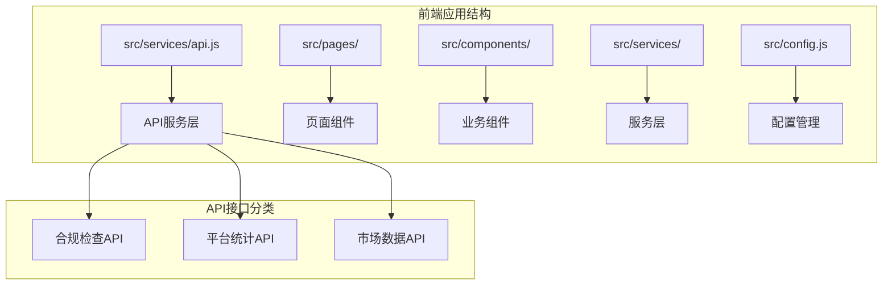
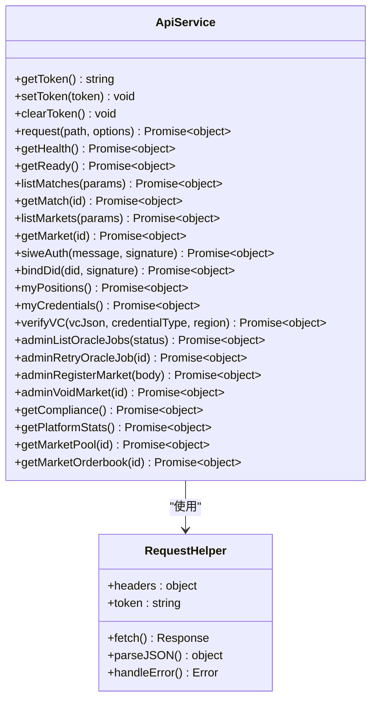
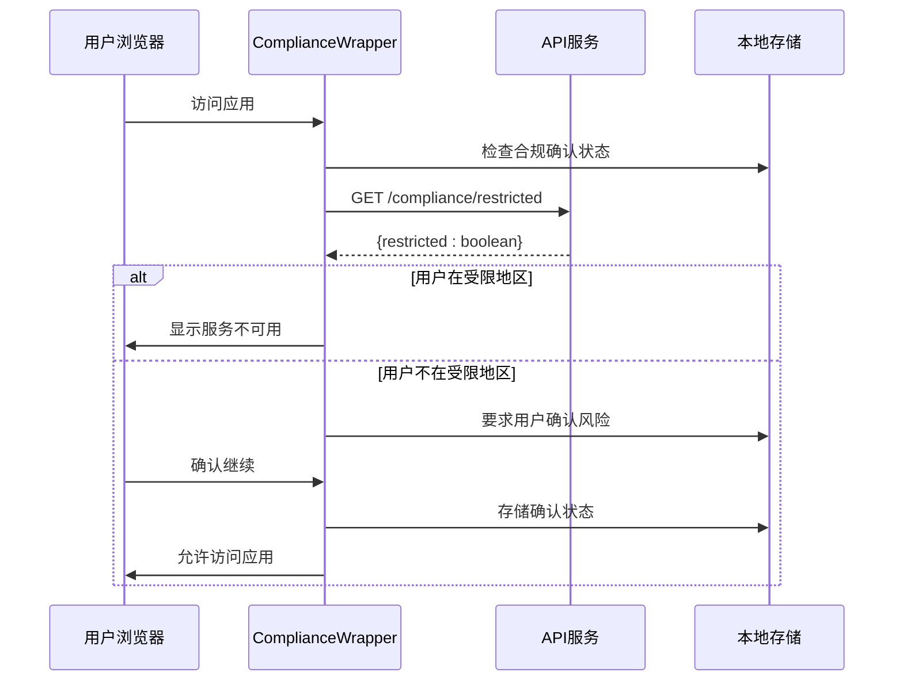
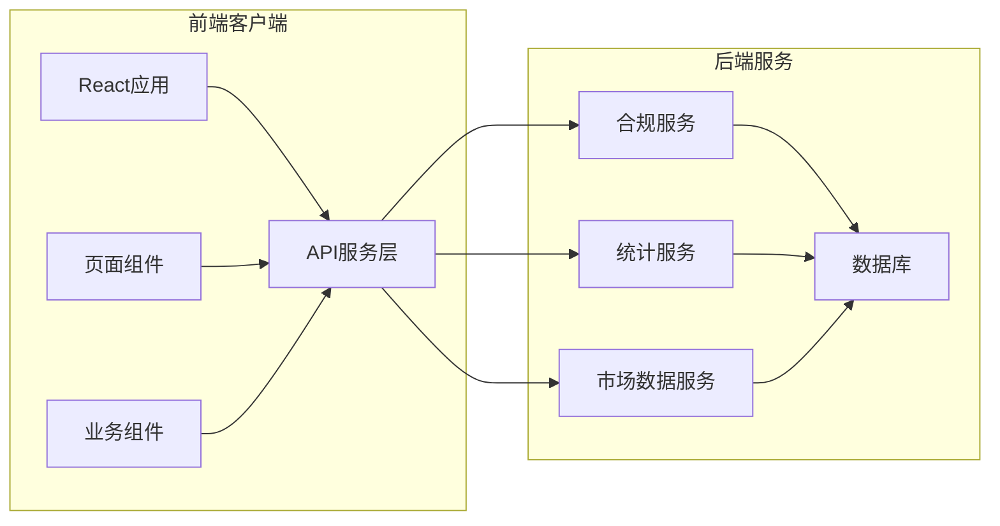
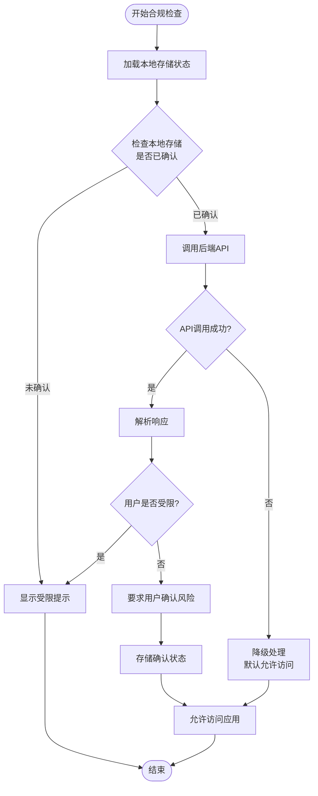
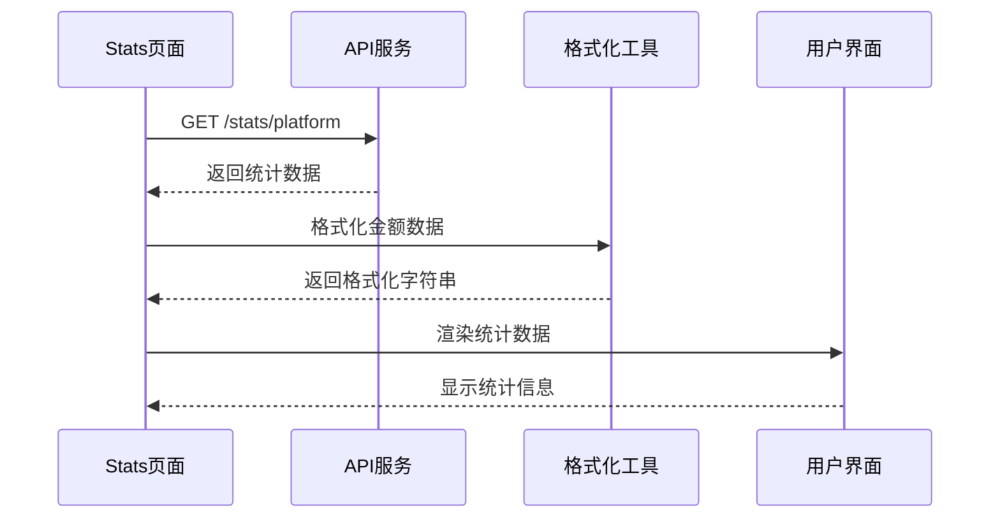
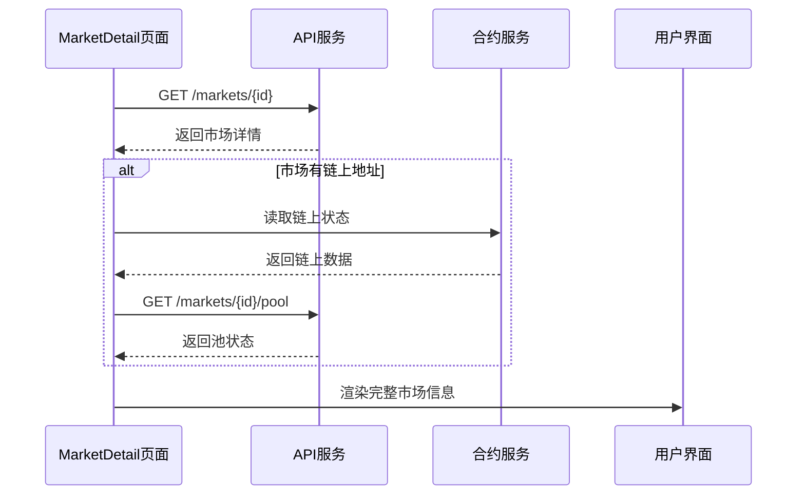
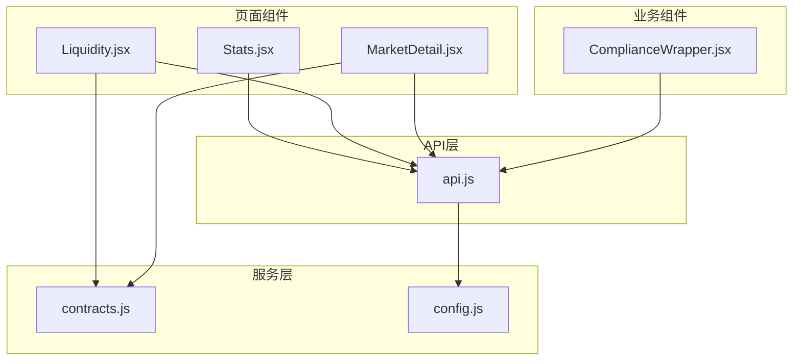

# 合规与统计API

<cite>
**本文档引用的文件**
- [api.js](file://src/services/api.js)
- [Stats.jsx](file://src/pages/Stats.jsx)
- [Liquidity.jsx](file://src/pages/Liquidity.jsx)
- [MarketDetail.jsx](file://src/pages/MarketDetail.jsx)
- [ComplianceWrapper.jsx](file://src/components/ComplianceWrapper.jsx)
- [contracts.js](file://src/services/contracts.js)
- [config.js](file://src/config.js)
</cite>

## 目录
1. [简介](#简介)
2. [项目结构](#项目结构)
3. [核心组件](#核心组件)
4. [架构概览](#架构概览)
5. [详细组件分析](#详细组件分析)
6. [依赖关系分析](#依赖关系分析)
7. [性能考虑](#性能考虑)
8. [故障排除指南](#故障排除指南)
9. [结论](#结论)

## 简介

本文档详细记录了PredictionDIDSimple前端项目中的合规与统计API接口。该系统提供了三个核心功能模块：

1. **合规检查API** - `/compliance/restricted` 接口用于检查用户是否在受限地区
2. **平台统计API** - `/stats/platform` 接口提供平台整体运营数据
3. **市场数据API** - `/markets/{id}/pool` 和 `/markets/{id}/orderbook` 接口提供市场流动性池状态和订单簿数据

这些API接口与前端组件紧密集成，为用户提供完整的合规验证、平台统计展示和市场数据分析功能。

## 项目结构

前端项目采用React + Vite架构，主要文件组织如下：



**图表来源**
- [api.js](file://src/services/api.js#L168-L186)
- [config.js](file://src/config.js#L1-L23)

**章节来源**
- [api.js](file://src/services/api.js#L1-L187)
- [config.js](file://src/config.js#L1-L23)

## 核心组件

### API服务层

API服务层位于`src/services/api.js`，提供了统一的HTTP请求封装和错误处理机制：



**图表来源**
- [api.js](file://src/services/api.js#L29-L55)
- [api.js](file://src/services/api.js#L168-L186)

### 合规检查组件

合规检查组件位于`src/components/ComplianceWrapper.jsx`，负责在用户访问应用前进行地理围栏检查：



**图表来源**
- [ComplianceWrapper.jsx](file://src/components/ComplianceWrapper.jsx#L20-L30)
- [api.js](file://src/services/api.js#L168-L171)

**章节来源**
- [api.js](file://src/services/api.js#L168-L186)
- [ComplianceWrapper.jsx](file://src/components/ComplianceWrapper.jsx#L1-L44)

## 架构概览

系统采用前后端分离架构，前端通过API服务层与后端进行通信：



**图表来源**
- [api.js](file://src/services/api.js#L29-L55)
- [config.js](file://src/config.js#L8-L9)

## 详细组件分析

### 合规检查API

#### 接口定义

**GET /compliance/restricted**

用于检查用户是否在受限地区，防止特定地理区域的用户访问平台。

**请求参数**
- 无

**响应结构**
```json
{
  "restricted": true
}
```

**数据格式说明**
- `restricted`: boolean - 用户是否在受限地区

**错误处理**
- 网络错误：返回HTTP 500
- 服务器错误：返回错误信息对象

#### 合规检查流程



**图表来源**
- [ComplianceWrapper.jsx](file://src/components/ComplianceWrapper.jsx#L20-L30)
- [api.js](file://src/services/api.js#L168-L171)

**章节来源**
- [ComplianceWrapper.jsx](file://src/components/ComplianceWrapper.jsx#L16-L44)
- [api.js](file://src/services/api.js#L168-L171)

### 平台统计API

#### 接口定义

**GET /stats/platform**

获取平台整体运营统计数据，包括成交量、用户数、TVL等关键指标。

**请求参数**
- 无

**响应结构**
```json
{
  "trade_count": 1234,
  "trade_volume": "1234567890",
  "fees_collected": "12345678",
  "active_users": 567,
  "open_markets": 89,
  "tvl_approx": "9876543210"
}
```

**数据格式说明**
- `trade_count`: number - 成交笔数
- `trade_volume`: string - 成交总量（mUSDC）
- `fees_collected`: string - 估算手续费收入（mUSDC）
- `active_users`: number - 活跃用户数
- `open_markets`: number - 开放市场数量
- `tvl_approx`: string - TVL近似值（mUSDC）

#### 统计页面实现

统计页面组件位于`src/pages/Stats.jsx`，负责展示平台统计数据：



**图表来源**
- [Stats.jsx](file://src/pages/Stats.jsx#L17-L19)
- [Stats.jsx](file://src/pages/Stats.jsx#L31-L41)

**章节来源**
- [Stats.jsx](file://src/pages/Stats.jsx#L1-L46)
- [api.js](file://src/services/api.js#L173-L176)

### 市场数据API

#### 流动性池状态API

**GET /markets/{id}/pool**

获取指定市场的流动性池状态，包括储备量和价格信息。

**路径参数**
- `id`: string - 市场ID

**响应结构**
```json
{
  "market_type": "BINARY_V3",
  "reserve_yes": "1234567890",
  "reserve_no": "9876543210",
  "price_yes_bps": 1234
}
```

**数据格式说明**
- `market_type`: string - 市场类型
- `reserve_yes`: string - Yes方向储备量（mUSDC）
- `reserve_no`: string - No方向储备量（mUSDC）
- `price_yes_bps`: number - Yes方向价格（bps）

#### 订单簿数据API

**GET /markets/{id}/orderbook**

获取指定市场的订单簿数据，用于展示市场深度和价格水平。

**路径参数**
- `id`: string - 市场ID

**响应结构**
```json
{
  "bids": [
    {"price": 0.45, "amount": "123456789"},
    {"price": 0.44, "amount": "987654321"}
  ],
  "asks": [
    {"price": 0.55, "amount": "123456789"},
    {"price": 0.56, "amount": "987654321"}
  ]
}
```

**数据格式说明**
- `bids`: array - 买单数组，按价格降序排列
- `asks`: array - 卖单数组，按价格升序排列
- `price`: number - 订单价格（概率）
- `amount`: string - 订单数量（mUSDC）

#### 市场数据集成

市场详情页面集成了多个数据源来提供完整的市场信息：



**图表来源**
- [MarketDetail.jsx](file://src/pages/MarketDetail.jsx#L55-L70)
- [MarketDetail.jsx](file://src/pages/MarketDetail.jsx#L64-L68)

**章节来源**
- [api.js](file://src/services/api.js#L178-L186)
- [MarketDetail.jsx](file://src/pages/MarketDetail.jsx#L1-L185)
- [Liquidity.jsx](file://src/pages/Liquidity.jsx#L1-L117)

## 依赖关系分析

### 组件间依赖关系



**图表来源**
- [api.js](file://src/services/api.js#L1-L187)
- [Stats.jsx](file://src/pages/Stats.jsx#L1-L46)
- [Liquidity.jsx](file://src/pages/Liquidity.jsx#L1-L117)
- [MarketDetail.jsx](file://src/pages/MarketDetail.jsx#L1-L185)
- [ComplianceWrapper.jsx](file://src/components/ComplianceWrapper.jsx#L1-L44)

### 数据流分析

系统中的数据流遵循以下模式：

1. **API调用**：组件通过API服务层发起HTTP请求
2. **数据处理**：API服务层处理响应和错误
3. **状态更新**：组件更新本地状态并重新渲染
4. **格式化显示**：使用格式化工具将链上数据转换为用户友好的格式

**章节来源**
- [api.js](file://src/services/api.js#L29-L55)
- [contracts.js](file://src/services/contracts.js#L24-L35)

## 性能考虑

### 缓存策略

- **本地存储缓存**：合规确认状态存储在localStorage中，避免重复验证
- **请求去重**：API服务层提供统一的请求封装，减少重复代码
- **懒加载**：市场数据按需加载，避免不必要的网络请求

### 错误处理优化

- **降级处理**：合规检查失败时默认允许访问，提高用户体验
- **容错机制**：API调用失败时提供默认值，防止应用崩溃
- **超时控制**：合理设置请求超时时间，避免长时间等待

### 数据格式化

- **批量格式化**：USDC金额统一使用6位小数格式化
- **链上数据同步**：同时获取链上和API数据，确保信息准确性

## 故障排除指南

### 常见问题及解决方案

**合规检查失败**
- 检查网络连接是否正常
- 确认API基础URL配置正确
- 查看浏览器控制台错误信息

**统计数据加载失败**
- 验证后端服务是否正常运行
- 检查API响应格式是否符合预期
- 确认数据格式化函数正常工作

**市场数据获取失败**
- 检查市场ID是否有效
- 验证合约地址配置
- 确认钱包连接状态

### 调试建议

1. **启用开发模式**：使用Vite的开发服务器进行调试
2. **查看网络请求**：使用浏览器开发者工具监控API调用
3. **检查状态管理**：验证组件状态更新逻辑
4. **测试错误边界**：模拟各种错误场景验证错误处理

**章节来源**
- [api.js](file://src/services/api.js#L49-L54)
- [ComplianceWrapper.jsx](file://src/components/ComplianceWrapper.jsx#L28-L29)

## 结论

PredictionDIDSimple项目的合规与统计API系统提供了完整的前端数据访问层，具有以下特点：

1. **模块化设计**：清晰的API服务层分离，便于维护和扩展
2. **错误处理**：完善的错误处理机制，提升用户体验
3. **性能优化**：合理的缓存策略和数据格式化
4. **安全性**：合规检查确保平台遵守法律法规

该系统为预测市场平台提供了坚实的技术基础，支持合规运营、数据透明和用户体验优化。通过标准化的API接口和组件化的设计，系统具备良好的可扩展性和可维护性。