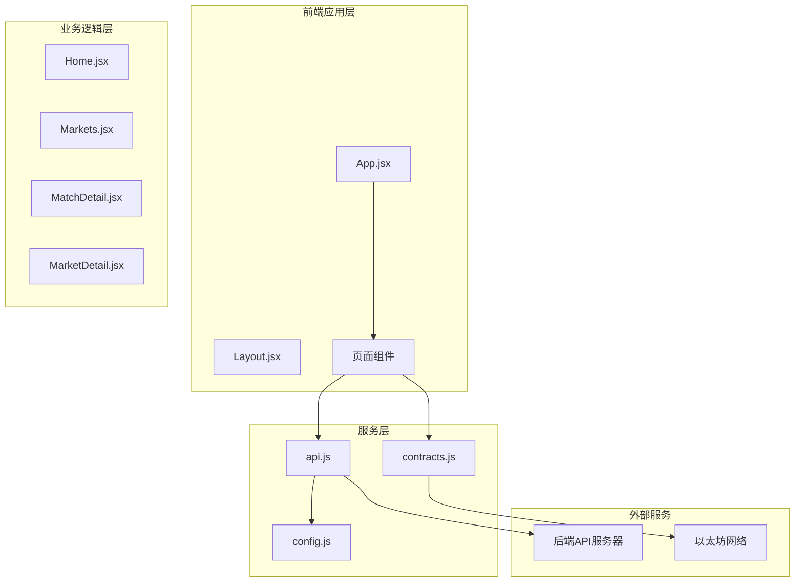
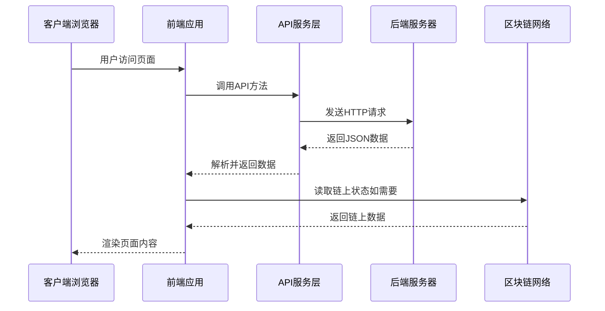
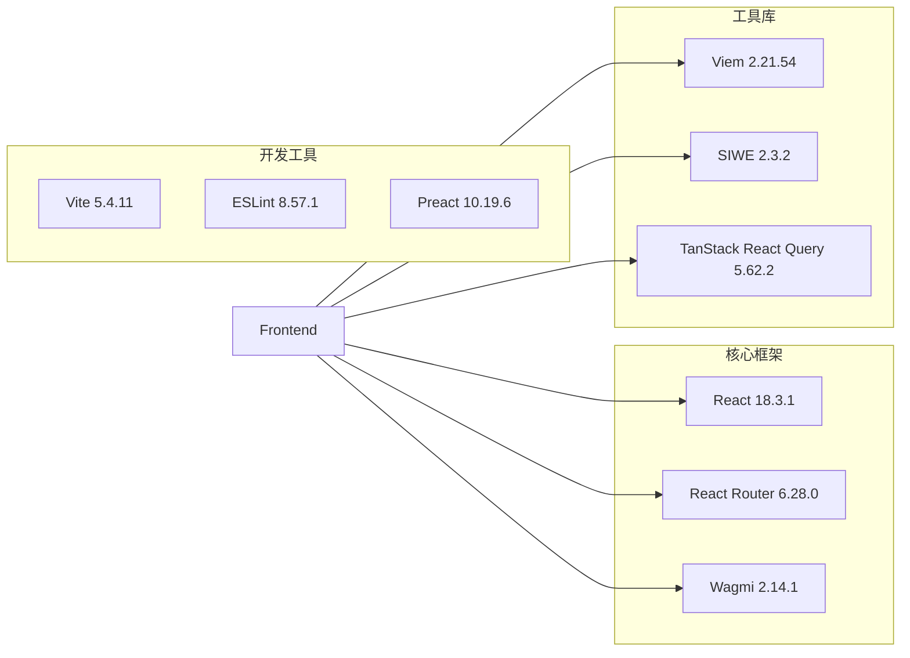
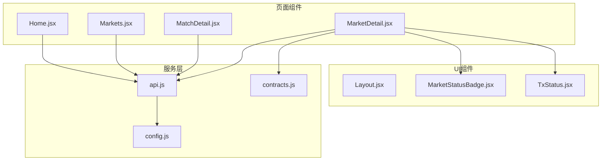

# 市场数据API

<cite>
**本文档引用的文件**
- [api.js](file://src/services/api.js)
- [config.js](file://src/config.js)
- [Home.jsx](file://src/pages/Home.jsx)
- [Markets.jsx](file://src/pages/Markets.jsx)
- [MatchDetail.jsx](file://src/pages/MatchDetail.jsx)
- [MarketDetail.jsx](file://src/pages/MarketDetail.jsx)
- [App.jsx](file://src/App.jsx)
- [contracts.js](file://src/services/contracts.js)
- [package.json](file://package.json)
</cite>

## 目录
1. [简介](#简介)
2. [项目结构](#项目结构)
3. [核心组件](#核心组件)
4. [架构概览](#架构概览)
5. [详细组件分析](#详细组件分析)
6. [依赖关系分析](#依赖关系分析)
7. [性能考虑](#性能考虑)
8. [故障排除指南](#故障排除指南)
9. [结论](#结论)

## 简介

本文档详细记录了PredictionDIDSimple项目的市场数据API接口，包括赛事和预测市场的数据接口。该系统基于React前端应用，通过RESTful API与后端服务通信，提供完整的预测市场数据查询、展示和交互功能。

系统主要包含以下核心API接口：
- `/matches` - 赛事列表查询
- `/matches/:id` - 单个赛事详情
- `/markets` - 预测市场列表查询  
- `/markets/:id` - 单个市场详情
- `/markets/:id/pool` - 市场流动性池状态
- `/markets/:id/orderbook` - 市场订单簿数据

## 项目结构

该前端应用采用模块化架构设计，主要分为以下几个层次：



**图表来源**
- [App.jsx](file://src/App.jsx#L30-L67)
- [api.js](file://src/services/api.js#L1-L187)
- [config.js](file://src/config.js#L1-L23)

**章节来源**
- [App.jsx](file://src/App.jsx#L30-L67)
- [package.json](file://package.json#L1-L30)

## 核心组件

### API服务层

API服务层提供了统一的HTTP请求封装，支持JWT认证、错误处理和参数序列化。

#### 核心API方法

| 方法 | 功能 | 参数 | 返回值 |
|------|------|------|--------|
| `listMatches(params)` | 获取赛事列表 | 分页参数对象 | 赛事列表数据 |
| `getMatch(id)` | 获取单个赛事详情 | 赛事ID | 赛事详细信息 |
| `listMarkets(params)` | 获取市场列表 | 分页和过滤参数 | 市场列表数据 |
| `getMarket(id)` | 获取单个市场详情 | 市场ID | 市场详细信息 |
| `getMarketPool(id)` | 获取市场池状态 | 市场ID | 池状态数据 |
| `getMarketOrderbook(id)` | 获取订单簿数据 | 市场ID | 订单簿数据 |

#### 认证机制

系统支持两种认证方式：
- **JWT令牌认证**：通过localStorage存储JWT令牌
- **SIWE（Sign-In With Ethereum）**：基于以太坊签名的身份验证

**章节来源**
- [api.js](file://src/services/api.js#L22-L91)
- [config.js](file://src/config.js#L1-L23)

### 页面组件层

#### 首页组件（Home）

负责展示API连接状态和即将开始/进行中的赛事列表。

#### 市场列表组件（Markets）

展示所有已创建的预测市场及其池信息，支持分页显示。

#### 赛事详情组件（MatchDetail）

展示单场赛事的详细信息和关联的预测市场列表。

#### 市场详情组件（MarketDetail）

展示单个预测市场的详细信息，包括下注操作界面和实时池状态。

**章节来源**
- [Home.jsx](file://src/pages/Home.jsx#L1-L83)
- [Markets.jsx](file://src/pages/Markets.jsx#L1-L56)
- [MatchDetail.jsx](file://src/pages/MatchDetail.jsx#L1-L64)
- [MarketDetail.jsx](file://src/pages/MarketDetail.jsx#L1-L185)

## 架构概览

系统采用前后端分离架构，前端通过RESTful API与后端通信：



**图表来源**
- [api.js](file://src/services/api.js#L29-L55)
- [MarketDetail.jsx](file://src/pages/MarketDetail.jsx#L54-L70)

## 详细组件分析

### 赛事查询接口

#### 接口定义

**GET** `/matches`

##### 查询参数

| 参数名 | 类型 | 必填 | 默认值 | 描述 |
|--------|------|------|--------|------|
| `limit` | number | 否 | 50 | 返回记录数量限制 |
| `offset` | number | 否 | 0 | 分页偏移量 |
| `status` | string | 否 | 无 | 赛事状态过滤 |
| `sort` | string | 否 | `kickoff_at` | 排序字段 |
| `order` | string | 否 | `asc` | 排序方向 |

##### 响应数据结构

```javascript
{
  "items": [
    {
      "id": "string",
      "home_team": "string",
      "away_team": "string", 
      "kickoff_at": "datetime",
      "status": "string",
      "home_score": "number|null",
      "away_score": "number|null"
    }
  ],
  "total": "number",
  "page": "number",
  "limit": "number"
}
```

#### 实际使用示例

```javascript
// 获取最近10场比赛
await listMatches({ limit: 10 });

// 获取进行中的比赛
await listMatches({ status: 'LIVE' });

// 分页查询
await listMatches({ limit: 20, offset: 40 });
```

**章节来源**
- [api.js](file://src/services/api.js#L69-L74)
- [Home.jsx](file://src/pages/Home.jsx#L28-L31)

### 赛事详情接口

#### 接口定义

**GET** `/matches/:id`

##### 路径参数

| 参数名 | 类型 | 必填 | 描述 |
|--------|------|------|------|
| `id` | string | 是 | 赛事唯一标识符 |

##### 响应数据结构

```javascript
{
  "match": {
    "id": "string",
    "home_team": "string",
    "away_team": "string",
    "kickoff_at": "datetime",
    "status": "string",
    "home_score": "number|null",
    "away_score": "number|null"
  },
  "markets": [
    {
      "id": "string",
      "question": "string",
      "status": "string"
    }
  ]
}
```

**章节来源**
- [api.js](file://src/services/api.js#L76-L79)
- [MatchDetail.jsx](file://src/pages/MatchDetail.jsx#L12-L30)

### 市场查询接口

#### 接口定义

**GET** `/markets`

##### 查询参数

| 参数名 | 类型 | 必填 | 默认值 | 描述 |
|--------|------|------|--------|------|
| `limit` | number | 否 | 50 | 返回记录数量限制 |
| `offset` | number | 否 | 0 | 分页偏移量 |
| `status` | string | 否 | 无 | 市场状态过滤 |
| `match_id` | string | 否 | 无 | 关联赛事ID过滤 |
| `market_type` | string | 否 | 无 | 市场类型过滤 |
| `sort` | string | 否 | `end_time` | 排序字段 |
| `order` | string | 否 | `asc` | 排序方向 |

##### 响应数据结构

```javascript
{
  "items": [
    {
      "id": "string",
      "question": "string",
      "status": "string",
      "market_type": "string",
      "end_time": "datetime",
      "match": {
        "id": "string",
        "home_team": "string",
        "away_team": "string"
      },
      "yes_pool": "string",
      "no_pool": "string",
      "outcome_count": "number"
    }
  ],
  "total": "number",
  "page": "number",
  "limit": "number"
}
```

#### 实际使用示例

```javascript
// 获取所有市场（默认限制50条）
await listMarkets();

// 获取特定状态的市场
await listMarkets({ status: 'OPEN' });

// 获取特定赛事关联的市场
await listMarkets({ match_id: '123' });

// 获取多结果市场
await listMarkets({ market_type: 'MULTI' });
```

**章节来源**
- [api.js](file://src/services/api.js#L81-L86)
- [Markets.jsx](file://src/pages/Markets.jsx#L20-L25)

### 市场详情接口

#### 接口定义

**GET** `/markets/:id`

##### 路径参数

| 参数名 | 类型 | 必填 | 描述 |
|--------|------|------|------|
| `id` | string | 是 | 市场唯一标识符 |

##### 响应数据结构

```javascript
{
  "market": {
    "id": "string",
    "question": "string", 
    "status": "string",
    "market_type": "string",
    "end_time": "datetime",
    "collateral_address": "string",
    "market_address": "string",
    "match": {
      "id": "string",
      "home_team": "string",
      "away_team": "string",
      "status": "string"
    },
    "yes_pool": "string",
    "no_pool": "string",
    "outcome_count": "number"
  },
  "access": {
    "requires_vc": "boolean",
    "allowed": "boolean",
    "credential_type": "string"
  }
}
```

#### 实际使用示例

```javascript
// 获取特定市场详情
await getMarket('market-id-123');

// 结合链上状态读取
const marketData = await getMarket('market-id-123');
if (marketData.market.market_address) {
  const poolState = await getMarketPool('market-id-123');
}
```

**章节来源**
- [api.js](file://src/services/api.js#L88-L91)
- [MarketDetail.jsx](file://src/pages/MarketDetail.jsx#L54-L70)

### 市场池状态接口

#### 接口定义

**GET** `/markets/:id/pool`

##### 路径参数

| 参数名 | 类型 | 必填 | 描述 |
|--------|------|------|------|
| `id` | string | 是 | 市场唯一标识符 |

##### 响应数据结构

```javascript
{
  "reserveYes": "string",
  "reserveNo": "string", 
  "priceYesBps": "string",
  "priceNoBps": "string"
}
```

**章节来源**
- [api.js](file://src/services/api.js#L178-L181)
- [MarketDetail.jsx](file://src/pages/MarketDetail.jsx#L67-L69)

### 市场订单簿接口

#### 接口定义

**GET** `/markets/:id/orderbook`

##### 路径参数

| 参数名 | 类型 | 必填 | 描述 |
|--------|------|------|------|
| `id` | string | 是 | 市场唯一标识符 |

##### 响应数据结构

```javascript
{
  "bids": [
    {
      "price": "string",
      "amount": "string",
      "total": "string"
    }
  ],
  "asks": [
    {
      "price": "string", 
      "amount": "string",
      "total": "string"
    }
  ]
}
```

**章节来源**
- [api.js](file://src/services/api.js#L183-L186)

## 依赖关系分析

### 外部依赖

系统使用以下关键依赖：



**图表来源**
- [package.json](file://package.json#L12-L29)

### 内部模块依赖



**图表来源**
- [Home.jsx](file://src/pages/Home.jsx#L1-L83)
- [Markets.jsx](file://src/pages/Markets.jsx#L1-L56)
- [MatchDetail.jsx](file://src/pages/MatchDetail.jsx#L1-L64)
- [MarketDetail.jsx](file://src/pages/MarketDetail.jsx#L1-L185)

**章节来源**
- [package.json](file://package.json#L12-L29)

## 性能考虑

### API调用优化

1. **分页策略**：默认限制50条记录，避免一次性加载过多数据
2. **缓存机制**：利用浏览器缓存和React Query进行数据缓存
3. **并发请求**：合理安排API调用顺序，避免阻塞用户操作

### 前端性能优化

1. **懒加载**：路由级别的组件懒加载
2. **虚拟滚动**：大量数据时使用虚拟滚动技术
3. **状态管理**：使用React状态管理减少不必要的重渲染

### 区块链交互优化

1. **批量读取**：使用Promise.all并行读取多个链上状态
2. **本地缓存**：缓存链上状态到本地存储
3. **交易确认**：合理设置交易确认等待时间

## 故障排除指南

### 常见错误类型

| 错误类型 | 描述 | 解决方案 |
|----------|------|----------|
| API连接失败 | 后端服务不可达 | 检查API基础URL配置 |
| 认证失败 | JWT令牌过期或无效 | 重新登录获取新令牌 |
| 数据格式错误 | API响应格式不符合预期 | 检查后端API版本兼容性 |
| 区块链连接失败 | MetaMask或其他钱包连接异常 | 检查网络配置和钱包状态 |

### 调试技巧

1. **网络监控**：使用浏览器开发者工具监控API请求
2. **状态检查**：检查localStorage中的JWT令牌状态
3. **错误日志**：查看控制台中的详细错误信息

### 环境配置

确保正确的环境变量配置：

```javascript
// .env文件示例
VITE_API_URL=http://localhost:8080
VITE_CHAIN_ID=31337
VITE_MOCK_USDC_ADDRESS=0x...
VITE_MARKET_FACTORY_ADDRESS=0x...
VITE_SIWE_DOMAIN=localhost
VITE_SIWE_URI=http://localhost:5173
```

**章节来源**
- [config.js](file://src/config.js#L1-L23)
- [api.js](file://src/services/api.js#L48-L55)

## 结论

PredictionDIDSimple项目提供了一个完整的预测市场数据API解决方案，具有以下特点：

1. **完整的API覆盖**：涵盖了赛事查询、市场查询、详情获取等核心功能
2. **灵活的查询参数**：支持分页、过滤、排序等多种查询方式
3. **现代化的前端架构**：基于React和现代前端工具链构建
4. **完善的错误处理**：提供了健壮的错误处理和用户体验
5. **可扩展的设计**：模块化的架构便于功能扩展和维护

该系统为预测市场应用提供了坚实的技术基础，支持从简单的赛事查询到复杂的市场交易等各类应用场景。通过合理的API设计和前端实现，用户可以高效地获取和操作预测市场数据。