# 用户管理API

<cite>
**本文档引用的文件**
- [api.js](file://src/services/api.js)
- [useAuth.js](file://src/hooks/useAuth.js)
- [Me.jsx](file://src/pages/Me.jsx)
- [DIDProfile.jsx](file://src/pages/DIDProfile.jsx)
- [VCCard.jsx](file://src/components/VCCard.jsx)
- [Web3Provider.jsx](file://src/providers/Web3Provider.jsx)
- [App.jsx](file://src/App.jsx)
- [config.js](file://src/config.js)
- [contracts.js](file://src/services/contracts.js)
- [ComplianceWrapper.jsx](file://src/components/ComplianceWrapper.jsx)
- [WalletBar.jsx](file://src/components/WalletBar.jsx)
- [package.json](file://package.json)
</cite>

## 目录
1. [简介](#简介)
2. [项目结构](#项目结构)
3. [核心组件](#核心组件)
4. [架构概览](#架构概览)
5. [详细组件分析](#详细组件分析)
6. [依赖关系分析](#依赖关系分析)
7. [性能考虑](#性能考虑)
8. [故障排除指南](#故障排除指南)
9. [结论](#结论)

## 简介

PredictionDIDSimple 是一个基于以太坊的预测市场前端应用，采用去中心化身份(DID)和可验证凭证(VC)技术构建。该应用实现了完整的用户管理API体系，包括用户身份验证、位置管理和凭证验证等功能。

本项目的核心特色在于：
- **去中心化身份管理**：基于 DID(Decentralized Identifier) 标准的身份标识系统
- **可验证凭证验证**：支持多种类型的可验证凭证验证和管理
- **位置管理**：跟踪用户的市场持仓和交易历史
- **合规检查**：集成地理围栏和风险合规检查机制

## 项目结构

前端项目采用模块化架构设计，主要分为以下几个层次：

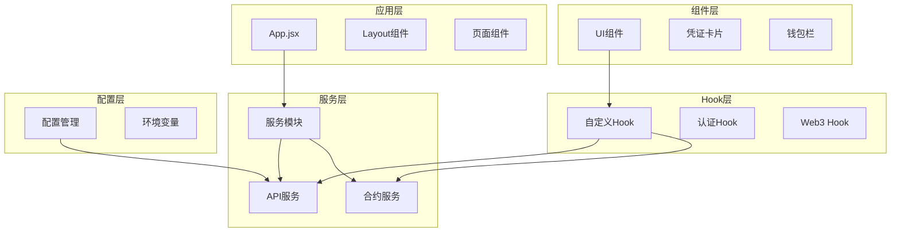

**图表来源**
- [App.jsx](file://src/App.jsx#L31-L66)
- [Web3Provider.jsx](file://src/providers/Web3Provider.jsx#L16-L24)

**章节来源**
- [App.jsx](file://src/App.jsx#L31-L66)
- [Web3Provider.jsx](file://src/providers/Web3Provider.jsx#L16-L24)
- [package.json](file://package.json#L12-L28)

## 核心组件

### 用户认证系统

用户认证系统基于 SIWE(Sign-In with Ethereum) 协议，实现了完整的去中心化身份验证流程：

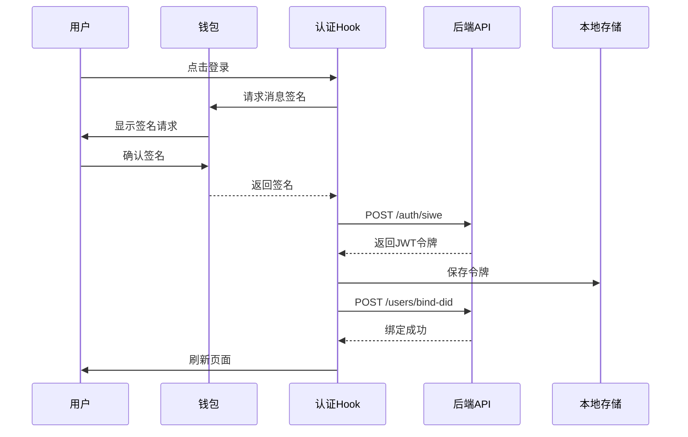

**图表来源**
- [useAuth.js](file://src/hooks/useAuth.js#L29-L80)
- [api.js](file://src/services/api.js#L94-L107)

### 位置管理系统

位置管理系统负责追踪用户的市场持仓情况：

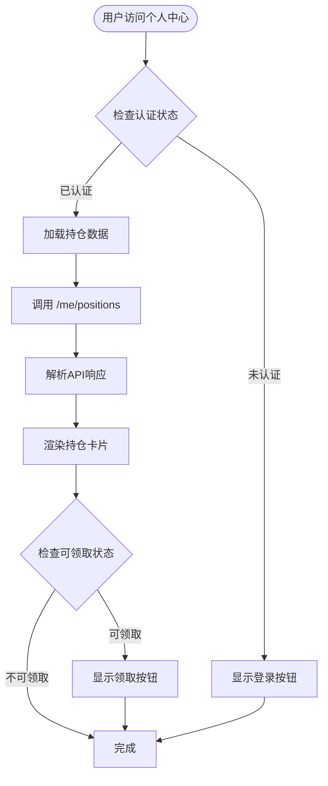

**图表来源**
- [Me.jsx](file://src/pages/Me.jsx#L35-L44)
- [api.js](file://src/services/api.js#L109-L112)

### 凭证管理系统

凭证管理系统支持用户查看和管理可验证凭证：

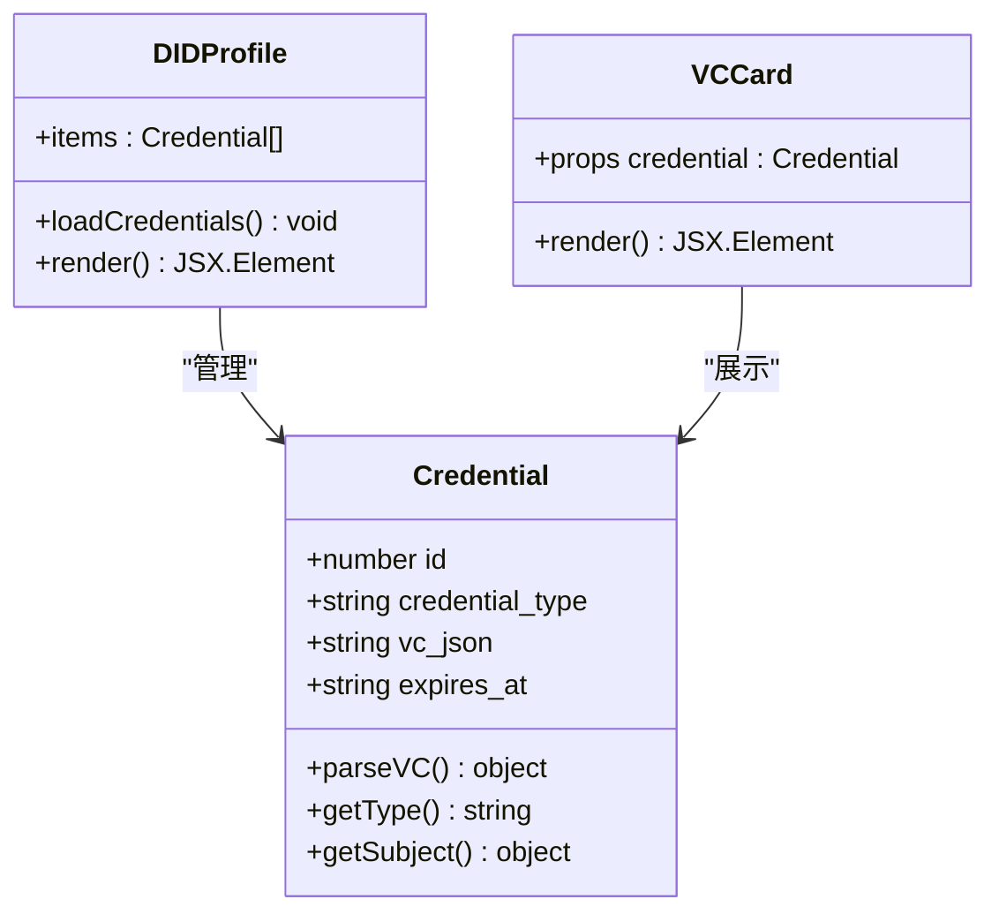

**图表来源**
- [DIDProfile.jsx](file://src/pages/DIDProfile.jsx#L16-L30)
- [VCCard.jsx](file://src/components/VCCard.jsx#L6-L34)

**章节来源**
- [useAuth.js](file://src/hooks/useAuth.js#L16-L109)
- [Me.jsx](file://src/pages/Me.jsx#L22-L104)
- [DIDProfile.jsx](file://src/pages/DIDProfile.jsx#L16-L68)
- [VCCard.jsx](file://src/components/VCCard.jsx#L6-L34)

## 架构概览

应用采用前后端分离架构，前端使用 React + Vite 构建，集成了 Web3 生态系统的多个关键组件：

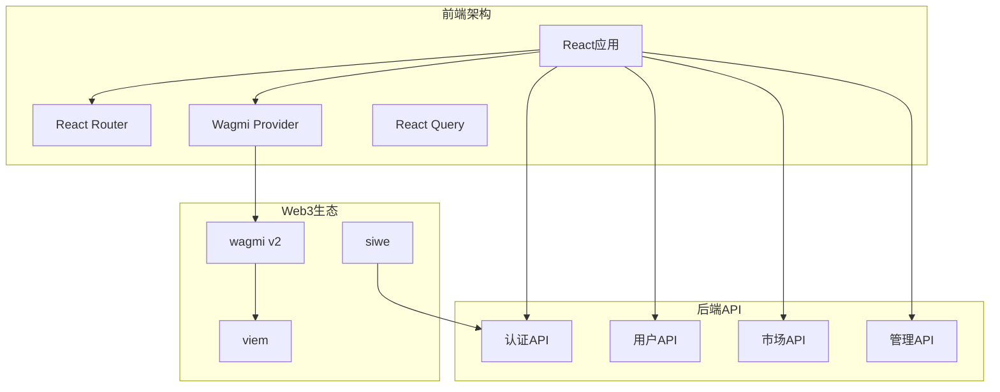

**图表来源**
- [Web3Provider.jsx](file://src/providers/Web3Provider.jsx#L16-L24)
- [package.json](file://package.json#L12-L28)

### 数据流架构

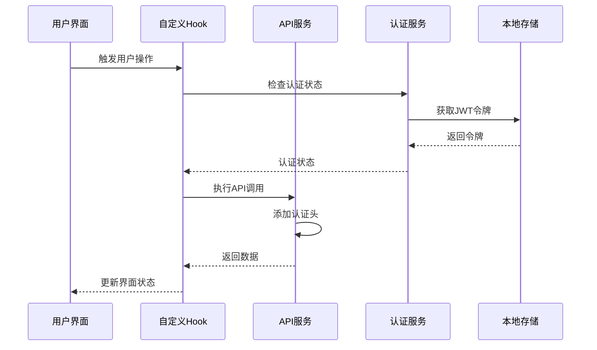

**图表来源**
- [api.js](file://src/services/api.js#L29-L55)
- [useAuth.js](file://src/hooks/useAuth.js#L25-L26)

**章节来源**
- [Web3Provider.jsx](file://src/providers/Web3Provider.jsx#L16-L24)
- [config.js](file://src/config.js#L7-L22)
- [api.js](file://src/services/api.js#L29-L55)

## 详细组件分析

### 用户认证组件 (useAuth.js)

用户认证组件是整个应用的核心，实现了基于 SIWE 的去中心化身份验证：

#### 主要功能特性

1. **SIWE 消息构造**：根据配置生成标准的 SIWE 登录消息
2. **签名处理**：与用户钱包交互获取消息签名
3. **令牌管理**：处理 JWT 令牌的获取、存储和刷新
4. **DID 绑定**：将去中心化身份绑定到用户账户

#### 认证流程

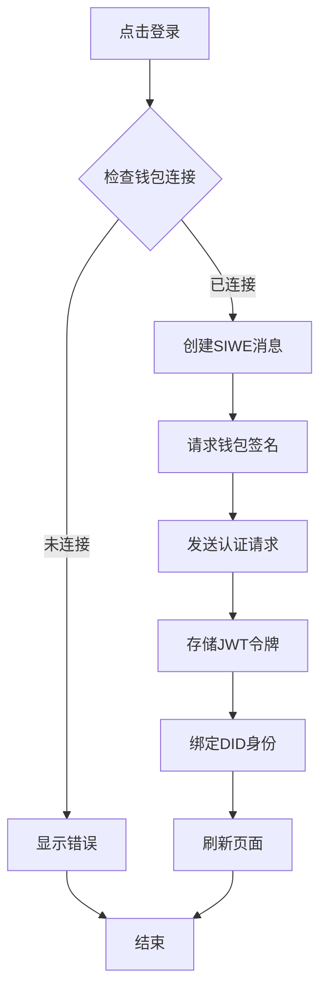

**图表来源**
- [useAuth.js](file://src/hooks/useAuth.js#L29-L80)

**章节来源**
- [useAuth.js](file://src/hooks/useAuth.js#L16-L109)

### 个人中心组件 (Me.jsx)

个人中心组件展示了用户的持仓信息和相关操作：

#### 核心功能

1. **持仓数据展示**：实时显示用户的市场持仓情况
2. **Claim 操作**：处理已结算市场的奖金领取
3. **状态管理**：管理交易状态和错误信息
4. **认证集成**：与认证系统无缝集成

#### 持仓卡片渲染

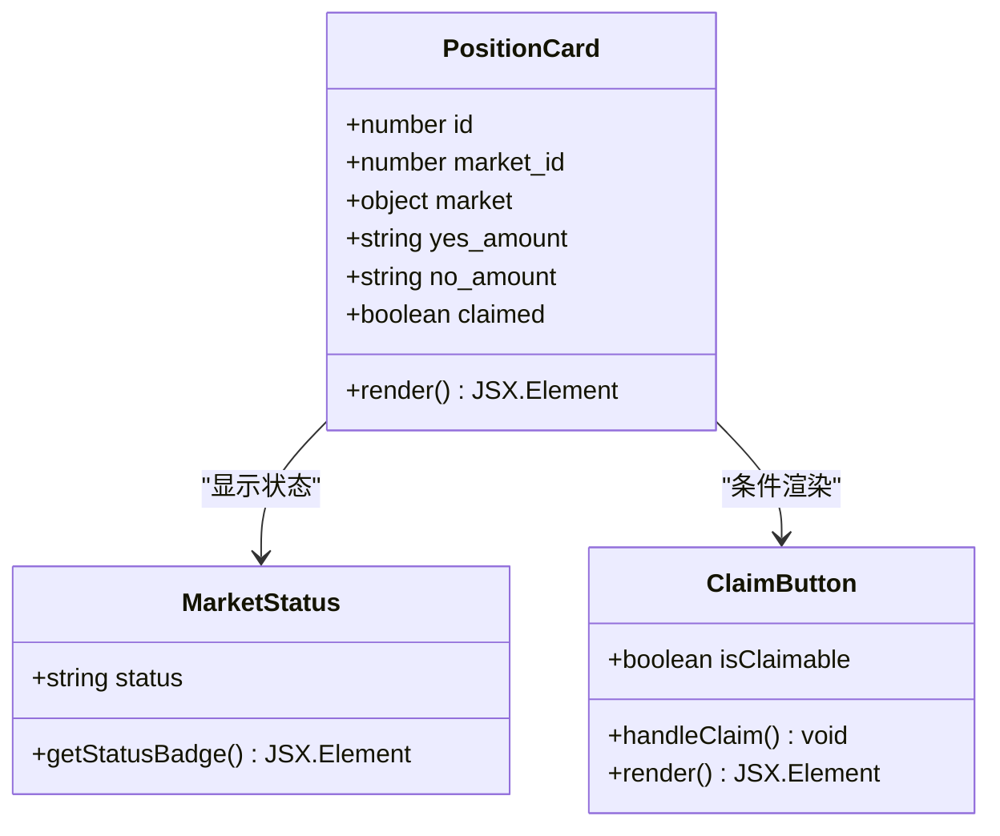

**图表来源**
- [Me.jsx](file://src/pages/Me.jsx#L80-L99)

**章节来源**
- [Me.jsx](file://src/pages/Me.jsx#L22-L104)

### DID 身份管理 (DIDProfile.jsx)

DID 身份管理组件提供了用户去中心化身份的可视化展示：

#### 主要特性

1. **DID 生成**：根据钱包地址动态生成 DID 标识符
2. **凭证展示**：以卡片形式展示用户的可验证凭证
3. **认证集成**：与用户认证状态联动
4. **错误处理**：优雅处理各种异常情况

#### 凭证卡片组件

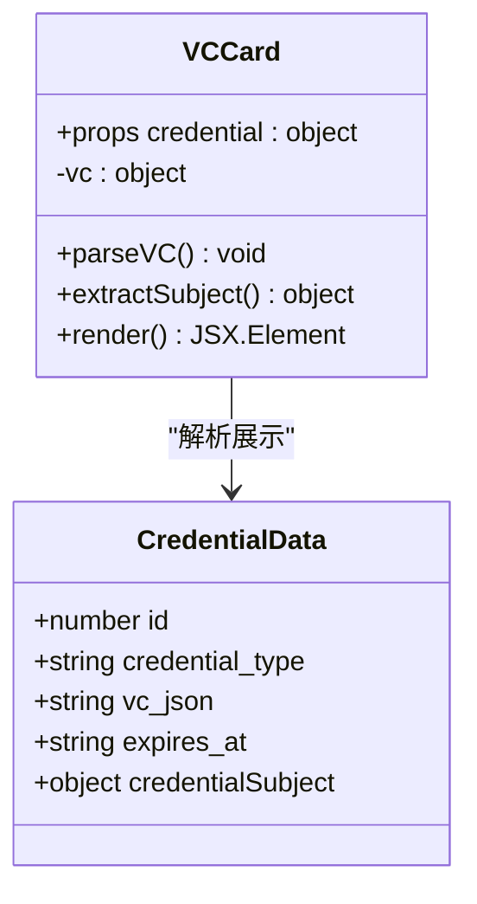

**图表来源**
- [VCCard.jsx](file://src/components/VCCard.jsx#L6-L34)

**章节来源**
- [DIDProfile.jsx](file://src/pages/DIDProfile.jsx#L16-L68)
- [VCCard.jsx](file://src/components/VCCard.jsx#L6-L34)

### 合规检查系统

合规检查系统确保应用符合不同地区的法律法规要求：

#### 合规流程

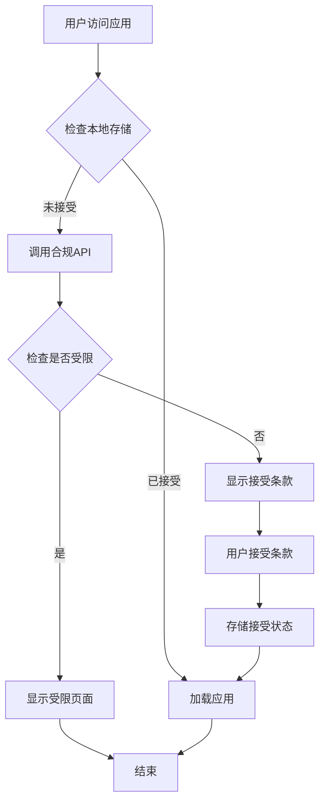

**图表来源**
- [ComplianceWrapper.jsx](file://src/components/ComplianceWrapper.jsx#L21-L30)

**章节来源**
- [ComplianceWrapper.jsx](file://src/components/ComplianceWrapper.jsx#L16-L44)

## 依赖关系分析

### 核心依赖关系

```mermaid
graph TB
subgraph "应用依赖"
React[react 18.3.1]
Router[react-router-dom 6.28.0]
Wagmi[wagmi 2.14.1]
Viem[viem 2.21.54]
Query[@tanstack/react-query 5.62.2]
end
subgraph "认证依赖"
SIWE[siwe 2.3.2]
JWT[JWT令牌]
end
subgraph "开发依赖"
Vite[vite 5.4.11]
ESLint[eslint 8.57.1]
end
App --> React
App --> Router
App --> Wagmi
App --> SIWE
Wagmi --> Viem
App --> Query
App --> JWT
```

**图表来源**
- [package.json](file://package.json#L12-L28)

### 组件间依赖关系

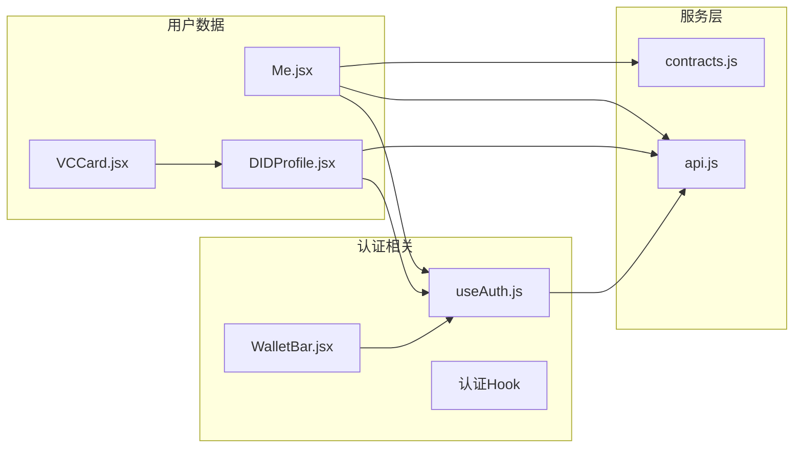

**图表来源**
- [useAuth.js](file://src/hooks/useAuth.js#L9-L10)
- [Me.jsx](file://src/pages/Me.jsx#L8-L12)
- [DIDProfile.jsx](file://src/pages/DIDProfile.jsx#L5-L10)

**章节来源**
- [package.json](file://package.json#L12-L28)

## 性能考虑

### 缓存策略

应用采用了多层次的缓存策略来优化性能：

1. **React Query 缓存**：自动管理 API 响应缓存
2. **本地存储**：持久化用户认证状态
3. **浏览器缓存**：静态资源的智能缓存

### 优化建议

1. **懒加载组件**：对不常用的页面组件实施懒加载
2. **虚拟滚动**：对于大量持仓数据实施虚拟滚动
3. **并发请求**：合理组织 API 请求的并发执行
4. **状态压缩**：减少不必要的状态更新

## 故障排除指南

### 常见问题及解决方案

#### 认证相关问题

| 问题 | 可能原因 | 解决方案 |
|------|----------|----------|
| 登录失败 | 钱包签名错误 | 检查钱包连接和网络设置 |
| 令牌过期 | JWT过期时间 | 重新登录获取新令牌 |
| DID绑定失败 | 签名验证失败 | 确认消息签名正确性 |

#### API调用问题

| 问题 | 可能原因 | 解决方案 |
|------|----------|----------|
| 401未授权 | 缺少或无效的JWT令牌 | 检查本地存储中的令牌 |
| 403禁止访问 | 权限不足 | 检查用户权限和角色 |
| 500服务器错误 | 后端服务异常 | 查看后端日志和健康检查 |

#### Web3交互问题

| 问题 | 可能原因 | 解决方案 |
|------|----------|----------|
| 钱包连接失败 | 网络ID不匹配 | 确认钱包网络设置 |
| 交易确认超时 | Gas费用不足 | 提高Gas价格或费用 |
| 合约调用失败 | 合约地址错误 | 验证合约部署状态 |

**章节来源**
- [api.js](file://src/services/api.js#L49-L52)
- [useAuth.js](file://src/hooks/useAuth.js#L73-L79)

## 结论

PredictionDIDSimple 项目成功实现了基于去中心化身份的用户管理API系统。该系统具有以下特点：

### 技术优势

1. **去中心化架构**：完全基于以太坊生态系统的去中心化身份验证
2. **完整的用户生命周期管理**：从认证到数据管理的全流程覆盖
3. **合规性保障**：内置地理围栏和风险合规检查机制
4. **高性能设计**：采用现代前端技术和优化策略

### 最佳实践建议

1. **安全优先**：始终验证用户权限和数据完整性
2. **用户体验**：提供清晰的错误反馈和加载状态
3. **性能优化**：合理使用缓存和异步加载策略
4. **监控告警**：建立完善的错误监控和日志系统

该系统为构建去中心化应用提供了良好的参考模板，特别是在用户身份管理和数据安全方面具有重要的借鉴意义。