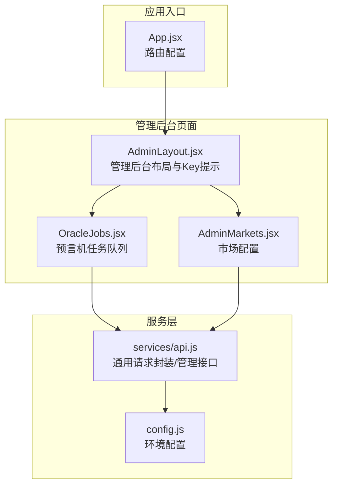
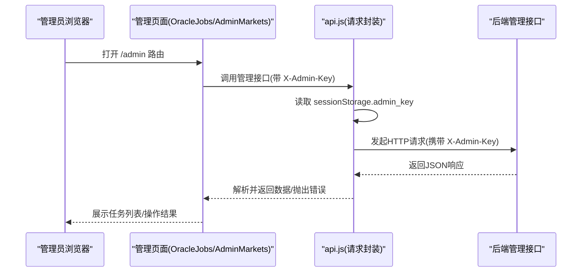
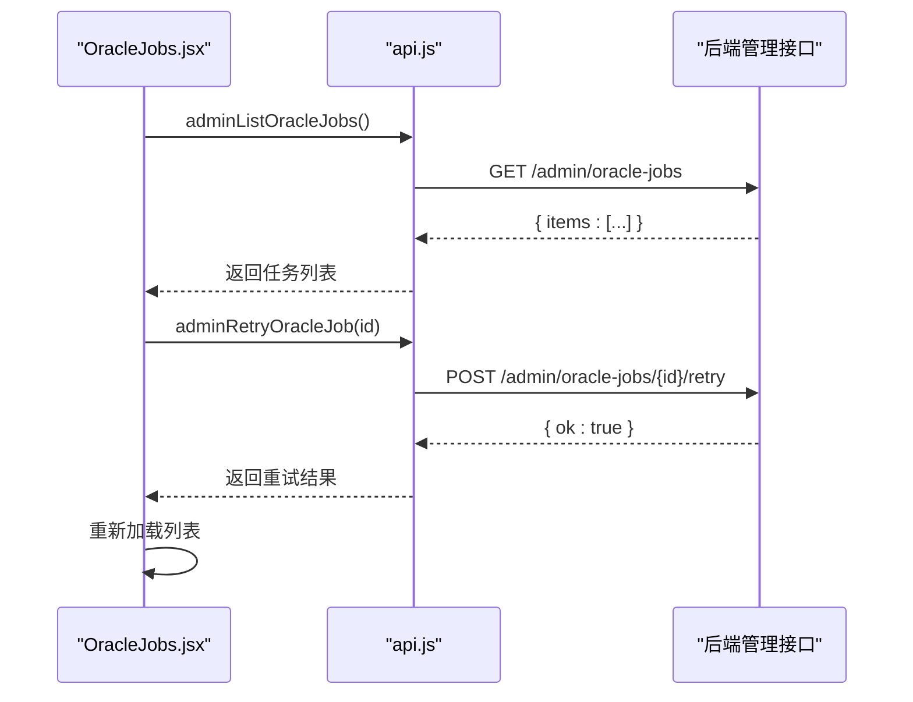
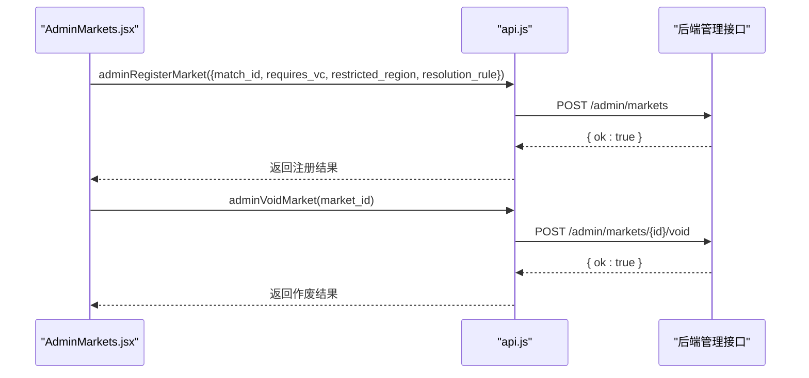
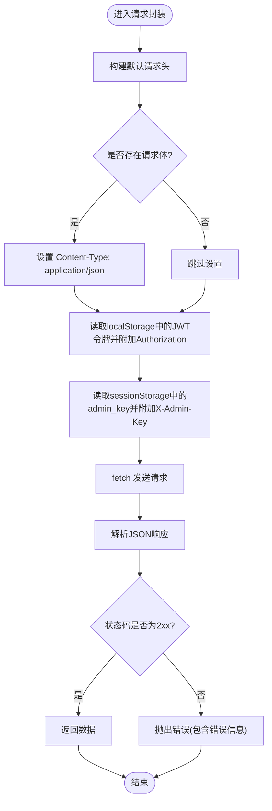
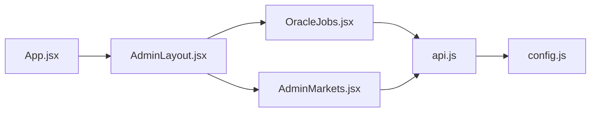

# 管理员API

<cite>
**本文引用的文件**
- [src/pages/admin/AdminLayout.jsx](file://src/pages/admin/AdminLayout.jsx)
- [src/pages/admin/AdminMarkets.jsx](file://src/pages/admin/AdminMarkets.jsx)
- [src/pages/admin/OracleJobs.jsx](file://src/pages/admin/OracleJobs.jsx)
- [src/services/api.js](file://src/services/api.js)
- [src/App.jsx](file://src/App.jsx)
- [src/config.js](file://src/config.js)
- [src/hooks/useAuth.js](file://src/hooks/useAuth.js)
- [.env.example](file://.env.example)
- [src/index.css](file://src/index.css)
</cite>

## 目录
1. [简介](#简介)
2. [项目结构](#项目结构)
3. [核心组件](#核心组件)
4. [架构总览](#架构总览)
5. [详细组件分析](#详细组件分析)
6. [依赖关系分析](#依赖关系分析)
7. [性能考虑](#性能考虑)
8. [故障排查指南](#故障排查指南)
9. [结论](#结论)
10. [附录](#附录)

## 简介
本文件面向管理员与运维人员，系统性梳理前端侧“管理员API”的实现与使用方式，覆盖以下主题：
- 管理后台路由与页面组织：/admin/oracle 预言机任务管理、/admin/markets 市场管理
- 管理员认证与权限控制：基于 sessionStorage 的管理员API Key注入与请求头传递
- 安全机制：JWT 令牌（用于普通用户认证）、管理员API Key（用于管理后台接口）
- 管理操作流程：市场注册/更新、市场作废、预言机任务列表查询、任务重试
- 运维与安全最佳实践：密钥管理、环境配置、错误处理与监控建议

## 项目结构
管理员相关前端模块集中在 src/pages/admin 下，配合 src/services/api.js 提供统一的请求封装与管理接口调用；路由在 App.jsx 中完成嵌套路由配置。

图表来源
- [src/App.jsx](file://src/App.jsx#L55-L61)
- [src/pages/admin/AdminLayout.jsx](file://src/pages/admin/AdminLayout.jsx#L8-L31)
- [src/pages/admin/OracleJobs.jsx](file://src/pages/admin/OracleJobs.jsx#L1-L67)
- [src/pages/admin/AdminMarkets.jsx](file://src/pages/admin/AdminMarkets.jsx#L1-L89)
- [src/services/api.js](file://src/services/api.js#L131-L166)
- [src/config.js](file://src/config.js#L1-L23)

章节来源
- [src/App.jsx](file://src/App.jsx#L55-L61)
- [src/pages/admin/AdminLayout.jsx](file://src/pages/admin/AdminLayout.jsx#L8-L31)
- [src/pages/admin/OracleJobs.jsx](file://src/pages/admin/OracleJobs.jsx#L1-L67)
- [src/pages/admin/AdminMarkets.jsx](file://src/pages/admin/AdminMarkets.jsx#L1-L89)
- [src/services/api.js](file://src/services/api.js#L131-L166)
- [src/config.js](file://src/config.js#L1-L23)

## 核心组件
- 管理后台布局 AdminLayout：负责渲染管理后台标题、导航与子路由出口；当未设置管理员API Key时，提示在控制台注入。
- 预言机任务管理 OracleJobs：展示任务列表、状态、比分来源、错误信息；对处于人工审核状态的任务提供“重试”按钮。
- 市场配置 AdminMarkets：提供“登记/更新市场规则”和“作废市场”两个功能区域。
- 通用请求封装与管理接口 api.js：封装 fetch 请求、JWT 令牌管理、管理员API Key注入、管理接口（预言机任务列表/重试、市场注册/作废）。
- 路由配置 App.jsx：定义 /admin 嵌套路由，分别指向 OracleJobs 与 AdminMarkets。
- 环境配置 config.js：提供 API 基础地址、链ID、SIWE 域名与URI等。
- 用户认证 useAuth.js：提供 SIWE 登录、登出、令牌存取等能力（与管理员API同域但不同凭据）。

章节来源
- [src/pages/admin/AdminLayout.jsx](file://src/pages/admin/AdminLayout.jsx#L8-L31)
- [src/pages/admin/OracleJobs.jsx](file://src/pages/admin/OracleJobs.jsx#L1-L67)
- [src/pages/admin/AdminMarkets.jsx](file://src/pages/admin/AdminMarkets.jsx#L1-L89)
- [src/services/api.js](file://src/services/api.js#L131-L166)
- [src/App.jsx](file://src/App.jsx#L55-L61)
- [src/config.js](file://src/config.js#L1-L23)
- [src/hooks/useAuth.js](file://src/hooks/useAuth.js#L16-L109)

## 架构总览
管理员API在前端侧的调用路径如下：
- 管理员在浏览器控制台注入管理员API Key 至 sessionStorage
- 管理后台页面通过 api.js 的 adminHeaders() 生成请求头 X-Admin-Key
- api.js 的 request() 统一封装 fetch，自动附加 X-Admin-Key，并处理非2xx响应
- 管理员页面调用具体管理接口（如 /admin/oracle-jobs、/admin/markets），由后端鉴权与执行

图表来源
- [src/pages/admin/OracleJobs.jsx](file://src/pages/admin/OracleJobs.jsx#L17-L21)
- [src/pages/admin/AdminMarkets.jsx](file://src/pages/admin/AdminMarkets.jsx#L21-L36)
- [src/services/api.js](file://src/services/api.js#L131-L166)
- [src/pages/admin/AdminLayout.jsx](file://src/pages/admin/AdminLayout.jsx#L9-L20)

## 详细组件分析

### 管理后台布局 AdminLayout
- 功能要点
  - 读取 sessionStorage 中的 admin_key，若为空则提示在控制台注入
  - 提供 /admin/oracle 与 /admin/markets 子路由导航
  - 作为嵌套路由出口，承载子页面内容
- 安全提示
  - 仅在本地开发/测试阶段使用 sessionStorage 注入 Key
  - 生产环境应通过受控渠道下发与轮换 Key

章节来源
- [src/pages/admin/AdminLayout.jsx](file://src/pages/admin/AdminLayout.jsx#L8-L31)

### 预言机任务管理 OracleJobs
- 功能要点
  - 首次加载与每10秒定时刷新任务列表
  - 展示任务ID、状态、问题描述、市场合约地址、比分来源、错误信息
  - 对于状态为“manual_review”的任务，提供“重试”按钮
- 数据流
  - load() 调用 adminListOracleJobs(status)，内部通过 request() 附加 X-Admin-Key
  - 点击“重试”调用 adminRetryOracleJob(id)，随后重新加载列表

图表来源
- [src/pages/admin/OracleJobs.jsx](file://src/pages/admin/OracleJobs.jsx#L17-L31)
- [src/services/api.js](file://src/services/api.js#L137-L149)

章节来源
- [src/pages/admin/OracleJobs.jsx](file://src/pages/admin/OracleJobs.jsx#L1-L67)
- [src/services/api.js](file://src/services/api.js#L137-L149)

### 市场配置 AdminMarkets
- 功能要点
  - “登记/更新市场规则”：输入赛事ID、是否需要VC、受限地区、结算规则等，调用 adminRegisterMarket
  - “作废市场”：输入市场ID，调用 adminVoidMarket
  - 成功/失败的消息提示
- 数据流
  - onRegister/onVoid 分别调用对应管理接口，内部通过 request() 附加 X-Admin-Key

图表来源
- [src/pages/admin/AdminMarkets.jsx](file://src/pages/admin/AdminMarkets.jsx#L21-L49)
- [src/services/api.js](file://src/services/api.js#L151-L166)

章节来源
- [src/pages/admin/AdminMarkets.jsx](file://src/pages/admin/AdminMarkets.jsx#L1-L89)
- [src/services/api.js](file://src/services/api.js#L151-L166)

### 通用请求封装与管理接口 api.js
- 通用请求封装 request()
  - 自动附加 Accept: application/json
  - 若存在请求体，自动设置 Content-Type: application/json
  - 从 localStorage 读取 JWT 令牌并附加 Authorization: Bearer {token}
  - 解析响应JSON，非2xx状态抛出错误
- 管理员请求头 adminHeaders()
  - 从 sessionStorage 读取 admin_key，生成 { 'X-Admin-Key': key }
- 管理接口
  - adminListOracleJobs(status)：GET /admin/oracle-jobs
  - adminRetryOracleJob(id)：POST /admin/oracle-jobs/{id}/retry
  - adminRegisterMarket(body)：POST /admin/markets
  - adminVoidMarket(id)：POST /admin/markets/{id}/void

图表来源
- [src/services/api.js](file://src/services/api.js#L29-L55)
- [src/services/api.js](file://src/services/api.js#L131-L166)

章节来源
- [src/services/api.js](file://src/services/api.js#L29-L55)
- [src/services/api.js](file://src/services/api.js#L131-L166)

### 路由与页面组织 App.jsx
- /admin 嵌套路由
  - /admin/oracle -> OracleJobs
  - /admin/markets -> AdminMarkets
- 顶层布局与合规包装在 /admin 外层生效

章节来源
- [src/App.jsx](file://src/App.jsx#L55-L61)

### 环境配置 config.js
- 提供 API 基础地址、链ID、SIWE 域名与URI等
- 建议通过 .env 文件注入，避免硬编码

章节来源
- [src/config.js](file://src/config.js#L1-L23)
- [.env.example](file://.env.example#L1-L7)

### 用户认证 useAuth.js（与管理员API的关系）
- 该钩子用于普通用户通过 SIWE 获取 JWT 令牌，与管理员API使用的 X-Admin-Key 不同
- 登录成功后将令牌保存至 localStorage，后续请求由 request() 自动附加 Authorization

章节来源
- [src/hooks/useAuth.js](file://src/hooks/useAuth.js#L16-L109)
- [src/services/api.js](file://src/services/api.js#L29-L55)

## 依赖关系分析
- 页面到服务层
  - OracleJobs.jsx 与 AdminMarkets.jsx 依赖 api.js 的管理接口
- 服务层到配置
  - api.js 依赖 config.js 提供的 API 基础地址
- 路由到页面
  - App.jsx 定义 /admin 嵌套路由，AdminLayout 作为父级布局承载子路由

图表来源
- [src/pages/admin/OracleJobs.jsx](file://src/pages/admin/OracleJobs.jsx#L1-L67)
- [src/pages/admin/AdminMarkets.jsx](file://src/pages/admin/AdminMarkets.jsx#L1-L89)
- [src/services/api.js](file://src/services/api.js#L1-L187)
- [src/config.js](file://src/config.js#L1-L23)
- [src/App.jsx](file://src/App.jsx#L55-L61)
- [src/pages/admin/AdminLayout.jsx](file://src/pages/admin/AdminLayout.jsx#L8-L31)

章节来源
- [src/pages/admin/OracleJobs.jsx](file://src/pages/admin/OracleJobs.jsx#L1-L67)
- [src/pages/admin/AdminMarkets.jsx](file://src/pages/admin/AdminMarkets.jsx#L1-L89)
- [src/services/api.js](file://src/services/api.js#L1-L187)
- [src/config.js](file://src/config.js#L1-L23)
- [src/App.jsx](file://src/App.jsx#L55-L61)
- [src/pages/admin/AdminLayout.jsx](file://src/pages/admin/AdminLayout.jsx#L8-L31)

## 性能考虑
- OracleJobs 列表每10秒自动刷新，适合实时监控；在高并发场景下建议后端增加分页与筛选参数，前端按需请求
- 管理接口请求体较小，主要瓶颈在后端业务逻辑与数据库；前端可增加加载态与防抖
- 建议在生产环境启用缓存策略与CDN，减少静态资源与API响应延迟

## 故障排查指南
- 管理员API Key未注入
  - 现象：管理后台提示在控制台注入 admin_key
  - 处理：在浏览器控制台执行 sessionStorage.setItem('admin_key', 'YOUR_ADMIN_API_KEY')
- 请求返回非2xx
  - 现象：页面显示错误信息
  - 处理：检查后端日志与鉴权状态；确认 X-Admin-Key 正确；核对请求路径与参数
- 任务列表不刷新
  - 现象：长时间无更新
  - 处理：检查定时器是否被清理；确认网络连通性；必要时手动刷新
- 作废/重试无效
  - 现象：点击按钮无响应或报错
  - 处理：确认任务状态为 manual_review；检查后端是否允许重试；查看错误信息定位原因

章节来源
- [src/pages/admin/AdminLayout.jsx](file://src/pages/admin/AdminLayout.jsx#L16-L20)
- [src/services/api.js](file://src/services/api.js#L49-L54)
- [src/pages/admin/OracleJobs.jsx](file://src/pages/admin/OracleJobs.jsx#L24-L31)

## 结论
管理员API在前端侧通过统一的服务封装与路由组织，实现了对预言机任务与市场的高效管理。其安全模型采用双重凭据：普通用户使用JWT令牌，管理员使用API Key。建议在生产环境中严格管理API Key、启用HTTPS、定期轮换密钥，并对管理接口进行访问审计与限流保护。

## 附录

### 管理员操作指南（步骤）
- 预言机任务管理
  1) 在浏览器控制台注入管理员API Key 至 sessionStorage
  2) 访问 /admin/oracle 查看任务列表
  3) 对状态为 manual_review 的任务点击“重试”
  4) 观察任务状态变化，必要时再次重试
- 市场管理
  1) 在浏览器控制台注入管理员API Key 至 sessionStorage
  2) 访问 /admin/markets
  3) 在“登记/更新市场规则”区域填写赛事ID、VC要求、受限地区、结算规则并保存
  4) 在“作废市场”区域输入市场ID并执行作废

章节来源
- [src/pages/admin/AdminLayout.jsx](file://src/pages/admin/AdminLayout.jsx#L9-L20)
- [src/pages/admin/OracleJobs.jsx](file://src/pages/admin/OracleJobs.jsx#L17-L61)
- [src/pages/admin/AdminMarkets.jsx](file://src/pages/admin/AdminMarkets.jsx#L21-L49)

### 安全最佳实践
- 管理员API Key
  - 使用强随机字符串；定期轮换；最小权限原则
  - 仅在受信环境注入；避免提交到版本库
- 传输安全
  - 强制使用 HTTPS；禁用明文传输
- 前端安全
  - 限制 sessionStorage 的可见范围；避免在日志中输出敏感头
  - 对用户输入进行校验与长度限制
- 运维监控
  - 记录管理接口访问日志；设置异常告警
  - 对高频操作（重试/作废）增加二次确认与审计

### 环境配置参考
- API基础地址、链ID、SIWE域名与URI等通过 .env 注入，避免硬编码

章节来源
- [.env.example](file://.env.example#L1-L7)
- [src/config.js](file://src/config.js#L1-L23)