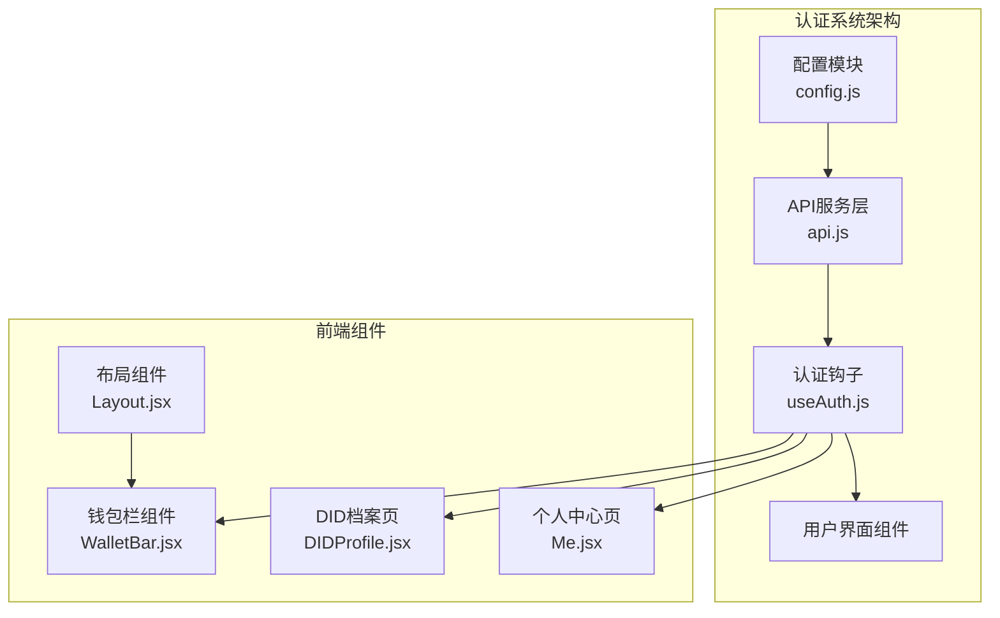
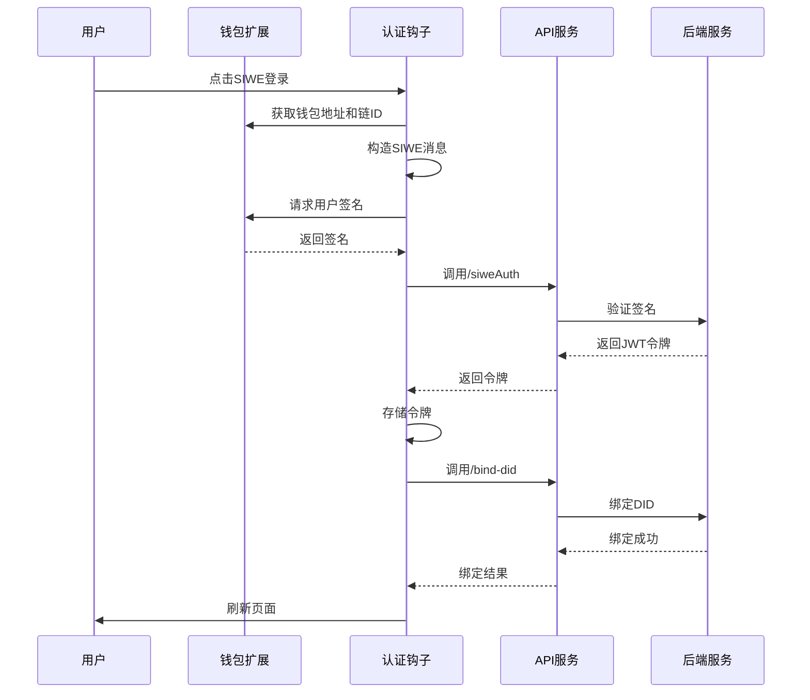
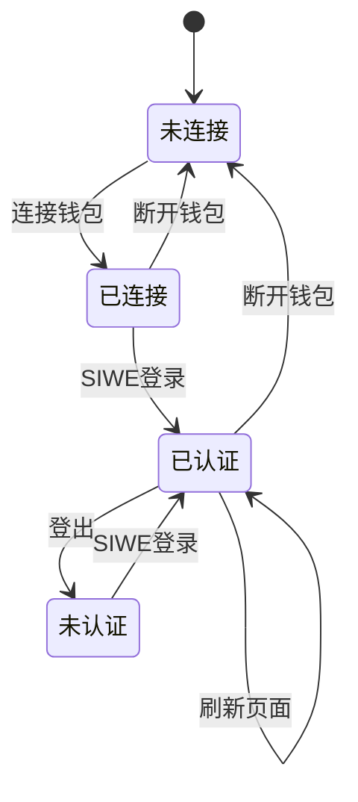
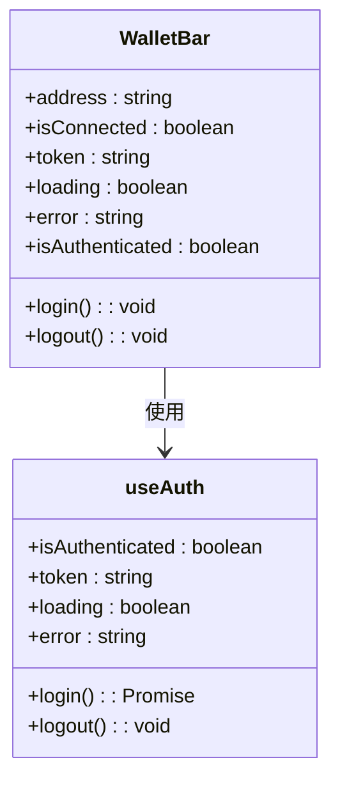
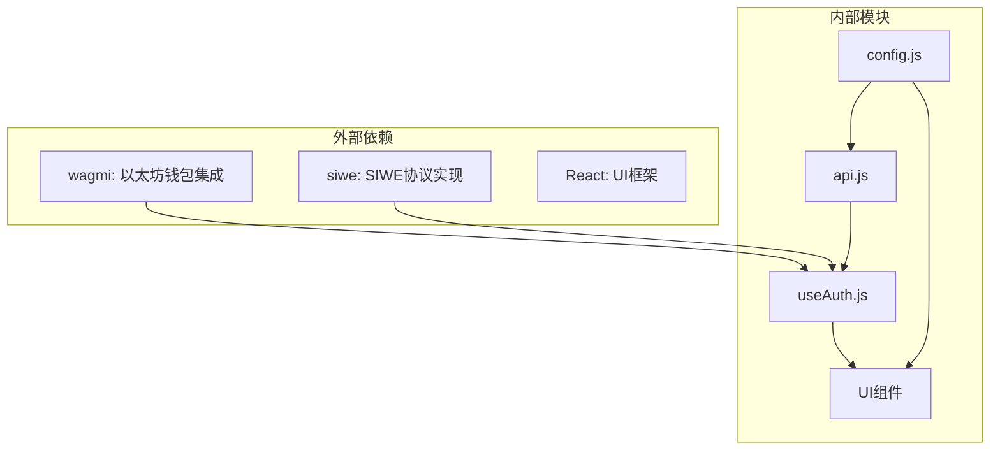

# 认证API

<cite>
**本文档引用的文件**
- [api.js](file://src/services/api.js)
- [useAuth.js](file://src/hooks/useAuth.js)
- [config.js](file://src/config.js)
- [.env.example](file://.env.example)
- [WalletBar.jsx](file://src/components/WalletBar.jsx)
- [DIDProfile.jsx](file://src/pages/DIDProfile.jsx)
- [Me.jsx](file://src/pages/Me.jsx)
- [App.jsx](file://src/App.jsx)
- [Layout.jsx](file://src/components/Layout.jsx)
</cite>

## 目录
1. [简介](#简介)
2. [项目结构](#项目结构)
3. [核心组件](#核心组件)
4. [架构概览](#架构概览)
5. [详细组件分析](#详细组件分析)
6. [依赖关系分析](#依赖关系分析)
7. [性能考虑](#性能考虑)
8. [故障排除指南](#故障排除指南)
9. [结论](#结论)

## 简介

PredictionDIDSimple 是一个基于以太坊的预测市场平台，采用 SIWE（Sign-In with Ethereum）协议实现去中心化身份认证。该系统提供了完整的认证API，包括健康检查、SIWE签名验证和DID绑定等功能，支持用户通过加密货币钱包进行安全的身份验证。

## 项目结构

该认证系统主要分布在以下关键文件中：



**图表来源**
- [config.js](file://src/config.js#L1-L23)
- [api.js](file://src/services/api.js#L1-L187)
- [useAuth.js](file://src/hooks/useAuth.js#L1-L110)

**章节来源**
- [config.js](file://src/config.js#L1-L23)
- [api.js](file://src/services/api.js#L1-L187)
- [useAuth.js](file://src/hooks/useAuth.js#L1-L110)

## 核心组件

### JWT令牌管理系统

系统使用localStorage作为JWT令牌的持久化存储，提供了完整的令牌生命周期管理：

- **存储键名**: `prediction_jwt`
- **存储方式**: localStorage
- **令牌格式**: Bearer Token
- **自动添加**: 所有API请求自动包含Authorization头

### SIWE认证流程

系统实现了完整的SIWE（Sign-In with Ethereum）认证协议，包括消息构造、签名生成和验证流程。

**章节来源**
- [api.js](file://src/services/api.js#L4-L20)
- [useAuth.js](file://src/hooks/useAuth.js#L28-L80)

## 架构概览

认证系统的整体架构采用分层设计，确保了清晰的关注点分离：



**图表来源**
- [useAuth.js](file://src/hooks/useAuth.js#L28-L80)
- [api.js](file://src/services/api.js#L93-L107)

## 详细组件分析

### API服务层

API服务层提供了统一的HTTP请求封装，支持认证令牌的自动管理和错误处理。

#### 健康检查接口

**接口定义**
- **HTTP方法**: GET
- **URL路径**: `/health`
- **功能**: 检测后端服务是否正常运行
- **请求参数**: 无
- **响应格式**: 
  ```json
  {
    "status": "ok"
  }
  ```
- **错误代码**: 500（服务不可用）

**章节来源**
- [api.js](file://src/services/api.js#L57-L60)

#### SIWE认证接口

**接口定义**
- **HTTP方法**: POST
- **URL路径**: `/auth/siwe`
- **功能**: 使用以太坊签名验证用户身份
- **请求参数**:
  - `message`: string - SIWE消息字符串
  - `signature`: string - 用户钱包签名
- **响应格式**:
  ```json
  {
    "token": "jwt_token_string"
  }
  ```
- **错误代码**: 
  - 400（无效签名）
  - 401（未授权）
  - 500（服务器错误）

**章节来源**
- [api.js](file://src/services/api.js#L93-L99)

#### DID绑定接口

**接口定义**
- **HTTP方法**: POST
- **URL路径**: `/users/bind-did`
- **功能**: 将去中心化身份绑定到用户账户
- **请求参数**:
  - `did`: string - DID标识符
  - `signature`: string - 用户钱包签名
- **响应格式**:
  ```json
  {
    "success": true
  }
  ```
- **错误代码**:
  - 400（无效DID格式）
  - 409（DID已存在）
  - 500（服务器错误）

**章节来源**
- [api.js](file://src/services/api.js#L101-L107)

#### 可验证凭证验证接口

**接口定义**
- **HTTP方法**: POST
- **URL路径**: `/auth/verify-vc`
- **功能**: 验证可验证凭证的有效性
- **请求参数**:
  - `vc_json`: string/object - VC JSON数据
  - `credential_type`: string - 凭证类型
  - `region`: string - 地区信息
- **响应格式**:
  ```json
  {
    "valid": true,
    "details": "验证通过"
  }
  ```
- **错误代码**:
  - 400（无效凭证）
  - 401（验证失败）
  - 500（服务器错误）

**章节来源**
- [api.js](file://src/services/api.js#L119-L129)

### 认证钩子组件

认证钩子组件封装了完整的认证逻辑，提供了简洁的API供UI组件使用。

#### 认证状态管理



**图表来源**
- [useAuth.js](file://src/hooks/useAuth.js#L16-L109)

#### 关键方法说明

- **login()**: 执行SIWE认证流程
- **logout()**: 清除认证状态
- **isAuthenticated**: 认证状态检查
- **token**: JWT令牌获取
- **loading/error**: 认证过程状态

**章节来源**
- [useAuth.js](file://src/hooks/useAuth.js#L28-L88)

### 用户界面集成

#### 钱包栏组件

钱包栏组件提供了直观的认证状态展示和操作入口：



**图表来源**
- [WalletBar.jsx](file://src/components/WalletBar.jsx#L10-L54)
- [useAuth.js](file://src/hooks/useAuth.js#L16-L109)

**章节来源**
- [WalletBar.jsx](file://src/components/WalletBar.jsx#L1-L54)

#### DID档案页面

DID档案页面展示了用户的去中心化身份信息和相关凭证：

- **路径**: `/did`
- **功能**: 显示DID标识符和可验证凭证
- **认证要求**: 需要SIWE认证

**章节来源**
- [DIDProfile.jsx](file://src/pages/DIDProfile.jsx#L16-L69)

## 依赖关系分析

认证系统的关键依赖关系如下：



**图表来源**
- [useAuth.js](file://src/hooks/useAuth.js#L3-L10)
- [api.js](file://src/services/api.js#L1-L10)

**章节来源**
- [useAuth.js](file://src/hooks/useAuth.js#L1-L110)
- [api.js](file://src/services/api.js#L1-L187)

## 性能考虑

### 令牌缓存策略

- **本地存储**: 使用localStorage避免每次请求重新认证
- **自动添加**: 所有API请求自动包含Authorization头
- **内存优化**: 令牌只在需要时从localStorage读取

### 网络请求优化

- **错误处理**: 统一的错误处理机制减少重复代码
- **请求合并**: 相关的认证操作在同一个流程中执行
- **状态管理**: 使用React状态管理避免不必要的重渲染

## 故障排除指南

### 常见认证问题

#### 钱包连接问题

**症状**: "请连接钱包"提示持续出现
**解决方案**:
1. 检查钱包扩展是否正确安装
2. 确认钱包网络与配置一致
3. 重新连接钱包并刷新页面

#### SIWE认证失败

**症状**: 登录按钮显示"登录中..."但无法完成认证
**可能原因**:
- 钱包签名请求被拒绝
- 网络连接不稳定
- 后端服务不可用

**解决步骤**:
1. 检查浏览器控制台错误信息
2. 确认SIWE域名和URI配置正确
3. 验证后端服务健康状态

#### 令牌存储问题

**症状**: 登录后立即退出登录状态
**解决方案**:
1. 检查浏览器localStorage权限
2. 确认没有清理localStorage的操作
3. 重启浏览器尝试

#### DID绑定失败

**症状**: 登录成功但DID未绑定
**解决方法**:
1. 检查钱包签名是否正确
2. 确认链ID配置正确
3. 查看后端日志获取详细错误信息

**章节来源**
- [WalletBar.jsx](file://src/components/WalletBar.jsx#L49-L51)
- [useAuth.js](file://src/hooks/useAuth.js#L73-L79)

### 开发环境配置

#### 环境变量设置

```bash
# API基础地址
VITE_API_URL=http://localhost:8080

# 区块链网络ID
VITE_CHAIN_ID=31337

# SIWE配置
VITE_SIWE_DOMAIN=localhost
VITE_SIWE_URI=http://localhost:5173
```

**章节来源**
- [.env.example](file://.env.example#L1-L7)

## 结论

PredictionDIDSimple的认证系统采用现代化的SIWE协议，提供了安全、便捷的去中心化身份验证体验。系统架构清晰，组件职责明确，为用户提供了流畅的认证流程。

### 主要优势

1. **安全性**: 基于以太坊的密码学证明，无需共享私钥
2. **用户体验**: 一键登录，无缝认证体验
3. **可扩展性**: 模块化设计，易于扩展新功能
4. **可靠性**: 完善的错误处理和状态管理

### 最佳实践建议

1. **安全存储**: 始终使用HTTPS传输敏感数据
2. **错误处理**: 实现完善的异常捕获和用户反馈
3. **性能优化**: 合理使用缓存，避免频繁的认证请求
4. **监控告警**: 建立认证系统的监控和告警机制

该认证系统为PredictionDIDSimple平台提供了坚实的安全基础，支持未来的功能扩展和业务发展需求。