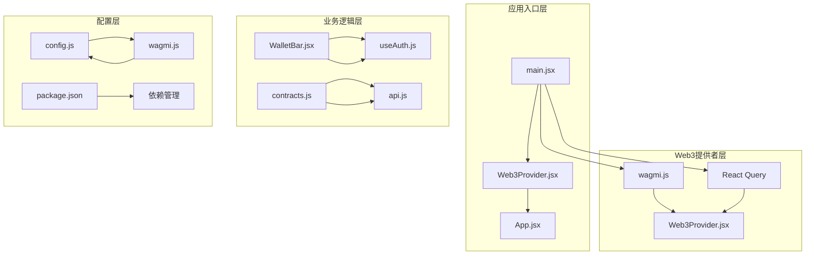
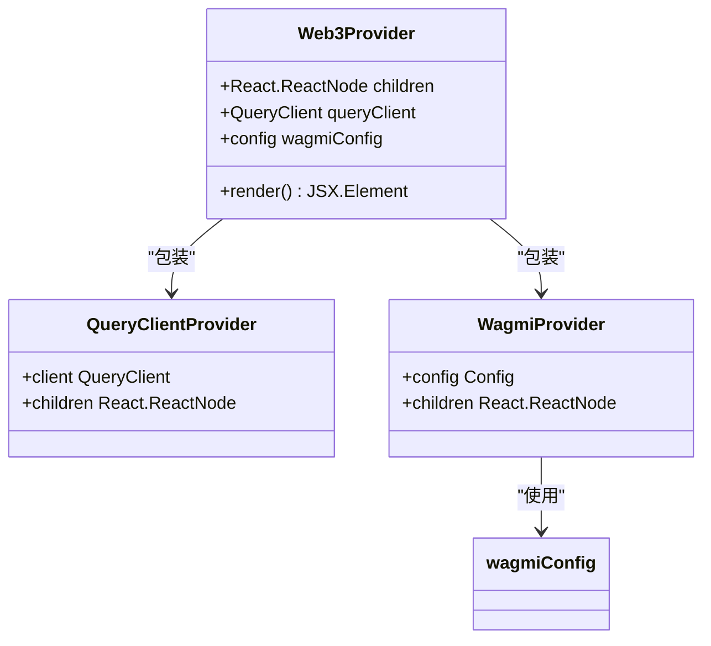
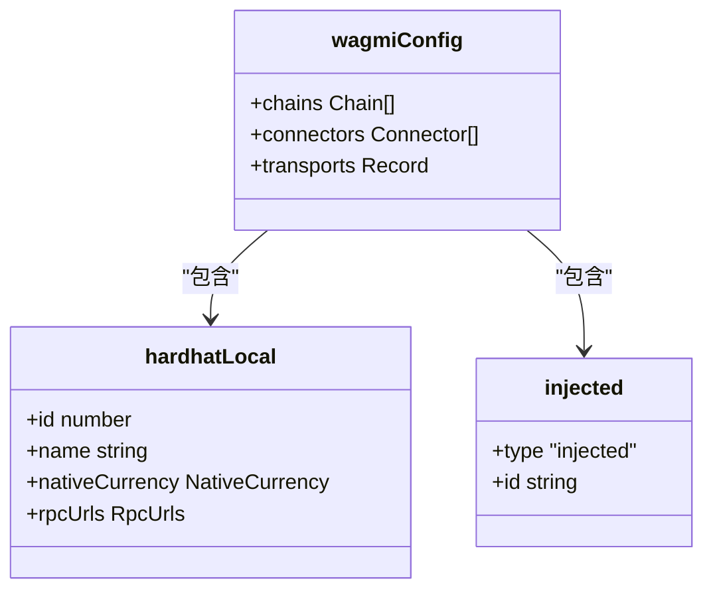
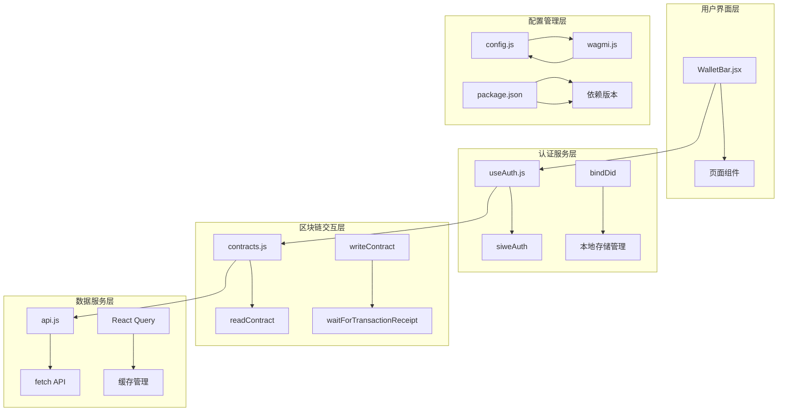
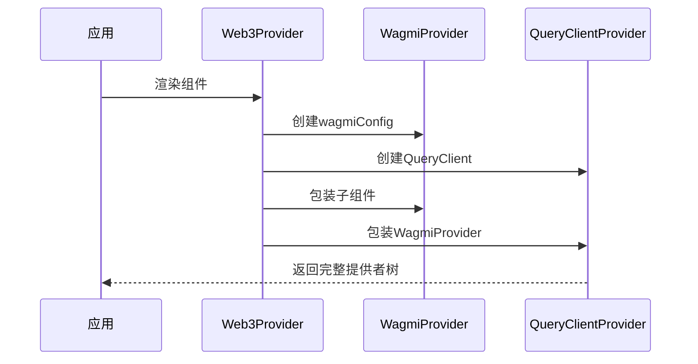
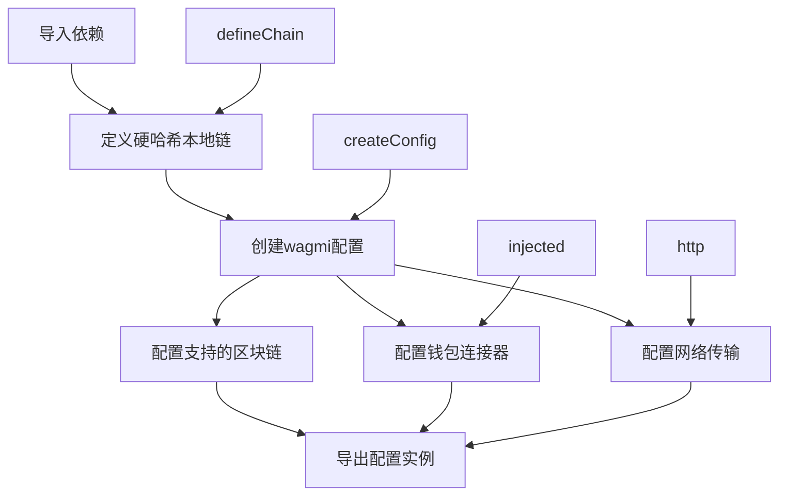
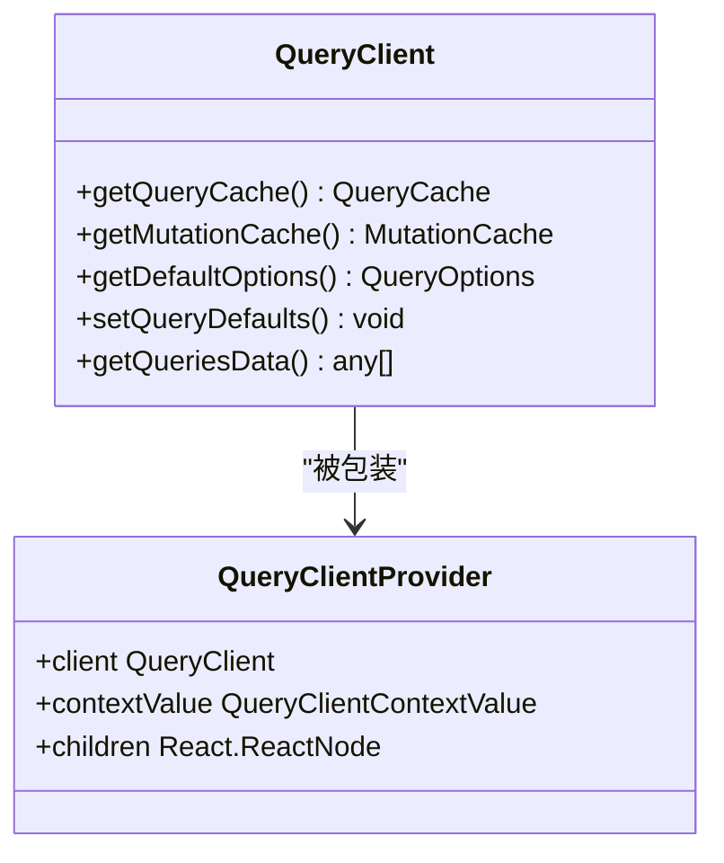
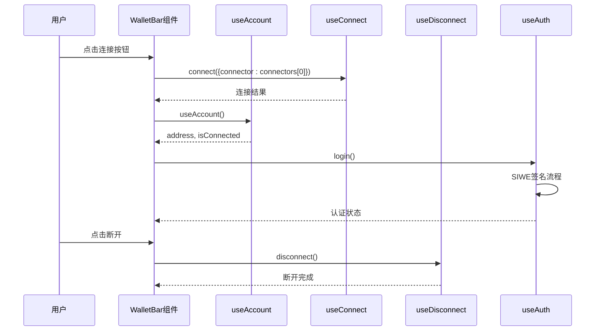
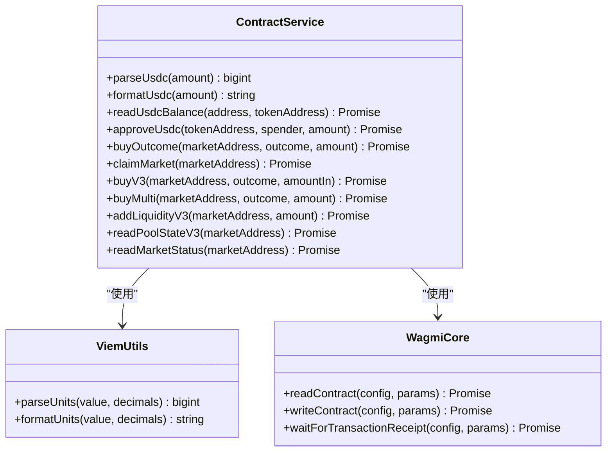

# Web3提供者配置

<cite>
**本文档引用的文件**
- [Web3Provider.jsx](file://src/providers/Web3Provider.jsx)
- [wagmi.js](file://src/wagmi.js)
- [main.jsx](file://src/main.jsx)
- [App.jsx](file://src/App.jsx)
- [config.js](file://src/config.js)
- [WalletBar.jsx](file://src/components/WalletBar.jsx)
- [useAuth.js](file://src/hooks/useAuth.js)
- [api.js](file://src/services/api.js)
- [contracts.js](file://src/services/contracts.js)
- [package.json](file://package.json)
</cite>

## 目录
1. [简介](#简介)
2. [项目结构](#项目结构)
3. [核心组件](#核心组件)
4. [架构概览](#架构概览)
5. [详细组件分析](#详细组件分析)
6. [依赖关系分析](#依赖关系分析)
7. [性能考虑](#性能考虑)
8. [故障排除指南](#故障排除指南)
9. [结论](#结论)
10. [附录](#附录)

## 简介

本文档深入解析了PredictionDIDSimple前端项目中的Web3提供者配置系统。该系统基于wagmi和React Query构建，为整个应用提供了完整的区块链交互能力和数据缓存管理功能。文档详细说明了Web3Provider组件的实现原理、wagmi配置注入机制、React Query客户端初始化，以及提供者层级结构的设计思路。

该项目采用现代化的前端架构，结合了去中心化身份(DID)认证、智能合约交互和实时数据缓存等核心技术，为用户提供完整的预测市场体验。

## 项目结构

项目采用模块化的组织方式，主要分为以下几个层次：



**图表来源**
- [main.jsx](file://src/main.jsx#L17-L32)
- [Web3Provider.jsx](file://src/providers/Web3Provider.jsx#L16-L24)
- [wagmi.js](file://src/wagmi.js#L26-L36)

**章节来源**
- [main.jsx](file://src/main.jsx#L1-L33)
- [package.json](file://package.json#L1-L30)

## 核心组件

### Web3Provider组件

Web3Provider是整个Web3功能的核心提供者组件，负责为应用注入wagmi和React Query的能力。



**图表来源**
- [Web3Provider.jsx](file://src/providers/Web3Provider.jsx#L16-L24)

Web3Provider的主要职责包括：
- 初始化React Query客户端实例
- 注入wagmi配置对象
- 提供区块链钱包连接能力
- 管理异步数据缓存和状态

**章节来源**
- [Web3Provider.jsx](file://src/providers/Web3Provider.jsx#L1-L25)

### wagmi配置系统

wagmi配置系统是Web3功能的核心配置层，负责定义网络连接参数和钱包连接器。



**图表来源**
- [wagmi.js](file://src/wagmi.js#L26-L36)
- [wagmi.js](file://src/wagmi.js#L11-L23)

**章节来源**
- [wagmi.js](file://src/wagmi.js#L1-L37)

## 架构概览

整个Web3架构采用了分层设计，确保了功能的模块化和可维护性：



**图表来源**
- [WalletBar.jsx](file://src/components/WalletBar.jsx#L10-L53)
- [useAuth.js](file://src/hooks/useAuth.js#L16-L109)
- [contracts.js](file://src/services/contracts.js#L4-L6)
- [api.js](file://src/services/api.js#L29-L55)

## 详细组件分析

### Web3Provider组件实现

Web3Provider组件实现了提供者模式，为整个应用提供Web3功能：



**图表来源**
- [Web3Provider.jsx](file://src/providers/Web3Provider.jsx#L16-L24)

组件的关键特性：
- **提供者组合**：同时提供wagmi和React Query功能
- **配置注入**：从wagmi.js导入预配置的wagmiConfig
- **生命周期管理**：作为应用根组件的直接子元素存在

**章节来源**
- [Web3Provider.jsx](file://src/providers/Web3Provider.jsx#L8-L24)

### wagmi配置对象构建

wagmi配置对象的构建过程体现了清晰的模块化设计：



**图表来源**
- [wagmi.js](file://src/wagmi.js#L11-L23)
- [wagmi.js](file://src/wagmi.js#L26-L36)

配置构建的关键步骤：
1. **链定义**：使用defineChain创建自定义硬哈希本地链
2. **配置创建**：通过createConfig统一管理配置
3. **连接器配置**：集成浏览器注入式钱包连接器
4. **传输层配置**：为不同链配置相应的网络传输方式

**章节来源**
- [wagmi.js](file://src/wagmi.js#L10-L36)

### React Query客户端初始化

React Query客户端的初始化体现了最佳实践：



**图表来源**
- [Web3Provider.jsx](file://src/providers/Web3Provider.jsx#L9-L9)

初始化特点：
- **默认配置**：使用React Query的默认配置
- **缓存管理**：提供全局的数据缓存和状态管理
- **生命周期**：与Web3Provider组件同生命周期

**章节来源**
- [Web3Provider.jsx](file://src/providers/Web3Provider.jsx#L8-L9)

### 钱包连接组件

WalletBar组件展示了完整的钱包连接流程：



**图表来源**
- [WalletBar.jsx](file://src/components/WalletBar.jsx#L11-L18)
- [useAuth.js](file://src/hooks/useAuth.js#L29-L80)

组件功能特性：
- **状态显示**：实时显示钱包连接状态和地址
- **交互控制**：提供连接、断开、登录等操作
- **错误处理**：显示认证过程中的错误信息

**章节来源**
- [WalletBar.jsx](file://src/components/WalletBar.jsx#L1-L54)

### 认证钩子实现

useAuth钩子封装了完整的SIWE认证流程：

```mermaid
flowchart TD
A[用户点击SIWE登录] --> B[检查钱包连接状态]
B --> C{钱包已连接?}
C --> |否| D[返回]
C --> |是| E[设置加载状态]
E --> F[创建SiweMessage对象]
F --> G[prepareMessage()生成签名消息]
G --> H[signMessageAsync获取签名]
H --> I[调用siweAuth获取JWT]
I --> J[保存JWT到localStorage]
J --> K[构造DID标识符]
K --> L[尝试绑定DID到账户]
L --> M[刷新页面应用状态]
N[错误处理] --> O[设置错误状态]
O --> P[恢复加载状态]
```

**图表来源**
- [useAuth.js](file://src/hooks/useAuth.js#L29-L80)

认证流程的关键步骤：
1. **消息构造**：使用SiweMessage创建认证消息
2. **用户签名**：通过钱包获取用户签名
3. **服务器验证**：将签名发送到后端验证
4. **状态管理**：保存认证状态并更新UI

**章节来源**
- [useAuth.js](file://src/hooks/useAuth.js#L16-L109)

### 合约交互服务

contracts.js提供了完整的智能合约交互能力：



**图表来源**
- [contracts.js](file://src/services/contracts.js#L24-L35)
- [contracts.js](file://src/services/contracts.js#L43-L50)

服务功能分类：
- **金额处理**：USDC代币的金额解析和格式化
- **读取操作**：合约状态查询和余额读取
- **写入操作**：交易执行和授权操作
- **状态监控**：交易确认和状态查询

**章节来源**
- [contracts.js](file://src/services/contracts.js#L1-L214)

## 依赖关系分析

项目依赖关系展现了清晰的模块化架构：

```mermaid
graph TB
subgraph "核心依赖"
A[wagmi@^2.14.1] --> B[区块链交互]
C[@tanstack/react-query@^5.62.2] --> D[数据缓存]
E[viem@^2.21.54] --> F[链上数据处理]
G[siwe@^2.3.2] --> H[签名认证]
end
subgraph "应用依赖"
I[react@^18.3.1] --> J[组件框架]
K[react-dom@^18.3.1] --> L[DOM渲染]
M[react-router-dom@^6.28.0] --> N[路由管理]
end
subgraph "开发依赖"
O[@vitejs/plugin-react@^4.3.4] --> P[构建工具]
Q[eslint@^8.57.1] --> R[代码质量]
end
A --> S[Web3Provider.jsx]
C --> T[Web3Provider.jsx]
E --> U[contracts.js]
G --> V[useAuth.js]
I --> W[main.jsx]
K --> X[main.jsx]
M --> Y[App.jsx]
```

**图表来源**
- [package.json](file://package.json#L12-L28)

依赖管理特点：
- **版本锁定**：使用^符号确保兼容性
- **功能分离**：核心功能独立成包
- **开发友好**：包含完整的开发工具链

**章节来源**
- [package.json](file://package.json#L1-L30)

## 性能考虑

### 缓存策略优化

React Query提供了强大的缓存管理机制：

- **默认缓存时间**：合理的默认缓存策略减少重复请求
- **手动失效**：通过invalidateQueries触发数据刷新
- **并发处理**：自动合并相同的查询请求

### 并发查询优化

contracts.js中的readMarketStatus函数展示了并发查询的最佳实践：

```javascript
// 使用Promise.all并行执行多个合约查询
const [status, winningOutcome, yesPool, noPool] = await Promise.all([
  readContract(wagmiConfig, { address, abi, functionName: 'status' }),
  readContract(wagmiConfig, { address, abi, functionName: 'winningOutcome' }),
  readContract(wagmiConfig, { address, abi, functionName: 'yesPool' }),
  readContract(wagmiConfig, { address, abi, functionName: 'noPool' }),
]);
```

### 内存管理

- **组件卸载清理**：React Query自动清理未使用的缓存数据
- **长连接管理**：wagmi提供持久化的连接管理
- **事件监听器**：及时移除不必要的事件监听器

## 故障排除指南

### 常见问题诊断

#### 钱包连接问题

**症状**：WalletBar显示连接按钮但无法连接钱包

**排查步骤**：
1. 检查浏览器是否安装了支持的钱包扩展
2. 验证wagmi配置中的connectors设置
3. 查看浏览器控制台是否有错误信息

**解决方案**：
- 确保使用injected连接器
- 检查钱包扩展的兼容性
- 验证RPC节点的可达性

#### 认证失败问题

**症状**：SIWE登录后仍然显示未认证状态

**排查步骤**：
1. 检查签名消息的构造参数
2. 验证后端认证服务的可用性
3. 查看localStorage中的JWT令牌

**解决方案**：
- 确认chainId和address参数正确
- 检查nonce的唯一性
- 验证后端API的响应格式

#### 合约交互异常

**症状**：交易执行失败或超时

**排查步骤**：
1. 检查合约地址的有效性
2. 验证ABI文件的完整性
3. 确认钱包有足够的gas费用

**解决方案**：
- 使用正确的合约地址和ABI
- 增加适当的gas限制
- 检查网络状态和区块确认时间

**章节来源**
- [WalletBar.jsx](file://src/components/WalletBar.jsx#L23-L27)
- [useAuth.js](file://src/hooks/useAuth.js#L36-L53)
- [contracts.js](file://src/services/contracts.js#L60-L69)

## 结论

该Web3提供者配置系统展现了现代前端区块链应用的最佳实践。通过精心设计的分层架构、清晰的配置管理和完善的错误处理机制，系统为用户提供了稳定可靠的Web3体验。

系统的主要优势包括：
- **模块化设计**：每个组件职责明确，便于维护和扩展
- **配置集中化**：wagmi配置统一管理，便于修改和部署
- **用户体验优化**：完整的认证流程和状态反馈
- **性能考虑**：合理的缓存策略和并发处理

未来可以考虑的改进方向：
- 添加多网络支持（主网、测试网）
- 实现更详细的错误处理和用户提示
- 增加更多的安全验证机制
- 优化移动端的用户体验

## 附录

### 配置示例

#### 环境变量配置

```javascript
// .env文件示例
VITE_API_URL=http://localhost:8080
VITE_CHAIN_ID=31337
VITE_MOCK_USDC_ADDRESS=0x...
VITE_MARKET_FACTORY_ADDRESS=0x...
VITE_SIWE_DOMAIN=localhost
VITE_SIWE_URI=http://localhost:5173
```

#### 扩展wagmi配置

```javascript
// 添加新的区块链支持
const ethereumMainnet = defineChain({
  id: 1,
  name: 'Ethereum Mainnet',
  nativeCurrency: { name: 'Ether', symbol: 'ETH', decimals: 18 },
  rpcUrls: {
    default: { http: ['https://mainnet.infura.io/v3/YOUR_PROJECT_ID'] },
  },
});

export const wagmiConfig = createConfig({
  chains: [hardhatLocal, ethereumMainnet],
  connectors: [injected()],
  transports: {
    [hardhatLocal.id]: http(),
    [ethereumMainnet.id]: http(),
  },
});
```

#### 自定义提供者组件

```javascript
// 创建自定义的Web3提供者
export function CustomWeb3Provider({ children }) {
  const queryClient = new QueryClient({
    defaultOptions: {
      queries: {
        staleTime: 5 * 60 * 1000, // 5分钟
        gcTime: 10 * 60 * 1000,   // 10分钟
      },
    },
  });

  return (
    <WagmiProvider config={wagmiConfig}>
      <QueryClientProvider client={queryClient}>
        {children}
      </QueryClientProvider>
    </WagmiProvider>
  );
}
```