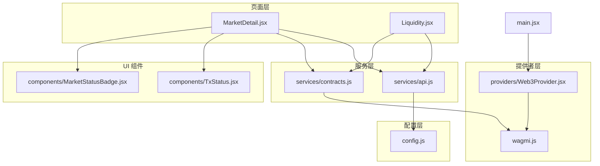
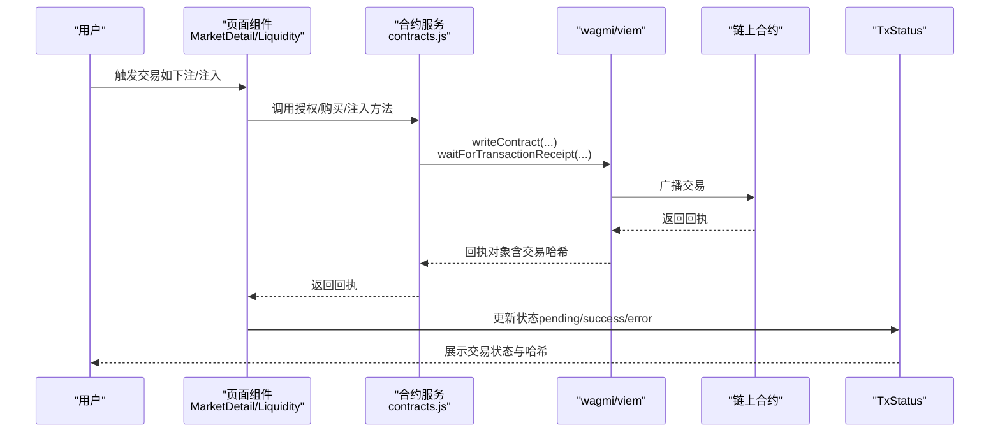
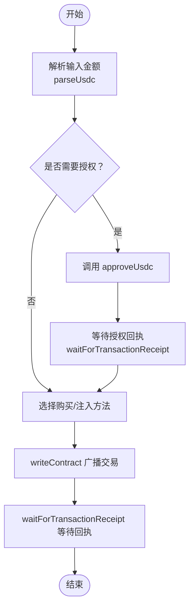
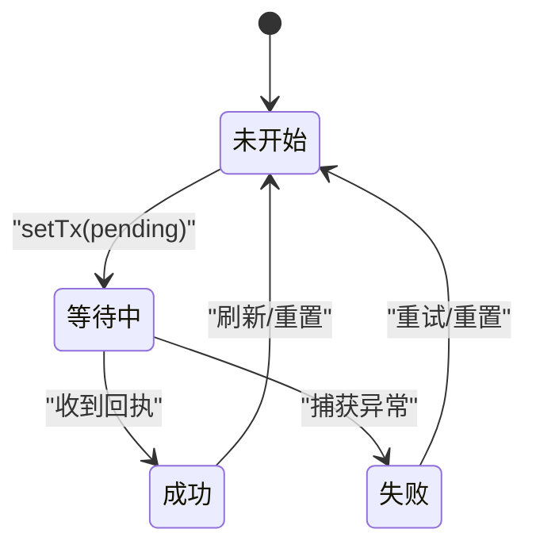
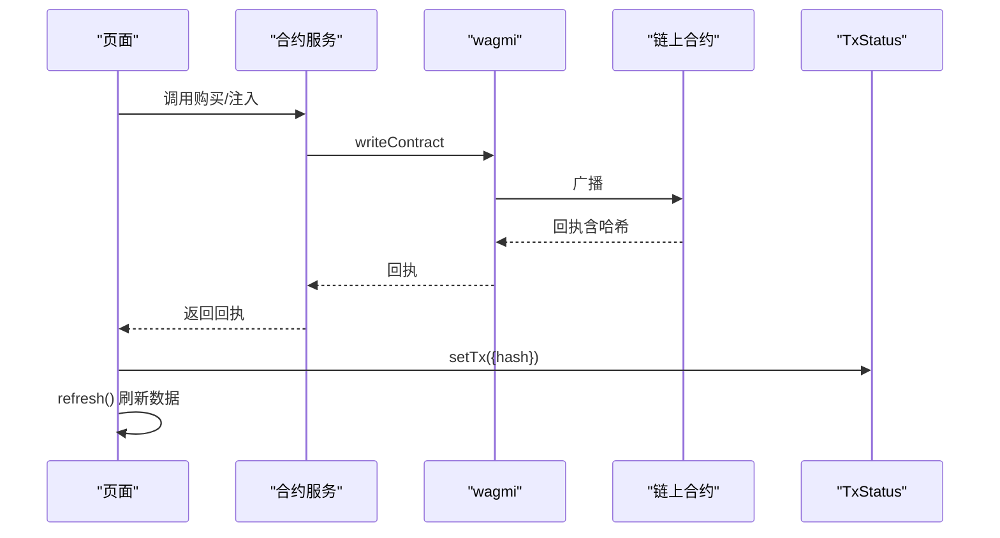
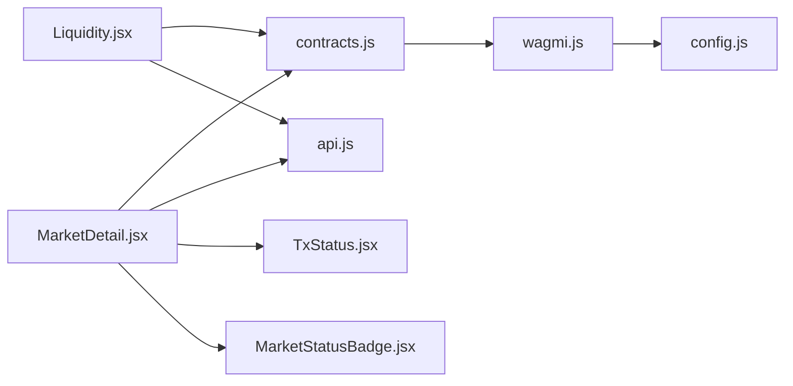

# 交易管理

<cite>
**本文引用的文件**
- [src/services/contracts.js](file://src/services/contracts.js)
- [src/pages/MarketDetail.jsx](file://src/pages/MarketDetail.jsx)
- [src/pages/Liquidity.jsx](file://src/pages/Liquidity.jsx)
- [src/components/TxStatus.jsx](file://src/components/TxStatus.jsx)
- [src/providers/Web3Provider.jsx](file://src/providers/Web3Provider.jsx)
- [src/wagmi.js](file://src/wagmi.js)
- [src/services/api.js](file://src/services/api.js)
- [src/config.js](file://src/config.js)
- [src/main.jsx](file://src/main.jsx)
- [src/components/MarketStatusBadge.jsx](file://src/components/MarketStatusBadge.jsx)
</cite>

## 目录
1. [引言](#引言)
2. [项目结构](#项目结构)
3. [核心组件](#核心组件)
4. [架构总览](#架构总览)
5. [详细组件分析](#详细组件分析)
6. [依赖关系分析](#依赖关系分析)
7. [性能考量](#性能考量)
8. [故障排查指南](#故障排查指南)
9. [结论](#结论)
10. [附录](#附录)

## 引言
本文件面向交易管理系统的技术文档，聚焦于“交易发送流程”“交易状态监控”“交易跟踪与用户反馈优化”“错误恢复策略”“交易超时处理”“Gas费用优化”“批量交易管理最佳实践”。系统基于前端钱包与链上合约交互，采用 wagmi + viem 进行链上读写与交易回执等待，配合 React Query 实现数据缓存与状态同步。

## 项目结构
前端采用模块化组织，围绕“页面组件 + 服务层 + 提供者 + 配置”的分层设计：
- 页面层：负责业务场景与用户交互（如下注页面、流动性页面）
- 服务层：封装 API 与合约交互（API 服务、合约服务）
- 提供者层：统一注入钱包与数据缓存能力（Web3Provider、wagmi 配置）
- 配置层：集中管理环境变量与链上地址

图示来源
- [src/main.jsx](file://src/main.jsx#L17-L32)
- [src/providers/Web3Provider.jsx](file://src/providers/Web3Provider.jsx#L16-L24)
- [src/wagmi.js](file://src/wagmi.js#L26-L36)
- [src/services/api.js](file://src/services/api.js#L29-L55)
- [src/services/contracts.js](file://src/services/contracts.js#L4-L6)
- [src/pages/MarketDetail.jsx](file://src/pages/MarketDetail.jsx#L1-L25)
- [src/pages/Liquidity.jsx](file://src/pages/Liquidity.jsx#L1-L14)
- [src/components/TxStatus.jsx](file://src/components/TxStatus.jsx#L1-L26)
- [src/components/MarketStatusBadge.jsx](file://src/components/MarketStatusBadge.jsx#L1-L24)
- [src/config.js](file://src/config.js#L1-L23)

章节来源
- [src/main.jsx](file://src/main.jsx#L17-L32)
- [src/providers/Web3Provider.jsx](file://src/providers/Web3Provider.jsx#L16-L24)
- [src/wagmi.js](file://src/wagmi.js#L26-L36)
- [src/config.js](file://src/config.js#L1-L23)

## 核心组件
- 合约服务（交易发送与链上读取）
  - 金额解析/格式化：parseUsdc/formatUsdc
  - 授权与转账：approveUsdc、buyOutcome/buyV3/buyMulti、addLiquidityV3
  - 链上状态读取：readMarketStatus、readPoolStateV3
- 页面组件（交易执行与状态展示）
  - MarketDetail：下注流程（授权 → 购买 → 成功/失败/回执）
  - Liquidity：流动性注入（授权 → 注入 → 成功/失败）
- UI 组件（状态反馈）
  - TxStatus：交易状态展示（pending/success/error）
  - MarketStatusBadge：市场状态徽章
- 提供者与配置
  - Web3Provider：注入 wagmi 与 React Query
  - wagmi.js：链与连接器配置
  - config.js：API 地址、链 ID、合约地址等

章节来源
- [src/services/contracts.js](file://src/services/contracts.js#L24-L213)
- [src/pages/MarketDetail.jsx](file://src/pages/MarketDetail.jsx#L77-L110)
- [src/pages/Liquidity.jsx](file://src/pages/Liquidity.jsx#L51-L77)
- [src/components/TxStatus.jsx](file://src/components/TxStatus.jsx#L6-L25)
- [src/components/MarketStatusBadge.jsx](file://src/components/MarketStatusBadge.jsx#L1-L24)
- [src/providers/Web3Provider.jsx](file://src/providers/Web3Provider.jsx#L16-L24)
- [src/wagmi.js](file://src/wagmi.js#L10-L36)
- [src/config.js](file://src/config.js#L7-L22)

## 架构总览
交易管理由“前端页面 → 合约服务 → 钱包/链”三层协作完成。页面触发交易，合约服务通过 wagmi 写入交易并等待回执，UI 组件即时反馈状态；同时 API 服务提供市场与池数据的补充。

图示来源
- [src/pages/MarketDetail.jsx](file://src/pages/MarketDetail.jsx#L77-L110)
- [src/pages/Liquidity.jsx](file://src/pages/Liquidity.jsx#L51-L77)
- [src/services/contracts.js](file://src/services/contracts.js#L59-L123)
- [src/components/TxStatus.jsx](file://src/components/TxStatus.jsx#L6-L25)

## 详细组件分析

### 交易发送流程（构建 → 签名 → 广播 → 确认）
- 金额处理：parseUsdc 将人类可读金额转换为链上整数；formatUsdc 用于 UI 展示
- 授权前置：购买前先调用 approveUsdc 授权 USDC 给市场合约
- 交易调用：根据市场类型选择 buyOutcome/buyV3/buyMulti 或 addLiquidityV3
- 广播与等待：writeContract 广播交易，waitForTransactionReceipt 等待回执
- 成功回执：包含交易哈希，用于后续跟踪与用户反馈

图示来源
- [src/services/contracts.js](file://src/services/contracts.js#L24-L26)
- [src/services/contracts.js](file://src/services/contracts.js#L59-L69)
- [src/services/contracts.js](file://src/services/contracts.js#L78-L88)
- [src/services/contracts.js](file://src/services/contracts.js#L113-L123)
- [src/services/contracts.js](file://src/services/contracts.js#L150-L160)

章节来源
- [src/services/contracts.js](file://src/services/contracts.js#L24-L26)
- [src/services/contracts.js](file://src/services/contracts.js#L59-L69)
- [src/services/contracts.js](file://src/services/contracts.js#L78-L88)
- [src/services/contracts.js](file://src/services/contracts.js#L113-L123)
- [src/services/contracts.js](file://src/services/contracts.js#L150-L160)

### 交易状态监控（pending/success/failure）
- 页面级状态：MarketDetail/Liquidity 使用本地状态管理交易状态（pending/success/error），并在成功后刷新数据
- UI 反馈：TxStatus 根据状态渲染不同提示，包含交易哈希展示
- 市场状态：MarketStatusBadge 将链上状态映射为中文徽章，辅助判断是否可交易

图示来源
- [src/pages/MarketDetail.jsx](file://src/pages/MarketDetail.jsx#L84-L109)
- [src/pages/Liquidity.jsx](file://src/pages/Liquidity.jsx#L60-L77)
- [src/components/TxStatus.jsx](file://src/components/TxStatus.jsx#L6-L25)
- [src/components/MarketStatusBadge.jsx](file://src/components/MarketStatusBadge.jsx#L1-L24)

章节来源
- [src/pages/MarketDetail.jsx](file://src/pages/MarketDetail.jsx#L84-L109)
- [src/pages/Liquidity.jsx](file://src/pages/Liquidity.jsx#L60-L77)
- [src/components/TxStatus.jsx](file://src/components/TxStatus.jsx#L6-L25)
- [src/components/MarketStatusBadge.jsx](file://src/components/MarketStatusBadge.jsx#L1-L24)

### 交易跟踪实现（哈希展示与刷新）
- 回执哈希：成功路径下将回执中的交易哈希写入状态，TxStatus 展示
- 数据刷新：成功后调用刷新逻辑，重新拉取市场与池状态，保证 UI 与链上一致
- 并行读取：链上状态读取采用 Promise.all 并行提升性能

图示来源
- [src/pages/MarketDetail.jsx](file://src/pages/MarketDetail.jsx#L103-L105)
- [src/services/contracts.js](file://src/services/contracts.js#L78-L88)
- [src/services/contracts.js](file://src/services/contracts.js#L113-L123)
- [src/services/contracts.js](file://src/services/contracts.js#L150-L160)
- [src/components/TxStatus.jsx](file://src/components/TxStatus.jsx#L18-L22)

章节来源
- [src/pages/MarketDetail.jsx](file://src/pages/MarketDetail.jsx#L103-L105)
- [src/services/contracts.js](file://src/services/contracts.js#L78-L88)
- [src/services/contracts.js](file://src/services/contracts.js#L113-L123)
- [src/services/contracts.js](file://src/services/contracts.js#L150-L160)
- [src/components/TxStatus.jsx](file://src/components/TxStatus.jsx#L18-L22)

### 用户反馈优化
- 即时状态：TxStatus 在 pending/success/error 三态即时反馈
- 可读金额：formatUsdc 将链上整数格式化为 mUSDC 字符串
- 权限提示：受限市场显示 VC 要求与引导
- 市场状态：MarketStatusBadge 提供中文状态标签，避免状态码带来的认知负担

章节来源
- [src/components/TxStatus.jsx](file://src/components/TxStatus.jsx#L6-L25)
- [src/services/contracts.js](file://src/services/contracts.js#L33-L35)
- [src/pages/MarketDetail.jsx](file://src/pages/MarketDetail.jsx#L147-L151)
- [src/components/MarketStatusBadge.jsx](file://src/components/MarketStatusBadge.jsx#L1-L24)

### 错误恢复策略
- 异常捕获：页面在交易过程中捕获错误，设置状态为 error 并保留错误信息
- 条件执行：未连接钱包、缺少抵押品地址、权限不足时不发起交易
- 失败重试：用户可重复点击“Approve + Buy/Approve + Add Liquidity”，页面不会重复授权（需后端/合约侧幂等）

章节来源
- [src/pages/MarketDetail.jsx](file://src/pages/MarketDetail.jsx#L84-L109)
- [src/pages/Liquidity.jsx](file://src/pages/Liquidity.jsx#L55-L77)

### 交易超时处理
- 当前实现：waitForTransactionReceipt 会持续等待直至回执可用；未见显式超时参数
- 建议策略：
  - 在调用侧增加超时控制（例如 Promise.race + setTimeout）
  - 对 pending 状态设置倒计时提示，引导用户查看区块浏览器
  - 对失败场景提供“查看详情”链接（结合交易哈希）

章节来源
- [src/services/contracts.js](file://src/services/contracts.js#L68-L68)
- [src/services/contracts.js](file://src/services/contracts.js#L122-L122)
- [src/services/contracts.js](file://src/services/contracts.js#L159-L159)

### Gas 费用优化
- 批量授权：在一次授权中覆盖多次购买，减少授权次数
- 交易合并：在合约层面支持“授权 + 购买”原子操作（需合约支持）
- 估算与提示：在前端显示预估 Gas，避免用户因 Gas 不足导致失败
- 网络选择：在正确链上执行，避免跨链或低效网络

章节来源
- [src/services/contracts.js](file://src/services/contracts.js#L59-L69)
- [src/pages/MarketDetail.jsx](file://src/pages/MarketDetail.jsx#L88-L90)

### 批量交易管理最佳实践
- 前端队列：逐笔执行，失败即停，避免并发导致的顺序错乱
- 重试策略：对临时性错误（如网络抖动）进行指数退避重试
- 用户可见性：在 UI 中展示当前进度与失败项，允许用户取消剩余批次
- 合约侧：尽量提供批量操作入口（如批量购买/注入），降低前端复杂度

章节来源
- [src/pages/MarketDetail.jsx](file://src/pages/MarketDetail.jsx#L77-L110)
- [src/pages/Liquidity.jsx](file://src/pages/Liquidity.jsx#L51-L77)

## 依赖关系分析
- 页面依赖服务层：MarketDetail/Liquidity 依赖 contracts.js 与 api.js
- 服务层依赖提供者：contracts.js 依赖 wagmi 配置与 viem 工具
- 提供者依赖配置：wagmi.js 依赖 config.js 的链 ID 与 RPC 地址
- UI 组件独立：TxStatus、MarketStatusBadge 仅依赖传入属性

图示来源
- [src/pages/MarketDetail.jsx](file://src/pages/MarketDetail.jsx#L1-L25)
- [src/pages/Liquidity.jsx](file://src/pages/Liquidity.jsx#L1-L14)
- [src/services/contracts.js](file://src/services/contracts.js#L4-L6)
- [src/wagmi.js](file://src/wagmi.js#L26-L36)
- [src/config.js](file://src/config.js#L7-L22)
- [src/components/TxStatus.jsx](file://src/components/TxStatus.jsx#L1-L26)
- [src/components/MarketStatusBadge.jsx](file://src/components/MarketStatusBadge.jsx#L1-L24)

章节来源
- [src/pages/MarketDetail.jsx](file://src/pages/MarketDetail.jsx#L1-L25)
- [src/pages/Liquidity.jsx](file://src/pages/Liquidity.jsx#L1-L14)
- [src/services/contracts.js](file://src/services/contracts.js#L4-L6)
- [src/wagmi.js](file://src/wagmi.js#L26-L36)
- [src/config.js](file://src/config.js#L7-L22)
- [src/components/TxStatus.jsx](file://src/components/TxStatus.jsx#L1-L26)
- [src/components/MarketStatusBadge.jsx](file://src/components/MarketStatusBadge.jsx#L1-L24)

## 性能考量
- 并行读取：readMarketStatus 使用 Promise.all 并行获取状态、获胜结果与池金额，减少等待时间
- 数据缓存：Web3Provider 注入 QueryClient，可结合 React Query 的缓存策略复用数据
- 金额格式化：formatUsdc 仅用于 UI，避免在链上重复计算

章节来源
- [src/services/contracts.js](file://src/services/contracts.js#L185-L212)
- [src/providers/Web3Provider.jsx](file://src/providers/Web3Provider.jsx#L8-L9)

## 故障排查指南
- 无法连接钱包：检查 wagmi 配置与钱包插件；确认链 ID 与配置一致
- 授权失败：确认 USDC 合约地址、 spender 地址与金额；检查 approve 回执
- 购买失败：核对市场类型、outcome 编号、金额是否足够；查看错误信息
- 交易无回执：检查网络状态与 RPC；确认交易哈希是否正确
- 权限受限：若市场要求 VC，需先完成 DID 绑定与凭证验证

章节来源
- [src/wagmi.js](file://src/wagmi.js#L10-L36)
- [src/config.js](file://src/config.js#L14-L22)
- [src/services/contracts.js](file://src/services/contracts.js#L59-L69)
- [src/pages/MarketDetail.jsx](file://src/pages/MarketDetail.jsx#L84-L109)

## 结论
该交易管理系统以清晰的分层设计实现了从页面到链上的完整闭环：页面负责交互与状态管理，服务层封装合约与 API，提供者层统一注入钱包与缓存能力。通过 TxStatus 与 MarketStatusBadge 提升用户体验，结合并行读取与金额工具优化性能。建议在现有基础上引入超时控制、批量操作与 Gas 估算，进一步增强稳定性与易用性。

## 附录
- 关键实现位置参考
  - 金额解析/格式化：[parseUsdc](file://src/services/contracts.js#L24-L26)、[formatUsdc](file://src/services/contracts.js#L33-L35)
  - 授权与购买：[approveUsdc](file://src/services/contracts.js#L59-L69)、[buyOutcome/buyV3/buyMulti](file://src/services/contracts.js#L78-L142)
  - 注入流动性：[addLiquidityV3](file://src/services/contracts.js#L150-L160)
  - 链上状态读取：[readMarketStatus](file://src/services/contracts.js#L183-L213)、[readPoolStateV3](file://src/services/contracts.js#L167-L176)
  - 页面交易流程：[MarketDetail.onBuy](file://src/pages/MarketDetail.jsx#L77-L110)、[Liquidity.onAdd](file://src/pages/Liquidity.jsx#L51-L77)
  - 状态展示组件：[TxStatus](file://src/components/TxStatus.jsx#L6-L25)、[MarketStatusBadge](file://src/components/MarketStatusBadge.jsx#L1-L24)
  - 提供者与配置：[Web3Provider](file://src/providers/Web3Provider.jsx#L16-L24)、[wagmiConfig](file://src/wagmi.js#L26-L36)、[config](file://src/config.js#L7-L22)