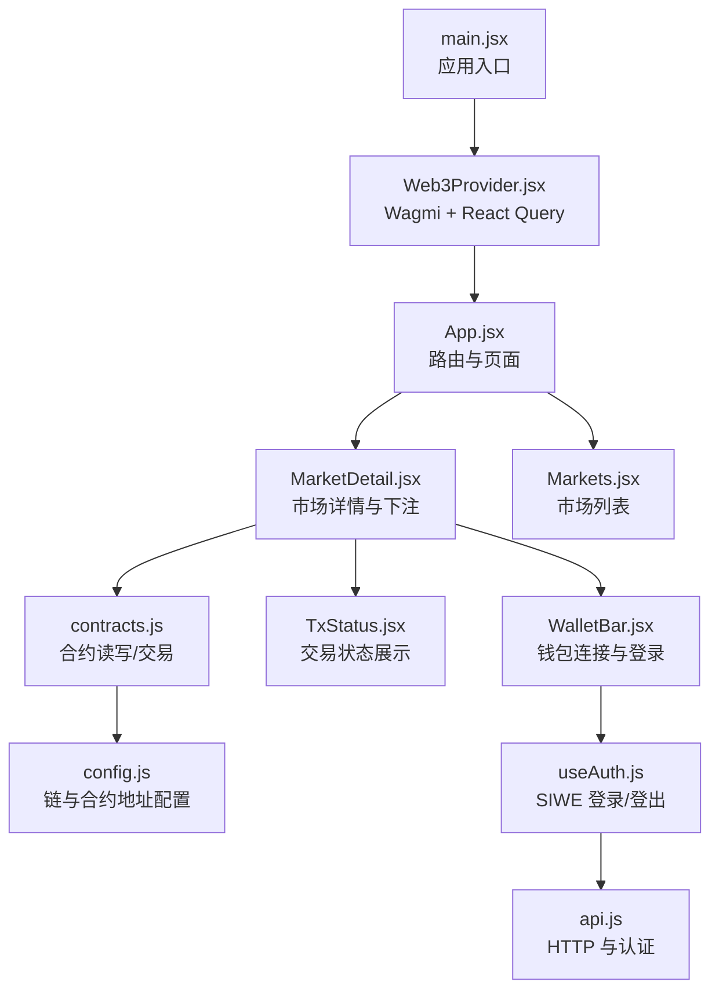
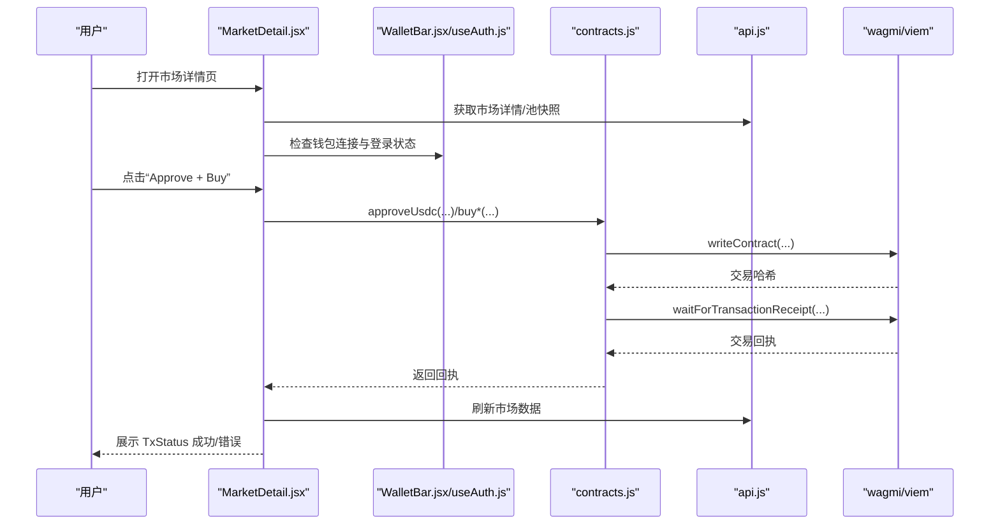
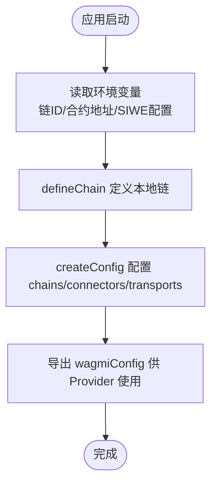
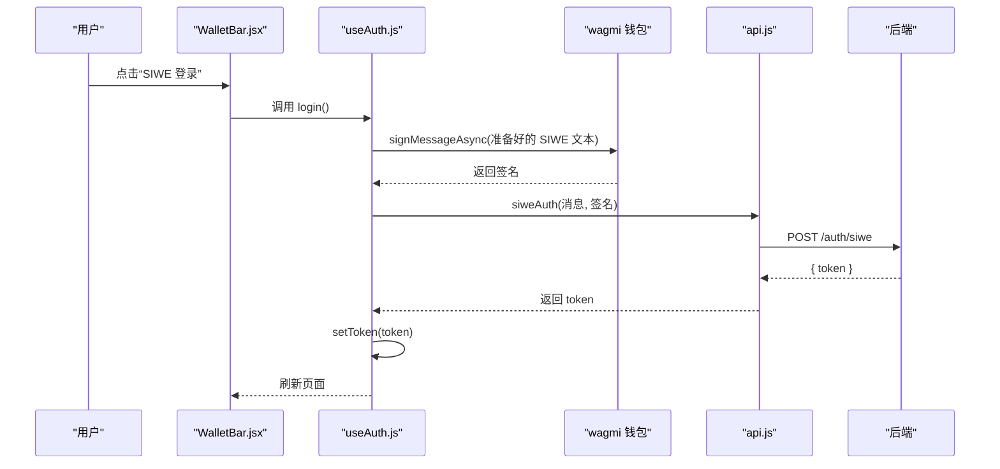
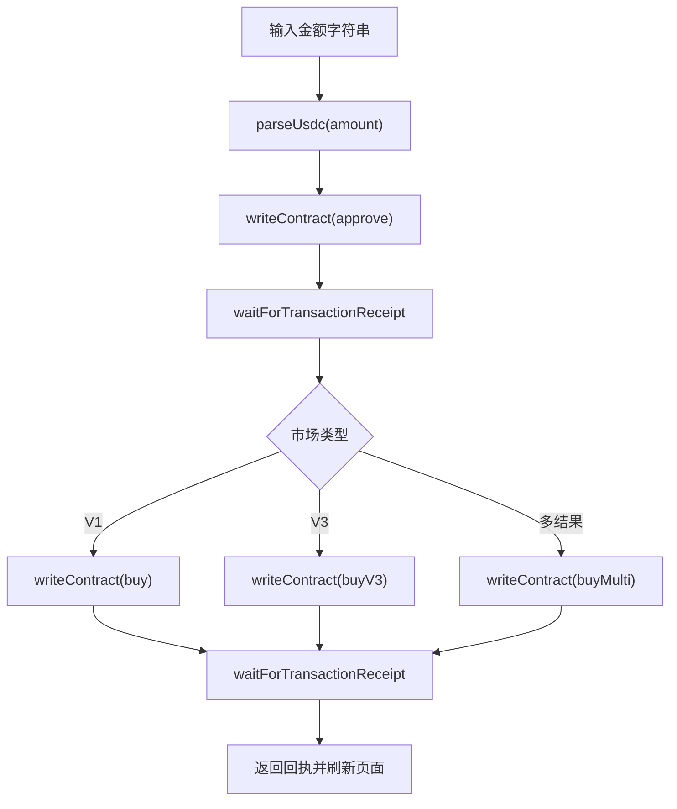
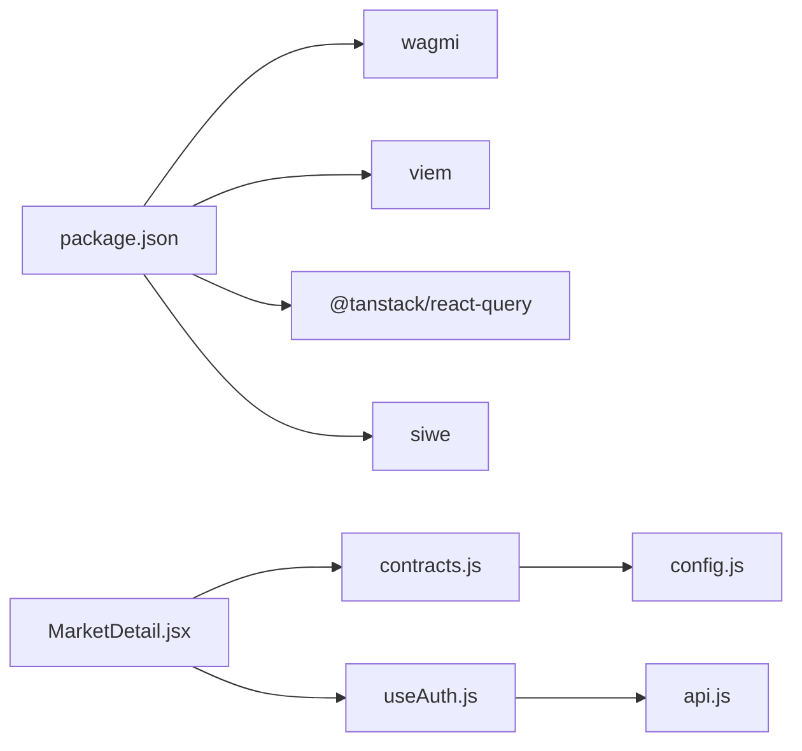

# 区块链集成

<cite>
**本文引用的文件**
- [src/wagmi.js](file://src/wagmi.js)
- [src/providers/Web3Provider.jsx](file://src/providers/Web3Provider.jsx)
- [src/services/contracts.js](file://src/services/contracts.js)
- [src/config.js](file://src/config.js)
- [package.json](file://package.json)
- [src/main.jsx](file://src/main.jsx)
- [src/App.jsx](file://src/App.jsx)
- [src/hooks/useAuth.js](file://src/hooks/useAuth.js)
- [src/components/WalletBar.jsx](file://src/components/WalletBar.jsx)
- [src/components/TxStatus.jsx](file://src/components/TxStatus.jsx)
- [src/pages/Markets.jsx](file://src/pages/Markets.jsx)
- [src/pages/MarketDetail.jsx](file://src/pages/MarketDetail.jsx)
- [src/services/api.js](file://src/services/api.js)
</cite>

## 目录
1. [简介](#简介)
2. [项目结构](#项目结构)
3. [核心组件](#核心组件)
4. [架构总览](#架构总览)
5. [详细组件分析](#详细组件分析)
6. [依赖关系分析](#依赖关系分析)
7. [性能考虑](#性能考虑)
8. [故障排查指南](#故障排查指南)
9. [结论](#结论)
10. [附录](#附录)

## 简介
本文件面向前端区块链集成场景，系统性阐述基于 wagmi 与 viem 的钱包连接、网络配置、ABI 组织、合约交互、交易状态监控与错误处理策略。文档覆盖以下要点：
- wagmi/viem 的配置与初始化流程
- 钱包连接与 SIWE 登录集成
- ABI 文件组织与合约地址管理
- 交易发送、回执等待与状态展示
- 错误处理、重试与用户体验优化
- 智能合约调用最佳实践与性能优化建议

## 项目结构
前端采用 React + Vite 架构，通过 Web3Provider 将 wagmi 与 React Query 提供的能力注入至应用根部；业务逻辑按功能模块拆分，包括配置、服务、页面与组件。

图表来源
- [src/main.jsx](file://src/main.jsx#L17-L32)
- [src/providers/Web3Provider.jsx](file://src/providers/Web3Provider.jsx#L16-L24)
- [src/App.jsx](file://src/App.jsx#L31-L66)
- [src/pages/MarketDetail.jsx](file://src/pages/MarketDetail.jsx#L31-L184)
- [src/pages/Markets.jsx](file://src/pages/Markets.jsx#L14-L55)
- [src/services/contracts.js](file://src/services/contracts.js#L1-L214)
- [src/components/TxStatus.jsx](file://src/components/TxStatus.jsx#L6-L25)
- [src/components/WalletBar.jsx](file://src/components/WalletBar.jsx#L10-L53)
- [src/config.js](file://src/config.js#L7-L22)
- [src/hooks/useAuth.js](file://src/hooks/useAuth.js#L16-L109)
- [src/services/api.js](file://src/services/api.js#L29-L55)

章节来源
- [src/main.jsx](file://src/main.jsx#L17-L32)
- [src/providers/Web3Provider.jsx](file://src/providers/Web3Provider.jsx#L16-L24)
- [src/App.jsx](file://src/App.jsx#L31-L66)

## 核心组件
- 配置与网络
  - 链定义与传输：通过 viem 的 defineChain 定义本地链，wagmi 使用 createConfig 配置链、连接器与传输。
  - 环境变量：链 ID、合约地址、SIWE 域名与 URI 通过环境变量注入。
- 提供者注入
  - Web3Provider 将 wagmi 与 React Query 的客户端实例注入应用树，使页面与组件可直接使用钱包与合约能力。
- 钱包与认证
  - useAuth 钩子封装 useAccount/useSignMessage，实现 SIWE 登录、令牌持久化与 DID 绑定。
  - WalletBar 展示连接状态、登录/登出按钮与错误提示。
- 合约交互
  - contracts.js 封装 readContract/writeContract/waitForTransactionReceipt，统一处理 approve、buy、claim、addLiquidity、池状态读取等。
- 页面与状态展示
  - MarketDetail 负责读取市场数据、触发交易、展示交易状态；Markets 展示市场列表。
  - TxStatus 统一展示 pending/success/error 与交易哈希。

章节来源
- [src/wagmi.js](file://src/wagmi.js#L11-L36)
- [src/config.js](file://src/config.js#L7-L22)
- [src/providers/Web3Provider.jsx](file://src/providers/Web3Provider.jsx#L16-L24)
- [src/hooks/useAuth.js](file://src/hooks/useAuth.js#L16-L109)
- [src/components/WalletBar.jsx](file://src/components/WalletBar.jsx#L10-L53)
- [src/services/contracts.js](file://src/services/contracts.js#L43-L213)
- [src/pages/MarketDetail.jsx](file://src/pages/MarketDetail.jsx#L31-L184)
- [src/pages/Markets.jsx](file://src/pages/Markets.jsx#L14-L55)
- [src/components/TxStatus.jsx](file://src/components/TxStatus.jsx#L6-L25)

## 架构总览
下图展示了从前端入口到区块链交互与后端 API 的整体调用路径。

图表来源
- [src/pages/MarketDetail.jsx](file://src/pages/MarketDetail.jsx#L78-L110)
- [src/services/contracts.js](file://src/services/contracts.js#L59-L123)
- [src/services/api.js](file://src/services/api.js#L89-L91)
- [src/hooks/useAuth.js](file://src/hooks/useAuth.js#L29-L80)
- [src/components/WalletBar.jsx](file://src/components/WalletBar.jsx#L36-L46)

## 详细组件分析

### 配置与网络（wagmi + viem）
- 链定义：通过 defineChain 定义本地链，包含链 ID、原生代币与 RPC 地址。
- 全局配置：createConfig 指定 chains/connectors/transports，当前使用 injected 连接器与 HTTP 传输。
- 环境变量：链 ID、合约地址、SIWE 域名/URI 从环境变量读取，便于不同环境切换。

图表来源
- [src/wagmi.js](file://src/wagmi.js#L11-L36)
- [src/config.js](file://src/config.js#L7-L22)

章节来源
- [src/wagmi.js](file://src/wagmi.js#L11-L36)
- [src/config.js](file://src/config.js#L7-L22)

### 提供者注入（Web3Provider）
- React Query 客户端：用于缓存与异步数据请求管理。
- WagmiProvider：注入 wagmi 配置，提供钱包连接与合约交互能力。
- 组合使用：两者的 Provider 嵌套注入，保证全站具备区块链与数据缓存能力。

章节来源
- [src/providers/Web3Provider.jsx](file://src/providers/Web3Provider.jsx#L16-L24)

### 钱包与认证（useAuth + WalletBar）
- useAuth
  - useAccount/useSignMessage 获取地址与链 ID，构造 SIWE 消息并请求签名。
  - 调用后端 siweAuth 获取 JWT，保存至本地存储；尝试绑定 DID。
  - 提供 login/logout 与认证状态暴露。
- WalletBar
  - 根据连接状态显示连接/断开按钮与地址缩略。
  - 调用 useAuth 的 login/logout，展示错误信息。

图表来源
- [src/hooks/useAuth.js](file://src/hooks/useAuth.js#L29-L80)
- [src/components/WalletBar.jsx](file://src/components/WalletBar.jsx#L36-L46)
- [src/services/api.js](file://src/services/api.js#L94-L99)

章节来源
- [src/hooks/useAuth.js](file://src/hooks/useAuth.js#L16-L109)
- [src/components/WalletBar.jsx](file://src/components/WalletBar.jsx#L10-L53)

### 合约交互（contracts.js）
- 金额工具：parseUsdc/formatUsdc 用于 mUSDC 与链上整数的互转。
- 读写封装：
  - 读取余额 approveUsdc/buyOutcome/buyV3/buyMulti/addLiquidityV3/claim
  - 读取状态 readUsdcBalance/readMarketStatus/readPoolStateV3
  - 统一使用 waitForTransactionReceipt 等待回执。
- 并行读取：readMarketStatus 对多个合约方法使用 Promise.all 提升性能。

图表来源
- [src/services/contracts.js](file://src/services/contracts.js#L24-L123)
- [src/pages/MarketDetail.jsx](file://src/pages/MarketDetail.jsx#L78-L110)

章节来源
- [src/services/contracts.js](file://src/services/contracts.js#L24-L213)
- [src/pages/MarketDetail.jsx](file://src/pages/MarketDetail.jsx#L78-L110)

### 页面与状态展示（MarketDetail + TxStatus）
- MarketDetail
  - 从 API 获取市场详情与池快照，必要时读取链上状态。
  - 用户点击“Approve + Buy”时，先 approve 再根据类型调用对应 buy*，最后展示 TxStatus。
- TxStatus
  - 根据 status/error/hash 渲染不同状态提示，包含交易哈希展示。

章节来源
- [src/pages/MarketDetail.jsx](file://src/pages/MarketDetail.jsx#L31-L184)
- [src/components/TxStatus.jsx](file://src/components/TxStatus.jsx#L6-L25)

### API 与认证（api.js）
- 令牌管理：getToken/setToken/clearToken 持久化 JWT。
- 请求封装：request 统一处理 Content-Type、Authorization 头与非 2xx 错误。
- 功能接口：健康检查、市场列表/详情、SIWE 认证、DID 绑定、管理员接口等。

章节来源
- [src/services/api.js](file://src/services/api.js#L29-L187)

## 依赖关系分析
- 依赖版本
  - wagmi 与 viem 为核心区块链交互库；React Query 用于数据缓存；siwe 用于签名登录。
- 模块耦合
  - contracts.js 依赖 wagmiConfig 与 ABI 文件，耦合度适中，便于替换链或合约。
  - useAuth 依赖 wagmi 与 api.js，形成认证闭环。
  - 页面组件依赖服务层与组件层，职责清晰。

图表来源
- [package.json](file://package.json#L12-L29)
- [src/pages/MarketDetail.jsx](file://src/pages/MarketDetail.jsx#L9-L19)
- [src/services/contracts.js](file://src/services/contracts.js#L5-L6)
- [src/config.js](file://src/config.js#L7-L22)
- [src/hooks/useAuth.js](file://src/hooks/useAuth.js#L8-L10)
- [src/services/api.js](file://src/services/api.js#L2-L2)

章节来源
- [package.json](file://package.json#L12-L29)

## 性能考虑
- 并行读取：在读取市场状态时使用 Promise.all 并行调用多个合约方法，减少等待时间。
- 金额转换：使用 parseUnits/formatUnits 处理精度，避免浮点误差。
- 缓存策略：React Query 客户端默认缓存，结合合理的查询键设计可降低重复请求。
- 交易批处理：在一次交互中合并 approve 与 buy，减少链上往返次数。

章节来源
- [src/services/contracts.js](file://src/services/contracts.js#L185-L210)

## 故障排查指南
- 钱包未连接或链 ID 缺失
  - 现象：SIWE 登录按钮不可用或登录失败。
  - 排查：确认 useAccount 返回的 address 与 chainId 是否存在；WalletBar 是否显示连接状态。
- 交易失败
  - 现象：TxStatus 显示 error；shortMessage 或 message 为空。
  - 排查：检查合约地址、金额单位（mUSDC）、市场状态（需 OPEN 且无需 VC 限制）；查看回执等待是否超时。
- 合约地址缺失
  - 现象：approve/buy 无法执行。
  - 排查：确认 config 中 mockUsdc/marketFactory 等地址已正确设置。
- 认证失败
  - 现象：登录后仍显示未认证。
  - 排查：检查本地存储中的 token 是否存在；后端 siweAuth 是否返回 token；bindDid 是否报错但可忽略。

章节来源
- [src/hooks/useAuth.js](file://src/hooks/useAuth.js#L29-L80)
- [src/pages/MarketDetail.jsx](file://src/pages/MarketDetail.jsx#L78-L110)
- [src/components/TxStatus.jsx](file://src/components/TxStatus.jsx#L12-L16)
- [src/config.js](file://src/config.js#L14-L17)

## 结论
本项目以 wagmi + viem 为基础，结合 React Query 与自定义服务层，构建了清晰的钱包连接、认证与合约交互体系。通过统一的配置、ABI 组织与交易封装，实现了良好的可维护性与扩展性。建议在生产环境中进一步完善错误重试、链切换与多链支持、以及更细粒度的状态与日志记录。

## 附录

### ABI 定义文件组织
- 位置：src/abis/
- 作用：存放各合约 ABI JSON，供 contracts.js 引用。
- 建议：按合约类型分组命名，保持与后端部署地址一致。

章节来源
- [src/services/contracts.js](file://src/services/contracts.js#L8-L14)

### 合约地址管理
- 配置项：mockUsdc、marketFactory、siweDomain、siweUri 等。
- 环境变量：通过 VITE_* 注入，便于不同环境切换。
- 建议：在 config 中集中管理，避免硬编码。

章节来源
- [src/config.js](file://src/config.js#L14-L22)

### 交易发送与状态监控机制
- 发送流程：approve → buy（或 buyV3/buyMulti）→ waitForTransactionReceipt。
- 状态展示：TxStatus 统一渲染 pending/success/error 与哈希。
- 建议：在 UI 层增加“交易已提交”提示与自动刷新，提升用户体验。

章节来源
- [src/services/contracts.js](file://src/services/contracts.js#L59-L123)
- [src/pages/MarketDetail.jsx](file://src/pages/MarketDetail.jsx#L78-L110)
- [src/components/TxStatus.jsx](file://src/components/TxStatus.jsx#L6-L25)

### 错误处理与重试策略
- 错误捕获：useAuth 与 MarketDetail 均包含 try/catch 与错误状态设置。
- 重试建议：对网络波动或临时性错误（如 RPC 不可用）可引入指数退避重试；对业务错误（如市场非 OPEN）应提示用户并阻断后续操作。
- 日志记录：在开发环境输出 shortMessage/message 与交易哈希，便于定位问题。

章节来源
- [src/hooks/useAuth.js](file://src/hooks/useAuth.js#L73-L79)
- [src/pages/MarketDetail.jsx](file://src/pages/MarketDetail.jsx#L106-L109)

### 用户体验优化方案
- 连接提示：WalletBar 显示连接状态与地址缩略，登录按钮禁用时给出原因。
- 交易反馈：TxStatus 在 pending/success/error 三态明确提示；展示哈希便于追踪。
- 无障碍输入：MarketDetail 对金额输入进行最小值校验与单位提示。
- 无数据提示：Markets 在无市场时给出部署与 indexer 运行指引。

章节来源
- [src/components/WalletBar.jsx](file://src/components/WalletBar.jsx#L23-L47)
- [src/components/TxStatus.jsx](file://src/components/TxStatus.jsx#L12-L22)
- [src/pages/Markets.jsx](file://src/pages/Markets.jsx#L34-L34)

### 智能合约调用最佳实践
- 金额单位：始终使用 mUSDC（6 位小数）与 parseUsdc/formatUsdc，避免精度问题。
- 顺序约束：先 approve 再 buy；对 V3 市场可额外调用 addLiquidity。
- 并行读取：使用 Promise.all 读取多字段，减少 RTT。
- 状态判断：在 UI 层检查市场状态与 VC 权限，避免无效调用。

章节来源
- [src/services/contracts.js](file://src/services/contracts.js#L24-L35)
- [src/pages/MarketDetail.jsx](file://src/pages/MarketDetail.jsx#L78-L110)