# 智能合约交互

<cite>
**本文引用的文件**
- [src/services/contracts.js](file://src/services/contracts.js)
- [src/providers/Web3Provider.jsx](file://src/providers/Web3Provider.jsx)
- [src/wagmi.js](file://src/wagmi.js)
- [src/config.js](file://src/config.js)
- [src/services/api.js](file://src/services/api.js)
- [src/hooks/useAuth.js](file://src/hooks/useAuth.js)
- [src/main.jsx](file://src/main.jsx)
- [src/pages/Liquidity.jsx](file://src/pages/Liquidity.jsx)
- [src/pages/MarketDetail.jsx](file://src/pages/MarketDetail.jsx)
- [src/components/TxStatus.jsx](file://src/components/TxStatus.jsx)
- [src/components/WalletBar.jsx](file://src/components/WalletBar.jsx)
- [package.json](file://package.json)
</cite>

## 目录
1. [简介](#简介)
2. [项目结构](#项目结构)
3. [核心组件](#核心组件)
4. [架构总览](#架构总览)
5. [详细组件分析](#详细组件分析)
6. [依赖关系分析](#依赖关系分析)
7. [性能考量](#性能考量)
8. [故障排查指南](#故障排查指南)
9. [结论](#结论)
10. [附录](#附录)

## 简介
本文件面向前端智能合约交互场景，系统性梳理项目的服务层设计与交互流程，重点覆盖：
- ABI 文件管理与合约实例化
- 读取、写入与事件监听的交互模式
- 参数处理策略与返回值解析机制
- 错误处理、重试逻辑与用户体验优化最佳实践

项目采用 React + wagmi + viem + @tanstack/react-query 的组合，提供钱包连接、链上读写、交易确认、以及与后端 API 的协同工作流。

## 项目结构
前端采用功能域划分与分层组织：
- providers：应用级提供者（Web3Provider）
- services：业务服务层（合约交互、API 调用）
- pages：页面组件（市场列表、市场详情、流动性管理）
- components：可复用 UI 组件（交易状态、钱包栏）
- hooks：自定义 Hook（认证）
- wagmi.js：wagmi 配置与链定义
- config.js：全局配置（网络、合约地址、SIWE）

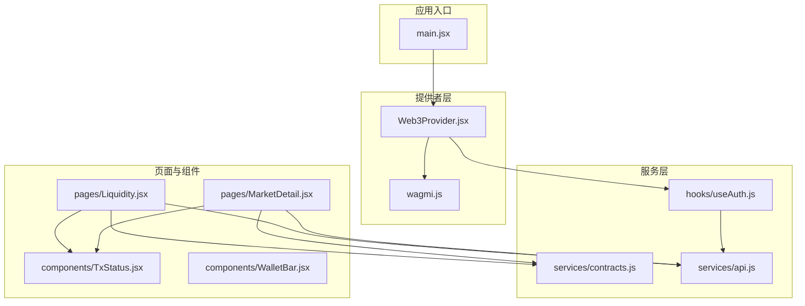

图表来源
- [src/main.jsx](file://src/main.jsx#L17-L32)
- [src/providers/Web3Provider.jsx](file://src/providers/Web3Provider.jsx#L16-L24)
- [src/wagmi.js](file://src/wagmi.js#L26-L36)
- [src/services/contracts.js](file://src/services/contracts.js#L1-L214)
- [src/services/api.js](file://src/services/api.js#L1-L187)
- [src/hooks/useAuth.js](file://src/hooks/useAuth.js#L16-L109)
- [src/pages/Liquidity.jsx](file://src/pages/Liquidity.jsx#L1-L117)
- [src/pages/MarketDetail.jsx](file://src/pages/MarketDetail.jsx#L1-L185)
- [src/components/TxStatus.jsx](file://src/components/TxStatus.jsx#L1-L26)
- [src/components/WalletBar.jsx](file://src/components/WalletBar.jsx#L1-L54)

章节来源
- [src/main.jsx](file://src/main.jsx#L17-L32)
- [src/providers/Web3Provider.jsx](file://src/providers/Web3Provider.jsx#L16-L24)
- [src/wagmi.js](file://src/wagmi.js#L10-L36)
- [src/config.js](file://src/config.js#L1-L23)

## 核心组件
- 合约服务层：统一导出金额解析/格式化、读取/写入/交易确认、多版本市场合约交互方法
- Web3 提供者：组合 wagmi 与 React Query，为全应用提供链上能力与缓存
- wagmi 配置：定义本地链、连接器与传输
- API 服务层：封装 HTTP 请求、鉴权头、错误处理与后端接口
- 自定义认证 Hook：SIWE 登录、登出、令牌管理
- 页面与组件：市场交互、交易状态展示、钱包栏

章节来源
- [src/services/contracts.js](file://src/services/contracts.js#L1-L214)
- [src/providers/Web3Provider.jsx](file://src/providers/Web3Provider.jsx#L16-L24)
- [src/wagmi.js](file://src/wagmi.js#L26-L36)
- [src/services/api.js](file://src/services/api.js#L22-L55)
- [src/hooks/useAuth.js](file://src/hooks/useAuth.js#L16-L109)
- [src/pages/Liquidity.jsx](file://src/pages/Liquidity.jsx#L1-L117)
- [src/pages/MarketDetail.jsx](file://src/pages/MarketDetail.jsx#L1-L185)
- [src/components/TxStatus.jsx](file://src/components/TxStatus.jsx#L1-L26)
- [src/components/WalletBar.jsx](file://src/components/WalletBar.jsx#L1-L54)

## 架构总览
整体架构围绕“页面组件 -> 服务层 -> wagmi/viem -> 钱包/节点”的链路展开，同时通过 React Query 缓存与 API 服务层协同。

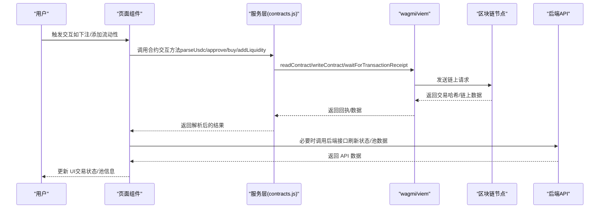

图表来源
- [src/services/contracts.js](file://src/services/contracts.js#L43-L123)
- [src/pages/MarketDetail.jsx](file://src/pages/MarketDetail.jsx#L78-L110)
- [src/pages/Liquidity.jsx](file://src/pages/Liquidity.jsx#L52-L77)
- [src/services/api.js](file://src/services/api.js#L22-L55)

## 详细组件分析

### 合约服务层（contracts.js）
- 金额解析与格式化
  - parseUsdc：将人类可读金额解析为链上整数（6 位小数）
  - formatUsdc：将链上整数金额格式化为人类可读字符串
- 读取类
  - readUsdcBalance：查询 USDC 余额
  - readPoolStateV3：读取 V3 市场池状态（储备、价格）
  - readMarketStatus：并行读取市场状态、获胜结果、池金额
- 写入类
  - approveUsdc：授权市场合约使用 USDC
  - buyOutcome/buyV3/buyMulti：购买指定结果（V1/V3/Multi）
  - addLiquidityV3：向 V3 市场注入流动性
  - claimMarket：在已结算市场领取奖金
- 交易确认
  - 所有写入方法均通过 wagmi 的 writeContract 发起交易，并使用 waitForTransactionReceipt 等待确认后返回回执

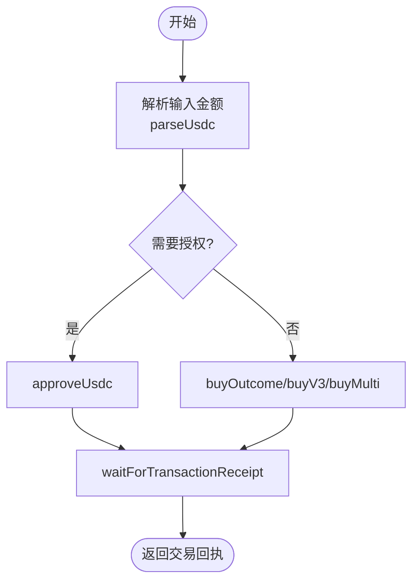

图表来源
- [src/services/contracts.js](file://src/services/contracts.js#L24-L69)
- [src/services/contracts.js](file://src/services/contracts.js#L78-L123)

章节来源
- [src/services/contracts.js](file://src/services/contracts.js#L16-L35)
- [src/services/contracts.js](file://src/services/contracts.js#L43-L50)
- [src/services/contracts.js](file://src/services/contracts.js#L59-L69)
- [src/services/contracts.js](file://src/services/contracts.js#L78-L104)
- [src/services/contracts.js](file://src/services/contracts.js#L113-L123)
- [src/services/contracts.js](file://src/services/contracts.js#L132-L142)
- [src/services/contracts.js](file://src/services/contracts.js#L150-L160)
- [src/services/contracts.js](file://src/services/contracts.js#L167-L176)
- [src/services/contracts.js](file://src/services/contracts.js#L183-L213)

### Web3 提供者与 wagmi 配置
- Web3Provider：组合 WagmiProvider 与 QueryClientProvider，为应用提供链上交互与数据缓存能力
- wagmiConfig：定义本地链（Hardhat），连接器为 injected（MetaMask 等），传输为 http

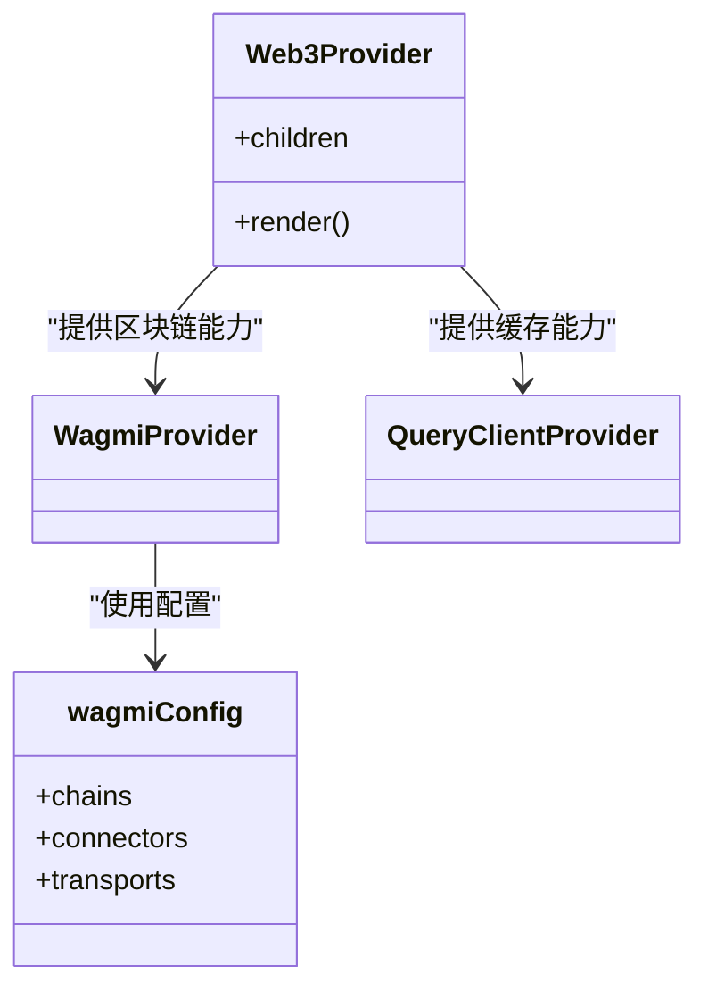

图表来源
- [src/providers/Web3Provider.jsx](file://src/providers/Web3Provider.jsx#L16-L24)
- [src/wagmi.js](file://src/wagmi.js#L26-L36)

章节来源
- [src/providers/Web3Provider.jsx](file://src/providers/Web3Provider.jsx#L16-L24)
- [src/wagmi.js](file://src/wagmi.js#L10-L36)

### API 服务层（api.js）
- 通用请求封装：自动合并请求头（含 Authorization），解析 JSON，非 2xx 抛错
- 用户认证：SIWE 登录、绑定 DID、令牌存取
- 平台数据：健康检查、就绪检查、赛事/市场列表、用户持仓/凭证、统计、池数据、订单簿
- 管理员接口：预言机任务管理、市场注册/作废

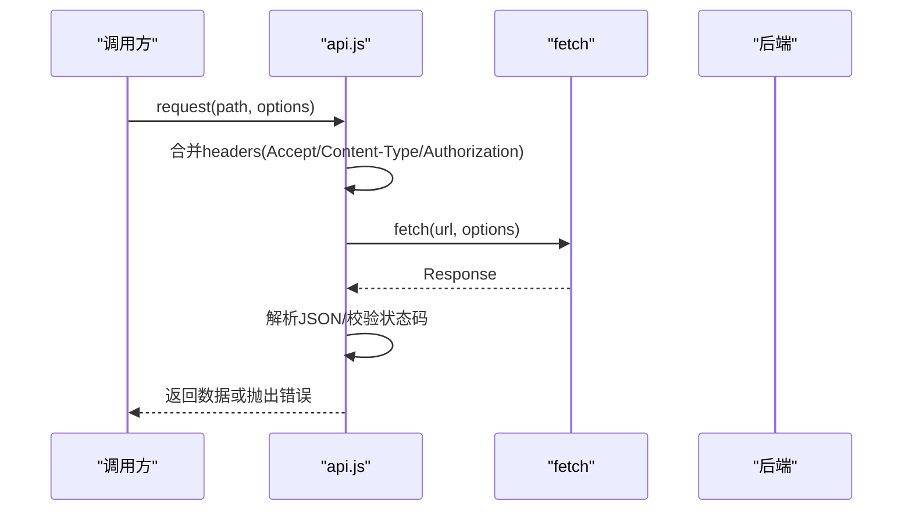

图表来源
- [src/services/api.js](file://src/services/api.js#L22-L55)

章节来源
- [src/services/api.js](file://src/services/api.js#L22-L55)
- [src/services/api.js](file://src/services/api.js#L93-L107)
- [src/services/api.js](file://src/services/api.js#L101-L107)
- [src/services/api.js](file://src/services/api.js#L168-L186)

### 自定义认证 Hook（useAuth.js）
- 使用 wagmi 的 useAccount/useSignMessage 获取地址与签名
- 构造 SIWE 消息，调用后端 siweAuth 获取 JWT，保存至本地存储
- 绑定 DID（可选），刷新页面应用状态
- 提供登录/登出与状态暴露

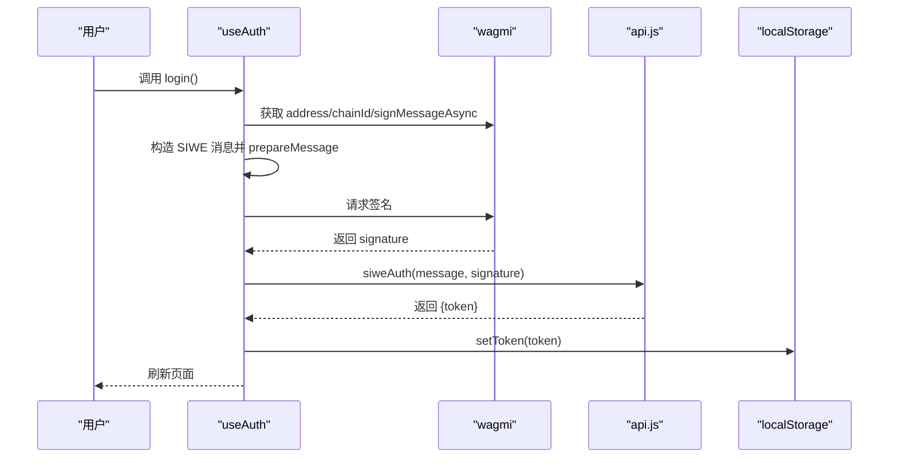

图表来源
- [src/hooks/useAuth.js](file://src/hooks/useAuth.js#L28-L80)
- [src/services/api.js](file://src/services/api.js#L93-L99)

章节来源
- [src/hooks/useAuth.js](file://src/hooks/useAuth.js#L16-L109)
- [src/services/api.js](file://src/services/api.js#L93-L99)

### 页面与组件交互示例

#### 市场详情页（MarketDetail）
- 读取市场详情与链上状态（V3 读取池状态）
- 输入金额解析、授权、购买（根据市场类型选择方法）
- 交易状态展示与失败短消息处理

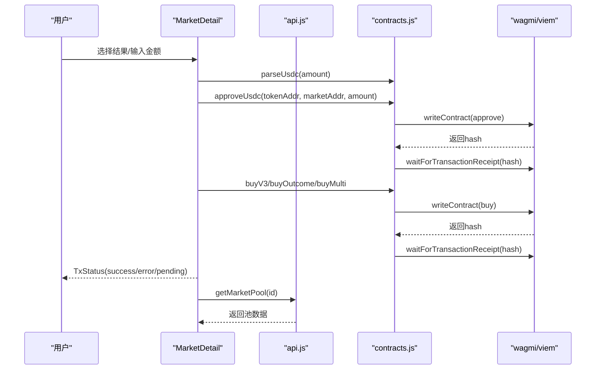

图表来源
- [src/pages/MarketDetail.jsx](file://src/pages/MarketDetail.jsx#L78-L110)
- [src/services/contracts.js](file://src/services/contracts.js#L24-L69)
- [src/services/contracts.js](file://src/services/contracts.js#L113-L123)
- [src/services/api.js](file://src/services/api.js#L178-L181)

章节来源
- [src/pages/MarketDetail.jsx](file://src/pages/MarketDetail.jsx#L78-L110)
- [src/pages/MarketDetail.jsx](file://src/pages/MarketDetail.jsx#L112-L184)

#### 流动性页（Liquidity）
- 选择开放市场，读取池状态
- 解析金额、授权、添加流动性
- 成功后刷新池数据

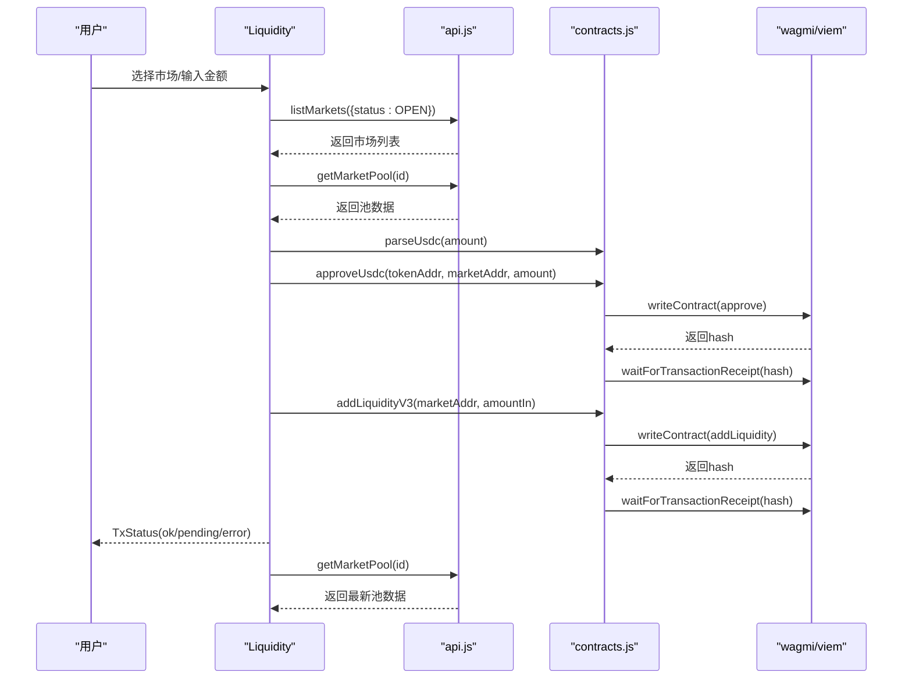

图表来源
- [src/pages/Liquidity.jsx](file://src/pages/Liquidity.jsx#L52-L77)
- [src/services/contracts.js](file://src/services/contracts.js#L150-L160)
- [src/services/api.js](file://src/services/api.js#L81-L91)
- [src/services/api.js](file://src/services/api.js#L178-L181)

章节来源
- [src/pages/Liquidity.jsx](file://src/pages/Liquidity.jsx#L52-L77)
- [src/pages/Liquidity.jsx](file://src/pages/Liquidity.jsx#L96-L116)

### 不同类型合约交互模式

#### 只读查询
- 读取余额：readUsdcBalance
- 读取池状态：readPoolStateV3
- 读取市场状态：readMarketStatus（并行读取多项）

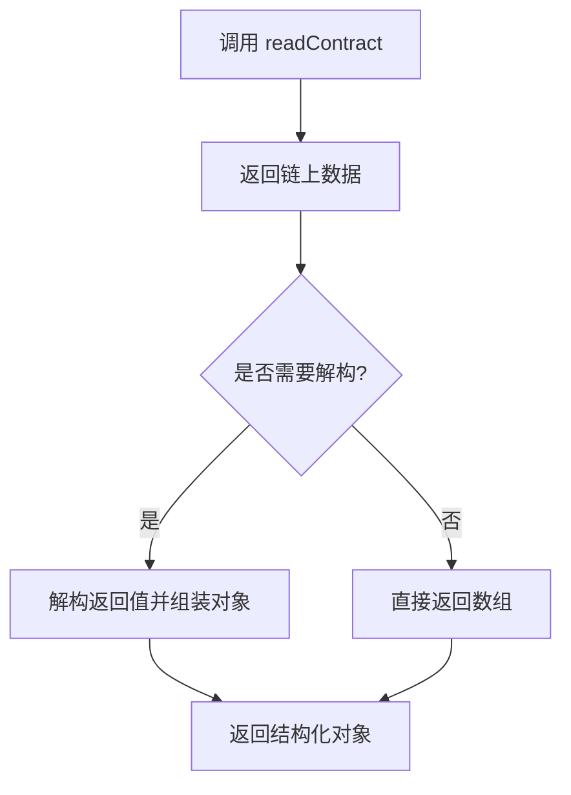

图表来源
- [src/services/contracts.js](file://src/services/contracts.js#L43-L50)
- [src/services/contracts.js](file://src/services/contracts.js#L167-L176)
- [src/services/contracts.js](file://src/services/contracts.js#L183-L213)

章节来源
- [src/services/contracts.js](file://src/services/contracts.js#L43-L50)
- [src/services/contracts.js](file://src/services/contracts.js#L167-L176)
- [src/services/contracts.js](file://src/services/contracts.js#L183-L213)

#### 写入交易
- 授权：approveUsdc
- 购买：buyOutcome/buyV3/buyMulti
- 注入流动性：addLiquidityV3
- 领取奖金：claimMarket

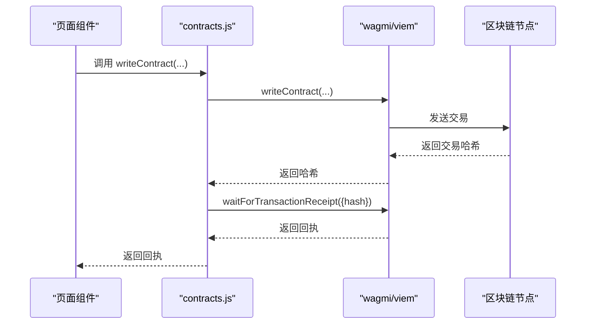

图表来源
- [src/services/contracts.js](file://src/services/contracts.js#L59-L69)
- [src/services/contracts.js](file://src/services/contracts.js#L78-L104)
- [src/services/contracts.js](file://src/services/contracts.js#L113-L123)
- [src/services/contracts.js](file://src/services/contracts.js#L132-L142)
- [src/services/contracts.js](file://src/services/contracts.js#L150-L160)

章节来源
- [src/services/contracts.js](file://src/services/contracts.js#L59-L69)
- [src/services/contracts.js](file://src/services/contracts.js#L78-L104)
- [src/services/contracts.js](file://src/services/contracts.js#L113-L123)
- [src/services/contracts.js](file://src/services/contracts.js#L132-L142)
- [src/services/contracts.js](file://src/services/contracts.js#L150-L160)

#### 事件监听
- 当前代码未直接实现事件监听（如使用 wagmi 的 watchContractEvent 或 viem 的 publicClient.watchEvent）
- 建议在需要时扩展：在页面组件中使用 watchContractEvent 订阅交易事件或市场状态变更事件，并结合 React Query 缓存更新 UI

[本节为概念性建议，不直接分析具体文件，故无章节来源]

### 参数处理策略与返回值解析
- 参数处理
  - 金额：统一使用 parseUsdc/formatUsdc，确保小数位一致
  - 地址：通过 wagmi 配置与环境变量注入
  - 交易参数：args 数组顺序与 ABI 对齐
- 返回值解析
  - 读取类：readContract 返回数组，按需解构为对象
  - 写入类：writeContract 返回交易哈希，waitForTransactionReceipt 返回回执
  - 错误：捕获异常并传递短消息（shortMessage）给 UI

章节来源
- [src/services/contracts.js](file://src/services/contracts.js#L24-L35)
- [src/services/contracts.js](file://src/services/contracts.js#L167-L176)
- [src/pages/MarketDetail.jsx](file://src/pages/MarketDetail.jsx#L106-L109)

## 依赖关系分析
- 依赖栈
  - React + react-router-dom：页面与路由
  - wagmi + viem：链上交互与钱包连接
  - @tanstack/react-query：数据缓存与异步状态管理
  - siwe：SIWE 登录协议
- 组件耦合
  - 页面组件依赖服务层方法与 API 服务
  - 服务层依赖 wagmi 配置与 ABI
  - 提供者层为全局注入，降低跨组件耦合

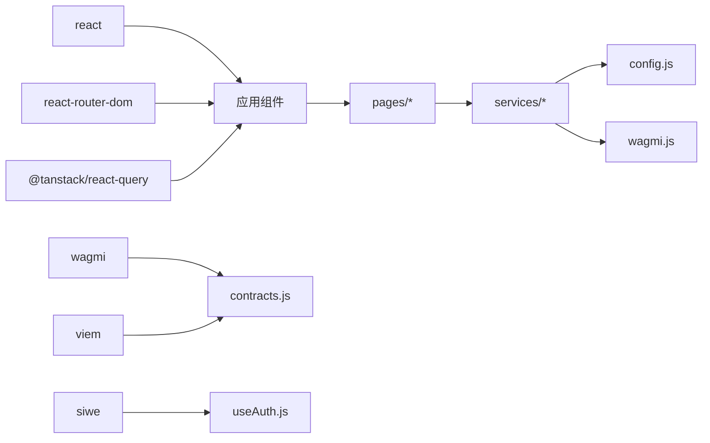

图表来源
- [package.json](file://package.json#L12-L28)
- [src/services/contracts.js](file://src/services/contracts.js#L1-L6)
- [src/wagmi.js](file://src/wagmi.js#L1-L8)
- [src/config.js](file://src/config.js#L1-L23)

章节来源
- [package.json](file://package.json#L12-L28)
- [src/services/contracts.js](file://src/services/contracts.js#L1-L6)
- [src/wagmi.js](file://src/wagmi.js#L1-L8)
- [src/config.js](file://src/config.js#L1-L23)

## 性能考量
- 并行读取：readMarketStatus 使用 Promise.all 并行获取多项状态，减少往返时间
- 交易确认：waitForTransactionReceipt 串行等待，避免并发冲突
- 缓存：React Query 在 Web3Provider 中启用，可用于缓存 API 数据与链上状态
- UI 响应：交易状态组件及时反馈 pending/success/error，提升体验

章节来源
- [src/services/contracts.js](file://src/services/contracts.js#L183-L213)
- [src/providers/Web3Provider.jsx](file://src/providers/Web3Provider.jsx#L8-L9)
- [src/components/TxStatus.jsx](file://src/components/TxStatus.jsx#L6-L25)

## 故障排查指南
- 钱包未连接或链 ID 缺失
  - useAuth 登录流程会检查 address/chainId，缺失则直接返回
- 交易失败
  - 捕获异常并显示 shortMessage 或 message；检查授权是否完成、金额是否正确、市场状态是否开放
- 授权未生效
  - 确认 approveUsdc 已完成且 allowance 足够
- 金额精度问题
  - 使用 parseUsdc/formatUsdc 统一处理，避免小数位差异
- 交易确认超时
  - 检查网络状态与节点连通性；必要时增加等待时间或重试

章节来源
- [src/hooks/useAuth.js](file://src/hooks/useAuth.js#L28-L80)
- [src/pages/MarketDetail.jsx](file://src/pages/MarketDetail.jsx#L106-L109)
- [src/services/contracts.js](file://src/services/contracts.js#L24-L35)

## 结论
本项目通过清晰的服务层抽象与提供者组合，实现了从钱包连接、链上读写到交易确认的完整闭环。金额解析/格式化、并行读取、统一的错误处理与 UI 状态反馈，构成了稳健的交互体验。建议后续在事件监听与重试机制方面进一步增强，以提升复杂场景下的可靠性与用户体验。

## 附录
- 环境变量与配置
  - VITE_API_URL、VITE_CHAIN_ID、VITE_MOCK_USDC_ADDRESS、VITE_MARKET_FACTORY_ADDRESS、VITE_SIWE_DOMAIN、VITE_SIWE_URI
- 常用方法速览
  - parseUsdc/formatUsdc：金额处理
  - readUsdcBalance/readPoolStateV3/readMarketStatus：只读查询
  - approveUsdc/buyOutcome/buyV3/buyMulti/addLiquidityV3/claimMarket：写入交易
  - siweAuth/bindDid：认证与 DID 绑定

章节来源
- [src/config.js](file://src/config.js#L1-L23)
- [src/services/contracts.js](file://src/services/contracts.js#L24-L35)
- [src/services/contracts.js](file://src/services/contracts.js#L43-L50)
- [src/services/contracts.js](file://src/services/contracts.js#L167-L176)
- [src/services/contracts.js](file://src/services/contracts.js#L183-L213)
- [src/services/contracts.js](file://src/services/contracts.js#L59-L69)
- [src/services/contracts.js](file://src/services/contracts.js#L78-L104)
- [src/services/contracts.js](file://src/services/contracts.js#L113-L123)
- [src/services/contracts.js](file://src/services/contracts.js#L132-L142)
- [src/services/contracts.js](file://src/services/contracts.js#L150-L160)
- [src/services/api.js](file://src/services/api.js#L93-L107)
- [src/services/api.js](file://src/services/api.js#L101-L107)