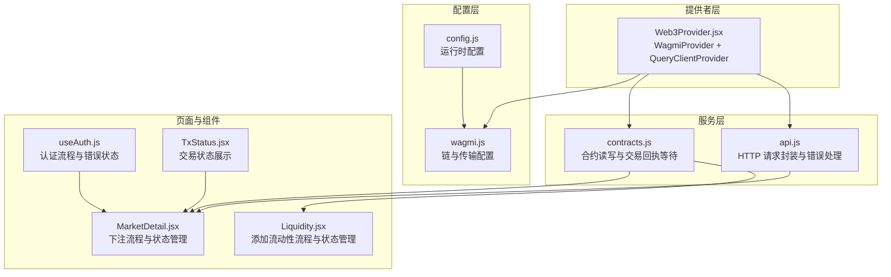
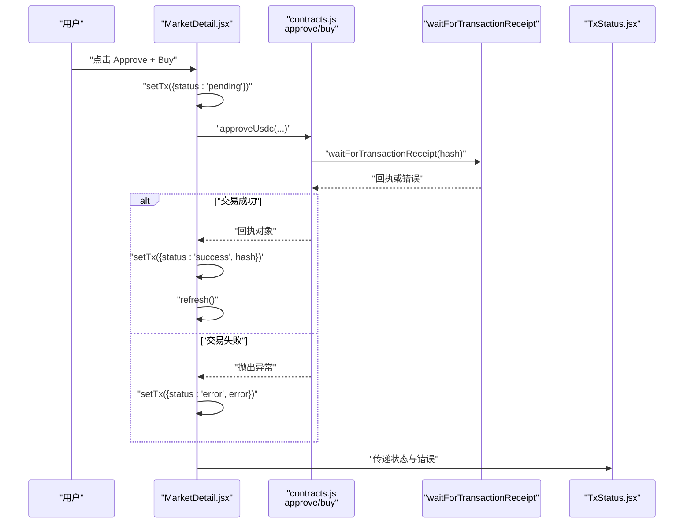
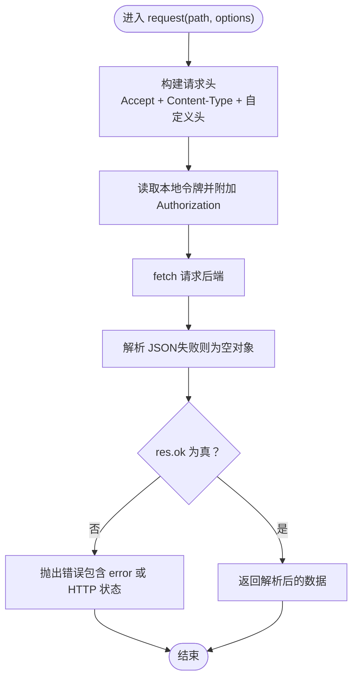
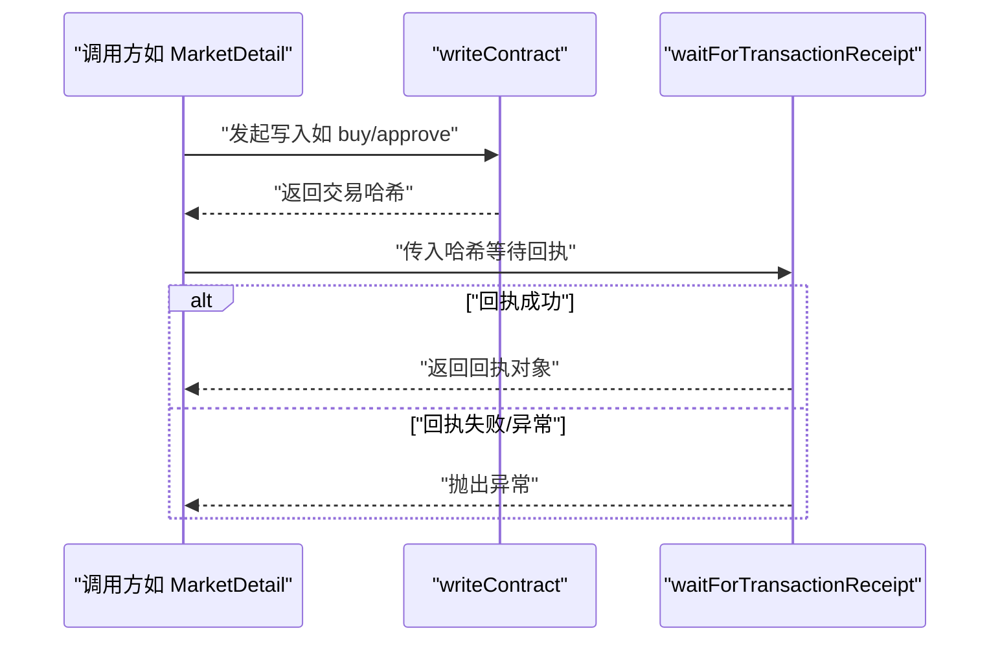
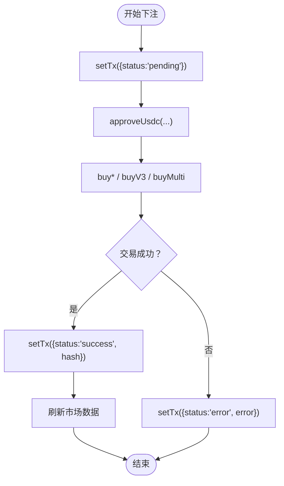
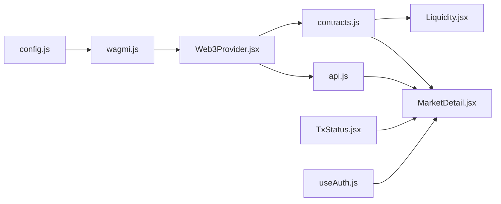

# 错误处理与重试

<cite>
**本文引用的文件**
- [src/services/contracts.js](file://src/services/contracts.js)
- [src/services/api.js](file://src/services/api.js)
- [src/components/TxStatus.jsx](file://src/components/TxStatus.jsx)
- [src/pages/MarketDetail.jsx](file://src/pages/MarketDetail.jsx)
- [src/pages/Liquidity.jsx](file://src/pages/Liquidity.jsx)
- [src/hooks/useAuth.js](file://src/hooks/useAuth.js)
- [src/providers/Web3Provider.jsx](file://src/providers/Web3Provider.jsx)
- [src/wagmi.js](file://src/wagmi.js)
- [src/config.js](file://src/config.js)
</cite>

## 目录
1. [简介](#简介)
2. [项目结构](#项目结构)
3. [核心组件](#核心组件)
4. [架构总览](#架构总览)
5. [详细组件分析](#详细组件分析)
6. [依赖关系分析](#依赖关系分析)
7. [性能考量](#性能考量)
8. [故障排除指南](#故障排除指南)
9. [结论](#结论)
10. [附录](#附录)

## 简介
本文件聚焦于前端侧的“区块链错误处理与重试”主题，结合现有代码库中的实现，系统梳理以下方面：
- 区块链相关错误类型：网络错误、合约错误、交易失败等
- 错误捕获与处理实现：API 层、合约层、UI 层的状态管理与展示
- 用户友好的错误提示设计：状态字段、错误消息、交易哈希展示
- 日志记录与监控建议：控制台输出、错误聚合与上报
- 调试技巧与故障排除：常见问题定位、重试策略设计建议

注意：当前仓库未包含显式的“指数退避重试”实现，本文在策略设计与最佳实践部分提供可扩展的建议，便于后续集成。

## 项目结构
前端采用模块化组织，围绕“Web3Provider + wagmi + React Query + 业务服务”的分层架构：
- 提供者层：Web3Provider 负责注入 wagmi 与 React Query 能力
- 配置层：wagmi.js 定义链与传输，config.js 提供运行时配置
- 服务层：api.js 封装 HTTP 请求与错误处理；contracts.js 封装合约读写与交易回执等待
- 页面与组件：MarketDetail、Liquidity 等页面在交互过程中调用服务层并管理 UI 状态；TxStatus 负责交易状态展示

图表来源
- [src/providers/Web3Provider.jsx](file://src/providers/Web3Provider.jsx#L16-L24)
- [src/wagmi.js](file://src/wagmi.js#L26-L36)
- [src/config.js](file://src/config.js#L7-L22)
- [src/services/api.js](file://src/services/api.js#L29-L55)
- [src/services/contracts.js](file://src/services/contracts.js#L43-L123)
- [src/pages/MarketDetail.jsx](file://src/pages/MarketDetail.jsx#L77-L110)
- [src/pages/Liquidity.jsx](file://src/pages/Liquidity.jsx#L51-L77)
- [src/components/TxStatus.jsx](file://src/components/TxStatus.jsx#L6-L25)
- [src/hooks/useAuth.js](file://src/hooks/useAuth.js#L28-L80)

章节来源
- [src/providers/Web3Provider.jsx](file://src/providers/Web3Provider.jsx#L16-L24)
- [src/wagmi.js](file://src/wagmi.js#L26-L36)
- [src/config.js](file://src/config.js#L7-L22)
- [src/services/api.js](file://src/services/api.js#L29-L55)
- [src/services/contracts.js](file://src/services/contracts.js#L43-L123)
- [src/pages/MarketDetail.jsx](file://src/pages/MarketDetail.jsx#L77-L110)
- [src/pages/Liquidity.jsx](file://src/pages/Liquidity.jsx#L51-L77)
- [src/components/TxStatus.jsx](file://src/components/TxStatus.jsx#L6-L25)
- [src/hooks/useAuth.js](file://src/hooks/useAuth.js#L28-L80)

## 核心组件
- API 层（api.js）
  - 统一的 request 封装，负责请求头、鉴权、响应解析与错误抛出
  - 对非 2xx 响应统一抛出错误，便于上层捕获与展示
- 合约层（contracts.js）
  - 读写合约与等待交易回执，返回回执对象
  - 交易失败会抛出异常，由调用方捕获
- 页面层（MarketDetail、Liquidity）
  - 在用户触发操作时设置“pending/success/error”状态
  - 捕获异常并回填错误消息；成功后刷新数据
- UI 层（TxStatus）
  - 根据状态字段渲染“提交中/成功/失败”，并在存在哈希时展示交易哈希
- 认证层（useAuth）
  - 登录流程中捕获错误并设置错误状态，避免阻断用户体验

章节来源
- [src/services/api.js](file://src/services/api.js#L29-L55)
- [src/services/contracts.js](file://src/services/contracts.js#L59-L123)
- [src/pages/MarketDetail.jsx](file://src/pages/MarketDetail.jsx#L77-L110)
- [src/pages/Liquidity.jsx](file://src/pages/Liquidity.jsx#L51-L77)
- [src/components/TxStatus.jsx](file://src/components/TxStatus.jsx#L6-L25)
- [src/hooks/useAuth.js](file://src/hooks/useAuth.js#L28-L80)

## 架构总览
下图展示了典型“下注”流程中的错误传播路径：页面发起操作 -> 合约层执行交易 -> 等待回执 -> 成功/失败回调 -> UI 更新状态。

图表来源
- [src/pages/MarketDetail.jsx](file://src/pages/MarketDetail.jsx#L77-L110)
- [src/services/contracts.js](file://src/services/contracts.js#L59-L123)
- [src/components/TxStatus.jsx](file://src/components/TxStatus.jsx#L6-L25)

## 详细组件分析

### API 层错误处理（api.js）
- 统一请求封装：自动合并请求头、附加 Authorization（若存在令牌），解析 JSON
- 错误抛出：当 res.ok 为 false 时，抛出包含错误信息或状态码的错误
- 适用场景：后端接口不可达、鉴权失败、业务错误等

图表来源
- [src/services/api.js](file://src/services/api.js#L29-L55)

章节来源
- [src/services/api.js](file://src/services/api.js#L29-L55)

### 合约层错误处理（contracts.js）
- 写入合约：writeContract 返回交易哈希；waitForTransactionReceipt 等待回执
- 错误传播：若交易失败或等待异常，抛出异常供调用方捕获
- 适用场景：钱包拒绝、Gas 不足、合约逻辑校验失败、网络超时等

图表来源
- [src/services/contracts.js](file://src/services/contracts.js#L59-L123)

章节来源
- [src/services/contracts.js](file://src/services/contracts.js#L59-L123)

### 页面层错误处理与状态管理（MarketDetail.jsx）
- 交易状态字段：{ status, error, hash }
- 成功路径：设置 status='success'，回填交易哈希，刷新数据
- 失败路径：设置 status='error'，回填错误消息（优先短消息）
- UI 展示：通过 TxStatus 组件渲染状态与哈希

图表来源
- [src/pages/MarketDetail.jsx](file://src/pages/MarketDetail.jsx#L77-L110)
- [src/components/TxStatus.jsx](file://src/components/TxStatus.jsx#L6-L25)

章节来源
- [src/pages/MarketDetail.jsx](file://src/pages/MarketDetail.jsx#L77-L110)
- [src/components/TxStatus.jsx](file://src/components/TxStatus.jsx#L6-L25)

### 页面层错误处理与状态管理（Liquidity.jsx）
- 与 MarketDetail 类似的状态管理：pending/success/error
- 失败时将错误消息回填至 UI，成功后刷新池数据
- 未捕获的异常在其他位置以 console.error 输出（可改进）

章节来源
- [src/pages/Liquidity.jsx](file://src/pages/Liquidity.jsx#L51-L77)

### 认证层错误处理（useAuth.js）
- 登录流程中捕获错误并设置 error 状态，避免中断流程
- 令牌获取与设置、SIWE 签名、DID 绑定等步骤均具备基础错误兜底

章节来源
- [src/hooks/useAuth.js](file://src/hooks/useAuth.js#L28-L80)

### 交易状态展示（TxStatus.jsx）
- 根据 status 渲染不同提示：pending/success/error
- 若存在 hash，额外展示交易哈希，便于用户与链上查询

章节来源
- [src/components/TxStatus.jsx](file://src/components/TxStatus.jsx#L6-L25)

## 依赖关系分析
- Web3Provider 注入 wagmi 与 React Query，为页面与服务层提供基础设施
- wagmi.js 定义链与传输，config.js 提供运行时配置（如链 ID、合约地址等）
- 页面组件依赖服务层（api/contracts），并通过 TxStatus 展示状态
- useAuth 与页面组件共同构成用户交互闭环

图表来源
- [src/config.js](file://src/config.js#L7-L22)
- [src/wagmi.js](file://src/wagmi.js#L26-L36)
- [src/providers/Web3Provider.jsx](file://src/providers/Web3Provider.jsx#L16-L24)
- [src/services/api.js](file://src/services/api.js#L29-L55)
- [src/services/contracts.js](file://src/services/contracts.js#L59-L123)
- [src/pages/MarketDetail.jsx](file://src/pages/MarketDetail.jsx#L77-L110)
- [src/pages/Liquidity.jsx](file://src/pages/Liquidity.jsx#L51-L77)
- [src/components/TxStatus.jsx](file://src/components/TxStatus.jsx#L6-L25)
- [src/hooks/useAuth.js](file://src/hooks/useAuth.js#L28-L80)

章节来源
- [src/config.js](file://src/config.js#L7-L22)
- [src/wagmi.js](file://src/wagmi.js#L26-L36)
- [src/providers/Web3Provider.jsx](file://src/providers/Web3Provider.jsx#L16-L24)
- [src/services/api.js](file://src/services/api.js#L29-L55)
- [src/services/contracts.js](file://src/services/contracts.js#L59-L123)
- [src/pages/MarketDetail.jsx](file://src/pages/MarketDetail.jsx#L77-L110)
- [src/pages/Liquidity.jsx](file://src/pages/Liquidity.jsx#L51-L77)
- [src/components/TxStatus.jsx](file://src/components/TxStatus.jsx#L6-L25)
- [src/hooks/useAuth.js](file://src/hooks/useAuth.js#L28-L80)

## 性能考量
- 并行读取：合约层在读取市场状态时使用 Promise.all 并行调用多个只读方法，提升性能
- UI 状态最小化：页面仅在必要时更新状态，避免不必要的重渲染
- 建议优化：
  - 对高频 API 请求启用 React Query 的缓存与回源策略
  - 对长耗时的链上操作增加“预检查”（如余额、授权额度、链上状态）减少无效交易

章节来源
- [src/services/contracts.js](file://src/services/contracts.js#L183-L213)

## 故障排除指南
- 交易失败排查
  - 检查钱包是否已连接、链 ID 是否正确、授权额度是否足够
  - 在 MarketDetail 的失败分支中，优先查看 error 字段；若无短消息，查看完整 message
  - 若交易哈希存在，可在浏览器链上浏览器中查询回执状态
- 网络与后端错误
  - API 层对非 2xx 响应会抛错；页面层通常将其转换为 UI 错误提示
  - 若出现“鉴权失败”，检查本地令牌是否存在与是否过期
- 控制台日志
  - 部分页面在加载数据时使用 console.error 捕获异常；建议统一到错误边界或全局错误处理器
- 配置核对
  - 确认链 ID、RPC 地址、合约地址等配置项是否与当前网络一致

章节来源
- [src/pages/MarketDetail.jsx](file://src/pages/MarketDetail.jsx#L106-L109)
- [src/services/api.js](file://src/services/api.js#L49-L54)
- [src/pages/Liquidity.jsx](file://src/pages/Liquidity.jsx#L47-L48)
- [src/config.js](file://src/config.js#L7-L22)
- [src/wagmi.js](file://src/wagmi.js#L10-L23)

## 结论
当前代码库在错误处理与 UI 展示层面已形成清晰的分层：API 层统一错误抛出、合约层等待回执并抛错、页面层管理状态并渲染、TxStatus 提供一致的用户反馈。对于“重试机制”，目前未见显式的指数退避实现；建议在不影响用户体验的前提下，针对可重试的网络类错误引入有限次重试策略，并配合日志与监控体系进行观测与告警。

## 附录

### 错误类型与处理建议
- 网络错误
  - 表现：请求超时、连接失败、RPC 不可用
  - 建议：对可重试的网络错误进行有限次重试（指数退避），并记录重试次数与延迟
- 合约错误
  - 表现：钱包拒绝、Gas 不足、合约校验失败
  - 建议：区分“可重试”与“不可重试”；对可重试错误（如临时网络波动）重试，对合约逻辑错误直接提示
- 交易失败
  - 表现：回执失败、等待超时
  - 建议：在 UI 层明确展示失败原因与回执哈希，提供“重试”按钮与“查看详情”入口

### 重试策略设计（建议）
- 指数退避：基础延迟 × 2^N，加入抖动避免风暴
- 最大重试次数：建议 3–5 次
- 错误分类：
  - 可重试：网络超时、RPC 不可用、钱包弹窗取消
  - 不可重试：合约逻辑失败、签名无效、权限不足
- 与 UI 结合：在“pending”期间显示倒计时与剩余重试次数，避免重复提交

### 日志记录与监控建议
- 前端日志：统一收集“错误类型 + 用户行为 + 时间戳 + 链 ID + 合约地址 + 交易哈希”
- 上报渠道：接入轻量级日志上报（如前端 SDK），或通过错误边界集中处理
- 监控看板：统计“重试率、失败率、平均回执耗时、钱包弹窗取消率”