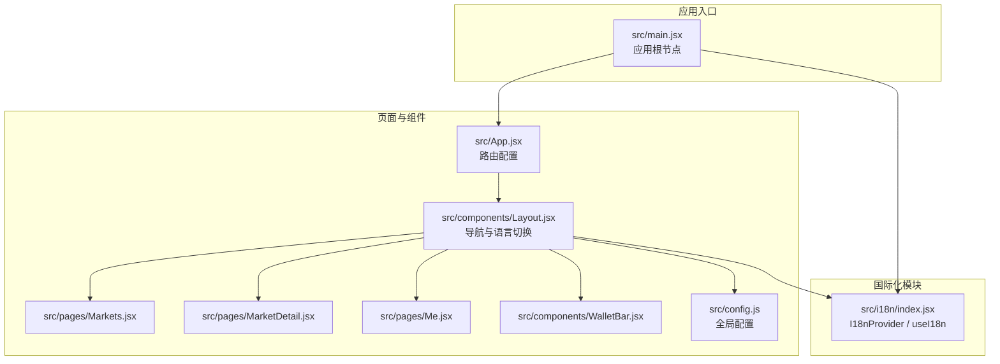
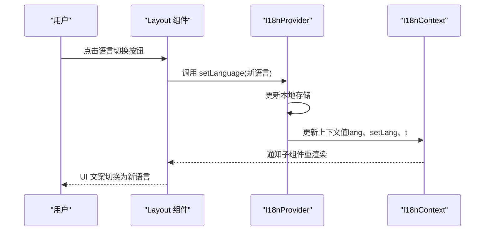
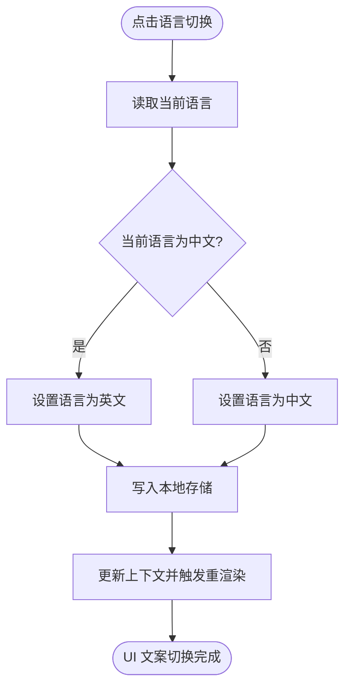
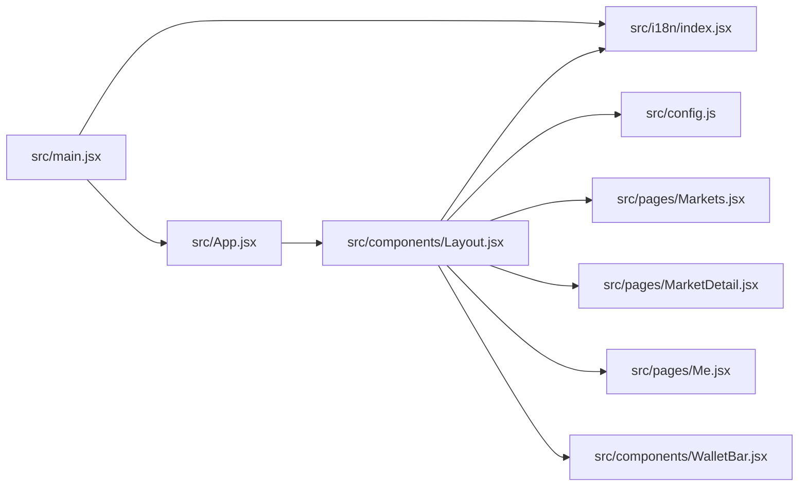

# 国际化支持

<cite>
**本文引用的文件**
- [src/i18n/index.jsx](file://src/i18n/index.jsx)
- [src/main.jsx](file://src/main.jsx)
- [src/components/Layout.jsx](file://src/components/Layout.jsx)
- [src/App.jsx](file://src/App.jsx)
- [src/config.js](file://src/config.js)
- [src/pages/Markets.jsx](file://src/pages/Markets.jsx)
- [src/pages/MarketDetail.jsx](file://src/pages/MarketDetail.jsx)
- [src/pages/Me.jsx](file://src/pages/Me.jsx)
- [src/components/WalletBar.jsx](file://src/components/WalletBar.jsx)
- [package.json](file://package.json)
</cite>

## 目录
1. [简介](#简介)
2. [项目结构](#项目结构)
3. [核心组件](#核心组件)
4. [架构总览](#架构总览)
5. [详细组件分析](#详细组件分析)
6. [依赖关系分析](#依赖关系分析)
7. [性能考量](#性能考量)
8. [故障排查指南](#故障排查指南)
9. [结论](#结论)
10. [附录](#附录)

## 简介
本文件面向国际化系统，系统性阐述前端多语言支持的实现架构与使用模式，覆盖以下主题：
- i18n 配置与上下文设计
- 翻译键值与消息体组织
- 语言切换机制与持久化策略
- React 组件中的国际化使用模式
- 动态语言加载与文本提取、管理流程
- 翻译文件组织结构、命名约定与质量保障
- 新增语言支持与翻译维护的完整指南

该系统采用轻量级 Context + 本地存储方案，提供中英双语支持，具备良好的扩展性与可维护性。

## 项目结构
国际化相关的核心文件集中在 src/i18n 目录，并在应用入口处被注入到整个组件树中；组件通过自定义 Hook useI18n 获取翻译函数与语言状态，在导航栏等位置提供语言切换入口。



图表来源
- [src/main.jsx](file://src/main.jsx#L17-L32)
- [src/i18n/index.jsx](file://src/i18n/index.jsx#L49-L66)
- [src/App.jsx](file://src/App.jsx#L31-L66)
- [src/components/Layout.jsx](file://src/components/Layout.jsx#L14-L68)
- [src/config.js](file://src/config.js#L7-L22)

章节来源
- [src/main.jsx](file://src/main.jsx#L17-L32)
- [src/i18n/index.jsx](file://src/i18n/index.jsx#L49-L66)
- [src/App.jsx](file://src/App.jsx#L31-L66)
- [src/components/Layout.jsx](file://src/components/Layout.jsx#L14-L68)
- [src/config.js](file://src/config.js#L7-L22)

## 核心组件
- 国际化提供者 I18nProvider：负责维护当前语言状态、提供翻译函数 t(key)、以及切换语言 setLanguage(lang)。语言偏好从本地存储读取，首次默认中文。
- 国际化消费钩子 useI18n：在组件中获取 { lang, setLang, t }，若在 Provider 外部使用会抛出错误，确保上下文正确性。
- 布局组件 Layout：在导航栏中展示翻译键对应的文案，并提供语言切换按钮，实现中英互切。
- 应用入口 main.jsx：在根节点包裹 I18nProvider，使全站组件均可使用国际化能力。

章节来源
- [src/i18n/index.jsx](file://src/i18n/index.jsx#L49-L79)
- [src/components/Layout.jsx](file://src/components/Layout.jsx#L14-L68)
- [src/main.jsx](file://src/main.jsx#L17-L32)

## 架构总览
系统采用“上下文提供者 + 自定义 Hook”的轻量级国际化架构：
- 上下文层：I18nProvider 维护语言状态与翻译函数，缓存上下文值避免不必要重渲染。
- 组件层：任意子组件通过 useI18n 获取翻译能力；导航栏提供语言切换入口。
- 存储层：语言偏好持久化至本地存储，刷新页面后保持一致。



图表来源
- [src/components/Layout.jsx](file://src/components/Layout.jsx#L51-L54)
- [src/i18n/index.jsx](file://src/i18n/index.jsx#L57-L62)

## 详细组件分析

### 国际化提供者与消费钩子
- I18nProvider
  - 初始化语言：从本地存储读取，缺省中文。
  - 翻译函数 t(key)：按当前语言返回对应键值，若缺失则回退为键名本身。
  - 语言切换 setLanguage(lang)：写入本地存储并更新状态，触发上下文重渲染。
  - 上下文缓存：使用 useMemo 缓存 { lang, setLang, t }，降低重渲染成本。
- useI18n
  - 获取上下文值，若未在 Provider 内使用则抛错，防止误用。

```mermaid
classDiagram
class I18nProvider {
+useState(lang)
+useMemo(value)
+t(key) string
+setLanguage(lang) void
}
class useI18n {
+useContext(I18nContext)
+返回 { lang, setLang, t }
}
class I18nContext {
<<Context>>
}
I18nProvider --> I18nContext : "提供"
useI18n --> I18nContext : "消费"
```

图表来源
- [src/i18n/index.jsx](file://src/i18n/index.jsx#L49-L79)

章节来源
- [src/i18n/index.jsx](file://src/i18n/index.jsx#L49-L79)

### 布局与语言切换
- 导航栏中使用 t('home'/'markets'/'stats'/'liquidity'/'me'/'did'/'admin'/'phase_footer') 等键渲染菜单与页脚文案。
- 语言切换按钮通过 setLang(lang === 'zh' ? 'en' : 'zh') 实现中英互切，按钮文案随当前语言动态变化。



图表来源
- [src/components/Layout.jsx](file://src/components/Layout.jsx#L51-L54)
- [src/i18n/index.jsx](file://src/i18n/index.jsx#L57-L62)

章节来源
- [src/components/Layout.jsx](file://src/components/Layout.jsx#L14-L68)
- [src/i18n/index.jsx](file://src/i18n/index.jsx#L57-L62)

### 页面组件中的国际化使用模式
- Markets 页面：使用 t('loading') 渲染加载提示。
- MarketDetail 页面：使用 t('continue') 渲染按钮文案。
- Me 页面：使用 t('restricted_title'/'restricted_body'/'accept_risk') 渲染合规提示与按钮文案。
- Layout 页面：使用 t('home'/'markets'/'stats'/'liquidity'/'me'/'did'/'admin'/'phase_footer') 渲染导航与页脚。

章节来源
- [src/pages/Markets.jsx](file://src/pages/Markets.jsx#L14-L34)
- [src/pages/MarketDetail.jsx](file://src/pages/MarketDetail.jsx#L113-L115)
- [src/pages/Me.jsx](file://src/pages/Me.jsx#L67-L78)
- [src/components/Layout.jsx](file://src/components/Layout.jsx#L24-L54)

### 动态语言加载与文本提取
- 当前实现为静态键值映射，无需动态加载；若需扩展，可在 I18nProvider 中引入异步加载逻辑，例如：
  - 按需加载对应语言 JSON 文件（如 zh.json/en.json），在 setLanguage 时动态注入 messages。
  - 保留现有 t(key) 与回退策略，确保键缺失时仍可安全渲染。
- 文本提取建议：
  - 统一在组件中通过 t('key') 使用，避免硬编码中文/英文字符串。
  - 为每个页面/功能域建立独立键空间（如 layout.home、markets.list），便于维护与查找。
  - 使用 ESLint 插件或脚本扫描 t('...') 调用，生成键清单并校验缺失键。

章节来源
- [src/i18n/index.jsx](file://src/i18n/index.jsx#L54-L55)

### 翻译文件组织结构与命名约定
- 当前实现采用单一文件内联键值映射，建议迁移为文件化结构：
  - 目录结构：src/locales/{lang}/common.json、pages/markets.json、pages/me.json 等。
  - 命名约定：
    - 语言代码：zh、en（遵循 ISO 639-1）。
    - 功能域：common、pages、components、errors 等。
    - 键名：小驼峰或点分层级（如 pages.markets.list），避免重复。
- 与现有 t(key) 的兼容：迁移后可将点分键转换为扁平映射或在运行时解析路径，保持 API 不变。

章节来源
- [src/i18n/index.jsx](file://src/i18n/index.jsx#L5-L40)

### 翻译质量保证措施
- 键值一致性：通过键清单与 CI 校验，确保各语言文件键集合一致。
- 回退策略：缺失键回退为键名，便于快速发现未翻译项。
- 本地存储持久化：语言偏好稳定，减少用户反复设置。
- 组件约束：useI18n 必须在 Provider 内使用，避免误用导致的空上下文。

章节来源
- [src/i18n/index.jsx](file://src/i18n/index.jsx#L54-L55)
- [src/i18n/index.jsx](file://src/i18n/index.jsx#L76-L78)

### 新增语言支持与翻译维护指南
- 新增语言步骤
  - 在 src/i18n/index.jsx 中添加新语言键与对应翻译映射。
  - 若采用文件化结构，新增 src/locales/{lang}/common.json，并在 I18nProvider 中按需加载。
  - 在 Layout 或语言选择器中增加新语言选项，并在 setLang 中处理切换逻辑。
- 翻译维护
  - 使用统一键空间与命名约定，避免散落硬编码。
  - 通过自动化脚本生成/同步键清单，定期扫描缺失键。
  - 在 CI 中加入键一致性检查与回退键告警，确保覆盖率。

章节来源
- [src/i18n/index.jsx](file://src/i18n/index.jsx#L5-L40)
- [src/components/Layout.jsx](file://src/components/Layout.jsx#L51-L54)

## 依赖关系分析
- 应用入口 main.jsx 依赖 I18nProvider，确保全局可用。
- 组件 Layout 依赖 useI18n 与 config（用于页脚链 ID 展示）。
- 页面组件通过 useI18n 使用翻译键，部分页面还依赖 Wagmi、自定义 Hook 与服务层。



图表来源
- [src/main.jsx](file://src/main.jsx#L17-L32)
- [src/i18n/index.jsx](file://src/i18n/index.jsx#L49-L66)
- [src/App.jsx](file://src/App.jsx#L31-L66)
- [src/components/Layout.jsx](file://src/components/Layout.jsx#L14-L68)
- [src/config.js](file://src/config.js#L7-L22)

章节来源
- [src/main.jsx](file://src/main.jsx#L17-L32)
- [src/i18n/index.jsx](file://src/i18n/index.jsx#L49-L66)
- [src/App.jsx](file://src/App.jsx#L31-L66)
- [src/components/Layout.jsx](file://src/components/Layout.jsx#L14-L68)
- [src/config.js](file://src/config.js#L7-L22)

## 性能考量
- 上下文缓存：useMemo 缓存上下文值，避免因语言切换引发的全树重渲染。
- 本地存储：语言偏好持久化，减少初始化开销。
- 键查找：t(key) 为 O(1) 字典查找，性能优异。
- 扩展建议：若未来翻译文件较大，可考虑按需懒加载与缓存策略，结合路由或页面维度进行模块化加载。

章节来源
- [src/i18n/index.jsx](file://src/i18n/index.jsx#L52-L62)

## 故障排查指南
- useI18n 在 Provider 外部使用报错
  - 现象：组件直接使用 useI18n 抛出错误。
  - 原因：未在 I18nProvider 包裹下使用。
  - 解决：确保 main.jsx 根节点包含 I18nProvider。
- 语言切换无效
  - 现象：点击切换按钮 UI 未变化。
  - 原因：本地存储未更新或上下文未触发重渲染。
  - 解决：检查 setLang 调用与本地存储写入；确认组件订阅了上下文变更。
- 键缺失回退
  - 现象：显示为键名而非翻译文本。
  - 原因：messages 中缺少对应键。
  - 解决：在对应语言映射中补充键值；或在 CI 中加入缺失键告警。

章节来源
- [src/i18n/index.jsx](file://src/i18n/index.jsx#L76-L78)
- [src/i18n/index.jsx](file://src/i18n/index.jsx#L57-L62)
- [src/i18n/index.jsx](file://src/i18n/index.jsx#L54-L55)

## 结论
该国际化系统以最小实现提供了稳定的多语言能力：通过 Context 提供翻译函数与语言状态，结合本地存储实现偏好持久化；在布局组件中提供直观的语言切换入口。系统易于扩展，建议后续迁移为文件化结构与动态加载，配合键清单与 CI 校验，进一步提升可维护性与翻译质量。

## 附录
- 依赖声明：项目使用 React、React Router、Wagmi 等依赖，国际化实现不依赖第三方 i18n 库，保持轻量化。
- 环境变量：config.js 提供链 ID 等全局配置，国际化文案与链 ID 在 Layout 页脚共同展示。

章节来源
- [package.json](file://package.json#L12-L20)
- [src/config.js](file://src/config.js#L7-L22)