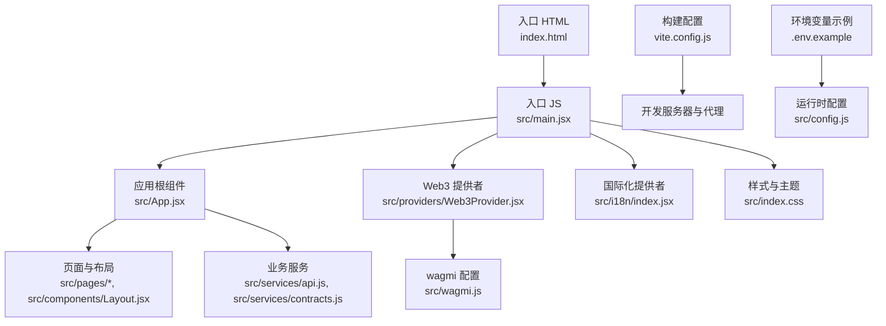
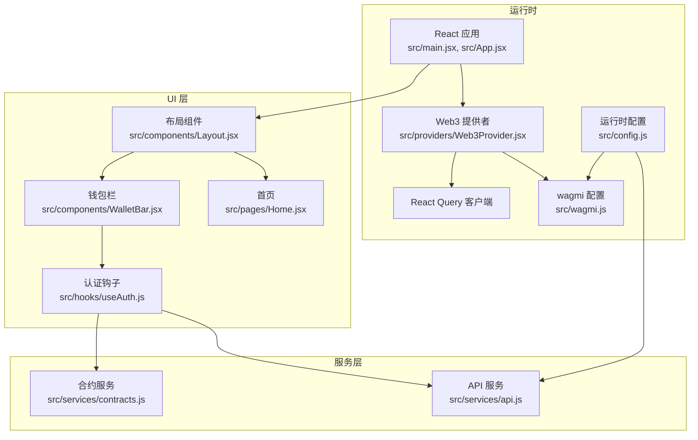
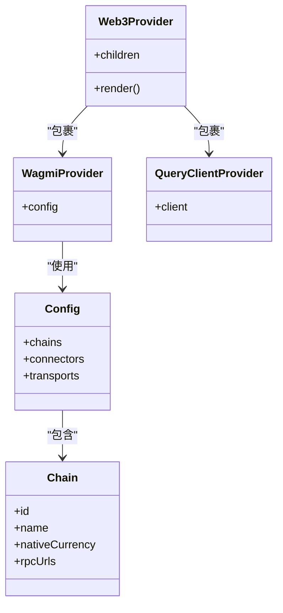
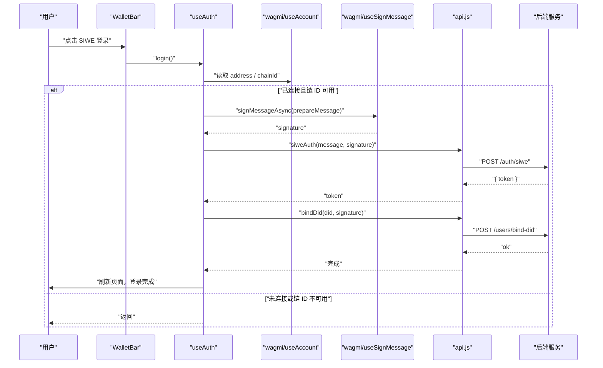
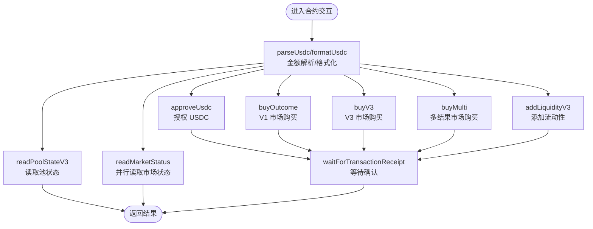
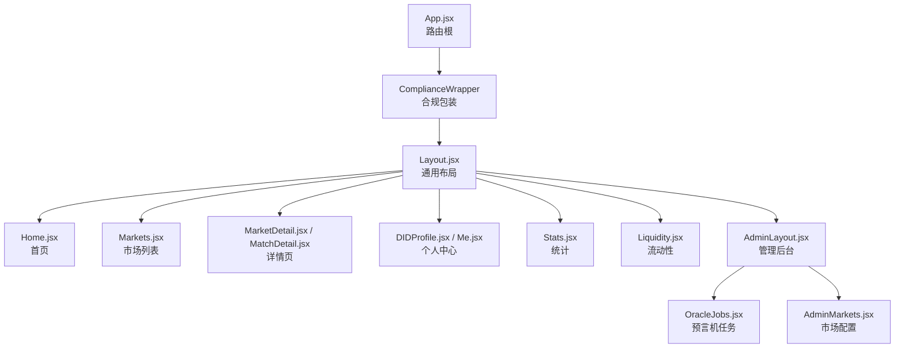
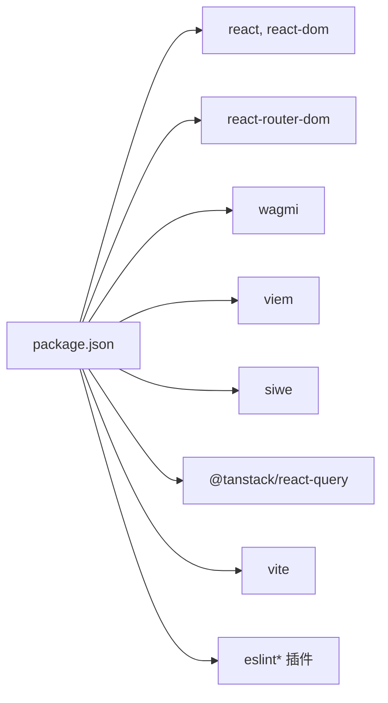

# 快速开始

<cite>
**本文引用的文件**
- [package.json](file://package.json)
- [vite.config.js](file://vite.config.js)
- [.env.example](file://.env.example)
- [index.html](file://index.html)
- [src/main.jsx](file://src/main.jsx)
- [src/App.jsx](file://src/App.jsx)
- [src/providers/Web3Provider.jsx](file://src/providers/Web3Provider.jsx)
- [src/wagmi.js](file://src/wagmi.js)
- [src/config.js](file://src/config.js)
- [src/services/api.js](file://src/services/api.js)
- [src/services/contracts.js](file://src/services/contracts.js)
- [src/hooks/useAuth.js](file://src/hooks/useAuth.js)
- [src/components/WalletBar.jsx](file://src/components/WalletBar.jsx)
- [src/components/Layout.jsx](file://src/components/Layout.jsx)
- [src/pages/Home.jsx](file://src/pages/Home.jsx)
- [.eslintrc.cjs](file://.eslintrc.cjs)
</cite>

## 目录
1. [简介](#简介)
2. [项目结构](#项目结构)
3. [核心组件](#核心组件)
4. [架构总览](#架构总览)
5. [详细组件分析](#详细组件分析)
6. [依赖分析](#依赖分析)
7. [性能考虑](#性能考虑)
8. [故障排查指南](#故障排查指南)
9. [结论](#结论)
10. [附录](#附录)

## 简介
本指南面向首次接触 PredictionDID 前端项目的开发者，目标是帮助你在最短时间内完成环境准备、依赖安装与本地开发环境搭建，并理解项目的核心技术栈与运行机制。项目采用 React 18.3.1、wagmi、viem、siwe 等技术栈，结合 Vite 构建工具与 React Router 实现前端路由，配合本地 Hardhat 链进行区块链交互演示。

## 项目结构
项目采用“按功能模块组织”的目录结构，主要模块包括：
- 根配置：package.json、vite.config.js、.env.example、.eslintrc.cjs
- 入口与页面：index.html、src/main.jsx、src/App.jsx、src/pages/*
- 组件与布局：src/components/*
- 钩子与提供者：src/hooks/*、src/providers/*
- 配置与服务：src/config.js、src/services/*
- ABI 合约：src/abis/*

图表来源
- [index.html](file://index.html#L1-L13)
- [src/main.jsx](file://src/main.jsx#L1-L33)
- [src/App.jsx](file://src/App.jsx#L1-L67)
- [src/providers/Web3Provider.jsx](file://src/providers/Web3Provider.jsx#L1-L25)
- [src/wagmi.js](file://src/wagmi.js#L1-L37)
- [src/services/api.js](file://src/services/api.js#L1-L187)
- [src/services/contracts.js](file://src/services/contracts.js#L1-L214)
- [vite.config.js](file://vite.config.js#L1-L14)
- [.env.example](file://.env.example#L1-L7)
- [src/config.js](file://src/config.js#L1-L23)

章节来源
- [package.json](file://package.json#L1-L30)
- [vite.config.js](file://vite.config.js#L1-L14)
- [.env.example](file://.env.example#L1-L7)
- [index.html](file://index.html#L1-L13)
- [src/main.jsx](file://src/main.jsx#L1-L33)
- [src/App.jsx](file://src/App.jsx#L1-L67)
- [src/providers/Web3Provider.jsx](file://src/providers/Web3Provider.jsx#L1-L25)
- [src/wagmi.js](file://src/wagmi.js#L1-L37)
- [src/config.js](file://src/config.js#L1-L23)
- [src/services/api.js](file://src/services/api.js#L1-L187)
- [src/services/contracts.js](file://src/services/contracts.js#L1-L214)
- [src/components/Layout.jsx](file://src/components/Layout.jsx#L1-L69)
- [src/pages/Home.jsx](file://src/pages/Home.jsx#L1-L83)
- [.eslintrc.cjs](file://.eslintrc.cjs#L1-L12)

## 核心组件
- React 18.3.1：现代前端框架，提供组件化与状态管理能力。
- wagmi：用于钱包连接、账户状态监听、合约读写与交易确认。
- viem：低层区块链交互库，提供金额解析/格式化、链上数据读取与交易发送。
- siwe：以太坊签名登录协议，用于无密码登录与 DID 绑定。
- React Router：客户端路由，支持嵌套路由与动态参数。
- TanStack React Query：异步数据缓存与状态管理，提升用户体验与性能。
- Vite：现代化构建工具与开发服务器，支持热更新与代理转发。

章节来源
- [package.json](file://package.json#L12-L28)
- [src/providers/Web3Provider.jsx](file://src/providers/Web3Provider.jsx#L1-L25)
- [src/wagmi.js](file://src/wagmi.js#L1-L37)
- [src/hooks/useAuth.js](file://src/hooks/useAuth.js#L1-L110)
- [src/services/contracts.js](file://src/services/contracts.js#L1-L214)
- [src/services/api.js](file://src/services/api.js#L1-L187)
- [vite.config.js](file://vite.config.js#L1-L14)

## 架构总览
前端整体架构围绕“Web3 提供者 + 路由 + 页面组件 + 服务层”展开。Web3 提供者负责区块链交互能力；路由系统承载页面导航；服务层封装 API 与合约交互；配置层统一读取环境变量并暴露运行时参数。

图表来源
- [src/main.jsx](file://src/main.jsx#L1-L33)
- [src/App.jsx](file://src/App.jsx#L1-L67)
- [src/providers/Web3Provider.jsx](file://src/providers/Web3Provider.jsx#L1-L25)
- [src/wagmi.js](file://src/wagmi.js#L1-L37)
- [src/config.js](file://src/config.js#L1-L23)
- [src/services/api.js](file://src/services/api.js#L1-L187)
- [src/services/contracts.js](file://src/services/contracts.js#L1-L214)
- [src/components/Layout.jsx](file://src/components/Layout.jsx#L1-L69)
- [src/pages/Home.jsx](file://src/pages/Home.jsx#L1-L83)
- [src/components/WalletBar.jsx](file://src/components/WalletBar.jsx#L1-L54)
- [src/hooks/useAuth.js](file://src/hooks/useAuth.js#L1-L110)

## 详细组件分析

### Web3 提供者与 wagmi 配置
- Web3Provider 将 wagmi 与 React Query 融合，向上提供区块链交互与数据缓存能力。
- wagmi 配置基于 viem 的 defineChain 定义本地 Hardhat 链，使用 injected 连接器与 http 传输。

图表来源
- [src/providers/Web3Provider.jsx](file://src/providers/Web3Provider.jsx#L1-L25)
- [src/wagmi.js](file://src/wagmi.js#L1-L37)

章节来源
- [src/providers/Web3Provider.jsx](file://src/providers/Web3Provider.jsx#L1-L25)
- [src/wagmi.js](file://src/wagmi.js#L1-L37)

### 认证流程（SIWE + DID 绑定）
- useAuth 钩子封装钱包连接、签名消息、SIWE 登录、令牌持久化与 DID 绑定。
- WalletBar 组件展示连接状态、登录按钮与断开操作。
- 服务层 api.js 提供 siweAuth 与 bindDid 接口。

图表来源
- [src/components/WalletBar.jsx](file://src/components/WalletBar.jsx#L1-L54)
- [src/hooks/useAuth.js](file://src/hooks/useAuth.js#L1-L110)
- [src/services/api.js](file://src/services/api.js#L93-L107)

章节来源
- [src/components/WalletBar.jsx](file://src/components/WalletBar.jsx#L1-L54)
- [src/hooks/useAuth.js](file://src/hooks/useAuth.js#L1-L110)
- [src/services/api.js](file://src/services/api.js#L93-L107)

### 合约交互与金额处理
- contracts.js 封装 viem 金额解析/格式化与多种市场合约的读写操作。
- 通过 wagmi 的 readContract/writeContract/waitForTransactionReceipt 实现链上交互。
- 并行读取市场状态以优化性能。

图表来源
- [src/services/contracts.js](file://src/services/contracts.js#L1-L214)

章节来源
- [src/services/contracts.js](file://src/services/contracts.js#L1-L214)

### 路由与页面骨架
- App.jsx 定义主路由与嵌套路由，包含合规包装、通用布局与各页面。
- Layout.jsx 提供导航栏、语言切换与钱包栏。
- Home.jsx 展示 API 健康状态与赛事列表。

图表来源
- [src/App.jsx](file://src/App.jsx#L1-L67)
- [src/components/Layout.jsx](file://src/components/Layout.jsx#L1-L69)
- [src/pages/Home.jsx](file://src/pages/Home.jsx#L1-L83)

章节来源
- [src/App.jsx](file://src/App.jsx#L1-L67)
- [src/components/Layout.jsx](file://src/components/Layout.jsx#L1-L69)
- [src/pages/Home.jsx](file://src/pages/Home.jsx#L1-L83)

## 依赖分析
- 运行时依赖：React 生态、wagmi、viem、siwe、React Router、TanStack React Query。
- 开发依赖：Vite、@vitejs/plugin-react、ESLint 及相关插件。
- 项目脚本：dev/build/preview/lint。

图表来源
- [package.json](file://package.json#L12-L28)

章节来源
- [package.json](file://package.json#L1-L30)
- [.eslintrc.cjs](file://.eslintrc.cjs#L1-L12)

## 性能考虑
- 使用 React Query 缓存异步数据，减少重复请求。
- 并行读取市场状态以降低延迟。
- 金额解析/格式化统一使用 viem，保证精度与一致性。
- Vite 热更新与按需编译提升开发体验。

## 故障排查指南
- 环境变量未配置：检查 .env.example 并创建 .env，确保 VITE_API_URL、VITE_CHAIN_ID、VITE_SIWE_* 等变量正确。
- 后端服务未运行：首页会显示 API 状态，若离线请先启动后端服务。
- 钱包连接失败：确认已安装浏览器钱包扩展，且网络 ID 与 VITE_CHAIN_ID 一致。
- 合约交互报错：检查合约地址与链 ID，确保已部署对应合约并在本地链上同步。

章节来源
- [.env.example](file://.env.example#L1-L7)
- [src/config.js](file://src/config.js#L1-L23)
- [src/pages/Home.jsx](file://src/pages/Home.jsx#L1-L83)
- [src/services/api.js](file://src/services/api.js#L1-L187)
- [src/services/contracts.js](file://src/services/contracts.js#L1-L214)

## 结论
通过本指南，你已经了解了 PredictionDID 前端项目的技术栈、目录结构与核心组件，并完成了本地开发环境的准备与启动流程。建议在本地先运行后端服务与 Hardhat 链，再启动前端开发服务器，即可进行后续功能开发与调试。

## 附录

### 环境配置与依赖安装
- 系统要求：Node.js（推荐 LTS）、Git。
- 步骤概览：
  1) 克隆仓库并进入目录。
  2) 安装依赖：使用包管理器安装运行时与开发依赖。
  3) 创建环境文件：复制 .env.example 并填写必要变量。
  4) 启动开发服务器：运行 dev 脚本。
  5) 打开浏览器访问默认端口，完成初始化。

章节来源
- [package.json](file://package.json#L6-L11)
- [.env.example](file://.env.example#L1-L7)
- [vite.config.js](file://vite.config.js#L6-L12)

### Vite 构建与代理设置
- 开发服务器端口：默认 5173。
- 代理规则：将 /health 与 /ready 转发至后端服务地址。
- 构建产物：dist 目录，包含静态资源与入口 HTML。

章节来源
- [vite.config.js](file://vite.config.js#L1-L14)
- [index.html](file://index.html#L1-L13)

### 项目启动与运行流程
- 启动命令：dev（开发）、build（生产构建）、preview（预览构建）、lint（代码检查）。
- 入口文件：index.html 引入 /src/main.jsx。
- 运行时配置：src/config.js 从 import.meta.env 读取 VITE_* 变量。

章节来源
- [package.json](file://package.json#L6-L11)
- [index.html](file://index.html#L10)
- [src/config.js](file://src/config.js#L1-L23)