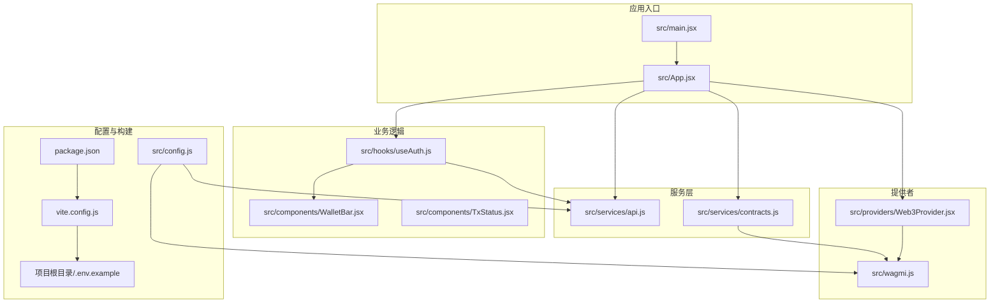
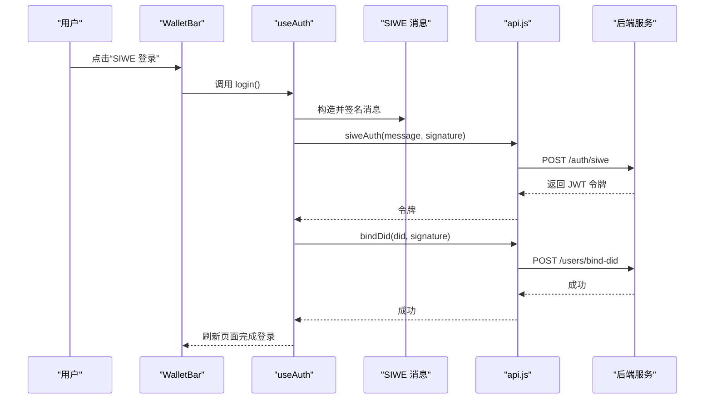
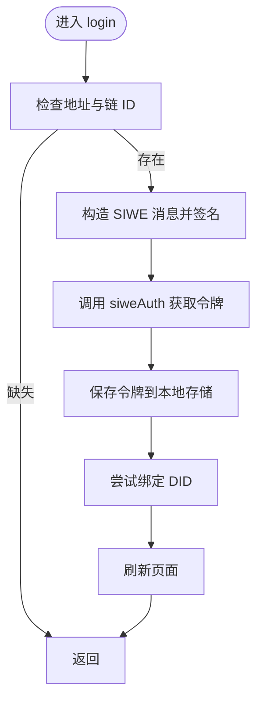
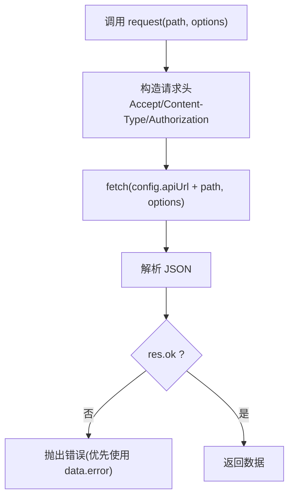
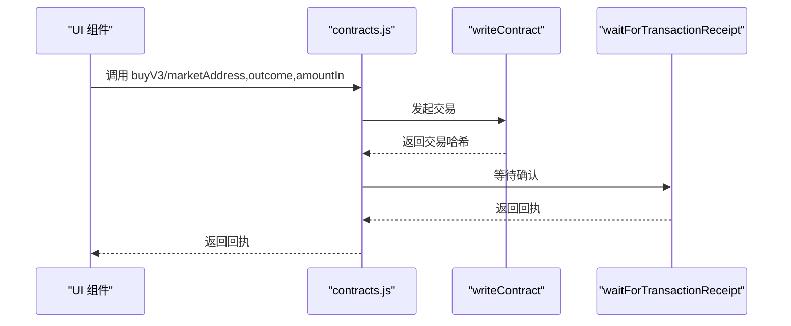
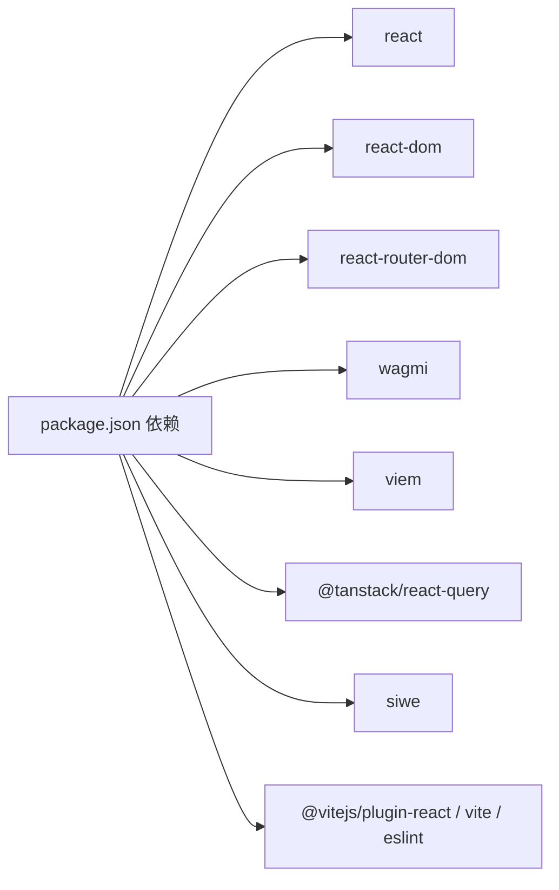

# 故障排除

<cite>
**本文引用的文件**
- [package.json](file://package.json)
- [vite.config.js](file://vite.config.js)
- [.env.example](file://.env.example)
- [src/config.js](file://src/config.js)
- [src/main.jsx](file://src/main.jsx)
- [src/App.jsx](file://src/App.jsx)
- [src/providers/Web3Provider.jsx](file://src/providers/Web3Provider.jsx)
- [src/wagmi.js](file://src/wagmi.js)
- [src/hooks/useAuth.js](file://src/hooks/useAuth.js)
- [src/services/api.js](file://src/services/api.js)
- [src/services/contracts.js](file://src/services/contracts.js)
- [src/components/WalletBar.jsx](file://src/components/WalletBar.jsx)
- [src/components/TxStatus.jsx](file://src/components/TxStatus.jsx)
</cite>

## 目录
1. [简介](#简介)
2. [项目结构](#项目结构)
3. [核心组件](#核心组件)
4. [架构总览](#架构总览)
5. [详细组件分析](#详细组件分析)
6. [依赖关系分析](#依赖关系分析)
7. [性能考虑](#性能考虑)
8. [故障排除指南](#故障排除指南)
9. [结论](#结论)
10. [附录](#附录)

## 简介
本指南面向前端开发者与运维人员，聚焦于 PredictionDIDSimple 前端项目的常见开发与运行时问题，覆盖环境配置、依赖冲突、网络连接失败、认证错误、交易执行异常、以及生产环境监控与性能排查。文档提供系统化的诊断方法、调试技巧与解决方案，并给出可视化流程图与最佳实践建议。

## 项目结构
前端采用 React + Vite + wagmi/viem + React Query 架构，主要模块职责如下：
- 配置层：读取环境变量并导出全局配置
- 提供者层：Web3Provider 组合 wagmi 与 React Query
- 业务层：页面组件与自定义 Hook（认证、合约交互）
- 服务层：API 封装与合约交互封装
- 开发服务器：Vite 反向代理健康检查端点

图表来源
- [src/main.jsx](file://src/main.jsx#L1-L33)
- [src/App.jsx](file://src/App.jsx#L1-L67)
- [src/providers/Web3Provider.jsx](file://src/providers/Web3Provider.jsx#L1-L25)
- [src/wagmi.js](file://src/wagmi.js#L1-L37)
- [src/hooks/useAuth.js](file://src/hooks/useAuth.js#L1-L110)
- [src/services/api.js](file://src/services/api.js#L1-L187)
- [src/services/contracts.js](file://src/services/contracts.js#L1-L214)
- [src/config.js](file://src/config.js#L1-L23)
- [vite.config.js](file://vite.config.js#L1-L14)
- [.env.example](file://.env.example#L1-L7)
- [package.json](file://package.json#L1-L30)

章节来源
- [src/main.jsx](file://src/main.jsx#L1-L33)
- [src/App.jsx](file://src/App.jsx#L1-L67)
- [src/providers/Web3Provider.jsx](file://src/providers/Web3Provider.jsx#L1-L25)
- [src/wagmi.js](file://src/wagmi.js#L1-L37)
- [src/config.js](file://src/config.js#L1-L23)
- [vite.config.js](file://vite.config.js#L1-L14)
- [.env.example](file://.env.example#L1-L7)
- [package.json](file://package.json#L1-L30)

## 核心组件
- 配置与环境变量：集中读取 API 地址、链 ID、合约地址、SIWE 域名与 URI，并暴露全局配置对象
- Web3 提供者：组合 wagmi 与 React Query，为全应用提供区块链连接与数据缓存能力
- 认证 Hook：封装 SIWE 登录、登出、令牌管理与 DID 绑定流程
- API 服务：统一请求封装、鉴权头注入、错误处理与健康/就绪检查
- 合约交互：基于 viem 与 wagmi 的合约读写、交易等待与金额解析/格式化
- 开发服务器：Vite 反向代理 /health 与 /ready 到本地后端

章节来源
- [src/config.js](file://src/config.js#L1-L23)
- [src/providers/Web3Provider.jsx](file://src/providers/Web3Provider.jsx#L1-L25)
- [src/hooks/useAuth.js](file://src/hooks/useAuth.js#L1-L110)
- [src/services/api.js](file://src/services/api.js#L1-L187)
- [src/services/contracts.js](file://src/services/contracts.js#L1-L214)
- [vite.config.js](file://vite.config.js#L1-L14)

## 架构总览
前端通过 Web3Provider 提供区块链能力，通过 API 服务与后端交互，通过认证 Hook 管理用户会话与 DID 绑定。开发服务器通过反向代理转发健康检查请求至后端。

图表来源
- [src/components/WalletBar.jsx](file://src/components/WalletBar.jsx#L1-L54)
- [src/hooks/useAuth.js](file://src/hooks/useAuth.js#L1-L110)
- [src/services/api.js](file://src/services/api.js#L93-L107)

章节来源
- [src/components/WalletBar.jsx](file://src/components/WalletBar.jsx#L1-L54)
- [src/hooks/useAuth.js](file://src/hooks/useAuth.js#L1-L110)
- [src/services/api.js](file://src/services/api.js#L93-L107)

## 详细组件分析

### 认证与会话管理（useAuth）
- 关键行为：读取钱包地址与链 ID，构造 SIWE 消息，调用后端签发 JWT；随后尝试绑定 DID；最后刷新页面应用状态
- 错误处理：捕获异常并设置错误信息；登录/登出流程中包含加载状态
- 依赖：wagmi 账户与签名钩子、config 配置、api 服务

图表来源
- [src/hooks/useAuth.js](file://src/hooks/useAuth.js#L28-L80)
- [src/services/api.js](file://src/services/api.js#L93-L107)
- [src/config.js](file://src/config.js#L1-L23)

章节来源
- [src/hooks/useAuth.js](file://src/hooks/useAuth.js#L1-L110)
- [src/services/api.js](file://src/services/api.js#L93-L107)
- [src/config.js](file://src/config.js#L1-L23)

### API 请求与错误处理（api.js）
- 统一请求封装：自动注入 Accept/Content-Type/Authorization 头
- 健康检查与就绪检查：分别调用 /health 与 /ready
- 错误处理：非 2xx 响应抛出错误，错误信息来自响应体或状态码
- 管理员接口：通过 sessionStorage 中的 admin_key 注入 X-Admin-Key

图表来源
- [src/services/api.js](file://src/services/api.js#L22-L55)

章节来源
- [src/services/api.js](file://src/services/api.js#L1-L187)

### 合约交互与交易状态（contracts.js）
- 金额解析/格式化：基于 viem 的 parseUnits/formatUnits
- 读写合约：使用 wagmi 的 readContract/writeContract
- 交易等待：waitForTransactionReceipt 等待确认
- 并行读取：市场状态读取使用 Promise.all 提升性能

图表来源
- [src/services/contracts.js](file://src/services/contracts.js#L107-L123)

章节来源
- [src/services/contracts.js](file://src/services/contracts.js#L1-L214)

### 开发服务器与代理（vite.config.js）
- Vite 服务器默认端口 5173
- 反向代理：/health 与 /ready 转发到 http://localhost:8080
- 便于在本地联调后端健康检查

章节来源
- [vite.config.js](file://vite.config.js#L1-L14)

## 依赖关系分析
- 运行时依赖：React、react-router-dom、wagmi、viem、@tanstack/react-query、siwe
- 开发依赖：@vitejs/plugin-react、vite、eslint 系列
- 依赖版本与构建工具影响热更新、打包体积与兼容性

图表来源
- [package.json](file://package.json#L12-L28)

章节来源
- [package.json](file://package.json#L1-L30)

## 性能考虑
- 并行读取：合约状态读取使用 Promise.all，减少往返时间
- 数据缓存：React Query 客户端缓存异步数据，避免重复请求
- 金额处理：使用 viem 的 parseUnits/formatUnits，避免精度丢失
- 构建优化：Vite 默认优化与按需加载策略

章节来源
- [src/services/contracts.js](file://src/services/contracts.js#L183-L213)
- [src/providers/Web3Provider.jsx](file://src/providers/Web3Provider.jsx#L1-L25)

## 故障排除指南

### 一、环境配置问题
- 症状
  - 页面空白或无法连接后端
  - 链 ID 不匹配导致钱包无法识别
  - SIWE 域名/URI 不正确导致签名失败
- 诊断步骤
  - 检查 .env.example 中的 VITE_API_URL、VITE_CHAIN_ID、VITE_SIWE_DOMAIN、VITE_SIWE_URI 是否与实际后端一致
  - 在浏览器控制台查看 import.meta.env 下的变量是否被替换
  - 确认 Vite 代理是否正确转发 /health 与 /ready
- 解决方案
  - 在本地复制 .env.example 为 .env 并填入正确的后端地址与链 ID
  - 如使用自定义链，确保 wagmi 配置中的链 ID 与 VITE_CHAIN_ID 一致
  - 若后端部署在不同主机，请同步修改 SIWE 域名与 URI

章节来源
- [.env.example](file://.env.example#L1-L7)
- [src/config.js](file://src/config.js#L1-L23)
- [src/wagmi.js](file://src/wagmi.js#L10-L23)
- [vite.config.js](file://vite.config.js#L6-L12)

### 二、依赖冲突与安装问题
- 症状
  - npm install 报错或构建失败
  - 运行时报“找不到模块”或“版本不兼容”
- 诊断步骤
  - 查看 package.json 中依赖版本范围
  - 使用 package-lock.json 校验锁定版本
  - 确认 Node.js 版本满足依赖要求
- 解决方案
  - 清理 node_modules 与缓存后重新安装
  - 锁定兼容版本或升级到官方推荐组合
  - 使用 yarn/pnpm 替代 npm 以获得更稳定的解析

章节来源
- [package.json](file://package.json#L12-L28)

### 三、网络连接失败
- 症状
  - /health 或 /ready 一直 pending
  - API 请求返回 4xx/5xx
- 诊断步骤
  - 检查 Vite 代理配置是否指向正确后端端口
  - 在浏览器 Network 面板观察请求与响应
  - 在后端侧确认服务已启动且监听对应端口
- 解决方案
  - 调整 vite.config.js 中的代理目标
  - 确保防火墙与 CORS 允许跨域
  - 对比 API 基础路径与 config.apiUrl

章节来源
- [vite.config.js](file://vite.config.js#L6-L12)
- [src/services/api.js](file://src/services/api.js#L57-L67)
- [src/config.js](file://src/config.js#L8-L11)

### 四、认证错误（SIWE 登录失败）
- 症状
  - 点击“SIWE 登录”无反应或报错
  - 控制台出现签名失败或令牌无效
- 诊断步骤
  - 检查钱包是否已连接且链 ID 正确
  - 确认 SIWE 域名与 URI 与后端配置一致
  - 观察 useAuth 中的错误状态与消息
- 解决方案
  - 切换到与 VITE_CHAIN_ID 对应的链
  - 更新 SIWE 域名与 URI 为实际部署地址
  - 确保后端已实现 /auth/siwe 与 /users/bind-did

章节来源
- [src/hooks/useAuth.js](file://src/hooks/useAuth.js#L28-L80)
- [src/services/api.js](file://src/services/api.js#L93-L107)
- [src/config.js](file://src/config.js#L18-L21)

### 五、交易执行异常
- 症状
  - 交易提交后无回执或长时间 pending
  - 金额解析/格式化导致交易失败
- 诊断步骤
  - 检查交易哈希与区块浏览器确认
  - 核对输入金额的小数位与 parseUnits 参数
  - 确认授权额度足够后再发起购买
- 解决方案
  - 使用 parseUsdc/formatUsdc 保证精度
  - 先调用 approve 再执行 buy/buyV3
  - 等待 waitForTransactionReceipt 返回确认

章节来源
- [src/services/contracts.js](file://src/services/contracts.js#L19-L35)
- [src/services/contracts.js](file://src/services/contracts.js#L52-L69)
- [src/services/contracts.js](file://src/services/contracts.js#L107-L123)

### 六、错误日志分析与调试技巧
- 日志与错误展示
  - useAuth 中的错误状态会在 WalletBar 中显示
  - TxStatus 组件根据状态显示“提交中/成功/失败/错误信息”
- 调试技巧
  - 打开浏览器开发者工具，查看 Console 与 Network
  - 在 api.js 的 request 中断点，观察响应体与状态码
  - 在 contracts.js 中断点，确认交易哈希与回执
- 建议
  - 在生产环境记录结构化日志（含链 ID、交易哈希、错误码）

章节来源
- [src/components/WalletBar.jsx](file://src/components/WalletBar.jsx#L49-L50)
- [src/components/TxStatus.jsx](file://src/components/TxStatus.jsx#L1-L26)
- [src/services/api.js](file://src/services/api.js#L29-L55)
- [src/services/contracts.js](file://src/services/contracts.js#L113-L123)

### 七、生产环境监控最佳实践
- 健康检查
  - 定期调用 /health 与 /ready，失败时告警
- 性能指标
  - 记录 API 响应时间、错误率与重试次数
  - 监控交易确认时间与失败率
- 用户体验
  - 在 WalletBar 与 TxStatus 中提供清晰的状态反馈
  - 对不可恢复错误引导用户重试或切换网络

章节来源
- [src/services/api.js](file://src/services/api.js#L57-L67)
- [src/components/WalletBar.jsx](file://src/components/WalletBar.jsx#L20-L51)
- [src/components/TxStatus.jsx](file://src/components/TxStatus.jsx#L6-L24)

## 结论
本指南围绕前端配置、认证、网络与合约交互四个维度提供了系统化的故障排除方法。通过理解组件职责与调用链路，结合日志与代理配置，可快速定位并解决开发与生产环境中的常见问题。建议在团队内形成标准化的环境变量规范与监控流程，持续提升稳定性与可观测性。

## 附录

### A. 常见问题速查表
- 环境变量未生效
  - 检查 .env 文件命名与位置
  - 确认 Vite 重启后变量被替换
- 钱包连接但链 ID 不匹配
  - 对齐 wagmi 配置与 VITE_CHAIN_ID
- SIWE 登录失败
  - 核对域名/URI 与后端一致
  - 确认后端已实现认证与绑定接口
- 交易长时间 pending
  - 检查 gas/授权/金额精度
  - 等待回执或调整网络

### B. 代码级参考路径
- 配置与环境变量
  - [src/config.js](file://src/config.js#L1-L23)
  - [.env.example](file://.env.example#L1-L7)
- 认证流程
  - [src/hooks/useAuth.js](file://src/hooks/useAuth.js#L28-L80)
  - [src/services/api.js](file://src/services/api.js#L93-L107)
- API 请求封装
  - [src/services/api.js](file://src/services/api.js#L29-L55)
- 合约交互
  - [src/services/contracts.js](file://src/services/contracts.js#L19-L35)
  - [src/services/contracts.js](file://src/services/contracts.js#L52-L69)
  - [src/services/contracts.js](file://src/services/contracts.js#L107-L123)
- 开发服务器与代理
  - [vite.config.js](file://vite.config.js#L6-L12)
- 提供者与路由
  - [src/providers/Web3Provider.jsx](file://src/providers/Web3Provider.jsx#L1-L25)
  - [src/App.jsx](file://src/App.jsx#L30-L66)