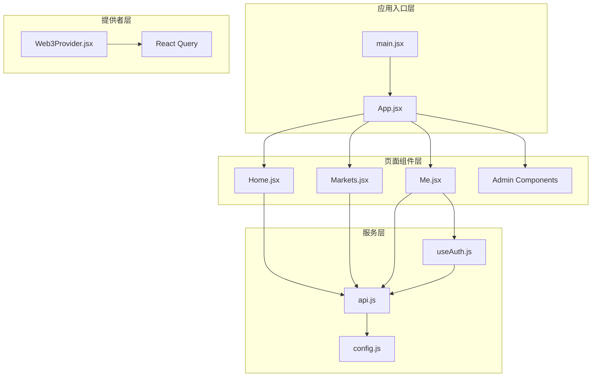
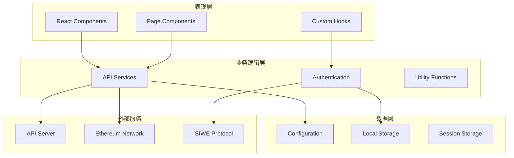
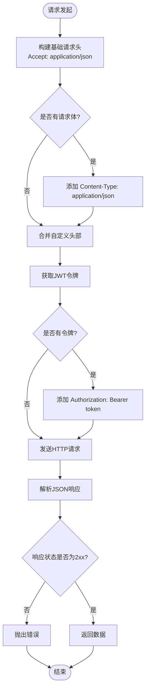
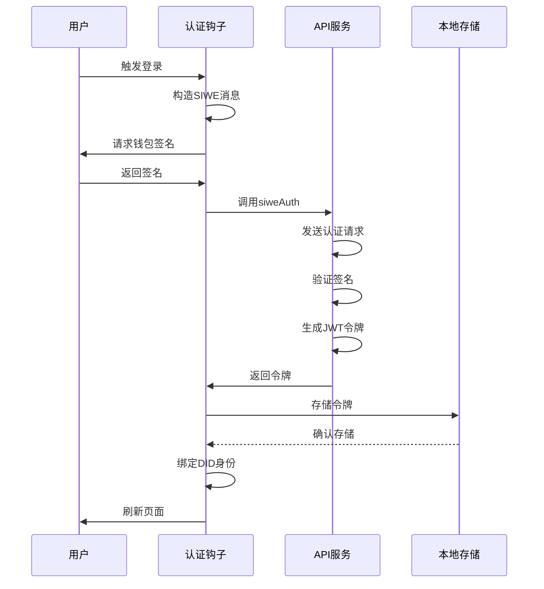

# API服务封装

<cite>
**本文档引用的文件**
- [src/services/api.js](file://src/services/api.js)
- [src/config.js](file://src/config.js)
- [src/hooks/useAuth.js](file://src/hooks/useAuth.js)
- [src/providers/Web3Provider.jsx](file://src/providers/Web3Provider.jsx)
- [src/main.jsx](file://src/main.jsx)
- [src/App.jsx](file://src/App.jsx)
- [src/pages/Home.jsx](file://src/pages/Home.jsx)
- [src/pages/Markets.jsx](file://src/pages/Markets.jsx)
- [src/pages/Me.jsx](file://src/pages/Me.jsx)
- [src/pages/admin/OracleJobs.jsx](file://src/pages/admin/OracleJobs.jsx)
- [src/pages/admin/AdminMarkets.jsx](file://src/pages/admin/AdminMarkets.jsx)
- [src/components/ComplianceWrapper.jsx](file://src/components/ComplianceWrapper.jsx)
- [.env.example](file://.env.example)
- [package.json](file://package.json)
</cite>

## 目录
1. [简介](#简介)
2. [项目结构](#项目结构)
3. [核心组件](#核心组件)
4. [架构概览](#架构概览)
5. [详细组件分析](#详细组件分析)
6. [依赖关系分析](#依赖关系分析)
7. [性能考虑](#性能考虑)
8. [故障排除指南](#故障排除指南)
9. [结论](#结论)

## 简介

Prediction DID 前端项目采用现代化的 React 技术栈构建，专注于预测市场的去中心化身份认证和交易。该项目的核心是API服务封装模块，它提供了统一的HTTP请求处理机制，包括请求头自动配置、JWT令牌管理、错误响应处理等功能。

该系统集成了以太坊签名登录（SIWE）、去中心化身份（DID）绑定、市场管理和用户认证等核心功能，为用户提供完整的预测市场参与体验。

## 项目结构

项目采用模块化的文件组织方式，主要分为以下几个层次：



**图表来源**
- [src/main.jsx](file://src/main.jsx#L1-L33)
- [src/App.jsx](file://src/App.jsx#L1-L67)
- [src/services/api.js](file://src/services/api.js#L1-L187)

**章节来源**
- [src/main.jsx](file://src/main.jsx#L1-L33)
- [src/App.jsx](file://src/App.jsx#L1-L67)

## 核心组件

### API服务封装模块

API服务封装模块是整个系统的核心，提供了统一的HTTP请求处理机制：

#### 主要功能特性：
- **自动请求头配置**：自动设置Accept和Content-Type头部
- **JWT令牌管理**：本地存储和自动附加认证令牌
- **错误响应处理**：统一的错误捕获和处理机制
- **参数处理**：URL查询参数的自动构建和处理
- **响应解析**：JSON响应的自动解析和验证

#### 核心导出函数：
- `getToken()` / `setToken()` / `clearToken()`: JWT令牌管理
- `request()`: 通用HTTP请求封装
- `getHealth()`: 健康检查接口
- `listMatches()` / `getMatch()`: 赛事管理接口
- `listMarkets()` / `getMarket()`: 市场查询接口
- `siweAuth()`: SIWE认证接口
- `bindDid()`: DID绑定接口
- `myPositions()`: 用户持仓查询
- `admin*`系列: 管理员功能接口

**章节来源**
- [src/services/api.js](file://src/services/api.js#L1-L187)

### 配置管理系统

配置系统负责管理应用的运行时配置，包括API基础地址、区块链网络ID等关键参数：

#### 配置项说明：
- `apiUrl`: API服务器基础地址，默认本地8080端口
- `chainId`: 区块链网络ID，默认31337（Hardhat本地网络）
- `mockUsdc`: MockUSDC代币合约地址
- `marketFactory`: 市场工厂合约地址
- `siweDomain`: SIWE认证域名
- `siweUri`: SIWE认证URI地址

**章节来源**
- [src/config.js](file://src/config.js#L1-L23)
- [.env.example](file://.env.example#L1-L7)

### 认证钩子系统

认证钩子系统封装了完整的用户认证流程，基于SIWE协议实现以太坊钱包登录：

#### 主要功能：
- **钱包连接状态管理**: 监控钱包连接和链ID变化
- **SIWE消息构造**: 自动生成符合规范的签名消息
- **签名请求**: 通过钱包提供商请求用户签名
- **认证令牌管理**: 自动处理JWT令牌的获取和存储
- **DID绑定**: 将去中心化身份绑定到用户账户

**章节来源**
- [src/hooks/useAuth.js](file://src/hooks/useAuth.js#L1-L110)

## 架构概览

系统采用分层架构设计，各层职责明确，耦合度低：



**图表来源**
- [src/services/api.js](file://src/services/api.js#L1-L187)
- [src/hooks/useAuth.js](file://src/hooks/useAuth.js#L1-L110)
- [src/config.js](file://src/config.js#L1-L23)

## 详细组件分析

### API请求处理机制

API请求处理机制是整个系统的核心，提供了统一的HTTP通信抽象：

#### 请求头自动配置流程：



**图表来源**
- [src/services/api.js](file://src/services/api.js#L29-L55)

#### 错误处理策略：

系统实现了多层次的错误处理机制：

1. **网络层错误**: 捕获fetch异常和JSON解析错误
2. **HTTP状态错误**: 对非2xx状态码抛出标准化错误
3. **业务逻辑错误**: 从响应体提取错误信息
4. **用户友好错误**: 提供清晰的错误消息

**章节来源**
- [src/services/api.js](file://src/services/api.js#L29-L55)

### JWT令牌管理系统

JWT令牌管理系统提供了安全的用户认证状态管理：

#### 令牌生命周期管理：



**图表来源**
- [src/hooks/useAuth.js](file://src/hooks/useAuth.js#L29-L80)
- [src/services/api.js](file://src/services/api.js#L94-L99)

#### 令牌存储策略：
- 使用localStorage存储JWT令牌
- 支持令牌的获取、设置和清除
- 自动在请求中附加Authorization头部

**章节来源**
- [src/hooks/useAuth.js](file://src/hooks/useAuth.js#L1-L110)
- [src/services/api.js](file://src/services/api.js#L8-L20)

### 页面组件集成模式

各个页面组件通过统一的API服务接口进行数据交互：

#### 首页组件集成：

首页组件展示了API服务的典型使用模式：

1. **健康检查**: 首先验证后端服务可用性
2. **数据加载**: 获取赛事列表数据
3. **错误处理**: 统一处理API调用异常
4. **状态管理**: 管理API连接状态

#### 市场列表组件集成：

市场列表组件演示了参数化查询的使用：

1. **查询参数构建**: 使用URLSearchParams构建查询字符串
2. **批量数据获取**: 支持分页和过滤参数
3. **数据展示**: 将API响应数据映射到UI组件

#### 个人中心组件集成：

个人中心组件展示了认证状态下的数据访问：

1. **认证状态检查**: 确保用户已登录
2. **用户专属数据**: 获取用户的持仓信息
3. **交易状态管理**: 集成区块链交易状态

**章节来源**
- [src/pages/Home.jsx](file://src/pages/Home.jsx#L1-L54)
- [src/pages/Markets.jsx](file://src/pages/Markets.jsx#L1-L56)
- [src/pages/Me.jsx](file://src/pages/Me.jsx#L1-L105)

### 管理员功能模块

管理员功能模块提供了后台管理能力，通过特殊的认证头进行访问控制：

#### 管理员认证机制：

管理员功能使用sessionStorage中的API Key进行认证：

1. **API Key存储**: 在sessionStorage中存储管理员密钥
2. **请求头注入**: 自动为管理员请求添加X-Admin-Key头部
3. **权限控制**: 仅管理员可以访问特定的管理接口

#### 管理员功能接口：

- `adminListOracleJobs()`: 获取预言机任务列表
- `adminRetryOracleJob()`: 重试失败的任务
- `adminRegisterMarket()`: 注册/更新市场元数据
- `adminVoidMarket()`: 作废市场

**章节来源**
- [src/services/api.js](file://src/services/api.js#L131-L166)
- [src/pages/admin/OracleJobs.jsx](file://src/pages/admin/OracleJobs.jsx#L1-L45)
- [src/pages/admin/AdminMarkets.jsx](file://src/pages/admin/AdminMarkets.jsx#L1-L89)

## 依赖关系分析

系统依赖关系清晰，主要依赖包括：

```mermaid
graph LR
subgraph "核心依赖"
React[react@^18.3.1]
Router[react-router-dom@^6.28.0]
Wagmi[wagmi@^2.14.1]
Query[@tanstack/react-query@^5.62.2]
end
subgraph "认证依赖"
SIWE[siwe@^2.3.2]
Viem[viem@^2.21.54]
end
subgraph "开发依赖"
Vite[vite@^5.4.11]
ESLint[eslint@^8.57.1]
ReactPlugin[eslint-plugin-react@^7.37.2]
end
API[api.js] --> Config[config.js]
API --> SIWE
Auth[useAuth.js] --> API
Auth --> Wagmi
Web3[Web3Provider.jsx] --> Wagmi
Web3 --> Query
```

**图表来源**
- [package.json](file://package.json#L12-L29)

### 外部依赖集成

#### SIWE协议集成：
- 实现以太坊签名登录协议
- 支持跨链ID验证
- 提供防重放攻击机制

#### wagmi集成：
- 钱包连接和账户管理
- 区块链交互能力
- 签名请求处理

#### React Query集成：
- 异步数据缓存管理
- 自动重试机制
- 状态同步优化

**章节来源**
- [package.json](file://package.json#L12-L29)
- [src/providers/Web3Provider.jsx](file://src/providers/Web3Provider.jsx#L1-L25)

## 性能考虑

### 缓存策略

系统采用React Query实现智能缓存：

1. **自动缓存**: API响应自动缓存，避免重复请求
2. **缓存失效**: 基于时间戳和用户操作的缓存失效机制
3. **并发优化**: 避免重复的相同请求
4. **内存管理**: 自动清理不再使用的缓存数据

### 网络优化

1. **请求合并**: 相似的请求会被合并处理
2. **超时控制**: 合理的请求超时设置
3. **重试机制**: 智能的自动重试策略
4. **连接池**: 复用HTTP连接减少开销

### 前端性能优化

1. **懒加载**: 路由级别的代码分割
2. **虚拟滚动**: 大数据集的高效渲染
3. **状态优化**: React.memo和useMemo的合理使用
4. **事件节流**: 高频事件的防抖处理

## 故障排除指南

### 常见问题及解决方案

#### API连接问题

**症状**: 页面显示API离线状态
**原因**: 
- API服务器未启动
- 网络连接问题
- CORS配置错误

**解决方案**:
1. 检查API服务器状态
2. 验证网络连接
3. 确认CORS配置正确
4. 检查环境变量配置

#### 认证失败问题

**症状**: 登录后仍显示未认证状态
**原因**:
- JWT令牌存储问题
- 会话过期
- 钱包连接异常

**解决方案**:
1. 检查localStorage中是否有token
2. 重新登录尝试
3. 清除浏览器缓存
4. 验证钱包连接状态

#### 数据加载问题

**症状**: 页面数据无法加载或显示为空
**原因**:
- API响应格式变化
- 网络请求超时
- 权限不足

**解决方案**:
1. 检查API响应格式
2. 增加请求超时时间
3. 验证用户权限
4. 查看浏览器开发者工具

### 调试技巧

#### 开发者工具使用

1. **Network面板**: 监控API请求和响应
2. **Console面板**: 查看错误日志和警告
3. **Application面板**: 检查localStorage和sessionStorage
4. **Sources面板**: 设置断点调试JavaScript代码

#### 日志记录

系统提供了完善的错误处理机制，建议在开发过程中：

1. 记录详细的错误信息
2. 区分不同类型的错误
3. 提供用户友好的错误提示
4. 收集错误发生的时间和上下文

**章节来源**
- [src/services/api.js](file://src/services/api.js#L47-L52)
- [src/hooks/useAuth.js](file://src/hooks/useAuth.js#L73-L79)

## 结论

Prediction DID前端项目的API服务封装展现了现代前端开发的最佳实践。通过统一的请求处理机制、完善的错误处理策略和灵活的配置管理，系统为用户提供了稳定可靠的预测市场参与体验。

### 主要优势

1. **统一抽象**: API服务封装提供了清晰的接口抽象
2. **安全性**: JWT令牌管理和SIWE协议集成确保了安全认证
3. **可维护性**: 模块化的代码结构便于维护和扩展
4. **用户体验**: 完善的错误处理和状态管理提升了用户体验

### 技术亮点

1. **现代化技术栈**: React 18、Vite、TypeScript等前沿技术
2. **去中心化集成**: 完整的以太坊生态集成
3. **响应式设计**: 适配多种设备和屏幕尺寸
4. **国际化支持**: 多语言界面支持

### 未来发展方向

1. **性能优化**: 进一步优化加载速度和响应性能
2. **功能扩展**: 添加更多预测市场功能
3. **用户体验**: 改进用户界面和交互体验
4. **安全性增强**: 加强安全防护措施

该系统为预测市场的前端开发提供了优秀的参考模板，其设计理念和实现方式值得在类似项目中借鉴和学习。