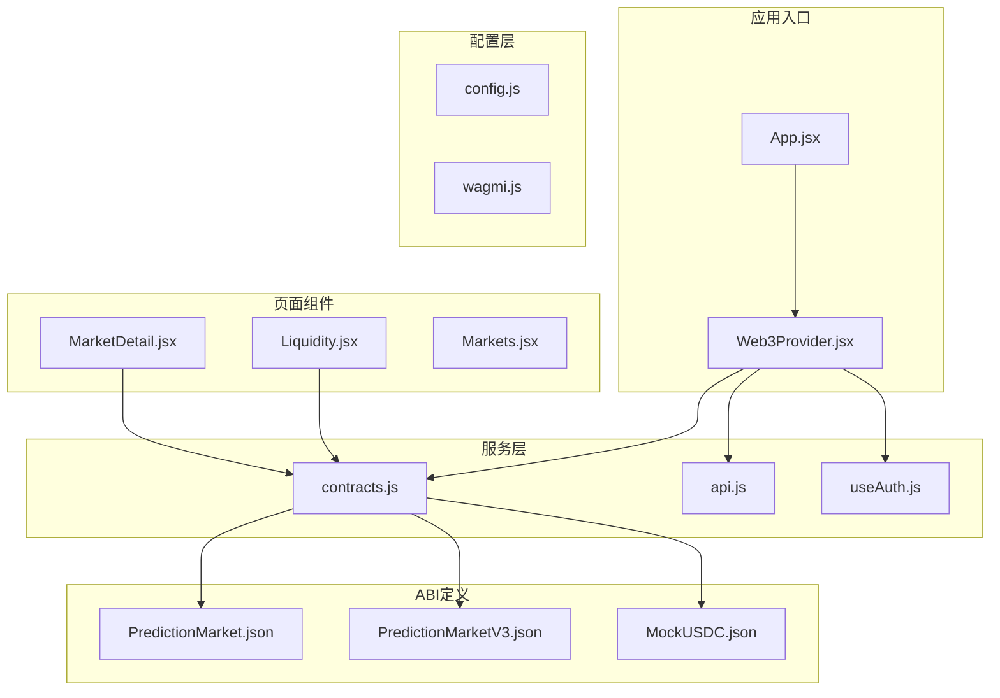
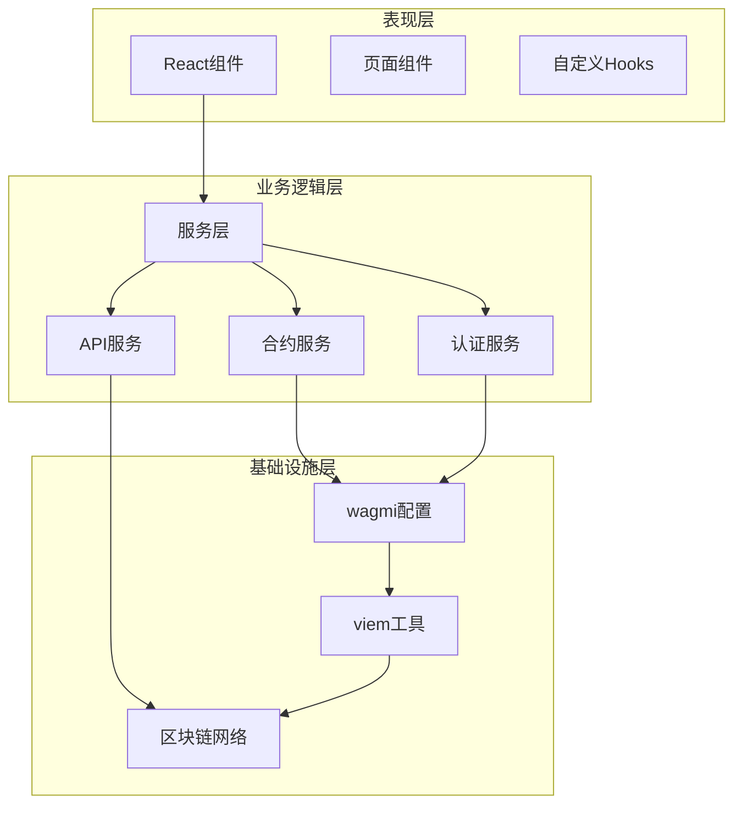
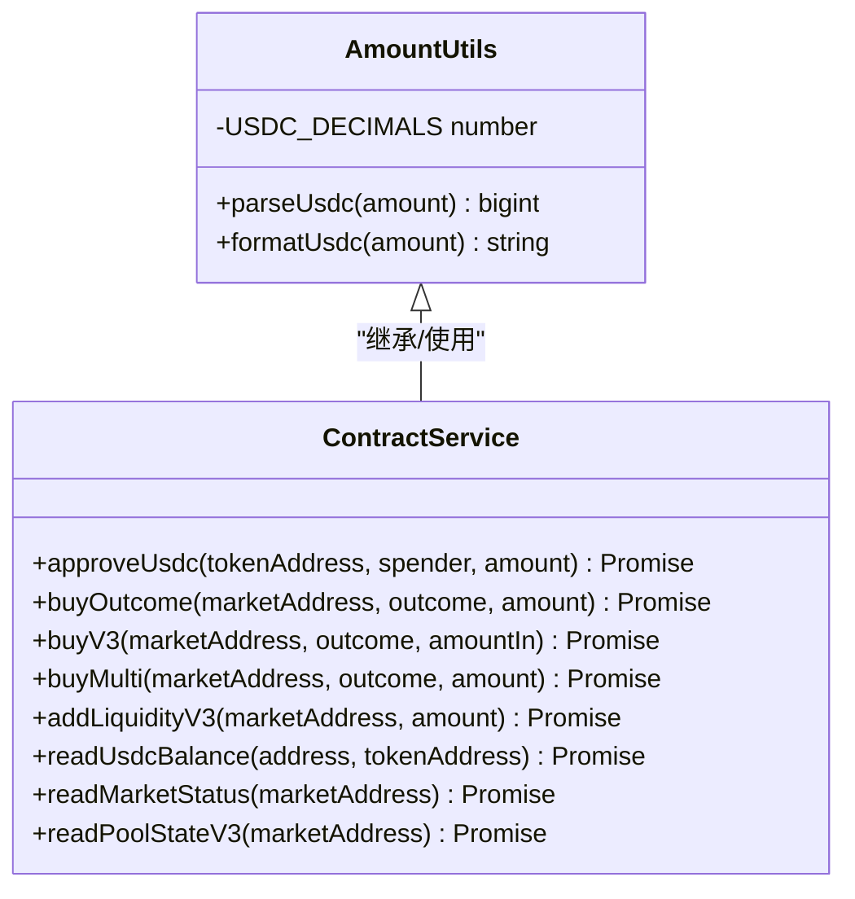
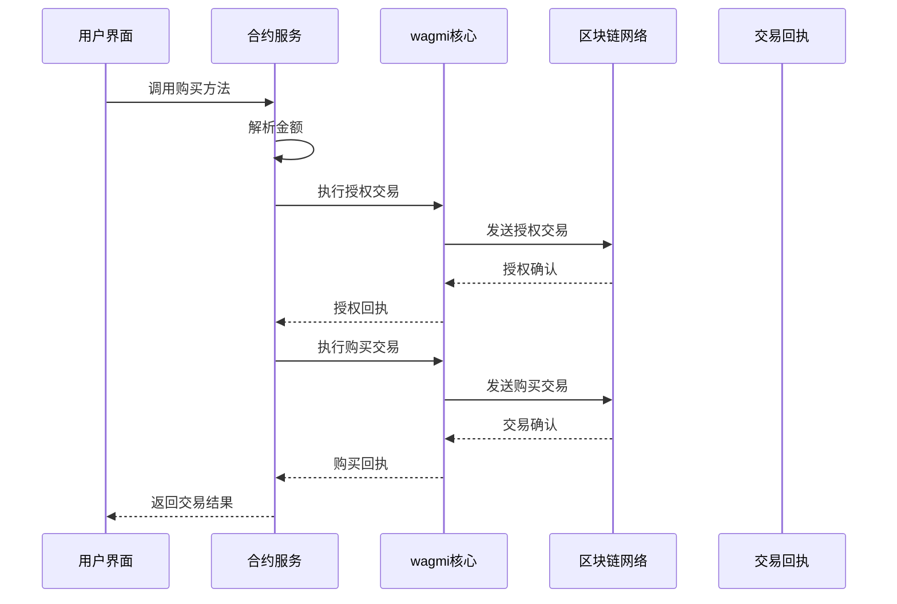
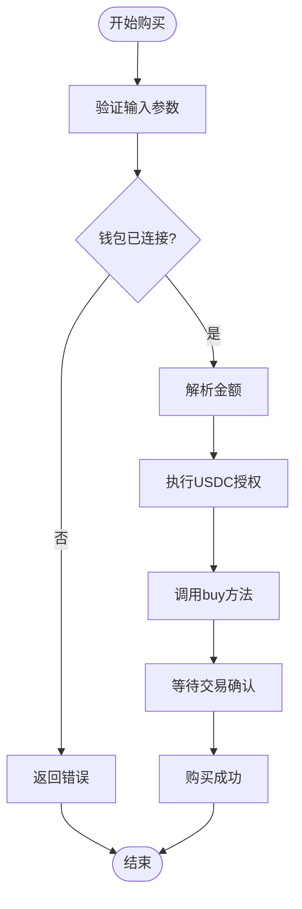
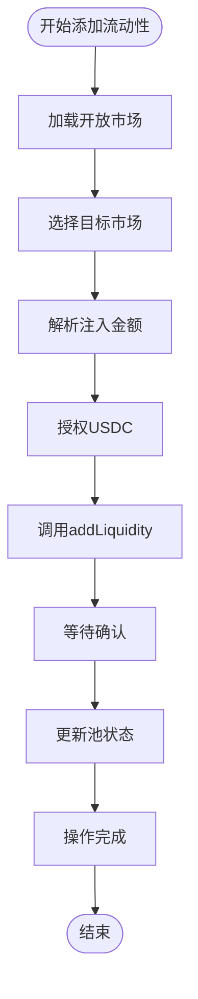
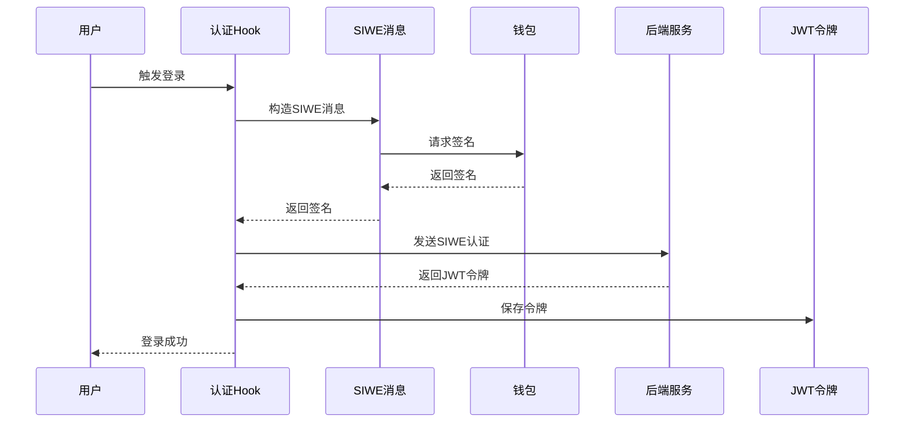
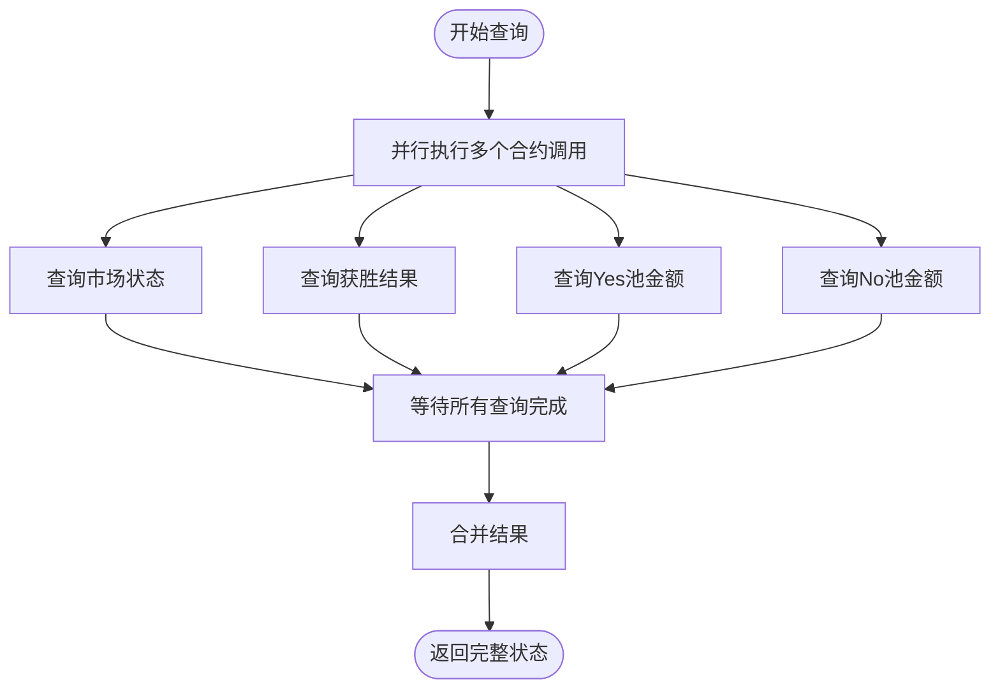
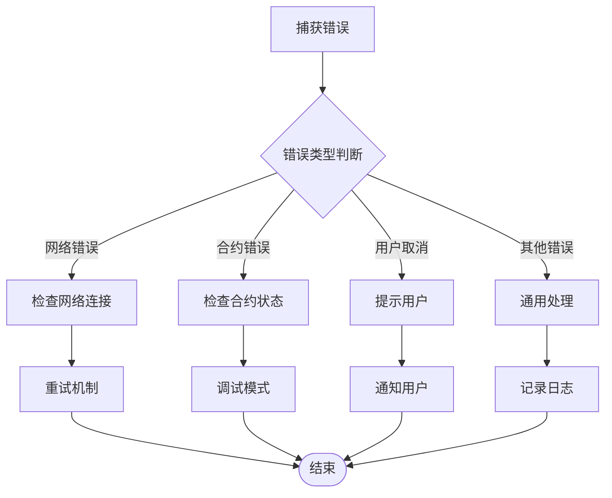

# 合约服务封装

<cite>
**本文档引用的文件**
- [contracts.js](file://src/services/contracts.js)
- [wagmi.js](file://src/wagmi.js)
- [Web3Provider.jsx](file://src/providers/Web3Provider.jsx)
- [config.js](file://src/config.js)
- [api.js](file://src/services/api.js)
- [package.json](file://package.json)
- [App.jsx](file://src/App.jsx)
- [MarketDetail.jsx](file://src/pages/MarketDetail.jsx)
- [Liquidity.jsx](file://src/pages/Liquidity.jsx)
- [useAuth.js](file://src/hooks/useAuth.js)
- [PredictionMarket.json](file://src/abis/PredictionMarket.json)
- [PredictionMarketV3.json](file://src/abis/PredictionMarketV3.json)
</cite>

## 目录
1. [简介](#简介)
2. [项目结构](#项目结构)
3. [核心组件](#核心组件)
4. [架构概览](#架构概览)
5. [详细组件分析](#详细组件分析)
6. [依赖关系分析](#依赖关系分析)
7. [性能考虑](#性能考虑)
8. [故障排除指南](#故障排除指南)
9. [结论](#结论)

## 简介

这是一个基于 React 和 wagmi/viem 的预测市场前端应用，专注于智能合约服务封装。该系统提供了完整的智能合约交互抽象层，包括ABI定义管理、合约实例化、交易构建和签名处理等功能。项目支持多种市场类型（二元市场、多结果市场、CPMM流动性池），并集成了钱包认证、合规检查和实时数据同步机制。

## 项目结构

项目采用模块化的文件组织方式，主要分为以下几个层次：



**图表来源**
- [App.jsx](file://src/App.jsx#L31-L66)
- [Web3Provider.jsx](file://src/providers/Web3Provider.jsx#L16-L24)
- [contracts.js](file://src/services/contracts.js#L1-L214)

**章节来源**
- [package.json](file://package.json#L1-L30)
- [App.jsx](file://src/App.jsx#L31-L66)

## 核心组件

### 合约服务抽象层

合约服务封装位于 `src/services/contracts.js`，提供了统一的智能合约交互接口：

#### 主要功能模块

1. **金额处理工具**
   - USDC金额解析和格式化
   - 小数位转换（6位小数）
   - 人类可读格式与链上格式互转

2. **合约交互方法**
   - USDC代币授权
   - 市场购买操作
   - 流动性管理
   - 市场状态查询

3. **多版本市场支持**
   - V1二元市场
   - V3 CPMM二元市场
   - 多结果市场

**章节来源**
- [contracts.js](file://src/services/contracts.js#L1-L214)

### 钱包集成层

钱包集成通过 wagmi 和 viem 实现，提供统一的区块链交互能力：

#### 配置管理
- 自定义链定义（Hardhat本地网络）
- 多钱包连接器支持
- HTTP传输配置

#### 提供者架构
- React Query客户端管理
- 全局状态缓存
- 异步数据请求处理

**章节来源**
- [wagmi.js](file://src/wagmi.js#L1-L37)
- [Web3Provider.jsx](file://src/providers/Web3Provider.jsx#L1-L25)

## 架构概览

系统采用分层架构设计，实现了清晰的关注点分离：



**图表来源**
- [App.jsx](file://src/App.jsx#L31-L66)
- [Web3Provider.jsx](file://src/providers/Web3Provider.jsx#L16-L24)
- [contracts.js](file://src/services/contracts.js#L1-L214)

## 详细组件分析

### 合约服务封装组件

#### 金额处理模块

金额处理模块提供了精确的数字转换功能，确保与区块链的精度要求一致：



**图表来源**
- [contracts.js](file://src/services/contracts.js#L24-L213)

#### 交易执行流程

交易执行采用标准化的三步流程：



**图表来源**
- [MarketDetail.jsx](file://src/pages/MarketDetail.jsx#L78-L110)
- [contracts.js](file://src/services/contracts.js#L59-L123)

**章节来源**
- [contracts.js](file://src/services/contracts.js#L24-L176)

### 市场功能实现

#### 二元预测市场（V1）

V1二元市场支持Yes/No两种结果的预测：



**图表来源**
- [MarketDetail.jsx](file://src/pages/MarketDetail.jsx#L92-L101)
- [contracts.js](file://src/services/contracts.js#L78-L88)

#### CPMM流动性池（V3）

V3版本引入了常数乘法做市商模型：



**图表来源**
- [Liquidity.jsx](file://src/pages/Liquidity.jsx#L52-L77)
- [contracts.js](file://src/services/contracts.js#L150-L160)

**章节来源**
- [MarketDetail.jsx](file://src/pages/MarketDetail.jsx#L78-L110)
- [Liquidity.jsx](file://src/pages/Liquidity.jsx#L52-L77)

### ABI定义管理

系统通过JSON文件管理合约ABI，实现了清晰的接口定义：

#### ABI结构特点

1. **标准化格式**
   - 合约名称标识
   - 完整的ABI数组
   - 事件和函数定义

2. **版本化管理**
   - V1和V3版本区分
   - 多结果市场支持
   - 兼容性设计

**章节来源**
- [PredictionMarket.json](file://src/abis/PredictionMarket.json#L1-L347)
- [PredictionMarketV3.json](file://src/abis/PredictionMarketV3.json#L1-L581)

### 认证与安全集成

#### SIWE认证流程

系统集成了以太坊签名登录（SIWE）协议：



**图表来源**
- [useAuth.js](file://src/hooks/useAuth.js#L29-L80)
- [api.js](file://src/services/api.js#L94-L99)

**章节来源**
- [useAuth.js](file://src/hooks/useAuth.js#L16-L109)

## 依赖关系分析

### 核心依赖关系

```mermaid
graph TB
subgraph "外部依赖"
Wagmi[wagmi ^2.14.1]
Viem[viem ^2.21.54]
ReactQuery[@tanstack/react-query ^5.62.2]
React[react ^18.3.1]
end
subgraph "内部模块"
Contracts[contracts.js]
API[api.js]
Auth[useAuth.js]
Config[config.js]
end
Contracts --> Wagmi
Contracts --> Viem
API --> ReactQuery
Auth --> Wagmi
Auth --> SIWE[siwe ^2.3.2]
Config --> React
Contracts --> Config
API --> Config
```

**图表来源**
- [package.json](file://package.json#L12-L20)
- [contracts.js](file://src/services/contracts.js#L1-L6)

### 模块耦合度分析

系统的模块设计具有良好的内聚性和低耦合性：

1. **服务层独立性**
   - 合约服务不依赖具体页面组件
   - API服务与UI层完全解耦
   - 配置管理独立于业务逻辑

2. **接口抽象**
   - 统一的合约调用接口
   - 标准化的错误处理
   - 明确的返回值规范

**章节来源**
- [package.json](file://package.json#L12-L20)
- [contracts.js](file://src/services/contracts.js#L1-L214)

## 性能考虑

### 并行查询优化

系统在市场状态查询中采用了并行处理策略：



**图表来源**
- [contracts.js](file://src/services/contracts.js#L185-L212)

### 缓存策略

系统利用React Query实现智能缓存：

1. **自动缓存管理**
   - 查询结果自动缓存
   - 缓存失效策略
   - 重新验证机制

2. **状态同步**
   - 交易完成后自动刷新
   - 错误状态处理
   - 用户体验优化

**章节来源**
- [Web3Provider.jsx](file://src/providers/Web3Provider.jsx#L8-L9)
- [MarketDetail.jsx](file://src/pages/MarketDetail.jsx#L104-L105)

## 故障排除指南

### 常见问题诊断

#### 交易失败排查

1. **授权失败**
   - 检查USDC余额
   - 验证授权额度
   - 确认合约地址正确

2. **购买失败**
   - 检查市场状态
   - 验证金额精度
   - 确认钱包连接

3. **流动性添加失败**
   - 检查V3市场兼容性
   - 验证池状态
   - 确认手续费设置

#### 错误处理最佳实践



**图表来源**
- [MarketDetail.jsx](file://src/pages/MarketDetail.jsx#L106-L109)
- [Liquidity.jsx](file://src/pages/Liquidity.jsx#L73-L77)

### 调试技巧

1. **开发工具使用**
   - 浏览器开发者工具
   - MetaMask调试模式
   - 控制台日志输出

2. **状态监控**
   - 使用React DevTools
   - 监控合约调用状态
   - 跟踪交易哈希

3. **环境配置**
   - 检查环境变量
   - 验证合约地址
   - 确认网络ID

**章节来源**
- [MarketDetail.jsx](file://src/pages/MarketDetail.jsx#L106-L109)
- [Liquidity.jsx](file://src/pages/Liquidity.jsx#L73-L77)

## 结论

该合约服务封装系统展现了优秀的架构设计和工程实践：

### 设计优势

1. **模块化设计**
   - 清晰的职责分离
   - 良好的扩展性
   - 便于维护和测试

2. **安全性考虑**
   - 完整的错误处理
   - 用户权限验证
   - 合约交互安全

3. **用户体验**
   - 响应式状态管理
   - 实时数据同步
   - 直观的操作反馈

### 技术亮点

1. **抽象层设计**
   - 统一的合约调用接口
   - 多版本市场支持
   - 精确的金额处理

2. **集成能力**
   - wagmi/viem深度集成
   - SIWE认证支持
   - React Query缓存

3. **开发效率**
   - 标准化的开发流程
   - 完善的错误处理
   - 详细的文档支持

该系统为预测市场应用提供了坚实的技术基础，具备良好的可扩展性和维护性，适合进一步的功能扩展和技术演进。