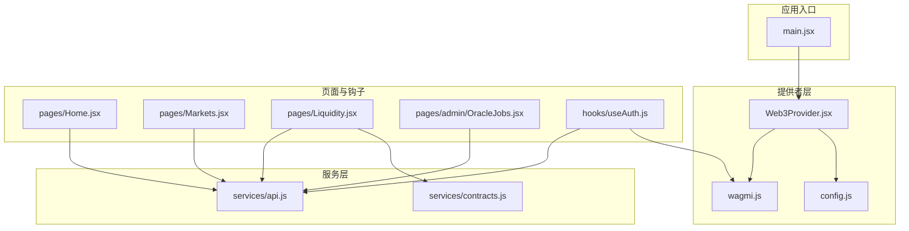
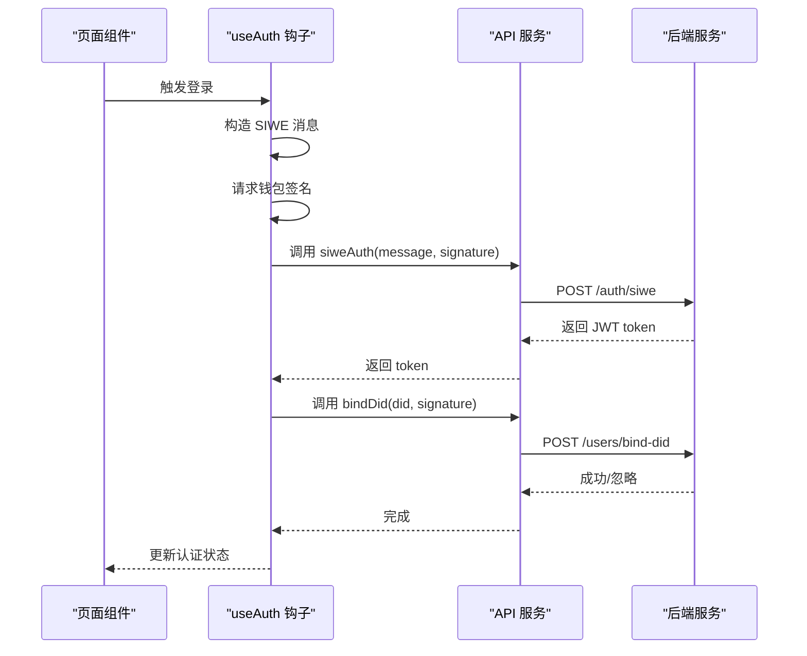
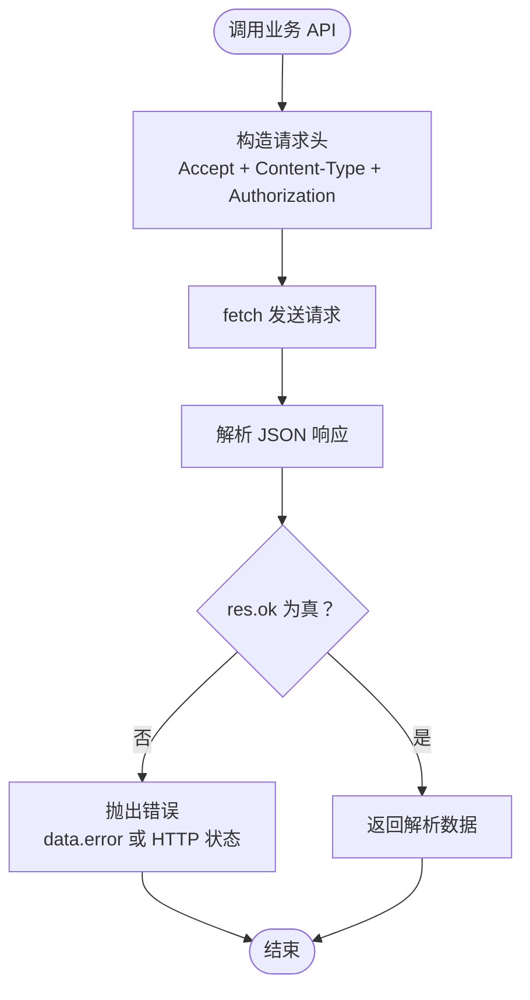
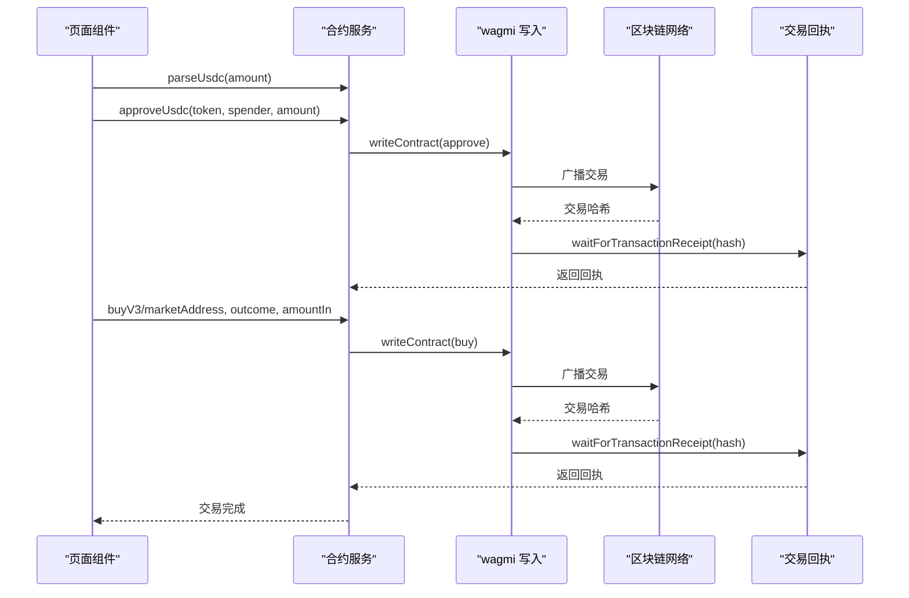
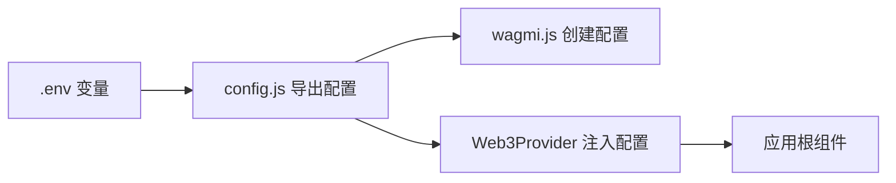
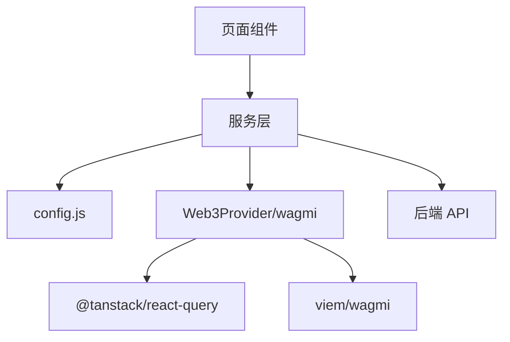

# 服务层设计

<cite>
**本文档引用的文件**
- [src/services/api.js](file://src/services/api.js)
- [src/services/contracts.js](file://src/services/contracts.js)
- [src/config.js](file://src/config.js)
- [src/providers/Web3Provider.jsx](file://src/providers/Web3Provider.jsx)
- [src/wagmi.js](file://src/wagmi.js)
- [src/hooks/useAuth.js](file://src/hooks/useAuth.js)
- [src/main.jsx](file://src/main.jsx)
- [src/pages/Home.jsx](file://src/pages/Home.jsx)
- [src/pages/Markets.jsx](file://src/pages/Markets.jsx)
- [src/pages/Liquidity.jsx](file://src/pages/Liquidity.jsx)
- [src/pages/admin/OracleJobs.jsx](file://src/pages/admin/OracleJobs.jsx)
- [src/abis/PredictionMarketV3.json](file://src/abis/PredictionMarketV3.json)
- [src/abis/MockUSDC.json](file://src/abis/MockUSDC.json)
- [vite.config.js](file://vite.config.js)
</cite>

## 目录
1. [引言](#引言)
2. [项目结构](#项目结构)
3. [核心组件](#核心组件)
4. [架构总览](#架构总览)
5. [详细组件分析](#详细组件分析)
6. [依赖关系分析](#依赖关系分析)
7. [性能考虑](#性能考虑)
8. [故障排除指南](#故障排除指南)
9. [结论](#结论)
10. [附录](#附录)

## 引言
本文件系统性阐述前端服务层的设计与实现，重点覆盖以下主题：
- API 服务封装与统一处理机制
- 合约交互抽象与交易生命周期管理
- 配置管理与环境变量集成
- 错误处理策略与用户体验
- 数据缓存与状态管理（React Query）
- 依赖注入与跨模块协作
- 扩展与自定义最佳实践

该服务层采用“纯函数 + 抽象层 + 提供者”的分层设计，既保证了业务逻辑的清晰隔离，又便于测试与演进。

## 项目结构
服务层主要由三部分组成：
- API 服务层：封装 HTTP 请求、认证令牌管理、错误处理与业务接口
- 合约交互层：封装 viem/wagmi 的读写操作、金额解析/格式化、交易确认
- 配置与提供者：集中管理应用配置、Web3 提供者与缓存提供者

**图表来源**
- [src/main.jsx](file://src/main.jsx#L17-L32)
- [src/providers/Web3Provider.jsx](file://src/providers/Web3Provider.jsx#L16-L24)
- [src/wagmi.js](file://src/wagmi.js#L26-L36)
- [src/config.js](file://src/config.js#L7-L22)
- [src/services/api.js](file://src/services/api.js#L29-L55)
- [src/services/contracts.js](file://src/services/contracts.js#L43-L69)
- [src/pages/Home.jsx](file://src/pages/Home.jsx#L6-L40)
- [src/pages/Markets.jsx](file://src/pages/Markets.jsx#L6-L25)
- [src/pages/Liquidity.jsx](file://src/pages/Liquidity.jsx#L6-L49)
- [src/pages/admin/OracleJobs.jsx](file://src/pages/admin/OracleJobs.jsx#L4-L31)
- [src/hooks/useAuth.js](file://src/hooks/useAuth.js#L16-L80)

**章节来源**
- [src/main.jsx](file://src/main.jsx#L17-L32)
- [src/providers/Web3Provider.jsx](file://src/providers/Web3Provider.jsx#L16-L24)
- [src/wagmi.js](file://src/wagmi.js#L26-L36)
- [src/config.js](file://src/config.js#L7-L22)

## 核心组件
- API 服务层：统一请求封装、认证令牌管理、错误处理、业务接口导出
- 合约交互层：金额解析/格式化、读写合约、交易确认、多版本市场支持
- 配置与提供者：应用配置、wagmi 配置、Web3 提供者、React Query 缓存

**章节来源**
- [src/services/api.js](file://src/services/api.js#L29-L55)
- [src/services/contracts.js](file://src/services/contracts.js#L24-L35)
- [src/config.js](file://src/config.js#L7-L22)
- [src/providers/Web3Provider.jsx](file://src/providers/Web3Provider.jsx#L16-L24)

## 架构总览
服务层通过“提供者注入 + 钩子封装 + 页面直连”的模式实现：
- 提供者注入：Web3Provider 将 wagmi 与 React Query 注入全局
- 钩子封装：useAuth 将钱包、签名、认证流程封装为可复用逻辑
- 页面直连：页面组件直接调用 API 或合约服务，降低耦合度

**图表来源**
- [src/hooks/useAuth.js](file://src/hooks/useAuth.js#L29-L80)
- [src/services/api.js](file://src/services/api.js#L94-L99)
- [src/services/api.js](file://src/services/api.js#L102-L107)

**章节来源**
- [src/hooks/useAuth.js](file://src/hooks/useAuth.js#L16-L80)
- [src/services/api.js](file://src/services/api.js#L94-L107)

## 详细组件分析

### API 服务封装与统一处理
- 统一请求封装：request 函数负责构造请求头、合并自定义头、附加 JWT、解析响应、抛出非 2xx 错误
- 认证令牌管理：getToken/setToken/clearToken 管理本地存储的 JWT
- 业务接口导出：健康检查、就绪检查、赛事/市场列表、认证、绑定 DID、VC 验证、管理员接口、合规与统计等
- 管理员接口：通过 sessionStorage 中的 X-Admin-Key 注入请求头
- 参数拼接：URLSearchParams 将对象参数序列化为查询字符串

**图表来源**
- [src/services/api.js](file://src/services/api.js#L29-L55)

**章节来源**
- [src/services/api.js](file://src/services/api.js#L29-L55)
- [src/services/api.js](file://src/services/api.js#L58-L67)
- [src/services/api.js](file://src/services/api.js#L69-L91)
- [src/services/api.js](file://src/services/api.js#L94-L107)
- [src/services/api.js](file://src/services/api.js#L131-L158)

### 合约交互抽象与交易生命周期
- 金额解析/格式化：parseUsdc/formatUsdc 统一 USDC 金额的人类可读与链上整数转换
- 读写合约：readContract/writeContract/walletClient.waitForTransactionReceipt 统一封装读写与确认
- 交易生命周期：approve -> buy/addLiquidity -> 等待确认 -> 刷新状态
- 多版本市场支持：V1、V3 CPMM、多结果市场分别封装对应方法
- 并行读取：市场状态读取使用 Promise.all 提升性能

**图表来源**
- [src/services/contracts.js](file://src/services/contracts.js#L24-L35)
- [src/services/contracts.js](file://src/services/contracts.js#L59-L69)
- [src/services/contracts.js](file://src/services/contracts.js#L113-L123)
- [src/services/contracts.js](file://src/services/contracts.js#L183-L213)

**章节来源**
- [src/services/contracts.js](file://src/services/contracts.js#L24-L35)
- [src/services/contracts.js](file://src/services/contracts.js#L43-L69)
- [src/services/contracts.js](file://src/services/contracts.js#L113-L123)
- [src/services/contracts.js](file://src/services/contracts.js#L183-L213)

### 配置管理与提供者注入
- 应用配置：从环境变量读取 API 地址、链 ID、合约地址、SIWE 域名与 URI
- wagmi 配置：定义本地链、连接器、传输层，暴露全局配置实例
- 提供者注入：Web3Provider 将 wagmi 与 React Query 注入应用根节点
- 页面使用：各页面通过服务层间接使用配置与提供者能力

**图表来源**
- [src/config.js](file://src/config.js#L1-L22)
- [src/wagmi.js](file://src/wagmi.js#L11-L23)
- [src/wagmi.js](file://src/wagmi.js#L26-L36)
- [src/providers/Web3Provider.jsx](file://src/providers/Web3Provider.jsx#L16-L24)

**章节来源**
- [src/config.js](file://src/config.js#L1-L22)
- [src/wagmi.js](file://src/wagmi.js#L11-L23)
- [src/wagmi.js](file://src/wagmi.js#L26-L36)
- [src/providers/Web3Provider.jsx](file://src/providers/Web3Provider.jsx#L16-L24)

### 错误处理策略
- API 层：非 2xx 响应统一抛错，错误消息优先使用后端返回的 error 字段
- 页面层：捕获错误并展示，避免应用崩溃
- 钩子层：useAuth 捕获认证过程异常并设置错误状态
- 管理员接口：X-Admin-Key 不存在时请求头为空，后端校验失败会返回错误

**章节来源**
- [src/services/api.js](file://src/services/api.js#L48-L52)
- [src/pages/Home.jsx](file://src/pages/Home.jsx#L32-L37)
- [src/hooks/useAuth.js](file://src/hooks/useAuth.js#L73-L79)
- [src/services/api.js](file://src/services/api.js#L132-L135)

### 数据缓存方案
- React Query：Web3Provider 创建 QueryClient，全局缓存异步数据，减少重复请求
- 页面使用：Home/Markets/Stats 等组件通过服务层发起请求，自动享受缓存与重试能力
- 缓存策略：默认缓存策略适用于本项目的数据时效性需求

**章节来源**
- [src/providers/Web3Provider.jsx](file://src/providers/Web3Provider.jsx#L8-L9)
- [src/providers/Web3Provider.jsx](file://src/providers/Web3Provider.jsx#L16-L24)
- [src/pages/Home.jsx](file://src/pages/Home.jsx#L21-L40)
- [src/pages/Markets.jsx](file://src/pages/Markets.jsx#L21-L25)
- [src/pages/Stats.jsx](file://src/pages/Stats.jsx#L17-L18)

### 依赖注入与跨模块协作
- 依赖注入：wagmiConfig 作为全局依赖注入到合约服务；config 作为全局配置注入到 API 与 wagmi
- 跨模块协作：页面组件仅依赖服务层；服务层再依赖配置与提供者；避免页面直接依赖底层库
- 钩子封装：useAuth 将钱包、签名、认证流程封装为可复用逻辑，供页面直接使用

**章节来源**
- [src/services/contracts.js](file://src/services/contracts.js#L6-L6)
- [src/services/api.js](file://src/services/api.js#L2-L2)
- [src/hooks/useAuth.js](file://src/hooks/useAuth.js#L16-L80)

### 页面使用示例与服务层交互
- 首页：调用 getHealth 与 listMatches，展示 API 状态与赛事列表
- 市场列表：调用 listMarkets，格式化 USDC 金额
- 流动性管理：调用 listMarkets/getMarketPool，执行 approve 与 addLiquidity
- 管理员页面：调用 adminListOracleJobs，定时刷新任务状态

**章节来源**
- [src/pages/Home.jsx](file://src/pages/Home.jsx#L21-L40)
- [src/pages/Markets.jsx](file://src/pages/Markets.jsx#L21-L25)
- [src/pages/Liquidity.jsx](file://src/pages/Liquidity.jsx#L34-L77)
- [src/pages/admin/OracleJobs.jsx](file://src/pages/admin/OracleJobs.jsx#L17-L31)

## 依赖关系分析
- 组件耦合：页面组件只依赖服务层；服务层依赖配置与提供者；降低页面复杂度
- 外部依赖：wagmi/viem 用于链上交互；@tanstack/react-query 用于缓存；siwe 用于签名
- 环境变量：VITE_API_URL、VITE_CHAIN_ID、VITE_MOCK_USDC_ADDRESS、VITE_MARKET_FACTORY_ADDRESS、VITE_SIWE_DOMAIN、VITE_SIWE_URI
- 开发代理：Vite 代理 /health 与 /ready 到后端 8080 端口

**图表来源**
- [src/pages/Home.jsx](file://src/pages/Home.jsx#L6-L6)
- [src/pages/Markets.jsx](file://src/pages/Markets.jsx#L6-L8)
- [src/pages/Liquidity.jsx](file://src/pages/Liquidity.jsx#L6-L13)
- [src/services/api.js](file://src/services/api.js#L2-L2)
- [src/services/contracts.js](file://src/services/contracts.js#L4-L6)
- [src/providers/Web3Provider.jsx](file://src/providers/Web3Provider.jsx#L16-L24)
- [src/wagmi.js](file://src/wagmi.js#L26-L36)
- [vite.config.js](file://vite.config.js#L8-L11)

**章节来源**
- [vite.config.js](file://vite.config.js#L8-L11)
- [src/services/api.js](file://src/services/api.js#L2-L2)
- [src/services/contracts.js](file://src/services/contracts.js#L4-L6)

## 性能考虑
- 并行读取：合约状态读取使用 Promise.all，减少等待时间
- 缓存利用：React Query 缓存页面数据，避免重复请求
- 金额转换：parseUsdc/formatUsdc 使用 viem 工具，避免精度丢失
- 代理优化：Vite 代理减少跨域与额外跳转

**章节来源**
- [src/services/contracts.js](file://src/services/contracts.js#L185-L210)
- [src/providers/Web3Provider.jsx](file://src/providers/Web3Provider.jsx#L8-L9)
- [src/services/contracts.js](file://src/services/contracts.js#L24-L35)
- [vite.config.js](file://vite.config.js#L8-L11)

## 故障排除指南
- API 无响应或 500：检查 VITE_API_URL 与后端服务状态；查看 getReady 返回的 ok 与 data
- 认证失败：确认 SIWE 域名、URI 与链 ID 配置正确；检查本地存储 JWT 与 sessionStorage 中的 X-Admin-Key
- 钱包未连接：useAuth 会在地址或链 ID 缺失时提前返回；确保已连接钱包并切换到正确链
- 交易未确认：检查交易哈希与网络状态；确认 waitForTransactionReceipt 正常返回回执
- 金额异常：确认 parseUsdc 输入单位与 formatUsdc 输出单位一致；核对合约小数位配置

**章节来源**
- [src/services/api.js](file://src/services/api.js#L63-L67)
- [src/hooks/useAuth.js](file://src/hooks/useAuth.js#L30-L31)
- [src/services/contracts.js](file://src/services/contracts.js#L24-L35)

## 结论
该服务层通过“统一 API 封装 + 合约交互抽象 + 配置与提供者注入”实现了清晰的职责分离与良好的可维护性。配合 React Query 的缓存与错误处理策略，页面组件能够以最小成本接入复杂的链上与后端能力。建议在后续扩展中持续遵循“纯函数 + 明确边界 + 可测试”的原则，逐步引入更细粒度的错误分类与重试策略。

## 附录
- 环境变量清单：VITE_API_URL、VITE_CHAIN_ID、VITE_MOCK_USDC_ADDRESS、VITE_MARKET_FACTORY_ADDRESS、VITE_SIWE_DOMAIN、VITE_SIWE_URI
- 关键 ABI：PredictionMarketV3、MockUSDC
- 页面与服务映射：Home ↔ API、Markets ↔ API、Liquidity ↔ API + Contracts、OracleJobs ↔ API

**章节来源**
- [src/config.js](file://src/config.js#L1-L22)
- [src/abis/PredictionMarketV3.json](file://src/abis/PredictionMarketV3.json#L1-L581)
- [src/abis/MockUSDC.json](file://src/abis/MockUSDC.json#L1-L336)
- [src/pages/Home.jsx](file://src/pages/Home.jsx#L6-L40)
- [src/pages/Markets.jsx](file://src/pages/Markets.jsx#L6-L25)
- [src/pages/Liquidity.jsx](file://src/pages/Liquidity.jsx#L6-L77)
- [src/pages/admin/OracleJobs.jsx](file://src/pages/admin/OracleJobs.jsx#L4-L31)