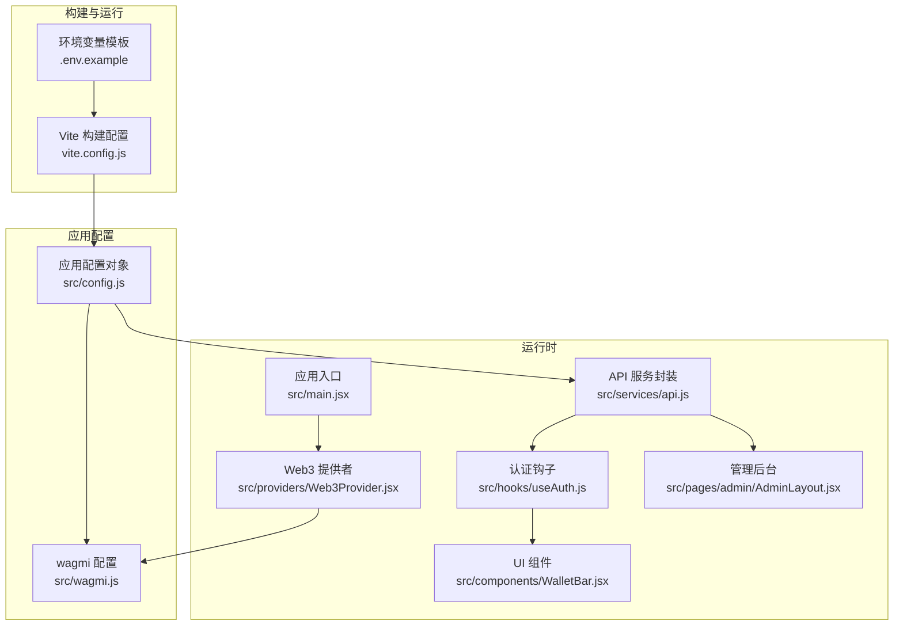
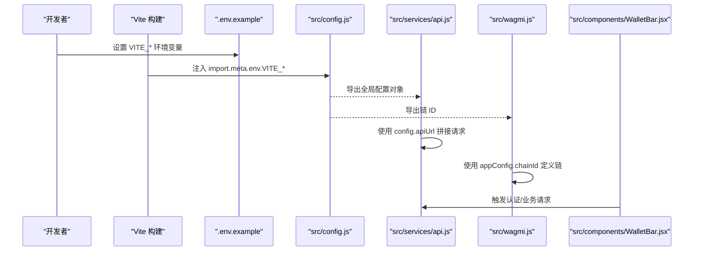
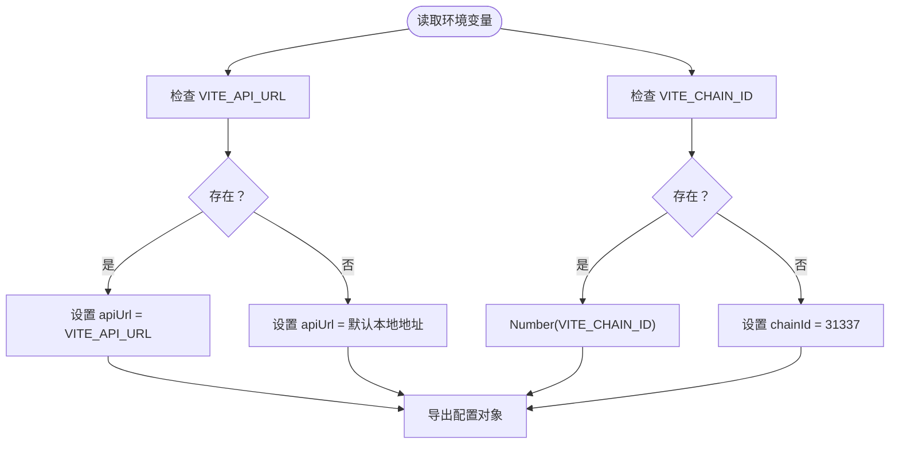
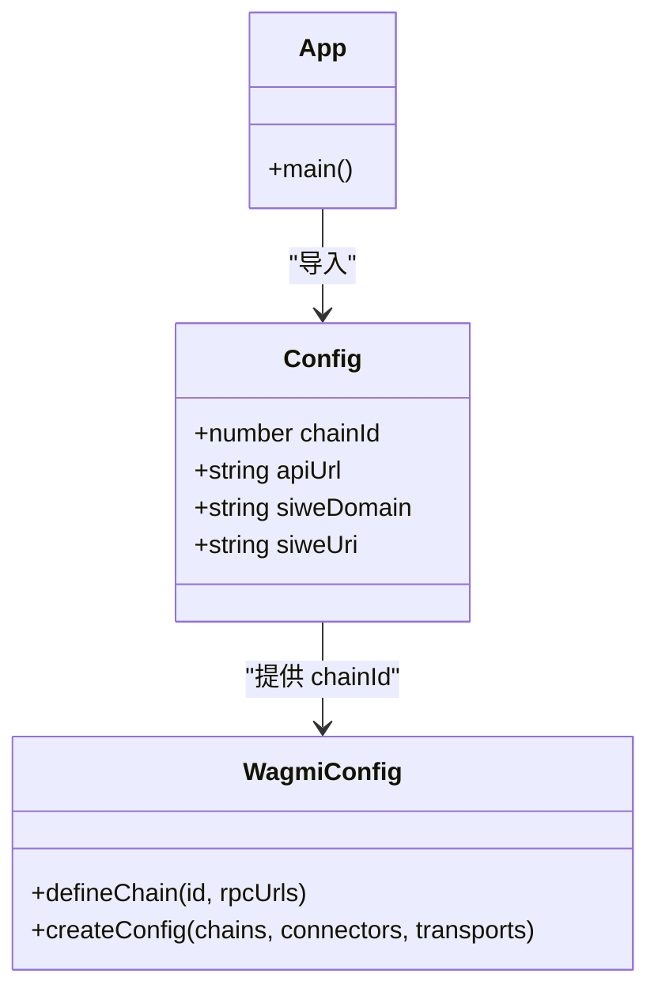
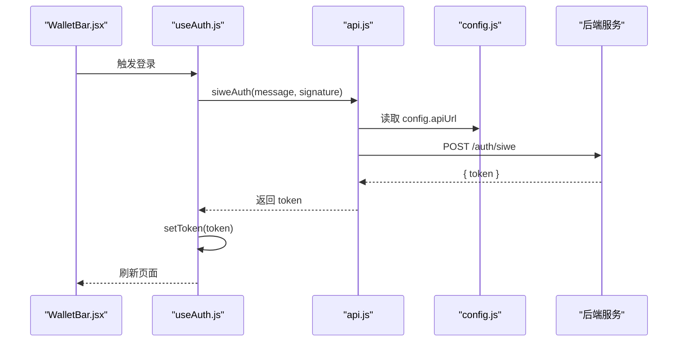
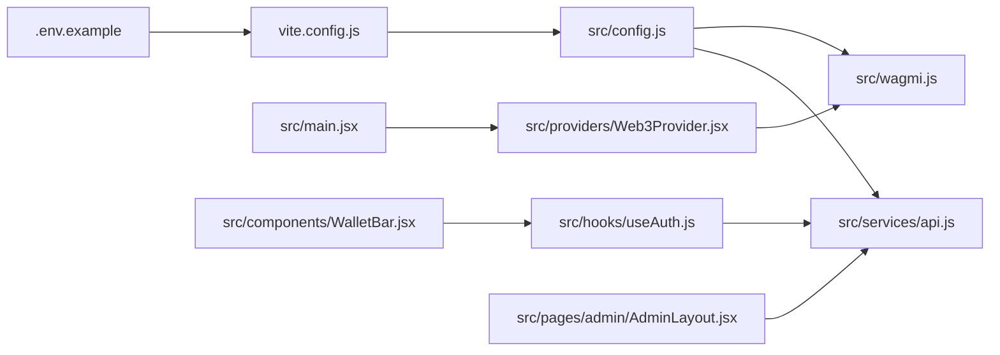

# 配置管理

<cite>
**本文引用的文件**
- [src/config.js](file://src/config.js)
- [.env.example](file://.env.example)
- [vite.config.js](file://vite.config.js)
- [package.json](file://package.json)
- [src/services/api.js](file://src/services/api.js)
- [src/wagmi.js](file://src/wagmi.js)
- [src/providers/Web3Provider.jsx](file://src/providers/Web3Provider.jsx)
- [src/main.jsx](file://src/main.jsx)
- [src/hooks/useAuth.js](file://src/hooks/useAuth.js)
- [src/components/WalletBar.jsx](file://src/components/WalletBar.jsx)
- [src/pages/admin/AdminLayout.jsx](file://src/pages/admin/AdminLayout.jsx)
</cite>

## 目录
1. [简介](#简介)
2. [项目结构](#项目结构)
3. [核心组件](#核心组件)
4. [架构总览](#架构总览)
5. [详细组件分析](#详细组件分析)
6. [依赖关系分析](#依赖关系分析)
7. [性能考量](#性能考量)
8. [故障排除指南](#故障排除指南)
9. [结论](#结论)
10. [附录](#附录)

## 简介
本文件系统性梳理前端应用的配置管理设计与实现，覆盖环境变量管理、API 地址配置、网络配置、第三方服务配置、默认值处理、配置验证策略、安全与敏感信息保护、以及配置热更新的可行性与最佳实践。目标是帮助开发者快速理解配置体系、正确使用与扩展配置项，并在多环境部署中保持一致性与安全性。

## 项目结构
前端采用 Vite + React + wagmi/viem 的现代前端栈，配置主要集中在应用入口与服务层：
- 应用级配置集中于 src/config.js，统一导出全局配置对象
- 环境变量通过 Vite 的 import.meta.env 注入，示例模板位于 .env.example
- 区块链网络配置由 wagmi.js 基于应用配置动态生成
- API 层通过 src/services/api.js 使用全局配置拼接请求地址
- 开发服务器代理在 vite.config.js 中配置，便于前后端联调

图表来源
- [vite.config.js](file://vite.config.js#L1-L14)
- [src/config.js](file://src/config.js#L1-L23)
- [src/wagmi.js](file://src/wagmi.js#L1-L37)
- [src/main.jsx](file://src/main.jsx#L1-L33)
- [src/providers/Web3Provider.jsx](file://src/providers/Web3Provider.jsx#L1-L25)
- [src/services/api.js](file://src/services/api.js#L1-L187)
- [src/hooks/useAuth.js](file://src/hooks/useAuth.js#L1-L110)
- [src/components/WalletBar.jsx](file://src/components/WalletBar.jsx#L1-L36)
- [src/pages/admin/AdminLayout.jsx](file://src/pages/admin/AdminLayout.jsx#L1-L20)

章节来源
- [vite.config.js](file://vite.config.js#L1-L14)
- [src/config.js](file://src/config.js#L1-L23)
- [src/wagmi.js](file://src/wagmi.js#L1-L37)
- [src/main.jsx](file://src/main.jsx#L1-L33)
- [src/providers/Web3Provider.jsx](file://src/providers/Web3Provider.jsx#L1-L25)
- [src/services/api.js](file://src/services/api.js#L1-L187)
- [src/hooks/useAuth.js](file://src/hooks/useAuth.js#L1-L110)
- [src/components/WalletBar.jsx](file://src/components/WalletBar.jsx#L1-L36)
- [src/pages/admin/AdminLayout.jsx](file://src/pages/admin/AdminLayout.jsx#L1-L20)

## 核心组件
- 应用配置对象：集中管理 API 地址、链 ID、合约地址、SIWE 域名与 URI 等
- Vite 环境变量注入：通过 import.meta.env.VITE_* 读取
- wagmi 链配置：基于应用配置动态生成本地链定义
- API 服务封装：统一拼接请求路径、自动附加鉴权头
- 认证流程：SIWE 登录、令牌持久化与刷新
- 管理后台：管理员密钥通过 sessionStorage 注入

章节来源
- [src/config.js](file://src/config.js#L1-L23)
- [src/wagmi.js](file://src/wagmi.js#L1-L37)
- [src/services/api.js](file://src/services/api.js#L1-L187)
- [src/hooks/useAuth.js](file://src/hooks/useAuth.js#L1-L110)
- [src/pages/admin/AdminLayout.jsx](file://src/pages/admin/AdminLayout.jsx#L1-L20)

## 架构总览
配置体系围绕“环境变量 -> 应用配置 -> 运行时使用”的单向流展开。Vite 在构建期将 .env 中的 VITE_* 变量注入到 import.meta.env；应用启动时，src/config.js 读取这些变量并导出全局配置对象；后续模块（API、wagmi、认证钩子等）均通过该对象获取所需配置。

图表来源
- [.env.example](file://.env.example#L1-L7)
- [src/config.js](file://src/config.js#L1-L23)
- [src/services/api.js](file://src/services/api.js#L1-L187)
- [src/wagmi.js](file://src/wagmi.js#L1-L37)
- [src/components/WalletBar.jsx](file://src/components/WalletBar.jsx#L1-L36)

## 详细组件分析

### 应用配置对象（src/config.js）
- 职责：从 import.meta.env 读取 VITE_*，提供默认值，导出全局配置对象
- 关键字段
  - apiUrl：后端 API 基础地址，默认本地 8080 端口
  - chainId：区块链网络 ID，默认本地 Hardhat 网络 31337
  - apiUrlConfigured：标记 API URL 是否来自环境变量
  - mockUsdc、marketFactory：合约地址占位（可为空）
  - siweDomain、siweUri：SIWE 登录使用的域名与 URI
- 默认值策略：优先使用环境变量，否则回退到开发友好默认值
- 验证策略：对 chainId 进行数字转换，其余字符串字段不做额外校验

图表来源
- [src/config.js](file://src/config.js#L1-L23)

章节来源
- [src/config.js](file://src/config.js#L1-L23)

### 环境变量与注入（.env.example 与 Vite）
- .env.example 提供 VITE_* 的示例键名，确保团队成员遵循一致的命名规范
- Vite 在构建时将 VITE_* 注入到 import.meta.env，仅在构建期生效
- 非 VITE 前缀的变量不会被注入，避免泄露敏感信息

章节来源
- [.env.example](file://.env.example#L1-L7)
- [vite.config.js](file://vite.config.js#L1-L14)

### 区块链网络配置（src/wagmi.js）
- 基于应用配置中的 chainId 动态定义本地链（Hardhat Local）
- 配置默认 RPC 地址为本地 8545，便于本地联调
- 通过 wagmi 的 createConfig 与 http 传输创建全局配置实例

图表来源
- [src/config.js](file://src/config.js#L1-L23)
- [src/wagmi.js](file://src/wagmi.js#L1-L37)

章节来源
- [src/wagmi.js](file://src/wagmi.js#L1-L37)

### API 地址配置与请求封装（src/services/api.js）
- 统一使用 config.apiUrl 拼接请求路径
- 自动附加 Authorization 头（若存在本地令牌）
- 对非 2xx 响应抛出错误，便于上层处理
- 健康检查与就绪检查分别访问 /health 与 /ready

图表来源
- [src/components/WalletBar.jsx](file://src/components/WalletBar.jsx#L1-L36)
- [src/hooks/useAuth.js](file://src/hooks/useAuth.js#L1-L110)
- [src/services/api.js](file://src/services/api.js#L1-L187)
- [src/config.js](file://src/config.js#L1-L23)

章节来源
- [src/services/api.js](file://src/services/api.js#L1-L187)
- [src/hooks/useAuth.js](file://src/hooks/useAuth.js#L1-L110)

### 认证与令牌存储（src/hooks/useAuth.js）
- 使用 SIWE 构造消息，调用后端获取 JWT 令牌
- 令牌存储于 localStorage，键名为固定常量
- 登出时清除令牌并刷新页面

章节来源
- [src/hooks/useAuth.js](file://src/hooks/useAuth.js#L1-L110)
- [src/services/api.js](file://src/services/api.js#L1-L20)

### 管理后台配置（src/pages/admin/AdminLayout.jsx）
- 管理员密钥通过 sessionStorage 注入，作为 X-Admin-Key 请求头传递
- 若未设置，界面提示在控制台设置

章节来源
- [src/pages/admin/AdminLayout.jsx](file://src/pages/admin/AdminLayout.jsx#L1-L20)
- [src/services/api.js](file://src/services/api.js#L131-L158)

## 依赖关系分析
- 低耦合：配置对象独立于具体业务模块，仅通过导入使用
- 单向依赖：API 与 wagmi 依赖配置对象；配置对象不反向依赖其他模块
- 运行时依赖：Web3Provider 作为顶层提供者，承载 wagmi 与 React Query

图表来源
- [.env.example](file://.env.example#L1-L7)
- [vite.config.js](file://vite.config.js#L1-L14)
- [src/config.js](file://src/config.js#L1-L23)
- [src/services/api.js](file://src/services/api.js#L1-L187)
- [src/wagmi.js](file://src/wagmi.js#L1-L37)
- [src/main.jsx](file://src/main.jsx#L1-L33)
- [src/providers/Web3Provider.jsx](file://src/providers/Web3Provider.jsx#L1-L25)
- [src/hooks/useAuth.js](file://src/hooks/useAuth.js#L1-L110)
- [src/components/WalletBar.jsx](file://src/components/WalletBar.jsx#L1-L36)
- [src/pages/admin/AdminLayout.jsx](file://src/pages/admin/AdminLayout.jsx#L1-L20)

章节来源
- [src/config.js](file://src/config.js#L1-L23)
- [src/services/api.js](file://src/services/api.js#L1-L187)
- [src/wagmi.js](file://src/wagmi.js#L1-L37)
- [src/providers/Web3Provider.jsx](file://src/providers/Web3Provider.jsx#L1-L25)
- [src/main.jsx](file://src/main.jsx#L1-L33)

## 性能考量
- 配置读取成本极低：仅在应用启动时读取一次，随后通过模块导入共享
- API 请求头拼接与错误处理在请求封装中完成，避免重复逻辑
- 本地开发代理减少跨域与网络往返，提升调试效率

[本节为通用建议，无需特定文件来源]

## 故障排除指南
- API 地址无法访问
  - 检查 .env.example 中 VITE_API_URL 是否正确设置
  - 确认 Vite 构建是否包含该变量（非 VITE 前缀不会注入）
  - 查看 API 服务封装中的请求路径拼接是否符合预期
- 区块链网络不匹配
  - 确认 VITE_CHAIN_ID 与本地/测试网一致
  - 检查 wagmi 链定义是否使用了正确的 chainId
- 认证失败
  - 检查 SIWE 域名与 URI 是否与后端一致
  - 确认本地令牌是否正确写入 localStorage
  - 查看后端返回的错误信息并定位
- 管理后台无权限
  - 在浏览器控制台设置 sessionStorage.admin_key
  - 确认请求头 X-Admin-Key 是否随请求发送

章节来源
- [.env.example](file://.env.example#L1-L7)
- [src/services/api.js](file://src/services/api.js#L1-L187)
- [src/wagmi.js](file://src/wagmi.js#L1-L37)
- [src/hooks/useAuth.js](file://src/hooks/useAuth.js#L1-L110)
- [src/pages/admin/AdminLayout.jsx](file://src/pages/admin/AdminLayout.jsx#L1-L20)

## 结论
本项目采用“环境变量 + 应用配置对象”的清晰分层，配合 Vite 注入与 wagmi 动态链配置，实现了简洁、可维护且易于扩展的配置体系。建议在多环境部署中坚持使用 VITE_* 前缀、明确默认值、加强令牌与密钥的安全存储，并在需要时引入运行时配置热更新方案（如动态拉取配置并触发局部刷新）以进一步提升灵活性。

[本节为总结，无需特定文件来源]

## 附录

### 配置项分类与用途
- 环境切换
  - VITE_API_URL：后端 API 基础地址，支持本地/测试/生产环境切换
- 区块链网络
  - VITE_CHAIN_ID：链 ID，决定本地链与钱包网络一致性
- 第三方服务
  - VITE_SIWE_DOMAIN、VITE_SIWE_URI：SIWE 登录域名与 URI
- 合约地址
  - VITE_MOCK_USDC_ADDRESS、VITE_MARKET_FACTORY_ADDRESS：合约地址占位，便于不同网络部署

章节来源
- [.env.example](file://.env.example#L1-L7)
- [src/config.js](file://src/config.js#L1-L23)

### 配置加载机制与默认值
- 加载机制：Vite 在构建期注入 import.meta.env.VITE_*，应用启动时读取并导出全局配置
- 默认值：API 地址默认本地端口，链 ID 默认本地网络，SIWE 域名与 URI 提供开发友好默认

章节来源
- [src/config.js](file://src/config.js#L1-L23)
- [vite.config.js](file://vite.config.js#L1-L14)

### 配置验证策略
- 类型转换：链 ID 进行数字转换
- 字符串字段：不做额外校验，依赖后端与钱包行为
- 建议：在生产环境增加更严格的校验（如正则、白名单）

章节来源
- [src/config.js](file://src/config.js#L1-L23)

### 配置安全性与敏感信息保护
- 仅使用 VITE_* 前缀暴露到客户端
- 令牌与管理员密钥使用 localStorage 与 sessionStorage 存储，注意 XSS 防护
- 建议：对令牌设置 HttpOnly（服务端）、最小权限原则、定期轮换

章节来源
- [src/services/api.js](file://src/services/api.js#L1-L20)
- [src/pages/admin/AdminLayout.jsx](file://src/pages/admin/AdminLayout.jsx#L1-L20)

### 配置热更新实现方式
- 当前实现：应用重启后重新读取环境变量
- 可选方案：引入运行时配置拉取（如 /config），在变更时触发局部刷新，避免整页刷新
- 注意：热更新需与后端配置中心协同，并确保兼容性与回滚策略

[本节为概念性建议，无需特定文件来源]