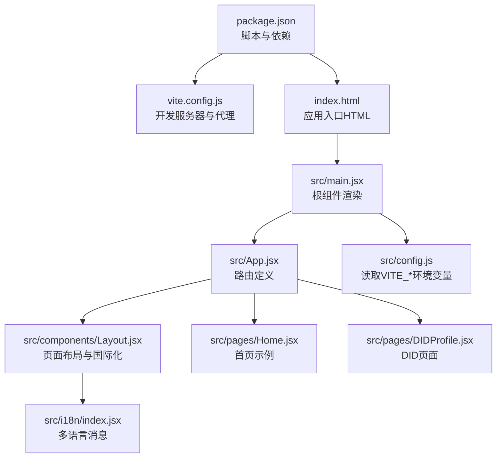
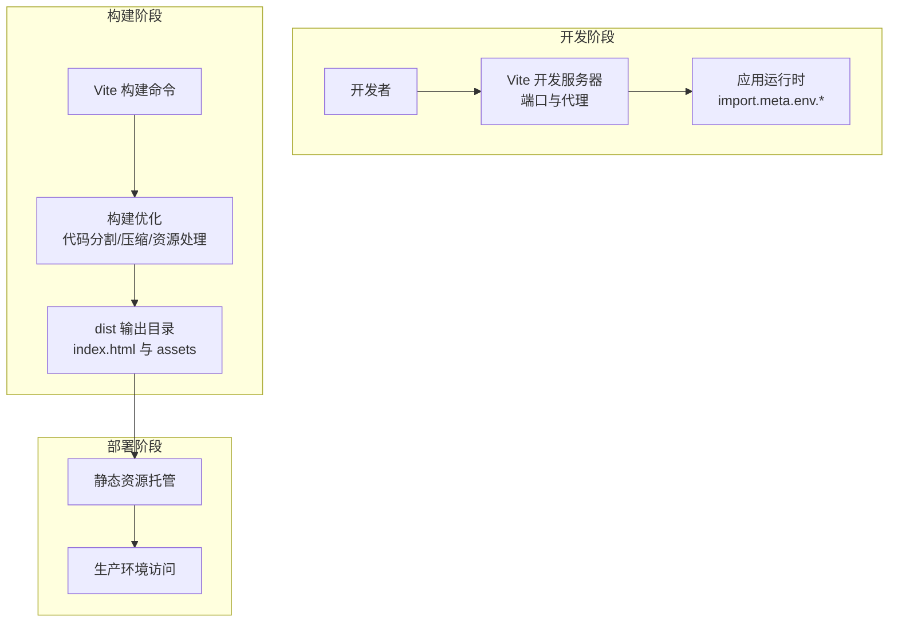
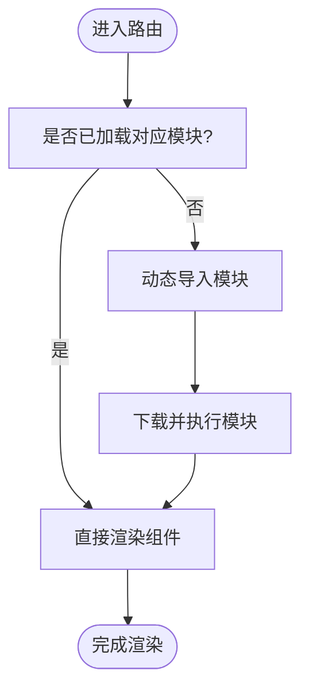
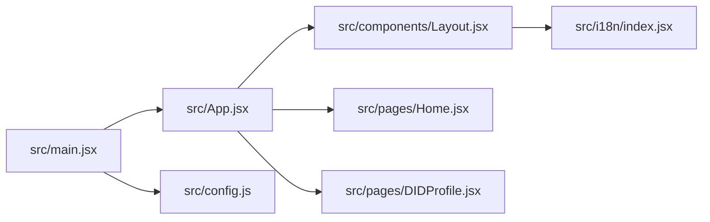

# 构建和部署

<cite>
**本文引用的文件**
- [vite.config.js](file://vite.config.js)
- [package.json](file://package.json)
- [.env.example](file://.env.example)
- [index.html](file://index.html)
- [src/main.jsx](file://src/main.jsx)
- [src/App.jsx](file://src/App.jsx)
- [src/components/Layout.jsx](file://src/components/Layout.jsx)
- [src/config.js](file://src/config.js)
- [src/pages/Home.jsx](file://src/pages/Home.jsx)
- [src/pages/DIDProfile.jsx](file://src/pages/DIDProfile.jsx)
- [src/i18n/index.jsx](file://src/i18n/index.jsx)
</cite>

## 目录
1. [简介](#简介)
2. [项目结构](#项目结构)
3. [核心组件](#核心组件)
4. [架构总览](#架构总览)
5. [详细组件分析](#详细组件分析)
6. [依赖关系分析](#依赖关系分析)
7. [性能考虑](#性能考虑)
8. [故障排查指南](#故障排查指南)
9. [结论](#结论)
10. [附录](#附录)

## 简介
本指南面向前端工程团队与运维人员，系统讲解基于 Vite 的构建与部署流程，覆盖以下主题：
- Vite 构建配置与优化策略
- 生产环境打包与产物组织
- 环境变量管理与注入机制
- 静态资源处理与缓存策略
- 代码分割与路由懒加载实践
- 不同部署环境（开发、测试、生产）的配置差异与部署流程
- CI/CD 集成、自动化部署与性能监控最佳实践

## 项目结构
该前端项目采用 React + Vite 技术栈，使用 React Router 实现客户端路由，通过 Vite 提供开发服务器与构建打包能力。关键目录与文件如下：
- 构建与运行脚本：package.json
- 构建配置：vite.config.js
- 环境变量模板：.env.example
- 入口 HTML：index.html
- 应用入口与路由：src/main.jsx、src/App.jsx
- 布局与国际化：src/components/Layout.jsx、src/i18n/index.jsx
- 配置读取：src/config.js
- 页面示例：src/pages/Home.jsx、src/pages/DIDProfile.jsx

图表来源
- [package.json](file://package.json#L1-L30)
- [vite.config.js](file://vite.config.js#L1-L14)
- [index.html](file://index.html#L1-L13)
- [src/main.jsx](file://src/main.jsx#L1-L33)
- [src/App.jsx](file://src/App.jsx#L1-L67)
- [src/components/Layout.jsx](file://src/components/Layout.jsx#L1-L69)
- [src/pages/Home.jsx](file://src/pages/Home.jsx#L1-L83)
- [src/pages/DIDProfile.jsx](file://src/pages/DIDProfile.jsx#L1-L45)
- [src/i18n/index.jsx](file://src/i18n/index.jsx#L1-L43)
- [src/config.js](file://src/config.js#L1-L23)

章节来源
- [package.json](file://package.json#L1-L30)
- [vite.config.js](file://vite.config.js#L1-L14)
- [index.html](file://index.html#L1-L13)
- [src/main.jsx](file://src/main.jsx#L1-L33)
- [src/App.jsx](file://src/App.jsx#L1-L67)
- [src/components/Layout.jsx](file://src/components/Layout.jsx#L1-L69)
- [src/pages/Home.jsx](file://src/pages/Home.jsx#L1-L83)
- [src/pages/DIDProfile.jsx](file://src/pages/DIDProfile.jsx#L1-L45)
- [src/i18n/index.jsx](file://src/i18n/index.jsx#L1-L43)
- [src/config.js](file://src/config.js#L1-L23)

## 核心组件
- 构建与脚本
  - 开发：vite dev
  - 构建：vite build
  - 预览：vite preview
- 插件与开发服务器
  - @vitejs/plugin-react：React 快速刷新与 JSX 转换
  - 本地开发服务器端口与代理：/health、/ready 到后端服务
- 环境变量
  - VITE_API_URL、VITE_CHAIN_ID、VITE_MOCK_USDC_ADDRESS、VITE_MARKET_FACTORY_ADDRESS、VITE_SIWE_DOMAIN、VITE_SIWE_URI
  - 在运行时通过 import.meta.env 注入
- 应用入口
  - main.jsx 渲染根组件，包裹国际化、Web3Provider、BrowserRouter
- 路由与布局
  - App.jsx 定义路由层级；Layout.jsx 提供导航、国际化与页脚
- 配置读取
  - config.js 将 VITE_* 转换为应用可用的全局配置对象

章节来源
- [package.json](file://package.json#L6-L11)
- [vite.config.js](file://vite.config.js#L4-L13)
- [.env.example](file://.env.example#L1-L7)
- [src/main.jsx](file://src/main.jsx#L1-L33)
- [src/App.jsx](file://src/App.jsx#L31-L66)
- [src/components/Layout.jsx](file://src/components/Layout.jsx#L14-L66)
- [src/config.js](file://src/config.js#L1-L23)

## 架构总览
下图展示从开发到生产的整体流程，包括环境变量注入、构建优化与产物输出。

图表来源
- [vite.config.js](file://vite.config.js#L6-L12)
- [package.json](file://package.json#L6-L11)
- [index.html](file://index.html#L1-L13)

## 详细组件分析

### Vite 构建配置与优化策略
- 插件与开发服务器
  - 使用 @vitejs/plugin-react 提升开发体验
  - 本地开发服务器端口与代理规则，便于联调后端健康检查接口
- 优化建议（基于现有配置）
  - 当前未显式配置 rollupOptions 或构建选项，建议在生产构建中开启压缩与资源内联策略
  - 对于静态资源，建议配置资源大小阈值与哈希命名策略，提升缓存命中率
  - 如需更细粒度的代码分割，可在路由层面结合动态导入实现按需加载

章节来源
- [vite.config.js](file://vite.config.js#L1-L14)

### 环境变量管理与注入
- 环境变量模板
  - .env.example 定义了 API 地址、链 ID、合约地址、SIWE 域名与 URI 等关键参数
- 运行时注入
  - Vite 仅注入以 VITE_ 开头的变量至 import.meta.env
  - config.js 将 VITE_* 转换为应用可用的全局配置对象，便于在组件中统一读取
- 最佳实践
  - 生产环境通过部署平台注入环境变量，避免硬编码
  - 本地开发使用 .env 文件，确保 .gitignore 排除敏感信息

章节来源
- [.env.example](file://.env.example#L1-L7)
- [src/config.js](file://src/config.js#L1-L23)
- [src/pages/DIDProfile.jsx](file://src/pages/DIDProfile.jsx#L32-L35)

### 静态资源处理与缓存策略
- 入口 HTML
  - index.html 作为应用入口，构建后由 Vite 自动注入 JS/CSS 资源
- 资源组织
  - 构建产物位于 dist 目录，包含 index.html 与 assets 子目录
- 缓存与指纹
  - 建议对静态资源启用长缓存与内容哈希命名，降低带宽并提升加载速度
  - 对 HTML 采用短缓存或不缓存，确保更新及时生效

章节来源
- [index.html](file://index.html#L1-L13)
- [package.json](file://package.json#L1-L30)

### 代码分割策略与路由懒加载
- 现状
  - 项目使用 React Router 定义路由，当前页面组件在 App.jsx 中直接引入
- 优化建议
  - 对大型页面或后台管理模块采用动态导入，实现按需加载
  - 结合浏览器原生的动态 import，减少首屏体积
  - 对第三方库与公共依赖进行拆分，提升缓存复用

图表来源
- [src/App.jsx](file://src/App.jsx#L1-L67)

章节来源
- [src/App.jsx](file://src/App.jsx#L1-L67)

### 不同部署环境的配置差异与部署流程
- 开发环境
  - 使用 vite dev 启动本地开发服务器，端口与代理已在配置中定义
  - 通过 .env 文件注入 VITE_* 变量，便于联调后端
- 测试环境
  - 使用 vite build 生成 dist 产物，部署至测试 CDN 或静态站点
  - 通过环境变量注入测试后端地址与链 ID
- 生产环境
  - 使用 vite build 生成 dist 产物，部署至生产 CDN 或反向代理
  - 通过 CI/CD 注入生产环境变量，确保 API 地址与链 ID 正确
- 部署流程建议
  - 构建：npm run build
  - 预览：npm run preview（用于上线前验证）
  - 发布：将 dist 目录发布到 CDN 或静态托管平台

章节来源
- [vite.config.js](file://vite.config.js#L6-L12)
- [package.json](file://package.json#L6-L11)
- [.env.example](file://.env.example#L1-L7)

### CI/CD 集成与自动化部署
- 构建与预览
  - 在 CI 中执行 npm run build 与 npm run preview，确保产物正确
- 环境变量注入
  - 在 CI 平台配置密钥与环境变量，映射到 VITE_* 名称
- 自动化发布
  - 构建完成后自动上传 dist 至 CDN 或静态托管
  - 支持蓝绿发布或灰度发布策略，结合健康检查与回滚机制

章节来源
- [package.json](file://package.json#L6-L11)

### 性能监控与观测性
- 前端性能指标
  - 首屏时间（FCP/LCP）、交互时间（FID/INP）、页面稳定性（CLS）
- 监控建议
  - 集成前端性能 SDK，采集关键指标并与后端日志关联
  - 对慢加载模块与大体积资源进行专项优化与告警

## 依赖关系分析
- 组件耦合
  - main.jsx 作为根入口，耦合国际化、Web3Provider、BrowserRouter
  - App.jsx 定义路由层级，与各页面组件存在直接依赖
  - Layout.jsx 依赖国际化与配置模块，承担导航与页脚职责
- 外部依赖
  - React、React Router、@vitejs/plugin-react、vite 等
- 优化方向
  - 减少不必要的全局依赖，优先使用按需导入
  - 对第三方库进行拆分与缓存，降低重复加载

图表来源
- [src/main.jsx](file://src/main.jsx#L1-L33)
- [src/App.jsx](file://src/App.jsx#L1-L67)
- [src/components/Layout.jsx](file://src/components/Layout.jsx#L1-L69)
- [src/i18n/index.jsx](file://src/i18n/index.jsx#L1-L43)
- [src/pages/Home.jsx](file://src/pages/Home.jsx#L1-L83)
- [src/pages/DIDProfile.jsx](file://src/pages/DIDProfile.jsx#L1-L45)
- [src/config.js](file://src/config.js#L1-L23)

章节来源
- [src/main.jsx](file://src/main.jsx#L1-L33)
- [src/App.jsx](file://src/App.jsx#L1-L67)
- [src/components/Layout.jsx](file://src/components/Layout.jsx#L1-L69)
- [src/i18n/index.jsx](file://src/i18n/index.jsx#L1-L43)
- [src/pages/Home.jsx](file://src/pages/Home.jsx#L1-L83)
- [src/pages/DIDProfile.jsx](file://src/pages/DIDProfile.jsx#L1-L45)
- [src/config.js](file://src/config.js#L1-L23)

## 性能考虑
- 构建优化
  - 启用压缩与资源内联，合理设置资源阈值
  - 对静态资源启用长缓存与内容哈希命名
- 代码分割
  - 对大型页面与后台模块采用动态导入
  - 对第三方库进行拆分，提升缓存复用
- 运行时优化
  - 避免在渲染路径中进行重型计算
  - 使用 React.memo、useMemo、useCallback 等优化高频更新组件

## 故障排查指南
- 开发服务器无法访问
  - 检查端口占用与代理配置是否指向正确的后端地址
- 环境变量未生效
  - 确认变量名以 VITE_ 开头，并在运行时通过 import.meta.env 访问
- 构建产物异常
  - 使用 npm run preview 预览本地构建结果，定位资源路径与缓存问题
- 路由跳转失效
  - 检查 BrowserRouter 与路由层级配置，确认动态导入模块的路径正确

章节来源
- [vite.config.js](file://vite.config.js#L6-L12)
- [src/config.js](file://src/config.js#L1-L23)
- [package.json](file://package.json#L6-L11)

## 结论
本指南围绕 Vite 构建与部署的关键环节提供了系统化的说明与最佳实践。通过规范的环境变量管理、合理的代码分割策略、以及完善的 CI/CD 流程，可以显著提升开发效率与上线质量。建议在生产环境中进一步完善性能监控与观测体系，持续优化用户体验。

## 附录
- 关键文件清单
  - 构建配置：vite.config.js
  - 依赖与脚本：package.json
  - 环境变量模板：.env.example
  - 应用入口与路由：src/main.jsx、src/App.jsx
  - 布局与国际化：src/components/Layout.jsx、src/i18n/index.jsx
  - 配置读取：src/config.js
  - 页面示例：src/pages/Home.jsx、src/pages/DIDProfile.jsx