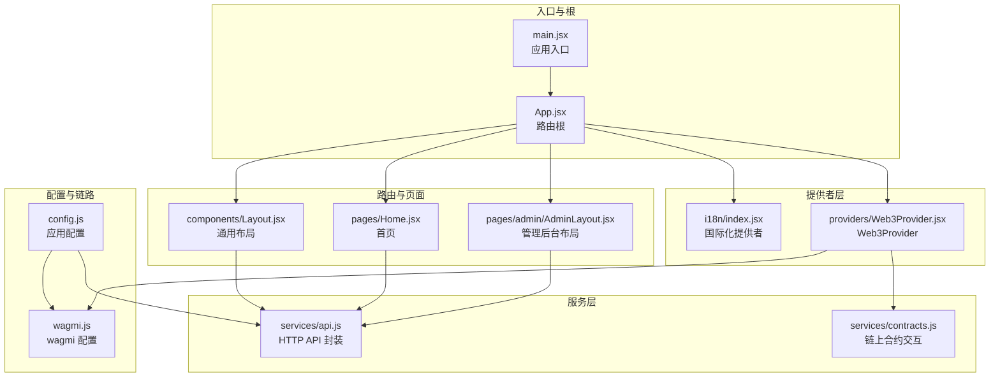
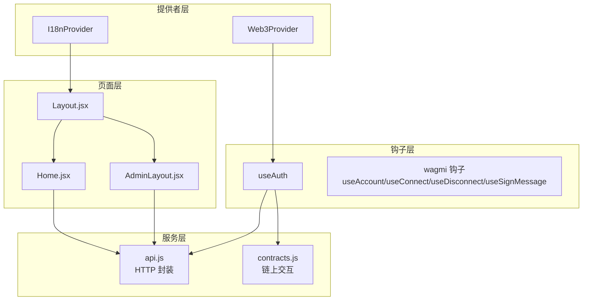
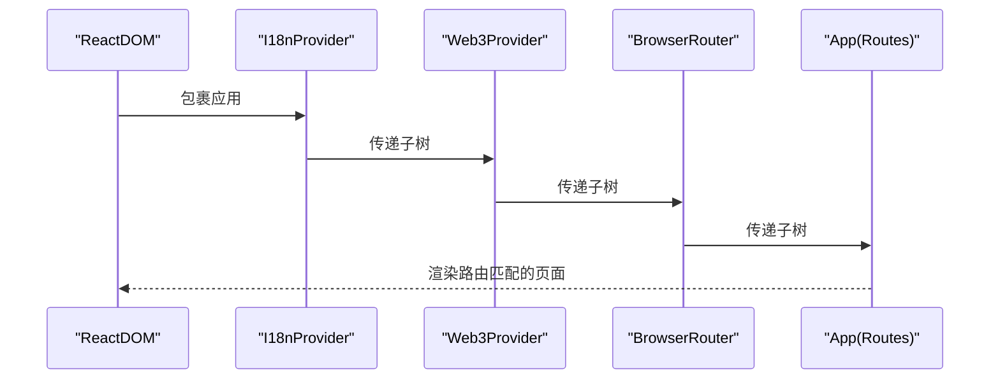
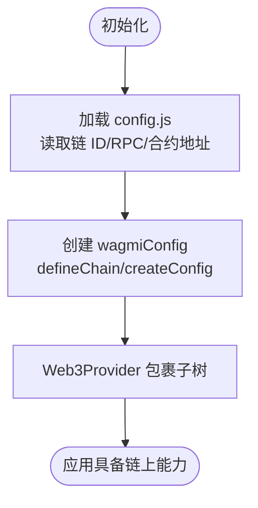
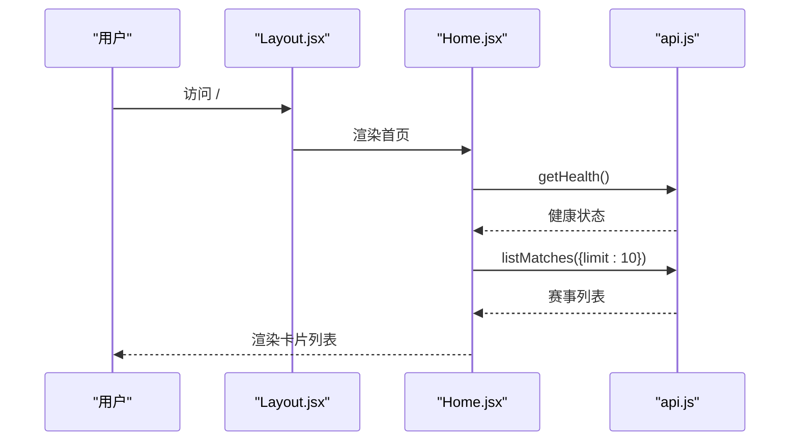
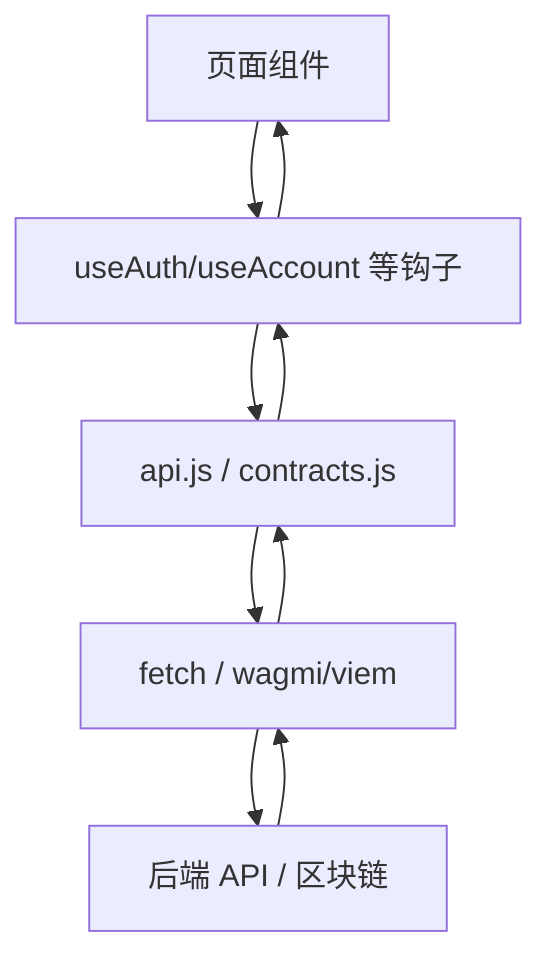
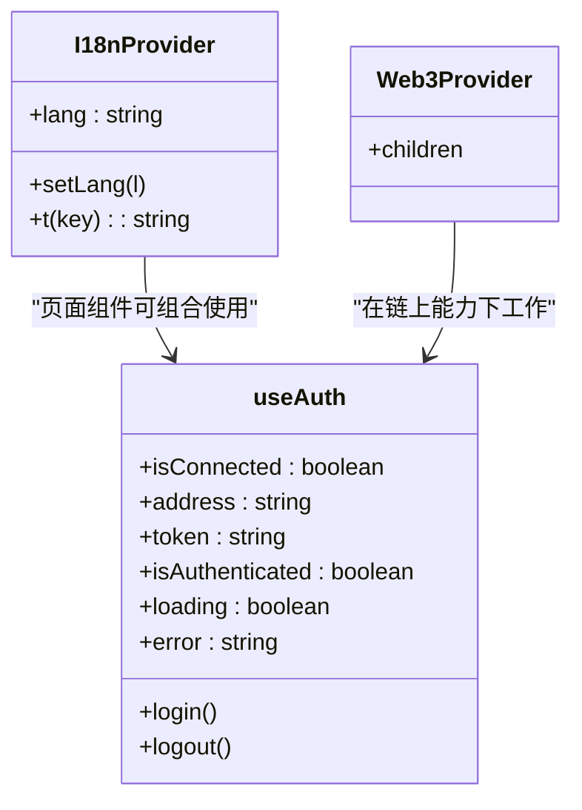
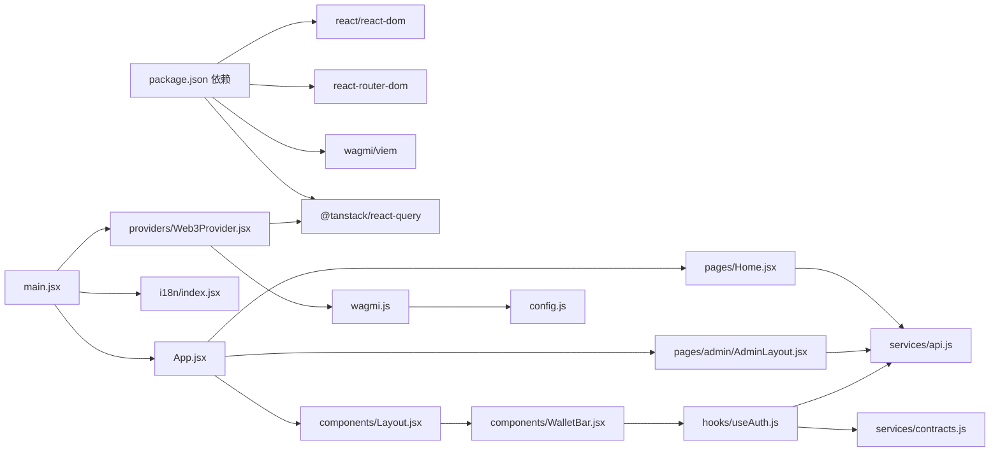

# 架构概览

<cite>
**本文引用的文件**
- [package.json](file://package.json)
- [main.jsx](file://src/main.jsx)
- [App.jsx](file://src/App.jsx)
- [Web3Provider.jsx](file://src/providers/Web3Provider.jsx)
- [wagmi.js](file://src/wagmi.js)
- [config.js](file://src/config.js)
- [Layout.jsx](file://src/components/Layout.jsx)
- [WalletBar.jsx](file://src/components/WalletBar.jsx)
- [api.js](file://src/services/api.js)
- [contracts.js](file://src/services/contracts.js)
- [useAuth.js](file://src/hooks/useAuth.js)
- [index.jsx](file://src/i18n/index.jsx)
- [Home.jsx](file://src/pages/Home.jsx)
- [AdminLayout.jsx](file://src/pages/admin/AdminLayout.jsx)
</cite>

## 目录
1. [引言](#引言)
2. [项目结构](#项目结构)
3. [核心组件](#核心组件)
4. [架构总览](#架构总览)
5. [详细组件分析](#详细组件分析)
6. [依赖分析](#依赖分析)
7. [性能考虑](#性能考虑)
8. [故障排查指南](#故障排查指南)
9. [结论](#结论)

## 引言
本文件面向 PredictionDID 前端项目，系统性阐述基于 React 18.3.1 的组件化架构设计，重点覆盖应用入口点、路由配置、Web3Provider 集成、服务层模式、提供者模式与钩子模式的设计理念，并说明系统边界划分与组件间通信机制。文档兼顾初学者的易理解性与资深工程师的深度需求。

## 项目结构
项目采用“按功能域分层 + 组件化”的组织方式：
- 入口与根组件：src/main.jsx、src/App.jsx
- 提供者层：src/providers/Web3Provider.jsx、src/i18n/index.jsx
- 路由与页面：src/pages/*、src/components/*
- 服务层：src/services/api.js、src/services/contracts.js
- 配置与链路：src/config.js、src/wagmi.js
- 自定义钩子：src/hooks/useAuth.js

图表来源
- [main.jsx](file://src/main.jsx#L17-L32)
- [App.jsx](file://src/App.jsx#L31-L66)
- [Web3Provider.jsx](file://src/providers/Web3Provider.jsx#L16-L24)
- [wagmi.js](file://src/wagmi.js#L26-L36)
- [config.js](file://src/config.js#L7-L22)
- [Layout.jsx](file://src/components/Layout.jsx#L14-L68)
- [Home.jsx](file://src/pages/Home.jsx#L12-L82)
- [AdminLayout.jsx](file://src/pages/admin/AdminLayout.jsx#L8-L32)
- [api.js](file://src/services/api.js#L29-L55)
- [contracts.js](file://src/services/contracts.js#L43-L50)

章节来源
- [package.json](file://package.json#L12-L28)
- [main.jsx](file://src/main.jsx#L1-L33)
- [App.jsx](file://src/App.jsx#L1-L67)

## 核心组件
- 应用入口与提供者装配：在入口文件中按顺序装配国际化提供者、Web3Provider、BrowserRouter 与根组件，形成“自上而下”的能力注入。
- 路由根组件：集中定义所有页面路由与嵌套路由，统一承载通用布局与合规包裹层。
- Web3Provider：聚合 wagmi 与 React Query，为全站提供区块链交互与数据缓存能力。
- 布局与导航：通用布局组件负责导航、语言切换与钱包栏展示，作为页面级组件的父容器。
- 服务层：将 HTTP API 与链上合约交互抽象为独立模块，便于复用与测试。
- 自定义钩子：useAuth 将钱包登录、SIWE 认证、令牌管理与 DID 绑定逻辑封装为可复用能力。

章节来源
- [main.jsx](file://src/main.jsx#L17-L32)
- [App.jsx](file://src/App.jsx#L31-L66)
- [Web3Provider.jsx](file://src/providers/Web3Provider.jsx#L16-L24)
- [Layout.jsx](file://src/components/Layout.jsx#L14-L68)
- [api.js](file://src/services/api.js#L29-L55)
- [contracts.js](file://src/services/contracts.js#L43-L50)
- [useAuth.js](file://src/hooks/useAuth.js#L16-L109)

## 架构总览
系统采用“提供者 + 钩子 + 服务层”的分层架构：
- 提供者层：I18nProvider、Web3Provider 为应用注入语言与链上能力。
- 钩子层：useAuth、useAccount 等将底层能力封装为可组合的业务能力。
- 服务层：api.js 与 contracts.js 分别承担后端 API 与链上交互职责。
- 页面层：Home、AdminLayout 等页面组件通过钩子与服务层完成数据获取与业务操作。
- 路由层：App.jsx 统一编排页面与嵌套路由，配合 Layout.jsx 实现通用 UI。

图表来源
- [index.jsx](file://src/i18n/index.jsx#L49-L66)
- [Web3Provider.jsx](file://src/providers/Web3Provider.jsx#L16-L24)
- [useAuth.js](file://src/hooks/useAuth.js#L16-L109)
- [api.js](file://src/services/api.js#L29-L55)
- [contracts.js](file://src/services/contracts.js#L43-L50)
- [Home.jsx](file://src/pages/Home.jsx#L12-L82)
- [AdminLayout.jsx](file://src/pages/admin/AdminLayout.jsx#L8-L32)
- [Layout.jsx](file://src/components/Layout.jsx#L14-L68)

## 详细组件分析

### 应用入口与根组件
- 入口装配顺序：I18nProvider → Web3Provider → BrowserRouter → App，确保子树具备国际化与链上能力。
- 根组件 App：集中定义路由表，包含通用布局与合规包裹层；内嵌管理后台嵌套路由，实现权限与导航分离。

图表来源
- [main.jsx](file://src/main.jsx#L17-L32)
- [App.jsx](file://src/App.jsx#L31-L66)

章节来源
- [main.jsx](file://src/main.jsx#L17-L32)
- [App.jsx](file://src/App.jsx#L31-L66)

### Web3Provider 与 wagmi 集成
- Web3Provider：聚合 wagmi 与 React Query，向子树提供区块链交互与数据缓存能力。
- wagmi 配置：定义本地链、连接器与传输层，集中管理链 ID、RPC 与连接策略。
- 配置来源：config.js 从环境变量读取链 ID、合约地址与 SIWE 域名等，保证部署灵活性。

图表来源
- [Web3Provider.jsx](file://src/providers/Web3Provider.jsx#L16-L24)
- [wagmi.js](file://src/wagmi.js#L11-L36)
- [config.js](file://src/config.js#L7-L22)

章节来源
- [Web3Provider.jsx](file://src/providers/Web3Provider.jsx#L16-L24)
- [wagmi.js](file://src/wagmi.js#L26-L36)
- [config.js](file://src/config.js#L7-L22)

### 路由与页面层
- 路由根：App.jsx 定义首页、市场、统计、流动性、个人中心、DID、管理后台等路由，并通过 Layout.jsx 提供统一导航与语言切换。
- 页面示例：Home.jsx 展示 API 健康检查与赛事列表加载流程；AdminLayout.jsx 提供管理后台导航与密钥提示。

图表来源
- [Layout.jsx](file://src/components/Layout.jsx#L14-L68)
- [Home.jsx](file://src/pages/Home.jsx#L12-L82)
- [api.js](file://src/services/api.js#L58-L91)

章节来源
- [App.jsx](file://src/App.jsx#L31-L66)
- [Layout.jsx](file://src/components/Layout.jsx#L14-L68)
- [Home.jsx](file://src/pages/Home.jsx#L12-L82)

### 服务层模式：API 与合约交互
- API 封装：统一请求头、鉴权、错误处理与参数序列化，暴露 getHealth、listMatches、getMarket、siweAuth、bindDid、admin* 等方法。
- 合约交互：封装 viem 金额解析/格式化与 wagmi 读写/等待交易回执，提供 approve、buy/buyV3/buyMulti、claim、addLiquidityV3、readPoolStateV3、readMarketStatus 等。

图表来源
- [api.js](file://src/services/api.js#L29-L55)
- [contracts.js](file://src/services/contracts.js#L43-L50)
- [useAuth.js](file://src/hooks/useAuth.js#L16-L109)

章节来源
- [api.js](file://src/services/api.js#L29-L55)
- [contracts.js](file://src/services/contracts.js#L43-L50)

### 提供者模式与钩子模式
- 提供者模式：I18nProvider 管理语言状态与翻译函数；Web3Provider 聚合 wagmi 与 React Query。
- 钩子模式：useAuth 将钱包登录、SIWE 认证、令牌管理与 DID 绑定封装为可复用钩子；页面组件通过 useI18n、useAccount 等钩子获取状态与动作。

图表来源
- [index.jsx](file://src/i18n/index.jsx#L49-L79)
- [Web3Provider.jsx](file://src/providers/Web3Provider.jsx#L16-L24)
- [useAuth.js](file://src/hooks/useAuth.js#L16-L109)

章节来源
- [index.jsx](file://src/i18n/index.jsx#L49-L79)
- [Web3Provider.jsx](file://src/providers/Web3Provider.jsx#L16-L24)
- [useAuth.js](file://src/hooks/useAuth.js#L16-L109)

### 组件间通信机制
- 上下文通信：I18nProvider 通过 Context 向子树提供翻译函数与语言切换；useI18n 消费上下文。
- 钩子通信：useAuth 与 wagmi 钩子协作，向上提供认证状态与动作，向下被 WalletBar 等组件消费。
- 路由通信：Layout.jsx 作为页面父组件，通过 Outlet 渲染子路由页面；导航通过 NavLink 实现页面跳转。

章节来源
- [index.jsx](file://src/i18n/index.jsx#L49-L79)
- [Layout.jsx](file://src/components/Layout.jsx#L14-L68)
- [WalletBar.jsx](file://src/components/WalletBar.jsx#L10-L53)

## 依赖分析
- React 生态：React 18.3.1、react-router-dom 6.x、wagmi 2.x、viem 2.x、@tanstack/react-query 5.x。
- 项目内部依赖：main.jsx 依赖 providers、i18n、App；App.jsx 依赖 Layout 与各页面；页面组件依赖 services 与 hooks；Web3Provider 依赖 wagmi 配置与 React Query。

图表来源
- [package.json](file://package.json#L12-L28)
- [main.jsx](file://src/main.jsx#L1-L33)
- [App.jsx](file://src/App.jsx#L1-L67)
- [Web3Provider.jsx](file://src/providers/Web3Provider.jsx#L1-L25)
- [wagmi.js](file://src/wagmi.js#L1-L37)
- [config.js](file://src/config.js#L1-L23)
- [Layout.jsx](file://src/components/Layout.jsx#L1-L69)
- [WalletBar.jsx](file://src/components/WalletBar.jsx#L1-L54)
- [Home.jsx](file://src/pages/Home.jsx#L1-L83)
- [AdminLayout.jsx](file://src/pages/admin/AdminLayout.jsx#L1-L33)
- [api.js](file://src/services/api.js#L1-L187)
- [contracts.js](file://src/services/contracts.js#L1-L214)
- [useAuth.js](file://src/hooks/useAuth.js#L1-L110)

章节来源
- [package.json](file://package.json#L12-L28)

## 性能考虑
- 数据缓存：React Query 提供请求缓存、重试与失效策略，减少重复网络请求。
- 批量读取：合约状态读取采用 Promise.all 并行调用，降低链上往返延迟。
- 本地状态：国际化与认证状态通过本地存储与 React 状态管理，避免频繁网络请求。
- 路由懒加载：建议对大型页面组件引入动态导入以优化首屏加载。

## 故障排查指南
- 链上交互失败：检查 wagmi 配置链 ID 与 RPC 地址，确认钱包网络与应用一致；查看交易哈希与回执等待结果。
- 认证异常：确认 SIWE 域名与 URI 配置正确；检查本地存储 JWT 令牌是否存在；核对后端健康与就绪状态。
- API 请求错误：检查后端基础地址与路径拼接；关注 4xx/5xx 错误与响应体中的错误字段。
- 国际化无效：确认 I18nProvider 包裹范围；检查本地存储语言键值；验证 useI18n 使用位置。

章节来源
- [wagmi.js](file://src/wagmi.js#L11-L36)
- [config.js](file://src/config.js#L7-L22)
- [api.js](file://src/services/api.js#L29-L55)
- [index.jsx](file://src/i18n/index.jsx#L49-L79)
- [useAuth.js](file://src/hooks/useAuth.js#L28-L80)

## 结论
本项目以 React 18.3.1 为基础，采用提供者 + 钩子 + 服务层的分层架构，结合 wagmi 与 React Query 实现链上交互与数据缓存，通过统一的路由与布局体系实现清晰的页面边界与良好的用户体验。该架构既满足初学者的学习曲线，也为复杂业务提供了可扩展的组织方式与可维护的代码结构。