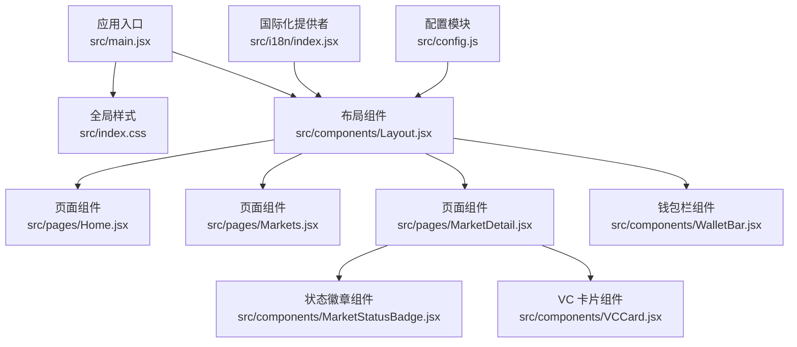
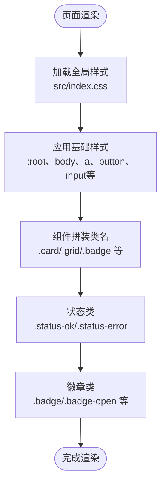
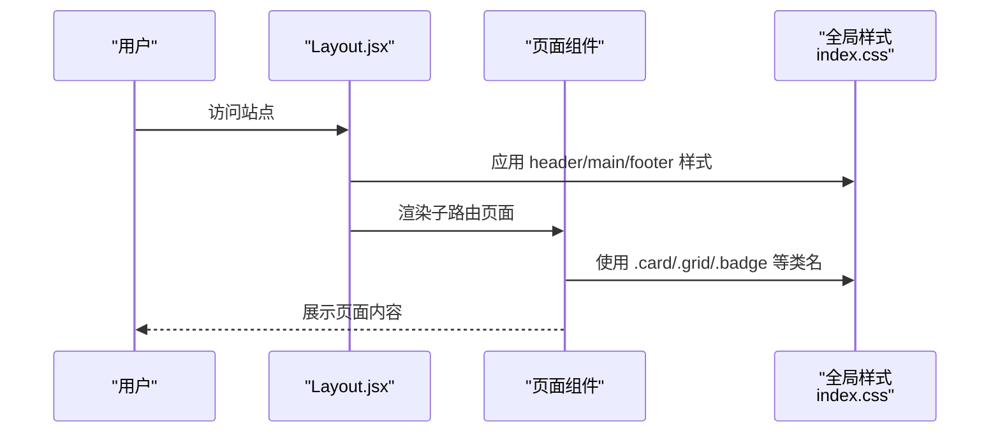
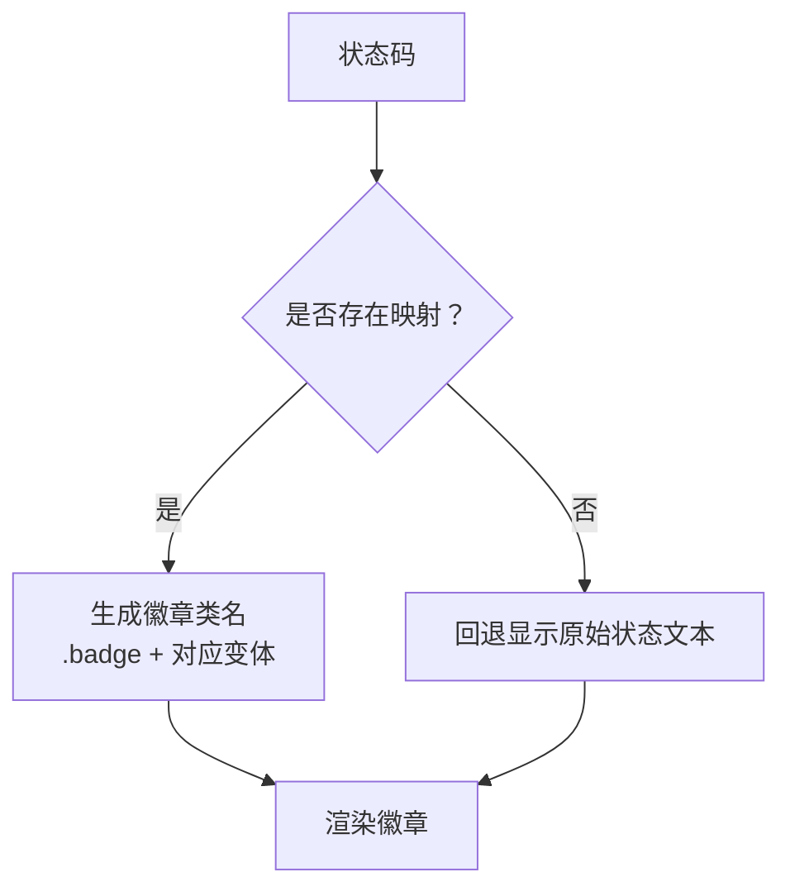
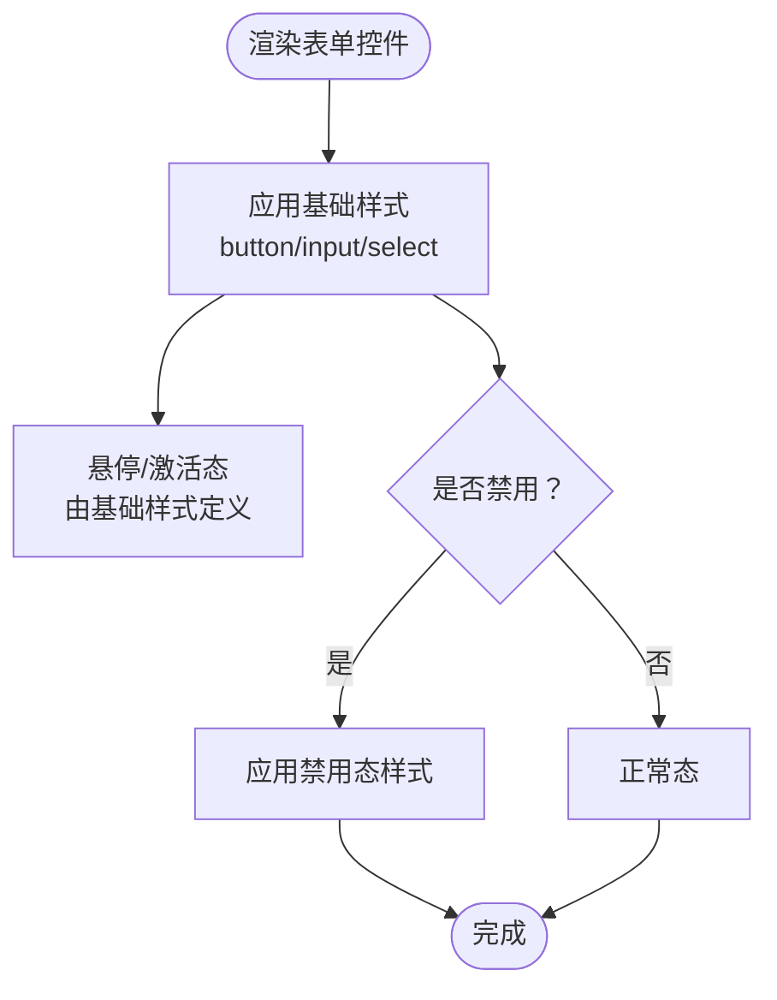
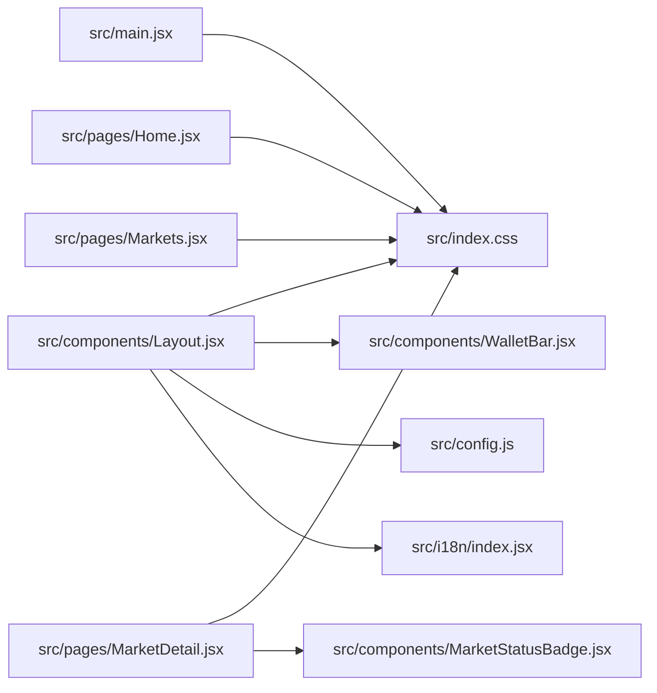

# 样式和主题

<cite>
**本文引用的文件**
- [src/index.css](file://src/index.css)
- [src/main.jsx](file://src/main.jsx)
- [src/components/Layout.jsx](file://src/components/Layout.jsx)
- [src/App.jsx](file://src/App.jsx)
- [src/pages/Home.jsx](file://src/pages/Home.jsx)
- [src/pages/Markets.jsx](file://src/pages/Markets.jsx)
- [src/pages/MarketDetail.jsx](file://src/pages/MarketDetail.jsx)
- [src/components/MarketStatusBadge.jsx](file://src/components/MarketStatusBadge.jsx)
- [src/components/VCCard.jsx](file://src/components/VCCard.jsx)
- [src/components/WalletBar.jsx](file://src/components/WalletBar.jsx)
- [src/i18n/index.jsx](file://src/i18n/index.jsx)
- [src/config.js](file://src/config.js)
- [package.json](file://package.json)
</cite>

## 目录
1. [简介](#简介)
2. [项目结构](#项目结构)
3. [核心组件](#核心组件)
4. [架构总览](#架构总览)
5. [详细组件分析](#详细组件分析)
6. [依赖分析](#依赖分析)
7. [性能考虑](#性能考虑)
8. [故障排查指南](#故障排查指南)
9. [结论](#结论)
10. [附录](#附录)

## 简介
本文件聚焦于前端项目的样式与主题系统，围绕以下目标展开：
- CSS 架构设计与组织方式
- 组件样式规范与命名约定
- 响应式设计与布局策略
- 主题变量系统、颜色方案、字体与间距标准
- 样式继承关系、覆盖规则与自定义主题实现路径
- 样式开发最佳实践与性能优化建议

当前仓库采用原生 CSS 与原子化类名相结合的方式，通过基础样式文件统一全局外观，再由各页面与组件通过类名组合实现一致的视觉与交互体验。

## 项目结构
样式与主题系统主要分布在以下位置：
- 全局样式入口：src/index.css
- 应用启动入口：src/main.jsx（引入全局样式）
- 布局与页面：src/components/Layout.jsx、src/App.jsx、src/pages/*
- 组件级样式：各组件通过类名复用全局样式（如 card、grid、badge 等）
- 主题与状态：通过类名状态类（如 status-ok、status-error）表达状态色

图表来源
- [src/main.jsx](file://src/main.jsx#L1-L33)
- [src/index.css](file://src/index.css#L1-L134)
- [src/components/Layout.jsx](file://src/components/Layout.jsx#L1-L69)
- [src/App.jsx](file://src/App.jsx#L1-L67)
- [src/pages/Home.jsx](file://src/pages/Home.jsx#L1-L83)
- [src/pages/Markets.jsx](file://src/pages/Markets.jsx#L1-L56)
- [src/pages/MarketDetail.jsx](file://src/pages/MarketDetail.jsx#L1-L185)
- [src/components/MarketStatusBadge.jsx](file://src/components/MarketStatusBadge.jsx#L1-L24)
- [src/components/VCCard.jsx](file://src/components/VCCard.jsx#L1-L35)
- [src/components/WalletBar.jsx](file://src/components/WalletBar.jsx#L1-L54)
- [src/i18n/index.jsx](file://src/i18n/index.jsx#L1-L80)
- [src/config.js](file://src/config.js#L1-L23)

章节来源
- [src/main.jsx](file://src/main.jsx#L1-L33)
- [src/index.css](file://src/index.css#L1-L134)

## 核心组件
- 布局与容器
  - 布局容器类：.layout、.header、.main、.footer
  - 卡片与网格：.card、.grid
  - 链接卡片：.link-card
- 状态与徽章
  - 状态文本：.status-ok、.status-error
  - 徽章：.badge 及其变体 .badge-open、.badge-resolved、.badge-void、.badge-pending
- 表单与交互
  - 按钮：button 及禁用态
  - 输入：input、select
- 链接与品牌
  - 品牌：.brand
  - 导航链接：.header 内的 a 及 .active

章节来源
- [src/index.css](file://src/index.css#L25-L134)
- [src/components/Layout.jsx](file://src/components/Layout.jsx#L18-L66)
- [src/pages/Home.jsx](file://src/pages/Home.jsx#L59-L78)
- [src/pages/Markets.jsx](file://src/pages/Markets.jsx#L36-L52)
- [src/pages/MarketDetail.jsx](file://src/pages/MarketDetail.jsx#L154-L178)
- [src/components/MarketStatusBadge.jsx](file://src/components/MarketStatusBadge.jsx#L18-L23)

## 架构总览
样式体系采用“全局基础 + 组件类名”的组合模式：
- 全局基础：在 :root 定义字体族、行高、基础颜色；在 body、a、button、input/select 等基础元素上设定默认样式与交互行为
- 组件样式：通过语义化类名（如 .card、.grid、.badge）在组件 JSX 中直接复用，减少重复样式编写
- 状态样式：通过状态类（.status-ok、.status-error）与徽章类（.badge-*）表达不同业务状态的颜色与语义

图表来源
- [src/index.css](file://src/index.css#L1-L134)
- [src/pages/Home.jsx](file://src/pages/Home.jsx#L59-L78)
- [src/pages/Markets.jsx](file://src/pages/Markets.jsx#L36-L52)
- [src/pages/MarketDetail.jsx](file://src/pages/MarketDetail.jsx#L154-L178)
- [src/components/MarketStatusBadge.jsx](file://src/components/MarketStatusBadge.jsx#L18-L23)

## 详细组件分析

### 布局与页面样式
- 布局容器
  - .layout：全高布局，纵向排列
  - .header：深色背景、浅色文字、品牌区右侧留白
  - .main：主内容区，最大宽度、居中、内边距
  - .footer：细文字体、浅色边框
- 页面组件
  - Markets.jsx 与 Home.jsx 使用 .grid 与 .card 实现卡片网格与卡片样式
  - MarketDetail.jsx 使用 .card 包裹下注表单，结合徽章与状态类展示市场状态

图表来源
- [src/components/Layout.jsx](file://src/components/Layout.jsx#L18-L66)
- [src/pages/Home.jsx](file://src/pages/Home.jsx#L59-L78)
- [src/pages/Markets.jsx](file://src/pages/Markets.jsx#L36-L52)
- [src/pages/MarketDetail.jsx](file://src/pages/MarketDetail.jsx#L154-L178)
- [src/index.css](file://src/index.css#L25-L134)

章节来源
- [src/components/Layout.jsx](file://src/components/Layout.jsx#L18-L66)
- [src/pages/Home.jsx](file://src/pages/Home.jsx#L59-L78)
- [src/pages/Markets.jsx](file://src/pages/Markets.jsx#L36-L52)
- [src/pages/MarketDetail.jsx](file://src/pages/MarketDetail.jsx#L154-L178)
- [src/index.css](file://src/index.css#L25-L134)

### 状态与徽章样式
- 状态文本：.status-ok（成功）、.status-error（错误）
- 徽章：.badge 及其变体 .badge-open、.badge-resolved、.badge-void、.badge-pending
- 组件使用：MarketStatusBadge.jsx 根据状态映射到对应徽章类；Home.jsx 与 MarketDetail.jsx 使用状态类展示 API 连接状态与错误信息

图表来源
- [src/components/MarketStatusBadge.jsx](file://src/components/MarketStatusBadge.jsx#L18-L23)
- [src/pages/Home.jsx](file://src/pages/Home.jsx#L50-L52)
- [src/pages/MarketDetail.jsx](file://src/pages/MarketDetail.jsx#L147-L151)

章节来源
- [src/components/MarketStatusBadge.jsx](file://src/components/MarketStatusBadge.jsx#L1-L24)
- [src/pages/Home.jsx](file://src/pages/Home.jsx#L50-L52)
- [src/pages/MarketDetail.jsx](file://src/pages/MarketDetail.jsx#L147-L151)

### 表单与交互样式
- 按钮：默认圆角、边框、白色背景；禁用态降低透明度并改变光标
- 输入与选择：统一内边距、边框与圆角
- 组件使用：WalletBar.jsx 与 MarketDetail.jsx 的按钮与输入框均遵循上述基础样式

图表来源
- [src/index.css](file://src/index.css#L115-L134)
- [src/components/WalletBar.jsx](file://src/components/WalletBar.jsx#L24-L27)
- [src/pages/MarketDetail.jsx](file://src/pages/MarketDetail.jsx#L169-L177)

章节来源
- [src/index.css](file://src/index.css#L115-L134)
- [src/components/WalletBar.jsx](file://src/components/WalletBar.jsx#L24-L27)
- [src/pages/MarketDetail.jsx](file://src/pages/MarketDetail.jsx#L169-L177)

### 字体、颜色与间距标准
- 字体与行高：:root 定义系统字体族与行高
- 文字与背景：:root 定义主体文字颜色与背景色
- 链接：a 默认蓝色，悬停下划线
- 卡片与边框：.card 使用白色背景与浅灰边框，.header 使用深色背景与浅色文字
- 间距：.main 使用内边距与最大宽度；.grid 使用 gap 控制网格间距

章节来源
- [src/index.css](file://src/index.css#L1-L134)

### 响应式设计实现
- 网格布局：.grid 使用 repeat(auto-fill, minmax(260px, 1fr)) 实现最小列宽 260px 的自动填充网格，适配不同屏幕宽度
- 容器宽度：.main 设置最大宽度并在大屏居中，小屏自适应
- 间距：通过统一的内边距与 gap 实现一致的呼吸感

章节来源
- [src/index.css](file://src/index.css#L85-L89)
- [src/index.css](file://src/index.css#L54-L60)

### 主题变量系统与自定义主题
当前仓库未提供 CSS 自定义属性（CSS 变量）或主题切换逻辑。主题变量系统可通过以下方式扩展：
- 在 :root 中定义主题变量（如 --color-primary、--color-surface、--spacing-unit），在组件类名中引用
- 通过 JavaScript 动态切换 :root 的变量值，实现明暗主题或品牌主题切换
- 为常用颜色与间距建立命名常量，避免硬编码颜色值与像素值

说明：以上为扩展建议，当前代码库未实现该功能。

章节来源
- [src/index.css](file://src/index.css#L1-L6)

## 依赖分析
- 样式依赖
  - src/main.jsx 引入 src/index.css，确保全局样式在应用启动时加载
- 组件依赖
  - Layout.jsx 使用 NavLink、Outlet、WalletBar 等组件，依赖全局样式提供的基础类名
  - MarketDetail.jsx 使用 MarketStatusBadge、TxStatus 等组件，依赖徽章与状态类名
- 国际化与配置
  - i18n 提供的语言切换影响导航与页脚文案，间接影响布局与内容长度，从而影响视觉呈现

图表来源
- [src/main.jsx](file://src/main.jsx#L1-L33)
- [src/index.css](file://src/index.css#L1-L134)
- [src/components/Layout.jsx](file://src/components/Layout.jsx#L1-L69)
- [src/pages/Home.jsx](file://src/pages/Home.jsx#L1-L83)
- [src/pages/Markets.jsx](file://src/pages/Markets.jsx#L1-L56)
- [src/pages/MarketDetail.jsx](file://src/pages/MarketDetail.jsx#L1-L185)
- [src/components/MarketStatusBadge.jsx](file://src/components/MarketStatusBadge.jsx#L1-L24)
- [src/components/WalletBar.jsx](file://src/components/WalletBar.jsx#L1-L54)
- [src/i18n/index.jsx](file://src/i18n/index.jsx#L1-L80)
- [src/config.js](file://src/config.js#L1-L23)

章节来源
- [src/main.jsx](file://src/main.jsx#L1-L33)
- [src/components/Layout.jsx](file://src/components/Layout.jsx#L1-L69)
- [src/pages/MarketDetail.jsx](file://src/pages/MarketDetail.jsx#L1-L185)

## 性能考虑
- 样式体积控制
  - 保持基础样式集中管理，避免在组件内部重复定义相同规则
  - 使用原子化类名减少选择器复杂度，提升渲染效率
- 重绘与重排
  - 避免频繁修改会触发回流的属性（如 width、height、top、left 等）
  - 使用 transform 与 opacity 实现动画效果
- 渲染路径
  - 将高频交互元素（按钮、输入框）置于独立容器中，减少父级样式对它们的影响
- 打包与缓存
  - 通过构建工具（Vite）进行样式打包与压缩，确保生产环境样式体积最小化

## 故障排查指南
- 样式未生效
  - 确认 src/main.jsx 已正确引入 src/index.css
  - 检查类名拼写与大小写，确保与全局样式一致
- 状态样式异常
  - 检查状态类（.status-ok、.status-error）是否按需添加到元素
  - 确认徽章类（.badge-*）与状态映射一致
- 响应式异常
  - 检查 .grid 的最小列宽与容器宽度设置
  - 确保 .main 的最大宽度与居中逻辑在目标设备上表现符合预期
- 表单交互异常
  - 检查按钮禁用态样式是否正确应用
  - 确认输入框与选择框的基础样式未被局部样式覆盖

章节来源
- [src/main.jsx](file://src/main.jsx#L14-L14)
- [src/index.css](file://src/index.css#L77-L134)
- [src/components/MarketStatusBadge.jsx](file://src/components/MarketStatusBadge.jsx#L18-L23)
- [src/pages/MarketDetail.jsx](file://src/pages/MarketDetail.jsx#L169-L177)

## 结论
本项目的样式与主题系统以“全局基础 + 组件类名”为核心，通过少量基础样式与语义化类名实现了统一的视觉与交互体验。当前未实现 CSS 变量与主题切换机制，但具备良好的扩展空间。建议后续引入主题变量系统与主题切换逻辑，以支持多主题与品牌定制需求；同时保持原子化类名与响应式网格策略，确保在多设备上的稳定表现。

## 附录
- 术语
  - 原子化类名：以单一语义命名的类名，如 .card、.grid、.badge
  - 状态类：用于表达业务状态的颜色与样式，如 .status-ok、.status-error
  - 徽章类：用于展示状态标签的颜色与样式，如 .badge-open、.badge-resolved
- 最佳实践
  - 统一使用全局样式中的基础类名，避免在组件内重复定义
  - 为状态与徽章建立映射表，确保一致性
  - 在响应式布局中优先使用网格与间距变量，减少媒体查询数量
  - 将主题变量集中管理，便于主题切换与品牌定制