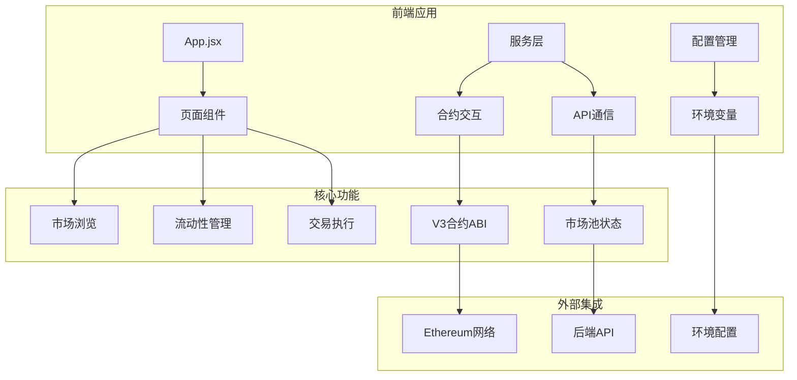
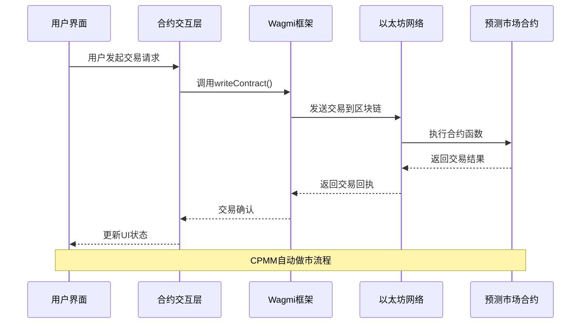
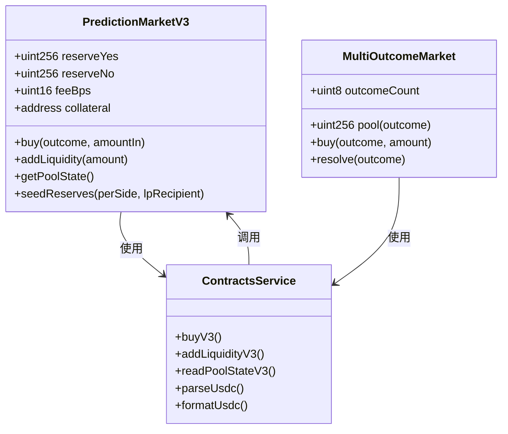
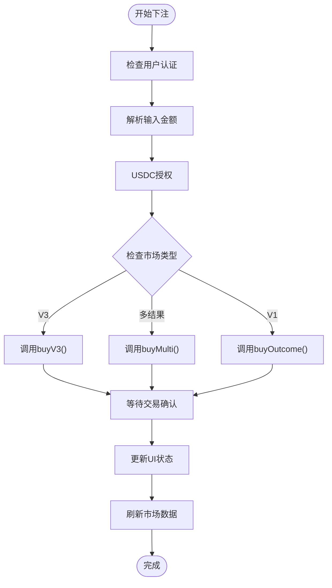
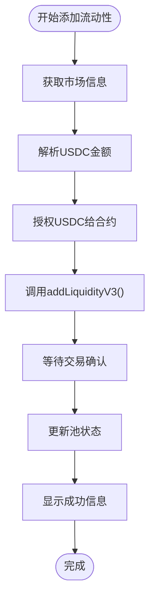
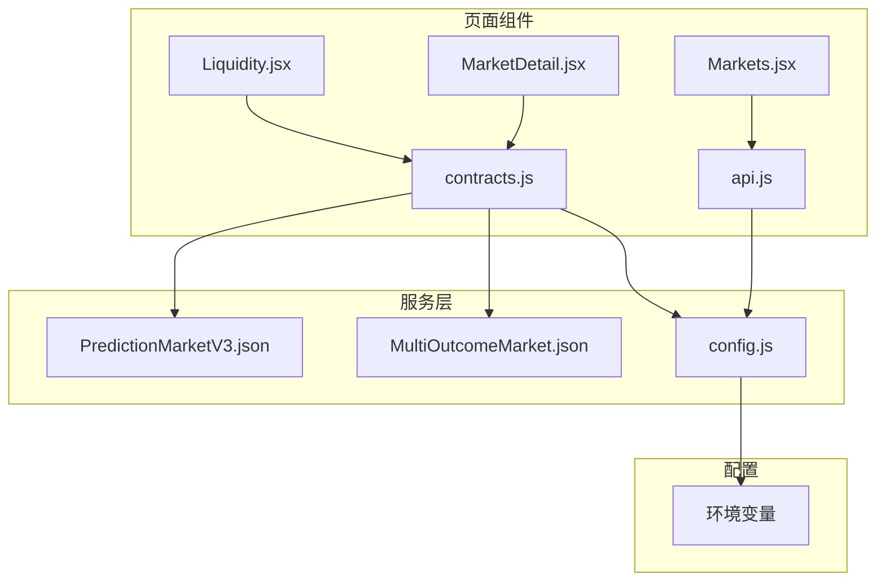

# CPMM定价模型

<cite>
**本文档引用的文件**
- [contracts.js](file://src/services/contracts.js)
- [Liquidity.jsx](file://src/pages/Liquidity.jsx)
- [MarketDetail.jsx](file://src/pages/MarketDetail.jsx)
- [api.js](file://src/services/api.js)
- [PredictionMarketV3.json](file://src/abis/PredictionMarketV3.json)
- [MultiOutcomeMarket.json](file://src/abis/MultiOutcomeMarket.json)
- [config.js](file://src/config.js)
- [package.json](file://package.json)
</cite>

## 目录
1. [简介](#简介)
2. [项目结构](#项目结构)
3. [核心组件](#核心组件)
4. [架构概览](#架构概览)
5. [详细组件分析](#详细组件分析)
6. [依赖关系分析](#依赖关系分析)
7. [性能考虑](#性能考虑)
8. [故障排除指南](#故障排除指南)
9. [结论](#结论)

## 简介

CPMM（常数乘法做市商）定价模型是预测市场中的核心机制，它通过数学公式实现自动做市功能。该模型基于K值恒定原理，通过维护两个储备池（Yes和No）来实现价格发现和流动性提供。

在PredictionDIDSimple项目中，CPMM模型通过V3版本的预测市场合约实现，为用户提供去中心化的预测市场交易和流动性提供功能。

## 项目结构

该项目采用React前端架构，主要包含以下模块：



**图表来源**
- [contracts.js](file://src/services/contracts.js#L1-L214)
- [Liquidity.jsx](file://src/pages/Liquidity.jsx#L1-L117)
- [MarketDetail.jsx](file://src/pages/MarketDetail.jsx#L1-L185)

**章节来源**
- [package.json](file://package.json#L1-L30)
- [config.js](file://src/config.js#L1-L23)

## 核心组件

### 合约交互服务

合约交互服务提供了与预测市场合约的完整接口，包括：

- **金额解析和格式化**：处理USDC代币的小数位转换
- **市场状态读取**：获取市场状态、获胜结果和池金额
- **交易执行**：购买、添加流动性、领取奖励等操作
- **池状态查询**：获取CPMM池的储备量和价格信息

### 页面组件

- **流动性管理页面**：允许用户向V3二元市场注入流动性
- **市场详情页面**：展示市场信息并支持下注操作
- **市场列表页面**：展示所有可用的预测市场

**章节来源**
- [contracts.js](file://src/services/contracts.js#L1-L214)
- [Liquidity.jsx](file://src/pages/Liquidity.jsx#L1-L117)
- [MarketDetail.jsx](file://src/pages/MarketDetail.jsx#L1-L185)

## 架构概览

CPMM系统采用分层架构设计，实现了前后端分离和智能合约集成：



**图表来源**
- [contracts.js](file://src/services/contracts.js#L106-L123)
- [MarketDetail.jsx](file://src/pages/MarketDetail.jsx#L77-L110)

## 详细组件分析

### CPMM数学模型

CPMM的核心在于K值恒定公式，该公式确保了市场的自动做市功能：

#### K值恒定原理

在二元预测市场中，K值恒定公式为：
```
K = reserve_yes × reserve_no
```

其中：
- `reserve_yes`：Yes结果的储备量
- `reserve_no`：No结果的储备量

#### 价格计算公式

市场价格（概率）计算公式：
```
P_yes = reserve_no / (reserve_yes + reserve_no)
P_no = reserve_yes / (reserve_yes + reserve_no)
```

价格以基点（bps）形式表示：
```
price_yes_bps = P_yes × 10000
```

#### 交易费用机制

系统采用费率为`feeBps`的交易费用，费用计算公式：
```
fee_amount = amount_in × (feeBps / 10000)
```

#### 流动性提供者收益

流动性提供者的收益来源于：
1. **交易费用分成**：从每笔交易中获得一定比例的费用
2. **价格变动收益**：通过提供流动性获得的价格差异收益
3. **市场深度**：流动性池的规模越大，提供者承担的风险越低

### V3合约架构

V3版本的预测市场合约提供了完整的CPMM功能：



**图表来源**
- [PredictionMarketV3.json](file://src/abis/PredictionMarketV3.json#L179-L322)
- [MultiOutcomeMarket.json](file://src/abis/MultiOutcomeMarket.json#L125-L141)
- [contracts.js](file://src/services/contracts.js#L106-L176)

### 交易流程分析

#### 下注交易流程



**图表来源**
- [MarketDetail.jsx](file://src/pages/MarketDetail.jsx#L77-L110)
- [contracts.js](file://src/services/contracts.js#L106-L142)

#### 流动性添加流程



**图表来源**
- [Liquidity.jsx](file://src/pages/Liquidity.jsx#L51-L77)
- [contracts.js](file://src/services/contracts.js#L144-L160)

### 市场状态管理

系统支持多种市场状态，每种状态对应不同的操作权限：

| 状态 | 描述 | 可执行操作 |
|------|------|------------|
| OPEN | 市场开放，可下注 | 下注、查看价格 |
| ORACLE_PENDING | 预言机结算中 | 查看状态、等待结算 |
| RESOLVED | 已结算 | 领取奖励、查看结果 |
| VOIDED | 市场作废 | 退款、查看状态 |

**章节来源**
- [MarketDetail.jsx](file://src/pages/MarketDetail.jsx#L117-L118)
- [contracts.js](file://src/services/contracts.js#L178-L213)

## 依赖关系分析

### 外部依赖

项目使用了现代化的前端技术栈：

```mermaid
graph LR
subgraph "核心依赖"
A[React 18.3.1] --> B[用户界面]
C[wagmi 2.14.1] --> D[区块链交互]
E[viem 2.21.54] --> F[金额处理]
G[react-router-dom 6.28.0] --> H[路由管理]
end
subgraph "开发工具"
I[@vitejs/plugin-react] --> J[构建工具]
K[eslint] --> L[代码质量]
end
subgraph "状态管理"
M[@tanstack/react-query] --> N[数据缓存]
end
```

**图表来源**
- [package.json](file://package.json#L12-L29)

### 内部模块依赖



**图表来源**
- [Liquidity.jsx](file://src/pages/Liquidity.jsx#L1-L14)
- [MarketDetail.jsx](file://src/pages/MarketDetail.jsx#L1-L26)
- [api.js](file://src/services/api.js#L1-L10)

**章节来源**
- [package.json](file://package.json#L12-L29)

## 性能考虑

### 交易优化策略

1. **批量读取优化**：使用Promise.all并行获取多个合约状态
2. **金额精度处理**：通过parseUnits和formatUnits确保精度
3. **缓存机制**：利用React Query进行数据缓存
4. **错误处理**：完善的异常捕获和用户反馈机制

### 网络优化

- **Gas费用优化**：合理设置交易参数，避免不必要的gas消耗
- **区块确认时间**：根据网络拥堵情况调整交易策略
- **重试机制**：实现智能重试逻辑，提高交易成功率

## 故障排除指南

### 常见问题及解决方案

#### 交易失败
- **原因**：合约调用失败、网络问题、余额不足
- **解决方案**：检查钱包连接状态、确认USDC余额、重新尝试交易

#### 价格显示异常
- **原因**：API延迟、数据同步问题
- **解决方案**：手动刷新页面、检查网络连接

#### 流动性添加失败
- **原因**：授权未完成、金额解析错误
- **解决方案**：先执行授权操作、确认输入金额格式正确

**章节来源**
- [Liquidity.jsx](file://src/pages/Liquidity.jsx#L73-L76)
- [MarketDetail.jsx](file://src/pages/MarketDetail.jsx#L106-L109)

## 结论

CPMM定价模型通过数学公式实现了去中心化的自动做市功能，为预测市场提供了高效的价格发现机制。PredictionDIDSimple项目展示了该模型在实际应用中的完整实现，包括：

1. **完整的前端界面**：提供直观的用户体验
2. **智能合约集成**：通过V3合约实现高级功能
3. **安全的交易流程**：确保用户资金安全
4. **灵活的市场类型**：支持二元和多结果市场

该系统为预测市场的发展提供了坚实的技术基础，通过持续优化可以进一步提升用户体验和系统性能。