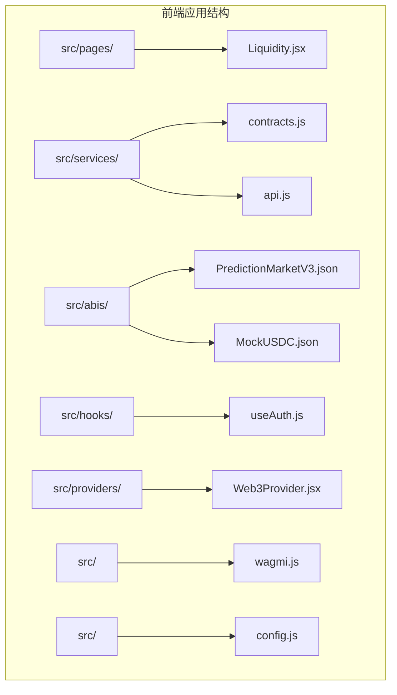
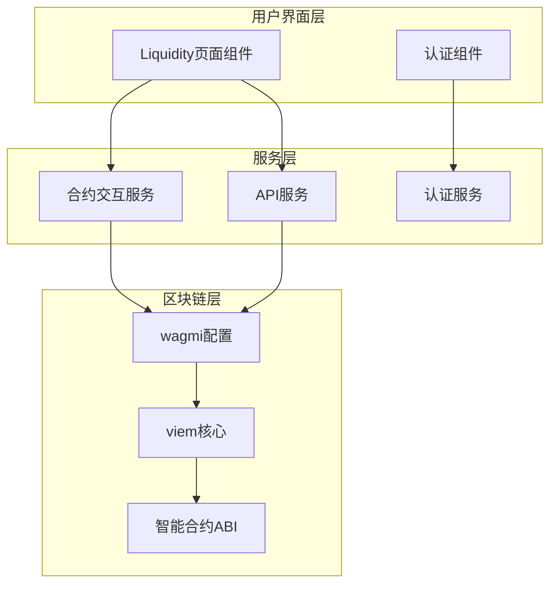
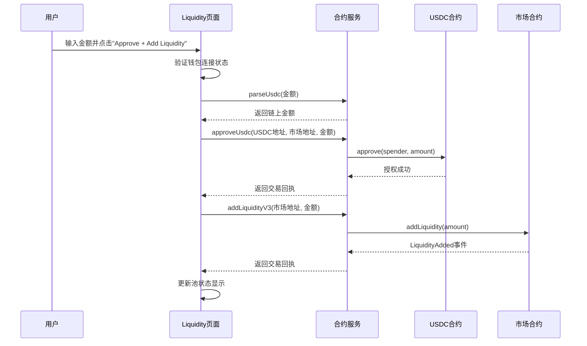
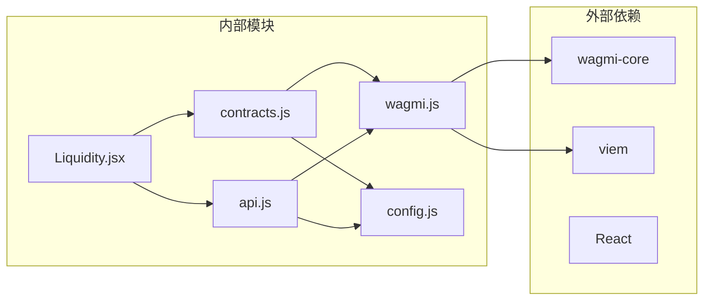

# LP功能实现

<cite>
**本文档引用的文件**
- [Liquidity.jsx](file://src/pages/Liquidity.jsx)
- [contracts.js](file://src/services/contracts.js)
- [PredictionMarketV3.json](file://src/abis/PredictionMarketV3.json)
- [MockUSDC.json](file://src/abis/MockUSDC.json)
- [api.js](file://src/services/api.js)
- [wagmi.js](file://src/wagmi.js)
- [config.js](file://src/config.js)
- [useAuth.js](file://src/hooks/useAuth.js)
</cite>

## 目录
1. [简介](#简介)
2. [项目结构](#项目结构)
3. [核心组件](#核心组件)
4. [架构概览](#架构概览)
5. [详细组件分析](#详细组件分析)
6. [依赖关系分析](#依赖关系分析)
7. [性能考虑](#性能考虑)
8. [故障排除指南](#故障排除指南)
9. [结论](#结论)

## 简介

本文档详细介绍了PredictionDIDSimple前端项目中的LP（流动性提供者）功能实现。该功能允许用户向V3 CPMM（常数乘法做市商）二元预测市场注入流动性，从而获得交易费用收入和市场深度。文档涵盖了完整的流动性添加和移除流程，包括钱包授权、USDC代币批准、以及addLiquidityV3函数的调用过程。

## 项目结构

该项目采用React + wagmi + viem的技术栈构建，主要文件组织如下：



**图表来源**
- [Liquidity.jsx](file://src/pages/Liquidity.jsx#L1-L117)
- [contracts.js](file://src/services/contracts.js#L1-L214)

**章节来源**
- [Liquidity.jsx](file://src/pages/Liquidity.jsx#L1-L117)
- [contracts.js](file://src/services/contracts.js#L1-L214)

## 核心组件

### 流动性管理页面组件

Liquidity页面组件是LP功能的核心入口，提供了完整的用户界面和业务逻辑：

- **市场选择功能**：自动加载所有开放状态的预测市场
- **池状态显示**：实时显示Yes/No池的储备量和价格
- **金额输入控制**：支持mUSDC（微USDC）输入
- **交易状态管理**：提供pending、ok、错误状态反馈

### 合约交互服务

contracts.js模块封装了所有与智能合约的交互逻辑：

- **USDC代币操作**：余额查询、授权、转账
- **市场操作**：购买、流动性添加、流动性移除
- **状态查询**：市场状态、池状态、用户余额

**章节来源**
- [Liquidity.jsx](file://src/pages/Liquidity.jsx#L15-L117)
- [contracts.js](file://src/services/contracts.js#L1-L214)

## 架构概览

系统采用分层架构设计，确保职责分离和代码可维护性：



**图表来源**
- [Liquidity.jsx](file://src/pages/Liquidity.jsx#L1-L117)
- [contracts.js](file://src/services/contracts.js#L1-L214)
- [wagmi.js](file://src/wagmi.js#L1-L37)

## 详细组件分析

### 流动性添加流程

流动性添加是LP功能的核心流程，包含以下步骤：

#### 1. 钱包连接验证
组件首先检查用户钱包是否已连接，这是所有后续操作的前提条件。

#### 2. 市场数据加载
组件自动加载所有开放状态的预测市场，并默认选择第一个市场作为初始选项。

#### 3. 池状态监控
当用户切换市场时，系统会自动获取并显示当前市场的池状态信息。

#### 4. 金额处理
用户输入的金额通过`parseUsdc`函数转换为链上整数格式（包含6位小数）。

#### 5. USDC授权流程
调用`approveUsdc`函数向市场合约授权指定数量的USDC代币。

#### 6. 流动性添加
调用`addLiquidityV3`函数向市场添加流动性，系统会监听相应的事件。



**图表来源**
- [Liquidity.jsx](file://src/pages/Liquidity.jsx#L52-L77)
- [contracts.js](file://src/services/contracts.js#L59-L69)
- [contracts.js](file://src/services/contracts.js#L150-L160)

#### 7. 错误处理和状态管理
系统实现了完善的错误处理机制：
- 交易失败时显示具体的错误信息
- 成功后自动刷新池状态数据
- 提供pending状态指示用户操作进度

**章节来源**
- [Liquidity.jsx](file://src/pages/Liquidity.jsx#L51-L77)
- [contracts.js](file://src/services/contracts.js#L59-L69)
- [contracts.js](file://src/services/contracts.js#L150-L160)

### V3市场类型特殊要求

PredictionMarketV3合约具有以下特殊要求：

#### 1. CPMM定价模型
- 使用常数乘法做市商模型（x*y=k）
- 价格由Yes/No池的储备量决定
- 交易遵循恒定乘积公式

#### 2. 事件驱动的状态更新
- `LiquidityAdded`事件：流动性添加成功
- `LiquidityRemoved`事件：流动性移除成功
- `Bought`事件：市场购买发生

#### 3. 池状态查询
- `getPoolState()`函数返回储备量和价格信息
- `reserveYes`和`reserveNo`分别表示Yes/No池的储备量
- `priceYesBps`表示Yes结果的价格（以基点计）

**章节来源**
- [PredictionMarketV3.json](file://src/abis/PredictionMarketV3.json#L137-L158)
- [PredictionMarketV3.json](file://src/abis/PredictionMarketV3.json#L302-L322)

### USDC代币授权机制

系统使用标准的ERC20授权模式：

#### 1. 授权流程
- 用户需要先授权USDC代币给市场合约
- 授权额度通常设置为要注入的金额
- 授权后市场合约可以代表用户转移代币

#### 2. 金额精度处理
- USDC具有6位小数精度
- 系统使用`parseUnits`和`formatUnits`确保精度正确
- 所有用户输入都会转换为链上整数格式

**章节来源**
- [contracts.js](file://src/services/contracts.js#L59-L69)
- [MockUSDC.json](file://src/abis/MockUSDC.json#L182-L191)

### addLiquidityV3函数实现

addLiquidityV3函数是V3市场流动性添加的核心实现：

#### 1. 函数签名
```javascript
export async function addLiquidityV3(marketAddress, amount)
```

#### 2. 参数说明
- `marketAddress`：V3市场合约地址
- `amount`：要添加的流动性金额（链上整数格式）

#### 3. 执行流程
- 调用市场合约的`addLiquidity`函数
- 等待交易确认
- 返回交易回执对象

**章节来源**
- [contracts.js](file://src/services/contracts.js#L150-L160)
- [PredictionMarketV3.json](file://src/abis/PredictionMarketV3.json#L179-L189)

### 错误处理和最佳实践

#### 1. 交易状态管理
- 使用`setTx('pending')`标记交易进行中
- 成功时设置`setTx('ok')`
- 失败时捕获异常并显示错误信息

#### 2. 预防性检查
- 验证钱包连接状态
- 检查市场是否存在
- 验证USDC合约地址配置

#### 3. 用户体验优化
- 实时显示池状态变化
- 提供清晰的操作反馈
- 自动刷新相关数据

**章节来源**
- [Liquidity.jsx](file://src/pages/Liquidity.jsx#L55-L77)

## 依赖关系分析

系统的关键依赖关系如下：



**图表来源**
- [Liquidity.jsx](file://src/pages/Liquidity.jsx#L1-L14)
- [contracts.js](file://src/services/contracts.js#L1-L14)
- [wagmi.js](file://src/wagmi.js#L1-L37)

**章节来源**
- [Liquidity.jsx](file://src/pages/Liquidity.jsx#L1-L14)
- [contracts.js](file://src/services/contracts.js#L1-L14)
- [wagmi.js](file://src/wagmi.js#L1-L37)

## 性能考虑

### 1. 并发优化
- 使用`Promise.all`并行获取多个合约状态
- 避免不必要的重复调用

### 2. 网络优化
- 合理设置交易超时时间
- 实现重试机制处理临时网络问题

### 3. 内存管理
- 及时清理组件卸载时的状态
- 避免内存泄漏

## 故障排除指南

### 常见问题及解决方案

#### 1. 钱包连接问题
**症状**：按钮禁用，无法进行任何操作
**解决方案**：确保钱包已正确连接并选择了正确的网络

#### 2. 授权失败
**症状**：USDC授权交易失败
**解决方案**：
- 检查USDC余额是否充足
- 确认网络费用足够
- 验证合约地址配置正确

#### 3. 交易确认超时
**症状**：交易一直处于pending状态
**解决方案**：
- 检查网络拥堵情况
- 调整gas价格
- 等待网络确认

#### 4. 池状态不更新
**症状**：流动性添加后池状态没有变化
**解决方案**：
- 刷新页面重新加载数据
- 检查交易是否成功确认
- 验证市场合约地址

**章节来源**
- [Liquidity.jsx](file://src/pages/Liquidity.jsx#L73-L77)

## 结论

LP功能通过精心设计的架构和完善的错误处理机制，为用户提供了安全可靠的流动性提供体验。系统的主要优势包括：

1. **安全性**：完整的授权流程和多重验证机制
2. **易用性**：直观的用户界面和实时状态反馈
3. **可靠性**：完善的错误处理和状态管理
4. **扩展性**：模块化的架构设计便于功能扩展

该实现为PredictionDIDSimple平台的去中心化预测市场生态系统提供了重要的流动性支持，有助于提高市场效率和用户体验。