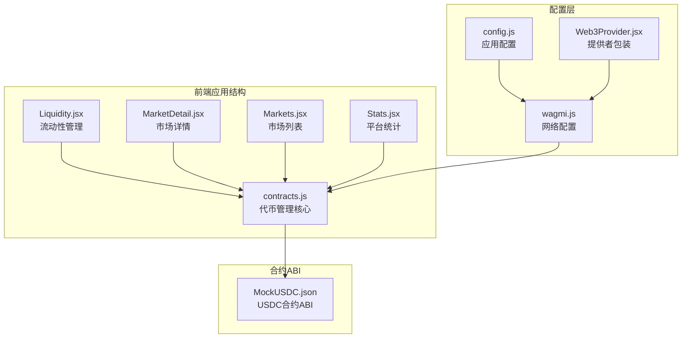
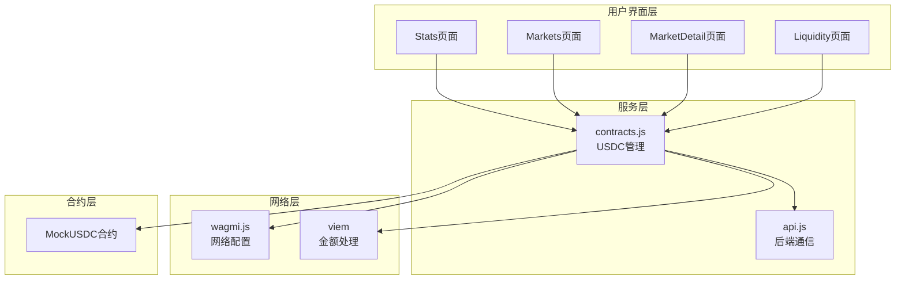
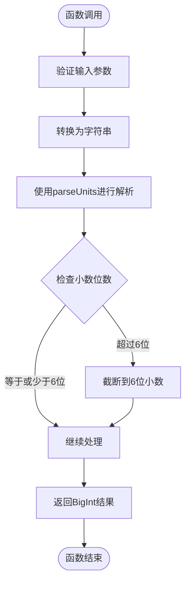
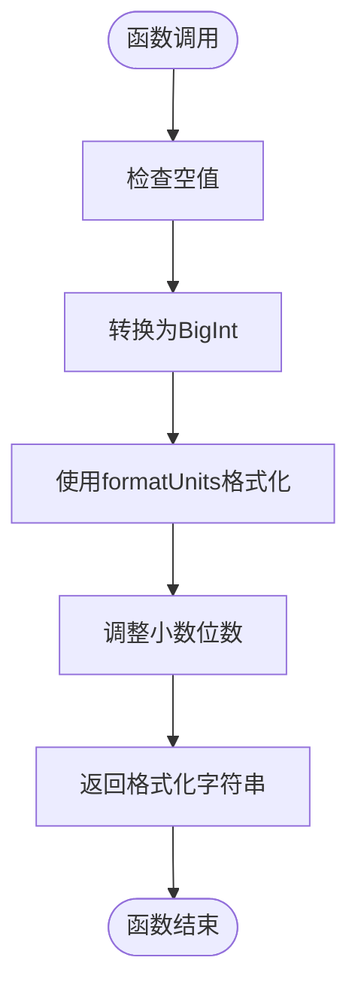
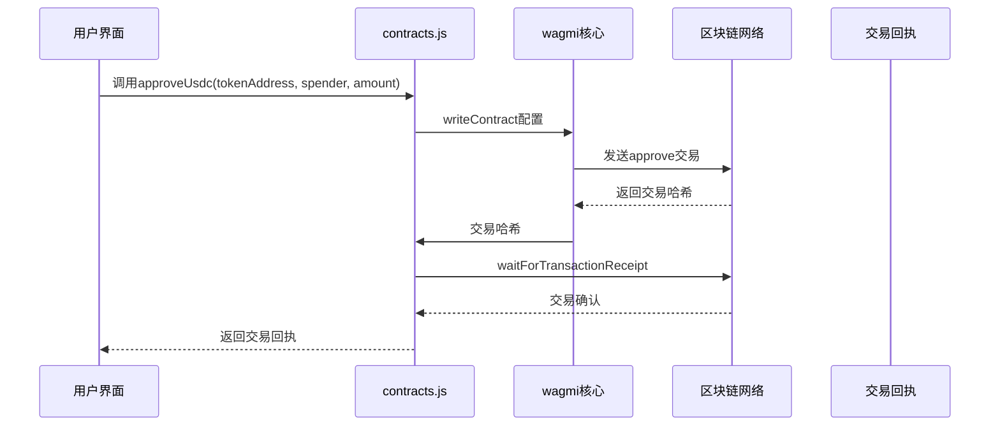
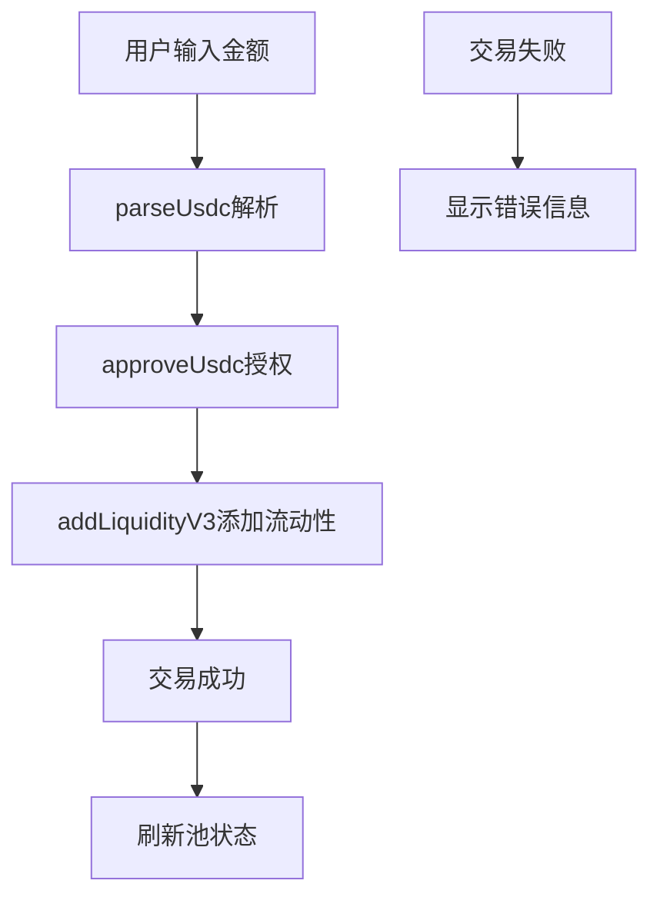
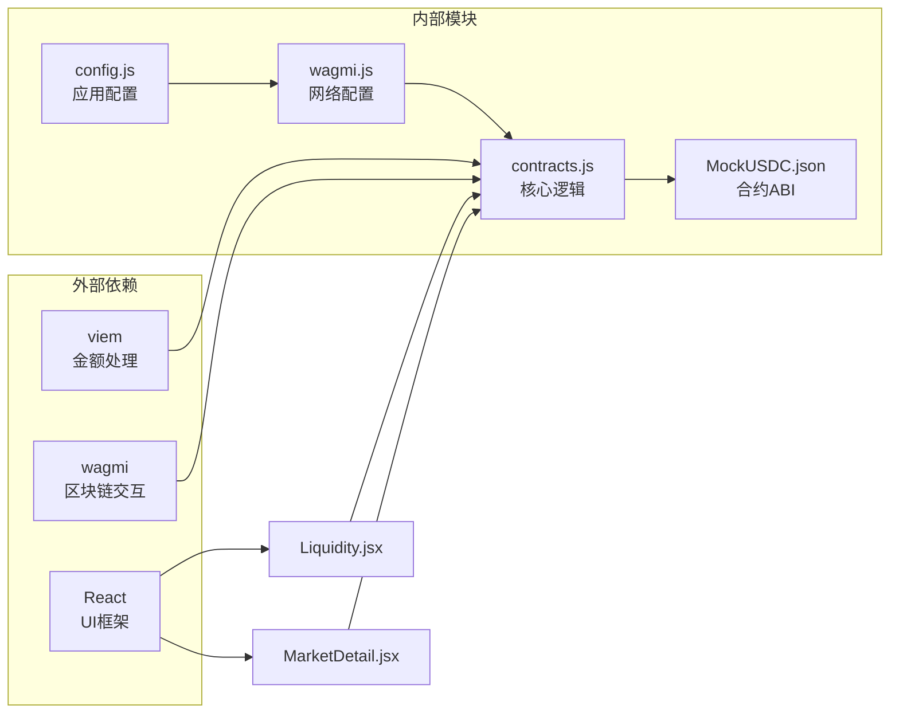

# USDC代币管理

<cite>
**本文档引用的文件**
- [contracts.js](file://src/services/contracts.js)
- [Liquidity.jsx](file://src/pages/Liquidity.jsx)
- [MarketDetail.jsx](file://src/pages/MarketDetail.jsx)
- [Markets.jsx](file://src/pages/Markets.jsx)
- [Stats.jsx](file://src/pages/Stats.jsx)
- [MockUSDC.json](file://src/abis/MockUSDC.json)
- [wagmi.js](file://src/wagmi.js)
- [config.js](file://src/config.js)
- [Web3Provider.jsx](file://src/providers/Web3Provider.jsx)
- [api.js](file://src/services/api.js)
</cite>

## 目录
1. [简介](#简介)
2. [项目结构](#项目结构)
3. [核心组件](#核心组件)
4. [架构概览](#架构概览)
5. [详细组件分析](#详细组件分析)
6. [依赖关系分析](#依赖关系分析)
7. [性能考虑](#性能考虑)
8. [故障排除指南](#故障排除指南)
9. [结论](#结论)

## 简介

本文档详细介绍了PredictionDIDSimple前端项目中的USDC代币管理系统。该系统实现了完整的USDC代币处理功能，包括金额解析与格式化、代币授权管理、以及在不同网络环境下的适配方法。系统基于wagmi和viem框架构建，提供了用户友好的界面来处理预测市场的资金操作。

## 项目结构

USDC代币管理系统主要分布在以下模块中：

**图表来源**
- [contracts.js](file://src/services/contracts.js#L1-L214)
- [Liquidity.jsx](file://src/pages/Liquidity.jsx#L1-L117)
- [MarketDetail.jsx](file://src/pages/MarketDetail.jsx#L1-L185)
- [wagmi.js](file://src/wagmi.js#L1-L37)

**章节来源**
- [contracts.js](file://src/services/contracts.js#L1-L214)
- [wagmi.js](file://src/wagmi.js#L1-L37)
- [config.js](file://src/config.js#L1-L23)

## 核心组件

### USDC代币精度管理

系统采用6位小数的USDC精度标准，这是稳定币的标准配置。所有金额处理都围绕这一精度进行设计。

**章节来源**
- [contracts.js](file://src/services/contracts.js#L16-L35)

### 金额解析与格式化函数

系统提供了两个核心函数来处理USDC金额：

1. **parseUsdc函数**：将人类可读的金额转换为链上整数
2. **formatUsdc函数**：将链上整数金额格式化为人类可读字符串

**章节来源**
- [contracts.js](file://src/services/contracts.js#L23-L35)

## 架构概览

USDC代币管理系统采用分层架构设计，确保了清晰的职责分离和良好的可维护性：

**图表来源**
- [contracts.js](file://src/services/contracts.js#L1-L214)
- [Liquidity.jsx](file://src/pages/Liquidity.jsx#L1-L117)
- [MarketDetail.jsx](file://src/pages/MarketDetail.jsx#L1-L185)

## 详细组件分析

### parseUsdc函数实现

parseUsdc函数负责将用户输入的人类可读金额转换为链上可用的整数格式：

**图表来源**
- [contracts.js](file://src/services/contracts.js#L23-L26)

**实现特点**：
- 使用viem的parseUnits函数确保精度
- 自动处理小数位数限制（6位）
- 返回BigInt类型以避免JavaScript精度丢失

**章节来源**
- [contracts.js](file://src/services/contracts.js#L23-L26)

### formatUsdc函数实现

formatUsdc函数将链上存储的整数金额转换为用户友好的字符串格式：

**图表来源**
- [contracts.js](file://src/services/contracts.js#L33-L35)

**实现特点**：
- 支持多种输入类型（string、number、bigint）
- 自动处理USDC的6位小数精度
- 返回标准化的字符串格式

**章节来源**
- [contracts.js](file://src/services/contracts.js#L33-L35)

### approveUsdc函数实现

approveUsdc函数实现了USDC代币的授权功能，这是进行任何代币交易的前提：

**图表来源**
- [contracts.js](file://src/services/contracts.js#L59-L69)

**实现流程**：
1. 调用writeContract发送approve交易
2. 等待交易在网络中确认
3. 返回详细的交易回执信息

**章节来源**
- [contracts.js](file://src/services/contracts.js#L59-L69)

### 在Liquidity页面中的应用

Liquidity页面展示了完整的USDC授权和流动性添加流程：

**图表来源**
- [Liquidity.jsx](file://src/pages/Liquidity.jsx#L52-L77)

**使用示例路径**：
- [Liquidity页面授权流程](file://src/pages/Liquidity.jsx#L63-L66)
- [Liquidity页面交易处理](file://src/pages/Liquidity.jsx#L52-L77)

**章节来源**
- [Liquidity.jsx](file://src/pages/Liquidity.jsx#L52-L77)

### 在MarketDetail页面中的应用

MarketDetail页面展示了不同市场类型的USDC处理方式：

**章节来源**
- [MarketDetail.jsx](file://src/pages/MarketDetail.jsx#L78-L110)

## 依赖关系分析

### 核心依赖关系

**图表来源**
- [contracts.js](file://src/services/contracts.js#L1-L8)
- [wagmi.js](file://src/wagmi.js#L1-L8)

### 网络适配机制

系统通过配置文件实现了灵活的网络适配：

**章节来源**
- [config.js](file://src/config.js#L1-L23)
- [wagmi.js](file://src/wagmi.js#L10-L23)

## 性能考虑

### 批量操作优化

系统在读取市场状态时采用了并行处理策略：

**章节来源**
- [contracts.js](file://src/services/contracts.js#L185-L212)

### 内存管理

- 使用BigInt类型避免JavaScript精度问题
- 合理的错误处理减少内存泄漏风险
- 及时清理组件状态避免内存累积

## 故障排除指南

### 常见问题及解决方案

1. **授权失败**
   - 检查钱包连接状态
   - 验证USDC合约地址
   - 确认账户有足够的USDC余额

2. **金额解析错误**
   - 确保输入为有效数字
   - 检查小数位数不超过6位
   - 验证输入格式正确

3. **网络配置问题**
   - 检查VITE_CHAIN_ID环境变量
   - 验证RPC节点连接状态
   - 确认网络ID与钱包一致

**章节来源**
- [Liquidity.jsx](file://src/pages/Liquidity.jsx#L73-L76)
- [MarketDetail.jsx](file://src/pages/MarketDetail.jsx#L106-L109)

## 结论

USDC代币管理系统展现了现代Web3应用的最佳实践：

1. **精确的金额处理**：通过6位小数精度确保稳定币的准确性
2. **清晰的职责分离**：将业务逻辑与网络交互分离
3. **完善的错误处理**：提供用户友好的错误反馈
4. **灵活的网络适配**：支持多网络环境部署
5. **优秀的用户体验**：简洁直观的操作界面

该系统为预测市场的资金管理提供了坚实的技术基础，为后续的功能扩展奠定了良好的架构基础。