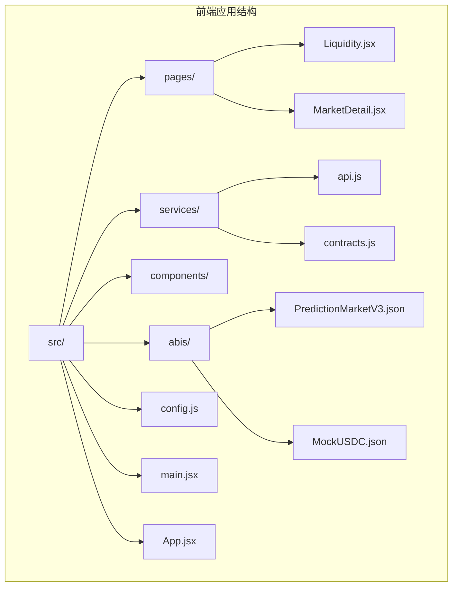
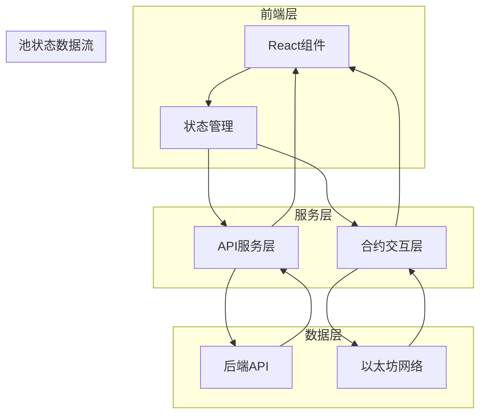
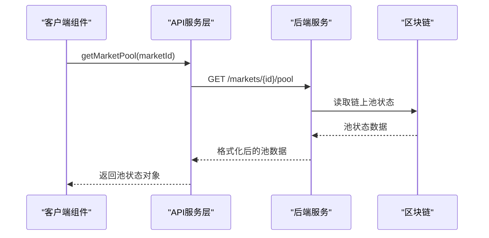
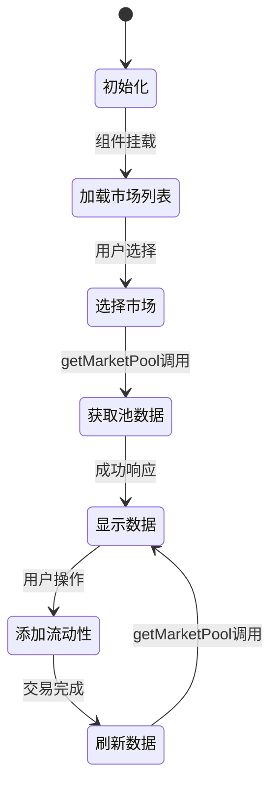
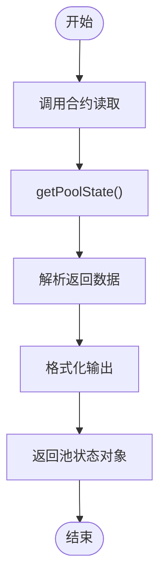
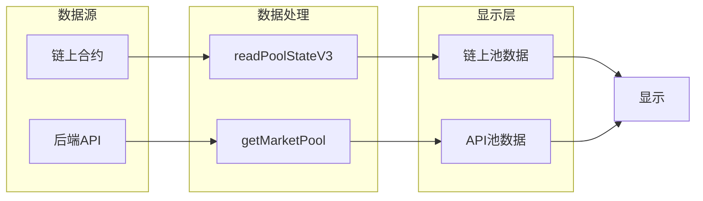
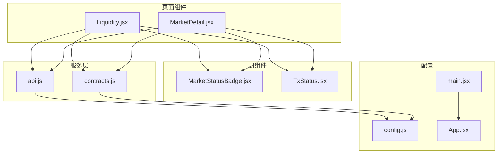

# 池状态监控

<cite>
**本文档引用的文件**
- [Liquidity.jsx](file://src/pages/Liquidity.jsx)
- [MarketDetail.jsx](file://src/pages/MarketDetail.jsx)
- [api.js](file://src/services/api.js)
- [contracts.js](file://src/services/contracts.js)
- [MarketStatusBadge.jsx](file://src/components/MarketStatusBadge.jsx)
- [config.js](file://src/config.js)
- [App.jsx](file://src/App.jsx)
- [main.jsx](file://src/main.jsx)
- [PredictionMarketV3.json](file://src/abis/PredictionMarketV3.json)
- [MockUSDC.json](file://src/abis/MockUSDC.json)
- [package.json](file://package.json)
</cite>

## 目录
1. [简介](#简介)
2. [项目结构](#项目结构)
3. [核心组件](#核心组件)
4. [架构概览](#架构概览)
5. [详细组件分析](#详细组件分析)
6. [依赖关系分析](#依赖关系分析)
7. [性能考虑](#性能考虑)
8. [故障排除指南](#故障排除指南)
9. [结论](#结论)

## 简介
本文档详细介绍了PredictionDIDSimple项目中的流动性池状态监控功能。该功能允许用户实时监控二元预测市场的流动性池状态，包括关键指标如reserve_yes、reserve_no、price_yes_bps等，并提供完整的数据刷新机制和实时更新策略。

## 项目结构
该项目采用React + Vite构建的前端应用，主要包含以下关键目录和文件：



**图表来源**
- [main.jsx](file://src/main.jsx#L1-L33)
- [App.jsx](file://src/App.jsx#L1-L67)

**章节来源**
- [main.jsx](file://src/main.jsx#L1-L33)
- [App.jsx](file://src/App.jsx#L1-L67)

## 核心组件
本项目中的池状态监控功能主要通过以下核心组件实现：

### 1. 流动性管理页面 (Liquidity.jsx)
这是专门用于流动性池监控和管理的页面组件，提供了完整的池状态展示和操作功能。

### 2. 市场详情页面 (MarketDetail.jsx)
该页面不仅展示市场详情，还集成了池状态监控功能，提供更全面的市场状态信息。

### 3. API服务层 (api.js)
封装了所有后端API调用，包括市场池状态获取功能。

### 4. 合约交互层 (contracts.js)
负责与区块链智能合约交互，获取链上池状态数据。

**章节来源**
- [Liquidity.jsx](file://src/pages/Liquidity.jsx#L1-L117)
- [MarketDetail.jsx](file://src/pages/MarketDetail.jsx#L1-L185)
- [api.js](file://src/services/api.js#L178-L181)
- [contracts.js](file://src/services/contracts.js#L167-L176)

## 架构概览
系统采用分层架构设计，实现了前后端分离的数据获取和处理机制：



**图表来源**
- [api.js](file://src/services/api.js#L29-L55)
- [contracts.js](file://src/services/contracts.js#L167-L176)

## 详细组件分析

### getMarketPool API分析
getMarketPool是池状态监控的核心API，负责从后端获取市场的池状态数据。

#### API定义


**图表来源**
- [api.js](file://src/services/api.js#L178-L181)
- [MarketDetail.jsx](file://src/pages/MarketDetail.jsx#L68-L68)

#### 数据结构说明
getMarketPool返回的池状态数据包含以下关键字段：

| 字段名 | 类型 | 描述 | 示例值 |
|--------|------|------|--------|
| market_type | string | 市场类型 | "BINARY_V3" |
| reserve_yes | string/number | Yes方向储备金 | "1000000000" |
| reserve_no | string/number | No方向储备金 | "500000000" |
| price_yes_bps | number | Yes方向价格（bps） | 6000 |

#### 实现细节
API调用通过统一的request函数处理，自动添加认证头并处理错误响应。

**章节来源**
- [api.js](file://src/services/api.js#L178-L181)
- [api.js](file://src/services/api.js#L29-L55)

### 流动性管理页面实现
Liquidity.jsx页面实现了完整的池状态监控功能：

#### 组件状态管理


**图表来源**
- [Liquidity.jsx](file://src/pages/Liquidity.jsx#L34-L49)

#### 关键功能实现

##### 1. 市场列表加载
组件挂载时自动获取所有开放状态的市场列表，并默认选择第一个市场。

##### 2. 池状态获取
当用户切换市场时，通过getMarketPool API获取当前市场的池状态数据。

##### 3. 实时数据展示
池状态数据通过格式化函数转换为人类可读的USDC金额显示。

##### 4. 交易集成
添加流动性操作完成后，自动刷新池数据以反映最新的状态。

**章节来源**
- [Liquidity.jsx](file://src/pages/Liquidity.jsx#L34-L77)

### 合约交互层分析
contracts.js模块提供了与区块链智能合约的直接交互能力：

#### V3池状态读取


**图表来源**
- [contracts.js](file://src/services/contracts.js#L167-L176)

#### 数据格式化
系统使用USDC小数位数（6位）进行金额格式化，确保显示精度。

**章节来源**
- [contracts.js](file://src/services/contracts.js#L167-L176)
- [contracts.js](file://src/services/contracts.js#L24-L35)

### 市场状态监控集成
MarketDetail.jsx页面集成了更全面的池状态监控功能：

#### 多源数据获取
页面同时从链上合约和后端API获取池状态数据，提供双重验证：



**图表来源**
- [MarketDetail.jsx](file://src/pages/MarketDetail.jsx#L64-L68)

**章节来源**
- [MarketDetail.jsx](file://src/pages/MarketDetail.jsx#L54-L75)

## 依赖关系分析

### 技术栈依赖
项目使用现代化的前端技术栈，关键依赖包括：

```mermaid
graph TB
subgraph "核心框架"
REACT[React 18.3.1]
ROUTER[react-router-dom 6.28.0]
end
subgraph "区块链集成"
VIEM[viem 2.21.54]
WAGMI[wagmi 2.14.1]
end
subgraph "认证系统"
SIWE[siwe 2.3.2]
end
subgraph "状态管理"
QUERY[@tanstack/react-query 5.62.2]
end
REACT --> ROUTER
REACT --> VIEM
VIEM --> WAGMI
REACT --> QUERY
REACT --> SIWE
```

**图表来源**
- [package.json](file://package.json#L12-L20)

### 组件间依赖关系


**图表来源**
- [Liquidity.jsx](file://src/pages/Liquidity.jsx#L6-L13)
- [MarketDetail.jsx](file://src/pages/MarketDetail.jsx#L8-L25)

**章节来源**
- [package.json](file://package.json#L12-L20)
- [Liquidity.jsx](file://src/pages/Liquidity.jsx#L6-L13)
- [MarketDetail.jsx](file://src/pages/MarketDetail.jsx#L8-L25)

## 性能考虑

### 数据缓存策略
系统采用了多层数据缓存机制：
1. **链上数据缓存**：通过wagmi的内置缓存机制
2. **API响应缓存**：利用@tanstack/react-query的缓存功能
3. **本地状态缓存**：React组件内部的状态管理

### 并发优化
- 使用Promise.all并行读取多个合约状态
- 合理的API调用频率控制
- 防抖和节流机制避免频繁刷新

### 内存管理
- 及时清理事件监听器
- 合理的组件卸载处理
- 避免内存泄漏的闭包引用

## 故障排除指南

### 常见问题及解决方案

#### 1. API调用失败
**症状**：池状态数据无法获取
**原因**：网络连接问题或后端服务不可用
**解决方案**：
- 检查网络连接状态
- 验证API基础URL配置
- 查看浏览器开发者工具的网络面板

#### 2. 合约交互错误
**症状**：添加流动性或读取池状态时报错
**原因**：钱包未连接或合约地址配置错误
**解决方案**：
- 确保钱包正确连接
- 验证合约地址配置
- 检查网络ID匹配

#### 3. 数据格式化问题
**症状**：显示的金额不正确
**原因**：USDC小数位数处理错误
**解决方案**：
- 确认USDC小数位数设置
- 检查金额解析和格式化函数

#### 4. 实时更新失效
**症状**：池状态不随市场变化而更新
**原因**：数据刷新机制未正确触发
**解决方案**：
- 检查useEffect依赖数组
- 确保正确的数据刷新时机

**章节来源**
- [api.js](file://src/services/api.js#L49-L54)
- [Liquidity.jsx](file://src/pages/Liquidity.jsx#L73-L76)

## 结论

本项目成功实现了完整的流动性池状态监控功能，具有以下特点：

### 技术优势
1. **多源数据验证**：同时从链上合约和后端API获取数据，确保准确性
2. **实时更新机制**：通过useEffect和状态管理实现数据的实时刷新
3. **用户友好界面**：提供直观的池状态展示和操作界面
4. **错误处理完善**：具备完善的异常处理和用户反馈机制

### 功能完整性
- 支持多种市场类型的池状态监控
- 提供完整的数据格式化和显示功能
- 集成交易操作与状态监控
- 具备良好的用户体验和交互设计

### 扩展性考虑
系统架构设计具有良好扩展性，可以轻松添加新的市场类型支持和监控指标，为未来的功能扩展奠定了坚实基础。